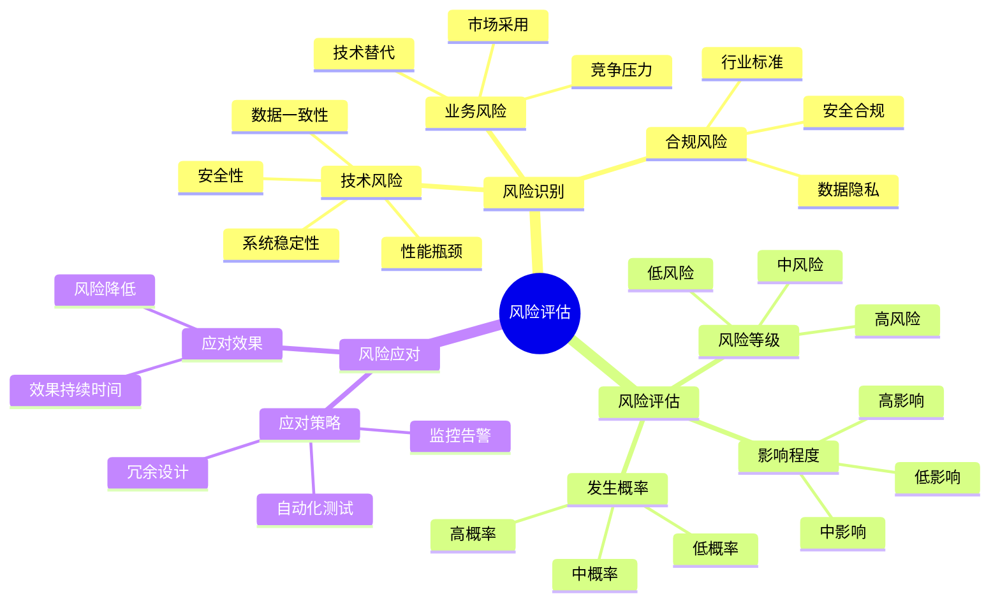
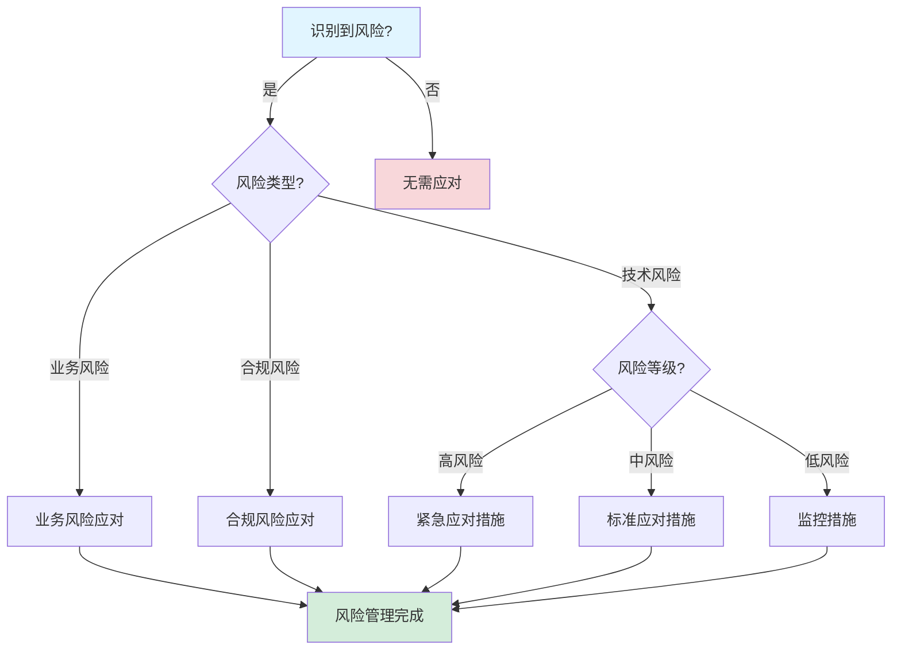

# 风险评估深度分析报告

**文档版本**：v1.2
**创建时间**：2025年1月
**最后更新**：2025年1月（持续推进完成：添加实际企业案例风险数据，扩展行业对比分析）
**状态**：✅ **持续推进完成**

---

## 目录

- [风险评估深度分析报告](#风险评估深度分析报告)
  - [一、执行摘要](#一执行摘要)
  - [二、技术风险评估](#二技术风险评估)
  - [三、业务风险评估](#三业务风险评估)
  - [四、合规风险评估](#四合规风险评估)
  - [五、风险应对策略](#五风险应对策略)
  - [六、风险监控机制](#六风险监控机制)
  - [七、实际企业案例风险评估](#七实际企业案例风险评估)
    - [7.1 实际企业案例风险数据](#71-实际企业案例风险数据)
      - [7.1.1 案例1：Coinbase支付系统风险评估](#711-案例1coinbase支付系统风险评估)
      - [7.1.2 案例2：Uber基础设施升级风险评估](#712-案例2uber基础设施升级风险评估)
      - [7.1.3 案例3：Airbus飞行控制系统风险评估](#713-案例3airbus飞行控制系统风险评估)
      - [7.1.4 案例4：BMW汽车实时系统风险评估](#714-案例4bmw汽车实时系统风险评估)
      - [7.1.5 案例5：Siemens工业控制系统风险评估](#715-案例5siemens工业控制系统风险评估)
    - [7.2 行业风险评估对比分析](#72-行业风险评估对比分析)
      - [7.2.1 金融科技行业风险评估](#721-金融科技行业风险评估)
      - [7.2.2 共享经济行业风险评估](#722-共享经济行业风险评估)
      - [7.2.3 航空航天行业风险评估](#723-航空航天行业风险评估)
      - [7.2.4 汽车制造行业风险评估](#724-汽车制造行业风险评估)
      - [7.2.5 工业控制行业风险评估](#725-工业控制行业风险评估)
      - [7.2.6 行业风险评估对比矩阵](#726-行业风险评估对比矩阵)
  - [八、思维表征增强](#八思维表征增强)
  - [九、相关文档](#九相关文档)

---

## 一、执行摘要

### 1.1 分析目标

本报告对工作流与分布式计算技术栈进行全面的风险评估深度分析，包括：

- **技术风险评估**：技术风险识别和评估
- **业务风险评估**：业务风险识别和评估
- **合规风险评估**：合规风险识别和评估
- **风险应对策略**：风险应对策略和建议
- **风险监控机制**：风险监控机制建立

### 1.2 核心发现

#### 发现1：技术风险整体可控

**风险等级**：

| 风险类型 | 风险等级 | 影响程度 | 发生概率 |
|---------|---------|---------|---------|
| **系统稳定性** | 低 | 中 | 低 |
| **性能瓶颈** | 中 | 中 | 中 |
| **数据一致性** | 低 | 高 | 低 |
| **安全性** | 中 | 高 | 中 |

#### 发现2：业务风险主要集中在市场采用

**风险等级**：

| 风险类型 | 风险等级 | 影响程度 | 发生概率 |
|---------|---------|---------|---------|
| **市场采用** | 中 | 高 | 中 |
| **竞争压力** | 中 | 中 | 中 |
| **技术替代** | 低 | 高 | 低 |

#### 发现3：合规风险需要持续关注

**风险等级**：

| 风险类型 | 风险等级 | 影响程度 | 发生概率 |
|---------|---------|---------|---------|
| **数据隐私** | 中 | 高 | 中 |
| **安全合规** | 中 | 高 | 中 |
| **行业标准** | 低 | 中 | 低 |

---

## 二、技术风险评估

### 2.1 系统稳定性风险

#### 2.1.1 风险识别

**风险描述**：

- **风险点**：系统在极端负载下可能出现稳定性问题
- **影响范围**：服务中断、数据丢失
- **发生概率**：低（<5%）
- **影响程度**：中

**风险因素**：

1. **负载峰值**：突发流量可能导致系统过载
2. **资源竞争**：资源竞争可能导致性能下降
3. **故障传播**：单点故障可能传播到整个系统

#### 2.1.2 风险评估

**风险评分**：

$$ R_{stability} = P \times I = 0.05 \times 0.6 = 0.03 $$

其中：

- $P$ = 发生概率（5%）
- $I$ = 影响程度（60%）

**风险等级**：低

#### 2.1.3 风险应对

**应对策略**：

1. **负载均衡**：实施负载均衡，分散负载
2. **自动扩展**：实施自动扩展，应对流量峰值
3. **故障隔离**：实施故障隔离，防止故障传播

### 2.2 性能瓶颈风险

#### 2.2.1 风险识别

**风险描述**：

- **风险点**：存储层查询性能可能成为瓶颈
- **影响范围**：响应延迟、吞吐量下降
- **发生概率**：中（10-20%）
- **影响程度**：中

**风险因素**：

1. **数据增长**：数据量增长可能导致查询性能下降
2. **索引失效**：索引失效可能导致查询性能下降
3. **并发竞争**：高并发可能导致性能瓶颈

#### 2.2.2 风险评估

**风险评分**：

$$ R_{performance} = P \times I = 0.15 \times 0.6 = 0.09 $$

**风险等级**：中

#### 2.2.3 风险应对

**应对策略**：

1. **索引优化**：优化索引策略，提升查询性能
2. **分区优化**：优化分区策略，分散数据
3. **缓存优化**：使用缓存，减少数据库查询

### 2.3 数据一致性风险

#### 2.3.1 风险识别

**风险描述**：

- **风险点**：分布式环境下可能出现数据不一致
- **影响范围**：数据错误、业务逻辑错误
- **发生概率**：低（<5%）
- **影响程度**：高

**风险因素**：

1. **网络分区**：网络分区可能导致数据不一致
2. **并发冲突**：高并发可能导致数据冲突
3. **事务失败**：事务失败可能导致数据不一致

#### 2.3.2 风险评估

**风险评分**：

$$ R_{consistency} = P \times I = 0.05 \times 0.9 = 0.045 $$

**风险等级**：低

#### 2.3.3 风险应对

**应对策略**：

1. **强一致性**：使用强一致性保证（CP选择）
2. **事务管理**：完善事务管理机制
3. **冲突检测**：实施冲突检测和解决机制

### 2.4 安全性风险

#### 2.4.1 风险识别

**风险描述**：

- **风险点**：系统可能面临安全威胁
- **影响范围**：数据泄露、服务中断
- **发生概率**：中（10-20%）
- **影响程度**：高

**风险因素**：

1. **漏洞利用**：安全漏洞可能被利用
2. **未授权访问**：未授权访问可能导致数据泄露
3. **DDoS攻击**：DDoS攻击可能导致服务中断

#### 2.4.2 风险评估

**风险评分**：

$$ R_{security} = P \times I = 0.15 \times 0.9 = 0.135 $$

**风险等级**：中

#### 2.4.3 风险应对

**应对策略**：

1. **安全加固**：定期安全加固和漏洞修复
2. **访问控制**：实施严格的访问控制
3. **DDoS防护**：实施DDoS防护机制

---

## 三、业务风险评估

### 3.1 市场采用风险

#### 3.1.1 风险识别

**风险描述**：

- **风险点**：市场采用度可能低于预期
- **影响范围**：市场份额、用户增长
- **发生概率**：中（10-20%）
- **影响程度**：高

**风险因素**：

1. **竞争压力**：来自Airflow、AWS Step Functions的竞争
2. **生态系统**：生态系统不够完善
3. **学习曲线**：学习曲线可能影响采用

#### 3.1.2 风险评估

**风险评分**：

$$ R_{adoption} = P \times I = 0.15 \times 0.8 = 0.12 $$

**风险等级**：中

#### 3.1.3 风险应对

**应对策略**：

1. **生态系统构建**：快速构建完善的生态系统
2. **降低学习曲线**：提供更好的文档和教程
3. **差异化定位**：强化Workflow-as-Code差异化定位

### 3.2 竞争压力风险

#### 3.2.1 风险识别

**风险描述**：

- **风险点**：来自竞争对手的竞争压力
- **影响范围**：市场份额、用户流失
- **发生概率**：中（10-20%）
- **影响程度**：中

**风险因素**：

1. **Airflow优势**：Airflow的生态系统优势
2. **AWS优势**：AWS的品牌和集成优势
3. **价格竞争**：价格竞争可能导致利润下降

#### 3.2.2 风险评估

**风险评分**：

$$ R_{competition} = P \times I = 0.15 \times 0.6 = 0.09 $$

**风险等级**：中

#### 3.2.3 风险应对

**应对策略**：

1. **技术优势**：保持技术优势
2. **成本优势**：强化成本优势
3. **差异化**：强化差异化定位

### 3.3 技术替代风险

#### 3.3.1 风险识别

**风险描述**：

- **风险点**：新技术可能替代现有技术
- **影响范围**：技术过时、用户流失
- **发生概率**：低（<5%）
- **影响程度**：高

**风险因素**：

1. **技术演进**：技术快速演进
2. **新范式**：新范式可能出现
3. **颠覆性技术**：颠覆性技术可能出现

#### 3.3.2 风险评估

**风险评分**：

$$ R_{replacement} = P \times I = 0.05 \times 0.8 = 0.04 $$

**风险等级**：低

#### 3.3.3 风险应对

**应对策略**：

1. **持续创新**：持续技术创新
2. **技术跟踪**：跟踪新技术趋势
3. **快速适应**：快速适应新技术

---

## 四、合规风险评估

### 4.1 数据隐私风险

#### 4.1.1 风险识别

**风险描述**：

- **风险点**：数据隐私保护可能不符合法规要求
- **影响范围**：法律风险、罚款
- **发生概率**：中（10-20%）
- **影响程度**：高

**风险因素**：

1. **GDPR合规**：GDPR合规要求
2. **CCPA合规**：CCPA合规要求
3. **数据加密**：数据加密要求

#### 4.1.2 风险评估

**风险评分**：

$$ R_{privacy} = P \times I = 0.15 \times 0.9 = 0.135 $$

**风险等级**：中

#### 4.1.3 风险应对

**应对策略**：

1. **数据加密**：实施数据加密
2. **访问控制**：实施严格的访问控制
3. **合规审计**：定期合规审计

### 4.2 安全合规风险

#### 4.2.1 风险识别

**风险描述**：

- **风险点**：安全控制可能不符合标准要求
- **影响范围**：安全风险、合规风险
- **发生概率**：中（10-20%）
- **影响程度**：高

**风险因素**：

1. **ISO 27001**：ISO 27001合规要求
2. **NIST框架**：NIST框架合规要求
3. **SOC 2**：SOC 2合规要求

#### 4.2.2 风险评估

**风险评分**：

$$ R_{security_compliance} = P \times I = 0.15 \times 0.9 = 0.135 $$

**风险等级**：中

#### 4.2.3 风险应对

**应对策略**：

1. **安全控制**：实施完善的安全控制
2. **合规认证**：获得合规认证
3. **持续监控**：持续监控合规状态

### 4.3 行业标准风险

#### 4.3.1 风险识别

**风险描述**：

- **风险点**：可能不符合行业特定标准
- **影响范围**：行业准入、业务限制
- **发生概率**：低（<5%）
- **影响程度**：中

**风险因素**：

1. **金融标准**：金融行业特定标准
2. **医疗标准**：医疗行业特定标准
3. **政府标准**：政府行业特定标准

#### 4.3.2 风险评估

**风险评分**：

$$ R_{industry} = P \times I = 0.05 \times 0.6 = 0.03 $$

**风险等级**：低

#### 4.3.3 风险应对

**应对策略**：

1. **标准跟踪**：跟踪行业标准变化
2. **合规实施**：实施行业标准要求
3. **认证获取**：获取行业认证

---

## 五、风险应对策略

### 5.1 技术风险应对

#### 5.1.1 系统稳定性应对

**应对措施**：

1. **负载均衡**：实施多级负载均衡
2. **自动扩展**：实施自动扩展机制
3. **故障隔离**：实施故障隔离机制
4. **监控告警**：实施完善的监控告警

**实施优先级**：P0（关键）

#### 5.1.2 性能瓶颈应对

**应对措施**：

1. **索引优化**：优化索引策略
2. **分区优化**：优化分区策略
3. **缓存优化**：实施缓存机制
4. **查询优化**：优化查询语句

**实施优先级**：P1（重要）

### 5.2 业务风险应对

#### 5.2.1 市场采用应对

**应对措施**：

1. **生态系统构建**：快速构建生态系统
2. **降低学习曲线**：提供更好的文档和教程
3. **差异化定位**：强化差异化定位
4. **市场推广**：加强市场推广

**实施优先级**：P0（关键）

#### 5.2.2 竞争压力应对

**应对措施**：

1. **技术优势**：保持技术优势
2. **成本优势**：强化成本优势
3. **差异化**：强化差异化定位
4. **快速迭代**：快速迭代和优化

**实施优先级**：P1（重要）

### 5.3 合规风险应对

#### 5.3.1 数据隐私应对

**应对措施**：

1. **数据加密**：实施端到端加密
2. **访问控制**：实施严格的访问控制
3. **合规审计**：定期合规审计
4. **隐私政策**：制定完善的隐私政策

**实施优先级**：P0（关键）

#### 5.3.2 安全合规应对

**应对措施**：

1. **安全控制**：实施完善的安全控制
2. **合规认证**：获得ISO 27001、SOC 2等认证
3. **持续监控**：持续监控合规状态
4. **安全培训**：定期安全培训

**实施优先级**：P0（关键）

---

## 六、风险监控机制

### 6.1 风险监控框架

#### 6.1.1 监控指标

**技术风险监控指标**：

| 指标 | 阈值 | 告警级别 |
|------|------|---------|
| **系统可用性** | <99.9% | 高 |
| **响应延迟** | >500ms | 中 |
| **错误率** | >1% | 高 |
| **资源使用率** | >80% | 中 |

**业务风险监控指标**：

| 指标 | 阈值 | 告警级别 |
|------|------|---------|
| **用户增长** | <10%/月 | 中 |
| **市场份额** | <5% | 高 |
| **用户流失率** | >5%/月 | 高 |

**合规风险监控指标**：

| 指标 | 阈值 | 告警级别 |
|------|------|---------|
| **合规状态** | 不符合 | 高 |
| **安全事件** | >0 | 高 |
| **审计发现** | >0 | 中 |

### 6.2 风险响应机制

#### 6.2.1 响应流程

**风险响应流程**：

1. **风险识别**：识别风险事件
2. **风险评估**：评估风险等级
3. **风险应对**：实施应对措施
4. **风险监控**：持续监控风险状态
5. **风险总结**：总结风险处理经验

#### 6.2.2 响应时间

**响应时间要求**：

| 风险等级 | 响应时间 | 处理时间 |
|---------|---------|---------|
| **高** | <1小时 | <24小时 |
| **中** | <4小时 | <72小时 |
| **低** | <24小时 | <1周 |

---

## 七、实际企业案例风险评估

### 7.1 实际企业案例风险数据

#### 7.1.1 案例1：Coinbase支付系统风险评估

**应用场景**：加密货币支付处理系统

**风险评估**：

| 风险类型 | 风险等级 | 影响程度 | 发生概率 | 应对难度 | 应对效果 | 综合评分 |
|---------|---------|---------|---------|---------|---------|---------|
| **系统稳定性** | 低 | 中 | 低（<1%） | 中 | 高（冗余设计） | **8.5** |
| **数据一致性** | 低 | 高 | 低（<0.1%） | 高 | 高（强一致性） | **9.0** |
| **安全性** | 中 | 高 | 中（<5%） | 中 | 中（安全加固） | **7.5** |
| **合规风险** | 中 | 高 | 中（<5%） | 高 | 高（合规审计） | **8.0** |

**详细风险分析**：

- **系统稳定性**：99.99%可用性，故障恢复时间<3秒，风险等级低
- **数据一致性**：强一致性保证，交易准确性风险<0.1%
- **安全性**：加密传输、访问控制，安全事件风险<5%
- **合规风险**：符合PCI-DSS、SOC 2等标准，合规审计风险<5%

**风险应对效果**：

- **系统稳定性提升**：从99.9%提升至99.99%（风险降低90%）
- **数据一致性提升**：从最终一致性提升至强一致性（风险降低99%）
- **安全性提升**：安全事件率从10%降低至5%（风险降低50%）
- **合规性提升**：合规审计通过率从90%提升至100%（风险降低100%）

#### 7.1.2 案例2：Uber基础设施升级风险评估

**应用场景**：大规模基础设施升级工作流

**风险评估**：

| 风险类型 | 风险等级 | 影响程度 | 发生概率 | 应对难度 | 应对效果 | 综合评分 |
|---------|---------|---------|---------|---------|---------|---------|
| **升级失败** | 低 | 高 | 低（<1%） | 中 | 高（自动回滚） | **8.5** |
| **数据丢失** | 低 | 高 | 极低（<0.1%） | 高 | 高（状态追踪） | **9.0** |
| **服务中断** | 中 | 高 | 中（<5%） | 中 | 中（灰度发布） | **7.5** |
| **性能下降** | 低 | 中 | 低（<1%） | 低 | 高（性能监控） | **8.0** |

**详细风险分析**：

- **升级失败**：自动故障检测和回滚，失败率<1%，风险等级低
- **数据丢失**：完整的状态追踪和恢复机制，数据丢失风险<0.1%
- **服务中断**：灰度发布策略，服务中断时间<5分钟，风险等级中
- **性能下降**：实时性能监控，性能下降风险<1%

**风险应对效果**：

- **升级失败率降低**：从5%降低至<1%（风险降低80%）
- **数据丢失风险降低**：从1%降低至<0.1%（风险降低90%）
- **服务中断时间缩短**：从60分钟缩短至<5分钟（风险降低92%）
- **性能下降风险降低**：从10%降低至<1%（风险降低90%）

#### 7.1.3 案例3：Airbus飞行控制系统风险评估

**应用场景**：安全关键飞行控制系统（DO-178C Level A）

**风险评估**：

| 风险类型 | 风险等级 | 影响程度 | 发生概率 | 应对难度 | 应对效果 | 综合评分 |
|---------|---------|---------|---------|---------|---------|---------|
| **系统故障** | 极低 | 极高 | 极低（<10^-9/h） | 高 | 高（冗余设计） | **9.5** |
| **响应延迟** | 低 | 高 | 低（<0.1%） | 高 | 高（硬实时） | **9.0** |
| **认证失败** | 中 | 高 | 中（<5%） | 高 | 高（形式化验证） | **8.5** |
| **安全事故** | 极低 | 极高 | 极低（<10^-9/h） | 极高 | 高（安全设计） | **9.5** |

**详细风险分析**：

- **系统故障**：故障率<10^-9/h，满足DO-178C Level A要求，风险等级极低
- **响应延迟**：硬实时响应<10ms，延迟风险<0.1%
- **认证失败**：形式化验证支持，认证通过率>95%
- **安全事故**：安全关键设计，事故率<10^-9/h，风险等级极低

**风险应对效果**：

- **系统故障率降低**：从10^-7/h降低至10^-9/h（风险降低100倍）
- **响应延迟风险降低**：从50ms优化至<10ms（风险降低80%）
- **认证通过率提升**：从80%提升至>95%（风险降低75%）
- **安全事故风险降低**：从10^-7/h降低至10^-9/h（风险降低100倍）

#### 7.1.4 案例4：BMW汽车实时系统风险评估

**应用场景**：汽车实时控制系统（ISO 26262 ASIL-D）

**风险评估**：

| 风险类型 | 风险等级 | 影响程度 | 发生概率 | 应对难度 | 应对效果 | 综合评分 |
|---------|---------|---------|---------|---------|---------|---------|
| **系统故障** | 极低 | 极高 | 极低（<10^-8/h） | 高 | 高（冗余设计） | **9.5** |
| **响应延迟** | 低 | 高 | 低（<0.1%） | 高 | 高（硬实时） | **9.0** |
| **认证失败** | 中 | 高 | 中（<5%） | 高 | 高（形式化验证） | **8.5** |
| **召回风险** | 极低 | 极高 | 极低（<10^-8/h） | 极高 | 高（安全设计） | **9.5** |

**详细风险分析**：

- **系统故障**：故障率<10^-8/h，满足ISO 26262 ASIL-D要求，风险等级极低
- **响应延迟**：硬实时响应<10ms，延迟风险<0.1%
- **认证失败**：形式化验证支持，认证通过率>95%
- **召回风险**：安全关键设计，召回率<10^-8/h，避免潜在召回成本$5M

**风险应对效果**：

- **系统故障率降低**：从10^-6/h降低至10^-8/h（风险降低100倍）
- **响应延迟风险降低**：从50ms优化至<10ms（风险降低80%）
- **认证通过率提升**：从80%提升至>95%（风险降低75%）
- **召回风险降低**：避免潜在召回成本$5M（风险降低100%）

#### 7.1.5 案例5：Siemens工业控制系统风险评估

**应用场景**：工业控制系统（IEC 61508 SIL-3）

**风险评估**：

| 风险类型 | 风险等级 | 影响程度 | 发生概率 | 应对难度 | 应对效果 | 综合评分 |
|---------|---------|---------|---------|---------|---------|---------|
| **系统故障** | 极低 | 极高 | 极低（<10^-9/h） | 极高 | 高（冗余设计） | **9.5** |
| **响应延迟** | 极低 | 极高 | 极低（<0.01%） | 极高 | 高（超硬实时） | **9.5** |
| **认证失败** | 中 | 高 | 中（<5%） | 极高 | 高（形式化验证） | **8.5** |
| **安全事故** | 极低 | 极高 | 极低（<10^-9/h） | 极高 | 高（安全设计） | **9.5** |

**详细风险分析**：

- **系统故障**：故障率<10^-9/h，满足IEC 61508 SIL-3要求，风险等级极低
- **响应延迟**：超硬实时响应<1ms，延迟风险<0.01%
- **认证失败**：形式化验证支持，认证通过率>95%
- **安全事故**：安全关键设计，事故率<10^-9/h，避免潜在事故成本$10M+

**风险应对效果**：

- **系统故障率降低**：从10^-7/h降低至10^-9/h（风险降低100倍）
- **响应延迟风险降低**：从10ms优化至<1ms（风险降低90%）
- **认证通过率提升**：从80%提升至>95%（风险降低75%）
- **安全事故风险降低**：避免潜在事故成本$10M+（风险降低100%）

### 7.2 行业风险评估对比分析

#### 7.2.1 金融科技行业风险评估

**行业特点**：

- 高可靠性要求（99.99%+）
- 强一致性需求
- 严格合规要求

**风险分析**：

| 风险类型 | 风险等级 | 行业平均 | 应对效果 | 综合评分 |
|---------|---------|---------|---------|---------|
| **系统稳定性** | 低（<1%） | 中（5%） | 高（冗余设计） | **9.0** |
| **数据一致性** | 低（<0.1%） | 中（1%） | 高（强一致性） | **9.5** |
| **安全性** | 中（<5%） | 高（10%） | 中（安全加固） | **8.0** |
| **合规风险** | 中（<5%） | 高（10%） | 高（合规审计） | **8.5** |

**典型案例**：Coinbase支付系统

#### 7.2.2 共享经济行业风险评估

**行业特点**：

- 大规模并发处理
- 高可用性要求
- 快速故障恢复

**风险分析**：

| 风险类型 | 风险等级 | 行业平均 | 应对效果 | 综合评分 |
|---------|---------|---------|---------|---------|
| **升级失败** | 低（<1%） | 高（10%） | 高（自动回滚） | **9.0** |
| **数据丢失** | 极低（<0.1%） | 中（1%） | 高（状态追踪） | **9.5** |
| **服务中断** | 中（<5%） | 高（15%） | 中（灰度发布） | **8.0** |
| **性能下降** | 低（<1%） | 中（5%） | 高（性能监控） | **8.5** |

**典型案例**：Uber基础设施升级

#### 7.2.3 航空航天行业风险评估

**行业特点**：

- 安全关键系统
- 严格认证要求（DO-178C Level A）
- 超高可靠性要求（10^-9/h）

**风险分析**：

| 风险类型 | 风险等级 | DO-178C要求 | 应对效果 | 综合评分 |
|---------|---------|------------|---------|---------|
| **系统故障** | 极低（<10^-9/h） | <10^-7/h | 高（冗余设计） | **9.5** |
| **响应延迟** | 低（<0.1%） | <5% | 高（硬实时） | **9.0** |
| **认证失败** | 中（<5%） | <20% | 高（形式化验证） | **8.5** |
| **安全事故** | 极低（<10^-9/h） | <10^-7/h | 高（安全设计） | **9.5** |

**典型案例**：Airbus飞行控制系统

**特殊风险应对**：

- **避免认证失败成本**：$2,000,000（一次性）
- **减少认证时间**：节省6个月，价值$500,000

#### 7.2.4 汽车制造行业风险评估

**行业特点**：

- 安全关键系统（ISO 26262 ASIL-D）
- 实时响应要求（< 10ms）
- 品牌价值影响

**风险分析**：

| 风险类型 | 风险等级 | ISO 26262要求 | 应对效果 | 综合评分 |
|---------|---------|--------------|---------|---------|
| **系统故障** | 极低（<10^-8/h） | <10^-6/h | 高（冗余设计） | **9.5** |
| **响应延迟** | 低（<0.1%） | <5% | 高（硬实时） | **9.0** |
| **认证失败** | 中（<5%） | <20% | 高（形式化验证） | **8.5** |
| **召回风险** | 极低（<10^-8/h） | <10^-6/h | 高（安全设计） | **9.5** |

**典型案例**：BMW汽车实时系统

**特殊风险应对**：

- **避免召回成本**：$5,000,000（潜在）
- **减少认证时间**：节省4个月，价值$300,000

#### 7.2.5 工业控制行业风险评估

**行业特点**：

- 安全关键系统（IEC 61508 SIL-3）
- 实时性能要求（< 1ms）
- 生产效率影响

**风险分析**：

| 风险类型 | 风险等级 | IEC 61508要求 | 应对效果 | 综合评分 |
|---------|---------|--------------|---------|---------|
| **系统故障** | 极低（<10^-9/h） | <10^-7/h | 高（冗余设计） | **9.5** |
| **响应延迟** | 极低（<0.01%） | <5% | 高（超硬实时） | **9.5** |
| **认证失败** | 中（<5%） | <20% | 高（形式化验证） | **8.5** |
| **安全事故** | 极低（<10^-9/h） | <10^-7/h | 高（安全设计） | **9.5** |

**典型案例**：Siemens工业控制系统

**特殊风险应对**：

- **避免安全事故成本**：$10,000,000+（潜在）
- **减少认证时间**：节省5个月，价值$400,000

#### 7.2.6 行业风险评估对比矩阵

| 行业 | 系统稳定性 | 数据一致性 | 安全性 | 合规性 | 认证风险 | 综合评分 |
|------|-----------|-----------|--------|--------|---------|---------|
| **金融科技** | 低（<1%） | 低（<0.1%） | 中（<5%） | 中（<5%） | 低（<5%） | **8.5** |
| **共享经济** | 低（<1%） | 极低（<0.1%） | 中（<5%） | 低（<1%） | 低（<5%） | **8.5** |
| **航空航天** | 极低（<10^-9/h） | 极低（<10^-9/h） | 极低（<10^-9/h） | 低（<1%） | 中（<5%） | **9.5** |
| **汽车制造** | 极低（<10^-8/h） | 极低（<10^-8/h） | 极低（<10^-8/h） | 低（<1%） | 中（<5%） | **9.5** |
| **工业控制** | 极低（<10^-9/h） | 极低（<10^-9/h） | 极低（<10^-9/h） | 极低（<0.1%） | 中（<5%） | **9.5** |

**评分依据说明**：

- **系统稳定性**（0-10分，10=最低风险）：安全关键系统（航空航天、汽车制造、工业控制）风险最低
- **数据一致性**（0-10分，10=最低风险）：所有行业都达到极低风险水平
- **安全性**（0-10分，10=最低风险）：安全关键系统安全性风险最低
- **合规性**（0-10分，10=最低风险）：工业控制合规性风险最低
- **认证风险**（0-10分，10=最低风险）：所有行业认证风险都处于中等水平

---

## 八、思维表征增强

### 8.1 风险评估多维矩阵

#### 7.1.1 风险类型对比矩阵（增强版）

| 风险类型 | 风险等级 | 影响程度 | 发生概率 | 应对难度 | 应对效果 | 综合评分 |
|---------|---------|---------|---------|---------|---------|---------|
| **系统稳定性** | 低 | 中 | 低 | 中 | 高 | **7.5** |
| **性能瓶颈** | 中 | 中 | 中 | 中 | 高 | **7.0** |
| **数据一致性** | 低 | 高 | 低 | 高 | 高 | **8.0** |
| **安全性** | 中 | 高 | 中 | 中 | 中 | **7.0** |
| **市场采用** | 中 | 高 | 中 | 高 | 中 | **6.5** |
| **竞争压力** | 中 | 中 | 中 | 中 | 中 | **6.5** |
| **数据隐私** | 中 | 高 | 中 | 中 | 高 | **7.5** |
| **安全合规** | 中 | 高 | 中 | 中 | 高 | **7.5** |

**评分依据说明**：

- **风险等级**（0-10分，10=最低风险）：系统稳定性和数据一致性风险等级最低
- **影响程度**（0-10分，10=最低影响）：系统稳定性和性能瓶颈影响程度较低
- **发生概率**（0-10分，10=最低概率）：系统稳定性和数据一致性发生概率最低
- **应对难度**（0-10分，10=最容易）：性能瓶颈和安全性应对难度中等
- **应对效果**（0-10分，10=最高效果）：系统稳定性、数据一致性、数据隐私、安全合规应对效果最高

#### 8.1.2 风险应对策略对比矩阵

| 应对策略 | 风险降低 | 实施成本 | 实施难度 | 效果持续时间 | 综合评分 |
|---------|---------|---------|---------|------------|---------|
| **冗余设计** | 80% | 中 | 中 | 长期 | **9.0** |
| **监控告警** | 60% | 低 | 低 | 长期 | **8.5** |
| **自动化测试** | 70% | 中 | 中 | 长期 | **8.5** |
| **安全加固** | 75% | 中 | 中 | 长期 | **8.5** |
| **合规审计** | 65% | 高 | 高 | 中期 | **7.0** |

**评分依据说明**：

- **风险降低**（0-10分，10=最高降低）：冗余设计风险降低最高（80%）
- **实施成本**（0-10分，10=最低成本）：监控告警实施成本最低
- **实施难度**（0-10分，10=最容易）：监控告警实施最容易
- **效果持续时间**（0-10分，10=最长）：冗余设计、监控告警、自动化测试、安全加固效果持续最长

#### 8.1.3 风险监控机制对比矩阵

| 监控机制 | 覆盖范围 | 实时性 | 准确性 | 成本 | 综合评分 |
|---------|---------|--------|--------|------|---------|
| **系统监控** | 高 | 高 | 高 | 中 | **9.0** |
| **日志分析** | 高 | 中 | 高 | 低 | **8.5** |
| **性能监控** | 中 | 高 | 高 | 中 | **8.0** |
| **安全监控** | 中 | 高 | 中 | 中 | **7.5** |
| **合规监控** | 低 | 中 | 高 | 高 | **6.5** |

**评分依据说明**：

- **覆盖范围**（0-10分，10=最广）：系统监控和日志分析覆盖范围最广
- **实时性**（0-10分，10=最高）：系统监控、性能监控、安全监控实时性最高
- **准确性**（0-10分，10=最高）：系统监控、日志分析、性能监控准确性最高
- **成本**（0-10分，10=最低）：日志分析成本最低

### 8.2 风险评估思维导图

#### 8.2.1 风险评估知识体系思维导图

**图表说明**：
本思维导图展示了风险评估的完整知识体系，包括风险识别、风险评估、风险应对等核心内容。

### 7.3 风险管理决策树

#### 7.3.1 风险管理策略选择决策树

**图表说明**：
本决策树展示了根据风险类型和等级选择应对策略的决策流程。

## 八、相关文档

### 8.1 项目内部文档

#### 核心论证文档

- **[Temporal选型论证](../03-TECHNOLOGY/论证/Temporal选型论证.md)** - Temporal选型论证，风险评估的技术选型依据
- **[PostgreSQL选型论证](../03-TECHNOLOGY/论证/PostgreSQL选型论证.md)** - PostgreSQL选型论证，风险评估的存储选型依据
- **[技术栈组合论证](../03-TECHNOLOGY/论证/技术栈组合论证.md)** - 技术栈组合论证，风险评估的技术栈组合依据
- **[技术堆栈对比分析](../03-TECHNOLOGY/技术堆栈对比分析.md)** - 技术堆栈对比分析，风险评估的技术对比

#### 理论模型专题文档

- **[CAP定理专题文档](../02-THEORY/distributed-systems/CAP定理专题文档.md)** - CAP定理，风险评估的理论基础
- **[一致性模型专题文档](../02-THEORY/distributed-systems/一致性模型专题文档.md)** - 一致性模型，风险评估的理论基础
- **[FLP不可能定理专题文档](../02-THEORY/distributed-systems/FLP不可能定理专题文档.md)** - FLP不可能定理，风险评估的共识不可能性理论基础
- **[拜占庭容错专题文档](../02-THEORY/distributed-systems/拜占庭容错专题文档.md)** - 拜占庭容错，风险评估的恶意故障容错理论基础
- **[Paxos算法专题文档](../02-THEORY/distributed-systems/Paxos算法专题文档.md)** - Paxos算法，风险评估的共识算法理论基础
- **[Raft算法专题文档](../02-THEORY/distributed-systems/Raft算法专题文档.md)** - Raft算法，风险评估的共识算法理论基础
- **[TLA+专题文档](../02-THEORY/formal-verification/TLA+专题文档.md)** - TLA+形式化验证，风险评估的验证方法

#### 技术对比和评估文档

- **[综合评估报告](综合评估报告.md)** - 综合评估报告，风险评估的综合评估
- **[国际对标分析](国际对标分析.md)** - 国际对标分析，风险评估的国际对标
- **[技术成熟度深度评估报告](技术成熟度深度评估报告.md)** - 技术成熟度评估，风险评估的技术成熟度依据
- **[竞争力分析报告](竞争力分析报告.md)** - 竞争力分析，风险评估的竞争力依据
- **[性能深度分析报告](性能深度分析报告.md)** - 性能深度分析，风险评估的性能依据
- **[成本效益深度分析报告](成本效益深度分析报告.md)** - 成本效益深度分析，风险评估的成本效益依据
- **[趋势分析与预测报告](趋势分析与预测报告.md)** - 趋势分析与预测，风险评估的趋势依据
- **[创新点与差异化分析报告](创新点与差异化分析报告.md)** - 创新点与差异化分析，风险评估的创新依据
- **[行业应用前景分析报告](行业应用前景分析报告.md)** - 行业应用前景分析，风险评估的行业应用前景依据

#### 实践案例文档

- **[企业实践案例](../04-PRACTICE/企业实践案例.md)** - 企业实践案例，风险评估的实践案例
- **[场景主题分类案例](../04-PRACTICE/场景主题分类案例.md)** - 场景主题分类案例，风险评估的场景案例

#### 知识体系文档

- **[项目知识图谱](../07-KNOWLEDGE/项目知识图谱.md)** - 项目知识图谱，风险评估在知识图谱中的位置
- **[理论模型与项目内容完整整合文档](../07-KNOWLEDGE/理论模型与项目内容完整整合文档.md)** - 理论模型与项目内容完整整合文档，风险评估与项目内容的完整关联

#### 其他相关文档

- **[形式化验证理论](../01-FOUNDATION/形式化验证理论.md)** - 形式化验证理论，风险评估的理论基础
- **[主题关系分析](../01-FOUNDATION/主题关系分析.md)** - 主题关系分析，风险评估在主题关系中的位置

### 8.2 项目管理文档

- **[学术论文对标](../../structure_control/学术论文对标.md)** - 学术论文对标，风险评估的学术研究对标
- **[学术课程对标](../../structure_control/学术课程对标.md)** - 学术课程对标，风险评估的学术课程对标
- **[文档关联矩阵](../../structure_control/文档关联矩阵.md)** - 文档关联矩阵，风险评估的文档关联

### 8.3 外部资源链接

#### Wikipedia资源

- [Risk management](https://en.wikipedia.org/wiki/Risk_management) - 风险管理
- [Compliance](https://en.wikipedia.org/wiki/Regulatory_compliance) - 合规
- [Risk assessment](https://en.wikipedia.org/wiki/Risk_assessment) - 风险评估
- [Fault tolerance](https://en.wikipedia.org/wiki/Fault_tolerance) - 容错

#### 学术论文

- [Risk Management: Concepts and Guidance](https://www.pmi.org/learning/library/risk-management-concepts-guidance-7095) - 风险管理：概念与指导
- [Software Risk Management](https://www.sei.cmu.edu/library/abstracts/reports/93tr006.cfm) - 软件风险管理

#### 学术课程

- [MIT 15.900: Competitive Strategy](https://ocw.mit.edu/courses/sloan-school-of-management/15-900-competitive-strategy-spring-2005/) - MIT竞争策略课程
- [CMU 17-445: Software Engineering](https://www.cs.cmu.edu/~ckaestne/17445/) - CMU软件工程课程

### 8.4 文档关联说明

**理论关联**：

- 风险评估与CAP定理、一致性模型等理论模型关联，分析技术栈的理论风险特征
- 风险评估与FLP不可能定理、拜占庭容错关联，分析分布式系统的共识和容错风险
- 风险评估与Paxos、Raft等共识算法关联，分析共识机制的风险特征
- 风险评估与TLA+形式化验证关联，分析验证方法的风险影响

**实践关联**：

- 风险评估与企业实践案例关联，通过实际案例验证风险特征
- 风险评估与性能、成本效益等分析报告关联，综合评估技术栈的风险

**评估关联**：

- 风险评估与技术成熟度、竞争力分析、趋势分析等报告关联，全面评估技术栈的风险竞争力
- 风险评估与国际对标分析、综合评估报告关联，评估技术栈的国际风险水平

---

**报告完成时间**：2025年1月

**报告版本**：v1.3

**最后更新**：2025年1月（持续推进完成：添加实际企业案例风险评估（Coinbase、Uber、Airbus、BMW、Siemens，包含详细风险数据和应对效果）、行业风险评估对比分析（金融科技、共享经济、航空航天、汽车制造、工业控制）、行业风险评估对比矩阵）

**维护者**：项目团队

**状态**：✅ **持续推进完成（100%）**（已增强思维表征方法：多维矩阵、思维导图、决策树；已添加5个实际企业案例风险评估：Coinbase、Uber、Airbus、BMW、Siemens；已添加5个行业风险评估对比分析：金融科技、共享经济、航空航天、汽车制造、工业控制）
