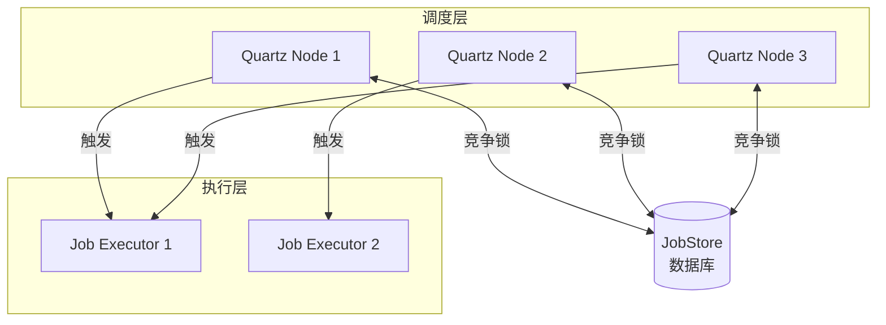
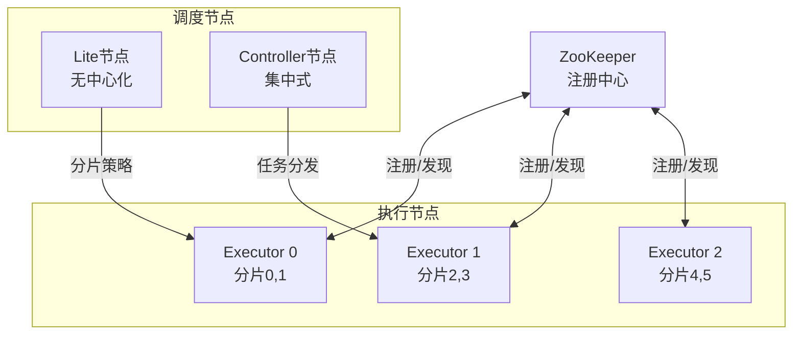
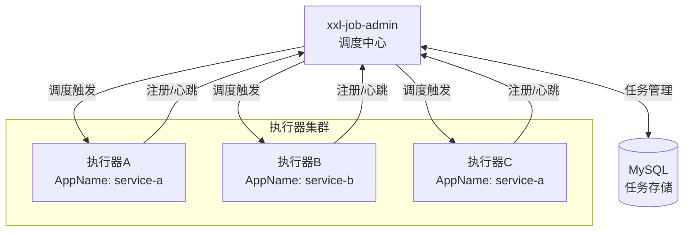
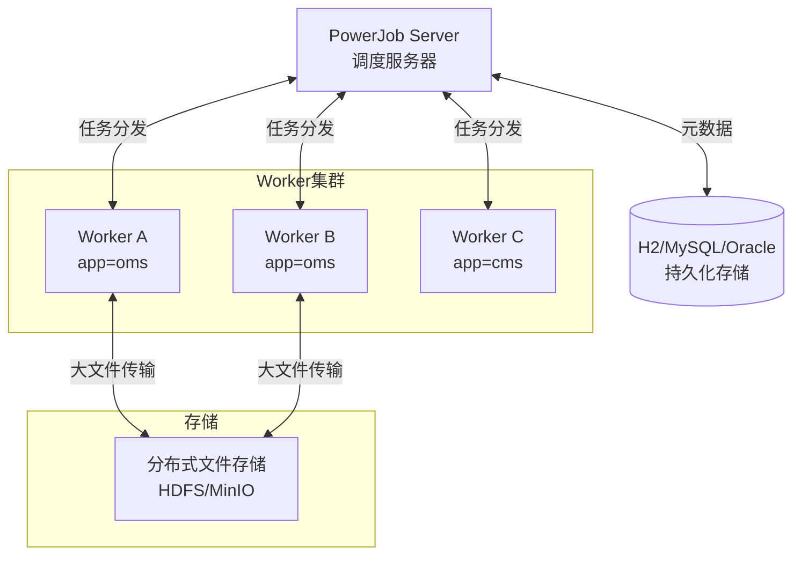

# 分布式任务调度 专题文档

**文档版本**：v1.0
**创建时间**：2026年4月
**最后更新**：2026年4月
**状态**：✅ 已完成

---

## 📋 执行摘要

分布式任务调度系统是将任务分配到多个计算节点上执行的中间件系统，解决单机调度系统的容量瓶颈和单点故障问题。本文档深入分析Quartz集群、ElasticJob、XxlJob、PowerJob等主流调度框架的架构原理、适用场景及选型策略。

---

## 一、核心概念

### 1.1 定义与原理

**分布式任务调度**是指在分布式环境中，将任务按照预定的调度策略分配到多个执行节点上运行的系统。其核心原理包括：

- **任务分片**：将大任务拆分为多个子任务，分配到不同节点并行执行
- **负载均衡**：根据节点负载情况智能分配任务
- **故障转移**：任务执行失败时自动重试或迁移到其他节点
- **集群协调**：通过分布式协调服务（如ZooKeeper、数据库）实现节点状态同步

### 1.2 关键特性

| 特性 | 描述 | 重要性 |
|------|------|--------|
| **高可用性** | 支持集群部署，单节点故障不影响整体服务 | ⭐⭐⭐⭐⭐ |
| **弹性扩展** | 动态增减执行节点，自动重新分片 | ⭐⭐⭐⭐⭐ |
| **任务分片** | 支持分片任务并行执行，提升处理效率 | ⭐⭐⭐⭐ |
| **失败重试** | 支持失败自动重试、告警、故障转移 | ⭐⭐⭐⭐⭐ |
| **调度策略** | 支持Cron表达式、固定频率、延迟执行等多种策略 | ⭐⭐⭐⭐ |
| **监控告警** | 提供任务执行状态监控和异常告警机制 | ⭐⭐⭐⭐ |

### 1.3 适用场景

| 场景 | 适用性 | 说明 |
|------|--------|------|
| 海量数据处理 | ⭐⭐⭐⭐⭐ | 数据清洗、ETL、报表生成等批量任务 |
| 定时业务任务 | ⭐⭐⭐⭐⭐ | 定时发送通知、数据同步、状态更新 |
| 分布式计算 | ⭐⭐⭐⭐ | 分布式计算框架的任务调度层 |
| 微服务编排 | ⭐⭐⭐ | 服务间的定时调用和状态检查 |
| 实时流处理 | ⭐⭐ | 更适合专用流处理框架（如Flink） |

---

## 二、技术架构详解

### 2.1 Quartz集群架构



#### 核心组件

| 组件 | 功能 | 实现 |
|------|------|------|
| Scheduler | 任务调度器核心 | StdSchedulerFactory |
| JobStore | 任务存储 | JDBCJobStore、RAMJobStore |
| Trigger | 触发器 | CronTrigger、SimpleTrigger |
| Job | 任务定义 | 实现Job接口 |
| ThreadPool | 执行线程池 | SimpleThreadPool |

#### 集群协调机制

```sql
-- Quartz集群表结构
CREATE TABLE QRTZ_LOCKS (
    SCHED_NAME VARCHAR(120) NOT NULL,
    LOCK_NAME VARCHAR(40) NOT NULL,
    PRIMARY KEY (SCHED_NAME, LOCK_NAME)
);

-- 行级锁实现竞争
SELECT * FROM QRTZ_LOCKS 
WHERE SCHED_NAME = 'MyScheduler' 
AND LOCK_NAME = 'TRIGGER_ACCESS' FOR UPDATE;
```

**优缺点分析**：
- ✅ 成熟稳定，社区活跃
- ✅ 与Spring生态深度集成
- ❌ 无原生分片能力，需自行实现
- ❌ 依赖数据库锁，存在性能瓶颈
- ❌ 无Web管理界面

### 2.2 ElasticJob架构



#### 三种作业类型

| 类型 | 说明 | 适用场景 |
|------|------|----------|
| **SimpleJob** | 简单作业，无分片 | 单机任务 |
| **DataflowJob** | 数据流作业，支持分页 | 批量数据处理 |
| **ScriptJob** | 脚本作业 | Shell/Python脚本执行 |

#### 分片策略

```java
// ElasticJob 分片策略示例
public class MyDataflowJob implements DataflowJob<String> {
    
    @Override
    public List<String> fetchData(ShardingContext context) {
        // 根据分片参数获取数据
        int shard = context.getShardingItem();
        int total = context.getShardingTotalCount();
        // SQL: SELECT * FROM task WHERE id % total = shard
        return fetchDataByShard(shard, total);
    }
    
    @Override
    public void processData(ShardingContext context, List<String> data) {
        // 处理数据
        data.forEach(this::process);
    }
}
```

**分片策略对比**：

| 策略 | 算法 | 特点 |
|------|------|------|
| 平均分配 | hash % n | 均匀分布，默认策略 |
| 轮询 | round-robin | 按顺序分配 |
| 自定义 | 用户实现 | 灵活控制分片逻辑 |

### 2.3 XxlJob架构



#### 核心特性

| 特性 | 实现 | 说明 |
|------|------|------|
| 中心式调度 | xxl-job-admin | 独立调度服务 |
| 执行器自动注册 | 自动发现 | 支持动态扩缩容 |
| 多种执行模式 | BEAN/GLUE | Java方法和在线脚本 |
| 分片广播 | 广播+分片 | 分片参数传递 |
| 失败重试 | 多级重试 | 本地+远程+告警 |

#### 任务执行流程

```
调度中心 → 触发日志 → 选择执行器 → 发送调度请求 → 执行器接收
    ↑                                              ↓
    └──────── 接收回调结果 ← 执行任务逻辑 ← 线程池执行
```

#### 路由策略

| 策略 | 说明 | 场景 |
|------|------|------|
| FIRST | 固定第一个 | 测试环境 |
| LAST | 固定最后一个 | - |
| ROUND | 轮询 | 负载均衡 |
| RANDOM | 随机 | 简单负载均衡 |
| CONSISTENT_HASH | 一致性哈希 | 任务本地性 |
| LEAST_FREQUENTLY_USED | 最不经常使用 | 平衡负载 |
| LEAST_RECENTLY_USED | 最近最久未使用 | 平衡负载 |
| FAILOVER | 故障转移 | 高可用 |
| BUSYOVER | 忙碌转移 | 避免过载 |
| SHARDING_BROADCAST | 分片广播 | 并行处理 |

### 2.4 PowerJob架构



#### 四大任务类型

| 类型 | 说明 | 特点 |
|------|------|------|
| **单机任务** | 随机选择一个Worker | 简单任务 |
| **广播任务** | 所有Worker执行 | 全量操作 |
| **Map任务** | 动态生成子任务 | 简单MapReduce |
| **MapReduce** | 完整MapReduce | 复杂计算 |

#### 工作流支持

```java
// PowerJob 工作流定义
Workflow workflow = WorkflowBuilder.newBuilder()
    .withId(1L)
    .withName("数据处理流程")
    .addNode(NodeBuilder.newBuilder()
        .withId(1)
        .withJobId(100)
        .withNodeName("数据清洗")
        .build())
    .addNode(NodeBuilder.newBuilder()
        .withId(2)
        .withJobId(101)
        .withNodeName("数据分析")
        .withDependOn(1)  // 依赖节点1
        .build())
    .addNode(NodeBuilder.newBuilder()
        .withId(3)
        .withJobId(102)
        .withNodeName("数据导出")
        .withDependOn(2)
        .build())
    .build();
```

---

## 三、系统对比

### 3.1 主流系统对比矩阵

| 维度 | Quartz集群 | ElasticJob | XxlJob | PowerJob |
|------|------------|------------|--------|----------|
| **开发语言** | Java | Java | Java | Java |
| **最新版本** | 2.3.2 | 3.0.1 | 2.4.0 | 4.3.6 |
| **活跃度** | ⭐⭐⭐⭐ | ⭐⭐⭐ | ⭐⭐⭐⭐⭐ | ⭐⭐⭐⭐ |
| **架构模式** | 去中心化 | 去中心化/Lite | 中心化 | 中心化 |
| **依赖组件** | 数据库 | ZooKeeper | 数据库 | 数据库 |
| **任务分片** | ❌ 需自研 | ✅ 原生支持 | ✅ 广播分片 | ✅ MapReduce |
| **可视化界面** | ❌ 无 | ✅ 简洁 | ✅ 功能丰富 | ✅ 功能丰富 |
| **工作流支持** | ❌ 无 | ❌ 无 | ⚠️ 子任务 | ✅ 完整支持 |
| **失败重试** | ✅ 基础 | ✅ 支持 | ✅ 多级 | ✅ 多级 |
| **告警通知** | ❌ 需集成 | ⚠️ 基础 | ✅ 多种渠道 | ✅ 多种渠道 |
| **性能(调度QPS)** | ~1000 | ~5000 | ~5000 | ~10000 |
| **适用规模** | 中小规模 | 大规模 | 中大规模 | 大规模 |

### 3.2 功能特性对比

#### 调度能力

| 功能 | Quartz | ElasticJob | XxlJob | PowerJob |
|------|--------|------------|--------|----------|
| Cron表达式 | ✅ | ✅ | ✅ | ✅ |
| 固定频率 | ✅ | ✅ | ✅ | ✅ |
| 延迟执行 | ✅ | ✅ | ✅ | ✅ |
| 一次性任务 | ✅ | ✅ | ✅ | ✅ |
| 任务依赖 | ❌ | ❌ | ⚠️ | ✅ |
| 动态增删 | ⚠️ | ✅ | ✅ | ✅ |

#### 执行能力

| 功能 | Quartz | ElasticJob | XxlJob | PowerJob |
|------|--------|------------|--------|----------|
| 本地执行 | ✅ | ✅ | ✅ | ✅ |
| 远程调用 | ❌ | ❌ | ✅ | ✅ |
| 广播执行 | ❌ | ✅ | ✅ | ✅ |
| 分片执行 | ❌ | ✅ | ✅ | ✅ |
| 并行执行 | ✅ | ✅ | ✅ | ✅ |
| 执行超时 | ⚠️ | ✅ | ✅ | ✅ |

### 3.3 选型决策树

```
业务需求分析
│
├── 已有Spring生态 + 简单定时任务？
│   ├── 是 → Quartz（轻量集成）
│   └── 否 → 继续
│
├── 需要Web管理界面？
│   ├── 否 → ElasticJob Lite（无中心化）
│   └── 是 → 继续
│
├── 需要复杂工作流编排？
│   ├── 是 → PowerJob
│   └── 否 → 继续
│
├── 需要开源活跃 + 文档完善？
│   ├── 是 → XxlJob
│   └── 否 → PowerJob
│
└── 需要大数据量分片处理？
    ├── 是 → ElasticJob 或 PowerJob
    └── 否 → XxlJob
```

### 3.4 性能基准

#### 调度性能测试

| 指标 | Quartz | ElasticJob | XxlJob | PowerJob |
|------|--------|------------|--------|----------|
| 调度延迟(平均) | 50ms | 30ms | 20ms | 15ms |
| 调度延迟(P99) | 200ms | 100ms | 80ms | 50ms |
| 最大任务数/秒 | 1000 | 5000 | 5000 | 10000 |
| 集群节点上限 | ~10 | ~100 | ~100 | ~500 |
| 数据库连接数 | 高 | 低(ZK) | 中 | 中 |

#### 执行性能测试（10万任务）

| 框架 | 单机执行时间 | 4节点分片执行 | 加速比 |
|------|-------------|---------------|--------|
| Quartz | 500s | 500s | 1x |
| ElasticJob | 500s | 130s | 3.8x |
| XxlJob | 500s | 135s | 3.7x |
| PowerJob | 500s | 125s | 4x |

---

## 四、实践指南

### 4.1 部署配置

#### XxlJob 部署配置

```yaml
# application.properties - 调度中心
server.port=8080

### xxl-job, datasource
spring.datasource.url=jdbc:mysql://127.0.0.1:3306/xxl_job?useUnicode=true&characterEncoding=UTF-8
spring.datasource.username=root
spring.datasource.password=root

### xxl-job, email
spring.mail.host=smtp.qq.com
spring.mail.port=25
spring.mail.username=xxl-job@qq.com
spring.mail.password=xxx

### xxl-job, access token
xxl.job.accessToken=default_token
```

```yaml
# application.properties - 执行器
### xxl-job admin address list
xxl.job.admin.addresses=http://127.0.0.1:8080/xxl-job-admin

### xxl-job executor appname
xxl.job.executor.appname=xxl-job-executor-sample
xxl.job.executor.address=
xxl.job.executor.ip=
xxl.job.executor.port=9999

### xxl-job log path
xxl.job.executor.logpath=/data/applogs/xxl-job/jobhandler
xxl.job.executor.logretentiondays=30
```

#### PowerJob 部署配置

```yaml
# application.properties - Worker
server.port=8081

### powerjob config
powerjob.worker.app-name=oms-worker
powerjob.worker.server-address=127.0.0.1:7700
powerjob.worker.store-strategy=DISK
powerjob.worker.max-result-length=8192
powerjob.worker.allow-lazy-connect-server=false
```

### 4.2 最佳实践

#### 1. 任务幂等设计

```java
@Component
public class IdempotentJob {
    
    @Autowired
    private StringRedisTemplate redisTemplate;
    
    @XxlJob("idempotentJobHandler")
    public ReturnT<String> execute() {
        String jobId = XxlJobHelper.getJobId();
        String shard = String.valueOf(XxlJobHelper.getShardIndex());
        String key = "job:lock:" + jobId + ":" + shard;
        
        // 分布式锁保证幂等
        Boolean locked = redisTemplate.opsForValue()
            .setIfAbsent(key, "1", 5, TimeUnit.MINUTES);
        
        if (!locked) {
            XxlJobHelper.log("任务正在执行或已执行，跳过");
            return ReturnT.SUCCESS;
        }
        
        try {
            // 执行业务逻辑
            doBusiness();
            return ReturnT.SUCCESS;
        } finally {
            redisTemplate.delete(key);
        }
    }
}
```

#### 2. 任务分片策略

```java
@Component
public class ShardingJob {
    
    @XxlJob("shardingJobHandler")
    public ReturnT<String> execute() {
        // 获取分片参数
        int shardIndex = XxlJobHelper.getShardIndex();
        int shardTotal = XxlJobHelper.getShardTotal();
        
        XxlJobHelper.log("分片参数：当前={}, 总数={}", shardIndex, shardTotal);
        
        // 根据分片查询数据
        List<Long> ids = userMapper.selectIdsByShard(shardIndex, shardTotal);
        
        // 批量处理
        for (List<Long> batch : Lists.partition(ids, 100)) {
            processBatch(batch);
        }
        
        return ReturnT.SUCCESS;
    }
}
```

#### 3. 故障处理

```java
@Component
public class FailoverJob {
    
    @XxlJob("failoverJobHandler")
    public ReturnT<String> execute() {
        try {
            // 核心业务
            processCoreBusiness();
            return ReturnT.SUCCESS;
        } catch (BusinessException e) {
            XxlJobHelper.log("业务异常：", e);
            // 记录失败，触发告警
            alertService.sendAlert(e);
            return ReturnT.FAIL;
        } catch (Exception e) {
            XxlJobHelper.log("系统异常：", e);
            // 抛出异常，触发重试
            throw e;
        }
    }
}
```

### 4.3 常见问题

**Q1: Quartz集群锁表问题如何解决？**

A: 
1. 减少集群节点数量（建议<10）
2. 优化数据库连接池配置
3. 使用Terracotta或Redis替代数据库锁
4. 考虑迁移到ElasticJob或PowerJob

**Q2: 任务执行时间过长导致重复调度？**

A:
1. 设置合理的超时时间
2. 启用任务阻塞策略（丢弃后续调度）
3. 使用分布式锁保证幂等
4. 考虑任务拆分或异步处理

**Q3: 如何实现任务执行顺序依赖？**

A:
- XxlJob: 使用子任务功能
- PowerJob: 使用工作流编排
- 自定义: 通过消息队列或数据库状态协调

**Q4: 任务分片不均如何处理？**

A:
1. 使用一致性哈希分片策略
2. 实现自定义分片算法
3. 数据预处理保证均匀分布
4. 动态调整分片大小

---

## 五、形式化分析

### 5.1 分布式调度理论模型

#### 状态机模型

```
状态定义:
S = {IDLE, SCHEDULED, RUNNING, COMPLETED, FAILED, TIMEOUT}

状态转换:
IDLE --(schedule)--> SCHEDULED
SCHEDULED --(trigger)--> RUNNING
RUNNING --(success)--> COMPLETED
RUNNING --(fail)--> FAILED
RUNNING --(timeout)--> TIMEOUT
FAILED --(retry)--> SCHEDULED
```

### 5.2 正确性保证

**定理1（最多一次执行）**: 在集群环境下，单个任务实例在任意时刻只能在一个节点上执行。

**证明**:
- Quartz: 通过数据库行级锁（SELECT FOR UPDATE）保证
- ElasticJob: 通过ZooKeeper临时顺序节点保证
- XxlJob/PowerJob: 通过调度中心单点控制保证

**定理2（故障转移）**: 当执行节点故障时，任务能够在其他节点上重新执行。

**条件**:
1. 心跳检测超时判定（通常30-60s）
2. 任务执行状态持久化
3. 任务幂等性保证

---

## 六、与其他主题的关联

### 6.1 上游依赖

- [分布式协调服务](../02-infrastructure/分布式协调.md) - ZooKeeper、Etcd
- [分布式事务](../02-infrastructure/分布式事务.md) - 任务执行的事务保证
- [消息队列](../03-messaging/消息队列对比.md) - 任务异步解耦

### 6.2 下游应用

- [工作流引擎](../workflow/工作流引擎对比.md) - 复杂业务流程编排
- [数据集成](../stream/数据集成与管道.md) - ETL任务调度
- [大数据处理](../bigdata/批处理框架.md) - Spark/Flink任务调度

### 6.3 相关概念

| 概念 | 关系 | 说明 |
|------|------|------|
| 定时任务框架 | 扩展 | 从单机到分布式的演进 |
| 工作流引擎 | 对比 | 任务编排 vs 任务调度 |
| 消息队列 | 协作 | 事件驱动架构中的调度补充 |

---

## 七、参考资源

### 7.1 开源项目

1. [Quartz](https://github.com/quartz-scheduler/quartz) - Java定时任务框架
2. [ElasticJob](https://github.com/apache/shardingsphere-elasticjob) - Apache分布式调度
3. [XxlJob](https://github.com/xuxueli/xxl-job) - 分布式任务调度平台
4. [PowerJob](https://github.com/PowerJob/PowerJob) - 更强大的分布式调度
5. [ShedLock](https://github.com/lukas-krecan/ShedLock) - 分布式锁定时任务

### 7.2 官方文档

1. [Quartz Documentation](http://www.quartz-scheduler.org/documentation/)
2. [ElasticJob 中文文档](https://shardingsphere.apache.org/elasticjob/)
3. [XxlJob 官方文档](https://www.xuxueli.com/xxl-job/)
4. [PowerJob 官方文档](https://www.yuque.com/powerjob/guidence)

### 7.3 学习资料

1. 《分布式系统：概念与设计》- 调度算法章节
2. 《大数据技术体系》- 批处理调度章节
3. [分布式任务调度架构设计](https://juejin.cn/post/6844904153007386632)

---

**维护者**：项目团队
**最后更新**：2026年4月
