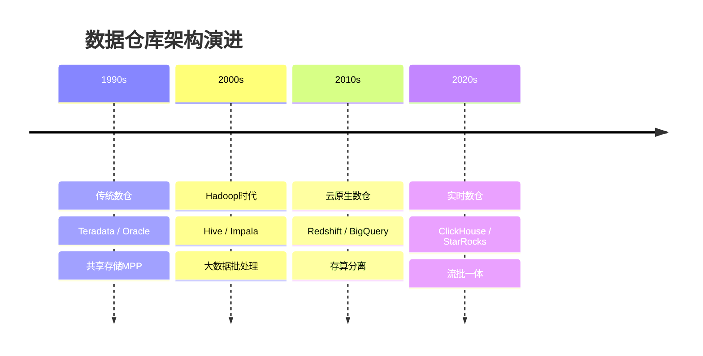
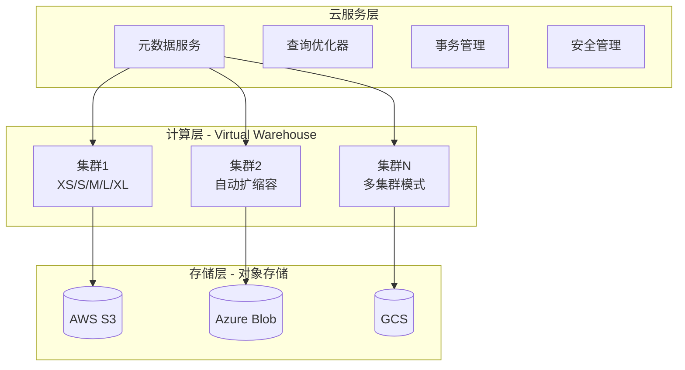
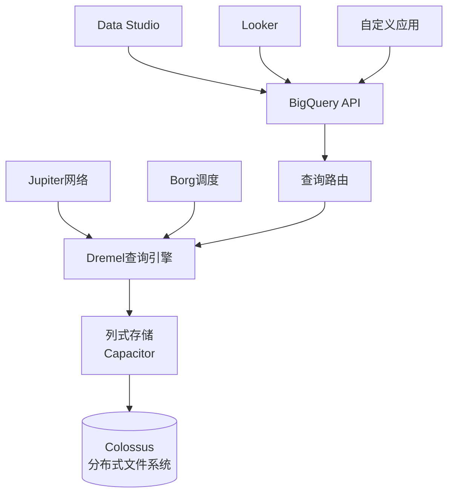
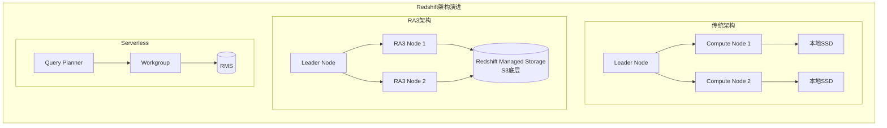
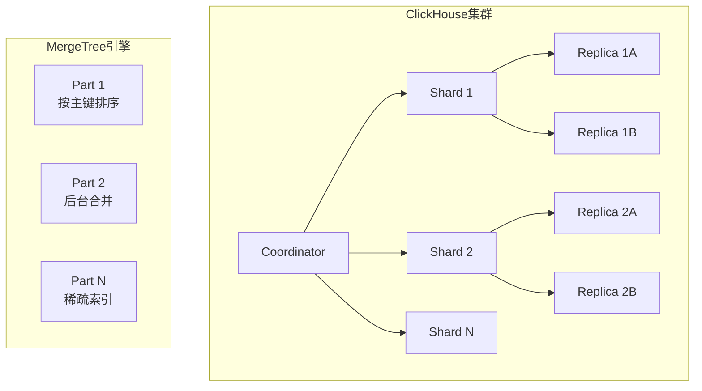
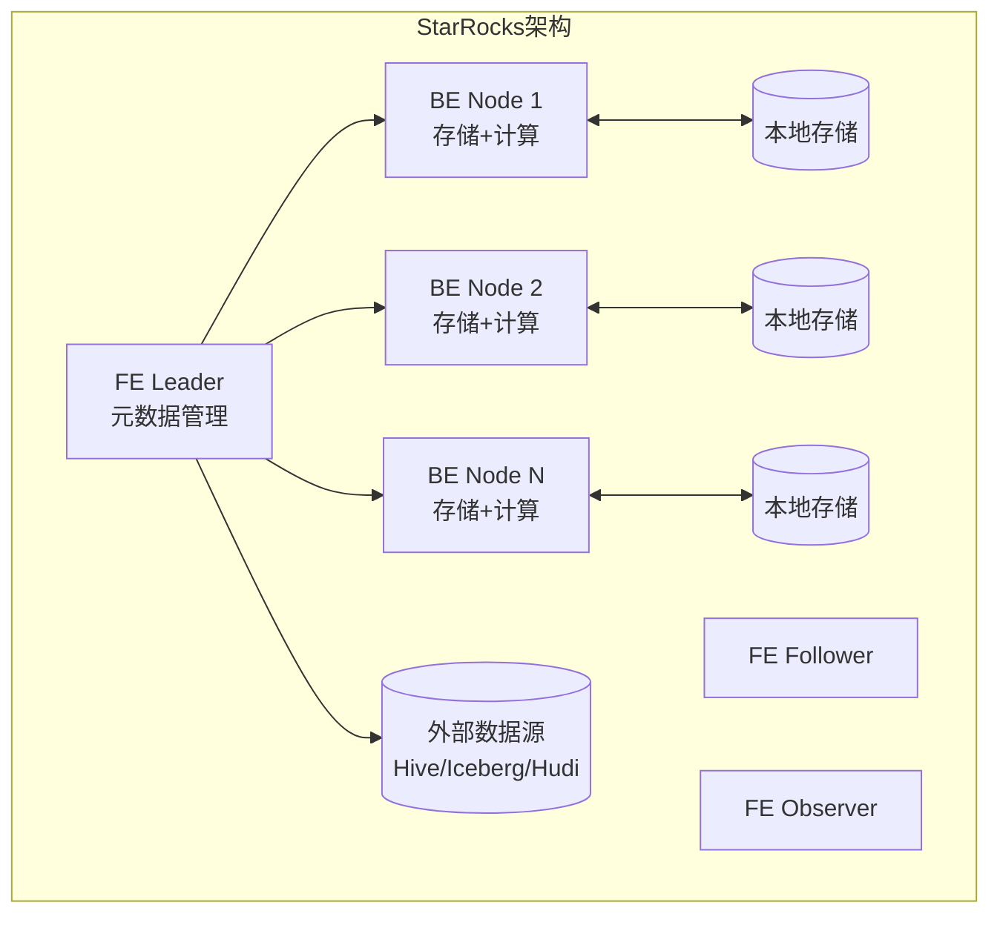

# 现代数据仓库对比 专题文档

**文档版本**：v1.0
**创建时间**：2026年
**最后更新**：2026年
**状态**：✅ 已完成

---

## 📋 执行摘要

现代数据仓库已从传统的本地MPP架构演进为云原生、存算分离的新型架构。本文档深度对比Snowflake、BigQuery、Redshift、ClickHouse、StarRocks/Doris等主流数据仓库系统，分析其架构设计、性能特点和适用场景。

---

## 一、核心概念

### 1.1 数据仓库演进



### 1.2 关键架构模式

| 模式 | 代表系统 | 特点 |
|------|---------|------|
| **共享存储MPP** | Teradata, Greenplum | 统一存储，多节点并行计算 |
| **存算分离** | Snowflake, BigQuery | 对象存储+弹性计算 |
| **Shared-Nothing** | ClickHouse, StarRocks | 本地存储，分布式计算 |
| **Serverless** | BigQuery, Snowflake | 完全托管，自动扩缩容 |

### 1.3 适用场景

| 场景 | 适用性 | 说明 |
|------|--------|------|
| 企业级BI分析 | ⭐⭐⭐⭐⭐ | 标准SQL，低延迟查询 |
| 即席查询(Ad-hoc) | ⭐⭐⭐⭐⭐ | 高并发，秒级响应 |
| 实时数据分析 | ⭐⭐⭐⭐ | 流式数据摄取 |
| 海量日志分析 | ⭐⭐⭐⭐ | 高吞吐写入 |
| 机器学习特征工程 | ⭐⭐⭐ | 与ML平台集成 |

---

## 二、Snowflake架构

### 2.1 多层架构



### 2.2 核心特性

| 特性 | 说明 |
|------|------|
| **纯SaaS** | 零运维，完全托管服务 |
| **存算分离** | 存储和计算独立扩展，按使用付费 |
| **多集群共享** | 多个计算集群共享同一数据集 |
| **零拷贝克隆** | 秒级创建数据副本，不占用额外存储 |
| **时间旅行** | 90天数据历史版本查询 |
| **数据共享** | 跨组织安全数据共享 |

### 2.3 性能优化

```sql
-- 自动聚类（自动维护数据排序）
CREATE TABLE events (
    event_time TIMESTAMP,
    user_id VARCHAR,
    event_type VARCHAR
) CLUSTER BY (event_time);

-- 查询结果缓存
ALTER SESSION SET USE_CACHED_RESULT = TRUE;

-- 虚拟仓库自动扩缩容
ALTER WAREHOUSE my_wh SET AUTO_SUSPEND = 60;
ALTER WAREHOUSE my_wh SET AUTO_RESUME = TRUE;
```

---

## 三、Google BigQuery

### 3.1 Serverless架构



### 3.2 核心特性

| 特性 | 说明 |
|------|------|
| **Serverless** | 无需管理基础设施，自动分配资源 |
| **列式存储** | Capacitor格式，高压缩比，快速扫描 |
| **嵌套数据** | 原生支持JSON/Protobuf嵌套结构 |
| **GIS支持** | 内置地理空间分析函数 |
| **BI引擎** | 内存加速层，亚秒级响应 |
| **ML集成** | 内置BigQuery ML，SQL训练模型 |

### 3.3 查询优化

```sql
-- 分区表设计
CREATE TABLE dataset.events
PARTITION BY DATE(event_time)
CLUSTER BY user_id, event_type AS
SELECT * FROM source_table;

-- 物化视图
CREATE MATERIALIZED VIEW dataset.mv_events AS
SELECT
    DATE(event_time) as dt,
    event_type,
    COUNT(*) as cnt
FROM dataset.events
GROUP BY 1, 2;

-- BI引擎加速
CREATE CAPACITY project.us.capacity_commitment
FLOOR = 100
CEILING = 200;
```

---

## 四、Amazon Redshift

### 4.1 架构演进



### 4.2 核心特性

| 特性 | 说明 |
|------|------|
| **列式存储** | 高效压缩，快速扫描 |
| **MPP架构** | 大规模并行处理 |
| **Redshift Spectrum** | 查询S3数据湖数据 |
| **RA3节点** | 存算分离，托管存储 |
| **AQUA** | 硬件加速查询处理 |
| **Serverless** | 自动扩缩容，按需付费 |

### 4.3 性能优化

```sql
-- 分布键设计
CREATE TABLE orders (
    order_id BIGINT,
    customer_id BIGINT,
    order_date DATE
)
DISTSTYLE KEY
DISTKEY(customer_id)
SORTKEY(order_date);

-- 压缩编码
ANALYZE COMPRESSION orders;

-- 物化视图
CREATE MATERIALIZED VIEW mv_orders AS
SELECT
    customer_id,
    COUNT(*) as order_count,
    SUM(amount) as total_amount
FROM orders
GROUP BY customer_id;

-- 自动工作负载管理
CREATE WORKLOAD MANAGEMENT QUEUE analytics_queue
WITH (
    CONCURRENCY_LEVEL = 5,
    MEMORY_PERCENT = 40
);
```

---

## 五、ClickHouse

### 5.1 列式存储架构



### 5.2 核心特性

| 特性 | 说明 |
|------|------|
| **列式存储** | 高效压缩，向量化执行 |
| **MergeTree引擎** | 基于LSM的存储引擎 |
| **向量化执行** | SIMD指令加速 |
| **稀疏索引** | 主键索引，轻量级 |
| **分布式表** | 透明分片，自动路由 |
| **实时摄取** | 高吞吐写入，近实时可见 |

### 5.3 性能优化

```sql
-- 建表语句（推荐配置）
CREATE TABLE events (
    event_time DateTime,
    user_id UInt64,
    event_type String,
    properties String CODEC(ZSTD(3))
) ENGINE = MergeTree()
PARTITION BY toYYYYMMDD(event_time)
ORDER BY (event_type, event_time, user_id)
TTL event_time + INTERVAL 90 DAY
SETTINGS index_granularity = 8192;

-- 分布式表
CREATE TABLE events_distributed AS events
ENGINE = Distributed('cluster_name', 'default', 'events', rand());

-- 物化视图（聚合）
CREATE MATERIALIZED VIEW events_agg
ENGINE = SummingMergeTree()
PARTITION BY toYYYYMMDD(hour)
ORDER BY (hour, event_type)
AS SELECT
    toStartOfHour(event_time) as hour,
    event_type,
    count() as cnt,
    uniqExact(user_id) as uv
FROM events
GROUP BY hour, event_type;
```

---

## 六、StarRocks / Apache Doris

### 6.1 MPP + 向量化架构



### 6.2 核心特性

| 特性 | StarRocks | Apache Doris |
|------|-----------|--------------|
| **开发方** | 鼎石科技 | Apache基金会 |
| **存储引擎** | 原生列存 + 外表 | 原生列存 + 外表 |
| **向量化执行** | ✅ 全链路 | ✅ 全链路 |
| **物化视图** | ✅ 异步/同步 | ✅ 异步 |
| **数据湖查询** | ✅ 极佳性能 | ✅ 良好支持 |
| **实时更新** | ✅ Primary Key | ✅ Unique Key |
| **资源隔离** | ✅ Resource Group | ✅ Workload Group |

### 6.3 表模型对比

```sql
-- StarRocks 明细模型（Append Only）
CREATE TABLE events_detail (
    event_time DATETIME,
    user_id BIGINT,
    event_type VARCHAR(64)
)
DUPLICATE KEY(event_time, user_id)
DISTRIBUTED BY HASH(user_id) BUCKETS 10;

-- 聚合模型（预聚合）
CREATE TABLE events_agg (
    event_time DATE,
    event_type VARCHAR(64),
    pv BIGINT SUM,
    uv BIGINT BITMAP_UNION
)
AGGREGATE KEY(event_time, event_type)
DISTRIBUTED BY HASH(event_type) BUCKETS 10;

-- Primary Key模型（实时更新）
CREATE TABLE users (
    user_id BIGINT,
    name VARCHAR(128),
    update_time DATETIME
)
PRIMARY KEY(user_id)
DISTRIBUTED BY HASH(user_id) BUCKETS 10
PROPERTIES("enable_persistent_index" = "true");
```

---

## 七、系统对比矩阵

### 7.1 功能对比

| 维度 | Snowflake | BigQuery | Redshift | ClickHouse | StarRocks |
|------|-----------|----------|----------|------------|-----------|
| **部署模式** | SaaS | SaaS | 托管/Serverless | 自建/托管 | 自建/托管 |
| **存算分离** | ✅ | ✅ | ✅(RA3) | ❌ | ❌ |
| **Serverless** | ✅ | ✅ | ✅ | ❌ | ❌ |
| **实时摄取** | ⚠️ 微批 | ⚠️ 流式 | ⚠️ | ✅ 极佳 | ✅ 极佳 |
| **标准SQL** | ✅ | ✅ | ✅ | ✅ | ✅ |
| **JDBC/ODBC** | ✅ | ✅ | ✅ | ✅ | ✅ |
| **数据湖查询** | ✅ External | ✅ BigLake | ✅ Spectrum | ✅ 表函数 | ✅ 外表 |
| **地理空间** | ✅ | ✅ 最强 | ✅ | ⚠️ | ⚠️ |
| **机器学习** | ❌ | ✅ BQML | ✅ Redshift ML | ❌ | ❌ |
| **跨云** | ✅ | ❌ GCP | ❌ AWS | ✅ | ✅ |

### 7.2 性能基准

| 指标 | Snowflake | BigQuery | Redshift | ClickHouse | StarRocks |
|------|-----------|----------|----------|------------|-----------|
| **单查询延迟** | 低 | 中 | 低 | 极低 | 极低 |
| **并发查询** | 高 | 极高 | 高 | 中 | 高 |
| **写入吞吐** | 中 | 高 | 中 | 极高 | 极高 |
| **扫描速度** | 高 | 极高 | 高 | 极高 | 极高 |
| **Join性能** | 高 | 高 | 高 | 中 | 极高 |

### 7.3 定价模式

| 系统 | 计费维度 | 特点 |
|------|---------|------|
| **Snowflake** | 存储($23/TB/月) + 计算信用点 | 按需弹性，暂停不计费 |
| **BigQuery** | 存储($20/TB/月) + 查询扫描量($5/TB) | 有免费额度，slot预订可节省 |
| **Redshift** | 节点实例($0.25-13+/小时) | 预留实例可节省75% |
| **ClickHouse** | 自建成本或托管服务 | Cloud版本按计算和存储 |
| **StarRocks** | 自建成本或云服务 | 阿里云/腾讯云托管 |

### 7.4 选型决策树

```
需求分析
├── 预算敏感且可自建运维？
│   ├── 是 → ClickHouse/StarRocks（极致性能/成本比）
│   └── 否 → 继续判断
├── 需要完全Serverless？
│   ├── 是 → BigQuery（最佳Serverless体验）
│   └── 否 → 继续判断
├── 多云/跨云部署？
│   ├── 是 → Snowflake（跨云一致性最佳）
│   └── 否 → 继续判断
├── AWS生态深度集成？
│   ├── 是 → Redshift（Spectrum查询S3）
│   └── 否 → 继续判断
├── 实时分析（毫秒级）？
│   ├── 是 → ClickHouse/StarRocks
│   └── 否 → Snowflake/Redshift
└── 企业级BI+复杂分析？
    ├── 高并发报表 → StarRocks
    └── 即席探索 → Snowflake
```

---

## 八、实践指南

### 8.1 Snowflake最佳实践

```sql
-- 虚拟仓库大小选择参考
-- XS: 开发测试
-- S/M: 轻度分析
-- L/XL: 生产BI
-- 2XL+: 大规模ETL

-- 多集群配置（自动扩缩容）
CREATE WAREHOUSE analytics_wh WITH
    WAREHOUSE_SIZE = 'LARGE'
    MAX_CLUSTER_COUNT = 5
    MIN_CLUSTER_COUNT = 1
    SCALING_POLICY = 'STANDARD';

-- 零拷贝克隆（开发测试）
CREATE TABLE dev_db.schema.table CLONE prod_db.schema.table;
```

### 8.2 BigQuery最佳实践

```sql
-- 强制分区（避免全表扫描）
CREATE TABLE project.dataset.table
PARTITION BY _PARTITIONDATE
OPTIONS(
    require_partition_filter = true
);

-- 聚簇优化
CLUSTER BY customer_id, order_date;

-- 使用缓存
-- 相同查询24小时内免费
-- 物化视图自动重写
```

### 8.3 ClickHouse性能调优

```xml
<!-- config.xml 关键配置 -->
<merge_tree>
    <parts_to_delay_insert>300</parts_to_delay_insert>
    <parts_to_throw_insert>600</parts_to_throw_insert>
</merge_tree>

<max_memory_usage>10000000000</max_memory_usage>
<max_bytes_before_external_group_by>5000000000</max_bytes_before_external_group_by>
```

### 8.4 StarRocks数据湖分析

```sql
-- 创建Hive Catalog
CREATE EXTERNAL CATALOG hive_catalog
PROPERTIES (
    "type" = "hive",
    "hive.metastore.uris" = "thrift://hive:9083"
);

-- 查询Iceberg表
SELECT * FROM iceberg_catalog.db.table
WHERE dt >= '2024-01-01';

-- 外表到内表的ETL
INSERT INTO internal_table
SELECT * FROM external_table
WHERE event_time >= DATE_SUB(NOW(), 7);
```

### 8.5 常见问题

**Q1: 如何应对数据倾斜？**

A:

- Snowflake: 自动聚类维护
- BigQuery: 选择合适的分区键
- ClickHouse/StarRocks: 使用SAMPLE BY或调整分桶数

**Q2: 成本控制策略？**

A:

| 系统 | 策略 |
|------|------|
| Snowflake | 设置自动暂停，使用X-Small开发 |
| BigQuery | 使用物化视图，控制扫描量 |
| Redshift | 使用Serverless或预留实例 |
| ClickHouse | 压缩+TTL，按需扩缩容 |

**Q3: 如何迁移数据？**

A:

- 使用Airbyte/Fivetran等ELT工具
- 云间迁移使用Storage Transfer Service
- 大数据量使用Spark并行迁移

---

## 九、与其他主题的关联

### 9.1 上游依赖

- [数据湖架构](../../05-storage/lakehouse/数据湖架构.md)
- [数据治理](../../05-storage/lakehouse/数据治理.md)

### 9.2 下游应用

- [CDC变更数据捕获](../stream/CDC变更数据捕获.md)
- [Spark计算引擎](spark-core.md)

### 9.3 相关概念

| 概念 | 关系 | 说明 |
|------|------|------|
| 数据湖 | 互补 | 数仓查询数据湖外表 |
| ETL/ELT | 流程 | 数据加载到数仓 |
| BI工具 | 应用 | Tableau、Looker等对接 |

---

## 十、参考资源

### 10.1 官方文档

1. [Snowflake文档](https://docs.snowflake.com/) - 云原生数据仓库
2. [BigQuery文档](https://cloud.google.com/bigquery/docs) - Google Serverless数仓
3. [Redshift文档](https://docs.aws.amazon.com/redshift/) - AWS数仓服务
4. [ClickHouse文档](https://clickhouse.com/docs) - 快速OLAP
5. [StarRocks文档](https://docs.starrocks.io/) - 高性能分析
6. [Apache Doris文档](https://doris.apache.org/docs/) - 实时数仓

### 10.2 性能基准

1. [TPC-DS Benchmark](http://www.tpc.org/tpcds/) - 决策支持基准
2. [ClickBench](https://benchmark.clickhouse.com/) - 分析型数据库基准

### 10.3 云厂商对比

1. [Gartner Magic Quadrant](https://www.gartner.com/en/documents/4002956) - 云数据库管理系统

---

**维护者**：项目团队
**最后更新**：2026年
