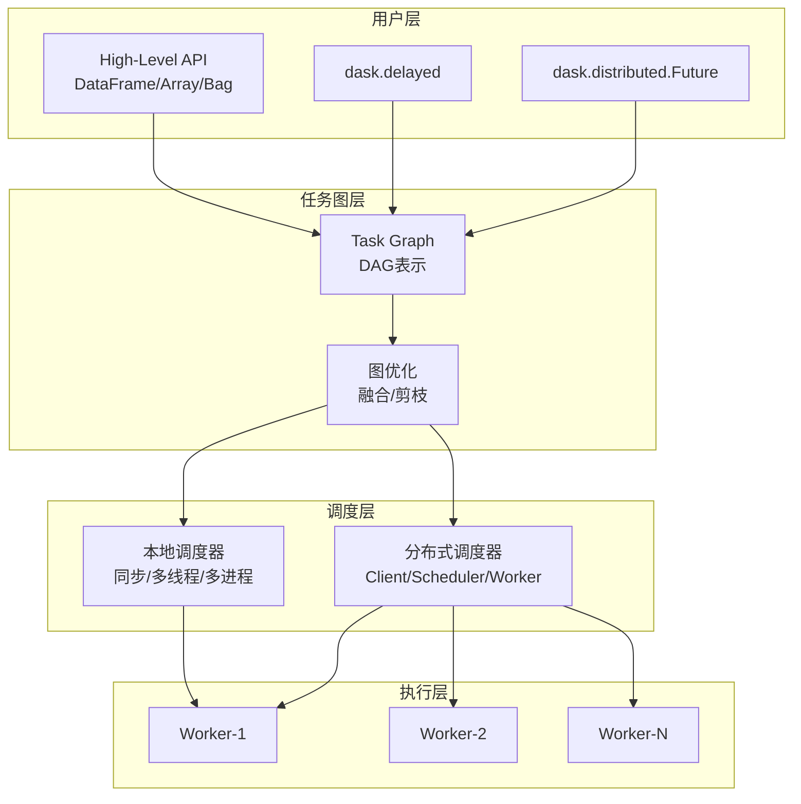

# Dask并行计算 专题文档

**文档版本**：v1.0
**创建时间**：2026年
**最后更新**：2026年
**状态**：🔄 编写中

---

## 📋 执行摘要

Dask是Python原生的并行计算库，通过动态任务调度和延迟计算，将NumPy、Pandas、Scikit-learn等单机库扩展到分布式环境。其灵活的任务图（Task Graph）机制使其成为Python生态中处理大规模数据分析的科学计算首选工具。

---

## 一、核心概念

### 1.1 定义与原理

**Dask设计目标**

- 纯Python实现，与生态无缝集成
- 从小规模（单机多核）到大规模（分布式集群）平滑扩展
- 熟悉的API：Dask DataFrame≈Pandas，Dask Array≈NumPy
- 细粒度任务调度，支持复杂计算图

**核心抽象**

- **Task Graph**：有向无环图描述计算依赖
- **Delayed**：延迟执行，构建计算图但不立即执行
- **Collection**：高级数据结构（Array/DataFrame/Bag）
- **Scheduler**：任务调度器（单线程/多进程/分布式）

### 1.2 关键特性

- **原生Python**：纯Python实现，无JVM依赖
- **熟悉API**：Pandas/NumPy用户零学习成本
- **动态调度**：运行时任务图优化
- **灵活部署**：单机/多机/K8s多种模式
- **流式计算**：支持超出内存的数据集处理

### 1.3 适用场景

| 场景 | 适用性 | 说明 |
|------|--------|------|
| 大规模数据清洗 | ⭐⭐⭐⭐⭐ | 超出内存的DataFrame处理 |
| 科学计算 | ⭐⭐⭐⭐⭐ | NumPy数组并行计算 |
| 机器学习预处理 | ⭐⭐⭐⭐⭐ | 与Scikit-learn集成 |
| 图像处理 | ⭐⭐⭐⭐ | 大图像分块处理 |
| 实时流处理 | ⭐⭐ | 非主要设计目标 |
| 深度学习训练 | ⭐⭐ | 不如Ray/Horovod专业 |

---

## 二、技术细节

### 2.1 Dask架构



### 2.2 任务图机制

**任务图表示**

```python
import dask

@dask.delayed
def add(x, y):
    return x + y

@dask.delayed
def mul(x, y):
    return x * y

# 构建计算图
a = add(1, 2)      # 任务1
b = add(3, 4)      # 任务2
c = mul(a, b)      # 任务3（依赖任务1、2）

# 可视化任务图
c.visualize()

# 执行计算
result = c.compute()  # (1+2) * (3+4) = 21
```

**任务图优化**：

- **任务融合**：合并相邻小任务减少调度开销
- **依赖剪枝**：只执行必要任务
- **负载均衡**：均匀分配任务到Worker

### 2.3 调度器类型

| 调度器 | 适用场景 | 特点 |
|--------|----------|------|
| **synchronous** | 调试 | 单线程，无并行 |
| **threaded** | GIL外操作 | 多线程，共享内存 |
| **processes** | CPU密集型 | 多进程，隔离内存 |
| **distributed** | 分布式 | 多机集群，网络通信 |

### 2.4 Dask Collections详解

#### Dask Array

```python
import dask.array as da
import numpy as np

# 创建分块数组（10GB，每块100MB）
x = da.random.random((100000, 100000), chunks=(1000, 1000))

# 延迟计算
y = x + x.T
z = y.mean()

# 执行
result = z.compute()
```

**特性**：

- 分块存储，超出内存可计算
- 支持大多数NumPy操作
- 懒加载，构建计算图后执行

#### Dask DataFrame

```python
import dask.dataframe as dd

# 读取多个CSV（超出内存）
df = dd.read_csv('data/*.csv')

# 延迟转换
df2 = df[df.value > 0]
df3 = df2.groupby('name').value.mean()

# 执行
result = df3.compute()
```

**特性**：

- 分区存储，每区一个Pandas DataFrame
- 支持大部分Pandas API
- 自动分区优化

#### Dask Delayed

```python
from dask import delayed

@delayed
def process_file(filename):
    # 自定义处理逻辑
    data = load(filename)
    return transform(data)

# 并行处理多个文件
results = [process_file(f) for f in filenames]
final = delayed(merge)(results)
final.compute()
```

**适用**：

- 自定义并行逻辑
- 非标准数据结构
- 复杂依赖关系

---

## 三、系统对比

### 3.1 Dask vs Spark对比矩阵

| 维度 | Dask | Spark |
|------|------|-------|
| **实现语言** | Python | Scala/JVM |
| **API风格** | Pandas/NumPy | DataFrame/SQL |
| **部署复杂度** | 低 | 高 |
| **启动开销** | 低 | 高 |
| **内存效率** | 流式迭代 | 缓存优先 |
| **生态集成** | Python生态 | JVM生态 |
| **SQL支持** | 有限 | 完善 |
| **容错机制** | 重算（lineage） | RDD持久化 |
| **适用规模** | TB级 | PB级 |

### 3.2 Dask vs Ray对比矩阵

| 维度 | Dask | Ray |
|------|------|-----|
| **核心抽象** | 数据集合 | Task/Actor |
| **调度延迟** | ~10ms | ~1ms |
| **状态管理** | 无状态 | Actor有状态 |
| **ML生态** | Scikit-learn | Ray Train/RLlib |
| **模型服务** | 不支持 | Ray Serve |
| **强化学习** | 不支持 | RLlib |
| **细粒度控制** | 中等 | 高 |
| **适用场景** | 数据分析 | ML/Serving |

### 3.3 选型决策树

```
技术栈评估
├── 纯Python团队?
│   ├── 数据分析为主? → Dask
│   └── ML/Serving为主? → Ray
├── 已有Spark基础设施?
│   ├── SQL/批处理为主? → Spark
│   └── Python ML集成? → Dask on Spark
└── 超大规模(PB级)?
    ├── 云原生? → Spark/Databricks
    └── 自研? → Spark/Flink
```

---

## 四、实践指南

### 4.1 分布式部署

**Local Cluster**：

```python
from dask.distributed import Client

# 本地多进程
client = Client(n_workers=4, threads_per_worker=2)
```

**分布式Cluster**：

```python
from dask.distributed import Client, Scheduler, Worker

# 启动Scheduler
# 命令行: dask-scheduler

# 启动Worker
# 命令行: dask-worker <scheduler-address>

# 连接Client
client = Client('scheduler-address:8786')
```

**K8s部署**：

```yaml
# dask-kubernetes
from dask_kubernetes import KubeCluster

cluster = KubeCluster.from_yaml('worker-spec.yaml')
cluster.scale(10)
client = Client(cluster)
```

### 4.2 性能优化

1. **分块策略**

   ```python
   import dask.array as da

   # 分块大小建议: 100MB-1GB
   x = da.random.random((10000, 10000), chunks=(1000, 1000))

   # 自动调整
   x = x.rechunk({0: 'auto', 1: -1})  # 自动优化0轴
   ```

2. **持久化中间结果**

   ```python
   # 避免重复计算
   x = x.persist()  # 分布式内存中保留

   # 基于持久化结果多次计算
   result1 = x.sum().compute()
   result2 = x.mean().compute()
   ```

3. **任务融合优化**

   ```python
   # 启用优化
   with dask.config.set({'optimization.fuse.active': True}):
       result = dask.compute(*tasks)
   ```

### 4.3 最佳实践

| 场景 | 建议 |
|------|------|
| 内存不足 | 减小块大小，使用`map_partitions` |
| 任务过多 | 使用`reduction`减少任务数 |
| 数据倾斜 | 重新分区`repartition` |
| 自定义函数 | 使用`map_partitions`批量处理 |
| I/O优化 | 使用 Parquet 替代 CSV |

### 4.4 常见问题

**Q1: Dask和Pandas什么区别？**
A: Dask是多分区的Pandas，可并行处理超出内存的数据。API兼容但某些操作（如排序）行为不同。

**Q2: 任务执行失败如何调试？**
A: 1) 使用本地同步调度器复现；2) 检查Dashboard；3) 减少分区大小隔离问题。

**Q3: Dask能替代Spark吗？**
A: 在Python数据分析场景可以；但超大规模PB级、复杂SQL场景Spark更成熟。

---

## 五、形式化分析

### 5.1 任务调度复杂度

**任务图构建**：O(n)，n为任务数
**依赖解析**：O(e)，e为边数
**调度决策**：每个任务O(1)

**内存模型**：

```
总内存 = 输入数据 + 中间结果 + 输出数据
      ≈ 3 × 分区大小 × 并发数
```

---

## 六、与其他主题的关联

### 6.1 上游依赖

- [Pandas数据处理](../06-computing/machine-learning/)
- [NumPy科学计算](../06-computing/machine-learning/)

### 6.2 下游应用

- [Scikit-learn分布式](../06-computing/machine-learning/)
- [XGBoost分布式训练](../06-computing/machine-learning/)

### 6.3 相关概念

| 概念 | 关系 | 说明 |
|------|------|------|
| Spark | 对比 | JVM生态大数据框架 |
| Ray | 对比 | Python ML分布式框架 |
| Modin | 扩展 | Dask后端加速Pandas |

---

## 七、参考资源

### 7.1 学术论文

1. [Dask: Parallel Computation with Blocked algorithms and Task Scheduling](https://conference.scipy.org/proceedings/scipy2015/pdfs/matthew_rocklin.pdf) - Rocklin, 2015
2. [Scaling Python Data Science: Dask and Beyond](https://www.anaconda.com/blog/scaling-python-data-science-dask-and-beyond) - Anaconda, 2020

### 7.2 开源项目

1. [Dask](https://github.com/dask/dask) - 核心库
2. [Distributed](https://github.com/dask/distributed) - 分布式调度器
3. [Dask-ML](https://github.com/dask/dask-ml) - 机器学习集成
4. [Dask-Kubernetes](https://github.com/dask/dask-kubernetes) - K8s部署

### 7.3 学习资料

1. [Dask官方文档](https://docs.dask.org/) - 全面指南
2. [Dask Tutorial](https://github.com/dask/dask-tutorial) - 官方教程
3. [Dask Best Practices](https://docs.dask.org/en/stable/best-practices.html) - 最佳实践

### 7.4 相关文档

- [Ray分布式计算对比](./Ray分布式计算框架.md)
- [Spark大数据处理](../06-computing/big-data/)

---

**维护者**：项目团队
**最后更新**：2026年
