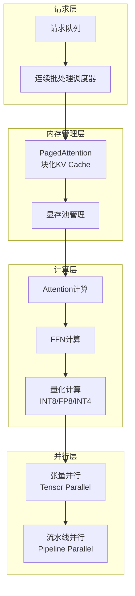

# LLM大模型部署 专题文档

**文档版本**：v1.0
**创建时间**：2026年
**最后更新**：2026年
**状态**：🔄 编写中

---

## 📋 执行摘要

大语言模型（LLM）部署面临显存占用大、推理延迟高、吞吐量低等挑战。通过推理优化框架（vLLM、TensorRT-LLM）、模型量化（INT8/INT4）、连续批处理和分布式并行等技术，可在生产环境实现高效、低成本的LLM服务。

---

## 一、核心概念

### 1.1 LLM推理挑战

**显存瓶颈**
- 模型权重：LLaMA-70B FP16需140GB显存
- KV Cache：长上下文占用大量显存
- 激活值：中间计算结果存储

**计算瓶颈**
- 自回归生成：逐token顺序生成
- 内存带宽限制：小batch时算力利用率低
- 长序列注意力：O(n²)复杂度

**吞吐挑战**
- 请求到达随机，难以批处理
- 不同请求生成长度差异大
- GPU利用率波动严重

### 1.2 关键特性

- **高吞吐服务**：通过连续批处理提升GPU利用率
- **低延迟响应**：PagedAttention优化内存管理
- **显存高效**：量化技术降低显存占用50-75%
- **弹性扩展**：支持张量/流水线并行多卡部署
- **长上下文支持**：优化KV Cache管理，支持百万token

### 1.3 适用场景

| 场景 | 适用性 | 说明 |
|------|--------|------|
| 高并发API服务 | ⭐⭐⭐⭐⭐ | 在线问答、聊天机器人 |
| 离线批处理 | ⭐⭐⭐⭐⭐ | 文档生成、数据标注 |
| 边缘设备部署 | ⭐⭐⭐⭐ | 量化后模型端侧运行 |
| 实时交互 | ⭐⭐⭐ | 语音助手低延迟要求 |
| 超大规模模型 | ⭐⭐⭐ | 175B+模型分布式部署 |

---

## 二、技术细节

### 2.1 推理优化框架架构



### 2.2 PagedAttention原理

**传统KV Cache问题**
- 预分配最大长度，浪费显存
- 内存碎片严重
- 无法共享，多序列重复计算

**PagedAttention创新**
- 借鉴OS虚拟内存分页思想
- KV Cache划分为固定大小块（Block）
- 块按需分配，支持动态扩展
- 支持块共享（Copy-on-Write）

**工作流程**：
1. 将KV Cache分割为固定大小的逻辑块
2. 使用Block Table映射逻辑块到物理块
3. 生成新token时按需分配新块
4. 支持多个序列共享相同前缀块

**效果**：
- 显存利用率提升2-4倍
- 支持更大batch size
- 支持更长上下文

### 2.3 连续批处理（Continuous Batching）

**静态批处理问题**
- 等待batch填满，首token延迟高
- 序列长度不一，短序列等待长序列
- GPU利用率波动

**连续批处理机制**
- 请求到达立即处理，不等待batch填满
- 动态调度：序列完成立即移除，新请求插入
- 迭代级别调度，最大化GPU利用率

**调度算法**：
```python
while True:
    # 每轮迭代
    new_requests = get_new_requests()
    batch.add(new_requests)  # 新请求加入
    
    outputs = model.forward(batch)
    
    completed = batch.check_completed()
    batch.remove(completed)  # 完成请求移除
```

**效果对比**：
| 指标 | 静态批处理 | 连续批处理 |
|------|------------|------------|
| 吞吐量 | 1x | 10-20x |
| 延迟波动 | 大 | 小 |
| GPU利用率 | 30-50% | 80-95% |

---

## 三、系统对比

### 3.1 推理框架对比矩阵

| 维度 | vLLM | TensorRT-LLM | TGI | DeepSpeed |
|------|------|--------------|-----|-----------|
| **PagedAttention** | ✅ | ✅ | ✅ | ✅ |
| **连续批处理** | ✅ | ✅ | ✅ | ✅ |
| **量化支持** | AWQ/GPTQ/FP8 | FP8/INT8/INT4 | GPTQ/AWQ | INT8/FP16 |
| **多卡并行** | TP/PP | TP/PP | TP | TP/PP/ZeRO |
| **易用性** | ⭐⭐⭐⭐⭐ | ⭐⭐⭐ | ⭐⭐⭐⭐ | ⭐⭐⭐ |
| **性能** | ⭐⭐⭐⭐ | ⭐⭐⭐⭐⭐ | ⭐⭐⭐⭐ | ⭐⭐⭐⭐ |

### 3.2 量化技术对比

| 方法 | 精度 | 显存节省 | 速度提升 | 精度损失 |
|------|------|----------|----------|----------|
| **FP16** | 16bit | 基准 | 基准 | 0% |
| **INT8** | 8bit | 50% | 1.5-2x | <1% |
| **FP8** | 8bit | 50% | 1.5-2x | <1% |
| **INT4** | 4bit | 75% | 2-3x | 2-5% |
| **GPTQ** | 4bit | 75% | 2-3x | 2-4% |
| **AWQ** | 4bit | 75% | 2-3x | 1-3% |

### 3.3 并行策略对比

| 策略 | 适用场景 | 通信量 | 扩展性 |
|------|----------|--------|--------|
| **张量并行（TP）** | 单节点多卡 | 高 | 8卡以内 |
| **流水线并行（PP）** | 跨节点 | 中 | 不限 |
| **序列并行** | 长上下文 | 中 | 配合TP使用 |
| **专家并行** | MoE模型 | 高 | 不限 |

---

## 四、实践指南

### 4.1 部署配置示例

**vLLM部署**：

```python
from vllm import LLM, SamplingParams

# 初始化模型
llm = LLM(
    model="meta-llama/Llama-2-70b",
    tensor_parallel_size=4,  # 4卡张量并行
    gpu_memory_utilization=0.9,
    max_num_seqs=256,
    max_model_len=4096
)

# 采样参数
sampling_params = SamplingParams(
    temperature=0.7,
    top_p=0.95,
    max_tokens=1024
)

# 批量推理
outputs = llm.generate(prompts, sampling_params)
```

**TensorRT-LLM构建**：

```bash
# 量化构建
python build.py --model_dir ./llama-7b \
    --dtype float16 \
    --use_gpt_attention_plugin float16 \
    --use_weight_only \
    --weight_only_precision int4_awq \
    --output_dir ./trt_engines/llama-7b-int4

# 运行推理
python run.py --engine_dir ./trt_engines/llama-7b-int4 \
    --max_output_len 1024 \
    --input_text "Your prompt here"
```

### 4.2 量化最佳实践

1. **精度选择**
   - 生产环境优先FP8/INT8：精度损失小，推理速度快
   - 资源受限场景用INT4：AWQ优于GPTQ
   - 关键任务避免INT4：法律、医疗等敏感领域

2. **量化流程**
   ```
   原始FP16模型
       ↓
   校准数据集（128-512样本）
       ↓
   权重量化（AWQ/GPTQ）
       ↓
   激活量化（SmoothQuant）
       ↓
   精度验证
       ↓
   部署上线
   ```

3. **显存计算公式**
   ```
   总显存 = 模型权重 + KV Cache + 激活值
   
   模型权重 = 参数量 × 精度字节数
   KV Cache = 2 × 层数 × 隐藏维度 × 序列长度 × batch × 精度
   ```

### 4.3 性能调优

**吞吐优化**：
- 使用连续批处理
- 增大max_num_seqs（受显存限制）
- 启用prefix caching（共享系统提示词）

**延迟优化**：
- 使用投机采样（Speculative Decoding）
- 启用CUDA graph
- 优化attention算法（FlashAttention/FlashInfer）

**显存优化**：
- 启用KV Cache量化
- 使用分页注意力
- 调整gpu_memory_utilization

### 4.4 常见问题

**Q1: vLLM和TensorRT-LLM如何选择？**
A: 追求易用性和快速部署选vLLM；追求极致性能和已经使用NVIDIA生态选TensorRT-LLM。

**Q2: INT4量化后精度下降明显怎么办？**
A: 1) 增加校准数据量；2) 使用AWQ替代GPTQ；3) 保留lm_head为FP16；4) 关键层跳过量化。

**Q3: 长上下文（>32K）如何优化？**
A: 1) 启用序列并行；2) 使用Ring Attention；3) KV Cache压缩（H2O、StreamingLLM）；4) 分块处理。

---

## 五、形式化分析

### 5.1 推理复杂度分析

**自回归生成复杂度**：
- 预填充阶段（Prefill）：O(n² × d)
- 解码阶段（Decode）：O(n × d)
- 总计算量：O(n² × d + t × n × d)

**显存占用分析**：
```
M_total = M_weights + M_kvcache + M_activations

M_weights = P × b_precision
M_kvcache = 2 × L × h × s × b × b_precision
M_activations ≈ b × s × h × b_precision
```

其中：P=参数量, L=层数, h=隐藏维度, s=序列长度, b=batch

---

## 六、与其他主题的关联

### 6.1 上游依赖

- [向量数据库](./向量数据库对比.md)
- [GPU计算优化](../06-computing/machine-learning/)

### 6.2 下游应用

- [Ray Serve](./Ray分布式计算框架.md)
- [模型服务架构](../06-computing/machine-learning/)

### 6.3 相关概念

| 概念 | 关系 | 说明 |
|------|------|------|
| FlashAttention | 扩展 | 内存高效的Attention实现 |
| 投机采样 | 扩展 | 加速自回归生成 |
| 模型压缩 | 关联 | 剪枝、蒸馏、量化 |

---

## 七、参考资源

### 7.1 学术论文

1. [Efficient Memory Management for Large Language Model Serving with PagedAttention](https://arxiv.org/abs/2309.06180) - Kwon et al., 2023 (vLLM)
2. [FlashAttention: Fast and Memory-Efficient Exact Attention](https://arxiv.org/abs/2205.14135) - Dao et al., 2022
3. [AWQ: Activation-aware Weight Quantization](https://arxiv.org/abs/2306.00978) - Lin et al., 2023
4. [GPTQ: Accurate Post-Training Quantization](https://arxiv.org/abs/2210.17323) - Frantar et al., 2022

### 7.2 开源项目

1. [vLLM](https://github.com/vllm-project/vllm) - 高吞吐LLM推理引擎
2. [TensorRT-LLM](https://github.com/NVIDIA/TensorRT-LLM) - NVIDIA推理优化
3. [Text Generation Inference](https://github.com/huggingface/text-generation-inference) - HuggingFace推理服务
4. [DeepSpeed](https://github.com/microsoft/DeepSpeed) - 微软深度学习优化库

### 7.3 学习资料

1. [vLLM Documentation](https://docs.vllm.ai/) - 官方文档
2. [TensorRT-LLM User Guide](https://nvidia.github.io/TensorRT-LLM/) - NVIDIA指南
3. [LLM Inference Performance Engineering](https://arxiv.org/abs/2312.03687) - 性能工程最佳实践

### 7.4 相关文档

- [Ray Serve模型服务](./Ray分布式计算框架.md)
- [模型量化技术详解](../06-computing/machine-learning/)

---

**维护者**：项目团队
**最后更新**：2026年
