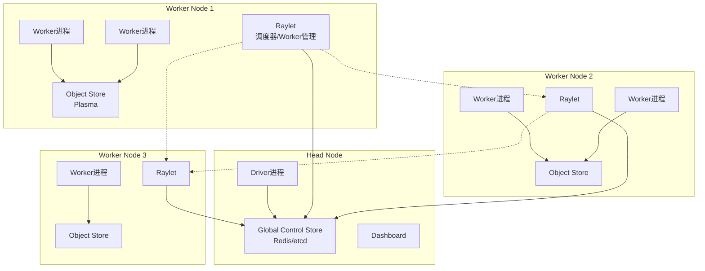
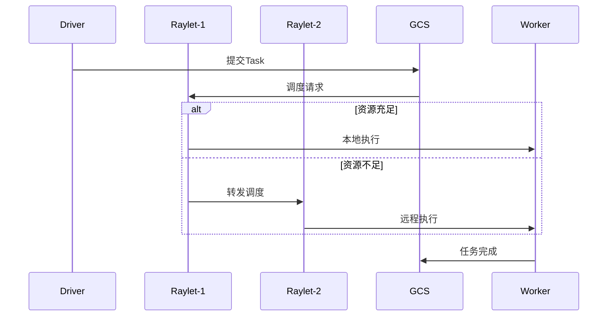
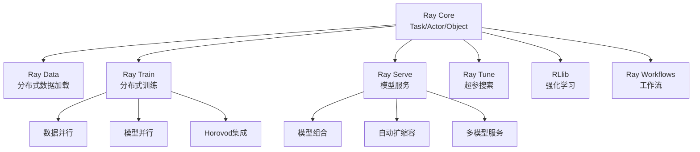

# Ray分布式计算框架 专题文档

**文档版本**：v1.0
**创建时间**：2026年
**最后更新**：2026年
**状态**：🔄 编写中

---

## 📋 执行摘要

Ray是UC Berkeley RISELab开发的统一分布式计算框架，通过灵活的Actor/Task抽象和去中心化调度，将分布式训练、模型服务、强化学习等AI工作负载统一到单一框架中，成为构建大规模ML系统的首选基础设施。

---

## 一、核心概念

### 1.1 定义与原理

**Ray设计哲学**

- 简单性：单机代码可无缝扩展到分布式
- 通用性：支持训练、 serving、超参搜索等多种工作负载
- 高性能：微秒级任务调度，每秒百万级任务吞吐

**核心抽象**

- **Task**：无状态函数，可在集群任意节点执行
- **Actor**：有状态计算单元，方法调用保持状态
- **Object**：不可变数据对象，通过共享内存和对象存储传递
- **Placement Group**：资源预留和放置策略

### 1.2 关键特性

- **统一API**：Pythonic接口，单机到分布式代码一致
- **微秒级调度**：基于GCS的去中心化调度，延迟<1ms
- **自动容错**：任务失败自动重试，Actor故障自动重建
- **异构计算**：CPU/GPU/TPU混合调度
- **丰富生态**：Ray Train、Ray Serve、RLlib、Tune等库

### 1.3 适用场景

| 场景 | 适用性 | 说明 |
|------|--------|------|
| 分布式训练 | ⭐⭐⭐⭐⭐ | 数据并行、模型并行、Pipeline并行 |
| 模型服务 | ⭐⭐⭐⭐⭐ | 多模型组合、自动扩缩容 |
| 超参搜索 | ⭐⭐⭐⭐⭐ | 分布式超参优化 |
| 强化学习 | ⭐⭐⭐⭐⭐ | 分布式环境模拟、训练 |
| 流处理 | ⭐⭐⭐ | 实时推理、特征工程 |
| 批处理ETL | ⭐⭐⭐ | 大规模数据预处理 |

---

## 二、技术细节

### 2.1 Ray架构



**核心组件**

| 组件 | 职责 | 部署 |
|------|------|------|
| GCS | 元数据存储、资源状态、Actor位置 | Head Node |
| Raylet | 本地调度、资源管理、Worker启动 | 每个节点 |
| Worker | 执行Task/Actor方法 | 动态创建 |
| Object Store | 共享内存对象存储 | 每个节点 |
| Driver | 用户程序入口，提交任务 | 任意节点 |

### 2.2 调度机制

**去中心化调度**



**调度流程**：

1. Driver提交Task，生成ObjectID
2. 本地Raylet检查资源
3. 资源充足：本地Worker执行
4. 资源不足：转发到资源充足节点
5. 执行结果写入本地Object Store
6. 返回ObjectID给调用方

**调度优化**：

- **数据本地性**：优先调度到数据所在节点
- **资源预留**：Placement Group预留资源
- **反亲和性**：分散部署避免单点故障

### 2.3 Ray Core详解

#### Task

```python
import ray

@ray.remote
def compute(x):
    return x * x

# 提交任务，立即返回ObjectRef
future = compute.remote(10)
# 获取结果（阻塞）
result = ray.get(future)
```

**特性**：

- 无状态，幂等
- 失败自动重试
- 支持指定资源（CPU/GPU）
- 返回值通过Object Store传递

#### Actor

```python
@ray.remote
class Counter:
    def __init__(self):
        self.count = 0

    def increment(self):
        self.count += 1
        return self.count

# 创建Actor实例
counter = Counter.remote()
# 调用Actor方法
result = ray.get(counter.increment.remote())
```

**特性**：

- 有状态，单线程执行
- Actor方法串行执行保证一致性
- 可指定资源，支持GPU Actor
- 支持命名Actor，全局访问

#### Object Store

- **存储**：不可变对象，通过ObjectID引用
- **传输**：节点间通过gRPC传输
- **共享内存**：同一节点进程间零拷贝
- **溢出**：内存不足时溢出到磁盘

---

## 三、系统对比

### 3.1 Ray vs Spark对比矩阵

| 维度 | Ray | Spark |
|------|-----|-------|
| **计算模型** | Task/Actor | RDD/DataFrame |
| **状态管理** | Actor有状态 | 无状态转换 |
| **调度延迟** | ~1ms | ~100ms |
| **适用场景** | ML/RL/Serving | ETL/批处理/SQL |
| **编程模型** | Python优先 | Scala/Java/Python |
| **流处理** | 基础支持 | Structured Streaming |
| **SQL支持** | 通过Modin | 原生支持 |
| **生态** | Ray Train/Serve/RLlib | Spark MLlib/Streaming |

### 3.2 Ray生态系统



### 3.3 各组件定位

| 组件 | 定位 | 替代方案 |
|------|------|----------|
| **Ray Data** | 大规模数据加载与预处理 | Spark、Dask |
| **Ray Train** | 分布式深度学习 | Horovod、DeepSpeed |
| **Ray Serve** | ML模型服务 | Triton、Seldon |
| **Ray Tune** | 分布式超参搜索 | Optuna、Hyperopt |
| **RLlib** | 大规模RL训练 | Stable-Baselines3 |

---

## 四、实践指南

### 4.1 集群部署

**本地启动**：

```bash
# 启动Head节点
ray start --head --port=6379 --dashboard-host=0.0.0.0

# Worker节点加入
ray start --address=<head-ip>:6379
```

**K8s部署**：

```yaml
# ray-cluster.yaml
apiVersion: ray.io/v1alpha1
kind: RayCluster
metadata:
  name: ray-cluster
spec:
  headGroupSpec:
    rayStartParams:
      dashboard-host: "0.0.0.0"
    template:
      spec:
        containers:
        - name: ray-head
          image: rayproject/ray:latest
          resources:
            limits:
              cpu: "4"
              memory: "16Gi"
  workerGroupSpecs:
  - replicas: 3
    template:
      spec:
        containers:
        - name: ray-worker
          image: rayproject/ray:latest
          resources:
            limits:
              cpu: "8"
              memory: "32Gi"
              nvidia.com/gpu: "1"
```

### 4.2 最佳实践

1. **资源管理**

   ```python
   # 指定CPU/GPU资源
   @ray.remote(num_cpus=4, num_gpus=1)
   def train_model(data):
       pass

   # 批量提交避免调度开销
   futures = [train_model.remote(d) for d in dataset]
   results = ray.get(futures)
   ```

2. **数据本地性**

   ```python
   # 大对象放入Object Store
   data_ref = ray.put(large_data)

   # Task接收ObjectRef而非数据
   @ray.remote
   def process(data_ref):
       data = ray.get(data_ref)  # 本地零拷贝获取
       return process_data(data)
   ```

3. **Actor池模式**

   ```python
   # 创建Actor池处理有状态任务
   actors = [Worker.remote() for _ in range(10)]

   # 轮询调度
   results = []
   for i, item in enumerate(items):
       actor = actors[i % len(actors)]
       results.append(actor.process.remote(item))
   ```

### 4.3 性能调优

| 调优项 | 建议 |
|--------|------|
| Object Store | 设置为内存的30-50% |
| 任务粒度 | 单个任务执行>100ms |
| 批处理 | 使用ray.get批量获取结果 |
| 数据序列化 | 优先使用numpy/pandas |
| GPU利用 | 使用fractional GPU共享 |

### 4.4 常见问题

**Q1: Ray和Spark如何选择？**
A: ML/RL/Serving选Ray；大数据ETL/SQL选Spark。Ray调度延迟更低（1ms vs 100ms），适合细粒度任务。

**Q2: Actor和Task什么区别？**
A: Task无状态，幂等，失败可重试；Actor有状态，串行执行，适合维护模型状态、数据库连接等。

**Q3: Object Store溢出如何处理？**
A: 1) 增大object_store_memory；2) 及时ray.get获取结果释放；3) 大数据使用Ray Data流式处理。

---

## 五、形式化分析

### 5.1 调度复杂度分析

**任务调度延迟**：

- 本地调度：O(1)，直接入队
- 远程调度：O(1)，Raylet间直接转发
- GCS参与：仅用于Actor创建和资源更新

**Actor创建复杂度**：

- GCS写入：O(1)
- 节点选择：基于资源可用性
- 启动时间：进程启动开销

---

## 六、与其他主题的关联

### 6.1 上游依赖

- [LLM大模型部署](./LLM大模型部署.md)
- [Dask并行计算](./Dask并行计算.md)

### 6.2 下游应用

- [分布式训练架构](../06-computing/machine-learning/)
- [MLOps平台](../06-computing/machine-learning/)

### 6.3 相关概念

| 概念 | 关系 | 说明 |
|------|------|------|
| Dask | 对比 | 类似Python分布式框架 |
| Kubernetes | 关联 | Ray可在K8s上部署 |
| MPI | 对比 | HPC并行计算框架 |

---

## 七、参考资源

### 7.1 学术论文

1. [Ray: A Distributed Framework for Emerging AI Applications](https://arxiv.org/abs/1712.05889) - Moritz et al., 2018 (OSDI)
2. [Real-Time Machine Learning: The Missing Pieces](https://arxiv.org/abs/2004.14255) - Stoica et al., 2020
3. [Ray Serve: Scalable and Programmable Serving](https://arxiv.org/abs/2102.04822) - Sreekanti et al., 2022

### 7.2 开源项目

1. [Ray](https://github.com/ray-project/ray) - 核心框架
2. [Ray Serve](https://docs.ray.io/en/latest/serve/index.html) - 模型服务
3. [Ray Train](https://docs.ray.io/en/latest/train/train.html) - 分布式训练
4. [RLlib](https://docs.ray.io/en/latest/rllib/index.html) - 强化学习

### 7.3 学习资料

1. [Ray官方文档](https://docs.ray.io/) - 全面指南
2. [Ray Design Patterns](https://docs.ray.io/en/latest/ray-core/patterns/index.html) - 设计模式
3. [Anyscale Academy](https://www.anyscale.com/ray-academy) - 官方课程

### 7.4 相关文档

- [Dask并行计算对比](./Dask并行计算.md)
- [LLM模型服务部署](./LLM大模型部署.md)

---

**维护者**：项目团队
**最后更新**：2026年
