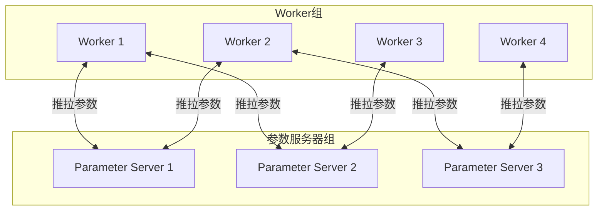

# 分布式机器学习基础

**文档版本**：v1.0
**创建时间**：2026年4月
**状态**：✅ 初稿完成

---

## 📋 执行摘要

分布式机器学习（Distributed Machine Learning）是将机器学习任务分布到多台计算节点上执行的计算范式，旨在解决大规模数据集和大型模型训练的计算需求。
随着深度学习模型规模的增长（从BERT到GPT-4），分布式训练已成为AI基础设施的核心。

**核心挑战**：

- 大规模数据并行处理
- 大模型参数存储与更新
- 分布式环境下的通信效率
- 容错与动态扩缩容

---

## 一、核心概念

### 1.1 定义与原理

分布式机器学习将训练任务分解到多个计算节点，通过协调机制实现：

- **数据并行**：将数据分片到不同节点，每个节点持有完整模型副本
- **模型并行**：将模型分片到不同节点，每个节点处理部分数据
- **混合并行**：结合数据并行和模型并行

### 1.2 并行策略对比

| 策略 | 适用场景 | 优点 | 缺点 |
|------|---------|------|------|
| **数据并行** | 数据量大，模型可放入单卡 | 实现简单，扩展性好 | 模型大小受限 |
| **模型并行** | 模型超大，无法放入单卡 | 支持超大模型 | 实现复杂，通信开销大 |
| **流水线并行** | 模型层数多 | 计算通信重叠 | 流水线气泡 |
| **张量并行** | 单层参数量大 | 细粒度并行 | 通信密集 |

### 1.3 分布式训练适用场景

| 场景 | 适用性 | 典型规模 |
|------|--------|---------|
| 大规模图像分类 | ⭐⭐⭐⭐⭐ | 数据TB级，模型1-10GB |
| 大语言模型训练 | ⭐⭐⭐⭐⭐ | 参数100B+，数据PB级 |
| 推荐系统训练 | ⭐⭐⭐⭐⭐ | Embedding表TB级 |
| 实时模型更新 | ⭐⭐⭐ | 低延迟要求 |
| 小模型快速迭代 | ⭐⭐ | 单卡可满足 |

---

## 二、技术细节

### 2.1 数据并行训练

#### 基础流程

```python
# 伪代码：数据并行训练
for epoch in range(num_epochs):
    for batch in data_loader:
        # 1. 每个worker获取一个数据分片
        local_batch = batch.split(num_workers)[worker_id]

        # 2. 前向传播（本地）
        loss = model(local_batch)

        # 3. 反向传播（本地）
        loss.backward()

        # 4. 梯度聚合（全局同步）
        all_reduce(gradients)

        # 5. 参数更新（本地）
        optimizer.step()
```

#### 梯度同步策略

**同步SGD（S-SGD）**

```
所有worker完成前向反向 → 聚合梯度 → 更新参数 → 下一批次
```

- **优点**：收敛稳定，与单机等价
- **缺点**：存在同步等待（straggler问题）

**异步SGD（A-SGD）**

```
worker完成计算 → 立即更新参数 → 获取最新参数 → 下一批次
```

- **优点**：无等待，吞吐高
- **缺点**：收敛不稳定，staleness问题

**延迟容忍SGD（Stale-Synchronous Parallel）**

- 允许一定程度的延迟（最大staleness = k）
- 平衡同步和异步的优点

### 2.2 模型并行训练

#### 层间并行（Pipeline Parallelism）

```
输入层 → [GPU0: Layer1-4] → [GPU1: Layer5-8] → [GPU2: Layer9-12] → 输出层
```

**流水线气泡问题**：

```
时间 →
GPU0: F1 F2 F3 F4
GPU1:    F1 F2 F3 F4
GPU2:       F1 F2 F3 F4

F=前向, B=反向
```

**优化技术**：

- **GPipe**：将mini-batch划分为micro-batch，流水线执行
- **PipeDream**：前向和反向交错，减少气泡

#### 层内并行（Tensor Parallelism）

将单层计算分布到多个GPU：

```python
# 矩阵乘法的张量并行
Y = X @ W  # X: [batch, in_dim], W: [in_dim, out_dim]

# 分割权重矩阵
W = [W1, W2, W3, W4]  # 每个GPU持有部分权重

# 各GPU计算局部输出
Y1 = X @ W1  # GPU0
Y2 = X @ W2  # GPU1
...

# 聚合结果
Y = concat([Y1, Y2, Y3, Y4])
```

**适用层类型**：

- Linear/Dense层
- Embedding层
- Attention层（Q/K/V分割）

### 2.3 参数服务器架构

#### 架构设计



#### 通信模式

**推（Push）**：Worker将梯度推送到PS

```python
# 异步推
ps.push(key, gradient)

# 同步推（聚合后）
ps.push(key, aggregated_gradient)
```

**拉（Pull）**：Worker从PS拉取参数

```python
# 拉取最新参数
params = ps.pull(key)
```

#### 参数分布策略

| 策略 | 描述 | 适用场景 |
|------|------|---------|
| **Range分区** | 按参数ID范围分片 | 参数访问有局部性 |
| **Hash分区** | 按哈希值分片 | 负载均衡 |
| **列表分区** | 按层或逻辑单元分片 | 模型并行 |

### 2.4 All-Reduce通信原语

#### Ring All-Reduce

```
假设：N个worker，每个worker有梯度G

Scatter-Reduce阶段（N-1轮）：
  每轮中，worker i发送数据到worker (i+1) mod N
  同时从worker (i-1) mod N接收数据并累加

All-Gather阶段（N-1轮）：
  每轮中，worker i发送聚合后的数据到worker (i+1) mod N
  同时从worker (i-1) mod N接收数据

结果：每个worker都有完整的聚合梯度
```

**通信量分析**：

- 每个worker发送/接收：2(N-1)/N × 数据量
- 与worker数量无关，可扩展性好

#### Tree All-Reduce

```
        [Root]
       /      \
    [Node1]  [Node2]
    /    \    /    \
 [W1]  [W2] [W3]  [W4]

Reduce：叶子到根聚合
Broadcast：根到叶子分发
```

#### 对比

| 算法 | 延迟 | 带宽效率 | 适用场景 |
|------|------|---------|---------|
| Ring | O(N) | 高 | 大消息，多节点 |
| Tree | O(log N) | 中 | 小消息，层次网络 |
| Butterfly | O(log N) | 高 | 特定网络拓扑 |

---

## 三、系统对比

### 3.1 主流分布式训练框架

| 框架 | 并行策略 | 通信后端 | 特点 |
|------|---------|---------|------|
| **Horovod** | 数据并行 | MPI/Gloo/NCCL | 易用，与TensorFlow/PyTorch集成 |
| **DeepSpeed** | 数据+模型+流水线 | NCCL | ZeRO优化，大模型训练 |
| **PyTorch FSDP** | 数据并行 | NCCL | 官方支持，内存优化 |
| **Megatron-LM** | 张量+流水线 | NCCL | NVIDIA开发，大模型专用 |
| **Ray Train** | 多种 | 灵活 | 统一API，弹性训练 |
| **TensorFlow Distribution** | 多种 | 多种 | TF官方方案 |

### 3.2 性能对比

| 框架 | 扩展效率(1024GPU) | 最大模型规模 | 易用性 |
|------|------------------|-------------|--------|
| Horovod | 85-90% | ~10B | ⭐⭐⭐⭐⭐ |
| DeepSpeed | 90-95% | >1T | ⭐⭐⭐⭐ |
| Megatron-LM | 90-95% | >1T | ⭐⭐⭐ |
| FSDP | 85-90% | ~100B | ⭐⭐⭐⭐⭐ |

### 3.3 选型决策树

```
模型规模？
├── <1B参数
│   └── 数据并行足够 → Horovod / PyTorch DDP
├── 1B-10B参数
│   ├── 内存不足？
│   │   ├── 是 → DeepSpeed ZeRO / FSDP
│   │   └── 否 → Horovod
│   └── 序列长度大？
│       ├── 是 → 考虑激活检查点 + ZeRO
│       └── 否 → 标准数据并行
└── >10B参数
    ├── 模型无法放入单卡？
    │   ├── 是 → Megatron-LM (张量+流水线并行)
    │   └── 否 → DeepSpeed ZeRO-Infinity
    └── 需要3D并行？
        ├── 是 → Megatron-LM + DeepSpeed
        └── 否 → DeepSpeed
```

---

## 四、实践指南

### 4.1 性能优化最佳实践

**1. 混合精度训练**

```python
# PyTorch示例
from torch.cuda.amp import autocast, GradScaler

scaler = GradScaler()
for batch in dataloader:
    with autocast():
        loss = model(batch)
    scaler.scale(loss).backward()
    scaler.step(optimizer)
    scaler.update()
```

- FP16减少显存占用50%
- 使用损失缩放防止梯度下溢
- 需要GPU支持Tensor Cores

**2. 梯度累积**

```python
# 模拟大batch训练
accumulation_steps = 4
for i, batch in enumerate(dataloader):
    loss = model(batch) / accumulation_steps
    loss.backward()

    if (i + 1) % accumulation_steps == 0:
        optimizer.step()
        optimizer.zero_grad()
```

**3. 激活检查点（Gradient Checkpointing）**

```python
from torch.utils.checkpoint import checkpoint

# 只保存部分层的激活，其余重计算
def forward(self, x):
    x = checkpoint(self.layer1, x)
    x = checkpoint(self.layer2, x)
    return x
```

- 显存换计算，可训练更大模型
- 约增加20-30%计算时间

**4. 通信优化**

- **梯度压缩**：1-bit Adam、Top-K稀疏化
- **重叠通信计算**：在反向传播时异步聚合梯度
- **分层All-Reduce**：机内NCCL，机间GDR

### 4.2 故障恢复

**检查点策略**：

```python
# 定期保存检查点
if step % checkpoint_interval == 0:
    torch.save({
        'model': model.state_dict(),
        'optimizer': optimizer.state_dict(),
        'scheduler': scheduler.state_dict(),
        'step': step,
    }, f'checkpoint_{step}.pt')
```

**弹性训练**：

- 使用Kubernetes或Slurm管理资源
- 检测到节点故障时，重新分配任务
- 从最近检查点恢复

### 4.3 常见问题

**Q1: 多节点训练卡死？**
A: 检查网络连通性、防火墙设置、NCCL环境变量

**Q2: 收敛速度比单机慢？**
A: 调整学习率（通常随batch size线性增加），检查数据加载是否成为瓶颈

**Q3: 显存OOM？**
A: 启用ZeRO/FSDP、使用激活检查点、减小batch size、使用混合精度

**Q4: 不同节点速度不一致？**
A: 使用同步数据加载器，检查存储性能差异，考虑使用 slower-first 调度

---

## 五、形式化分析

### 5.1 收敛性分析

**定理**：同步SGD的收敛速度与单机SGD相同，当batch size线性增加时，学习率也线性增加。

**证明概要**：

1. 设单机batch size为b，学习率为η
2. N个worker的分布式训练，总batch size = Nb
3. 梯度估计方差：Var(∇f) = σ²/(Nb)
4. 要达到相同收敛精度，学习率可设为Nη
5. 收敛速度：O(1/√(TNb))，与单机相同

### 5.2 通信复杂度

| 并行策略 | 每步通信量 | 通信频率 |
|---------|-----------|---------|
| 数据并行 | 2 × 模型大小 | 每batch |
| 模型并行 | 2 × 激活大小 | 每层前向/反向 |
| 流水线并行 | 2 × 边界激活 | 每micro-batch |

---

## 六、与其他主题的关联

### 6.1 上游依赖

- [All-Reduce算法](../../04-consensus/raft-family/all-reduce.md)
- [参数服务器](../../04-consensus/coordination/参数服务器.md)
- [分布式通信](../../03-communication/rpc/分布式通信基础.md)

### 6.2 下游应用

- [联邦学习](联邦学习.md)
- [大模型训练实践](大模型训练实践.md)
- [推荐系统分布式训练](推荐系统分布式训练.md)

### 6.3 相关主题

| 主题 | 关系 | 说明 |
|------|------|------|
| 联邦学习 | 扩展 | 隐私保护的分布式ML |
| 弹性训练 | 依赖 | 动态资源管理 |
| 模型压缩 | 互补 | 减少通信量 |

---

## 七、参考资源

### 7.1 学术论文

1. [Large Scale Distributed Deep Networks](https://research.google/pubs/pub40565/) - Dean et al., NIPS 2012
2. [ImageNet Training in Minutes](https://arxiv.org/abs/1709.05011) - You et al., 2017
3. [ZeRO: Memory Optimizations Toward Training Trillion Parameter Models](https://arxiv.org/abs/1910.02054) - Rajbhandari et al., 2019
4. [Efficient Large-Scale Language Model Training on GPU Clusters Using Megatron-LM](https://arxiv.org/abs/2104.04473) - Narayanan et al., 2021

### 7.2 开源项目

1. [Horovod](https://github.com/horovod/horovod) - Uber开源分布式训练框架
2. [DeepSpeed](https://github.com/microsoft/deepspeed) - 微软大模型训练库
3. [Megatron-LM](https://github.com/NVIDIA/Megatron-LM) - NVIDIA大模型并行库
4. [FSDP](https://pytorch.org/tutorials/intermediate/FSDP_tutorial.html) - PyTorch官方分布式训练

### 7.3 学习资料

1. [Distributed Training Tutorial](https://pytorch.org/tutorials/beginner/dist_overview.html) - PyTorch官方教程
2. [DeepSpeed Documentation](https://www.deepspeed.ai/docs/) - DeepSpeed官方文档
3. [MLSys Course](https://mlsys.stanford.edu/) - Stanford MLSys课程

---

**维护者**：项目团队
**最后更新**：2026年4月
