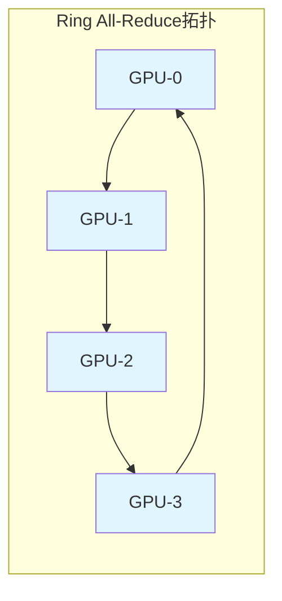
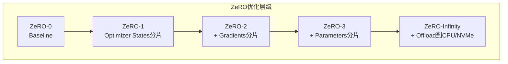
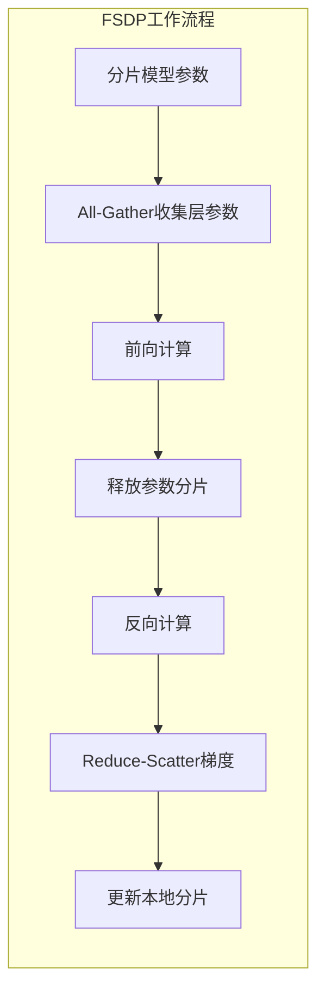
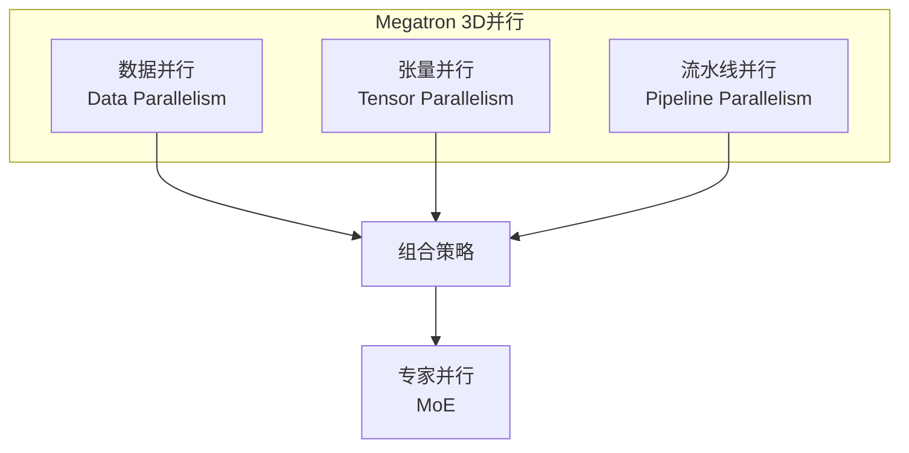

# 分布式训练框架对比 专题文档

**文档版本**：v1.0
**创建时间**：2026年
**最后更新**：2026年
**状态**：✅ 已完成

---

## 📋 执行摘要

本文档深入对比分析主流分布式深度学习训练框架：Horovod、DeepSpeed、PyTorch FSDP和Megatron-LM，涵盖其架构原理、核心优化技术、性能特点和适用场景，为大规模模型训练提供选型指导。

---

## 一、核心概念

### 1.1 定义与原理

**分布式训练框架**是支撑大规模深度学习模型在多个计算节点上高效训练的软件系统，主要解决以下挑战：

1. **数据并行**：将大批量数据分散到多个设备
2. **模型并行**：将大模型分割到多个设备
3. **通信优化**：最小化设备间数据传输开销
4. **内存优化**：突破单设备显存限制

**训练范式演进**：
```
单机单卡 → 数据并行(DP) → 分布式数据并行(DDP) → 
混合并行(DP+MP+PP) → ZeRO优化 → 3D并行
```

### 1.2 关键特性

- **通信效率**：All-Reduce算法优化、梯度压缩、重叠计算
- **内存效率**：ZeRO分片、激活检查点、Offloading
- **扩展性**：支持数百至数千GPU线性扩展
- **易用性**：最小代码改动、自动并行化

### 1.3 适用场景

| 场景 | 适用性 | 说明 |
|------|--------|------|
| 视觉模型(ResNet/ViT) | ⭐⭐⭐⭐⭐ | 数据并行即可满足 |
| BERT/GPT类模型 | ⭐⭐⭐⭐⭐ | 需要ZeRO或模型并行 |
| 超大规模模型(>100B) | ⭐⭐⭐⭐ | 需要3D并行 |
| MoE模型 | ⭐⭐⭐⭐ | 需要专家并行支持 |
| 多模态大模型 | ⭐⭐⭐⭐ | 复杂并行策略组合 |

---

## 二、技术细节

### 2.1 Horovod（Ring All-Reduce）

#### 2.1.1 架构设计



Horovod基于Uber开源的高性能分布式训练框架，核心特点：
- 基于NCCL实现高效Ring All-Reduce
- 支持TensorFlow、PyTorch、MXNet
- MPI风格的编程接口

#### 2.1.2 Ring All-Reduce算法

**算法原理**：
1. **Scatter-Reduce阶段**：每个GPU累加部分梯度（耗时：2(N-1)/N · α + 2(N-1)/N · β · V）
2. **All-Gather阶段**：广播完整结果（耗时：2(N-1)/N · α + (N-1)/N · β · V）

**总通信量**：2(N-1)/N · V ≈ 2V（每个GPU发送/接收约2倍数据量）

```python
# Horovod All-Reduce实现示意
def ring_allreduce(gradients, num_gpus):
    """
    Ring All-Reduce算法实现
    
    参数:
        gradients: 各GPU的梯度列表 [grad_0, grad_1, ..., grad_N]
        num_gpus: GPU数量
    """
    n = num_gpus
    chunk_size = len(gradients[0]) // n
    
    # Phase 1: Scatter-Reduce
    for step in range(n - 1):
        for gpu in range(n):
            send_to = (gpu + 1) % n
            recv_from = (gpu - 1 + n) % n
            chunk = (gpu - step + n) % n
            
            # 发送并累加
            send_chunk = gradients[gpu][chunk*chunk_size:(chunk+1)*chunk_size]
            recv_chunk = receive_from(recv_from)
            gradients[gpu][chunk*chunk_size:(chunk+1)*chunk_size] += recv_chunk
    
    # Phase 2: All-Gather
    for step in range(n - 1):
        for gpu in range(n):
            send_to = (gpu + 1) % n
            recv_from = (gpu - 1 + n) % n
            chunk = (gpu - step + 1 + n) % n
            
            # 广播完整结果
            send_chunk = gradients[gpu][chunk*chunk_size:(chunk+1)*chunk_size]
            gradients[send_to][chunk*chunk_size:(chunk+1)*chunk_size] = send_chunk
    
    return gradients
```

#### 2.1.3 代码示例

**PyTorch + Horovod**：
```python
import torch
import horovod.torch as hvd

# 初始化
hvd.init()
torch.cuda.set_device(hvd.local_rank())

# 定义模型
c model = MyModel().cuda()

# 包装优化器（关键：分布式梯度平均）
optimizer = torch.optim.SGD(model.parameters(), lr=0.01)
optimizer = hvd.DistributedOptimizer(
    optimizer,
    named_parameters=model.named_parameters(),
    compression=hvd.Compression.fp16,  # 梯度压缩
    op=hvd.Average  # All-Reduce操作：平均
)

# 广播初始参数
hvd.broadcast_parameters(model.state_dict(), root_rank=0)

# 训练循环
for epoch in range(num_epochs):
    for batch in dataloader:
        data, target = batch
        data, target = data.cuda(), target.cuda()
        
        optimizer.zero_grad()
        output = model(data)
        loss = criterion(output, target)
        loss.backward()
        
        # 自动执行All-Reduce
        optimizer.step()
        
        # 只在rank 0打印
        if hvd.rank() == 0:
            print(f"Epoch {epoch}, Loss: {loss.item()}")
```

**TensorFlow + Horovod**：
```python
import tensorflow as tf
import horovod.tensorflow as hvd

hvd.init()

# 设备配置
gpus = tf.config.experimental.list_physical_devices('GPU')
for gpu in gpus:
    tf.config.experimental.set_memory_growth(gpu, True)
if gpus:
    tf.config.experimental.set_visible_devices(gpus[hvd.local_rank()], 'GPU')

# 分布式优化器
opt = tf.optimizers.SGD(0.01 * hvd.size())
opt = hvd.DistributedOptimizer(opt)

# 训练（tf.function加速）
@tf.function
def training_step(images, labels):
    with tf.GradientTape() as tape:
        predictions = model(images, training=True)
        loss = loss_object(labels, predictions)
    
    # Horovod自动添加All-Reduce
    gradients = tape.gradient(loss, model.trainable_variables)
    opt.apply_gradients(zip(gradients, model.trainable_variables))
    
    return loss
```

---

### 2.2 DeepSpeed（ZeRO优化）

#### 2.2.1 架构设计

DeepSpeed是微软开源的大规模模型训练框架，核心创新是**ZeRO（Zero Redundancy Optimizer）**技术。



**内存占用对比**（假设模型参数为Ψ，Adam优化器，混合精度）：

| 组件 | 单卡 | ZeRO-1 | ZeRO-2 | ZeRO-3 |
|------|------|--------|--------|--------|
| 参数 | 2Ψ | 2Ψ | 2Ψ | 2Ψ/N |
| 梯度 | 2Ψ | 2Ψ | 2Ψ/N | 2Ψ/N |
| Optimizer States | 12Ψ | 12Ψ/N | 12Ψ/N | 12Ψ/N |
| **总计** | **16Ψ** | **4Ψ+12Ψ/N** | **2Ψ+14Ψ/N** | **16Ψ/N** |

N=64时，ZeRO-3可将单卡内存需求从16Ψ降至0.25Ψ（**64倍节省**）。

#### 2.2.2 ZeRO算法原理

**ZeRO-3参数分片**：
```python
class ZeRO3Optimizer:
    def __init__(self, model, num_gpus):
        self.num_gpus = num_gpus
        self.rank = dist.get_rank()
        
        # 分片参数
        self.param_shards = self.shard_parameters(model)
        
    def shard_parameters(self, model):
        """将参数分片到各GPU"""
        all_params = list(model.parameters())
        shards = [[] for _ in range(self.num_gpus)]
        
        for i, param in enumerate(all_params):
            target_gpu = i % self.num_gpus
            shards[target_gpu].append(param)
        
        return shards
    
    def forward(self, input):
        """前向传播时动态收集所需参数"""
        # 1. All-Gather收集当前层所需参数
        for layer in self.layers:
            params = self.allgather_params(layer)
            output = layer.forward_with_params(input, params)
            
            # 2. 释放非本GPU负责的参数
            self.release_params(params)
        
        return output
    
    def backward(self, loss):
        """反向传播时计算并分片梯度"""
        # 梯度也分片存储
        for param in self.params:
            if self.owns_param(param):
                param.grad = compute_gradient(param)
        
        # 梯度All-Reduce
        self.reduce_gradients()
    
    def step(self):
        """优化器状态分片更新"""
        # 只更新本GPU负责的参数
        for param in self.owned_params:
            self.optimizer_state[param].step(param.grad)
```

**DeepSpeed配置JSON**：
```json
{
    "train_batch_size": 512,
    "gradient_accumulation_steps": 4,
    "optimizer": {
        "type": "AdamW",
        "params": {
            "lr": 5e-5,
            "betas": [0.9, 0.999],
            "eps": 1e-8,
            "weight_decay": 0.01
        }
    },
    "scheduler": {
        "type": "WarmupLR",
        "params": {
            "warmup_min_lr": 0,
            "warmup_max_lr": 5e-5,
            "warmup_num_steps": 1000
        }
    },
    "zero_optimization": {
        "stage": 3,
        "offload_optimizer": {
            "device": "cpu",
            "pin_memory": true
        },
        "offload_param": {
            "device": "cpu",
            "pin_memory": true
        },
        "overlap_comm": true,
        "contiguous_gradients": true,
        "sub_group_size": 1e9,
        "reduce_bucket_size": 1e6,
        "stage3_prefetch_bucket_size": 1e6,
        "stage3_param_persistence_threshold": 1e5,
        "stage3_gather_16bit_weights_on_model_save": true
    },
    "gradient_clipping": 1.0,
    "fp16": {
        "enabled": true,
        "loss_scale": 0,
        "loss_scale_window": 1000,
        "initial_scale_power": 16,
        "hysteresis": 2,
        "min_loss_scale": 1
    },
    "activation_checkpointing": {
        "partition_activations": true,
        "cpu_checkpointing": true,
        "contiguous_memory_optimization": false,
        "number_checkpoints": null,
        "synchronize_checkpoint_boundary": false,
        "profile": false
    },
    "flops_profiler": {
        "enabled": true,
        "profile_step": 10,
        "module_depth": -1,
        "top_modules": 3,
        "detailed": true
    }
}
```

#### 2.2.3 代码示例

**GPT训练示例**：
```python
import deepspeed
import torch
from transformers import GPT2LMHeadModel, GPT2Config

# 初始化模型
config = GPT2Config(vocab_size=50257, n_embd=1600, n_layer=48, n_head=16)
model = GPT2LMHeadModel(config)

# DeepSpeed配置
ds_config = {
    "train_micro_batch_size_per_gpu": 4,
    "gradient_accumulation_steps": 8,
    "optimizer": {
        "type": "AdamW",
        "params": {"lr": 1e-4}
    },
    "fp16": {"enabled": True},
    "zero_optimization": {
        "stage": 2,
        "allgather_partitions": True,
        "allgather_bucket_size": 2e8,
        "overlap_comm": True,
        "reduce_scatter": True
    }
}

# 初始化DeepSpeed
model_engine, optimizer, _, _ = deepspeed.initialize(
    model=model,
    model_parameters=model.parameters(),
    config=ds_config
)

# 训练循环
for step, batch in enumerate(dataloader):
    loss = model_engine(batch)
    model_engine.backward(loss)
    model_engine.step()
    
    # 保存检查点
    if step % 1000 == 0:
        model_engine.save_checkpoint(save_dir, step)
```

---

### 2.3 PyTorch FSDP

#### 2.3.1 架构设计

**Fully Sharded Data Parallel (FSDP)** 是PyTorch原生的数据并行方案，设计理念与ZeRO-3类似。



**FSDP vs DDP对比**：

| 特性 | DDP | FSDP |
|------|-----|------|
| 参数存储 | 每卡完整副本 | 分片存储 |
| 显存占用 | 高（与GPU数无关） | 低（随GPU数减少） |
| 通信量 | 单次All-Reduce | All-Gather + Reduce-Scatter |
| 适用模型 | 中小模型 | 大模型 |
| 代码改动 | 最小 | 中等（需包装层） |

#### 2.3.2 FSDP实现机制

**核心类设计**：
```python
import torch
import torch.nn as nn
from torch.distributed.fsdp import FullyShardedDataParallel as FSDP
from torch.distributed.fsdp.wrap import transformer_auto_wrap_policy

class FSDPWrapper(nn.Module):
    """FSDP包装器内部实现示意"""
    
    def __init__(self, module, process_group=None):
        super().__init__()
        self.module = module
        self.process_group = process_group or dist.group.WORLD
        self.world_size = dist.get_world_size(self.process_group)
        self.rank = dist.get_rank(self.process_group)
        
        # 分片参数
        self._shard_parameters()
    
    def _shard_parameters(self):
        """将参数分片到各rank"""
        for p in self.module.parameters():
            # 计算分片大小
            numel = p.numel()
            chunk_size = (numel + self.world_size - 1) // self.world_size
            
            # 每个rank只保留自己的分片
            start = self.rank * chunk_size
            end = min(start + chunk_size, numel)
            
            # 创建分片存储
            p._local_shard = p.data.flatten()[start:end].clone()
            p.data = None  # 释放完整参数
    
    def forward(self, *args, **kwargs):
        """前向传播时重建完整参数"""
        # 1. All-Gather收集所有分片
        self._all_gather_params()
        
        # 2. 前向计算
        output = self.module(*args, **kwargs)
        
        # 3. 释放完整参数（保留分片）
        self._free_full_params()
        
        return output
    
    def _all_gather_params(self):
        """收集所有分片重建完整参数"""
        for p in self.module.parameters():
            if hasattr(p, '_local_shard'):
                # All-Gather操作
                gathered = [torch.zeros_like(p._local_shard) 
                           for _ in range(self.world_size)]
                dist.all_gather(gathered, p._local_shard, self.process_group)
                p.data = torch.cat(gathered).view(p._orig_shape)
```

#### 2.3.3 代码示例

**FSDP基本使用**：
```python
import torch
import torch.nn as nn
from torch.distributed.fsdp import FullyShardedDataParallel as FSDP
from torch.distributed.fsdp.wrap import (
    transformer_auto_wrap_policy,
    size_based_auto_wrap_policy,
    enable_wrap,
    wrap,
)
from torch.distributed.fsdp.api import (
    MixedPrecision,
    BackwardPrefetch,
    ShardingStrategy,
)

# 定义模型
class MyTransformer(nn.Module):
    def __init__(self):
        super().__init__()
        self.layers = nn.ModuleList([
            TransformerBlock() for _ in range(24)
        ])
    
    def forward(self, x):
        for layer in self.layers:
            x = layer(x)
        return x

# 自动包装策略
auto_wrap_policy = transformer_auto_wrap_policy(
    transformer_layer_cls={TransformerBlock},
)

# 混合精度配置
mp_policy = MixedPrecision(
    param_dtype=torch.float16,
    reduce_dtype=torch.float16,
    buffer_dtype=torch.float32,
)

# 包装模型
model = MyTransformer().cuda()
fsdp_model = FSDP(
    model,
    auto_wrap_policy=auto_wrap_policy,
    mixed_precision=mp_policy,
    sharding_strategy=ShardingStrategy.FULL_SHARD,
    backward_prefetch=BackwardPrefetch.BACKWARD_PRE,
    device_id=torch.cuda.current_device(),
    limit_all_gathers=True,
)

# 优化器（注意：只优化本地分片）
optimizer = torch.optim.AdamW(fsdp_model.parameters(), lr=1e-4)

# 训练
for batch in dataloader:
    optimizer.zero_grad()
    output = fsdp_model(batch)
    loss = criterion(output, target)
    loss.backward()
    optimizer.step()
```

**高级配置：激活检查点 + Offload**：
```python
from torch.distributed.fsdp import CPUOffload
from torch.distributed.algorithms._checkpoint.checkpoint_wrapper import (
    checkpoint_wrapper,
    CheckpointImpl,
    apply_activation_checkpointing,
)

# 激活检查点
non_reentrant_wrapper = functools.partial(
    checkpoint_wrapper,
    offload_to_cpu=False,
    checkpoint_impl=CheckpointImpl.NO_REENTRANT,
)

check_fn = lambda submodule: isinstance(submodule, TransformerBlock)
apply_activation_checkpointing(
    fsdp_model,
    checkpoint_wrapper_fn=non_reentrant_wrapper,
    check_fn=check_fn
)

# CPU Offload（类似ZeRO-Offload）
fsdp_model = FSDP(
    model,
    cpu_offload=CPUOffload(offload_params=True),
    auto_wrap_policy=auto_wrap_policy,
)
```

---

### 2.4 Megatron-LM（大模型并行）

#### 2.4.1 架构设计

Megatron-LM是NVIDIA开源的大模型训练框架，专注于**Transformer模型的高效并行**。



**三种并行策略**：

| 并行类型 | 分割对象 | 通信类型 | 适用场景 |
|----------|----------|----------|----------|
| 数据并行 | 训练数据 | All-Reduce | 通用 |
| 张量并行 | 层内参数 | All-Reduce/All-Gather | 单层过大 |
| 流水线并行 | 层间参数 | P2P Send/Recv | 层数过多 |

#### 2.4.2 张量并行算法

**列并行线性层**：
```python
class ColumnParallelLinear(nn.Module):
    """
    线性层列并行：将输出特征分片
    Y = X @ W^T = [X @ W_1^T | X @ W_2^T | ...]
    """
    def __init__(self, input_size, output_size, world_size):
        super().__init__()
        self.input_size = input_size
        self.output_size_per_partition = output_size // world_size
        
        # 每个rank只创建部分权重
        self.weight = nn.Parameter(
            torch.empty(self.output_size_per_partition, input_size)
        )
        self.bias = nn.Parameter(
            torch.empty(self.output_size_per_partition)
        )
    
    def forward(self, input):
        # 本地计算
        output_parallel = F.linear(input, self.weight, self.bias)
        
        # All-Gather收集完整输出
        output = gather_from_tensor_model_parallel_region(output_parallel)
        return output
```

**行并行线性层**：
```python
class RowParallelLinear(nn.Module):
    """
    线性层行并行：将输入特征分片
    Y = X @ W^T = [X_1 | X_2 | ...] @ [W_1^T; W_2^T; ...]
    """
    def __init__(self, input_size, output_size, world_size):
        super().__init__()
        self.input_size_per_partition = input_size // world_size
        self.output_size = output_size
        
        # 每个rank只创建部分权重
        self.weight = nn.Parameter(
            torch.empty(output_size, self.input_size_per_partition)
        )
        self.bias = nn.Parameter(torch.empty(output_size))
    
    def forward(self, input):
        # 输入先分片
        input_parallel = scatter_to_tensor_model_parallel_region(input)
        
        # 本地计算
        output_parallel = F.linear(input_parallel, self.weight)
        
        # All-Reduce累加各rank结果
        output = reduce_from_tensor_model_parallel_region(output_parallel)
        output = output + self.bias
        return output
```

**MLP并行化**：
```python
class ParallelMLP(nn.Module):
    """
    MLP层并行化：第一个线性层列并行，第二个线性层行并行
    中间需要GeLU激活函数（点wise操作，无需通信）
    """
    def __init__(self, hidden_size, ffn_hidden_size):
        super().__init__()
        # 列并行：输出分片
        self.dense_h_to_4h = ColumnParallelLinear(
            hidden_size, ffn_hidden_size
        )
        # 行并行：输入分片
        self.dense_4h_to_h = RowParallelLinear(
            ffn_hidden_size, hidden_size
        )
        self.activation = F.gelu
    
    def forward(self, hidden_states):
        # [b, s, h] -> [b, s, 4h/world_size]
        intermediate = self.dense_h_to_4h(hidden_states)
        intermediate = self.activation(intermediate)
        
        # [b, s, 4h/world_size] -> [b, s, h]
        output = self.dense_4h_to_h(intermediate)
        return output
```

#### 2.4.3 流水线并行

**流水线调度算法（1F1B - One Forward One Backward）**：
```python
class PipelineParallelScheduler:
    """
    1F1B流水线调度：减少气泡时间，节省激活内存
    """
    def __init__(self, num_stages, num_microbatches):
        self.num_stages = num_stages
        self.num_microbatches = num_microbatches
        self.stage_id = get_pipeline_parallel_rank()
    
    def forward_backward_pipelining(self, batch):
        """执行前向-反向流水线"""
        # 前向阶段
        input_tensors = []
        output_tensors = []
        
        for i in range(self.num_microbatches):
            # 接收上一stage的输出
            if self.stage_id > 0:
                input_tensor = recv_forward()
            else:
                input_tensor = batch[i]
            
            input_tensors.append(input_tensor)
            
            # 前向计算
            output_tensor = self.forward_step(input_tensor)
            output_tensors.append(output_tensor)
            
            # 发送给下一stage
            if self.stage_id < self.num_stages - 1:
                send_forward(output_tensor)
        
        # 反向阶段（1F1B）
        for i in range(self.num_microbatches):
            # 接收反向梯度
            if self.stage_id < self.num_stages - 1:
                output_grad = recv_backward()
            else:
                output_grad = compute_loss_grad(output_tensors[-(i+1)])
            
            # 反向计算
            input_grad = self.backward_step(
                input_tensors[-(i+1)],
                output_tensors[-(i+1)],
                output_grad
            )
            
            # 发送给上一stage
            if self.stage_id > 0:
                send_backward(input_grad)
            
            # 释放激活值
            del input_tensors[-(i+1)], output_tensors[-(i+1)]
```

**流水线气泡时间分析**：
```
设：p = 流水线stage数，m = microbatch数，t_f = 单个microbatch前向时间，t_b = 反向时间

GPipe（全部前向再反向）：
气泡时间 = (p - 1) × (t_f + t_b)

1F1B（交错执行）：
气泡时间 ≈ (p - 1) × (t_f + t_b) / m  (当m >> p时趋近于0)
```

#### 2.4.4 代码示例

**Megatron-LM GPT训练**：
```python
from megatron import get_args, get_tokenizer
from megatron.model import GPTModel
from megatron.training import pretrain
from megatron.core import parallel_state
from megatron.core.tensor_parallel import (
    get_tensor_model_parallel_group,
    get_tensor_model_parallel_rank,
    get_tensor_model_parallel_world_size,
)

def model_provider(pre_process=True, post_process=True):
    """构建并行化GPT模型"""
    args = get_args()
    
    model = GPTModel(
        num_tokentypes=0,
        parallel_output=True,
        pre_process=pre_process,
        post_process=post_process,
    )
    return model

def forward_step(data_iterator, model):
    """前向步骤"""
    tokens, labels, loss_mask, attention_mask, position_ids = get_batch(data_iterator)
    
    output = model(tokens, position_ids, attention_mask, labels=labels)
    
    # 计算loss
    losses = output.float()
    loss_mask = loss_mask.view(-1).float()
    loss = torch.sum(losses.view(-1) * loss_mask) / loss_mask.sum()
    return loss, {'lm_loss': loss}

# 启动训练
if __name__ == "__main__":
    pretrain(
        train_valid_test_datasets_provider,
        model_provider,
        ModelType.encoder_or_decoder,
        forward_step,
        args_defaults={'tokenizer_type': 'GPT2BPETokenizer'},
    )
```

**自定义并行Transformer层**：
```python
from megatron.core.transformer.transformer_layer import TransformerLayer
from megatron.core.transformer.attention import SelfAttention
from megatron.core.transformer.mlp import MLP
from megatron.core.tensor_parallel.layers import (
    ColumnParallelLinear,
    RowParallelLinear,
)

class ParallelTransformerLayer(TransformerLayer):
    """张量并行的Transformer层"""
    
    def __init__(self, config):
        super().__init__(config)
        
        # 自注意力层（列并行QKV，行并行输出）
        self.self_attention = SelfAttention(
            config,
            layer_number=1,
            attn_mask_type=AttnMaskType.causal,
        )
        
        # MLP层（列并行+行并行）
        self.mlp = MLP(config)
        
        # LayerNorm（复制在所有rank）
        self.input_layernorm = LayerNorm(config.hidden_size)
        self.post_attention_layernorm = LayerNorm(config.hidden_size)
    
    def forward(self, hidden_states, attention_mask):
        # 残差连接1：Attention
        residual = hidden_states
        hidden_states = self.input_layernorm(hidden_states)
        attention_output = self.self_attention(hidden_states, attention_mask)
        hidden_states = residual + attention_output
        
        # 残差连接2：MLP
        residual = hidden_states
        hidden_states = self.post_attention_layernorm(hidden_states)
        mlp_output = self.mlp(hidden_states)
        hidden_states = residual + mlp_output
        
        return hidden_states
```

---

## 三、系统对比

### 3.1 框架综合对比矩阵

| 维度 | Horovod | DeepSpeed | PyTorch FSDP | Megatron-LM |
|------|---------|-----------|--------------|-------------|
| **核心优化** | Ring All-Reduce | ZeRO分片 | FSDP分片 | 3D并行 |
| **支持并行** | 数据并行 | DP+ZeRO+PP | DP+PP | DP+TP+PP |
| **最大模型** | ~10B | ~1T (ZeRO-Infinity) | ~100B | ~1T+ |
| **易用性** | ⭐⭐⭐⭐⭐ | ⭐⭐⭐⭐ | ⭐⭐⭐⭐ | ⭐⭐⭐ |
| **性能优化** | ⭐⭐⭐⭐ | ⭐⭐⭐⭐⭐ | ⭐⭐⭐⭐ | ⭐⭐⭐⭐⭐ |
| **框架绑定** | 多框架 | PyTorch | PyTorch | PyTorch |
| **生产就绪** | ⭐⭐⭐⭐⭐ | ⭐⭐⭐⭐⭐ | ⭐⭐⭐⭐ | ⭐⭐⭐⭐ |
| **社区生态** | ⭐⭐⭐⭐ | ⭐⭐⭐⭐⭐ | ⭐⭐⭐⭐⭐ | ⭐⭐⭐⭐ |

### 3.2 性能基准对比

**GPT-3规模模型训练性能（A100 80GB）**：

| 配置 | 模型大小 | GPU数 | 吞吐量 (samples/s) | 显存/GPU |
|------|----------|-------|-------------------|----------|
| DDP | 1.3B | 8 | 12.5 | 73GB |
| Horovod | 1.3B | 8 | 13.2 | 73GB |
| DeepSpeed ZeRO-2 | 1.3B | 8 | 14.8 | 35GB |
| DeepSpeed ZeRO-3 | 1.3B | 8 | 13.5 | 12GB |
| FSDP | 1.3B | 8 | 14.2 | 15GB |
| Megatron TP | 1.3B | 8 | 12.0 | 20GB |

**超大规模模型（GPT-3 175B）**：

| 框架 | 配置 | 训练速度 (samples/s/GPU) | 显存效率 |
|------|------|-------------------------|----------|
| DeepSpeed ZeRO-Infinity | 512 A100 | 2.1 | 95% |
| Megatron-LM 3D | 1024 A100 | 3.2 | 90% |
| FSDP + TP | 512 A100 | 2.8 | 88% |

### 3.3 选型决策树

```
模型规模?
├── < 1B 参数
│   ├── 多框架需求? ──→ Horovod
│   └── 纯PyTorch? ──→ PyTorch DDP
├── 1B - 10B 参数
│   ├── 显存紧张? ──→ DeepSpeed ZeRO-2 或 FSDP
│   └── 追求简单? ──→ Horovod / DDP + 梯度累积
├── 10B - 100B 参数
│   ├── 需要Offload? ──→ DeepSpeed ZeRO-3/Infinity
│   └── 纯GPU方案? ──→ FSDP + 激活检查点
└── > 100B 参数
    ├── Transformer架构? ──→ Megatron-LM (TP+PP)
    ├── MoE架构? ──→ DeepSpeed + Expert Parallel
    └── 通用架构? ──→ DeepSpeed ZeRO-Infinity
```

---

## 四、实践指南

### 4.1 部署配置

**Horovod多机部署**：
```bash
# hosts.txt
worker-0 slots=8
worker-1 slots=8
worker-2 slots=8

# 启动训练
horovodrun -np 24 -H hosts.txt \
    --network-interface eth0 \
    python train.py \
    --batch-size 32 \
    --use-horovod
```

**DeepSpeed多节点配置**：
```bash
# hostfile
gpu-node-1 slots=8
gpu-node-2 slots=8
gpu-node-3 slots=8
gpu-node-4 slots=8

# 启动
deepspeed --num_gpus 8 --num_nodes 4 \
    --hostfile hostfile \
    train.py \
    --deepspeed_config ds_config.json \
    --batch-size 4
```

**FSDP SLURM提交**：
```bash
#!/bin/bash
#SBATCH --job-name=fsdp-training
#SBATCH --nodes=4
#SBATCH --ntasks-per-node=8
#SBATCH --gpus-per-node=8
#SBATCH --cpus-per-task=8

srun python train_fsdp.py \
    --nnodes $SLURM_NNODES \
    --nproc_per_node 8 \
    --rdzv_id $SLURM_JOB_ID \
    --rdzv_backend c10d \
    --rdzv_endpoint $(scontrol show hostnames $SLURM_JOB_NODELIST | head -n 1):29500
```

### 4.2 最佳实践

1. **Horovod优化**
   ```python
   # 1. 使用Tensor Fusion减少通信次数
   hvd.DistributedOptimizer(
       optimizer,
       named_parameters=model.named_parameters(),
       compression=hvd.Compression.fp16,
       op=hvd.Average,
       gradient_predivide_factor=1.0,
       num_groups=4,  # 梯度分组
   )
   
   # 2. 自动混合精度
   from torch.cuda.amp import autocast, GradScaler
   scaler = GradScaler()
   
   with autocast():
       output = model(input)
       loss = criterion(output, target)
   scaler.scale(loss).backward()
   scaler.step(optimizer)
   scaler.update()
   ```

2. **DeepSpeed调优**
   ```json
   {
       "zero_optimization": {
           "stage": 2,
           "overlap_comm": true,
           "contiguous_gradients": true,
           "reduce_bucket_size": 5e8,
           "allgather_bucket_size": 5e8
       },
       "gradient_accumulation_steps": "auto",
       "gradient_clipping": "auto",
       "train_batch_size": "auto",
       "train_micro_batch_size_per_gpu": "auto"
   }
   ```

3. **FSDP内存优化**
   ```python
   fsdp_model = FSDP(
       model,
       auto_wrap_policy=auto_wrap_policy,
       mixed_precision=torch.bfloat16,
       device_id=torch.cuda.current_device(),
       limit_all_gathers=True,  # 限制并发all-gather
       forward_prefetch=True,   # 预取下一层参数
       backward_prefetch=BackwardPrefetch.BACKWARD_PRE,
       cpu_offload=CPUOffload(offload_params=True),
   )
   ```

4. **Megatron-LM配置**
   ```bash
   # 启动GPT-3 175B训练
   python pretrain_gpt.py \
       --tensor-model-parallel-size 8 \
       --pipeline-model-parallel-size 16 \
       --num-layers 96 \
       --hidden-size 12288 \
       --num-attention-heads 96 \
       --seq-length 2048 \
       --max-position-embeddings 2048 \
       --micro-batch-size 1 \
       --global-batch-size 1536 \
       --train-samples 146484375 \
       --lr-decay-samples 126953125 \
       --lr-warmup-samples 183105 \
       --lr 6.0e-5 \
       --min-lr 6.0e-6
   ```

### 4.3 常见问题

**Q1: 多节点训练NCCL超时？**
A:
```bash
# 1. 增加NCCL超时时间
export NCCL_TIMEOUT=3600

# 2. 检查网络连接
export NCCL_DEBUG=INFO
export NCCL_SOCKET_IFNAME=eth0

# 3. 使用RDMA
export NCCL_IB_DISABLE=0
export NCCL_IB_CUDA_SUPPORT=1
```

**Q2: OOM错误排查？**
A:
```python
# 1. 启用DeepSpeed内存分析
{
    "activation_checkpointing": {
        "profile": true
    },
    "flops_profiler": {
        "enabled": true,
        "profile_step": 10
    }
}

# 2. FSDP内存摘要
from torch.distributed.fsdp import FullyShardedDataParallel as FSDP
FSDP.summarize_sharded_parameters(fsdp_model)

# 3. PyTorch内存分析
torch.cuda.memory_summary(device=None, abbreviated=False)
```

**Q3: 梯度累积导致收敛问题？**
A:
```python
# 正确调整学习率
base_lr = 1e-4
adjusted_lr = base_lr * gradient_accumulation_steps * num_gpus

# DeepSpeed自动调整
{
    "optimizer": {
        "params": {
            "lr": "auto"  # DeepSpeed根据global batch调整
        }
    }
}
```

---

## 五、形式化分析

### 5.1 通信复杂度分析

**All-Reduce vs Parameter Server**：

| 操作 | All-Reduce | Parameter Server |
|------|-----------|------------------|
| 通信量 | 2(N-1)/N · V ≈ 2V | 2V (Pull) + V (Push) = 3V |
| 通信轮数 | O(log N) Ring | O(1) |
| 带宽效率 | 高（流水线） | 低（PS瓶颈） |

**3D并行通信开销**：
```
总通信开销 = 
  Data Parallel (All-Reduce) +
  Tensor Parallel (All-Reduce/All-Gather) +
  Pipeline Parallel (P2P)

优化目标：最小化 通信量/计算量 比例
```

### 5.2 内存复杂度分析

**ZeRO-3内存占用**：
```
单GPU内存 = 
  Parameters/N + 
  Gradients/N + 
  Optimizer States/N +
  Activations

理论上限：可训练模型规模 ∝ N · GPU_memory
```

---

## 六、与其他主题的关联

### 6.1 上游依赖

- [参数服务器架构](./参数服务器架构.md)
- [GPU通信优化](../05-scheduling/GPU通信优化.md)
- [NCCL集合通信](../05-scheduling/NCCL通信原语.md)

### 6.2 下游应用

- [大语言模型训练](../../applications/ai/大模型训练.md)
- [多模态模型训练](../../applications/ai/多模态模型.md)
- [推荐系统训练](../../applications/ml-systems/推荐系统.md)

### 6.3 相关概念

| 概念 | 关系 | 说明 |
|------|------|------|
| 数据并行 | 基础 | 所有框架的基础并行方式 |
| 模型并行 | 组合 | 与张量并行、流水线并行结合 |
| 混合精度 | 优化 | FP16/BF16训练加速 |
| 激活检查点 | 内存优化 | 时间换空间的经典技术 |

---

## 七、参考资源

### 7.1 学术论文

1. [Horovod: fast and easy distributed deep learning in TensorFlow](https://arxiv.org/abs/1802.05799) - Sergeev et al., 2018
2. [ZeRO: Memory Optimizations Toward Training Trillion Parameter Models](https://arxiv.org/abs/1910.02054) - Rajbhandari et al., 2020
3. [DeepSpeed: System Optimizations Enable Training Deep Learning Models with Over 100 Billion Parameters](https://dl.acm.org/doi/10.1145/3394486.3406703) - Rasley et al., 2020
4. [Megatron-LM: Training Multi-Billion Parameter Language Models Using Model Parallelism](https://arxiv.org/abs/1909.08053) - Shoeybi et al., 2020
5. [Efficient Large-Scale Language Model Training on GPU Clusters Using Megatron-LM](https://arxiv.org/abs/2104.04473) - Narayanan et al., 2021
6. [PyTorch FSDP: Experiences on Scaling Fully Sharded Data Parallel](https://arxiv.org/abs/2304.11277) - AWS Team, 2023

### 7.2 开源项目

1. [Horovod](https://github.com/horovod/horovod) - Uber开源分布式训练框架
2. [DeepSpeed](https://github.com/microsoft/DeepSpeed) - 微软大模型训练库
3. [Megatron-LM](https://github.com/NVIDIA/Megatron-LM) - NVIDIA大模型训练
4. [FairScale](https://github.com/facebookresearch/fairscale) - Meta模型并行库（含FSDP前身）
5. [ColossalAI](https://github.com/hpcaitech/ColossalAI) - 统一并行训练框架

### 7.3 学习资料

1. [DeepSpeed教程](https://www.deepspeed.ai/tutorials/) - 官方文档
2. [PyTorch分布式训练](https://pytorch.org/tutorials/beginner/dist_overview.html) - 官方指南
3. [NVIDIA Megatron文档](https://docs.nvidia.com/megatron-core/) - Megatron使用指南
4. [大规模模型训练实践](https://lilianweng.github.io/posts/2021-09-25-train-large/) - Lilian Weng博客

### 7.4 相关文档

- [参数服务器架构](./参数服务器架构.md)
- [联邦学习](./联邦学习.md)
- [GPU集群调度](../05-scheduling/GPU调度.md)

---

**维护者**：分布式计算团队
**最后更新**：2026年
