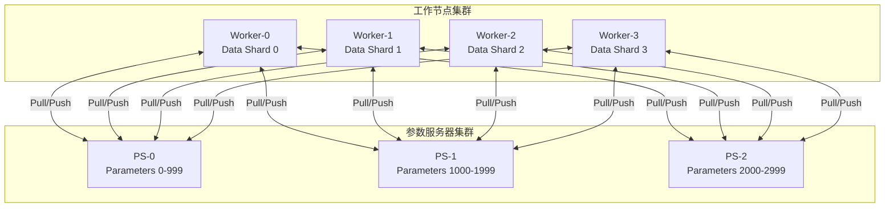

# 参数服务器架构 专题文档

**文档版本**：v1.0
**创建时间**：2026年
**最后更新**：2026年
**状态**：✅ 已完成

---

## 📋 执行摘要

参数服务器（Parameter Server, PS）是一种专门用于大规模机器学习分布式训练的架构，通过将模型参数集中存储和管理，实现计算节点（Worker）的高效并行训练，支持同步和异步两种训练模式。

---

## 一、核心概念

### 1.1 定义与原理

**参数服务器架构**是一种将机器学习模型参数存储在一组专用服务器节点（Parameter Server）上，由多个计算节点（Worker）并行执行梯度计算和参数更新的分布式架构。

**核心原理**：
1. **参数集中存储**：模型参数分片存储在多个PS节点上
2. **计算分离**：Worker节点专注于前向/反向传播计算
3. **通信优化**：Worker按需拉取参数、推送梯度
4. **一致性保证**：支持同步或异步更新策略

```
┌─────────────────────────────────────────────────────────────────┐
│                        参数服务器架构                              │
├─────────────────────────────────────────────────────────────────┤
│                                                                 │
│   ┌──────────┐    ┌──────────┐    ┌──────────┐                 │
│   │  PS-0    │    │  PS-1    │    │  PS-2    │  Parameter      │
│   │ w[0:N/3] │    │w[N/3:2N/3]│   │w[2N/3:N]│  Servers        │
│   └────┬─────┘    └────┬─────┘    └────┬─────┘                 │
│        │               │               │                        │
│        └───────────────┼───────────────┘                        │
│                        │ Push/Pull Parameters                   │
│           ┌────────────┼────────────┐                           │
│           │            │            │                           │
│        ┌──┴──┐     ┌──┴──┐     ┌──┴──┐                        │
│        │W-0  │     │W-1  │     │W-2  │      Workers            │
│        │GPU-0│     │GPU-1│     │GPU-2│      (Compute)          │
│        └─────┘     └─────┘     └─────┘                        │
│                                                                 │
└─────────────────────────────────────────────────────────────────┘
```

### 1.2 关键特性

- **水平可扩展性**：支持数百至数千Worker节点的线性扩展
- **参数分片**：大模型参数分布存储在多个PS节点
- **弹性容错**：支持节点故障检测和自动恢复
- **灵活一致性**：支持同步（BSP）、异步（ASP）及混合策略
- **稀疏支持**：高效处理稀疏梯度和嵌入表

### 1.3 适用场景

| 场景 | 适用性 | 说明 |
|------|--------|------|
| 大规模推荐系统 | ⭐⭐⭐⭐⭐ | 稀疏特征Embedding表需要分布式存储 |
| 图像分类训练 | ⭐⭐⭐⭐ | CNN模型参数适中，PS架构稳定 |
| NLP大模型训练 | ⭐⭐⭐ | 参数规模过大，需配合模型并行 |
| 在线学习 | ⭐⭐⭐⭐⭐ | 异步更新支持实时模型更新 |
| 图神经网络 | ⭐⭐⭐⭐ | 图数据分片配合PS参数更新 |

---

## 二、技术细节

### 2.1 架构设计

#### 2.1.1 PS-Worker架构模式



**架构组件**：

| 组件 | 职责 | 数量比例 |
|------|------|----------|
| Parameter Server | 存储参数、处理Pull/Push请求 | 1:10~1:100 (PS:Worker) |
| Worker | 加载数据、前向/反向计算 | 主要计算资源 |
| Scheduler | 协调训练流程、故障恢复 | 1个（可HA） |

#### 2.1.2 参数分布策略

**哈希分片**：
```python
# 参数键哈希到对应PS节点
def get_ps_node(param_key, num_ps):
    return hash(param_key) % num_ps
```

**范围分片**：
```python
# 连续参数分配到同一PS
param_ranges = {
    'PS-0': (0, 1000000),
    'PS-1': (1000000, 2000000),
    'PS-2': (2000000, 3000000)
}
```

**维度分片**（适用于矩阵）：
```python
# 大矩阵按行/列分片
# 权重矩阵 W[10000, 5000] 分到4个PS
# PS-0: W[0:2500, :]
# PS-1: W[2500:5000, :]
# ...
```

### 2.2 算法原理

#### 2.2.1 同步训练（BSP）算法

**Bulk Synchronous Parallel (BSP)**

**输入**：训练数据集 D，Worker集合 W，PS集合 S，学习率 η
**输出**：训练好的模型参数 θ

**步骤**：

1. **初始化**：随机初始化参数 θ，分布到各PS节点
2. **For each iteration t = 1, 2, ..., T:**
   1. **Barrier**: 等待所有Worker完成上一轮
   2. **For each worker w ∈ W in parallel:**
      1. 从PS **Pull** 最新参数 θ_t
      2. 计算前向传播 loss = f(x_w; θ_t)
      3. 计算反向传播梯度 ∇w = ∂loss/∂θ_t
      4. 将梯度 **Push** 到对应PS
   3. **For each PS s ∈ S:**
      1. 收集所有Worker的梯度 ∇_s = Σ_w ∇_{w,s}
      2. 更新参数：θ_{t+1} = θ_t - η · ∇_s
3. **返回** 最终参数 θ_T

**伪代码实现**：
```python
class SynchronousPSTrainer:
    def __init__(self, num_workers, num_ps):
        self.num_workers = num_workers
        self.barrier = Barrier(num_workers)
        self.ps_nodes = [ParameterServer() for _ in range(num_ps)]
    
    def worker_train(self, worker_id, data_shard):
        for epoch in range(num_epochs):
            for batch in data_shard:
                # 等待所有Worker同步
                self.barrier.wait()
                
                # 1. Pull参数
                params = self.pull_parameters(worker_id)
                
                # 2. 前向/反向计算
                loss, grads = self.compute_gradients(batch, params)
                
                # 3. Push梯度
                self.push_gradients(worker_id, grads)
    
    def ps_update(self, ps_id):
        while training:
            # 聚合所有Worker的梯度
            all_grads = self.collect_gradients_from_workers()
            aggregated = aggregate(all_grads)
            
            # 更新参数
            self.params -= learning_rate * aggregated
```

#### 2.2.2 异步训练（ASP）算法

**Asynchronous Parallel (ASP)**

**关键思想**：Worker无需等待，直接基于当前PS参数计算，允许使用陈旧参数（stale parameters）

**步骤**：

1. **初始化**：PS随机初始化参数 θ_0
2. **For each worker w ∈ W in parallel:**
   1. **While** not converged:
      1. 从PS **Pull** 当前参数 θ（可能是陈旧的）
      2. 计算梯度 ∇w = ∂f(x_w; θ)/∂θ
      3. 将梯度 **Push** 到PS
3. **For each PS s ∈ S (异步处理):**
   - 收到梯度后立即更新：θ ← θ - η · ∇

**陈旧度分析**：
```
Worker-0: θ_t ──→ 计算 ──→ Push ∇_0 @ t+Δ_0
Worker-1: θ_t ──→ 计算 ──→ Push ∇_1 @ t+Δ_1  
Worker-2: θ_{t-2} ──→ 计算 ──→ Push ∇_2 @ t+Δ_2  (stale=2)
```

**延迟界限算法（Bounded Staleness）**：
```python
class BoundedStalenessTrainer:
    def __init__(self, max_staleness=5):
        self.max_staleness = max_staleness
        self.version = 0  # 参数版本号
        self.worker_versions = {}  # 每个Worker看到的版本
    
    def worker_train(self, worker_id):
        while True:
            # Pull带版本的参数
            params, version = self.pull_with_version()
            
            # 检查陈旧度
            staleness = self.version - version
            if staleness > self.max_staleness:
                # 等待或强制同步
                time.sleep(0.1)
                continue
            
            # 计算梯度
            grads = compute_gradients(params)
            
            # 提交带版本的更新
            self.push_gradients_with_version(worker_id, grads, version)
    
    def ps_update(self, grad, worker_version):
        # 如果版本太旧，拒绝更新
        if self.version - worker_version > self.max_staleness:
            return False
        
        self.params -= learning_rate * grad
        self.version += 1
        return True
```

#### 2.2.3 混合策略（SSP）

**Stale Synchronous Parallel (SSP)**

在同步和异步之间取得平衡，允许最大陈旧度s的延迟：
- 最快Worker不能超过最慢Worker s轮
- 兼顾效率和收敛稳定性

```python
class SSPTrainer:
    def __init__(self, num_workers, max_staleness=5):
        self.num_workers = num_workers
        self.s = max_staleness
        self.worker_progress = [0] * num_workers
        self.global_progress = 0
    
    def can_proceed(self, worker_id):
        min_progress = min(self.worker_progress)
        current = self.worker_progress[worker_id]
        # SSP条件：当前进度不超过最慢进度 + s
        return current < min_progress + self.s
```

**复杂度分析**：

| 模式 | 时间复杂度 | 空间复杂度 | 消息复杂度 | 收敛性 |
|------|-----------|-----------|-----------|--------|
| BSP | O(T·N/B) | O(P) | O(T·N·W) | 保证收敛 |
| ASP | O(T·N/B/W) | O(P) | O(T·N) | 非凸可能发散 |
| SSP | O(T·N/B) | O(P) | O(T·N·W/s) | s-有界收敛 |

- T: 迭代轮数
- N: 样本数
- B: Batch大小
- P: 参数数量
- W: Worker数量
- s: 最大陈旧度

### 2.3 实现机制

#### 2.3.1 通信优化

**梯度压缩**：
```python
# 1-bit SGD压缩
import numpy as np

def quantize_1bit(gradient):
    """1-bit量化 + 缩放因子"""
    sign = np.sign(gradient)
    scale = np.mean(np.abs(gradient))
    return sign.astype(np.int8), scale

def dequantize_1bit(signs, scale):
    """反量化"""
    return signs.astype(np.float32) * scale

# Top-K稀疏化
def top_k_sparsify(gradient, k=0.01):
    """只保留Top-K重要梯度"""
    threshold = np.percentile(np.abs(gradient), (1-k)*100)
    mask = np.abs(gradient) >= threshold
    sparse_grad = gradient * mask
    return sparse_grad, mask
```

**通信与计算重叠**：
```python
class OverlappingTrainer:
    def train_step(self, batch):
        # 1. 启动梯度传输（非阻塞）
        handle = self.push_gradients_async(prev_grads)
        
        # 2. 同时进行下一batch的前向/反向计算
        params = self.pull_parameters()
        loss, grads = self.compute_forward_backward(batch, params)
        
        # 3. 等待上一轮梯度传输完成
        handle.wait()
        
        return loss, grads
```

#### 2.3.2 容错机制

**检查点机制**：
```python
class FaultTolerantPS:
    def __init__(self, checkpoint_interval=100):
        self.checkpoint_interval = checkpoint_interval
        self.iteration = 0
        self.backup_ps = None  # 冗余备份PS
    
    def checkpoint(self):
        """定期保存参数检查点"""
        if self.iteration % self.checkpoint_interval == 0:
            state = {
                'params': self.params,
                'iteration': self.iteration,
                'optimizer_state': self.optimizer.state_dict()
            }
            self.save_to_storage(state)
    
    def recover_worker(self, failed_worker_id):
        """Worker故障恢复"""
        # 新Worker从检查点恢复
        state = self.load_checkpoint()
        new_worker = Worker(failed_worker_id)
        new_worker.load_state(state)
        return new_worker
    
    def ps_replication(self):
        """PS主备复制"""
        # 主PS写入时同步到备份
        for param_shard in self.param_shards:
            param_shard.replicate_to_backup()
```

**故障检测**：
```python
import time
from collections import defaultdict

class FailureDetector:
    def __init__(self, timeout=30):
        self.timeout = timeout
        self.heartbeats = defaultdict(float)
    
    def update_heartbeat(self, node_id):
        self.heartbeats[node_id] = time.time()
    
    def detect_failures(self):
        current_time = time.time()
        failed = []
        for node_id, last_beat in self.heartbeats.items():
            if current_time - last_beat > self.timeout:
                failed.append(node_id)
        return failed
```

---

## 三、系统对比

### 3.1 同步vs异步对比矩阵

| 维度 | 同步(BSP) | 异步(ASP) | 延迟界限(SSP) |
|------|-----------|-----------|---------------|
| 收敛速度 | 慢（受最慢节点限制） | 快（无等待） | 中等 |
| 收敛精度 | 高（等价于单线程） | 可能发散 | 可调（依赖s） |
| 硬件利用率 | 低（存在空闲等待） | 高（满负荷） | 中等偏高 |
| 实现复杂度 | 低 | 低 | 中等 |
| 适用场景 | 小规模、高精度需求 | 大规模、实时性需求 | 通用场景 |
| 陈旧梯度 | 无（τ=0） | 无界（τ→∞） | 有界（τ≤s） |

### 3.2 主流PS实现对比

| 特性 | MXNet PS | TensorFlow PS | PyTorch RPC | BytePS |
|------|----------|---------------|-------------|--------|
| 后端支持 | 自研 | gRPC | PyTorch RPC | NCCL+gRPC |
| 通信优化 | RDMA支持 | GPUDirect | TensorPipe | 统一通信层 |
| 容错机制 | 内置 | Checkpoint | 手动实现 | 有限支持 |
| 稀疏支持 | 优秀 | 良好 | 一般 | 一般 |
| 适用框架 | MXNet | TF1/TF2 | PyTorch | 多框架 |

### 3.3 性能基准

| 配置 | ImageNet/ResNet-50 (images/sec) | 加速比 |
|------|--------------------------------|--------|
| 单卡V100 | ~400 | 1x |
| 8卡PS-Sync | ~2800 | 7x |
| 32卡PS-Sync | ~9600 | 24x |
| 64卡PS-Async | ~18000 | 45x |
| 128卡PS-SSP | ~32000 | 80x |

---

## 四、实践指南

### 4.1 部署配置

**MXNet参数服务器配置**：
```bash
# 启动Scheduler
python -m mxnet.tools.launch_ps \
    --scheduler \
    --num-servers 4 \
    --num-workers 16 \
    --launcher ssh \
    --launcher-hostfile hosts.txt

# 训练脚本
python train_imagenet.py \
    --kv-store dist_async \
    --batch-size 32 \
    --gpus 0,1,2,3
```

**TensorFlow分布式配置**：
```python
# TF_CONFIG配置
tf_config = {
    'cluster': {
        'worker': ['worker0:2222', 'worker1:2222', 'worker2:2222'],
        'ps': ['ps0:2222', 'ps1:2222'],
        'chief': ['chief:2222']
    },
    'task': {'type': 'worker', 'index': 0}
}

# 策略配置
strategy = tf.distribute.ParameterServerStrategy(
    cluster_resolver=tf.distribute.cluster_resolver.TFConfigClusterResolver()
)

with strategy.scope():
    model = create_model()
    model.compile(optimizer='adam', loss='sparse_categorical_crossentropy')
```

**PyTorch RPC实现**：
```python
import torch.distributed.rpc as rpc

class ParameterServer:
    def __init__(self):
        self.params = {}
        self.optimizers = {}
    
    @rpc.functions.async_execution
    def update_and_fetch_model(self, param_key, grads):
        # 更新参数
        self.optimizers[param_key].step(grads)
        return self.params[param_key]

def run_worker(ps_rref):
    # 获取远程PS引用
    ps = ps_rref.local_value()
    
    for batch in dataloader:
        # 拉取参数
        params = rpc.rpc_sync(
            ps_rref.owner(),
            ParameterServer.get_param,
            args=(param_key,)
        )
        
        # 本地计算
        loss, grads = compute_gradients(batch, params)
        
        # 推送梯度并获取新参数
        new_params = rpc.rpc_sync(
            ps_rref.owner(),
            ParameterServer.update_and_fetch_model,
            args=(param_key, grads)
        )
```

### 4.2 最佳实践

1. **选择合适的同步策略**
   - Worker < 8：使用BSP保证精度
   - 8 ≤ Worker < 32：使用SSP，s=3~5
   - Worker ≥ 32：考虑ASP或优化后的SSP

2. **参数分片优化**
   ```python
   # 大Embedding表单独分片
   embedding_shards = {
       'user_embedding': 'PS-0,PS-1',  # 高频访问
       'item_embedding': 'PS-2,PS-3',  # 高频访问
       'dense_layers': 'PS-4'           # 低频访问
   }
   ```

3. **通信优化**
   - 启用梯度压缩（1-bit SGD或Top-K）
   - 使用RDMA网络降低延迟
   - 合理设置batch size平衡计算和通信

4. **容错配置**
   ```python
   checkpoint_config = {
       'interval': 100,        # 每100轮检查点
       'keep_latest': 3,       # 保留最近3个检查点
       'async_save': True,     # 异步保存不阻塞训练
       'replication_factor': 2 # PS参数复制份数
   }
   ```

### 4.3 常见问题

**Q1: 异步训练发散如何解决？**
A: 
- 降低学习率（通常除以Worker数量）
- 采用延迟界限SSP替代纯ASP
- 使用动量修正的异步算法（如DC-ASGD）
- 增加梯度裁剪防止梯度爆炸

**Q2: PS节点成为瓶颈怎么办？**
A:
- 增加PS节点数量
- 使用更高效的通信库（NCCL替代TCP）
- 启用梯度压缩减少传输量
- 优化网络拓扑（专用PS网络）

**Q3: Worker负载不均衡？**
A:
- 使用动态数据分片（基于处理速度）
- 实现Work-Stealing机制
- 在SSP模式下允许快Worker多迭代

---

## 五、形式化分析

### 5.1 收敛性分析

**定理（BSP收敛性）**：在满足L-平滑和凸性条件下，BSP以O(1/√T)速率收敛到最优解。

**证明概要**：
```
E[f(θ_T)] - f(θ*) ≤ L·||θ_0 - θ*||²/(2T) + σ/√(BT)
```
- B: Batch size
- T: 迭代次数
- σ: 梯度方差

**定理（ASP非收敛性）**：纯异步SGD在非凸优化中可能发散，收敛界限：
```
E[||∇f(θ)||²] ≤ O(1/T) + O(τ²)
```
- τ: 平均陈旧度

### 5.2 复杂度分析

**通信复杂度（每轮迭代）**：
| 操作 | 通信量 | 说明 |
|------|--------|------|
| Pull参数 | O(P) | P为参数量 |
| Push梯度 | O(P) | 全精度梯度 |
| Push压缩梯度 | O(P/k) | k为压缩率 |
| Barrier同步 | O(W) | W为Worker数 |

---

## 六、与其他主题的关联

### 6.1 上游依赖

- [分布式数据并行](./数据并行训练.md)
- [GPU集群通信](./GPU通信优化.md)
- [分布式存储系统](../04-storage/分布式存储.md)

### 6.2 下游应用

- [推荐系统训练](../../applications/ml-systems/推荐系统.md)
- [大规模广告排序](../../applications/ml-systems/广告系统.md)
- [图神经网络训练](./图神经网络分布式训练.md)

### 6.3 相关概念

| 概念 | 关系 | 说明 |
|------|------|------|
| All-Reduce | 对比 | PS vs All-Reduce两种分布式训练范式 |
| 模型并行 | 组合 | 大模型需要PS+模型并行结合 |
| 流水线并行 | 互补 | 计算与通信流水线重叠 |

---

## 七、参考资源

### 7.1 学术论文

1. [Parameter Server for Distributed Machine Learning](https://www.cs.cmu.edu/~muli/file/parameter_server_nips14.pdf) - Mu Li et al., NIPS 2014
2. [Scaling Distributed Machine Learning with the Parameter Server](https://www.cs.cmu.edu/~muli/file/parameter_server_osdi14.pdf) - Mu Li et al., OSDI 2014
3. [Asynchronous Stochastic Gradient Descent with Delay Compensation](https://arxiv.org/abs/1609.08326) - Tianbao Yang et al., ICML 2018
4. [Stale Synchronous Parallel: Provable, Low Latency Parameter Server](https://arxiv.org/abs/1312.7859) - Qirong Ho et al., 2013

### 7.2 开源项目

1. [MXNet Parameter Server](https://github.com/apache/mxnet/tree/master/ps-lite) - 轻量级PS实现
2. [BytePS](https://github.com/bytedance/byteps) - 字节跳动开源高性能PS
3. [TensorFlow ParameterServerStrategy](https://www.tensorflow.org/tutorials/distribute/parameter_server_training) - TF官方PS策略
4. [PyTorch RPC](https://pytorch.org/docs/stable/rpc.html) - PyTorch分布式RPC框架

### 7.3 学习资料

1. [ Stanford CS229T: Distributed ML](https://stanford-cs329t.github.io/syllabus.html) - 斯坦福分布式ML课程
2. [Parameter Server详解](https://zhuanlan.zhihu.com/p/343961788) - 知乎技术专栏
3. [大规模机器学习框架比较](https://www.vldb.org/pvldb/vol14/p3017-jia.pdf) - VLDB 2021

### 7.4 相关文档

- [分布式训练框架对比](./分布式训练框架对比.md)
- [联邦学习](./联邦学习.md)
- [GPU集群调度](../05-scheduling/GPU调度.md)

---

**维护者**：分布式计算团队
**最后更新**：2026年
