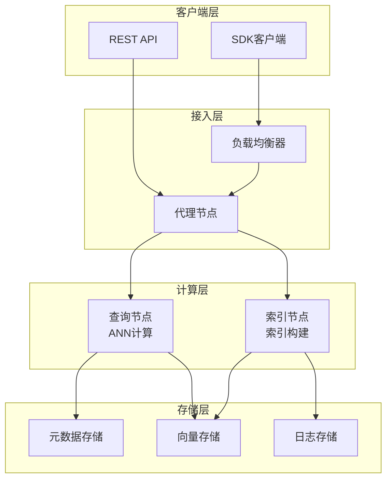

# 向量数据库对比 专题文档

**文档版本**：v1.0
**创建时间**：2026年
**最后更新**：2026年
**状态**：🔄 编写中

---

## 📋 执行摘要

向量数据库是专为存储和检索高维向量嵌入（Embedding）而设计的数据库系统，通过近似最近邻（ANN）算法实现高效的相似性搜索，是RAG、推荐系统等AI应用的核心基础设施。

---

## 一、核心概念

### 1.1 定义与原理

**向量嵌入（Embedding）**

- 将文本、图像、音频等非结构化数据转换为高维稠密向量（通常768-1536维）
- 语义相似的数据在向量空间中距离相近
- 通过预训练模型（如BERT、OpenAI Embeddings）生成

**向量检索原理**

- 将查询转换为向量后，在向量空间中寻找最近邻
- 精确最近邻（Exact NN）在高维空间下计算成本极高
- 采用近似最近邻（ANN）算法在精度和性能间取得平衡

```
文本/图像 → Embedding模型 → 高维向量 → 向量数据库 → ANN搜索 → 相似结果
```

### 1.2 关键特性

- **高维向量存储**：支持768-4096维向量存储，优化存储密度
- **近似最近邻搜索**：毫秒级响应亿级向量检索
- **混合查询**：支持向量相似度+元数据过滤的复合查询
- **分布式架构**：水平扩展支持十亿级向量
- **多模态支持**：文本、图像、音频统一向量表示

### 1.3 适用场景

| 场景 | 适用性 | 说明 |
|------|--------|------|
| RAG知识库 | ⭐⭐⭐⭐⭐ | 大模型外挂知识检索 |
| 语义搜索 | ⭐⭐⭐⭐⭐ | 理解意图的搜索引擎 |
| 推荐系统 | ⭐⭐⭐⭐⭐ | 基于内容的相似推荐 |
| 图像检索 | ⭐⭐⭐⭐ | 以图搜图、反向图片搜索 |
| 异常检测 | ⭐⭐⭐ | 向量空间中的离群点检测 |

---

## 二、技术细节

### 2.1 向量数据库架构



### 2.2 近似最近邻算法

#### HNSW（Hierarchical Navigable Small World）

**原理**：分层可导航小世界图算法

**构建过程**：

1. 构建多层图结构，上层稀疏、下层稠密
2. 新节点随机分配层数，从高层开始贪心搜索最近邻
3. 每层建立双向连接，控制出度保持图稀疏

**搜索过程**：

1. 从最高层入口点开始
2. 每层贪心搜索局部最近点
3. 找到下层入口后进入下一层
4. 最底层找到精确最近邻

**复杂度分析**：

- 构建复杂度：O(n log n)
- 搜索复杂度：O(log n)
- 空间复杂度：O(n)

**特点**：

- 精度高（召回率>95%）
- 内存占用大（需要存储图结构）
- 支持增量添加

#### IVF（Inverted File Index）

**原理**：倒排文件索引，基于聚类的近似搜索

**构建过程**：

1. 使用K-Means将向量空间划分为nlist个聚类中心
2. 每个向量归属到最近的聚类中心
3. 构建倒排列表存储每个聚类的向量ID

**搜索过程**：

1. 计算查询向量与所有聚类中心的距离
2. 选取nprobe个最近的聚类
3. 只在选中的聚类内进行精确搜索

**复杂度分析**：

- 构建复杂度：O(n × nlist × iter)
- 搜索复杂度：O(nprobe × (n/nlist))
- 空间复杂度：O(n)

**特点**：

- 内存友好
- 需要定期重建索引
- 参数nprobe控制精度/性能权衡

#### 算法对比

| 算法 | 精度 | 内存 | 构建速度 | 增量支持 |
|------|------|------|----------|----------|
| HNSW | ⭐⭐⭐⭐⭐ | 高 | 中等 | ✅ |
| IVF | ⭐⭐⭐⭐ | 中 | 快 | ❌ |
| IVF-PQ | ⭐⭐⭐ | 低 | 慢 | ❌ |
| Flat | ⭐⭐⭐⭐⭐ | 高 | 无 | ✅ |

---

## 三、系统对比

### 3.1 主流向量数据库对比矩阵

| 维度 | Milvus | Pinecone | Weaviate | pgvector |
|------|--------|----------|----------|----------|
| **部署方式** | 本地/云/K8s | 全托管SaaS | 本地/云 | PostgreSQL扩展 |
| **开源** | Apache 2.0 | ❌ | BSD | PostgreSQL |
| **最大规模** | 百亿级 | 十亿级 | 亿级 | 千万级 |
| **索引算法** | HNSW/IVF/FLAT | 专有 | HNSW | HNSW/IVF |
| **混合查询** | ✅ | ✅ | ✅ | ✅ |
| **多模态** | ✅ | ❌ | ✅ | ❌ |
| **向量维度** | 32768 | 20000 | 无限制 | 16000 |

### 3.2 系统深度分析

#### Milvus

**架构特点**：

- 存算分离架构，支持独立扩展
- 支持多种索引类型（HNSW、IVF_FLAT、IVF_PQ等）
- 基于etcd的元数据管理
- 支持多副本和高可用

**适用场景**：

- 大规模生产环境
- 需要灵活索引选择
- 私有化部署需求

#### Pinecone

**架构特点**：

- 全托管SaaS服务
- 零运维，自动扩缩容
- 元数据过滤支持丰富
- 多租户隔离

**适用场景**：

- 快速原型开发
- 不想运维基础设施
- 中小规模应用

#### Weaviate

**架构特点**：

- 模块化架构，支持自定义模型
- 内置向量化模块
- GraphQL接口
- 支持向量+BM25混合搜索

**适用场景**：

- 需要内置Embedding
- 知识图谱应用
- GraphQL偏好团队

#### pgvector

**架构特点**：

- PostgreSQL扩展
- 支持SQL标准查询
- 与事务系统无缝集成
- HNSW和IVF索引支持

**适用场景**：

- 已有PostgreSQL基础设施
- 向量+结构化数据联合查询
- 中小规模数据

### 3.3 性能基准

| 指标 | Milvus | Pinecone | Weaviate | pgvector |
|------|--------|----------|----------|----------|
| 百万向量延迟 | 5-10ms | 10-20ms | 15-25ms | 20-50ms |
| 十亿向量QPS | 10000+ | 5000+ | 2000+ | - |
| 索引构建速度 | 快 | N/A | 中等 | 慢 |
| 内存效率 | 中 | 高 | 中 | 低 |

---

## 四、实践指南

### 4.1 选型决策树

```
数据规模评估
├── < 100万?
│   ├── 已有PostgreSQL? → pgvector
│   └── 不想运维? → Pinecone
├── 100万 - 1亿?
│   ├── 需要开源? → Milvus
│   └── 全托管优先? → Pinecone
└── > 1亿?
    ├── 私有化部署? → Milvus
    └── SaaS接受? → Pinecone
```

### 4.2 部署配置示例

**Milvus Helm部署**：

```yaml
# values.yaml
cluster:
  enabled: true

queryNode:
  replicas: 3
  resources:
    requests:
      memory: 8Gi
      cpu: 4

indexNode:
  replicas: 2
  resources:
    requests:
      memory: 16Gi
      cpu: 8

dataNode:
  replicas: 2
```

**pgvector启用**：

```sql
-- 安装扩展
CREATE EXTENSION IF NOT EXISTS vector;

-- 创建向量列
CREATE TABLE items (
    id bigserial PRIMARY KEY,
    embedding vector(1536),
    metadata jsonb
);

-- 创建HNSW索引
CREATE INDEX ON items USING hnsw (embedding vector_cosine_ops);
```

### 4.3 最佳实践

1. **索引选择策略**
   - 数据<100万：Flat暴力搜索
   - 数据百万级：HNSW（精度优先）或IVF（内存优先）
   - 数据亿级：HNSW配合分片

2. **Embedding维度优化**
   - 评估业务需求，必要时降维
   - OpenAI text-embedding-3-small: 1536维
   - 使用PCA可降低50%维度，精度损失<5%

3. **元数据设计**
   - 常用过滤字段建立索引
   - 避免大JSON字段存储在向量库
   - 使用标量过滤减少向量搜索范围

### 4.4 常见问题

**Q1: HNSW和IVF如何选择？**
A: 追求精度选HNSW，内存受限选IVF。HNSW召回率通常>95%，IVF约85-95%但内存节省30-50%。

**Q2: 向量维度对性能的影响？**
A: 维度增加会线性增加计算成本和内存占用。768维到1536维，内存翻倍，搜索时间增加30-50%。

**Q3: 如何评估向量数据库性能？**
A: 关注三个指标：Recall@K（召回率）、QPS（吞吐量）、P99延迟。建议用真实数据集测试。

---

## 五、形式化分析

### 5.1 ANN算法复杂度

**定理**：HNSW搜索复杂度为O(log n)，空间复杂度为O(n)

**证明概要**：

- 每层图满足NSW性质：短路径存在
- 期望跳数与图直径相关
- 多层结构使直径为O(log n)

---

## 六、与其他主题的关联

### 6.1 上游依赖

- [LLM大模型部署](./LLM大模型部署.md)
- [Embedding模型选择](../06-computing/machine-learning/)

### 6.2 下游应用

- [RAG应用架构](../06-computing/machine-learning/)
- [推荐系统](../06-computing/machine-learning/)

### 6.3 相关概念

| 概念 | 关系 | 说明 |
|------|------|------|
| 倒排索引 | 对比 | 文本检索vs向量检索 |
| 图数据库 | 关联 | 向量可作为图节点特征 |
| 向量量化 | 扩展 | PQ量化降低存储成本 |

---

## 七、参考资源

### 7.1 学术论文

1. [Efficient and robust approximate nearest neighbor search using Hierarchical Navigable Small World graphs](https://arxiv.org/abs/1603.09320) - Malkov & Yashunin, 2018
2. [Product Quantization for Nearest Neighbor Search](https://hal.inria.fr/file/index/docid/514462/filename/paper_jegou2011.pdf) - Jégou et al., 2011
3. [ANN-Benchmarks: A Benchmarking Tool for Approximate Nearest Neighbor Algorithms](https://arxiv.org/abs/1807.05614) - Aumüller et al., 2020

### 7.2 开源项目

1. [Milvus](https://github.com/milvus-io/milvus) - 云原生向量数据库
2. [pgvector](https://github.com/pgvector/pgvector) - PostgreSQL向量扩展
3. [Faiss](https://github.com/facebookresearch/faiss) - Facebook ANN库
4. [Annoy](https://github.com/spotify/annoy) - Spotify近似最近邻库

### 7.3 学习资料

1. [Vector Database Guide](https://zilliz.com/learn/what-is-vector-database) - Zilliz官方指南
2. [ANN Benchmarks](http://ann-benchmarks.com/) - 算法性能对比
3. [Embeddings向量数据库](https://www.pinecone.io/learn/vector-database/) - Pinecone教程

### 7.4 相关文档

- [RAG系统架构设计](../06-computing/machine-learning/)
- [Embedding模型对比](../06-computing/machine-learning/)

---

**维护者**：项目团队
**最后更新**：2026年
