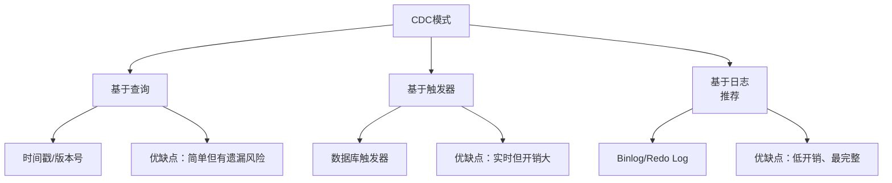
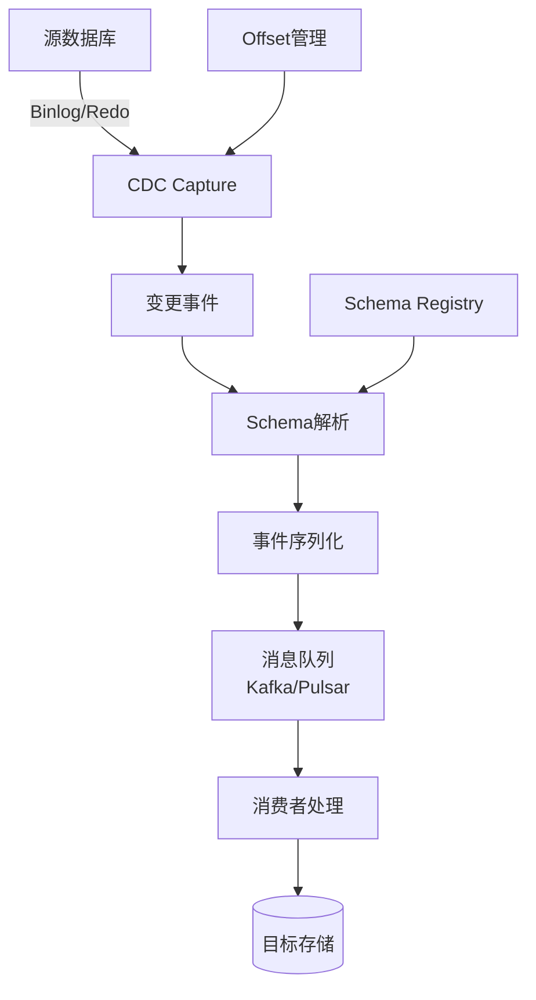
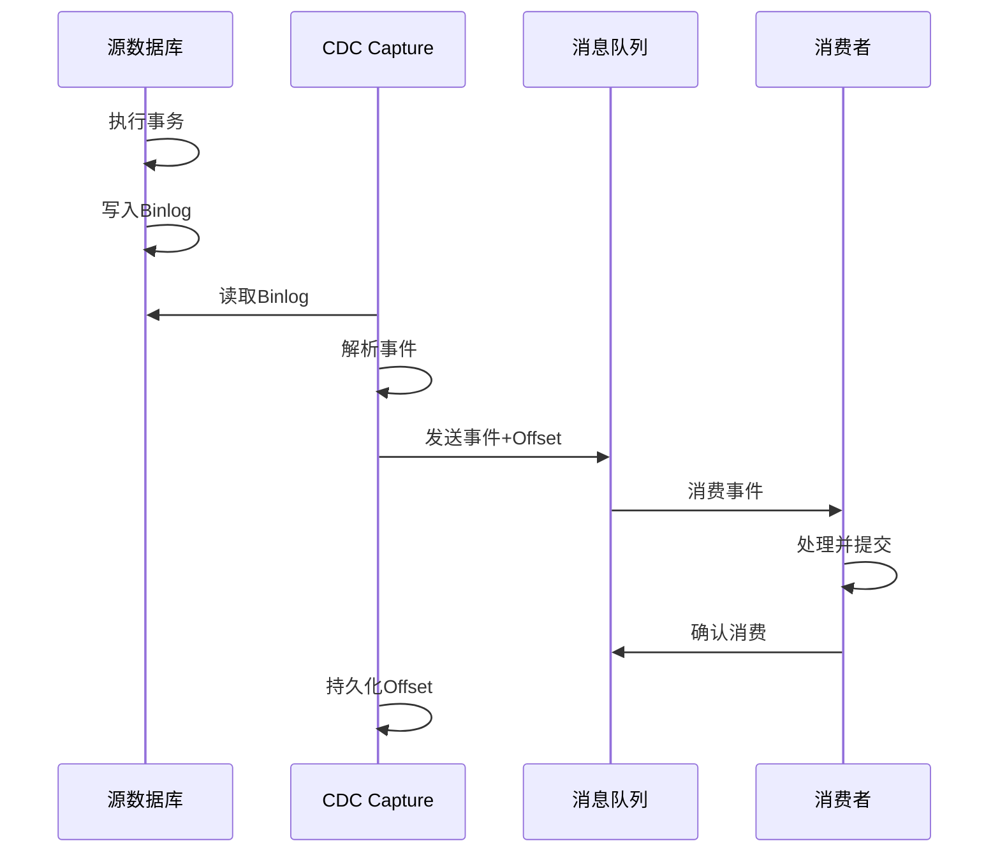
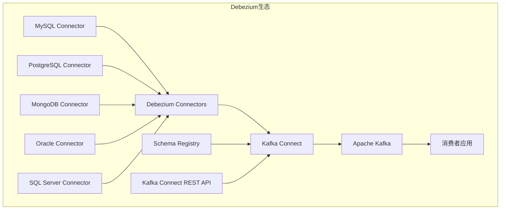
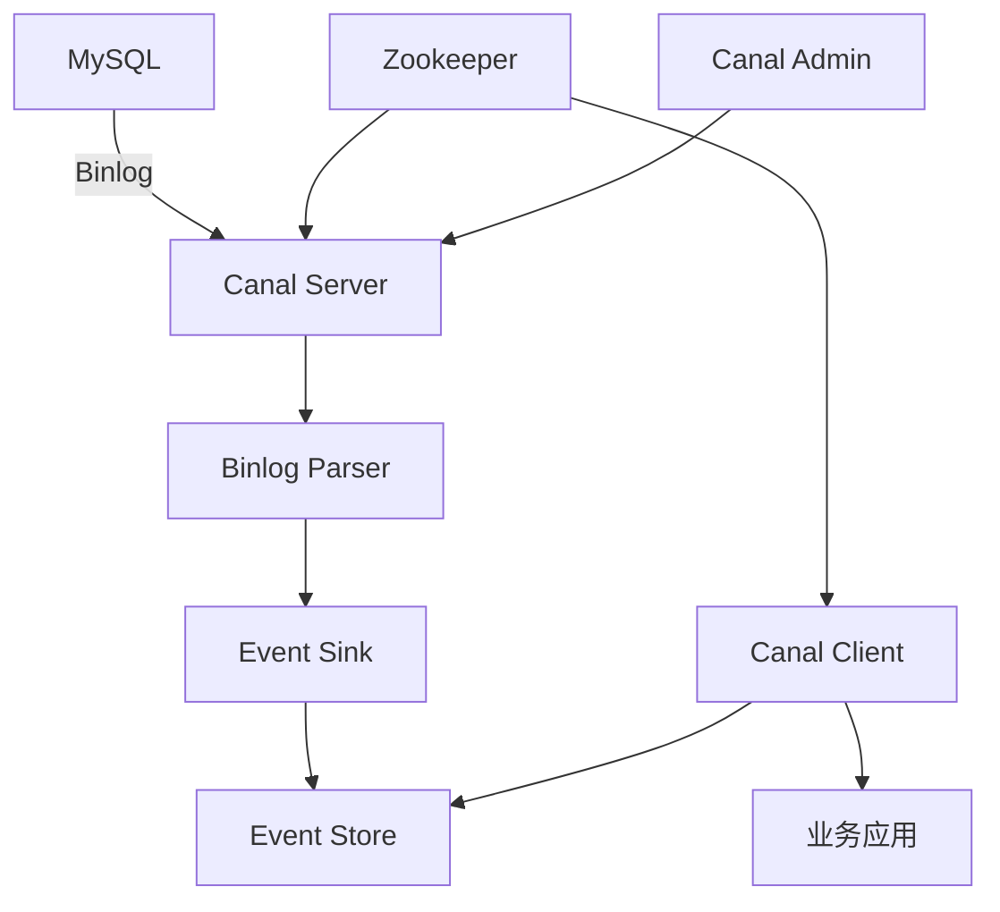
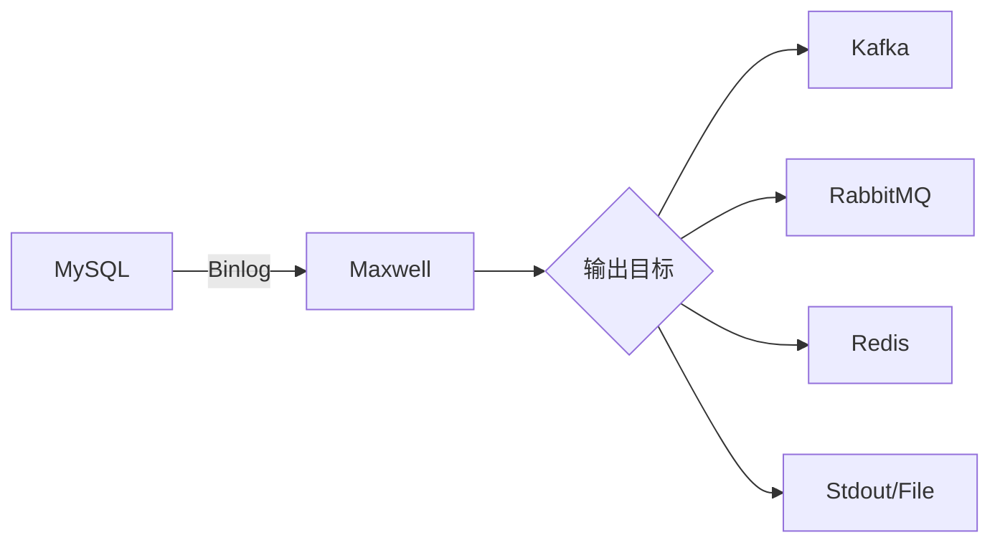
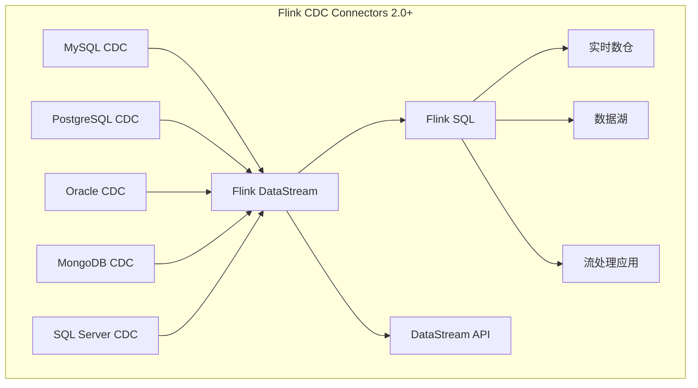
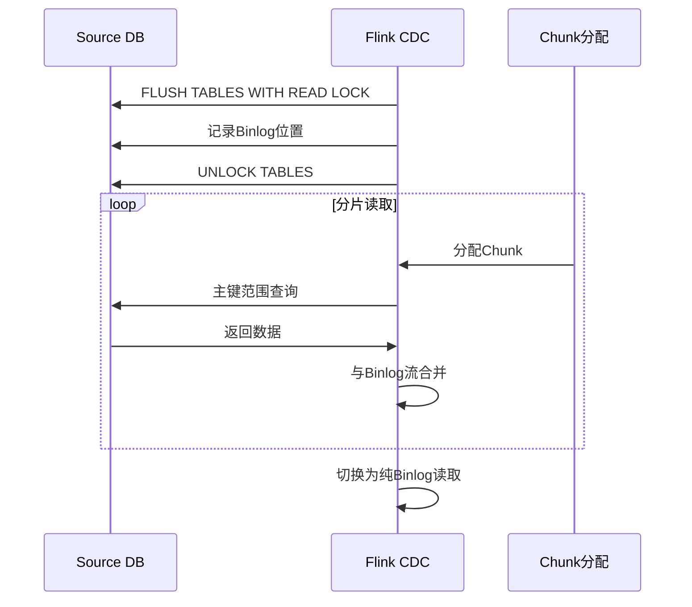

# CDC变更数据捕获 专题文档

**文档版本**：v1.0
**创建时间**：2026年
**最后更新**：2026年
**状态**：✅ 已完成

---

## 📋 执行摘要

变更数据捕获（Change Data Capture, CDC）是一种识别和捕获数据库数据变更的技术，实现数据从源系统到目标系统的实时同步。CDC是数据集成、实时数仓和数据湖构建的核心技术，支持全量加载、增量同步和实时流处理场景。

---

## 一、核心概念

### 1.1 定义与原理

**CDC定义**

变更数据捕获（CDC）是监测数据库中数据变化（插入、更新、删除）并捕获这些变化以供其他系统消费的技术。核心价值包括：

- **实时性**：秒级甚至毫秒级的数据同步延迟
- **低开销**：基于日志的CDC对源库影响极小
- **完整性**：捕获所有变更，支持 exactly-once 语义
- **可追溯**：记录变更历史，支持审计和回滚

### 1.2 CDC实现模式



| 模式 | 实现方式 | 优点 | 缺点 |
|------|---------|------|------|
| **基于查询** | SELECT + 时间戳/版本 | 简单通用 | 无法捕获删除，有延迟 |
| **基于触发器** | INSERT/UPDATE/DELETE触发器 | 实时捕获 | 源库开销大，维护复杂 |
| **基于日志** | 解析Binlog/Redo/WAL | 低开销、完整 | 依赖数据库日志格式 |

### 1.3 适用场景

| 场景 | 适用性 | 说明 |
|------|--------|------|
| 实时数仓构建 | ⭐⭐⭐⭐⭐ | 源库变更实时同步到数仓 |
| 数据湖增量摄取 | ⭐⭐⭐⭐⭐ | Hudi/Iceberg/Delta增量写入 |
| 缓存一致性 | ⭐⭐⭐⭐⭐ | 缓存与数据库实时同步 |
| 跨库数据同步 | ⭐⭐⭐⭐ | MySQL→PG、Oracle→MySQL等 |
| 事件驱动架构 | ⭐⭐⭐⭐ | 数据变更触发业务事件 |
| 审计日志 | ⭐⭐⭐⭐ | 记录所有数据变更历史 |

---

## 二、CDC技术原理

### 2.1 基于日志的CDC架构



### 2.2 MySQL Binlog格式

| 格式 | 描述 | 适用场景 |
|------|------|---------|
| **STATEMENT** | 记录SQL语句 | 简单场景，可能不一致 |
| **ROW** | 记录行级变更 | CDC推荐，包含前后像 |
| **MIXED** | 自动选择 | 不建议用于CDC |

**ROW格式事件结构**
```
Event Header:
  - timestamp
  - event_type (WRITE_ROWS/UPDATE_ROWS/DELETE_ROWS)
  - server_id
  - event_size
  - log_pos

Event Data:
  - table_id
  - flags
  - column_count
  - columns_bitmap
  - row_data (before_image/after_image)
```

### 2.3 数据一致性保证



---

## 三、Debezium架构

### 3.1 整体架构



### 3.2 核心组件

| 组件 | 功能 |
|------|------|
| **Connector** | 数据库特定的捕获实现 |
| **Offset Store** | 记录读取位置（Kafka topic） |
| **Schema Store** | 存储表结构变更历史 |
| **Kafka Connect** | 连接器运行时框架 |
| **Transformations** | 单消息转换（SMT） |

### 3.3 事件格式

```json
{
  "schema": {
    "type": "struct",
    "fields": [...]
  },
  "payload": {
    "before": {
      "id": 1001,
      "name": "Alice",
      "email": "alice@example.com"
    },
    "after": {
      "id": 1001,
      "name": "Alice Smith",
      "email": "alice@example.com"
    },
    "source": {
      "version": "2.4.0",
      "connector": "mysql",
      "name": "dbserver1",
      "ts_ms": 1704067200000,
      "db": "inventory",
      "table": "customers",
      "pos": 12345,
      "file": "mysql-bin.000001"
    },
    "op": "u",
    "ts_ms": 1704067200100
  }
}
```

### 3.4 部署配置

```json
{
  "name": "mysql-connector",
  "config": {
    "connector.class": "io.debezium.connector.mysql.MySqlConnector",
    "database.hostname": "mysql",
    "database.port": "3306",
    "database.user": "debezium",
    "database.password": "dbz",
    "database.server.name": "dbserver1",
    "database.include.list": "inventory",
    "table.include.list": "inventory.customers",
    "snapshot.mode": "initial",
    "tombstones.on.delete": "false",
    "decimal.handling.mode": "string",
    "time.precision.mode": "connect",
    "transforms": "unwrap",
    "transforms.unwrap.type": "io.debezium.transforms.ExtractNewRecordState",
    "transforms.unwrap.drop.tombstones": "false",
    "transforms.unwrap.delete.handling.mode": "rewrite"
  }
}
```

---

## 四、Canal（MySQL）

### 4.1 架构设计



### 4.2 核心特性

| 特性 | 说明 |
|------|------|
| **Binlog解析** | 基于MySQL Binlog协议 |
| **高可用** | Zookeeper协调多Instance |
| **消费模式** | Push/Pull两种模式 |
| **数据过滤** | 库/表/字段级别过滤 |
| **路由配置** | 灵活的数据路由规则 |

### 4.3 快速开始

```properties
# canal.properties
canal.serverMode = kafka
canal.mq.servers = kafka:9092
canal.mq.topic = example

# instance.properties
canal.instance.mysql.slaveId = 1234
canal.instance.master.address = 127.0.0.1:3306
canal.instance.dbUsername = canal
canal.instance.dbPassword = canal
canal.instance.connectionCharset = UTF-8
canal.instance.filter.regex = db\\.table1,db\\.table2
```

```java
// Canal Client示例
CanalConnector connector = CanalConnectors.newClusterConnector(
    "zk01:2181", "example", "", ""
);
connector.connect();
connector.subscribe("db\\.table");

while (running) {
    Message message = connector.getWithoutAck(100);
    long batchId = message.getId();
    
    for (Entry entry : message.getEntries()) {
        if (entry.getEntryType() == EntryType.ROWDATA) {
            RowChange rowChange = RowChange.parseFrom(entry.getStoreValue());
            for (RowData rowData : rowChange.getRowDatasList()) {
                // 处理变更数据
                processRowChange(rowChange.getEventType(), rowData);
            }
        }
    }
    connector.ack(batchId);
}
```

---

## 五、Maxwell

### 5.1 架构特点



### 5.2 核心特性

| 特性 | 说明 |
|------|------|
| **轻量级** | 单一进程，易于部署 |
| **JSON输出** | 简洁的JSON消息格式 |
| **Schema跟踪** | 自动处理表结构变更 |
| **Bootstrap** | 支持全量历史数据加载 |
| **过滤规则** | 灵活的包含/排除配置 |

### 5.3 配置示例

```properties
# config.properties
host=mysql
user=maxwell
password=maxwell
producer=kafka
kafka.bootstrap.servers=kafka:9092
kafka_topic=maxwell

# 过滤配置
include_dbs=inventory,orders
exclude_tables=inventory.temp_*,orders.log_*

# 全量加载
bootstrapper=async
```

### 5.4 消息格式

```json
{
  "database": "inventory",
  "table": "products",
  "type": "update",
  "ts": 1704067200,
  "xid": 12345,
  "commit": true,
  "data": {
    "id": 101,
    "name": "Product A",
    "price": 29.99
  },
  "old": {
    "price": 24.99
  }
}
```

---

## 六、Flink CDC

### 6.1 架构设计



### 6.2 核心特性

| 特性 | 说明 |
|------|------|
| **无锁读取** | 基于增量快照，不锁表 |
| **精确一次** | Flink Checkpoint保证 |
| **断点续传** | 基于Checkpoint恢复 |
| **Schema变更** | 自动处理表结构变化 |
| **全增量一体** | 自动切换全量和增量 |

### 6.3 Flink SQL CDC

```sql
-- 创建CDC源表
CREATE TABLE mysql_users (
    id BIGINT,
    name STRING,
    email STRING,
    update_time TIMESTAMP(3),
    PRIMARY KEY (id) NOT ENFORCED
) WITH (
    'connector' = 'mysql-cdc',
    'hostname' = 'mysql',
    'port' = '3306',
    'username' = 'flink',
    'password' = 'flink',
    'database-name' = 'inventory',
    'table-name' = 'users',
    'scan.startup.mode' = 'initial'
);

-- 创建目标表（例如写入StarRocks）
CREATE TABLE starrocks_users (
    id BIGINT,
    name STRING,
    email STRING,
    update_time TIMESTAMP(3),
    PRIMARY KEY (id) NOT ENFORCED
) WITH (
    'connector' = 'starrocks',
    'jdbc-url' = 'jdbc:mysql://starrocks:9030',
    'load-url' = 'starrocks:8030',
    'database-name' = 'ods',
    'table-name' = 'users',
    'username' = 'flink',
    'password' = 'flink'
);

-- 实时同步
INSERT INTO starrocks_users
SELECT * FROM mysql_users;
```

### 6.4 增量快照算法



---

## 七、系统对比

### 7.1 功能对比矩阵

| 维度 | Debezium | Canal | Maxwell | Flink CDC |
|------|----------|-------|---------|-----------|
| **主要场景** | 企业级CDC | MySQL同步 | 轻量级CDC | 流处理集成 |
| **支持数据库** | 10+种 | MySQL | MySQL | 6种 |
| **架构依赖** | Kafka Connect | 自建 | 无 | Flink |
| **消息格式** | JSON/Avro | Protobuf | JSON | RowData |
| **Schema变更** | ✅ | ✅ | ✅ | ✅ |
| **全量同步** | ✅ | ✅ | ✅ | ✅ |
| **精确一次** | ✅ | ❌ | ❌ | ✅ |
| **流处理集成** | ⚠️ | ❌ | ❌ | ⭐⭐⭐⭐⭐ |
| **部署复杂度** | 中 | 中 | 低 | 中 |
| **社区活跃度** | 极高 | 高 | 中 | 极高 |

### 7.2 性能基准

| 指标 | Debezium | Canal | Maxwell | Flink CDC |
|------|----------|-------|---------|-----------|
| **延迟** | ~1s | ~1s | ~1s | 亚秒级 |
| **吞吐** | 高 | 高 | 中 | 极高 |
| **资源占用** | 中 | 中 | 低 | 中高 |
| **扩展性** | 高 | 中 | 低 | 极高 |

### 7.3 选型决策树

```
需求分析
├── 需要与Flink流处理深度集成？
│   ├── 是 → Flink CDC（最佳选择）
│   └── 否 → 继续判断
├── 已有Kafka Connect基础设施？
│   ├── 是 → Debezium（企业级首选）
│   └── 否 → 继续判断
├── 仅MySQL且要求轻量级？
│   ├── 是 → Maxwell（简单部署）
│   └── 否 → 继续判断
├── 需要高可用集群部署？
│   ├── 是 → Canal（Zookeeper协调）
│   └── 否 → Debezium（Kafka Connect HA）
└── 默认推荐 → Debezium（功能最全、生态最好）
```

---

## 八、实践指南

### 8.1 Debezium生产配置

```json
{
  "name": "production-mysql-connector",
  "config": {
    "connector.class": "io.debezium.connector.mysql.MySqlConnector",
    "database.hostname": "${env:MYSQL_HOST}",
    "database.port": "3306",
    "database.user": "${env:MYSQL_USER}",
    "database.password": "${env:MYSQL_PASSWORD}",
    "database.server.name": "production",
    "database.include.list": "orders,payments",
    "table.include.list": "orders\\.order,orders\\.order_item",
    
    "snapshot.mode": "when_needed",
    "snapshot.fetch.size": 10000,
    "snapshot.max.threads": 4,
    
    "tombstones.on.delete": "false",
    "decimal.handling.mode": "string",
    "time.precision.mode": "connect",
    "binary.handling.mode": "hex",
    
    "max.batch.size": 2048,
    "max.queue.size": 8192,
    "poll.interval.ms": 1000,
    
    "heartbeat.interval.ms": 10000,
    "heartbeat.topics.prefix": "__debezium-heartbeat",
    
    "transforms": "route,unwrap",
    "transforms.route.type": "org.apache.kafka.connect.transforms.RegexRouter",
    "transforms.route.regex": "([^.]+)\\.([^.]+)\\.([^.]+)",
    "transforms.route.replacement": "$3",
    "transforms.unwrap.type": "io.debezium.transforms.ExtractNewRecordState",
    "transforms.unwrap.drop.tombstones": "false",
    "transforms.unwrap.delete.handling.mode": "rewrite",
    "transforms.unwrap.add.fields": "op,ts_ms,source.ts_ms"
  }
}
```

### 8.2 Flink CDC端到端示例

```java
// 构建MySQL CDC Source
MySqlSource<String> mySqlSource = MySqlSource.<String>builder()
    .hostname("mysql")
    .port(3306)
    .databaseList("inventory")
    .tableList("inventory.products")
    .username("flink")
    .password("flink")
    .deserializer(new JsonDebeziumDeserializationSchema())
    .startupOptions(StartupOptions.initial())
    .build();

// 构建Flink流处理作业
StreamExecutionEnvironment env = StreamExecutionEnvironment.getExecutionEnvironment();
env.enableCheckpointing(60000);
env.getCheckpointConfig().setCheckpointingMode(CheckpointingMode.EXACTLY_ONCE);

// 添加源并处理
env.fromSource(mySqlSource, WatermarkStrategy.noWatermarks(), "MySQL CDC")
    .map(json -> parseProduct(json))
    .addSink(new StarRocksSinkFunction<>());

env.execute("MySQL to StarRocks CDC");
```

### 8.3 监控与告警

```yaml
# CDC监控指标
metrics:
  - name: lag_seconds
    description: CDC延迟（秒）
    threshold: 
      warning: 60
      critical: 300
      
  - name: events_per_second
    description: 每秒事件数
    
  - name: error_count
    description: 错误计数
    threshold:
      critical: 10
      
  - name: connector_status
    description: 连接器状态
    expected: RUNNING
```

### 8.4 最佳实践

1. **高可用部署**
   - Debezium: 使用Kafka Connect分布式模式
   - Canal: 配置Zookeeper集群协调
   - Flink CDC: 利用Flink的Checkpoint和故障恢复

2. **性能优化**
   - 调整snapshot.fetch.size控制批量大小
   - 合理设置heartbeat.interval.ms
   - 监控binlog位置增长，及时清理

3. **Schema变更处理**
   - 启用Schema Registry管理Avro格式
   - 设计下游系统的Schema兼容性策略
   - 测试DDL变更的CDC行为

4. **数据一致性保障**
   - 使用事务型消息（Kafka事务）
   - 实现幂等消费者
   - 定期数据校验（Checksum比对）

### 8.5 常见问题

**Q1: CDC延迟过高如何排查？**

A:
1. 检查源库Binlog生成速度
2. 监控CDC消费延迟（lag）
3. 调整并行度和批量大小
4. 检查网络带宽和下游消费速度

**Q2: 如何处理大事务导致的OOM？**

A:
```properties
# Debezium配置
max.batch.size=512
max.queue.size=2048

# Flink CDC配置
debezium.max.batch.size=512
debezium.max.queue.size=2048
```

**Q3: Schema变更后如何处理？**

A:
- 使用Schema Registry进行版本管理
- 下游系统实现Schema Evolution
- 考虑使用兼容性格式（如Avro with Schema Registry）

---

## 九、与其他主题的关联

### 9.1 上游依赖

- [数据湖架构](../../05-storage/lakehouse/数据湖架构.md)
- [数据仓库对比](数据仓库对比.md)

### 9.2 下游应用

- [Kafka消息队列](../../07-messaging/kafka-architecture.md)
- [Flink流处理](flink-architecture.md)

### 9.3 相关概念

| 概念 | 关系 | 说明 |
|------|------|------|
| ETL | 对比 | CDC是实时ETL的一种形式 |
| 消息队列 | 依赖 | CDC事件通常投递到MQ |
| 数据湖 | 集成 | CDC数据写入Hudi/Iceberg/Delta |

---

## 十、参考资源

### 10.1 官方文档

1. [Debezium官方文档](https://debezium.io/documentation/) - 分布式CDC平台
2. [Canal GitHub](https://github.com/alibaba/canal) - MySQL Binlog解析
3. [Maxwell GitHub](https://github.com/zendesk/maxwell) - MySQL CDC工具
4. [Flink CDC文档](https://nightlies.apache.org/flink/flink-cdc-docs-stable/) - Flink CDC Connectors

### 10.2 技术文章

1. [Change Data Capture Patterns](https://martinfowler.com/articles/201701-event-driven.html) - Martin Fowler
2. [Flink CDC 2.0详解](https://ververica.github.io/flink-cdc-connectors/) - 增量快照算法

### 10.3 开源项目

1. [Debezium](https://github.com/debezium/debezium) - 分布式CDC平台
2. [Canal](https://github.com/alibaba/canal) - 阿里巴巴MySQL Binlog解析
3. [Maxwell](https://github.com/zendesk/maxwell) - MySQL CDC应用
4. [Flink CDC](https://github.com/ververica/flink-cdc-connectors) - Flink CDC Connectors

---

**维护者**：项目团队
**最后更新**：2026年
