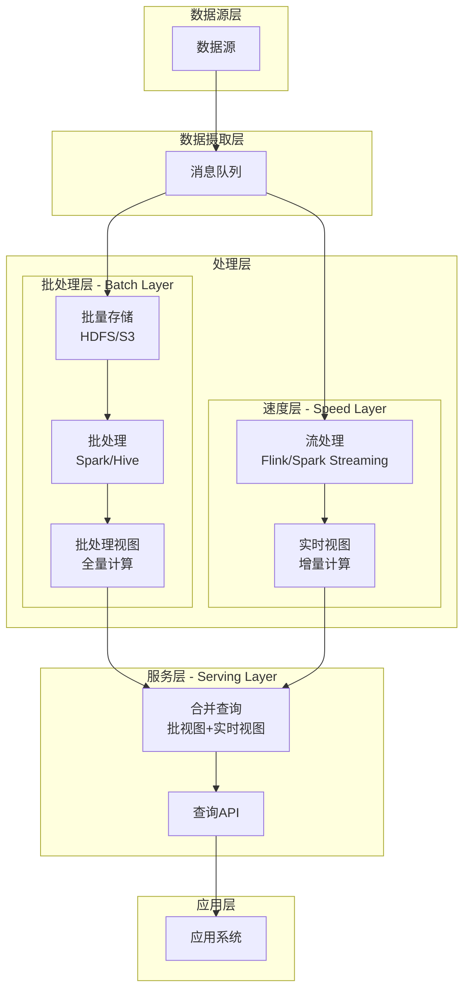
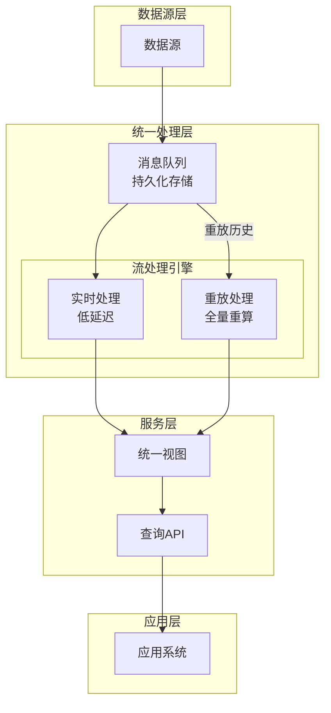
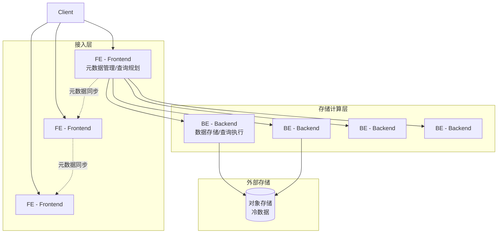
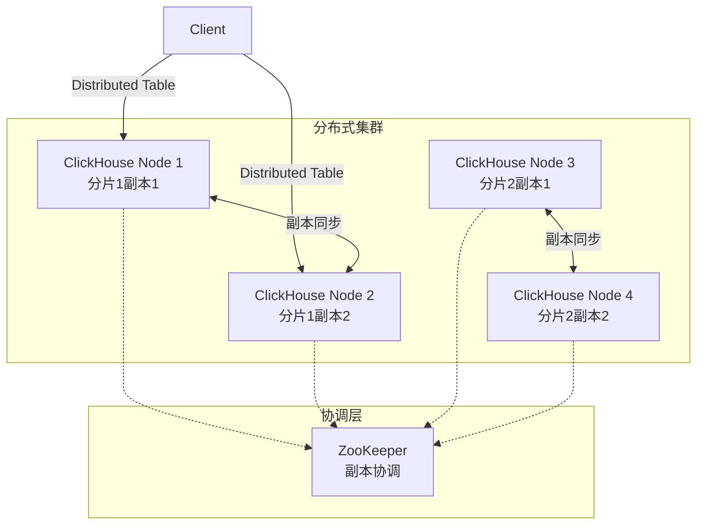
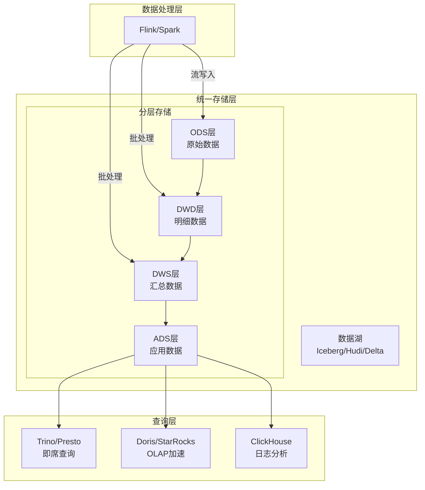

# 实时数仓架构

**文档版本**：v1.0
**创建时间**：2026年
**最后更新**：2026年
**状态**：✅ 已完成

---

## 📋 执行摘要

实时数仓架构是大数据处理领域的重要演进，涵盖Lambda架构、Kappa架构等经典模式，以及Doris、ClickHouse等实时OLAP引擎的应用。流批一体的理念正在推动实时与离线计算的统一，为数据驱动决策提供更低延迟、更高一致性的支持。

---

## 一、核心概念

### 1.1 定义与原理

实时数仓（Real-time Data Warehouse）是指能够实时或准实时摄入、处理和分析数据的仓库系统。相比传统离线数仓的小时/天级延迟，实时数仓将数据延迟降低到秒级甚至毫秒级。

**发展历程**：
```
离线数仓 (T+1) ──> 准实时数仓 (小时级) ──> 实时数仓 (分钟级) ──> 流式数仓 (秒级)
     2010           2015 (Spark Streaming)      2018 (Flink)         2020+
```

**核心设计目标**：
- **低延迟**：秒级数据可见性
- **高吞吐**：支持海量数据实时摄入
- **一致性**：实时与离线数据一致
- **易维护**：减少双流维护成本

### 1.2 关键特性

| 特性 | 描述 |
|------|------|
| **实时采集** | CDC、消息队列实时数据摄入 |
| **流式处理** | 低延迟ETL和指标计算 |
| **实时存储** | 支持高并发写入和查询的OLAP引擎 |
| **统一语义** | 流批一体，统一SQL处理 |
| **增量计算** | 支持增量更新和物化视图 |

### 1.3 适用场景

| 场景 | 适用性 | 说明 |
|------|--------|------|
| 实时大屏 | ⭐⭐⭐⭐⭐ | 秒级业务监控 |
| 实时风控 | ⭐⭐⭐⭐⭐ | 欺诈检测、风控决策 |
| 实时推荐 | ⭐⭐⭐⭐⭐ | 个性化实时推荐 |
| 实时报表 | ⭐⭐⭐⭐ | 准实时业务报表 |
| 数据湖分析 | ⭐⭐⭐⭐ | 湖仓一体分析 |
| 复杂离线分析 | ⭐⭐⭐ | 仍需要离线补充 |

---

## 二、架构模式

### 2.1 Lambda架构

#### 架构定义

Lambda架构由Nathan Marz提出，通过批处理和流处理两条路径实现低延迟和准确性的平衡。



#### 三层职责

| 层级 | 职责 | 技术栈 | 延迟 |
|------|------|--------|------|
| **Batch Layer** | 全量数据处理，保证准确性 | Hive/Spark/Hadoop | 小时/天级 |
| **Speed Layer** | 实时增量处理，保证低延迟 | Flink/Storm/Kafka Streams | 秒级 |
| **Serving Layer** | 合并批视图和实时视图 | HBase/Druid/ClickHouse | 毫秒级 |

#### 实现示例

```sql
-- Lambda架构示例：实时+离线GMV统计

-- ========== Speed Layer (Flink SQL) ==========
CREATE TABLE orders_stream (
    order_id STRING,
    amount DECIMAL(18,2),
    create_time TIMESTAMP,
    -- 水印定义
    WATERMARK FOR create_time AS create_time - INTERVAL '5' SECOND
) WITH (
    'connector' = 'kafka',
    'topic' = 'orders',
    'format' = 'json'
);

-- 实时增量聚合（小时窗口）
INSERT INTO realtime_gmv
SELECT 
    TUMBLE_START(create_time, INTERVAL '1' HOUR) as window_start,
    SUM(amount) as gmv,
    COUNT(*) as order_count
FROM orders_stream
GROUP BY TUMBLE(create_time, INTERVAL '1' HOUR);

-- ========== Batch Layer (Spark SQL) ==========
-- 每日全量重算，修正Speed Layer的近似结果
INSERT OVERWRITE TABLE batch_gmv PARTITION(dt='2024-01-01')
SELECT 
    date_format(create_time, 'yyyy-MM-dd HH:00:00') as hour,
    SUM(amount) as gmv,
    COUNT(*) as order_count
FROM orders_ods
WHERE dt = '2024-01-01'
GROUP BY date_format(create_time, 'yyyy-MM-dd HH:00:00');

-- ========== Serving Layer 合并查询 ==========
SELECT 
    COALESCE(b.hour, r.hour) as hour,
    COALESCE(b.gmv, r.gmv) as gmv
FROM batch_gmv b
FULL JOIN realtime_gmv r ON b.hour = r.hour
WHERE hour >= '2024-01-01 00:00:00';
```

#### Lambda架构优缺点

| 优点 | 缺点 |
|------|------|
| 容错性好，批处理可修正实时错误 | 两套代码，维护成本高 |
| 实时和历史数据分离，互不影响 | 逻辑不一致风险 |
| 成熟稳定，业界广泛应用 | 存储和计算资源翻倍 |
| 批处理可处理大规模历史数据 | 开发周期较长 |

### 2.2 Kappa架构

#### 架构定义

Kappa架构由Jay Kreps提出，是Lambda架构的简化版本，完全基于流处理构建。



**核心思想**：
- 所有数据都通过消息队列持久化
- 流处理引擎统一处理实时和历史数据
- 需要重算时，重新消费历史数据

#### Kappa架构实现

```java
// Kappa架构：Flink统一流处理
public class KappaGMVJob {
    
    public static void main(String[] args) throws Exception {
        StreamExecutionEnvironment env = 
            StreamExecutionEnvironment.getExecutionEnvironment();
        
        // 统一数据源 - Kafka存储所有历史数据
        KafkaSource<Order> source = KafkaSource.<Order>builder()
            .setBootstrapServers("kafka:9092")
            .setTopics("orders")
            .setGroupId("kappa-gmv")
            // 实时消费: latest, 全量重算: earliest
            .setStartingOffsets(OffsetsInitializer.earliest())
            .setValueOnlyDeserializer(new OrderDeserializationSchema())
            .build();
        
        DataStream<Order> orders = env.fromSource(
            source, WatermarkStrategy.forBoundedOutOfOrderness(
                Duration.ofSeconds(5)), "orders");
        
        // 统一的流处理逻辑
        orders
            .keyBy(Order::getHour)
            .window(TumblingEventTimeWindows.of(Time.hours(1)))
            .aggregate(new GMVAggregateFunction())
            .addSink(new DorisSinkFunction());
        
        env.execute("Kappa GMV Job");
    }
}
```

#### 与Lambda对比

| 维度 | Lambda | Kappa |
|------|--------|-------|
| **代码维护** | 两套代码 | 一套代码 |
| **系统复杂度** | 高（两套系统） | 低（一套系统） |
| **资源成本** | 高 | 低 |
| **重算能力** | 批处理天然支持 | 需要消息队列保留历史 |
| **准确性** | 批处理保证精确 | 依赖流处理的Exactly-Once |
| **适用场景** | 复杂ETL、需要频繁重算 | 相对简单的实时场景 |

### 2.3 架构演进趋势

```
┌─────────────────────────────────────────────────────────────┐
│                     架构演进路线                            │
├─────────────────────────────────────────────────────────────┤
│                                                             │
│  Lambda (2014)                                              │
│  ├── Batch Layer (Spark/Hive)                               │
│  └── Speed Layer (Storm/Spark Streaming)                    │
│                                                             │
│  ↓                                                          │
│                                                             │
│  Kappa (2015)                                               │
│  └── Unified Stream Layer (Kafka Streams/Flink)             │
│                                                             │
│  ↓                                                          │
│                                                             │
│  流批一体 (2019+)                                           │
│  └── Flink/Spark 统一API                                    │
│      - 同一套SQL处理流和批                                  │
│      - 统一的Table API                                      │
│                                                             │
│  ↓                                                          │
│                                                             │
│  湖仓一体 (2021+)                                           │
│  └── 统一存储层 (Iceberg/Hudi/Delta Lake)                   │
│      - 实时数据湖                                           │
│      - Schema演进                                           │
│      - Time Travel                                          │
│                                                             │
└─────────────────────────────────────────────────────────────┘
```

---

## 三、实时OLAP引擎

### 3.1 Doris架构

#### 系统架构



**核心组件**：

| 组件 | 职责 | 高可用 |
|------|------|--------|
| **FE** | SQL解析、查询规划、元数据管理 | 多主部署 |
| **BE** | 数据存储、查询执行、副本管理 | 多副本 |

#### 数据模型

```sql
-- Doris三种数据模型

-- 1. 明细模型 - 保留所有原始数据
CREATE TABLE user_behavior (
    user_id BIGINT,
    event_time DATETIME,
    event_type VARCHAR(20),
    properties VARCHAR(500)
)
DUPLICATE KEY(user_id, event_time)
DISTRIBUTED BY HASH(user_id) BUCKETS 10;

-- 2. 聚合模型 - 预聚合，适合指标分析
CREATE TABLE sales_stats (
    dt DATE,
    city_code INT,
    sales_amount SUM(DECIMAL(18,2)),
    order_count SUM(INT)
)
AGGREGATE KEY(dt, city_code)
DISTRIBUTED BY HASH(city_code) BUCKETS 10;

-- 3. Unique模型 - 主键唯一，适合CDC场景
CREATE TABLE user_info (
    user_id BIGINT,
    update_time DATETIME,
    name VARCHAR(100),
    age INT,
    address VARCHAR(500)
)
UNIQUE KEY(user_id)
DISTRIBUTED BY HASH(user_id) BUCKETS 10;
```

#### 实时摄入

```sql
-- Flink CDC实时写入Doris
CREATE TABLE flink_orders (
    order_id STRING,
    user_id BIGINT,
    amount DECIMAL(18,2),
    create_time TIMESTAMP,
    PRIMARY KEY (order_id) NOT ENFORCED
) WITH (
    'connector' = 'doris',
    'fenodes' = 'doris-fe:8030',
    'table.identifier' = 'db.orders',
    'username' = 'root',
    'password' = '',
    'sink.batch.size' = '10000',
    'sink.batch.interval' = '5s'
);

-- 流式写入
INSERT INTO flink_orders
SELECT order_id, user_id, amount, create_time
FROM kafka_orders;

-- 创建物化视图自动聚合
CREATE MATERIALIZED VIEW order_hourly_mv AS
SELECT 
    DATE_FORMAT(create_time, '%Y-%m-%d %H:00:00') as hour,
    COUNT(*) as order_count,
    SUM(amount) as gmv
FROM orders
GROUP BY DATE_FORMAT(create_time, '%Y-%m-%d %H:00:00');
```

### 3.2 ClickHouse架构

#### 系统架构



**核心特性**：

| 特性 | 说明 |
|------|------|
| **列式存储** | 极高压缩比，分析场景性能优异 |
| **向量化执行** | SIMD加速，CPU利用率极高 |
| **MergeTree引擎** | 高性能写入和查询的表引擎家族 |
| **分布式表** | 自动路由到本地表执行 |
| **物化视图** | 支持增量计算的物化视图 |

#### 表引擎对比

| 引擎 | 特点 | 适用场景 |
|------|------|----------|
| **MergeTree** | 基础引擎，支持分区、排序 | 通用分析场景 |
| **ReplacingMergeTree** | 自动去重 | CDC场景 |
| **SummingMergeTree** | 自动聚合数值列 | 指标预聚合 |
| **AggregatingMergeTree** | 支持复杂聚合函数 | 高基维度分析 |
| **Kafka引擎** | 直接消费Kafka | 实时摄入 |

#### 实时摄入方案

```sql
-- 方案1: Kafka引擎直连
CREATE TABLE orders_kafka (
    order_id String,
    user_id UInt64,
    amount Decimal(18,2),
    create_time DateTime
) ENGINE = Kafka()
SETTINGS 
    kafka_broker_list = 'kafka:9092',
    kafka_topic_list = 'orders',
    kafka_group_name = 'clickhouse_consumer',
    kafka_format = 'JSONEachRow';

-- 目标表
CREATE TABLE orders (
    order_id String,
    user_id UInt64,
    amount Decimal(18,2),
    create_time DateTime,
    dt Date DEFAULT toDate(create_time)
) ENGINE = MergeTree()
PARTITION BY dt
ORDER BY (user_id, create_time);

-- 物化视图桥接
CREATE MATERIALIZED VIEW orders_mv TO orders AS
SELECT * FROM orders_kafka;

-- 方案2: 外部写入（推荐，更可控）
-- 使用Flink/Spark写入ClickHouse
```

### 3.3 Doris vs ClickHouse

| 维度 | Doris | ClickHouse |
|------|-------|------------|
| **架构** | MPP + 存储计算一体 | MPP + 列式存储 |
| **数据更新** | 原生支持，效率高 | 依赖Merge，有延迟 |
| **Join性能** | 优秀的分布式Join | 大表Join需优化 |
| **易用性** | 兼容MySQL协议，生态好 | 学习曲线较陡 |
| **实时性** | 近实时（秒级） | 近实时（秒级） |
| **扩展性** | 在线扩缩容 | 需重新分片 |
| **适用场景** | 实时数仓、BI分析 | 日志分析、时序数据 |
| **社区** | Apache开源，国内活跃 | Yandex开源，全球活跃 |

---

## 四、流批一体

### 4.1 技术演进

```
┌─────────────────────────────────────────────────────────────┐
│                    流批一体演进                             │
├─────────────────────────────────────────────────────────────┤
│                                                             │
│  阶段1: 分离处理 (2015)                                     │
│  ├── Batch: Hadoop MR, Spark Core                           │
│  └── Stream: Storm, Spark Streaming                         │
│                                                             │
│  阶段2: 统一引擎 (2019)                                     │
│  ├── Flink: DataStream API 统一流批                         │
│  └── Spark: Structured Streaming 统一API                    │
│                                                             │
│  阶段3: 统一SQL (2020+)                                     │
│  ├── Flink SQL: 流批统一SQL                                 │
│  └── Spark SQL: 统一DataFrame API                           │
│                                                             │
│  阶段4: 统一存储 (2021+)                                    │
│  └── 湖仓一体: Iceberg/Hudi/Delta Lake                      │
│      - 统一存储层                                           │
│      - 流批读写统一                                         │
│      - Schema演进                                           │
│                                                             │
└─────────────────────────────────────────────────────────────┘
```

### 4.2 Flink流批一体

#### 统一API

```java
// Flink统一Table API
StreamExecutionEnvironment env = 
    StreamExecutionEnvironment.getExecutionEnvironment();
StreamTableEnvironment tableEnv = StreamTableEnvironment.create(env);

// 同一套SQL，流批模式自动切换
String sql = "SELECT user_id, COUNT(*) as cnt " +
             "FROM orders " +
             "GROUP BY user_id";

// 流模式
env.setRuntimeMode(RuntimeMode.STREAMING);
tableEnv.executeSql(sql).print();

// 批模式
env.setRuntimeMode(RuntimeMode.BATCH);
tableEnv.executeSql(sql).print();
```

#### 统一SQL

```sql
-- Flink流批统一SQL示例

-- 创建流表（实时消费Kafka）
CREATE TABLE orders_stream (
    order_id STRING,
    user_id BIGINT,
    amount DECIMAL(18,2),
    create_time TIMESTAMP(3),
    WATERMARK FOR create_time AS create_time - INTERVAL '5' SECOND
) WITH (
    'connector' = 'kafka',
    'topic' = 'orders',
    'format' = 'json'
);

-- 创建批表（读取历史数据）
CREATE TABLE orders_batch (
    order_id STRING,
    user_id BIGINT,
    amount DECIMAL(18,2),
    create_time TIMESTAMP(3),
    dt STRING
) PARTITIONED BY (dt) WITH (
    'connector' = 'hive',
    'hive-table' = 'orders'
);

-- 统一的聚合SQL
-- 流模式：增量计算，输出更新流
-- 批模式：全量计算，输出最终结果
INSERT INTO gmv_result
SELECT 
    DATE_FORMAT(create_time, 'yyyy-MM-dd') as dt,
    SUM(amount) as gmv,
    COUNT(*) as order_count
FROM orders_stream  -- 或 orders_batch
GROUP BY DATE_FORMAT(create_time, 'yyyy-MM-dd');
```

### 4.3 湖仓一体

#### 架构设计



#### Iceberg实时入湖

```sql
-- Flink CDC实时入湖Iceberg
CREATE TABLE mysql_orders (
    order_id STRING,
    user_id BIGINT,
    amount DECIMAL(18,2),
    status STRING,
    PRIMARY KEY (order_id) NOT ENFORCED
) WITH (
    'connector' = 'mysql-cdc',
    'hostname' = 'mysql',
    'database-name' = 'shop',
    'table-name' = 'orders'
);

CREATE TABLE iceberg_orders (
    order_id STRING,
    user_id BIGINT,
    amount DECIMAL(18,2),
    status STRING,
    dt STRING
) PARTITIONED BY (dt) WITH (
    'connector' = 'iceberg',
    'catalog-type' = 'hive',
    'warehouse' = 'hdfs:///warehouse/iceberg',
    'write.mode' = 'upsert'
);

-- 实时CDC入湖
INSERT INTO iceberg_orders
SELECT 
    order_id, user_id, amount, status,
    DATE_FORMAT(CURRENT_TIMESTAMP, 'yyyy-MM-dd') as dt
FROM mysql_orders;
```

---

## 五、系统对比

### 5.1 实时数仓方案对比

| 维度 | Lambda | Kappa | 湖仓一体 |
|------|--------|-------|----------|
| **代码维护** | 两套 | 一套 | 一套 |
| **数据一致性** | 高（批修正） | 中（依赖Exactly-Once） | 高 |
| **延迟** | 秒级+小时级 | 秒级 | 分钟级 |
| **存储成本** | 高（双份） | 中 | 低（统一存储） |
| **复杂度** | 高 | 中 | 中 |
| **灵活性** | 中 | 中 | 高（Schema演进） |
| **适用规模** | 大型企业 | 中型企业 | 各类规模 |

### 5.2 OLAP引擎选型

| 场景 | 推荐引擎 | 理由 |
|------|----------|------|
| 实时数仓+BI报表 | Doris/StarRocks | 易用、Join强、生态好 |
| 日志分析+APM | ClickHouse | 压缩比高、查询快 |
| 即席查询+数据湖 | Trino/Presto | 联邦查询、湖仓一体 |
| 超大规模+低成本 | Druid/Pinot | 云原生、自动分层 |

---

## 六、实践指南

### 6.1 分层设计

```sql
-- 实时数仓分层设计

-- ODS层: 原始数据接入
CREATE TABLE ods_orders (
    data STRING,  -- 原始JSON
    proc_time TIMESTAMP
) WITH ('connector' = 'kafka', ...);

-- DWD层: 明细清洗
CREATE TABLE dwd_orders (
    order_id STRING,
    user_id BIGINT,
    sku_id BIGINT,
    amount DECIMAL(18,2),
    province STRING,
    city STRING,
    dt STRING,
    PRIMARY KEY (order_id) NOT ENFORCED
) WITH ('connector' = 'doris', ...);

-- DWS层: 轻度汇总
CREATE TABLE dws_order_province_1h (
    province STRING,
    hour STRING,
    order_count BIGINT,
    gmv DECIMAL(18,2),
    PRIMARY KEY (province, hour) NOT ENFORCED
) WITH ('connector' = 'doris', ...);

-- ADS层: 应用指标
CREATE TABLE ads_gmv_realtime (
    stat_time TIMESTAMP,
    gmv_1m DECIMAL(18,2),
    gmv_5m DECIMAL(18,2),
    gmv_1h DECIMAL(18,2)
) WITH ('connector' = 'jdbc', ...);
```

### 6.2 最佳实践

1. **Watermark设计**
   ```java
   // 允许5秒乱序，1分钟空闲检测
   WatermarkStrategy.<Order>forBoundedOutOfOrderness(
           Duration.ofSeconds(5))
       .withIdleness(Duration.ofMinutes(1));
   ```

2. **状态管理**
   ```java
   // 启用状态TTL，避免状态无限增长
   StateTtlConfig ttlConfig = StateTtlConfig
       .newBuilder(Time.hours(24))
       .setUpdateType(UpdateType.OnCreateAndWrite)
       .setStateVisibility(StateVisibility.NeverReturnExpired)
       .build();
   ```

3. **端到端一致性**
   ```properties
   # 两阶段提交保证Exactly-Once
   checkpointing.mode=EXACTLY_ONCE
   checkpointing.interval=30s
   ```

### 6.3 常见问题

**Q1: 实时和离线数据不一致怎么办？**
A: 
- Lambda架构：以离线批处理结果为准
- 湖仓一体：统一存储，天然一致
- 数据质量监控：设置一致性校验规则

**Q2: 如何选择Doris还是ClickHouse？**
A:
- 需要频繁更新/CDC → Doris
- 主要是追加+复杂分析 → ClickHouse
- 团队熟悉度也是重要考量

**Q3: 实时数仓如何保证数据质量？**
A:
- 数据校验：空值检查、范围检查、格式检查
- 数据比对：实时vs离线抽样对比
- 监控告警：延迟、堆积、错误率监控

---

## 七、与其他主题的关联

### 7.1 上游依赖

- [Kafka架构](../../03-communication/message-queue/Kafka架构.md)
- [Flink架构](./Flink架构.md)
- [Spark架构](../batch/Spark架构.md)

### 7.2 下游应用

- [数据治理](../../09-data/data-governance/数据治理体系.md)
- [BI可视化](../../09-data/bi/BI可视化.md)

### 7.3 相关概念

| 概念 | 关系 | 说明 |
|------|------|------|
| CDC | 基础 | 实时数据变更捕获 |
| 数据湖 | 扩展 | 湖仓一体的存储基础 |
| 物化视图 | 应用 | 实时预聚合加速查询 |
| 数据血缘 | 扩展 | 实时数据追踪溯源 |

---

## 八、参考资源

### 8.1 官方文档

1. [Apache Flink文档](https://nightlies.apache.org/flink/flink-docs-stable/) - 流批一体引擎
2. [Apache Doris文档](https://doris.apache.org/docs/get-starting/) - 实时OLAP
3. [ClickHouse文档](https://clickhouse.com/docs) - 列式数据库
4. [Apache Iceberg](https://iceberg.apache.org/) - 湖仓一体表格格式

### 8.2 技术博客

1. [Flink流批一体](https://flink.apache.org/zh/news/2021/05/03/stream-batch-processing.html) - 官方博客
2. [Doris实时数仓实践](https://doris.apache.org/zh-CN/blog/) - 官方最佳实践
3. [字节跳动ClickHouse实践](https://www.volcengine.com/docs/6491/116235) - 大规模应用案例

### 8.3 相关文档

- [Kafka架构](../../03-communication/message-queue/Kafka架构.md)
- [Flink架构](./Flink架构.md)
- [Spark架构](../batch/Spark架构.md)
- [消息模式与设计](../../03-communication/message-queue/消息模式与设计.md)

---

**维护者**：项目团队
**最后更新**：2026年
