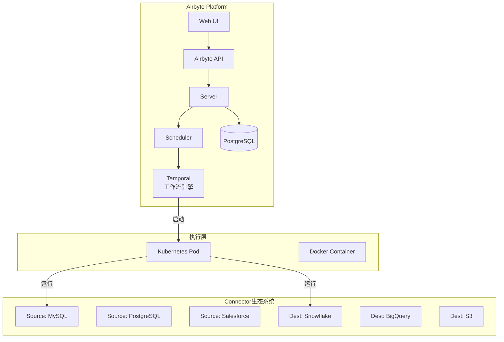
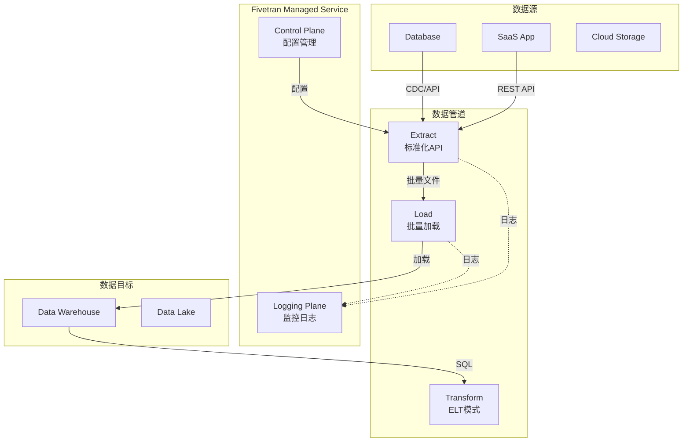
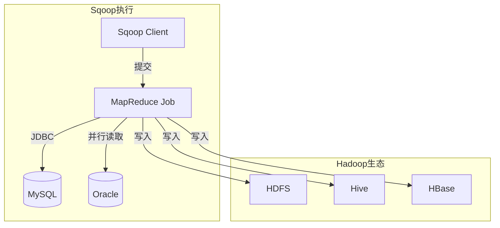
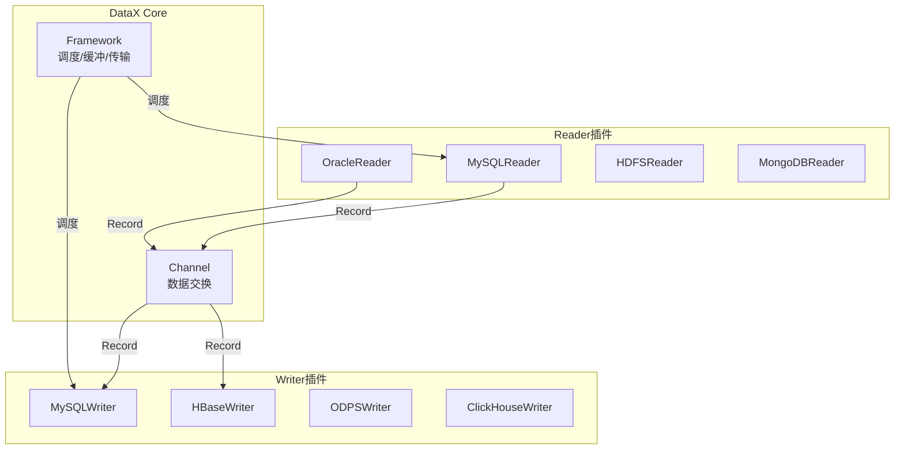
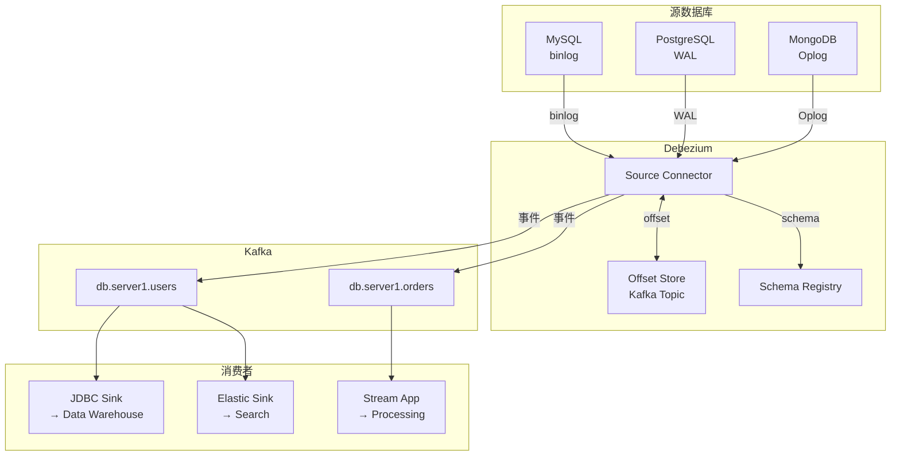

# 数据集成与管道 专题文档

**文档版本**：v1.0
**创建时间**：2026年4月
**最后更新**：2026年4月
**状态**：✅ 已完成

---

## 📋 执行摘要

数据集成与管道是分布式系统中实现数据流动的核心技术，涉及异构数据源之间的数据抽取、转换和加载（ETL）。本文档深入分析Airbyte、Fivetran、Apache Sqoop、DataX等主流数据集成工具，以及CDC（变更数据捕获）和Debezium的实时数据同步技术。

---

## 一、核心概念

### 1.1 定义与原理

**数据集成（Data Integration）**是将来自不同数据源的数据整合到一起，提供统一视图的技术。核心原理包括：

- **数据抽取（Extract）**: 从源系统获取原始数据
- **数据转换（Transform）**: 清洗、格式化、聚合数据
- **数据加载（Load）**: 将处理后的数据写入目标系统
- **变更捕获（CDC）**: 实时捕获源系统的数据变更

### 1.2 关键特性

| 特性 | 描述 | 重要性 |
|------|------|--------|
| **连接器生态** | 支持多种数据源的预置连接器 | ⭐⭐⭐⭐⭐ |
| **增量同步** | 支持基于时间戳或CDC的增量数据抽取 | ⭐⭐⭐⭐⭐ |
| **Schema管理** | 自动处理Schema变更（Schema Evolution） | ⭐⭐⭐⭐ |
| **数据转换** | 内置ETL转换能力或支持自定义转换 | ⭐⭐⭐⭐ |
| **可观测性** | 提供同步监控、告警和日志追踪 | ⭐⭐⭐⭐ |
| **数据质量** | 内置数据校验和质量检查机制 | ⭐⭐⭐ |

### 1.3 适用场景

| 场景 | 适用性 | 说明 |
|------|--------|------|
| 数据仓库构建 | ⭐⭐⭐⭐⭐ | 将业务数据同步到数仓 |
| 数据湖构建 | ⭐⭐⭐⭐⭐ | 原始数据汇聚到数据湖 |
| 实时数据分析 | ⭐⭐⭐⭐ | CDC实现准实时同步 |
| 云迁移 | ⭐⭐⭐⭐ | 本地到云端的数据迁移 |
| 数据备份 | ⭐⭐⭐ | 数据库异地备份 |
| 应用集成 | ⭐⭐⭐ | 系统间数据同步 |

---

## 二、技术架构详解

### 2.1 Airbyte架构



#### 核心组件

| 组件 | 功能 | 技术栈 |
|------|------|--------|
| Airbyte Server | API服务 | Java/Kotlin |
| Scheduler | 任务调度 | Temporal |
| Connector | 数据源连接器 | Python/Docker |
| Web UI | 管理界面 | React |
| Database | 元数据存储 | PostgreSQL |

#### Connector规范

```python
# Airbyte Source Connector 示例
from airbyte_cdk.sources import AbstractSource
from airbyte_cdk.streams import Stream

class MySQLSource(AbstractSource):
    def check_connection(self, logger, config):
        try:
            conn = mysql.connector.connect(**config)
            conn.close()
            return True, None
        except Exception as e:
            return False, str(e)

    def streams(self, config):
        return [
            UsersStream(config),
            OrdersStream(config)
        ]

class UsersStream(Stream):
    def read_records(self, sync_mode, cursor_field, stream_slice, stream_state):
        # 增量读取逻辑
        last_cursor = stream_state.get(cursor_field[0], '1970-01-01')
        query = f"SELECT * FROM users WHERE updated_at > '{last_cursor}'"
        # 执行查询并yield记录
```

### 2.2 Fivetran架构



#### Fivetran特点

| 特性 | 说明 |
|------|------|
| 托管服务 | 全托管，无需运维 |
| 自动Schema迁移 | 源Schema变更自动同步到目标 |
| 历史数据回填 | 自动处理网络中断期间的数据 |
| 增量更新 | 智能识别变更数据 |
| 数据类型映射 | 自动类型转换 |

#### 定价模式

| 层级 | 月活行数 | 特点 |
|------|----------|------|
| Starter | 50万 | 基础功能 |
| Standard | 无限制 | 优先级支持 |
| Enterprise | 无限制 | SLA、SSO、专属支持 |

### 2.3 Apache Sqoop架构



#### 核心命令

```bash
# 全量导入
sqoop import \
  --connect jdbc:mysql://host/db \
  --username user --password pass \
  --table employees \
  --target-dir /data/employees \
  --m 4

# 增量导入
sqoop import \
  --connect jdbc:mysql://host/db \
  --table orders \
  --incremental append \
  --check-column order_date \
  --last-value '2024-01-01'

# 导出到数据库
sqoop export \
  --connect jdbc:mysql://host/db \
  --table report_summary \
  --export-dir /data/report
```

#### Sqoop vs Sqoop2

| 特性 | Sqoop1 | Sqoop2 |
|------|--------|--------|
| 架构 | CLI工具 | Client-Server |
| REST API | ❌ | ✅ |
| 安全 | 命令行传密码 | 安全凭证存储 |
| 连接复用 | ❌ | ✅ |
| 社区活跃度 | 停滞 | 不活跃 |

### 2.4 DataX架构



#### 配置文件示例

```json
{
  "job": {
    "setting": {
      "speed": {
        "channel": 8,
        "byte": 104857600,
        "record": 10000
      },
      "errorLimit": {
        "record": 10,
        "percentage": 0.05
      }
    },
    "content": [
      {
        "reader": {
          "name": "mysqlreader",
          "parameter": {
            "username": "root",
            "password": "password",
            "column": ["id", "name", "age"],
            "splitPk": "id",
            "connection": [
              {
                "jdbcUrl": ["jdbc:mysql://127.0.0.1:3306/source"],
                "table": ["user"]
              }
            ]
          }
        },
        "writer": {
          "name": "hdfswriter",
          "parameter": {
            "defaultFS": "hdfs://namenode:8020",
            "path": "/user/datax/user",
            "fileType": "text",
            "column": [
              {"name": "id", "type": "BIGINT"},
              {"name": "name", "type": "STRING"},
              {"name": "age", "type": "INT"}
            ],
            "writeMode": "append"
          }
        }
      }
    ]
  }
}
```

### 2.5 CDC与Debezium架构



#### CDC实现机制对比

| 数据库 | 机制 | 配置要求 |
|--------|------|----------|
| MySQL | binlog | binlog_row_image=FULL |
| PostgreSQL | pgoutput/pg_logical | wal_level=logical |
| SQL Server | CDC表 | 启用CDC |
| Oracle | LogMiner/XStream | 补充日志 |
| MongoDB | Oplog | Replica Set |

#### Debezium事件格式

```json
{
  "before": {
    "id": 1001,
    "name": "Alice",
    "age": 25
  },
  "after": {
    "id": 1001,
    "name": "Alice",
    "age": 26
  },
  "source": {
    "version": "2.5.0",
    "connector": "mysql",
    "name": "dbserver1",
    "ts_ms": 1712345678000,
    "db": "inventory",
    "table": "customers"
  },
  "op": "u",
  "ts_ms": 1712345678901
}
```

---

## 三、系统对比

### 3.1 主流系统对比矩阵

| 维度 | Airbyte | Fivetran | Sqoop | DataX | Debezium |
|------|---------|----------|-------|-------|----------|
| **部署方式** | 自托管/云 | SaaS | 自托管 | 自托管 | 自托管 |
| **开源协议** | MIT | 闭源 | Apache | Apache | Apache |
| **价格** | 免费 | 按量付费 | 免费 | 免费 | 免费 |
| **连接器数量** | 300+ | 200+ | 10+ | 30+ | 10+ |
| **同步模式** | 批量/增量 | 批量/增量 | 批量 | 批量 | 实时CDC |
| **转换能力** | 基础/DBT | 无/DBT | 无 | 基础 | 无 |
| **可扩展性** | ⭐⭐⭐⭐⭐ | ⭐⭐⭐ | ⭐⭐⭐ | ⭐⭐⭐⭐ | ⭐⭐⭐⭐⭐ |
| **运维复杂度** | 中 | 低 | 低 | 低 | 高 |

### 3.2 功能特性对比

#### 数据源支持

| 数据源类型 | Airbyte | Fivetran | Sqoop | DataX | Debezium |
|------------|---------|----------|-------|-------|----------|
| 关系型数据库 | ✅ | ✅ | ✅ | ✅ | ✅ |
| SaaS应用 | ✅ | ✅ | ❌ | ❌ | ❌ |
| 云存储 | ✅ | ✅ | ⚠️ HDFS | ✅ | ❌ |
| 消息队列 | ✅ | ⚠️ | ❌ | ❌ | ✅ |
| 文件系统 | ✅ | ✅ | ✅ | ✅ | ❌ |

#### 同步能力

| 能力 | Airbyte | Fivetran | Sqoop | DataX | Debezium |
|------|---------|----------|-------|-------|----------|
| 全量同步 | ✅ | ✅ | ✅ | ✅ | ⚠️ |
| 增量同步 | ✅ | ✅ | ✅ | ✅ | ✅ |
| 实时CDC | ⚠️ | ✅ | ❌ | ❌ | ✅ |
| Schema变更 | ✅ | ✅ | ❌ | ❌ | ✅ |
| 断点续传 | ✅ | ✅ | ❌ | ❌ | ✅ |
| 数据校验 | ✅ | ✅ | ❌ | ✅ | ❌ |

### 3.3 选型决策树

```
数据集成需求分析
│
├── 需要实时CDC同步？
│   ├── 是 → Debezium + Kafka
│   └── 否 → 继续
│
├── 预算充足 + 无运维团队？
│   ├── 是 → Fivetran
│   └── 否 → 继续
│
├── 需要连接SaaS应用？
│   ├── 是 → Airbyte
│   └── 否 → 继续
│
├── 纯Hadoop生态 + 批量导入？
│   ├── 是 → Sqoop
│   └── 否 → 继续
│
├── 需要自定义开发 + 高性能？
│   ├── 是 → DataX
│   └── 否 → Airbyte
│
└── 需要工作流编排？
    ├── 是 → Airbyte (Temporal)
    └── 否 → DataX
```

### 3.4 性能基准

#### 批量同步性能（100万行，100MB）

| 工具 | 同步时间 | 资源占用 | 吞吐量 |
|------|----------|----------|--------|
| Sqoop | 45s | 4 Map Slots | 22MB/s |
| DataX | 38s | 8 Channels | 26MB/s |
| Airbyte | 52s | 2 Workers | 19MB/s |
| Fivetran | 40s | 托管资源 | 25MB/s |

#### CDC同步延迟

| 工具 | 平均延迟 | P99延迟 | 吞吐量(事件/秒) |
|------|----------|---------|-----------------|
| Debezium | 500ms | 2s | 10000+ |
| Fivetran | 15min | 30min | N/A |
| Airbyte CDC | 5min | 15min | 5000 |

---

## 四、实践指南

### 4.1 部署配置

#### Airbyte Kubernetes部署

```yaml
# airbyte-values.yaml
webapp:
  replicaCount: 2
  resources:
    limits:
      memory: 1Gi
      cpu: 1000m

server:
  replicaCount: 2
  resources:
    limits:
      memory: 2Gi
      cpu: 2000m

worker:
  replicaCount: 4
  resources:
    limits:
      memory: 4Gi
      cpu: 4000m

temporal:
  enabled: true
  resources:
    limits:
      memory: 2Gi
```

#### Debezium Connector配置

```json
{
  "name": "mysql-connector",
  "config": {
    "connector.class": "io.debezium.connector.mysql.MySqlConnector",
    "tasks.max": "1",
    "database.hostname": "mysql",
    "database.port": "3306",
    "database.user": "debezium",
    "database.password": "dbz",
    "database.server.id": "184054",
    "database.server.name": "dbserver1",
    "database.include.list": "inventory",
    "table.include.list": "inventory.customers,inventory.orders",
    "snapshot.mode": "initial",
    "tombstones.on.delete": "true",
    "decimal.handling.mode": "string",
    "time.precision.mode": "connect",
    "topic.prefix": "cdc",
    "schema.history.internal.kafka.bootstrap.servers": "kafka:9092",
    "schema.history.internal.kafka.topic": "schema-changes.inventory"
  }
}
```

### 4.2 最佳实践

#### 1. 增量同步策略选择

| 策略 | 适用场景 | 优缺点 |
|------|----------|--------|
| 时间戳 | 有update_time字段 | 简单，无法捕获删除 |
| 自增ID | 只追加数据 | 简单，无法更新 |
| CDC | 需要实时同步 | 完整，需要数据库配置 |
| 全量比对 | 小表 | 准确，性能差 |

#### 2. Schema变更处理

```python
# Airbyte Schema Evolution 处理
from airbyte_cdk.sources.streams import Stream

class AutoSchemaStream(Stream):
    def get_json_schema(self):
        # 动态获取最新Schema
        schema = self.fetch_current_schema()
        return self.convert_to_json_schema(schema)

    def read_records(self, sync_mode, cursor_field, stream_slice, stream_state):
        for record in self.fetch_records():
            # 字段兼容性处理
            yield self.normalize_record(record)
```

#### 3. 数据一致性保证

```json
// DataX 一致性配置
{
  "job": {
    "setting": {
      "errorLimit": {
        "record": 0,
        "percentage": 0
      },
      "speed": {
        "channel": 1
      }
    },
    "content": [{
      "reader": {
        "parameter": {
          "querySql": ["SELECT * FROM table WHERE id <= ${checkpoint}"]
        }
      },
      "writer": {
        "parameter": {
          "writeMode": "insert",
          "preSql": ["DELETE FROM target WHERE id <= ${checkpoint}"]
        }
      }
    }]
  }
}
```

### 4.3 常见问题

**Q1: CDC延迟过高如何解决？**

A:

1. 检查数据库binlog/WAL配置
2. 增加Debezium任务数
3. 优化Kafka消费者组
4. 考虑批量提交配置

**Q2: Schema变更导致同步失败？**

A:

- Fivetran: 自动处理，无需干预
- Airbyte: 刷新Schema并调整连接
- Debezium: 使用Schema Registry管理版本

**Q3: 大数据量同步OOM？**

A:

1. 调整batch size
2. 启用流式处理
3. 增加JVM内存
4. 使用分片并行读取

**Q4: 如何处理同步冲突？**

A:

```sql
-- 基于时间戳的冲突解决
INSERT INTO target_table (id, name, updated_at)
SELECT id, name, updated_at FROM source_table
ON CONFLICT (id) DO UPDATE
SET name = EXCLUDED.name,
    updated_at = EXCLUDED.updated_at
WHERE EXCLUDED.updated_at > target_table.updated_at;
```

---

## 五、形式化分析

### 5.1 数据一致性模型

#### 一致性级别

| 级别 | 定义 | 实现方式 |
|------|------|----------|
| 强一致性 | 同步完成后立即可见 | 同步阻塞写入 |
| 最终一致性 | 一定时间后达到一致 | 异步复制 |
| 因果一致性 | 因果关系的事件有序 | 向量时钟 |

### 5.2 数据同步正确性

**定理（Exactly-Once语义）**: 在以下条件下，数据同步可实现精确一次交付：

1. 源端支持幂等读取（如基于offset的binlog）
2. 目标端支持幂等写入（如UPSERT）
3. 传输层支持事务（如Kafka事务）

---

## 六、与其他主题的关联

### 6.1 上游依赖

- [分布式任务调度](../batch/分布式任务调度.md) - ETL任务调度
- [消息队列](../../03-messaging/消息队列对比.md) - CDC数据传输
- [Schema Registry](../../03-messaging/SchemaRegistry.md) - Schema管理

### 6.2 下游应用

- [数据仓库](../warehouse/数据仓库架构.md) - 数据存储
- [实时计算](../../04-streaming/流处理框架.md) - 流式分析
- [数据治理](../governance/数据治理.md) - 数据血缘追踪

### 6.3 相关概念

| 概念 | 关系 | 说明 |
|------|------|------|
| ETL | 演进 | ELT是现代趋势 |
| 数据虚拟化 | 对比 | 不移动数据 vs 物理复制 |
| 数据编织 | 扩展 | 主动元数据驱动的集成 |

---

## 七、参考资源

### 7.1 开源项目

1. [Airbyte](https://github.com/airbytehq/airbyte) - 开源数据集成平台
2. [Apache Sqoop](https://sqoop.apache.org/) - Hadoop数据导入导出
3. [Alibaba DataX](https://github.com/alibaba/DataX) - 异构数据源同步
4. [Debezium](https://github.com/debezium/debezium) - 分布式CDC平台
5. [Flink CDC](https://github.com/ververica/flink-cdc-connectors) - Flink CDC连接器

### 7.2 商业产品

1. [Fivetran](https://www.fivetran.com/) - 托管数据管道服务
2. [Stitch](https://www.stitchdata.com/) - Talon旗下数据集成
3. [Matillion](https://www.matillion.com/) - ETL/ELT平台

### 7.3 学习资料

1. [Airbyte Documentation](https://docs.airbyte.com/)
2. [Debezium Reference](https://debezium.io/documentation/)
3. [Data Integration Patterns](https://www.enterpriseintegrationpatterns.com/)
4. 《构建数据仓库》- Inmon
5. 《数据密集型应用系统设计》- Martin Kleppmann

---

**维护者**：项目团队
**最后更新**：2026年4月
