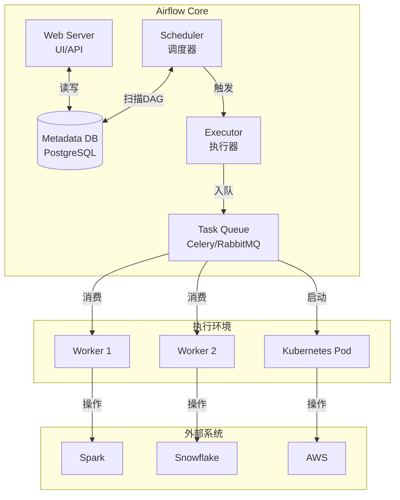
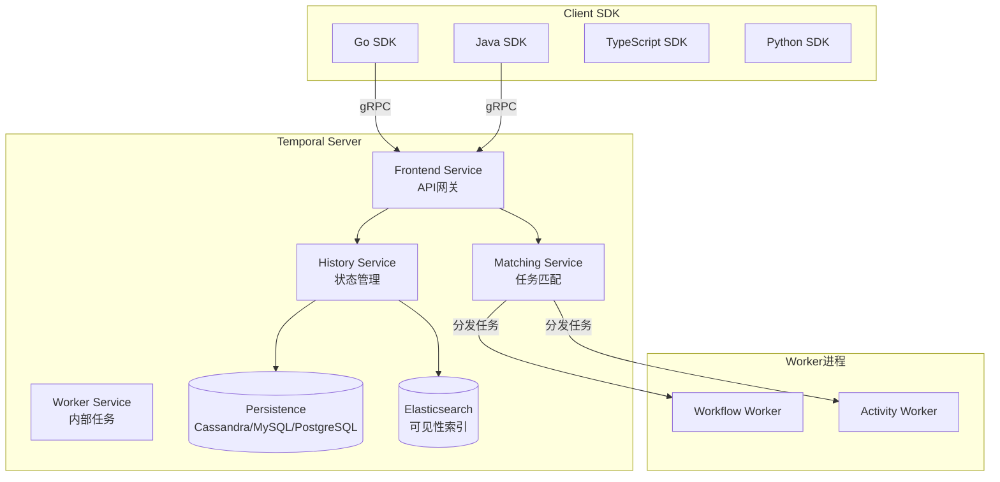
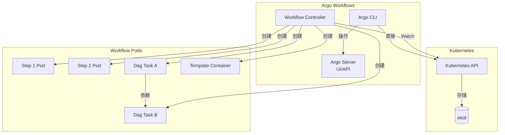
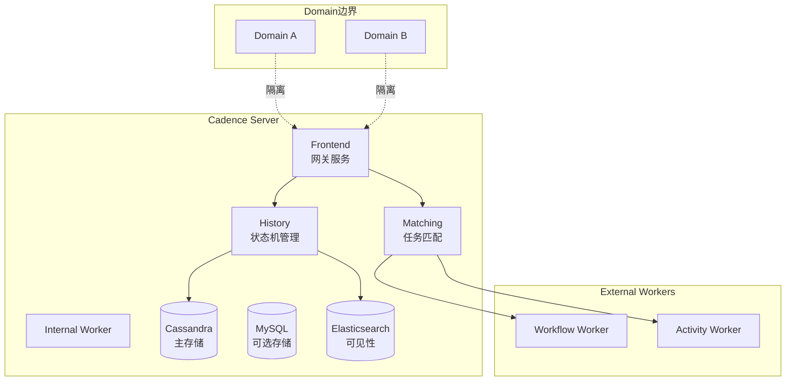

# 工作流引擎对比 专题文档

**文档版本**：v1.0
**创建时间**：2026年4月
**最后更新**：2026年4月
**状态**：✅ 已完成

---

## 📋 执行摘要

工作流引擎是协调和管理复杂业务流程的核心基础设施，用于定义、执行和监控多步骤业务流程。本文档深入对比Apache Airflow、Temporal、Argo Workflows、Cadence等主流工作流引擎的架构设计、编程模型和适用场景，并提供完整的选型决策矩阵。

---

## 一、核心概念

### 1.1 定义与原理

**工作流引擎（Workflow Engine）**是一种用于自动化执行业务流程的软件系统，核心原理包括：

- **流程定义**: 使用DSL或代码描述业务流程
- **状态管理**: 持久化工作流执行状态
- **任务调度**: 根据依赖关系调度任务执行
- **事件驱动**: 响应外部事件推进流程

### 1.2 关键特性

| 特性 | 描述 | 重要性 |
|------|------|--------|
| **表达力** | 支持复杂流程模式（分支、循环、并行） | ⭐⭐⭐⭐⭐ |
| **可靠性** | 故障恢复、断点续执行能力 | ⭐⭐⭐⭐⭐ |
| **可观测性** | 执行追踪、监控、调试能力 | ⭐⭐⭐⭐⭐ |
| **可扩展性** | 水平扩展支持大规模工作流 | ⭐⭐⭐⭐ |
| **生态系统** | 丰富的集成和插件生态 | ⭐⭐⭐⭐ |
| **编程模型** | 代码即配置 vs 可视化编排 | ⭐⭐⭐ |

### 1.3 适用场景

| 场景 | 适用性 | 说明 |
|------|--------|------|
| ETL/ELT管道 | ⭐⭐⭐⭐⭐ | 数据管道编排 |
| 机器学习流水线 | ⭐⭐⭐⭐⭐ | ML训练、部署流程 |
| 微服务编排 | ⭐⭐⭐⭐ | Saga模式、长事务 |
| CI/CD流水线 | ⭐⭐⭐⭐ | 构建、测试、部署 |
| 业务流程自动化 | ⭐⭐⭐⭐ | 审批、订单处理 |
| 事件驱动处理 | ⭐⭐⭐⭐ | 响应式工作流 |

---

## 二、技术架构详解

### 2.1 Apache Airflow架构



#### 核心组件

| 组件 | 功能 | 配置选项 |
|------|------|----------|
| Web Server | 提供UI和REST API | gunicorn workers |
| Scheduler | 解析DAG，调度任务 | DAG parsing interval |
| Executor | 执行任务 | Sequential/Local/Celery/Kubernetes |
| Metadata DB | 存储状态 | PostgreSQL/MySQL |
| Worker | 执行任务 | Celery Worker |

#### DAG定义示例

```python
from airflow import DAG
from airflow.operators.python import PythonOperator
from airflow.providers.postgres.operators.postgres import PostgresOperator
from datetime import datetime, timedelta

default_args = {
    'owner': 'data-team',
    'depends_on_past': False,
    'email_on_failure': True,
    'retries': 3,
    'retry_delay': timedelta(minutes=5)
}

with DAG(
    'etl_pipeline',
    default_args=default_args,
    description='Daily ETL pipeline',
    schedule_interval='@daily',
    start_date=datetime(2024, 1, 1),
    catchup=False,
    tags=['etl'],
) as dag:
    
    # 任务定义
    extract = PythonOperator(
        task_id='extract_data',
        python_callable=extract_from_source
    )
    
    transform = PythonOperator(
        task_id='transform_data',
        python_callable=transform_logic
    )
    
    load = PostgresOperator(
        task_id='load_to_warehouse',
        sql='sql/load_data.sql'
    )
    
    # 依赖关系
    extract >> transform >> load
    
    # 分支示例
    check_quality = PythonOperator(
        task_id='check_quality',
        python_callable=quality_check
    )
    
    notify_success = PythonOperator(
        task_id='notify_success',
        python_callable=send_success_email
    )
    
    notify_failure = PythonOperator(
        task_id='notify_failure',
        python_callable=send_failure_email
    )
    
    load >> check_quality >> [notify_success, notify_failure]
```

#### Executor对比

| Executor | 架构 | 适用场景 | 扩展性 |
|----------|------|----------|--------|
| Sequential | 单进程 | 开发测试 | ❌ |
| Local | 多进程本地 | 单机生产 | ⚠️ |
| Celery | 分布式 | 大规模生产 | ✅ |
| Kubernetes | K8s Pod | 云原生 | ✅⭐ |

### 2.2 Temporal架构



#### 核心概念

| 概念 | 说明 | 对比Airflow |
|------|------|-------------|
| Workflow | 业务逻辑编排 | = DAG |
| Activity | 外部操作单元 | = Task |
| Worker | 执行进程 | = Worker |
| Namespace | 多租户隔离 | = - |
| Task Queue | 任务分发队列 | = Queue |

#### Workflow定义（Go示例）

```go
package app

import (
    "time"
    "go.temporal.io/sdk/workflow"
)

type OrderWorkflow struct {
    OrderID string
    Amount  float64
}

// Workflow定义 - 类似协程，可暂停恢复
func OrderProcessingWorkflow(ctx workflow.Context, order OrderWorkflow) error {
    // 设置Activity选项
    ao := workflow.ActivityOptions{
        StartToCloseTimeout: 10 * time.Second,
        RetryPolicy: &temporal.RetryPolicy{
            InitialInterval:    time.Second,
            BackoffCoefficient: 2.0,
            MaximumAttempts:    3,
        },
    }
    ctx = workflow.WithActivityOptions(ctx, ao)
    
    // 执行Activity
    var result PaymentResult
    err := workflow.ExecuteActivity(ctx, ProcessPayment, order).Get(ctx, &result)
    if err != nil {
        return err
    }
    
    // 设置定时器（Workflow会休眠，不占资源）
    workflow.Sleep(ctx, 24*time.Hour)
    
    // Saga模式补偿事务
    err = workflow.ExecuteActivity(ctx, SendNotification, order).Get(ctx, nil)
    if err != nil {
        // 补偿操作
        _ = workflow.ExecuteActivity(ctx, RefundPayment, order).Get(ctx, nil)
        return err
    }
    
    return nil
}

// Activity定义
func ProcessPayment(ctx context.Context, order OrderWorkflow) (PaymentResult, error) {
    // 实际的支付处理逻辑
    return callPaymentGateway(order)
}
```

#### Temporal vs Cadence

| 特性 | Temporal | Cadence |
|------|----------|---------|
| 维护组织 | Temporal Technologies | Uber（已转CNCF） |
| 云托管 | Temporal Cloud | 无 |
| SDK生态 | 更丰富（Go/Java/TS/Python/.NET/PHP） | Go/Java |
| 新特性 | 活跃更新 | 维护模式 |
| 协议 | gRPC | Thrift |

### 2.3 Argo Workflows架构



#### 核心特性

| 特性 | 说明 |
|------|------|
| 容器原生 | 每个任务在独立Pod中执行 |
| 资源管理 | 利用K8s资源配额和调度 |
|  artifacts | 支持S3/MinIO/GCS等存储 |
| 模板复用 | WorkflowTemplate支持复用 |
| 事件触发 | 支持Webhook、S3事件等 |

#### Workflow定义（YAML）

```yaml
apiVersion: argoproj.io/v1alpha1
kind: Workflow
metadata:
  generateName: data-processing-
spec:
  entrypoint: etl-pipeline
  
  # Artifact配置
  artifactRepositoryRef:
    configMap: artifact-repository
    key: default-v1
  
  templates:
    # 入口模板
    - name: etl-pipeline
      dag:
        tasks:
          - name: extract
            template: extract-data
          - name: transform
            template: transform-data
            dependencies: [extract]
          - name: load
            template: load-data
            dependencies: [transform]
          - name: validate
            template: validate-data
            dependencies: [load]
    
    # 任务模板
    - name: extract-data
      container:
        image: data-tools:latest
        command: [python, extract.py]
        resources:
          requests:
            memory: "1Gi"
            cpu: "500m"
      outputs:
        artifacts:
          - name: raw-data
            path: /data/raw
    
    - name: transform-data
      inputs:
        artifacts:
          - name: raw-data
            path: /data/raw
      container:
        image: spark:3.4
        command: [spark-submit, transform.py]
      outputs:
        artifacts:
          - name: processed-data
            path: /data/processed
    
    - name: load-data
      inputs:
        artifacts:
          - name: processed-data
            path: /data/processed
      container:
        image: data-tools:latest
        command: [python, load.py]
    
    # 条件分支示例
    - name: validate-data
      inputs:
        artifacts:
          - name: processed-data
            path: /data/processed
      steps:
        - - name: check-quality
            template: quality-check
        - - name: notify-success
            template: notify
            when: "{{steps.check-quality.outputs.result}} == 'PASS'"
          - name: notify-failure
            template: notify
            when: "{{steps.check-quality.outputs.result}} == 'FAIL'"
    
    - name: quality-check
      script:
        image: python:3.9
        command: [python]
        source: |
          import json
          # 质量检查逻辑
          result = check_data_quality()
          print(json.dumps(result))
```

### 2.4 Cadence架构



#### 核心设计

| 设计决策 | Cadence方案 |
|----------|-------------|
| 状态持久化 | 事件溯源 + 状态快照 |
| 任务分发 | 长轮询（Long Polling） |
| 多租户 | Domain隔离 |
| 限流 | 基于Task List的Rate Limiting |
| 版本管理 | Workflow/Activity版本化 |

---

## 三、系统对比

### 3.1 完整对比矩阵

| 维度 | Apache Airflow | Temporal | Argo Workflows | Cadence |
|------|----------------|----------|----------------|---------|
| **开发语言** | Python | Go/Java/TS/Python | YAML/容器 | Go/Java |
| **部署模式** | 自托管/托管(Astro) | 自托管/Temporal Cloud | K8s原生 | 自托管 |
| **架构模式** | 中心化调度 | 事件驱动 | K8s控制器 | 事件驱动 |
| **持久化** | 数据库 | 数据库 | K8s etcd | 数据库 |
| **水平扩展** | ✅ Celery/K8s | ✅ 无状态服务 | ✅ K8s扩缩容 | ✅ 无状态服务 |
| **高可用** | ✅ | ✅ | ✅ | ✅ |
| **编程模型** | 配置即代码(Python) | 代码优先 | YAML声明式 | 代码优先 |
| **执行模型** | 批处理 | 长时间运行 | 容器批处理 | 长时间运行 |
| **状态恢复** | 任务重跑 | 自动恢复 | Pod重启 | 自动恢复 |
| **外部触发** | ✅ API/CLI | ✅ gRPC/HTTP | ✅ 事件/Webhook | ✅ gRPC |
| **可视化** | ⭐⭐⭐⭐⭐ | ⭐⭐⭐ | ⭐⭐⭐ | ⭐⭐⭐ |
| **调试能力** | ⭐⭐⭐⭐ | ⭐⭐⭐⭐ | ⭐⭐⭐ | ⭐⭐⭐ |
| **学习曲线** | 中 | 高 | 中 | 高 |
| **社区活跃度** | ⭐⭐⭐⭐⭐ | ⭐⭐⭐⭐ | ⭐⭐⭐⭐ | ⭐⭐ |
| **云原生** | ⚠️ | ⚠️ | ⭐⭐⭐⭐⭐ | ⚠️ |
| **适用规模** | 中小规模 | 大规模 | 大规模 | 大规模 |

### 3.2 功能特性对比

#### 流程控制

| 特性 | Airflow | Temporal | Argo | Cadence |
|------|---------|----------|------|---------|
| 顺序执行 | ✅ | ✅ | ✅ | ✅ |
| 并行分支 | ✅ | ✅ | ✅ | ✅ |
| 条件分支 | ✅ | ✅ | ✅ | ✅ |
| 循环迭代 | ✅ | ✅ | ✅ | ✅ |
| 动态DAG | ✅ | ✅ | ✅ | ✅ |
| 子工作流 | ✅ SubDAG | ✅ Child Workflow | ✅ WorkflowTemplate | ✅ |
| 事件等待 | ✅ Sensors | ✅ Signal/Timer | ✅ Suspend | ✅ Signal |
| 人工审批 | ⚠️ 需开发 | ✅ Query/Signal | ⚠️ 需开发 | ✅ Query/Signal |

#### 容错机制

| 机制 | Airflow | Temporal | Argo | Cadence |
|------|---------|----------|------|---------|
| 自动重试 | ✅ | ✅ | ✅ | ✅ |
| 超时控制 | ✅ | ✅ | ✅ | ✅ |
| 断路器 | ❌ | ✅ | ❌ | ✅ |
| 补偿事务 | ⚠️ BranchPython | ✅ Saga | ⚠️ 需设计 | ✅ Saga |
| 死信队列 | ⚠️ 需开发 | ✅ | ⚠️ 需配置 | ✅ |

### 3.3 性能基准

#### 调度性能

| 指标 | Airflow | Temporal | Argo | Cadence |
|------|---------|----------|------|---------|
| 最大Workflow数/秒 | ~100 | ~1000 | ~100 | ~1000 |
| 最大Task数/秒 | ~500 | ~10000 | ~500 | ~10000 |
| 延迟(调度→执行) | 秒级 | 毫秒级 | 秒级 | 毫秒级 |
| Workflow执行时长 | 分钟~小时 | 毫秒~年 | 分钟~小时 | 毫秒~年 |
| 资源占用 | 中 | 高 | 低(K8s) | 高 |

#### 扩展性测试

| 场景 | Airflow | Temporal | Argo | Cadence |
|------|---------|----------|------|---------|
| 1万并发Workflow | ⚠️ 需调优 | ✅ | ⚠️ 需调优 | ✅ |
| 百万级日任务 | ✅ | ✅ | ✅ | ✅ |
| 长时间运行(>1年) | ❌ | ✅ | ❌ | ✅ |
| 高频触发(秒级) | ⚠️ | ✅ | ⚠️ | ✅ |

### 3.4 选型决策树

```
工作流引擎选型决策
│
├── 是否已有Kubernetes环境？
│   ├── 是
│   │   ├── 主要是容器化批处理任务？
│   │   │   ├── 是 → Argo Workflows
│   │   │   └── 否 → 继续
│   │   └── 需要长时间运行Workflow？
│   │       ├── 是 → Temporal
│   │       └── 否 → Airflow on K8s
│   └── 否 → 继续
│
├── 是否需要长时间运行Workflow(>1天)？
│   ├── 是
│   │   ├── 需要复杂业务编排？
│   │   │   ├── 是 → Temporal
│   │   │   └── 否 → Cadence（若已使用）
│   │   └── 主要是定时批处理？
│   │       └── 考虑Airflow + 任务拆分
│   └── 否 → 继续
│
├── 团队技术栈？
│   ├── Python为主 → Airflow
│   ├── Go/Java为主 → Temporal/Cadence
│   └── 混合技术栈 → Temporal
│
├── 是否需要SaaS托管？
│   ├── 是 → Temporal Cloud / Astronomer
│   └── 否 → 自托管方案
│
└── 数据工程/数据管道场景？
    ├── 是 → Airflow（生态最丰富）
    └── 否 → 根据其他因素选择
```

### 3.5 使用场景推荐

| 场景 | 推荐引擎 | 理由 |
|------|----------|------|
| 传统ETL/ELT | Airflow | 生态丰富，与数据工具集成好 |
| 数据湖管道 | Airflow/Argo | Airflow生态好，Argo云原生 |
| ML训练流水线 | Airflow/Argo | Kubeflow集成 |
| 微服务编排 | Temporal | 长时间运行，可靠的事件驱动 |
| CI/CD | Argo Workflows | K8s原生，容器化友好 |
| 金融交易流程 | Temporal | Saga模式，强一致性保证 |
| 订单生命周期 | Temporal/Cadence | 长时间跟踪，状态持久化 |
| 事件驱动处理 | Temporal | 事件优先架构 |
| 基础设施自动化 | Argo | GitOps友好 |
| 遗留系统迁移 | Cadence | 若已有Cadence部署 |

---

## 四、实践指南

### 4.1 部署配置

#### Airflow Kubernetes部署

```yaml
# values.yaml for Airflow Helm Chart
airflow:
  image:
    repository: apache/airflow
    tag: "2.8.0"
  
  executor: "KubernetesExecutor"
  
  config:
    core:
      default_timezone: "Asia/Shanghai"
    scheduler:
      min_file_process_interval: 30
      dag_dir_list_interval: 300
    webserver:
      enable_proxy_fix: "True"
    
  workers:
    replicas: 3
    resources:
      requests:
        cpu: 1000m
        memory: 2Gi
  
  scheduler:
    replicas: 2
    resources:
      requests:
        cpu: 2000m
        memory: 4Gi
  
  postgresql:
    enabled: false  # 使用外部数据库
  
  externalDatabase:
    type: postgres
    host: airflow-postgres
    port: 5432
    database: airflow
    user: airflow
    passwordSecret: airflow-db-secret
    passwordSecretKey: password
  
  redis:
    enabled: false  # KubernetesExecutor不需要
  
  # DAG持久化
  dags:
    persistence:
      enabled: true
      size: 10Gi
    gitSync:
      enabled: true
      repo: "https://github.com/org/airflow-dags.git"
      branch: "main"
      subPath: "dags"
```

#### Temporal生产配置

```yaml
# temporal-values.yaml
server:
  replicaCount: 4
  
  persistence:
    default:
      driver: "sql"
      sql:
        driver: "postgres"
        host: temporal-postgres
        port: 5432
        database: temporal
        user: temporal
    visibility:
      driver: "elasticsearch"
      elasticsearch:
        version: "v7"
        url: "http://elasticsearch:9200"
  
  config:
    persistence:
      numHistoryShards: 8192  # 根据规模调整
    
    services:
      frontend:
        rpc:
          grpcPort: 7233
          membershipPort: 6933
      history:
        rpc:
          port: 7234
      matching:
        rpc:
          port: 7235
      worker:
        rpc:
          port: 7239
  
  resources:
    requests:
      cpu: 2000m
      memory: 4Gi
    limits:
      cpu: 4000m
      memory: 8Gi

web:
  enabled: true
  replicaCount: 2

prometheus:
  enabled: true
  
grafana:
  enabled: true
```

### 4.2 最佳实践

#### 1. Airflow DAG设计原则

```python
"""
Airflow DAG最佳实践示例
"""
from airflow import DAG
from airflow.operators.python import PythonOperator
from airflow.utils.task_group import TaskGroup
from datetime import datetime, timedelta
import pendulum

# 使用显式的开始时间，避免回填问题
default_args = {
    'owner': 'data-team',
    'depends_on_past': False,
    'email': ['data-team@example.com'],
    'email_on_failure': True,
    'email_on_retry': False,
    'retries': 2,
    'retry_delay': timedelta(minutes=5),
    'execution_timeout': timedelta(hours=2),
}

with DAG(
    'best_practice_etl',
    default_args=default_args,
    description='Best practice ETL DAG',
    schedule_interval='0 2 * * *',  # 每天2点
    start_date=pendulum.datetime(2024, 1, 1, tz="Asia/Shanghai"),
    catchup=False,  # 避免历史回填
    max_active_runs=1,  # 防止并发执行
    tags=['production', 'etl'],
) as dag:
    
    # 使用TaskGroup组织相关任务
    with TaskGroup("extract_group") as extract_group:
        extract_user = PythonOperator(
            task_id='extract_user',
            python_callable=extract_user_data,
            pool='extract_pool',  # 资源池控制并发
        )
        extract_order = PythonOperator(
            task_id='extract_order',
            python_callable=extract_order_data,
            pool='extract_pool',
        )
    
    # 动态生成任务（避免硬编码）
    tables = ['user', 'order', 'product', 'inventory']
    transform_tasks = []
    
    for table in tables:
        task = PythonOperator(
            task_id=f'transform_{table}',
            python_callable=transform_data,
            op_kwargs={'table': table},
        )
        transform_tasks.append(task)
    
    # 使用SLA保证时效性
    load = PythonOperator(
        task_id='load_to_warehouse',
        python_callable=load_data,
        sla=timedelta(hours=1),  # SLA保证
    )
    
    # 定义依赖
    extract_group >> transform_tasks >> load
```

#### 2. Temporal Workflow最佳实践

```go
package app

import (
    "time"
    "go.temporal.io/sdk/workflow"
    "go.temporal.io/sdk/temporal"
)

// 1. 使用结构体传递参数，便于扩展
type OrderWorkflowInput struct {
    OrderID    string
    CustomerID string
    Amount     float64
    Items      []OrderItem
}

// 2. 定义明确的Activity选项
type ActivityOptions struct {
    StartToCloseTimeout time.Duration
    RetryPolicy         *temporal.RetryPolicy
}

func OrderWorkflow(ctx workflow.Context, input OrderWorkflowInput) error {
    // 3. 设置Workflow级别的选项
    ctx = workflow.WithActivityOptions(ctx, workflow.ActivityOptions{
        StartToCloseTimeout: 10 * time.Second,
        RetryPolicy: &temporal.RetryPolicy{
            InitialInterval:    time.Second,
            BackoffCoefficient: 2.0,
            MaximumInterval:    time.Minute,
            MaximumAttempts:    3,
            NonRetryableErrorTypes: []string{"BusinessError"},
        },
    })
    
    // 4. 使用Selector处理并发事件
    selector := workflow.NewSelector(ctx)
    
    var paymentResult PaymentResult
    paymentFuture := workflow.ExecuteActivity(ctx, ProcessPayment, input)
    selector.AddFuture(paymentFuture, func(f workflow.Future) {
        f.Get(ctx, &paymentResult)
    })
    
    // 5. 设置Workflow超时
    timer := workflow.NewTimer(ctx, 5*time.Minute)
    selector.AddFuture(timer, func(f workflow.Future) {
        // 超时处理
        paymentResult = PaymentResult{Status: "TIMEOUT"}
    })
    
    selector.Select(ctx)
    
    // 6. Saga模式实现补偿
    compensations := []func() error{}
    defer func() {
        if err := recover(); err != nil {
            // 逆序执行补偿
            for i := len(compensations) - 1; i >= 0; i-- {
                _ = compensations[i]()
            }
        }
    }()
    
    // 执行Activity并注册补偿
    var reserveResult InventoryResult
    err := workflow.ExecuteActivity(ctx, ReserveInventory, input).Get(ctx, &reserveResult)
    if err != nil {
        return err
    }
    compensations = append(compensations, func() error {
        return workflow.ExecuteActivity(ctx, ReleaseInventory, input).Get(ctx, nil)
    })
    
    // 7. 使用Query提供实时状态
    workflow.SetQueryHandler(ctx, "getOrderStatus", func() (string, error) {
        return paymentResult.Status, nil
    })
    
    return nil
}
```

#### 3. Argo Workflow优化

```yaml
apiVersion: argoproj.io/v1alpha1
kind: Workflow
metadata:
  generateName: optimized-
spec:
  # 1. 设置ServiceAccount
  serviceAccountName: workflow
  
  # 2. 使用WorkflowTemplate复用
  workflowTemplateRef:
    name: data-processing-template
  
  # 3. 资源限制
  templates:
    - name: data-processing
      steps:
        - - name: process
            template: process-step
            withParam: "{{workflow.parameters.items}}"
            # 4. 并行控制
            parallelism: 10
    
    - name: process-step
      inputs:
        parameters:
          - name: item
      container:
        image: processor:latest
        resources:
          requests:
            memory: "512Mi"
            cpu: "250m"
          limits:
            memory: "1Gi"
            cpu: "500m"
      # 5. 重试策略
      retryStrategy:
        limit: 3
        retryPolicy: "OnFailure"
        backoff:
          duration: "10s"
          factor: 2
          maxDuration: "5m"
      # 6. 超时控制
      activeDeadlineSeconds: 600
  
  # 7. 持久化配置
  volumeClaimTemplates:
    - metadata:
        name: workdir
      spec:
        accessModes: ["ReadWriteOnce"]
        resources:
          requests:
            storage: 1Gi
  
  # 8. TTL自动清理
  ttlStrategy:
    secondsAfterCompletion: 86400
    secondsAfterSuccess: 3600
    secondsAfterFailure: 604800
```

### 4.3 常见问题

**Q1: Airflow Scheduler性能瓶颈？**

A:
1. 使用独立Scheduler实例
2. 增加`max_threads`配置
3. 减少DAG文件解析频率
4. 使用KubernetesExecutor替代Celery
5. 拆分大型DAG

**Q2: Temporal Workflow历史过大？**

A:
```go
// 使用ContinueAsNew定期重置历史
func LongRunningWorkflow(ctx workflow.Context) error {
    for i := 0; i < 1000; i++ {
        // 处理批次
        err := workflow.ExecuteActivity(ctx, ProcessBatch, i).Get(ctx, nil)
        if err != nil {
            return err
        }
        
        // 每100批次重置Workflow
        if i > 0 && i%100 == 0 {
            return workflow.NewContinueAsNewError(ctx, LongRunningWorkflow)
        }
    }
    return nil
}
```

**Q3: Argo Workflow Pod启动慢？**

A:
1. 使用镜像缓存（Image Pull Secrets）
2. 配置节点亲和性
3. 使用工作流优先级别
4. 预先拉取镜像到节点
5. 考虑使用空目录缓存

**Q4: 如何选择DAG粒度？**

A:
| 粒度 | 适用场景 | 示例 |
|------|----------|------|
| 粗粒度 | 简单流程，快速迭代 | 一个DAG完成端到端ETL |
| 细粒度 | 复杂依赖，复用需求 | 每个表独立Task，共享SubDAG |
| 混合 | 大多数生产场景 | 核心流程粗粒度，细节任务细粒度 |

---

## 五、形式化分析

### 5.1 Workflow正确性模型

#### Petri网表示

```
Workflow = (P, T, F, M₀)
- P: 库所集合 (状态/任务)
- T: 变迁集合 (转换/事件)
- F: 流关系 ⊆ (P×T) ∪ (T×P)
- M₀: 初始标识
```

#### 死锁检测

```
定理: Workflow无死锁当且仅当Petri网是活的(Live)

充分条件:
1. 无循环依赖
2. 所有分支都有对应的合并
3. 超时机制覆盖所有等待状态
```

### 5.2 一致性保证

| 引擎 | 一致性模型 | 实现机制 |
|------|----------|----------|
| Airflow | 最终一致性 | 数据库事务 + 重试 |
| Temporal | 强一致性 | 事件溯源 + 状态机 |
| Argo | 最终一致性 | K8s etcd + 控制器 |
| Cadence | 强一致性 | 事件溯源 + 状态机 |

---

## 六、与其他主题的关联

### 6.1 上游依赖

- [分布式任务调度](../batch/分布式任务调度.md) - 工作流的底层执行
- [消息队列](../../03-messaging/消息队列对比.md) - 事件驱动工作流
- [数据集成](../stream/数据集成与管道.md) - 数据管道工作流

### 6.2 下游应用

- [机器学习平台](../../07-mlops/ML流水线.md) - ML训练/部署工作流
- [数据仓库](../warehouse/数据仓库架构.md) - ETL/ELT编排
- [DevOps平台](../../08-devops/CICD流水线.md) - CI/CD编排

### 6.3 相关概念

| 概念 | 关系 | 说明 |
|------|------|------|
| BPMN | 标准化 | 业务流程建模符号 |
| Saga模式 | 实现方式 | 分布式事务编排 |
| 状态机 | 理论基础 | 工作流的数学模型 |
| Serverless | 部署方式 | Step Functions等 |

---

## 七、参考资源

### 7.1 开源项目

1. [Apache Airflow](https://github.com/apache/airflow) - 数据管道编排
2. [Temporal](https://github.com/temporalio/temporal) - 微服务编排平台
3. [Argo Workflows](https://github.com/argoproj/argo-workflows) - K8s工作流引擎
4. [Cadence](https://github.com/uber/cadence) - 分布式编排引擎
5. [Dagster](https://github.com/dagster-io/dagster) - 数据编排平台
6. [Prefect](https://github.com/PrefectHQ/prefect) - 现代工作流编排
7. [Flyte](https://github.com/flyteorg/flyte) - ML/数据工作流

### 7.2 官方文档

1. [Airflow Documentation](https://airflow.apache.org/docs/)
2. [Temporal Documentation](https://docs.temporal.io/)
3. [Argo Workflows Documentation](https://argoproj.github.io/argo-workflows/)
4. [Cadence Documentation](https://cadenceworkflow.io/docs/)

### 7.3 学习资料

1. [Designing Data-Intensive Applications](https://dataintensive.net/) - Martin Kleppmann
2. [Workflow Patterns](http://www.workflowpatterns.com/) - 工作流模式大全
3. [Building Microservices](https://samnewman.io/books/building_microservices/) - 微服务编排章节
4. [Data Pipelines with Apache Airflow](https://www.manning.com/books/data-pipelines-with-apache-airflow) - Manning出版社

---

**维护者**：项目团队
**最后更新**：2026年4月
