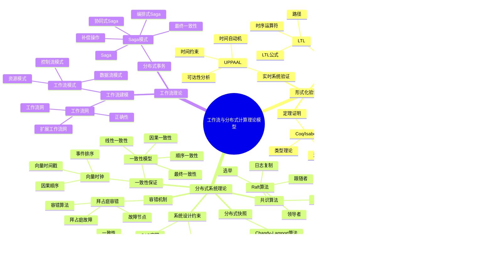

# 全局知识概念关系图

## 📋 概述

本文档建立所有19个理论模型专题文档的全局知识概念关系图，展示概念之间的层次结构、依赖关系和属性关系。

## 🎯 目标

1. **建立概念索引**：为所有核心概念建立统一的索引
2. **梳理概念关系**：明确概念之间的层次、依赖、等价、蕴含等关系
3. **构建知识图谱**：建立可视化的知识概念关系网络
4. **支持交叉引用**：为文档间的概念引用提供支持

## 📊 理论模型分类

### 形式化验证理论模型（7个）

1. **TLA+** - 动作时序逻辑
2. **CTL** - 计算树逻辑
3. **LTL** - 线性时序逻辑
4. **CTL/LTL扩展** - 时序逻辑扩展
5. **Petri网** - 并发系统建模
6. **UPPAAL** - 实时系统验证
7. **Coq/Isabelle** - 定理证明

### 分布式系统理论模型（8个）

1. **CAP定理** - 分布式系统设计约束
2. **FLP不可能定理** - 异步系统共识不可能性
3. **一致性模型** - 数据一致性保证
4. **向量时钟** - 事件排序
5. **拜占庭容错** - 恶意故障容错
6. **Paxos算法** - 共识算法
7. **Raft算法** - 共识算法
8. **Chandy-Lamport快照算法** - 分布式快照

### 工作流理论模型（3个）

1. **工作流网** - 工作流建模
2. **工作流模式** - 工作流模式分类
3. **Saga模式** - 分布式事务模式


## 🗺️ 全局知识概念关系图

### 核心概念层次结构



### 概念依赖关系图


### 概念属性关系矩阵

| 概念类别 | 核心概念 | 主要属性 | 相关概念 | 依赖关系 |
|---------|---------|---------|---------|---------|
| **时序逻辑** | 状态 | 变量赋值、完整快照 | 动作、行为 | 基础概念 |
| **时序逻辑** | 动作 | 状态转换、条件执行 | 状态、行为 | 依赖状态 |
| **时序逻辑** | 行为 | 状态序列、执行轨迹 | 状态、动作 | 依赖状态和动作 |
| **时序逻辑** | 路径 | 状态序列、执行轨迹 | Kripke结构 | 依赖Kripke结构 |
| **Petri网** | 位置 | 令牌容量、令牌数量 | 转换、标记 | 基础概念 |
| **Petri网** | 转换 | 使能条件、触发规则 | 位置、标记 | 依赖位置 |
| **Petri网** | 标记 | 令牌分布、状态表示 | 位置、转换 | 依赖位置和转换 |
| **CAP定理** | 一致性 | 强一致性、弱一致性 | 可用性、分区容错性 | 与可用性互斥 |
| **CAP定理** | 可用性 | 持续可用、请求响应 | 一致性、分区容错性 | 与一致性互斥 |
| **CAP定理** | 分区容错性 | 网络分区、容错能力 | 一致性、可用性 | 通常必需 |
| **FLP定理** | 异步系统 | 无时钟、无界延迟 | 共识问题、故障模型 | 基础假设 |
| **FLP定理** | 共识问题 | 一致性、有效性、终止性 | 异步系统、故障模型 | 依赖异步系统 |
| **一致性模型** | 线性一致性 | 原子性、实时性 | 顺序一致性 | 最强一致性 |
| **一致性模型** | 顺序一致性 | 程序顺序、全局顺序 | 线性一致性、因果一致性 | 强一致性 |
| **一致性模型** | 因果一致性 | 因果顺序、可见性 | 顺序一致性、最终一致性 | 弱一致性 |
| **一致性模型** | 最终一致性 | 最终收敛、不保证强一致性 | 因果一致性 | 最弱一致性 |
| **共识算法** | Paxos | 提议者、接受者、学习者 | FLP定理、拜占庭容错 | 绕过FLP |
| **共识算法** | Raft | 领导者、跟随者、日志复制 | FLP定理、Paxos | 绕过FLP |
| **工作流网** | 工作流网 | 单一输入、单一输出 | Petri网 | 基于Petri网 |
| **工作流网** | 正确性 | 正确终止、无死锁、无多余标记 | 工作流网 | 工作流网性质 |
| **Saga模式** | Saga | 长事务、本地事务序列 | 补偿操作、最终一致性 | 分布式事务模式 |
| **Saga模式** | 补偿操作 | 撤销操作、幂等性 | Saga | Saga组成部分 |

### 概念层次关系图


## 📚 概念索引

### A-C

- **动作（Action）** - TLA+核心概念，描述状态转换
- **异步系统（Asynchronous System）** - FLP不可能定理的基础假设
- **拜占庭容错（Byzantine Fault Tolerance）** - 处理恶意故障的容错机制
- **行为（Behavior）** - TLA+核心概念，状态的无限序列
- **CAP定理** - 分布式系统设计的三选二约束
- **因果一致性（Causal Consistency）** - 保证因果顺序的一致性模型
- **Chandy-Lamport算法** - 分布式系统全局快照算法
- **补偿操作（Compensation）** - Saga模式中的撤销操作
- **共识问题（Consensus Problem）** - 分布式系统中的一致性问题
- **CTL（Computation Tree Logic）** - 计算树逻辑，分支时序逻辑
- **一致性（Consistency）** - CAP定理中的一致性要求

### D-F

- **最终一致性（Eventual Consistency）** - 最终会收敛的一致性模型
- **FLP不可能定理** - 异步系统中确定性共识算法的不可能性
- **故障模型（Fault Model）** - 系统故障的抽象模型

### K-L

- **Kripke结构（Kripke Structure）** - CTL的语义模型
- **线性一致性（Linearizability）** - 最强的一致性模型
- **LTL（Linear Temporal Logic）** - 线性时序逻辑
- **活性（Liveness）** - 系统最终会达到期望状态的性质

### P

- **Paxos算法** - 分布式共识算法
- **Petri网（Petri Net）** - 并发系统建模工具
- **路径（Path）** - 状态的无限序列

### R-S

- **Raft算法** - 易于理解的分布式共识算法
- **Saga模式** - 分布式长事务处理模式
- **安全性（Safety）** - 系统永远不会进入错误状态的性质
- **顺序一致性（Sequential Consistency）** - 保证程序顺序的一致性模型
- **状态（State）** - 系统在某个时刻的完整快照

### T-W

- **TLA+** - 动作时序逻辑，形式化规约语言
- **向量时钟（Vector Clock）** - 事件排序机制
- **工作流网（Workflow Net）** - 基于Petri网的工作流建模方法
- **工作流模式（Workflow Pattern）** - 工作流中的常见模式

## 🔗 概念交叉引用

### 概念关系类型

1. **依赖关系**：概念A的实现或定义依赖于概念B
2. **层次关系**：概念A是概念B的特化或泛化
3. **等价关系**：概念A和概念B在某种意义下等价
4. **蕴含关系**：概念A的性质蕴含概念B的性质
5. **互斥关系**：概念A和概念B不能同时满足

### 主要概念关系链

#### 关系链1：时序逻辑关系链

```text
时序逻辑 → TLA+/CTL/LTL → 状态/动作/路径 → 安全性/活性
```

#### 关系链2：分布式系统关系链

```text
分布式系统 → CAP定理/FLP定理 → 一致性模型/共识算法 → 实际系统设计
```

#### 关系链3：工作流关系链

```text
Petri网 → 工作流网 → 工作流模式 → 实际工作流系统
```

#### 关系链4：事务处理关系链

```text
一致性模型 → Saga模式 → 补偿操作 → 最终一致性
```

## 📖 使用说明

### 查找概念

1. **按类别查找**：根据理论模型分类查找相关概念
2. **按字母顺序查找**：使用概念索引按字母顺序查找
3. **按关系查找**：通过概念关系图查找相关概念

### 理解概念关系

1. **查看层次结构**：通过概念层次关系图理解概念的层次
2. **查看依赖关系**：通过概念依赖关系图理解概念的依赖
3. **查看属性关系**：通过概念属性关系矩阵理解概念的属性

### 交叉引用

1. **文档内引用**：在同一文档内引用相关概念
2. **跨文档引用**：在不同文档间引用相关概念
3. **关系链追踪**：通过关系链追踪概念的发展和应用

---

**文档版本**：1.0

**创建时间**：2024年

**维护者**：项目团队

**状态**：✅ **已完成**

## 八、相关文档

### 8.1 项目内部文档

#### 核心知识文档

- **[项目知识图谱](项目知识图谱.md)** - 项目知识图谱，全局知识概念关系图的基础
- **[知识结构组织方法](知识结构组织方法.md)** - 知识结构组织方法

#### 核心论证文档

- **[Temporal选型论证](../03-TECHNOLOGY/论证/Temporal选型论证.md)** - Temporal选型论证
- **[PostgreSQL选型论证](../03-TECHNOLOGY/论证/PostgreSQL选型论证.md)** - PostgreSQL选型论证
- **[技术栈组合论证](../03-TECHNOLOGY/论证/技术栈组合论证.md)** - 技术栈组合论证

#### 理论模型专题文档

- **[TLA+专题文档](../02-THEORY/formal-verification/TLA+专题文档.md)** - TLA+形式化验证方法
- **[CAP定理专题文档](../02-THEORY/distributed-systems/CAP定理专题文档.md)** - CAP定理
- **[Saga模式专题文档](../02-THEORY/workflow/Saga模式专题文档.md)** - Saga模式

### 8.2 外部资源链接

#### Wikipedia资源

- [Knowledge graph](https://en.wikipedia.org/wiki/Knowledge_graph) - 知识图谱
- [Concept map](https://en.wikipedia.org/wiki/Concept_map) - 概念图
- [Ontology (information science)](https://en.wikipedia.org/wiki/Ontology_(information_science)) - 本体论

### 8.3 项目管理文档

- **[Wikipedia资源对标](../../structure_control/Wikipedia资源对标.md)** - Wikipedia资源对标
- **[概念关联网络](../../structure_control/概念关联网络.md)** - 全局知识概念关系图在概念关联网络中的位置
- **[理论模型专题文档](../02-THEORY/README.md)** - 理论模型专题文档
- **[思维表征增强计划](思维表征增强计划.md)** - 思维表征增强计划
