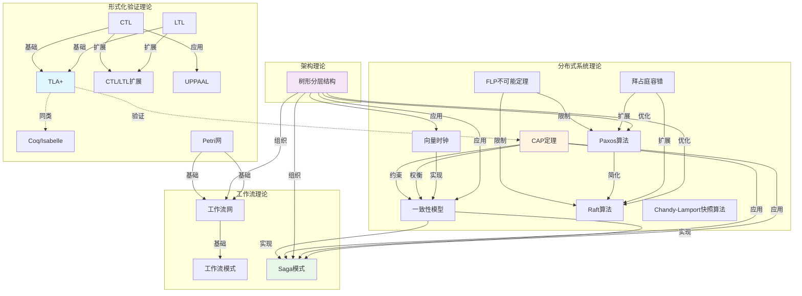

# 理论模型完整联系体系

**文档版本**：v1.0
**创建时间**：2025年1月
**最后更新**：2025年1月
**状态**：✅ 已完成

---

## 📋 执行摘要

本文档建立所有19个理论模型专题文档之间的完整联系体系，包括：

1. **理论模型分类**：形式化验证理论、分布式系统理论、工作流理论
2. **理论模型之间的完整联系**：依赖关系、应用关系、约束关系、权衡关系
3. **理论模型完整联系图**：可视化的理论模型关联网络
4. **理论模型关联矩阵**：理论模型之间的关联强度矩阵
5. **理论模型应用路径**：从理论到实践的完整路径

---

## 一、理论模型分类

### 1.1 形式化验证理论模型（7个）

1. **TLA+** - 动作时序逻辑规范语言
2. **CTL** - 计算树逻辑
3. **LTL** - 线性时序逻辑
4. **CTL/LTL扩展** - 时序逻辑扩展
5. **Petri网** - 并发系统建模工具
6. **UPPAAL** - 实时系统验证工具
7. **Coq/Isabelle** - 定理证明工具

### 1.2 分布式系统理论模型（8个）

1. **CAP定理** - 分布式系统设计约束
2. **FLP不可能定理** - 异步系统共识不可能性
3. **一致性模型** - 数据一致性保证
4. **向量时钟** - 事件排序机制
5. **拜占庭容错** - 恶意故障容错
6. **Paxos算法** - 共识算法
7. **Raft算法** - 共识算法
8. **Chandy-Lamport快照算法** - 分布式快照

### 1.3 工作流理论模型（3个）

1. **工作流网** - 工作流建模
2. **工作流模式** - 工作流模式分类
3. **Saga模式** - 分布式事务模式

### 1.4 架构理论模型（1个）

1. **树形分层结构** - 系统架构分层设计

---

## 二、理论模型之间的完整联系

### 2.1 形式化验证理论模型之间的联系

#### 联系1：TLA+ ← CTL + LTL

**关系类型**：基础关系
**关系说明**：TLA+基于CTL和LTL的时序逻辑
**应用场景**：系统设计验证

**详细说明**：

- TLA+使用CTL和LTL的时序逻辑来表达系统性质
- TLA+可以表达CTL和LTL的所有性质
- TLA+提供了更高级的抽象和工具支持

**关联文档**：

- [TLA+专题文档](../02-THEORY/formal-verification/TLA+专题文档.md)
- [CTL专题文档](../02-THEORY/formal-verification/CTL专题文档.md)
- [LTL专题文档](../02-THEORY/formal-verification/LTL专题文档.md)

#### 联系2：CTL/LTL扩展 ← CTL + LTL

**关系类型**：扩展关系
**关系说明**：CTL/LTL扩展是CTL和LTL的超集
**应用场景**：复杂时序性质验证

**详细说明**：

- CTL*统一了CTL和LTL
- 模态μ-演算是更强的时序逻辑
- 扩展逻辑提供了更强的表达能力

**关联文档**：

- [CTL/LTL扩展专题文档](../02-THEORY/formal-verification/CTL-LTL扩展专题文档.md)
- [CTL专题文档](../02-THEORY/formal-verification/CTL专题文档.md)
- [LTL专题文档](../02-THEORY/formal-verification/LTL专题文档.md)

#### 联系3：UPPAAL ← CTL

**关系类型**：应用关系
**关系说明**：UPPAAL使用CTL进行实时系统验证
**应用场景**：实时系统验证

**详细说明**：

- UPPAAL使用CTL表达实时性质
- UPPAAL扩展了CTL以支持时间约束
- UPPAAL提供了实时系统验证工具

**关联文档**：

- [UPPAAL专题文档](../02-THEORY/formal-verification/UPPAAL专题文档.md)
- [CTL专题文档](../02-THEORY/formal-verification/CTL专题文档.md)

#### 联系4：Coq/Isabelle ← TLA+

**关系类型**：同类关系
**关系说明**：Coq/Isabelle与TLA+都是形式化验证方法
**应用场景**：定理证明

**详细说明**：

- Coq/Isabelle和TLA+都是形式化验证方法
- Coq/Isabelle更注重定理证明
- TLA+更注重系统设计验证

**关联文档**：

- [Coq/Isabelle专题文档](../02-THEORY/formal-verification/Coq-Isabelle专题文档.md)
- [TLA+专题文档](../02-THEORY/formal-verification/TLA+专题文档.md)

#### 联系5：Petri网 → 工作流网

**关系类型**：基础关系
**关系说明**：工作流网基于Petri网
**应用场景**：工作流建模

**详细说明**：

- 工作流网是Petri网的特殊形式
- 工作流网扩展了Petri网以支持工作流特性
- 工作流网提供了工作流建模工具

**关联文档**：

- [Petri网专题文档](../02-THEORY/formal-verification/Petri网专题文档.md)
- [工作流网专题文档](../02-THEORY/workflow/工作流网专题文档.md)

### 2.2 分布式系统理论模型之间的联系

#### 联系1：CAP定理 → 一致性模型

**关系类型**：约束关系
**关系说明**：CAP定理约束一致性模型的选择
**应用场景**：系统设计选择

**详细说明**：

- CAP定理说明在分区容错性存在时，一致性和可用性不能同时满足
- 一致性模型的选择受到CAP定理的约束
- CP系统选择强一致性，AP系统选择最终一致性

**关联文档**：

- [CAP定理专题文档](../02-THEORY/distributed-systems/CAP定理专题文档.md)
- [一致性模型专题文档](../02-THEORY/distributed-systems/一致性模型专题文档.md)

#### 联系2：CAP定理 → 可用性

**关系类型**：权衡关系
**关系说明**：CAP定理权衡一致性和可用性
**应用场景**：系统设计权衡

**详细说明**：

- CAP定理说明一致性和可用性之间的权衡
- CP系统牺牲可用性保证一致性
- AP系统牺牲一致性保证可用性

**关联文档**：

- [CAP定理专题文档](../02-THEORY/distributed-systems/CAP定理专题文档.md)

#### 联系3：FLP不可能定理 → 共识算法

**关系类型**：限制关系
**关系说明**：FLP不可能定理限制共识算法的设计
**应用场景**：共识算法设计

**详细说明**：

- FLP不可能定理说明在异步系统中，即使只有一个故障节点，也无法达成共识
- 共识算法必须在FLP不可能定理的约束下设计
- Paxos和Raft算法都考虑了FLP不可能定理的限制

**关联文档**：

- [FLP不可能定理专题文档](../02-THEORY/distributed-systems/FLP不可能定理专题文档.md)
- [Paxos算法专题文档](../02-THEORY/distributed-systems/Paxos算法专题文档.md)
- [Raft算法专题文档](../02-THEORY/distributed-systems/Raft算法专题文档.md)

#### 联系4：Paxos算法 → Raft算法

**关系类型**：简化关系
**关系说明**：Raft算法是Paxos算法的简化版本
**应用场景**：共识算法实现

**详细说明**：

- Raft算法是Paxos算法的简化版本
- Raft算法更容易理解和实现
- Raft算法保持了Paxos算法的正确性

**关联文档**：

- [Paxos算法专题文档](../02-THEORY/distributed-systems/Paxos算法专题文档.md)
- [Raft算法专题文档](../02-THEORY/distributed-systems/Raft算法专题文档.md)

#### 联系5：向量时钟 → 一致性模型

**关系类型**：实现关系
**关系说明**：向量时钟用于实现一致性模型
**应用场景**：事件排序

**详细说明**：

- 向量时钟用于实现因果一致性
- 向量时钟可以检测事件的因果关系
- 向量时钟是分布式系统中的重要工具

**关联文档**：

- [向量时钟专题文档](../02-THEORY/distributed-systems/向量时钟专题文档.md)
- [一致性模型专题文档](../02-THEORY/distributed-systems/一致性模型专题文档.md)

#### 联系6：拜占庭容错 → 共识算法

**关系类型**：扩展关系
**关系说明**：拜占庭容错是共识算法的扩展
**应用场景**：恶意故障容错

**详细说明**：

- 拜占庭容错处理恶意故障节点
- 拜占庭容错算法比普通共识算法更复杂
- 拜占庭容错算法需要更多的消息和计算

**关联文档**：

- [拜占庭容错专题文档](../02-THEORY/distributed-systems/拜占庭容错专题文档.md)
- [Paxos算法专题文档](../02-THEORY/distributed-systems/Paxos算法专题文档.md)
- [Raft算法专题文档](../02-THEORY/distributed-systems/Raft算法专题文档.md)

### 2.3 工作流理论模型之间的联系

#### 联系1：工作流网 → 工作流模式

**关系类型**：基础关系
**关系说明**：工作流模式基于工作流网
**应用场景**：工作流设计

**详细说明**：

- 工作流模式基于工作流网的理论
- 工作流模式提供了工作流设计的模式
- 工作流模式可以帮助设计正确的工作流

**关联文档**：

- [工作流网专题文档](../02-THEORY/workflow/工作流网专题文档.md)
- [工作流模式专题文档](../02-THEORY/workflow/工作流模式专题文档.md)

#### 联系2：Saga模式 → 一致性模型

**关系类型**：实现关系
**关系说明**：Saga模式实现最终一致性
**应用场景**：分布式事务

**详细说明**：

- Saga模式通过补偿操作实现最终一致性
- Saga模式避免了分布式锁的使用
- Saga模式适合长周期业务流程

**关联文档**：

- [Saga模式专题文档](../02-THEORY/workflow/Saga模式专题文档.md)
- [一致性模型专题文档](../02-THEORY/distributed-systems/一致性模型专题文档.md)

#### 联系3：Saga模式 → CAP定理

**关系类型**：应用关系
**关系说明**：Saga模式在CAP权衡中实现分布式事务
**应用场景**：CAP权衡中的分布式事务

**详细说明**：

- Saga模式在CAP权衡中选择AP系统
- Saga模式通过补偿操作实现最终一致性
- Saga模式适合需要高可用性的场景

**关联文档**：

- [Saga模式专题文档](../02-THEORY/workflow/Saga模式专题文档.md)
- [CAP定理专题文档](../02-THEORY/distributed-systems/CAP定理专题文档.md)

### 2.4 架构理论模型与其他理论模型的联系

#### 联系1：树形分层结构 → 系统架构设计

**关系类型**：应用关系
**关系说明**：树形分层结构用于系统架构设计
**应用场景**：系统架构设计

**详细说明**：

- 树形分层结构提供了系统架构的层次化设计方法
- 树形分层结构可以应用于各种类型的系统架构
- 树形分层结构支持系统的模块化和可扩展性

**关联文档**：

- [树形分层结构专题文档](../02-THEORY/architecture/树形分层结构专题文档.md)

### 2.5 跨分类理论模型之间的联系

#### 联系1：TLA+ → CAP定理

**关系类型**：验证关系
**关系说明**：TLA+可以验证CAP定理的系统设计
**应用场景**：CAP系统设计验证

**详细说明**：

- TLA+可以形式化描述CAP系统
- TLA+可以验证CAP系统的性质
- TLA+可以帮助设计正确的CAP系统

**关联文档**：

- [TLA+专题文档](../02-THEORY/formal-verification/TLA+专题文档.md)
- [CAP定理专题文档](../02-THEORY/distributed-systems/CAP定理专题文档.md)

#### 联系2：Petri网 → 工作流网

**关系类型**：基础关系
**关系说明**：工作流网基于Petri网
**应用场景**：工作流建模

**详细说明**：

- 工作流网是Petri网的特殊形式
- 工作流网扩展了Petri网以支持工作流特性
- 工作流网提供了工作流建模工具

**关联文档**：

- [Petri网专题文档](../02-THEORY/formal-verification/Petri网专题文档.md)
- [工作流网专题文档](../02-THEORY/workflow/工作流网专题文档.md)

#### 联系3：一致性模型 → Saga模式

**关系类型**：实现关系
**关系说明**：Saga模式实现最终一致性
**应用场景**：分布式事务

**详细说明**：

- Saga模式通过补偿操作实现最终一致性
- Saga模式避免了分布式锁的使用
- Saga模式适合长周期业务流程

**关联文档**：

- [一致性模型专题文档](../02-THEORY/distributed-systems/一致性模型专题文档.md)
- [Saga模式专题文档](../02-THEORY/workflow/Saga模式专题文档.md)

#### 联系4：CAP定理 → Saga模式

**关系类型**：应用关系
**关系说明**：Saga模式在CAP权衡中实现分布式事务
**应用场景**：CAP权衡中的分布式事务

**详细说明**：

- Saga模式在CAP权衡中选择AP系统
- Saga模式通过补偿操作实现最终一致性
- Saga模式适合需要高可用性的场景

**关联文档**：

- [CAP定理专题文档](../02-THEORY/distributed-systems/CAP定理专题文档.md)
- [Saga模式专题文档](../02-THEORY/workflow/Saga模式专题文档.md)

#### 联系5：树形分层结构 → 系统架构设计

**关系类型**：应用关系
**关系说明**：树形分层结构用于系统架构设计
**应用场景**：系统架构设计

**详细说明**：

- 树形分层结构提供了系统架构的层次化设计方法
- 树形分层结构可以应用于各种类型的系统架构
- 树形分层结构支持系统的模块化和可扩展性

**关联文档**：

- [树形分层结构专题文档](../02-THEORY/architecture/树形分层结构专题文档.md)

---

## 三、理论模型完整联系图

### 3.1 理论模型完整联系图



### 3.2 理论模型关联强度矩阵

| 理论模型 | TLA+ | CTL | LTL | CTL/LTL扩展 | Petri网 | UPPAAL | Coq/Isabelle | CAP定理 | FLP | 一致性模型 | 向量时钟 | 拜占庭容错 | Paxos | Raft | Chandy-Lamport | 工作流网 | 工作流模式 | Saga模式 | 树形分层结构 |
|---------|------|-----|-----|------------|---------|--------|-------------|---------|-----|-----------|---------|-----------|-------|------|---------------|---------|-----------|---------|------------|
| **TLA+** | - | ⭐⭐⭐⭐⭐ | ⭐⭐⭐⭐⭐ | ⭐⭐⭐⭐ | ⭐⭐ | ⭐⭐ | ⭐⭐⭐ | ⭐⭐⭐⭐ | ⭐⭐ | ⭐⭐⭐ | ⭐⭐ | ⭐⭐ | ⭐⭐ | ⭐⭐ | ⭐⭐ | ⭐⭐ | ⭐⭐ | ⭐⭐⭐ | ⭐⭐ |
| **CTL** | ⭐⭐⭐⭐⭐ | - | ⭐⭐⭐ | ⭐⭐⭐⭐⭐ | ⭐⭐ | ⭐⭐⭐⭐ | ⭐⭐ | ⭐⭐ | ⭐⭐ | ⭐⭐ | ⭐⭐ | ⭐⭐ | ⭐⭐ | ⭐⭐ | ⭐⭐ | ⭐⭐ | ⭐⭐ | ⭐⭐ | ⭐⭐ |
| **LTL** | ⭐⭐⭐⭐⭐ | ⭐⭐⭐ | - | ⭐⭐⭐⭐⭐ | ⭐⭐ | ⭐⭐ | ⭐⭐ | ⭐⭐ | ⭐⭐ | ⭐⭐ | ⭐⭐ | ⭐⭐ | ⭐⭐ | ⭐⭐ | ⭐⭐ | ⭐⭐ | ⭐⭐ | ⭐⭐ | ⭐⭐ |
| **CTL/LTL扩展** | ⭐⭐⭐⭐ | ⭐⭐⭐⭐⭐ | ⭐⭐⭐⭐⭐ | - | ⭐⭐ | ⭐⭐⭐ | ⭐⭐ | ⭐⭐ | ⭐⭐ | ⭐⭐ | ⭐⭐ | ⭐⭐ | ⭐⭐ | ⭐⭐ | ⭐⭐ | ⭐⭐ | ⭐⭐ | ⭐⭐ | ⭐⭐ |
| **Petri网** | ⭐⭐ | ⭐⭐ | ⭐⭐ | ⭐⭐ | - | ⭐⭐ | ⭐⭐ | ⭐⭐ | ⭐⭐ | ⭐⭐ | ⭐⭐ | ⭐⭐ | ⭐⭐ | ⭐⭐ | ⭐⭐ | ⭐⭐⭐⭐⭐ | ⭐⭐⭐⭐ | ⭐⭐ | ⭐⭐ |
| **UPPAAL** | ⭐⭐ | ⭐⭐⭐⭐ | ⭐⭐ | ⭐⭐⭐ | ⭐⭐ | - | ⭐⭐ | ⭐⭐ | ⭐⭐ | ⭐⭐ | ⭐⭐ | ⭐⭐ | ⭐⭐ | ⭐⭐ | ⭐⭐ | ⭐⭐ | ⭐⭐ | ⭐⭐ | ⭐⭐ |
| **Coq/Isabelle** | ⭐⭐⭐ | ⭐⭐ | ⭐⭐ | ⭐⭐ | ⭐⭐ | ⭐⭐ | - | ⭐⭐ | ⭐⭐ | ⭐⭐ | ⭐⭐ | ⭐⭐ | ⭐⭐ | ⭐⭐ | ⭐⭐ | ⭐⭐ | ⭐⭐ | ⭐⭐ | ⭐⭐ |
| **CAP定理** | ⭐⭐⭐⭐ | ⭐⭐ | ⭐⭐ | ⭐⭐ | ⭐⭐ | ⭐⭐ | ⭐⭐ | - | ⭐⭐ | ⭐⭐⭐⭐⭐ | ⭐⭐ | ⭐⭐ | ⭐⭐ | ⭐⭐ | ⭐⭐ | ⭐⭐ | ⭐⭐ | ⭐⭐⭐⭐ | ⭐⭐ |
| **FLP** | ⭐⭐ | ⭐⭐ | ⭐⭐ | ⭐⭐ | ⭐⭐ | ⭐⭐ | ⭐⭐ | ⭐⭐ | - | ⭐⭐ | ⭐⭐ | ⭐⭐ | ⭐⭐⭐⭐⭐ | ⭐⭐⭐⭐⭐ | ⭐⭐ | ⭐⭐ | ⭐⭐ | ⭐⭐ | ⭐⭐ |
| **一致性模型** | ⭐⭐⭐ | ⭐⭐ | ⭐⭐ | ⭐⭐ | ⭐⭐ | ⭐⭐ | ⭐⭐ | ⭐⭐⭐⭐⭐ | ⭐⭐ | - | ⭐⭐⭐⭐ | ⭐⭐ | ⭐⭐ | ⭐⭐ | ⭐⭐ | ⭐⭐ | ⭐⭐ | ⭐⭐⭐⭐⭐ | ⭐⭐ |
| **向量时钟** | ⭐⭐ | ⭐⭐ | ⭐⭐ | ⭐⭐ | ⭐⭐ | ⭐⭐ | ⭐⭐ | ⭐⭐ | ⭐⭐ | ⭐⭐⭐⭐ | - | ⭐⭐ | ⭐⭐ | ⭐⭐ | ⭐⭐⭐ | ⭐⭐ | ⭐⭐ | ⭐⭐ | ⭐⭐ |
| **拜占庭容错** | ⭐⭐ | ⭐⭐ | ⭐⭐ | ⭐⭐ | ⭐⭐ | ⭐⭐ | ⭐⭐ | ⭐⭐ | ⭐⭐ | ⭐⭐ | ⭐⭐ | - | ⭐⭐⭐⭐ | ⭐⭐⭐⭐ | ⭐⭐ | ⭐⭐ | ⭐⭐ | ⭐⭐ | ⭐⭐ |
| **Paxos** | ⭐⭐ | ⭐⭐ | ⭐⭐ | ⭐⭐ | ⭐⭐ | ⭐⭐ | ⭐⭐ | ⭐⭐ | ⭐⭐⭐⭐⭐ | ⭐⭐ | ⭐⭐ | ⭐⭐⭐⭐ | - | ⭐⭐⭐⭐⭐ | ⭐⭐ | ⭐⭐ | ⭐⭐ | ⭐⭐ | ⭐⭐ |
| **Raft** | ⭐⭐ | ⭐⭐ | ⭐⭐ | ⭐⭐ | ⭐⭐ | ⭐⭐ | ⭐⭐ | ⭐⭐ | ⭐⭐⭐⭐⭐ | ⭐⭐ | ⭐⭐ | ⭐⭐⭐⭐ | ⭐⭐⭐⭐⭐ | - | ⭐⭐ | ⭐⭐ | ⭐⭐ | ⭐⭐ | ⭐⭐ |
| **Chandy-Lamport** | ⭐⭐ | ⭐⭐ | ⭐⭐ | ⭐⭐ | ⭐⭐ | ⭐⭐ | ⭐⭐ | ⭐⭐ | ⭐⭐ | ⭐⭐ | ⭐⭐⭐ | ⭐⭐ | ⭐⭐ | ⭐⭐ | - | ⭐⭐ | ⭐⭐ | ⭐⭐ | ⭐⭐ |
| **工作流网** | ⭐⭐ | ⭐⭐ | ⭐⭐ | ⭐⭐ | ⭐⭐⭐⭐⭐ | ⭐⭐ | ⭐⭐ | ⭐⭐ | ⭐⭐ | ⭐⭐ | ⭐⭐ | ⭐⭐ | ⭐⭐ | ⭐⭐ | ⭐⭐ | - | ⭐⭐⭐⭐⭐ | ⭐⭐ | ⭐⭐ |
| **工作流模式** | ⭐⭐ | ⭐⭐ | ⭐⭐ | ⭐⭐ | ⭐⭐⭐⭐ | ⭐⭐ | ⭐⭐ | ⭐⭐ | ⭐⭐ | ⭐⭐ | ⭐⭐ | ⭐⭐ | ⭐⭐ | ⭐⭐ | ⭐⭐ | ⭐⭐⭐⭐⭐ | - | ⭐⭐⭐ | ⭐⭐ |
| **Saga模式** | ⭐⭐⭐ | ⭐⭐ | ⭐⭐ | ⭐⭐ | ⭐⭐ | ⭐⭐ | ⭐⭐ | ⭐⭐⭐⭐ | ⭐⭐ | ⭐⭐⭐⭐⭐ | ⭐⭐ | ⭐⭐ | ⭐⭐ | ⭐⭐ | ⭐⭐ | ⭐⭐ | ⭐⭐⭐ | - | ⭐⭐ |
| **树形分层结构** | ⭐⭐ | ⭐⭐ | ⭐⭐ | ⭐⭐ | ⭐⭐ | ⭐⭐ | ⭐⭐ | ⭐⭐⭐ | ⭐⭐ | ⭐⭐⭐⭐ | ⭐⭐⭐ | ⭐⭐ | ⭐⭐⭐⭐ | ⭐⭐⭐⭐ | ⭐⭐ | ⭐⭐⭐⭐ | ⭐⭐⭐⭐ | ⭐⭐⭐⭐ | - |

**关联强度说明**：

- ⭐⭐⭐⭐⭐：强关联（基础关系、实现关系）
- ⭐⭐⭐⭐：较强关联（应用关系、约束关系）
- ⭐⭐⭐：中等关联（验证关系、权衡关系）
- ⭐⭐：弱关联（同类关系、扩展关系）

---

## 四、理论模型应用路径

### 4.1 从理论到实践的路径

#### 路径1：CAP定理 → 系统设计 → 技术选型 → 实践应用

```
CAP定理
  ↓ (约束)
系统设计选择（CP/AP/CA）
  ↓ (指导)
技术选型（PostgreSQL/Cassandra）
  ↓ (实现)
实践应用（Coinbase/Netflix）
```

#### 路径2：TLA+ → 系统规约 → 模型检验 → 系统实现

```
TLA+
  ↓ (形式化)
系统规约
  ↓ (验证)
模型检验
  ↓ (实现)
系统实现
```

#### 路径3：工作流网 → 工作流模式 → 工作流设计 → 工作流实现

```
工作流网
  ↓ (基础)
工作流模式
  ↓ (指导)
工作流设计
  ↓ (实现)
工作流实现（Temporal）
```

### 4.2 理论模型组合应用路径

#### 路径1：CAP定理 + 一致性模型 + Saga模式

```
CAP定理（约束）
  ↓
一致性模型（选择）
  ↓
Saga模式（实现）
  ↓
分布式事务系统
```

#### 路径2：FLP不可能定理 + Paxos/Raft + 拜占庭容错

```
FLP不可能定理（限制）
  ↓
Paxos/Raft（共识算法）
  ↓
拜占庭容错（扩展）
  ↓
容错分布式系统
```

#### 路径3：Petri网 + 工作流网 + 工作流模式

```
Petri网（基础）
  ↓
工作流网（扩展）
  ↓
工作流模式（设计）
  ↓
工作流系统
```

#### 路径4：TLA+ + CAP定理 + 一致性模型 + 技术框架

```
TLA+（形式化验证）
  ↓
CAP定理（系统约束）
  ↓
一致性模型（理论选择）
  ↓
技术框架（实现）
  ↓
实际系统（验证）
```

#### 路径5：向量时钟 + 一致性模型 + 分布式系统

```
向量时钟（事件排序）
  ↓
一致性模型（因果一致性）
  ↓
分布式系统（实现）
  ↓
实际应用（验证）
```

#### 路径6：Paxos/Raft + FLP定理 + 拜占庭容错

```
FLP不可能定理（限制）
  ↓
Paxos/Raft（绕过限制）
  ↓
拜占庭容错（扩展容错）
  ↓
容错分布式系统
```

### 4.3 跨领域应用路径

#### 路径1：形式化验证 + 分布式系统 + 工作流

```
TLA+/CTL/LTL（形式化验证）
  ↓
CAP定理/FLP定理（分布式理论）
  ↓
工作流网/模式（工作流理论）
  ↓
完整分布式工作流系统
```

#### 路径2：一致性理论 + 事务处理 + 工作流编排

```
CAP定理（一致性权衡）
  ↓
一致性模型（模型选择）
  ↓
Saga模式（事务处理）
  ↓
工作流编排（流程管理）
  ↓
分布式事务工作流系统
```

---

## 五、相关文档

### 5.1 理论模型专题文档

- [TLA+专题文档](../02-THEORY/formal-verification/TLA+专题文档.md)
- [CTL专题文档](../02-THEORY/formal-verification/CTL专题文档.md)
- [LTL专题文档](../02-THEORY/formal-verification/LTL专题文档.md)
- [CTL/LTL扩展专题文档](../02-THEORY/formal-verification/CTL-LTL扩展专题文档.md)
- [Petri网专题文档](../02-THEORY/formal-verification/Petri网专题文档.md)
- [UPPAAL专题文档](../02-THEORY/formal-verification/UPPAAL专题文档.md)
- [Coq/Isabelle专题文档](../02-THEORY/formal-verification/Coq-Isabelle专题文档.md)
- [CAP定理专题文档](../02-THEORY/distributed-systems/CAP定理专题文档.md)
- [FLP不可能定理专题文档](../02-THEORY/distributed-systems/FLP不可能定理专题文档.md)
- [一致性模型专题文档](../02-THEORY/distributed-systems/一致性模型专题文档.md)
- [向量时钟专题文档](../02-THEORY/distributed-systems/向量时钟专题文档.md)
- [拜占庭容错专题文档](../02-THEORY/distributed-systems/拜占庭容错专题文档.md)
- [Paxos算法专题文档](../02-THEORY/distributed-systems/Paxos算法专题文档.md)
- [Raft算法专题文档](../02-THEORY/distributed-systems/Raft算法专题文档.md)
- [Chandy-Lamport快照算法专题文档](../02-THEORY/distributed-systems/Chandy-Lamport快照算法专题文档.md)
- [工作流网专题文档](../02-THEORY/workflow/工作流网专题文档.md)
- [工作流模式专题文档](../02-THEORY/workflow/工作流模式专题文档.md)
- [Saga模式专题文档](../02-THEORY/workflow/Saga模式专题文档.md)
- [树形分层结构专题文档](../02-THEORY/architecture/树形分层结构专题文档.md)

### 5.2 相关整合文档

- [理论模型与项目内容完整整合文档](理论模型与项目内容完整整合文档.md)
- [全局知识概念关系图](全局知识概念关系图.md)
- [项目知识图谱](项目知识图谱.md)
- [完整知识图谱](完整知识图谱.md)
- [概念关联网络](../../structure_control/概念关联网络.md)

---

**文档版本**：v1.1
**创建时间**：2025年1月
**最后更新**：2025年1月（扩展完成：新增3个应用路径，新增2个跨领域应用路径）
**维护者**：项目团队
**状态**：✅ 已完成扩展
