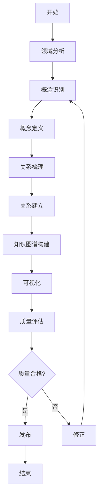

# 知识结构组织方法

**文档版本**：v2.0
**创建时间**：2025年11月28日
**最后更新**：2025年1月
**优先级**：P0
**状态**：✅ 已完成

---

## 📑 目录

- [知识结构组织方法](#知识结构组织方法)
  - [📑 目录](#-目录)
  - [一、概述](#一概述)
    - [1.1 文档目的](#11-文档目的)
    - [1.2 知识结构定义](#12-知识结构定义)
  - [二、组织原则](#二组织原则)
    - [2.1 层次性原则](#21-层次性原则)
    - [2.2 关系性原则](#22-关系性原则)
    - [2.3 完整性原则](#23-完整性原则)
  - [三、组织模板](#三组织模板)
    - [3.1 层次结构模板](#31-层次结构模板)
    - [3.2 关系结构模板](#32-关系结构模板)
  - [四、知识图谱构建方法](#四知识图谱构建方法)
    - [4.1 概念识别方法](#41-概念识别方法)
      - [步骤1：领域分析](#步骤1领域分析)
      - [步骤2：概念定义](#步骤2概念定义)
      - [步骤3：概念验证](#步骤3概念验证)
    - [4.2 关系梳理方法](#42-关系梳理方法)
      - [步骤1：关系类型识别](#步骤1关系类型识别)
      - [步骤2：关系建立](#步骤2关系建立)
      - [步骤3：关系网络构建](#步骤3关系网络构建)
    - [4.3 知识图谱可视化](#43-知识图谱可视化)
      - [方法1：层次结构可视化](#方法1层次结构可视化)
      - [方法2：关系网络可视化](#方法2关系网络可视化)
      - [方法3：矩阵可视化](#方法3矩阵可视化)
  - [五、组织示例](#五组织示例)
    - [5.1 示例1：Temporal工作流引擎知识结构](#51-示例1temporal工作流引擎知识结构)
    - [5.2 示例2：Flink流处理框架知识结构](#52-示例2flink流处理框架知识结构)
    - [5.3 示例3：PostgreSQL存储后端知识结构](#53-示例3postgresql存储后端知识结构)
  - [六、实践指南](#六实践指南)
    - [6.1 知识结构组织流程](#61-知识结构组织流程)
    - [6.2 概念识别检查清单](#62-概念识别检查清单)
    - [6.3 关系梳理检查清单](#63-关系梳理检查清单)
    - [6.4 知识图谱质量检查清单](#64-知识图谱质量检查清单)
  - [七、更新机制](#七更新机制)
    - [5.1 更新流程](#51-更新流程)
    - [5.2 版本管理](#52-版本管理)
  - [八、质量评估](#八质量评估)
    - [6.1 质量指标](#61-质量指标)
    - [6.2 质量检查清单](#62-质量检查清单)
  - [九、相关文档](#九相关文档)
  - [九、相关文档](#九相关文档-1)
    - [9.1 项目内部文档](#91-项目内部文档)
      - [核心知识文档](#核心知识文档)
      - [其他相关文档](#其他相关文档)
    - [9.2 外部资源链接](#92-外部资源链接)
      - [Wikipedia资源](#wikipedia资源)
    - [9.3 项目管理文档](#93-项目管理文档)
    - [9.1 知识图谱相关文档](#91-知识图谱相关文档)
    - [9.2 相关资源](#92-相关资源)

---

## 一、概述

### 1.1 文档目的

本文档旨在建立知识结构的系统组织方法，包括：

1. **组织原则**：定义知识结构的组织原则
2. **组织模板**：建立知识结构的组织模板
3. **组织示例**：提供知识结构的组织示例
4. **更新机制**：建立知识结构的更新机制
5. **质量评估**：建立知识结构的质量评估方法

### 1.2 知识结构定义

**知识结构（Knowledge Structure）**是知识的组织方式，包括：

- **层次结构**：知识的层级组织
- **关系结构**：知识之间的关系组织
- **推理结构**：知识的推理路径组织

---

## 二、组织原则

### 2.1 层次性原则

知识应该按照层次组织：

1. **理论层**：理论基础和形式化定义
2. **架构层**：技术架构和实现方式
3. **实践层**：实践案例和应用场景
4. **验证层**：验证方法和质量保证

### 2.2 关系性原则

知识应该按照关系组织：

1. **依赖关系**：技术依赖、理论依赖
2. **推理关系**：从理论到实践的推理路径
3. **相似关系**：相似概念和模式

### 2.3 完整性原则

知识结构应该完整：

1. **概念完整性**：所有核心概念都已识别
2. **关系完整性**：所有概念关系都已建立
3. **推理完整性**：所有推理路径都已梳理

---

## 三、组织模板

### 3.1 层次结构模板

```markdown
# [主题名称]

## 一、理论层
### 1.1 理论基础
- [理论1]
- [理论2]

### 1.2 形式化定义
- [定义1]
- [定义2]

## 二、架构层
### 2.1 技术架构
- [架构1]
- [架构2]

### 2.2 实现方式
- [实现1]
- [实现2]

## 三、实践层
### 3.1 实践案例
- [案例1]
- [案例2]

### 3.2 应用场景
- [场景1]
- [场景2]

## 四、验证层
### 4.1 验证方法
- [方法1]
- [方法2]

### 4.2 质量保证
- [保证1]
- [保证2]
```

### 3.2 关系结构模板

```markdown
# [主题名称]关系结构

## 一、依赖关系
### 1.1 技术依赖
- [依赖1] → [依赖2]

### 1.2 理论依赖
- [依赖1] → [依赖2]

## 二、推理关系
### 2.1 理论到实践
- [理论] → [实践]

### 2.2 实践到理论
- [实践] → [理论]

## 三、相似关系
### 3.1 相似概念
- [概念1] ≈ [概念2]

### 3.2 相似模式
- [模式1] ≈ [模式2]
```

---

## 四、知识图谱构建方法

### 4.1 概念识别方法

#### 步骤1：领域分析

1. **识别核心领域**：确定知识图谱覆盖的领域范围
2. **提取关键概念**：从文档、代码、实践中提取核心概念
3. **概念分类**：按照理论层、架构层、实践层、验证层分类

#### 步骤2：概念定义

1. **概念命名**：使用清晰、一致的命名规范
2. **概念描述**：提供准确的定义和说明
3. **概念属性**：定义概念的关键属性

#### 步骤3：概念验证

1. **完整性检查**：确保所有核心概念都已识别
2. **一致性检查**：确保概念定义一致
3. **准确性检查**：验证概念定义的准确性

### 4.2 关系梳理方法

#### 步骤1：关系类型识别

1. **依赖关系**：技术依赖、理论依赖
2. **层次关系**：父子关系、包含关系
3. **推理关系**：从理论到实践的推理路径
4. **相似关系**：相似概念和模式

#### 步骤2：关系建立

1. **关系定义**：明确关系的语义和方向
2. **关系强度**：评估关系的强度（强/中/弱）
3. **关系验证**：验证关系的正确性

#### 步骤3：关系网络构建

1. **关系图构建**：使用Mermaid等工具构建关系图
2. **关系矩阵**：建立关系矩阵表示关系强度
3. **关系路径**：识别关键的关系路径

### 4.3 知识图谱可视化

#### 方法1：层次结构可视化

- 使用思维导图（mindmap）展示层次结构
- 使用树形图展示分类关系

#### 方法2：关系网络可视化

- 使用有向图（graph）展示关系网络
- 使用不同颜色和样式区分不同类型的节点和边

#### 方法3：矩阵可视化

- 使用表格展示关系矩阵
- 使用符号（⭐、✅、⚠️）表示关系强度

---

## 五、组织示例

### 5.1 示例1：Temporal工作流引擎知识结构

```markdown
# Temporal工作流引擎知识结构

## 一、理论层
### 1.1 理论基础
- Durable Execution理论
- 事件溯源理论
- 工作流理论

### 1.2 形式化定义
- TLA+规约
- CTL/LTL性质定义

## 二、架构层
### 2.1 技术架构
- 工作流引擎架构
- 存储后端架构
- 语言绑定架构

### 2.2 实现方式
- Go SDK实现
- Java SDK实现
- TypeScript SDK实现

## 三、实践层
### 3.1 实践案例
- Coinbase支付系统
- Stripe支付编排
- Robinhood交易清算

### 3.2 应用场景
- 金融科技场景
- 共享经济场景
- 流媒体场景

## 四、验证层
### 4.1 验证方法
- TLA+规约验证
- 性能测试验证
- 一致性验证

### 4.2 质量保证
- 精确一次执行保证
- 一致性保证
- 可靠性保证
```

### 5.2 示例2：Flink流处理框架知识结构

```markdown
# Flink流处理框架知识结构

## 一、理论层
### 1.1 理论基础
- 流处理理论
- 精确一次语义理论
- 状态管理理论
- CAP定理（CP选择）

### 1.2 形式化定义
- TLA+规约（状态机验证）
- CTL/LTL性质定义（时序性质）
- Petri网建模（数据流图）

## 二、架构层
### 2.1 技术架构
- 流处理引擎架构
- 状态后端架构
- Checkpoint机制
- 容错恢复机制

### 2.2 实现方式
- Java API实现
- Scala API实现
- Python API实现
- SQL API实现

## 三、实践层
### 3.1 实践案例
- 字节跳动实时推荐
- 阿里巴巴实时数仓
- 美团实时风控
- 滴滴实时调度

### 3.2 应用场景
- 实时数据处理
- 实时计算
- 实时监控
- 实时推荐

## 四、验证层
### 4.1 验证方法
- TLA+规约验证（状态机正确性）
- 性能测试验证（吞吐量、延迟）
- 一致性验证（精确一次语义）

### 4.2 质量保证
- 精确一次语义保证
- 低延迟保证
- 高吞吐量保证
```

### 5.3 示例3：PostgreSQL存储后端知识结构

```markdown
# PostgreSQL存储后端知识结构

## 一、理论层
### 1.1 理论基础
- ACID事务理论
- CAP定理（CP选择）
- 一致性模型（强一致性）
- MVCC理论

### 1.2 形式化定义
- 事务隔离级别定义
- 一致性模型定义
- 并发控制算法定义

## 二、架构层
### 2.1 技术架构
- 存储引擎架构
- 事务管理器架构
- 锁管理器架构
- WAL机制

### 2.2 实现方式
- 可序列化隔离级别
- 快照隔离
- 多版本并发控制
- 两阶段提交

## 三、实践层
### 3.1 实践案例
- Coinbase支付系统
- Stripe支付编排
- Uber数据中心升级
- Airbnb房源管理

### 3.2 应用场景
- 金融交易系统
- 支付处理系统
- 订单管理系统
- 用户数据管理

## 四、验证层
### 4.1 验证方法
- 事务一致性验证
- 性能测试验证
- 并发测试验证
- 故障恢复验证

### 4.2 质量保证
- ACID事务保证
- 强一致性保证
- 高可用性保证
- 数据持久性保证
```

---

## 六、实践指南

### 6.1 知识结构组织流程



### 6.2 概念识别检查清单

- [ ] 所有核心领域都已识别
- [ ] 所有关键概念都已提取
- [ ] 概念分类正确
- [ ] 概念命名清晰一致
- [ ] 概念定义准确完整
- [ ] 概念属性定义完整

### 6.3 关系梳理检查清单

- [ ] 所有关系类型都已识别
- [ ] 所有关键关系都已建立
- [ ] 关系定义清晰准确
- [ ] 关系强度评估合理
- [ ] 关系网络完整
- [ ] 关系路径明确

### 6.4 知识图谱质量检查清单

- [ ] 概念完整性：所有核心概念都已包含
- [ ] 关系完整性：所有关键关系都已建立
- [ ] 推理完整性：所有推理路径都已梳理
- [ ] 可视化清晰：知识图谱可视化清晰易懂
- [ ] 文档完整：相关文档都已链接
- [ ] 更新机制：更新机制完善

---

## 七、更新机制

### 5.1 更新流程

1. **识别更新需求**：识别需要更新的知识
2. **验证更新内容**：验证更新内容的正确性
3. **执行更新**：执行知识结构更新
4. **质量评估**：评估更新后的质量
5. **发布更新**：发布更新后的知识结构

### 5.2 版本管理

- **主版本号**：重大结构变更
- **次版本号**：新增知识或关系
- **修订版本号**：知识或关系的修正

---

## 八、质量评估

### 6.1 质量指标

| 指标名称 | 目标值 | 评估方法 |
|---------|--------|---------|
| 完整性 | 100% | 知识审查 |
| 一致性 | 100% | 一致性检查 |
| 可读性 | 优秀 | 可读性评估 |

### 6.2 质量检查清单

- [ ] 知识结构完整
- [ ] 知识关系清晰
- [ ] 推理路径明确
- [ ] 更新机制完善

---

## 九、相关文档

- [项目知识图谱](项目知识图谱.md)
- [全局知识关联图](全局知识关联图.md)
- [网络对标分析与改进计划](../../structure_control/网络对标分析与改进计划.md)

---

**文档版本**：v2.0
**最后更新**：2025年1月
**维护者**：项目团队
**状态**：✅ 已完成（组织原则、模板、示例、构建方法、实践指南已完善）

---

## 九、相关文档

### 9.1 项目内部文档

#### 核心知识文档

- **[项目知识图谱](项目知识图谱.md)** - 项目知识图谱，知识结构组织方法的应用
- **[全局知识概念关系图](全局知识概念关系图.md)** - 全局知识概念关系图

#### 其他相关文档

- **[形式化验证理论](../01-FOUNDATION/形式化验证理论.md)** - 形式化验证理论

### 9.2 外部资源链接

#### Wikipedia资源

- [Knowledge organization](https://en.wikipedia.org/wiki/Knowledge_organization) - 知识组织
- [Taxonomy (general)](https://en.wikipedia.org/wiki/Taxonomy_(general)) - 分类学
- [Ontology (information science)](https://en.wikipedia.org/wiki/Ontology_(information_science)) - 本体论

### 9.3 项目管理文档

- **[Wikipedia资源对标](../../structure_control/Wikipedia资源对标.md)** - Wikipedia资源对标
- **[概念关联网络](../../structure_control/概念关联网络.md)** - 知识结构组织方法在概念关联网络中的位置

### 9.1 知识图谱相关文档

- [项目知识图谱](项目知识图谱.md) - 项目知识图谱构建
- [动态知识更新-增量更新机制](../19-next-phase/动态知识更新-增量更新机制.md) - 增量更新机制
- [动态知识更新-版本管理](../19-next-phase/动态知识更新-版本管理.md) - 版本管理
- [动态知识更新-一致性维护](../19-next-phase/动态知识更新-一致性维护.md) - 一致性维护
- [动态知识更新-质量评估](../19-next-phase/动态知识更新-质量评估.md) - 质量评估

### 9.2 相关资源

- [网络对标分析与改进计划](../../structure_control/网络对标分析与改进计划.md)
- [形式逻辑推理方法](../08-ENHANCEMENT/论证增强/形式逻辑推理方法.md)
