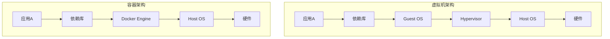
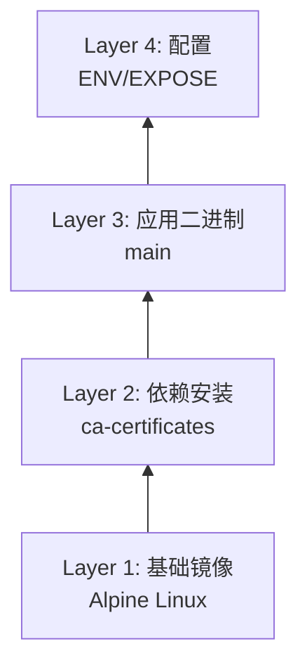
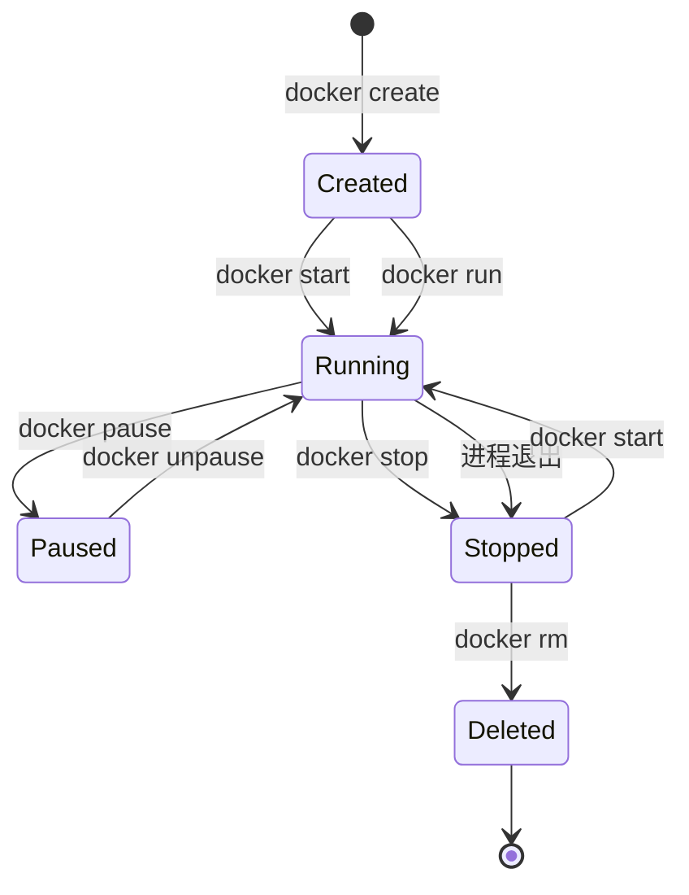

# Docker容器技术

## 概述

Docker是一种开源的容器化平台，它允许开发者将应用程序及其依赖打包成标准化的容器镜像，实现一次构建、到处运行。容器技术通过操作系统级虚拟化，提供了比传统虚拟机更轻量、更高效的隔离环境。

## 核心原理

### 容器 vs 虚拟机



### 命名空间隔离

Docker利用Linux命名空间实现资源隔离：

| 命名空间 | 隔离资源 |
|---------|---------|
| PID | 进程ID |
| NET | 网络设备、端口 |
| IPC | 进程间通信 |
| MNT | 文件系统挂载点 |
| UTS | 主机名和域名 |
| USER | 用户和用户组 |

## 镜像构建

### Dockerfile示例

```dockerfile
# 多阶段构建示例
FROM golang:1.21-alpine AS builder
WORKDIR /app
COPY go.mod go.sum ./
RUN go mod download
COPY . .
RUN CGO_ENABLED=0 GOOS=linux go build -o main .

# 运行阶段
FROM alpine:latest
RUN apk --no-cache add ca-certificates
WORKDIR /root/
COPY --from=builder /app/main .
EXPOSE 8080
CMD ["./main"]
```

### 镜像分层结构



## 容器生命周期



## 网络模式

```yaml
# docker-compose.yml 网络配置示例
version: '3.8'
services:
  web:
    image: nginx:latest
    networks:
      - frontend
      - backend
    ports:
      - "80:80"
  
  api:
    image: myapp:latest
    networks:
      - backend
    environment:
      - DB_HOST=db
  
  db:
    image: postgres:15
    networks:
      - backend
    volumes:
      - db_data:/var/lib/postgresql/data

networks:
  frontend:
    driver: bridge
  backend:
    driver: bridge
    internal: true

volumes:
  db_data:
```

## 存储驱动

| 驱动类型 | 适用场景 | 性能 |
|---------|---------|------|
| Overlay2 | 生产环境首选 | 高 |
| AUFS | 早期Ubuntu | 中 |
| Device Mapper | 块设备存储 | 中 |
| Btrfs | 快照需求 | 高 |
| ZFS | 高级存储特性 | 高 |

## 最佳实践

1. **镜像优化**：使用多阶段构建减小镜像体积
2. **安全实践**：以非root用户运行容器
3. **资源限制**：设置CPU和内存限制
4. **健康检查**：配置HEALTHCHECK指令
5. **日志管理**：使用集中式日志收集

```dockerfile
# 健康检查示例
HEALTHCHECK --interval=30s --timeout=3s --start-period=5s --retries=3 \
  CMD curl -f http://localhost:8080/health || exit 1
```

## 总结

Docker容器技术通过标准化打包和轻量级隔离，彻底改变了应用交付方式。结合Docker Compose和Kubernetes等编排工具，可以实现大规模容器化部署，是现代云原生架构的基石。
