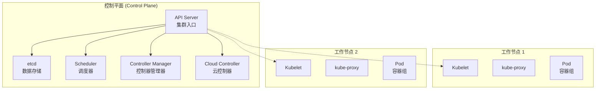
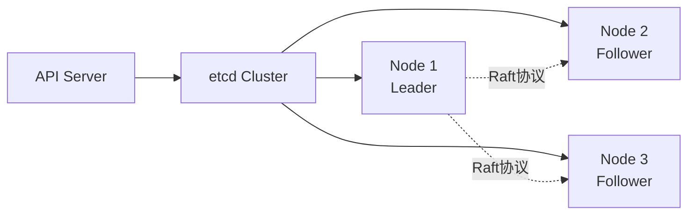
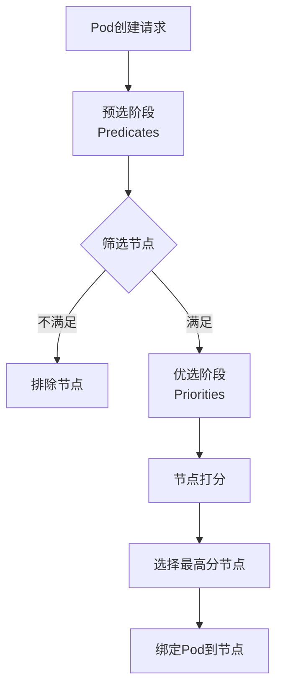
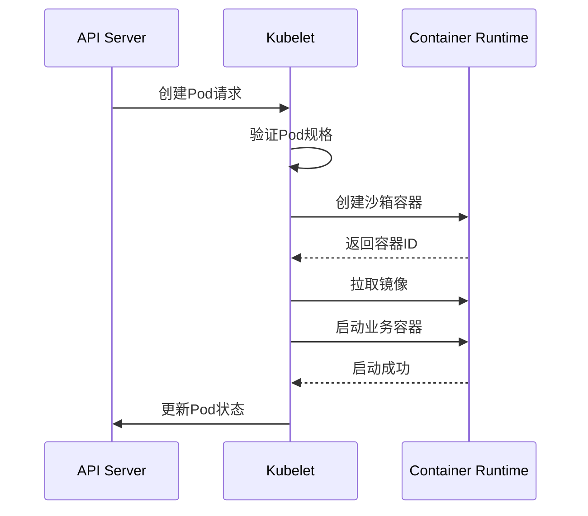
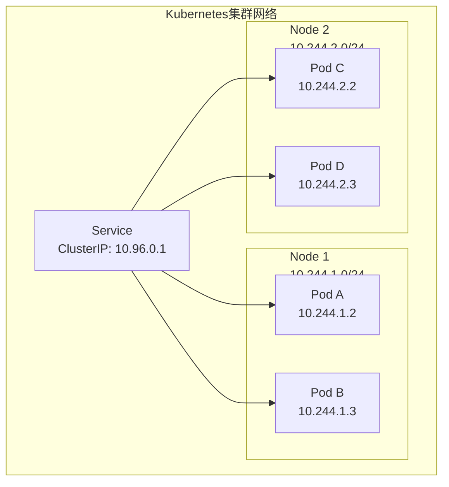

# Kubernetes架构深度分析

## 概述

Kubernetes（K8s）是Google开源的容器编排平台，用于自动化部署、扩展和管理容器化应用程序。它提供了强大的抽象层，将底层基础设施复杂性隐藏，让开发者专注于应用本身。

## 整体架构



## 控制平面组件

### API Server

作为集群的统一入口，处理所有REST请求：
- 认证（Authentication）
- 鉴权（Authorization）
- 准入控制（Admission Control）
- 资源版本控制

```yaml
# API Server 配置片段
apiVersion: v1
kind: Pod
metadata:
  name: kube-apiserver
  namespace: kube-system
spec:
  containers:
  - name: kube-apiserver
    image: k8s.gcr.io/kube-apiserver:v1.28.0
    command:
    - kube-apiserver
    - --advertise-address=192.168.1.10
    - --allow-privileged=true
    - --authorization-mode=Node,RBAC
    - --etcd-servers=https://127.0.0.1:2379
    - --service-cluster-ip-range=10.96.0.0/12
```

### etcd

分布式键值存储，保存集群所有配置数据：



### Scheduler

负责将Pod调度到合适的工作节点：

**调度流程：**



**调度策略：**

| 策略类型 | 说明 |
|---------|------|
| NodeSelector | 基于标签的简单选择 |
| Affinity/Anti-affinity | 亲和性与反亲和性 |
| Taints & Tolerations | 污点与容忍 |
| Pod Topology Spread | Pod拓扑分布 |

```yaml
# 调度配置示例
apiVersion: v1
kind: Pod
metadata:
  name: nginx
spec:
  affinity:
    nodeAffinity:
      requiredDuringSchedulingIgnoredDuringExecution:
        nodeSelectorTerms:
        - matchExpressions:
          - key: kubernetes.io/os
            operator: In
            values:
            - linux
    podAntiAffinity:
      preferredDuringSchedulingIgnoredDuringExecution:
      - weight: 100
        podAffinityTerm:
          labelSelector:
            matchExpressions:
            - key: app
              operator: In
              values:
              - nginx
          topologyKey: kubernetes.io/hostname
  containers:
  - name: nginx
    image: nginx:latest
```

### Controller Manager

维护集群期望状态的控制器集合：

| 控制器 | 职责 |
|-------|------|
| ReplicaSet | 维护Pod副本数 |
| Deployment | 管理无状态应用 |
| StatefulSet | 管理有状态应用 |
| DaemonSet | 每个节点运行一个Pod |
| Job/CronJob | 批处理任务 |

## 工作节点组件

### Kubelet

节点上的主要代理，负责：
- Pod生命周期管理
- 容器健康检查
- 资源监控
- 卷管理



### kube-proxy

实现Service的网络代理和负载均衡：

```yaml
# kube-proxy 配置
apiVersion: kubeproxy.config.k8s.io/v1alpha1
kind: KubeProxyConfiguration
mode: ipvs  # 或 iptables、userspace
ipvs:
  scheduler: rr  # 轮询算法
  minSyncPeriod: 0s
  syncPeriod: 30s
iptables:
  masqueradeAll: false
  syncPeriod: 30s
```

## 网络模型



## 存储架构

```yaml
# 持久化存储配置示例
apiVersion: v1
kind: PersistentVolume
metadata:
  name: pv-nfs
spec:
  capacity:
    storage: 10Gi
  accessModes:
    - ReadWriteMany
  persistentVolumeReclaimPolicy: Retain
  nfs:
    server: 192.168.1.100
    path: /exports/data
---
apiVersion: v1
kind: PersistentVolumeClaim
metadata:
  name: pvc-nfs
spec:
  accessModes:
    - ReadWriteMany
  resources:
    requests:
      storage: 10Gi
```

## 总结

Kubernetes通过声明式API和控制器模式，实现了应用的自动化管理。其模块化的架构设计使得各个组件可以独立扩展和升级，是云原生时代事实上的容器编排标准。
