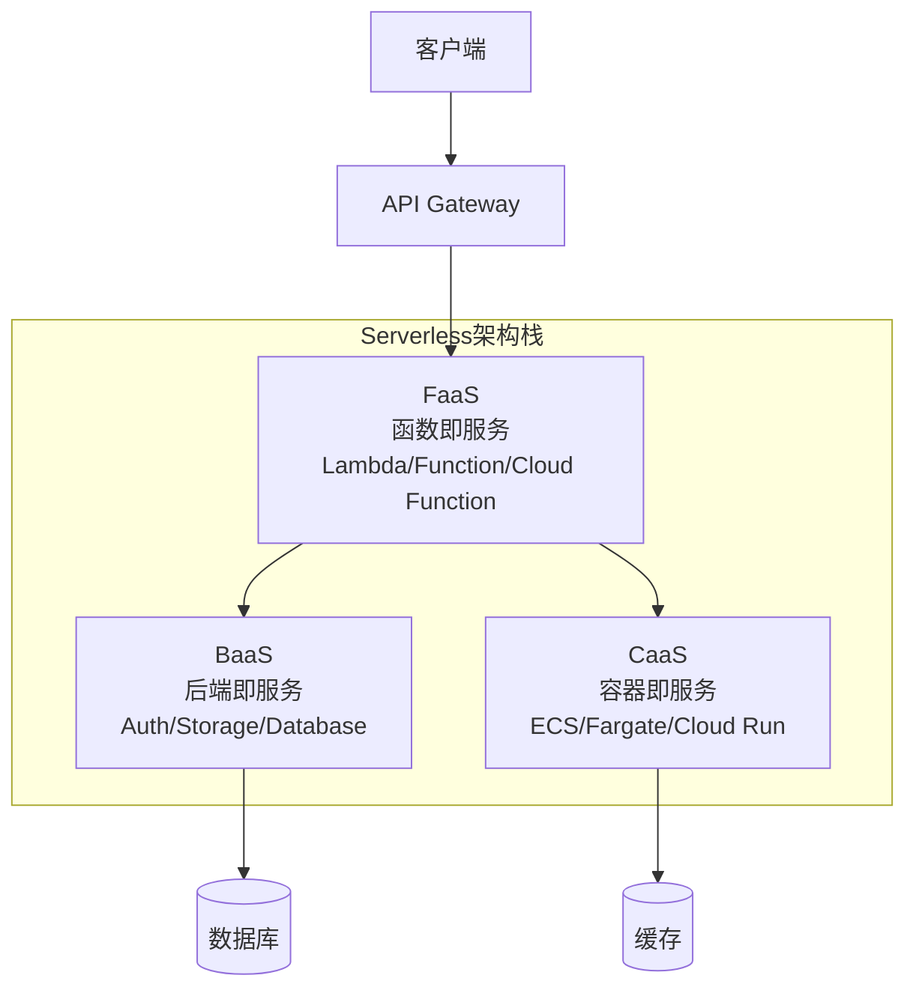
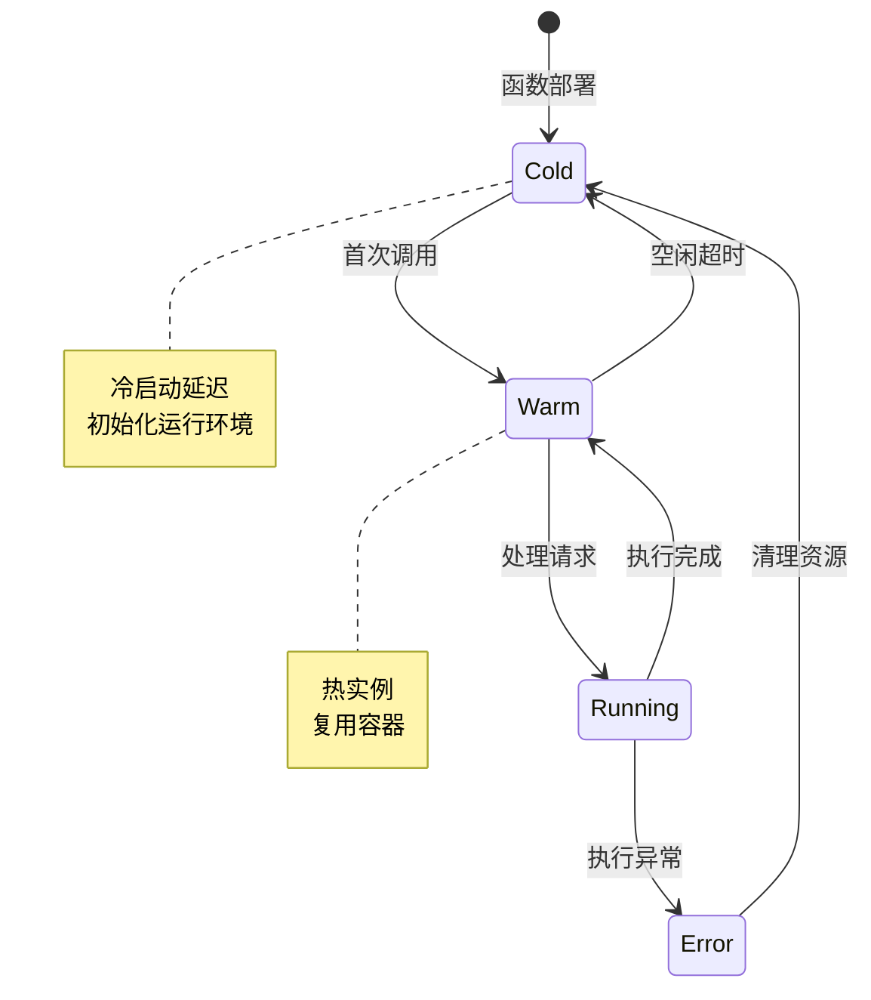
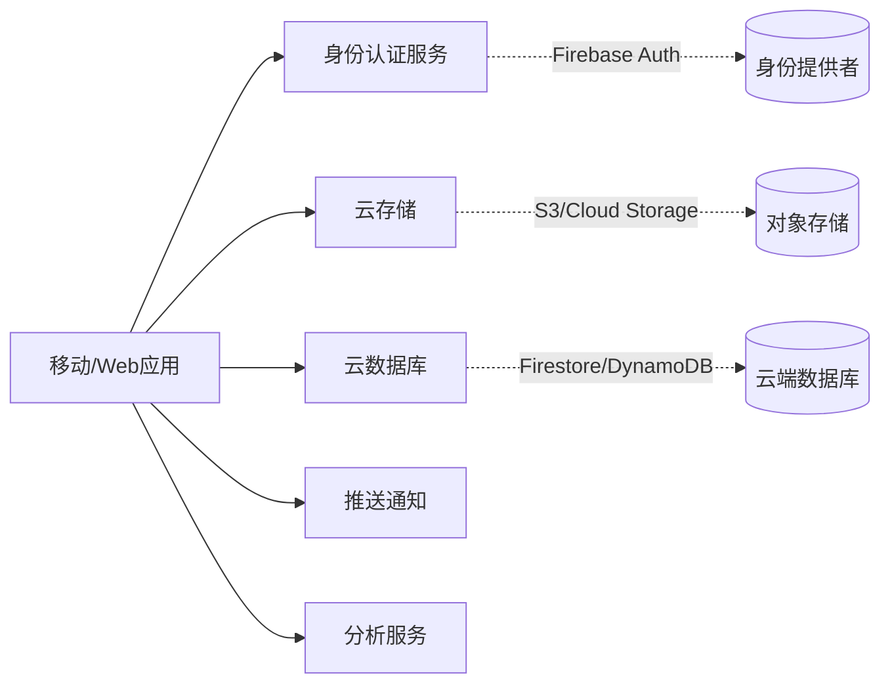
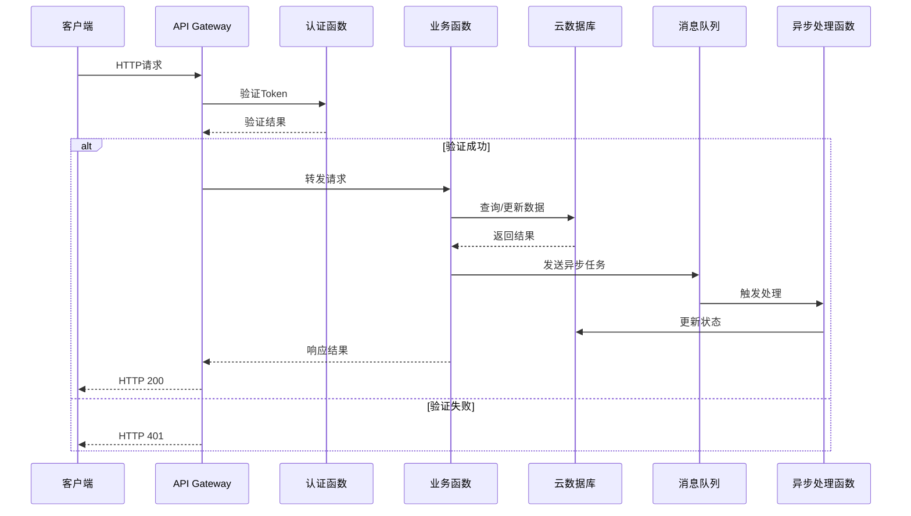

# Serverless架构

## 概述

Serverless（无服务器）架构是一种云计算执行模型，开发者无需管理服务器基础设施，只需专注于业务代码的编写。云服务提供商负责服务器的配置、扩展、维护和计费，实现真正的按需计算。

## 架构模型



## FaaS（函数即服务）

### 核心特征

| 特征 | 说明 |
|-----|------|
| 事件驱动 | 由HTTP请求、队列消息等触发 |
| 无状态 | 每次执行独立，不保留状态 |
| 自动扩缩容 | 根据负载自动调整实例数 |
| 按调用计费 | 实际执行时间计费 |
| 冷启动 | 首次调用可能有延迟 |

### 函数生命周期



### 函数代码示例

```yaml
# Azure Functions - function.json
{
  "bindings": [
    {
      "authLevel": "function",
      "type": "httpTrigger",
      "direction": "in",
      "name": "req",
      "methods": ["get", "post"]
    },
    {
      "type": "http",
      "direction": "out",
      "name": "res"
    }
  ]
}
```

```python
# Azure Functions - __init__.py
import azure.functions as func
import logging

def main(req: func.HttpRequest) -> func.HttpResponse:
    logging.info('Python HTTP trigger function processed a request.')
    
    name = req.params.get('name')
    if not name:
        try:
            req_body = req.get_json()
        except ValueError:
            pass
        else:
            name = req_body.get('name')
    
    if name:
        return func.HttpResponse(f"Hello, {name}!")
    else:
        return func.HttpResponse(
            "Please pass a name on the query string or in the request body",
            status_code=400
        )
```

## BaaS（后端即服务）



## Serverless工作流



## 典型应用场景

| 场景 | 说明 | 示例 |
|-----|------|------|
| Web后端 | API服务 | RESTful API、GraphQL |
| 数据处理 | 批量处理 | 图片处理、数据分析 |
| 事件响应 | 异步处理 | 邮件发送、通知推送 |
| IoT后端 | 设备数据处理 | 传感器数据处理 |
| 定时任务 | 计划执行 | 数据备份、报表生成 |

## 配置示例：Serverless Framework

```yaml
# serverless.yml
service: user-service

provider:
  name: aws
  runtime: nodejs18.x
  stage: ${opt:stage, 'dev'}
  region: ap-southeast-1
  memorySize: 512
  timeout: 30
  environment:
    NODE_ENV: ${self:provider.stage}
    DB_HOST: ${env:DB_HOST}
  iamRoleStatements:
    - Effect: Allow
      Action:
        - dynamodb:Query
        - dynamodb:Scan
        - dynamodb:GetItem
        - dynamodb:PutItem
      Resource: "arn:aws:dynamodb:${self:provider.region}:*:table/Users"

functions:
  getUser:
    handler: src/handlers/user.get
    events:
      - http:
          path: users/{id}
          method: get
          cors: true
          authorizer: aws_iam
  
  createUser:
    handler: src/handlers/user.create
    events:
      - http:
          path: users
          method: post
          cors: true
  
  processUserEvent:
    handler: src/handlers/user.process
    events:
      - sqs:
          arn:
            Fn::GetAtt:
              - UserQueue
              - Arn

resources:
  Resources:
    UserQueue:
      Type: AWS::SQS::Queue
      Properties:
        QueueName: ${self:service}-user-queue-${self:provider.stage}
```

## 优缺点分析

| 优势 | 挑战 |
|-----|------|
| 降低运维成本 | 冷启动延迟 |
| 自动弹性伸缩 | 供应商锁定 |
| 按需付费 | 调试困难 |
| 快速迭代 | 执行时间限制 |
| 高可用内置 | 状态管理复杂 |

## 最佳实践

1. **函数粒度**：保持函数小而专注
2. **冷启动优化**：使用预置并发、连接池复用
3. **状态外置**：使用外部存储管理状态
4. **监控告警**：配置完善的日志和监控
5. **安全策略**：最小权限原则配置IAM

## 总结

Serverless架构代表了云计算的新范式，让开发者从基础设施管理中解放出来。随着冷启动问题的改善和工具链的成熟，Serverless正在成为现代应用开发的主流选择。
