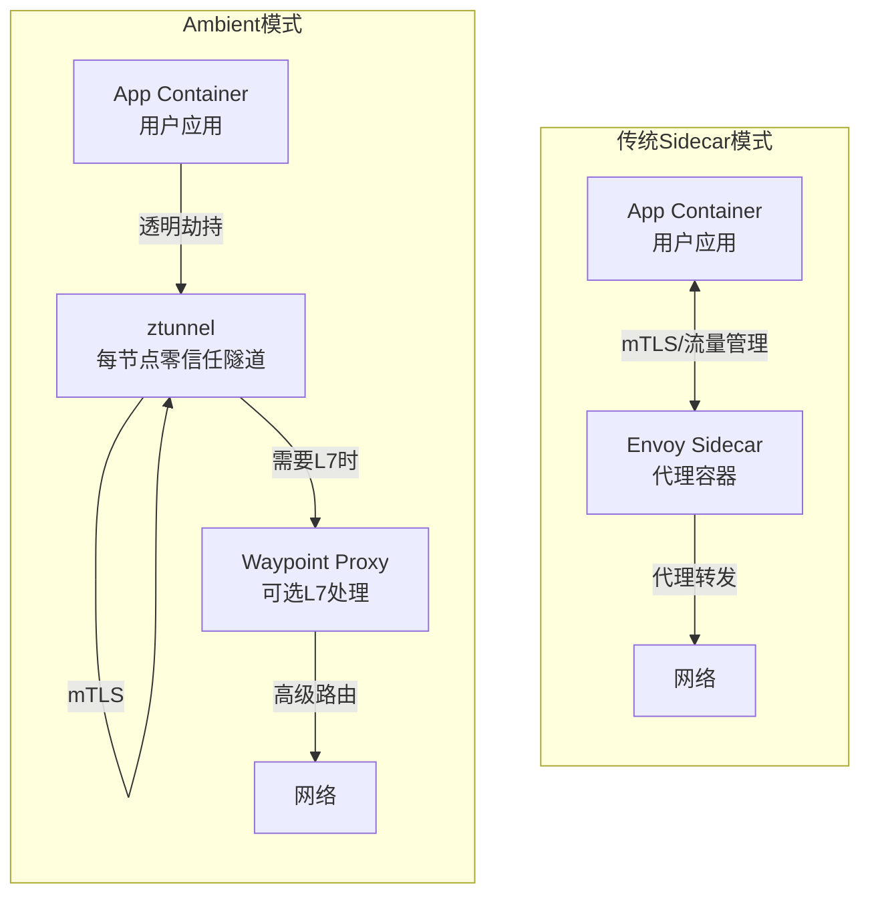
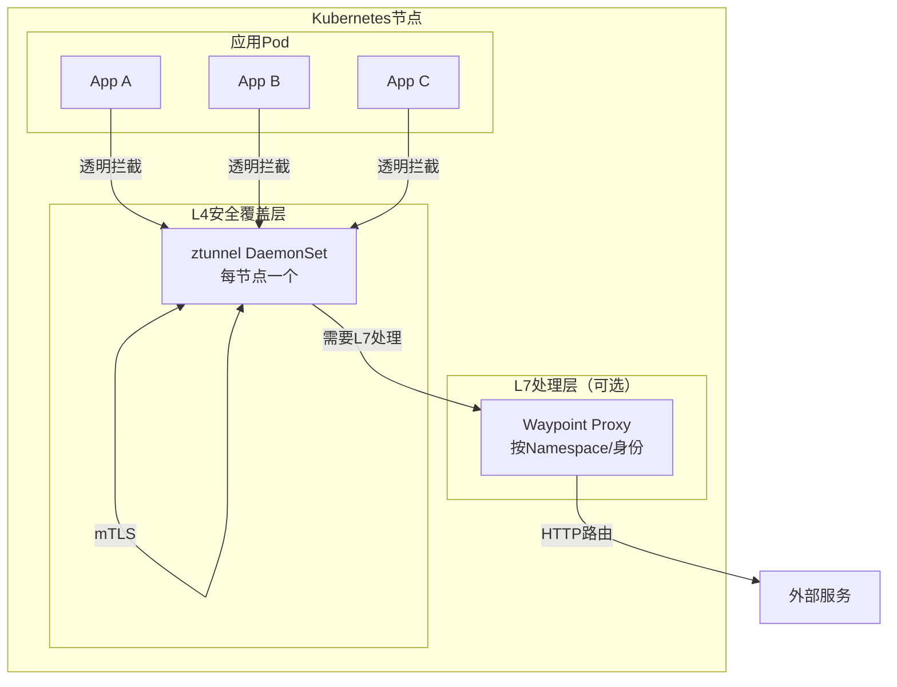
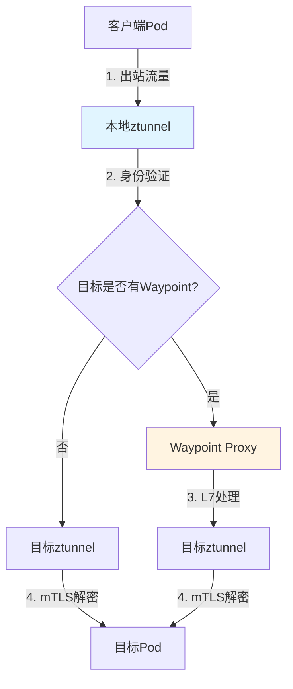
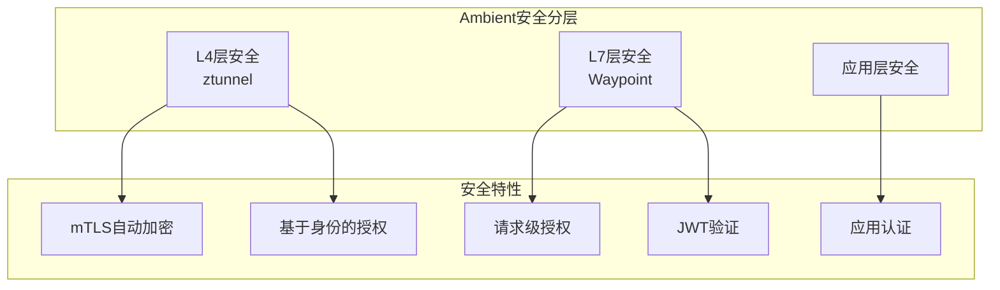
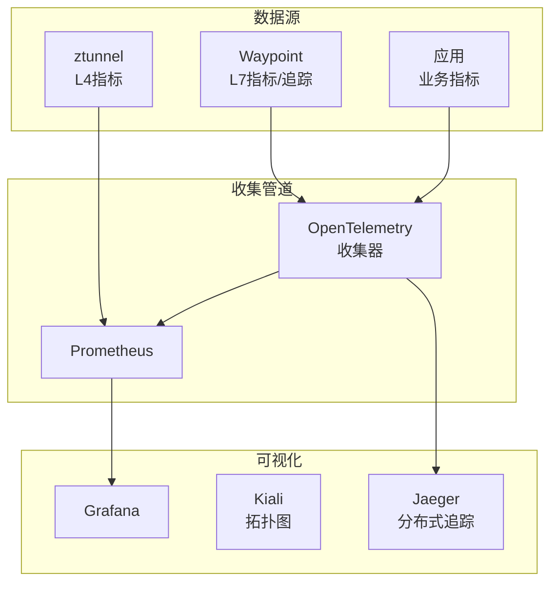
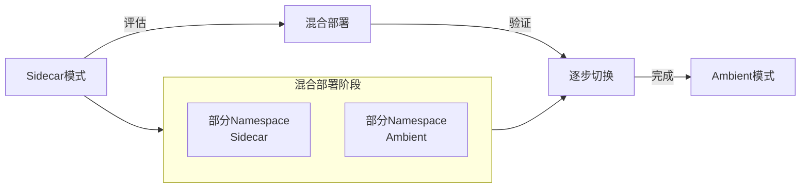

# Ambient Mesh

## 概述

Ambient Mesh是Istio推出的无Sidecar（Sidecarless）服务网格架构模式，旨在解决传统Sidecar模式带来的资源开销、生命周期管理和注入复杂性等问题。
Ambient模式将服务网格功能分层为安全覆盖层（ztunnel）和可选的L7处理层（waypoint proxy），实现了更轻量级、更灵活的服务网格部署。

## 架构演进

### Sidecar vs Ambient对比



### Ambient分层架构



## 核心组件

### ztunnel（零信任隧道）

ztunnel是每个节点上运行的DaemonSet组件，负责：

- **流量透明拦截**：通过iptables/eBPF重定向流量
- **mTLS加密**：自动服务间双向TLS认证
- **身份验证**：基于SPIFFE身份标识
- **基础L4授权**：IP和端口级别的访问控制

```yaml
# ztunnel DaemonSet配置
apiVersion: apps/v1
kind: DaemonSet
metadata:
  name: ztunnel
  namespace: istio-system
spec:
  selector:
    matchLabels:
      app: ztunnel
  template:
    metadata:
      labels:
        app: ztunnel
      annotations:
        ambient.istio.io/redirection: enabled
    spec:
      hostNetwork: true
      containers:
      - name: ztunnel
        image: gcr.io/istio-release/ztunnel:1.20.0
        args:
        - proxy
        - --pool=standard
        env:
        - name: ISTIO_META_CLUSTER_ID
          value: "Kubernetes"
        - name: ISTIO_META_NODE_NAME
          valueFrom:
            fieldRef:
              fieldPath: spec.nodeName
        resources:
          requests:
            cpu: 100m
            memory: 128Mi
          limits:
            cpu: 500m
            memory: 256Mi
        securityContext:
          privileged: true
          capabilities:
            add:
            - NET_ADMIN
            - NET_RAW
        volumeMounts:
        - name: istiod-ca-cert
          mountPath: /var/run/secrets/istio
      volumes:
      - name: istiod-ca-cert
        configMap:
          name: istio-ca-root-cert
```

### Waypoint Proxy

Waypoint Proxy提供L7流量管理能力，按需部署：

- **HTTP路由**：VirtualService规则执行
- **负载均衡**：高级负载均衡策略
- **可观测性**：指标、追踪、访问日志
- **授权策略**：基于请求内容的访问控制

```yaml
# Waypoint Proxy部署
apiVersion: gateway.networking.k8s.io/v1beta1
kind: Gateway
metadata:
  name: namespace-waypoint
  namespace: production
  annotations:
    istio.io/for-service-account: backend-sa
spec:
  gatewayClassName: istio-waypoint
  listeners:
  - name: mesh
    protocol: HTTP
    port: 15008
---
# 自动部署Waypoint的AuthorizationPolicy
apiVersion: security.istio.io/v1beta1
kind: AuthorizationPolicy
metadata:
  name: require-waypoint
  namespace: production
spec:
  action: ALLOW
  rules:
  - from:
    - source:
        principals: ["cluster.local/ns/istio-system/sa/ztunnel"]
    to:
    - operation:
        methods: ["GET", "POST"]
```

## 流量管理

### 流量路径



### 启用Ambient模式

```yaml
# 为Namespace启用Ambient模式
apiVersion: v1
kind: Namespace
metadata:
  name: production
  labels:
    istio.io/dataplane-mode: ambient
---
# 为单个Pod启用Ambient
apiVersion: v1
kind: Pod
metadata:
  name: myapp
  labels:
    app: myapp
    istio.io/dataplane-mode: ambient
spec:
  containers:
  - name: app
    image: myapp:latest
```

### 流量路由配置

```yaml
# 使用Waypoint的VirtualService
apiVersion: networking.istio.io/v1beta1
kind: VirtualService
metadata:
  name: user-service-routing
  namespace: production
spec:
  hosts:
  - user-service
  http:
  - match:
    - uri:
        prefix: /api/v2
    route:
    - destination:
        host: user-service
        subset: v2
      weight: 10
    - destination:
        host: user-service
        subset: v1
      weight: 90
    fault:
      delay:
        percentage:
          value: 0.1
        fixedDelay: 5s
  - route:
    - destination:
        host: user-service
        subset: v1
---
# DestinationRule定义子集
apiVersion: networking.istio.io/v1beta1
kind: DestinationRule
metadata:
  name: user-service-versions
  namespace: production
spec:
  host: user-service
  trafficPolicy:
    connectionPool:
      tcp:
        maxConnections: 100
    loadBalancer:
      simple: LEAST_CONN
  subsets:
  - name: v1
    labels:
      version: v1
  - name: v2
    labels:
      version: v2
```

## 安全架构

### 分层安全模型



### 授权策略

```yaml
# L4授权策略（ztunnel执行）
apiVersion: security.istio.io/v1beta1
kind: AuthorizationPolicy
metadata:
  name: l4-policy
  namespace: production
spec:
  selector:
    matchLabels:
      app: payment-service
  action: ALLOW
  rules:
  - from:
    - source:
        principals: ["cluster.local/ns/production/sa/frontend-sa"]
    to:
    - operation:
        ports: ["8080"]
---
# L7授权策略（Waypoint执行）
apiVersion: security.istio.io/v1beta1
kind: AuthorizationPolicy
metadata:
  name: l7-policy
  namespace: production
spec:
  targetRef:
    kind: Gateway
    group: gateway.networking.k8s.io
    name: namespace-waypoint
  action: ALLOW
  rules:
  - from:
    - source:
        principals: ["cluster.local/ns/production/sa/api-gateway"]
    to:
    - operation:
        methods: ["GET", "POST"]
        paths: ["/api/payments/*"]
    when:
    - key: request.auth.claims[scope]
      values: ["payments:write"]
```

## 可观测性

### 可观测性架构



### Telemetry配置

```yaml
# 配置Ambient模式下的Telemetry
apiVersion: telemetry.istio.io/v1alpha1
kind: Telemetry
metadata:
  name: ambient-metrics
  namespace: production
spec:
  metrics:
  - providers:
    - name: prometheus
    overrides:
    - match:
        metric: REQUEST_COUNT
      tagOverrides:
        destination_port:
          operation: REMOVE
  accessLogging:
  - providers:
    - name: envoy
    filter:
      expression: "response.code >= 400"
  tracing:
  - providers:
    - name: jaeger
    randomSamplingPercentage: 10.0
```

## 渐进式采用

### 从Sidecar迁移到Ambient



### 迁移策略

```yaml
# 1. 标记Ambient Namespace
apiVersion: v1
kind: Namespace
metadata:
  name: new-services
  labels:
    istio.io/dataplane-mode: ambient
    istio-injection: disabled  # 禁用Sidecar注入
---
# 2. 创建Waypoint用于需要L7的服务
apiVersion: gateway.networking.k8s.io/v1beta1
kind: Gateway
metadata:
  name: critical-service-waypoint
  namespace: new-services
spec:
  gatewayClassName: istio-waypoint
  listeners:
  - name: mesh
    protocol: HTTP
    port: 15008
---
# 3. 逐步迁移现有服务
apiVersion: apps/v1
kind: Deployment
metadata:
  name: backend-api
  namespace: existing-services
spec:
  template:
    metadata:
      annotations:
        # 移除Sidecar
        kubectl.kubernetes.io/default-container: ""
      labels:
        # 添加Ambient标签
        istio.io/dataplane-mode: ambient
```

## 生产实践建议

### 1. 资源规划

```yaml
# ztunnel资源建议
resources:
  requests:
    cpu: 100m
    memory: 128Mi
  limits:
    cpu: 2000m  # 高流量节点需要更多CPU
    memory: 512Mi

# Waypoint资源建议
resources:
  requests:
    cpu: 200m
    memory: 256Mi
  limits:
    cpu: 2000m
    memory: 1Gi
```

### 2. 高可用配置

```yaml
# Waypoint高可用
apiVersion: gateway.networking.k8s.io/v1beta1
kind: Gateway
metadata:
  name: ha-waypoint
  annotations:
    proxy.istio.io/config: |
      concurrency: 2
      terminationDrainDuration: 30s
spec:
  gatewayClassName: istio-waypoint
  listeners:
  - name: mesh
    protocol: HTTP
    port: 15008
---
# 使用HPA自动扩缩容
apiVersion: autoscaling/v2
kind: HorizontalPodAutoscaler
metadata:
  name: waypoint-hpa
spec:
  scaleTargetRef:
    apiVersion: gateway.networking.k8s.io/v1beta1
    kind: Gateway
    name: ha-waypoint
  minReplicas: 2
  maxReplicas: 10
  metrics:
  - type: Resource
    resource:
      name: cpu
      target:
        type: Utilization
        averageUtilization: 70
```

### 3. 监控检查清单

- **ztunnel指标**：连接数、TLS握手延迟、身份验证失败
- **Waypoint指标**：请求延迟、错误率、队列深度
- **控制平面**：istiod与ztunnel同步状态
- **节点健康**：iptables规则、eBPF程序加载状态

### 4. 故障排查

```bash
# 检查ztunnel状态
kubectl logs -n istio-system -l app=ztunnel

# 查看Ambient端点
istioctl x ambient status

# 检查Waypoint代理
istioctl proxy-config listener deploy/waypoint-proxy

# 调试流量问题
istioctl x ztunnel-config workload -n production
```

## 总结

Ambient Mesh代表了服务网格架构的重要演进，通过分层设计解决了Sidecar模式的固有挑战。ztunnel提供轻量级的零信任安全覆盖，Waypoint按需启用高级L7功能，使服务网格能够在更广泛的场景中高效部署。对于资源敏感或Sidecar管理复杂的环境，Ambient模式是理想的现代化服务网格解决方案。
