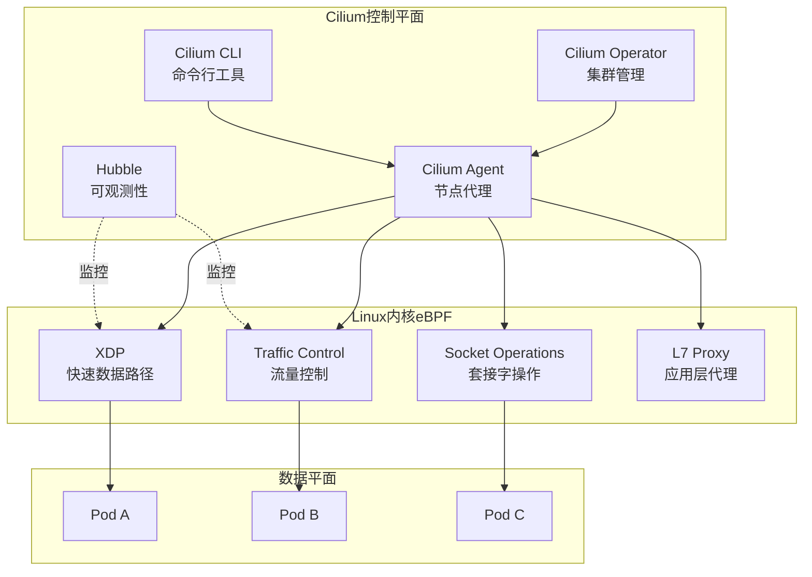
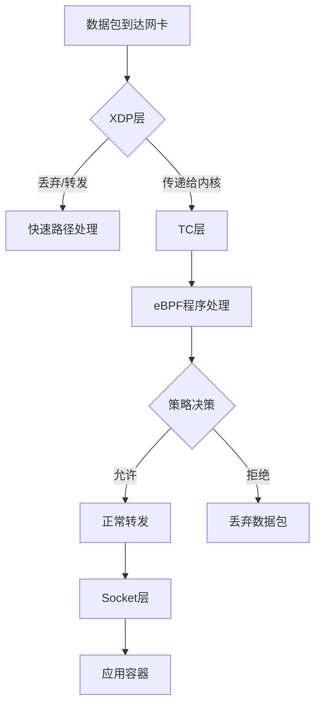
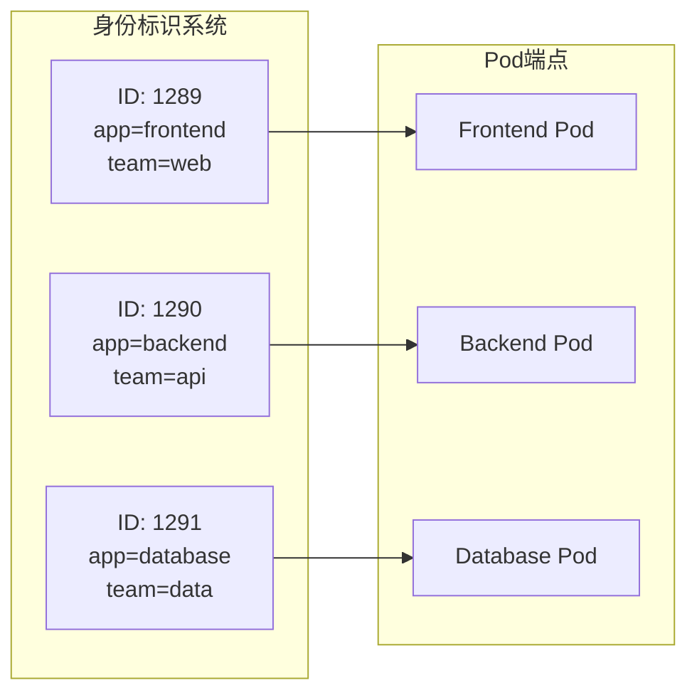
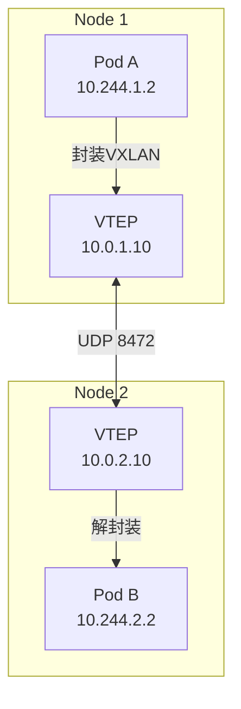
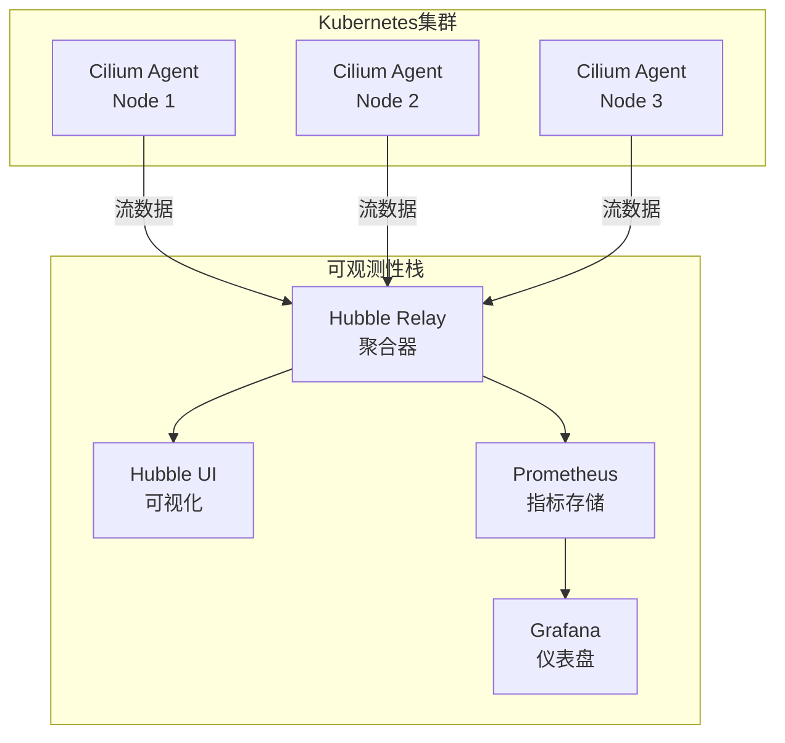
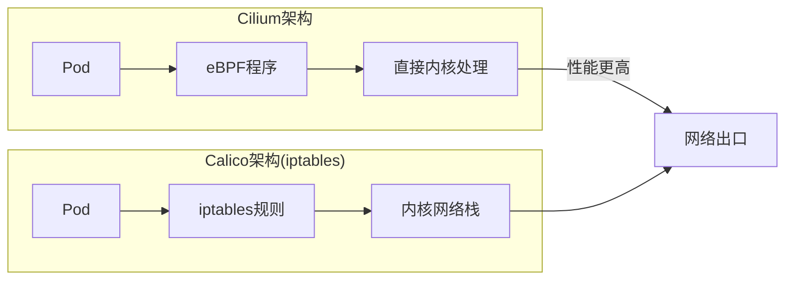

# Cilium eBPF网络

## 概述

Cilium是基于eBPF（Extended Berkeley Packet Filter）技术的Kubernetes网络方案，提供高性能的网络连接、可观测性和安全性。
与传统基于iptables的网络方案不同，Cilium利用Linux内核的eBPF能力，在数据包处理路径上实现可编程的网络逻辑，显著提升网络性能和安全性。

## 架构设计

### 整体架构



### eBPF在Cilium中的应用



## 核心组件

### Cilium Agent

每个节点上运行的守护进程，负责：

- 管理eBPF程序的加载和更新
- 维护端点（Endpoint）状态
- 执行网络策略
- 与Kubernetes API交互

```yaml
# Cilium DaemonSet配置片段
apiVersion: apps/v1
kind: DaemonSet
metadata:
  name: cilium
  namespace: kube-system
spec:
  selector:
    matchLabels:
      k8s-app: cilium
  template:
    metadata:
      labels:
        k8s-app: cilium
    spec:
      containers:
      - name: cilium-agent
        image: quay.io/cilium/cilium:v1.14.0
        command:
        - cilium-agent
        args:
        - --tunnel-protocol=vxlan
        - --enable-ipv6=true
        - --enable-l7-proxy=true
        - --enable-hubble=true
        - --hubble-listen-address=:4244
        - --enable-bpf-masquerade=true
        env:
        - name: K8S_NODE_NAME
          valueFrom:
            fieldRef:
              fieldPath: spec.nodeName
        securityContext:
          privileged: true
        volumeMounts:
        - name: bpf-maps
          mountPath: /sys/fs/bpf
        - name: cilium-run
          mountPath: /var/run/cilium
      volumes:
      - name: bpf-maps
        hostPath:
          path: /sys/fs/bpf
          type: DirectoryOrCreate
      - name: cilium-run
        hostPath:
          path: /var/run/cilium
          type: DirectoryOrCreate
```

### 端点管理

Cilium将每个Pod视为一个端点，分配唯一的身份标识：



## 网络模式

### Overlay模式（VXLAN）



### 原生路由模式

```yaml
# Cilium ConfigMap - 原生路由配置
apiVersion: v1
kind: ConfigMap
metadata:
  name: cilium-config
  namespace: kube-system
data:
  tunnel-protocol: ""  # 空表示禁用隧道
  auto-direct-node-routes: "true"
  enable-ipv4: "true"
  enable-ipv6: "false"
  cluster-pool-ipv4-cidr: "10.244.0.0/16"
  cluster-pool-ipv4-mask-size: "24"
  routing-mode: "native"
  ipv4-native-routing-cidr: "10.244.0.0/16"
  enable-bpf-masquerade: "true"
  install-no-conntrack-iptables-rules: "true"
```

## 安全策略

### 基于身份的网络策略

```yaml
# CiliumNetworkPolicy - 身份感知的微分段
apiVersion: cilium.io/v2
kind: CiliumNetworkPolicy
metadata:
  name: api-access-policy
  namespace: production
spec:
  endpointSelector:
    matchLabels:
      app: backend-api
  ingress:
  - fromEndpoints:
    - matchLabels:
        app: frontend-web
        io.kubernetes.pod.namespace: production
    toPorts:
    - ports:
      - port: "8080"
        protocol: TCP
      rules:
        http:
        - method: GET
          path: "/api/v1/users/.*"
        - method: POST
          path: "/api/v1/orders"
  - fromEndpoints:
    - matchLabels:
        app: monitoring
        io.kubernetes.pod.namespace: observability
    toPorts:
    - ports:
      - port: "9090"
        protocol: TCP
  egress:
  - toEndpoints:
    - matchLabels:
        app: postgres
        io.kubernetes.pod.namespace: database
    toPorts:
    - ports:
      - port: "5432"
        protocol: TCP
  - toFQDNs:
    - matchPattern: "*.amazonaws.com"
    toPorts:
    - ports:
      - port: "443"
        protocol: TCP
```

### L7应用层策略

```yaml
# CiliumNetworkPolicy - 应用层控制
apiVersion: cilium.io/v2
kind: CiliumNetworkPolicy
metadata:
  name: l7-restrictions
  namespace: default
spec:
  endpointSelector:
    matchLabels:
      app: payment-service
  ingress:
  - fromEndpoints:
    - matchLabels:
        app: web-frontend
    toPorts:
    - ports:
      - port: "80"
        protocol: TCP
      rules:
        http:
        - method: POST
          path: "/api/payment/process"
          headers:
          - name: X-Request-ID
            required: true
          - name: Content-Type
            value: "application/json"
        - method: GET
          path: "/api/payment/status/.*"
  - fromEntities:
    - cluster
    toPorts:
    - ports:
      - port: "9090"
        protocol: TCP
      rules:
        http:
        - method: GET
          path: "/metrics"
```

## 可观测性

### Hubble架构



### Hubble部署配置

```yaml
# Hubble Relay 部署
apiVersion: apps/v1
kind: Deployment
metadata:
  name: hubble-relay
  namespace: kube-system
spec:
  replicas: 1
  selector:
    matchLabels:
      k8s-app: hubble-relay
  template:
    metadata:
      labels:
        k8s-app: hubble-relay
    spec:
      containers:
      - name: hubble-relay
        image: quay.io/cilium/hubble-relay:v1.14.0
        command:
        - hubble-relay
        args:
        - --cluster-name=production
        - --listen-address=:4245
        - --dial-timeout=30s
        - --retry-timeout=5s
        - --sort-buffer-len-max=10000
        - --sort-buffer-drain-timeout=1s
        ports:
        - containerPort: 4245
          name: grpc
---
# Hubble UI 部署
apiVersion: apps/v1
kind: Deployment
metadata:
  name: hubble-ui
  namespace: kube-system
spec:
  replicas: 1
  selector:
    matchLabels:
      k8s-app: hubble-ui
  template:
    metadata:
      labels:
        k8s-app: hubble-ui
    spec:
      containers:
      - name: frontend
        image: quay.io/cilium/hubble-ui:v0.12.0
        ports:
        - containerPort: 8080
          name: http
      - name: backend
        image: quay.io/cilium/hubble-ui-backend:v0.12.0
        env:
        - name: EVENTS_SERVER_PORT
          value: "8090"
        - name: FLOWS_API_ADDR
          value: "hubble-relay:80"
```

## Cilium与Calico对比

| 特性 | Cilium | Calico |
|------|--------|--------|
| 数据平面 | eBPF（内核可编程） | iptables/IPVS/eBPF（可选） |
| 性能 | 极高（绕过iptables） | 高（eBPF模式接近Cilium） |
| 安全策略 | 身份感知 + L7 | 网络层为主 |
| 可观测性 | Hubble（流级别） | Flow日志 |
| 服务网格 | 内置L7代理 | 需配合Istio |
| 资源占用 | 较低 | 中等 |
| 学习曲线 | 陡峭 | 平缓 |



## 生产实践建议

### 1. 内核版本要求

- **最低要求**: Linux 4.19
- **推荐版本**: Linux 5.10+（完整功能支持）
- **XDP驱动模式**: 需要网卡支持

### 2. 资源配置

```yaml
# Cilium Agent资源限制
resources:
  requests:
    cpu: 100m
    memory: 256Mi
  limits:
    cpu: 1000m
    memory: 1Gi
```

### 3. 升级策略

```bash
# 使用Cilium CLI进行零停机升级
cilium upgrade --version 1.14.0

# 验证升级状态
cilium status --wait
```

### 4. 监控指标

关键指标监控：

- `cilium_endpoint_count`: 端点数量
- `cilium_drop_count_total`: 丢弃数据包统计
- `cilium_forward_count_total`: 转发统计
- `cilium_policy_l7_total`: L7策略处理统计
- `cilium_bpf_maps_virtual_memory_size`: BPF内存使用

### 5. 故障排查

```bash
# 检查端点状态
cilium endpoint list

# 查看BPF程序
cilium bpf endpoint list

# 测试网络连通性
cilium connectivity test

# 查看策略映射
cilium policy get

# BPF程序调试
cilium bpf metrics list
```

## 总结

Cilium利用eBPF技术为Kubernetes带来了革命性的网络、安全和可观测性能力。相比传统的iptables方案，eBPF提供了更高的性能、更强的安全策略控制能力和更细粒度的可观测性。虽然对内核版本有较高要求，但对于追求高性能和安全合规的企业级Kubernetes集群，Cilium是首选的网络方案。
