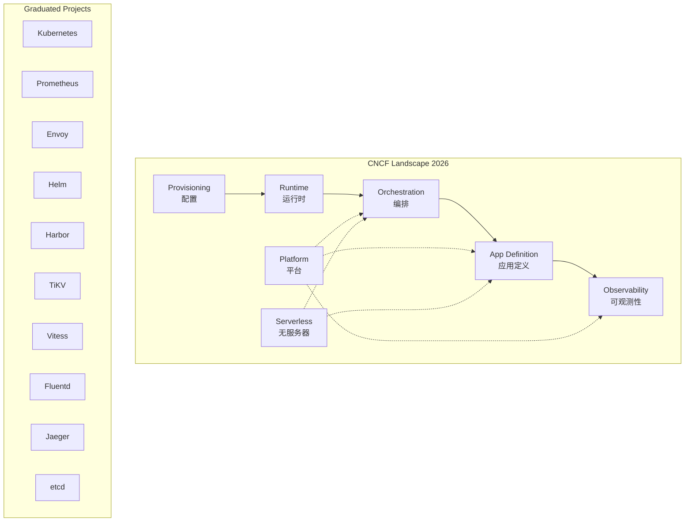

# CNCF云原生全景图 专题文档

**文档版本**：v1.0
**创建时间**：2026年
**最后更新**：2026年
**状态**：✅ 已完成

---

## 📋 执行摘要

CNCF（Cloud Native Computing Foundation）云原生全景图是云原生技术生态的权威参考，涵盖基础设施、运行时、编排调度、应用定义、可观测性、安全等10大领域。截至2026年，CNCF已托管超过150+开源项目，其中毕业项目23个、孵化项目37个、沙盒项目100+，构成了完整的云原生技术体系。

---

## 一、核心概念

### 1.1 CNCF简介

**成立背景**：
- 2015年由Linux基金会创立
- 初始托管项目：Kubernetes（Google捐赠）
- 使命：使云原生计算具有普遍性和可持续性

**治理模型**：
- **Technical Oversight Committee (TOC)**：技术监督委员会
- **End User Community**：最终用户社区
- **Project Lifecycle**：项目生命周期管理

### 1.2 项目成熟度等级

#### Graduated（毕业项目）

**标准**：
- 来自至少2个组织的贡献者
- 有明确的中立所有权
- 采用CNCF行为准则
- 达到核心基础设施计划(CII)最佳实践徽章
- 有公开的路线图和版本发布
- 被多个最终用户生产使用
- 通过TOC评估投票

**代表性项目**：Kubernetes、Prometheus、Envoy、Helm

#### Incubating（孵化项目）

**标准**：
- 有文件证明的生产使用
- 有健康的提交者群体
- 展示持续增长
- 满足Sandbox要求

**代表性项目**：Argo、Cilium、Rook、etcd

#### Sandbox（沙盒项目）

**标准**：
- 有2-3个TOC赞助人
- 符合CNCF范围
- 采用CNCF行为准则

**目标**：早期实验性项目，验证创新想法

### 1.3 全景图分类

```
CNCF Landscape
├── 1. Provisioning（配置）
├── 2. Runtime（运行时）
├── 3. Orchestration & Management（编排管理）
├── 4. App Definition & Development（应用定义与开发）
├── 5. Observability & Analysis（可观测性与分析）
├── 6. Platform（平台）
└── 7. Serverless（无服务器）
```

---

## 二、技术细节

### 2.1 全景图架构



### 2.2 各分类详解

#### 1. Provisioning（配置层）

**Automation & Configuration（自动化与配置）**：
| 项目 | 状态 | 说明 |
|------|------|------|
| **Terraform** | 非CNCF | 基础设施即代码标准工具 |
| **Pulumi** | 非CNCF | 编程语言定义基础设施 |
| **Ansible** | 非CNCF | 配置管理和应用部署 |
| **Crossplane** | Incubating | Kubernetes控制基础设施 |
| **KubeVela** | Incubating | 应用交付平台 |

**Container Registry（容器仓库）**：
| 项目 | 状态 | 说明 |
|------|------|------|
| **Harbor** | Graduated | 企业级容器镜像仓库 |
| **Dragonfly** | Incubating | P2P镜像分发系统 |
| **Distribution** | Sandbox | Docker Registry开源版 |

**Security & Compliance（安全合规）**：
| 项目 | 状态 | 说明 |
|------|------|------|
| **Falco** | Graduated | 云原生运行时安全 |
| **Trivy** | 非CNCF | 容器镜像安全扫描 |
| **OPA** | Incubating | 通用策略引擎 |
| **Notary** | Incubating | 镜像签名验证 |

#### 2. Runtime（运行时层）

**Cloud Native Storage（云原生存储）**：
| 项目 | 状态 | 说明 |
|------|------|------|
| **Rook** | Graduated | 云原生存存编排 |
| **Longhorn** | Incubating | K8s轻量级块存储 |
| **CubeFS** | Incubating | 分布式文件系统 |
| **OpenEBS** | Sandbox | K8s原生存储 |

**Container Runtime（容器运行时）**：
| 项目 | 状态 | 说明 |
|------|------|------|
| **containerd** | Graduated | 工业级容器运行时 |
| **CRI-O** | Incubating | K8s专用轻量运行时 |
| **Kata Containers** | Sandbox | 安全容器（VM级别） |
| **gVisor** | Sandbox | 用户空间内核容器 |

**Cloud Native Network（云原生网络）**：
| 项目 | 状态 | 说明 |
|------|------|------|
| **Cilium** | Graduated | eBPF驱动的网络方案 |
| **Flannel** | 非CNCF | 简单Overlay网络 |
| **Calico** | 非CNCF | BGP路由网络方案 |
| **Antrea** | Sandbox | VMware开源CNI |

#### 3. Orchestration & Management（编排管理）

**Scheduling & Orchestration（调度编排）**：
| 项目 | 状态 | 说明 |
|------|------|------|
| **Kubernetes** | Graduated | 容器编排标准 |
| **Volcano** | Incubating | 批处理作业调度 |
| **Karmada** | Incubating | 多云多集群管理 |

**Service Mesh（服务网格）**：
| 项目 | 状态 | 说明 |
|------|------|------|
| **Istio** | 非CNCF | 最流行的Service Mesh |
| **Linkerd** | Graduated | 轻量级Service Mesh |
| **Consul** | 非CNCF | HashiCorp服务网格 |

**API Gateway（API网关）**：
| 项目 | 状态 | 说明 |
|------|------|------|
| **Envoy** | Graduated | 云原生代理标准 |
| **Kong** | 非CNCF | 高性能API网关 |
| **Traefik** | 非CNCF | 云原生反向代理 |

#### 4. App Definition & Development（应用定义与开发）

**Continuous Integration & Delivery（CI/CD）**：
| 项目 | 状态 | 说明 |
|------|------|------|
| **Argo** | Graduated | K8s原生GitOps套件 |
| **Flux** | Graduated | GitOps工具 |
| **Keptn** | Incubating | 应用生命周期编排 |
| **Flagger** | Sandbox | 渐进式交付 |

**Database（云原生数据库）**：
| 项目 | 状态 | 说明 |
|------|------|------|
| **TiKV** | Graduated | 分布式KV存储 |
| **Vitess** | Graduated | MySQL水平扩展方案 |
| **SchemaHero** | Sandbox | 数据库Schema管理 |

**Streaming & Messaging（流处理与消息）**：
| 项目 | 状态 | 说明 |
|------|------|------|
| **NATS** | Incubating | 云原生消息系统 |
| **Strimzi** | Sandbox | K8s上的Kafka |
| **KubeMQ** | Sandbox | K8s原生消息队列 |

#### 5. Observability & Analysis（可观测性）

**Monitoring（监控）**：
| 项目 | 状态 | 说明 |
|------|------|------|
| **Prometheus** | Graduated | 时序数据库和监控系统 |
| **Thanos** | Incubating | Prometheus长期存储 |
| **Cortex** | Incubating | 多租户Prometheus |
| **VictoriaMetrics** | 非CNCF | 高性能时序数据库 |

**Logging（日志）**：
| 项目 | 状态 | 说明 |
|------|------|------|
| **Fluentd** | Graduated | 统一日志收集 |
| **Loki** | 非CNCF | Grafana日志系统 |

**Tracing（链路追踪）**：
| 项目 | 状态 | 说明 |
|------|------|------|
| **Jaeger** | Graduated | 分布式追踪系统 |
| **OpenTelemetry** | Incubating | 可观测性标准 |
| **Tempo** | 非CNCF | Grafana追踪系统 |

**Chaos Engineering（混沌工程）**：
| 项目 | 状态 | 说明 |
|------|------|------|
| **Litmus** | Incubating | 云原生混沌工程 |
| **Chaos Mesh** | Incubating | K8s混沌工程平台 |

---

## 三、毕业项目详解

### 3.1 毕业项目全景

截至2026年，CNCF共有23个毕业项目：

| 项目 | 领域 | 核心功能 | 主要贡献者 |
|------|------|----------|-----------|
| **Kubernetes** | 编排 | 容器编排 | Google, Red Hat |
| **Prometheus** | 监控 | 时序监控 | SoundCloud, Red Hat |
| **Envoy** | 网络代理 | 云原生代理 | Lyft, Google |
| **CoreDNS** | 网络 | DNS服务 | Google, Infoblox |
| **containerd** | 运行时 | 容器运行时 | Docker, Google |
| **Fluentd** | 日志 | 日志收集 | Treasure Data |
| **Jaeger** | 追踪 | 分布式追踪 | Uber, Red Hat |
| **Vitess** | 数据库 | MySQL扩展 | YouTube, PlanetScale |
| **TUF** | 安全 | 安全更新框架 | NYU, U Washington |
| **Helm** | 应用定义 | K8s包管理 | Microsoft, Google |
| **Harbor** | 仓库 | 镜像仓库 | VMware |
| **TiKV** | 数据库 | 分布式KV | PingCAP |
| **Rook** | 存储 | 存储编排 | Red Hat |
| **etcd** | 数据库 | 分布式KV | Red Hat, Google |
| **Open Policy Agent** | 安全 | 策略引擎 | Styra |
| **Cilium** | 网络 | eBPF网络 | Isovalent |
| **Linkerd** | Service Mesh | 轻量网格 | Buoyant |
| **Argo** | CI/CD | GitOps套件 | Intuit |
| **Flux** | CI/CD | GitOps工具 | Weaveworks |
| **Falco** | 安全 | 运行时安全 | Sysdig |
| **Dragonfly** | 仓库 | P2P分发 | Alibaba |
| **KubeVirt** | 虚拟化 | K8s虚拟机 | Red Hat |
| **KubeEdge** | 边缘计算 | 边缘K8s | Huawei |

### 3.2 关键技术趋势

#### eBPF革命

**技术原理**：
```
eBPF (Extended Berkeley Packet Filter)
├── 内核可编程
│   ├── 网络包过滤
│   ├── 系统调用追踪
│   └── 性能分析
├── 安全沙箱
│   ├── 验证器保证安全
│   └── JIT编译执行
└── 应用场景
    ├── Cilium (网络)
    ├── Falco (安全)
    ├── Pixie (可观测性)
    └── Tetragon (运行时安全)
```

**代表项目**：
- **Cilium**：基于eBPF的CNI，替代iptables
- **Falco**：eBPF驱动的运行时威胁检测
- **Tetragon**：进程级安全可观测性

#### GitOps成为标准

**演进路径**：
```
传统部署 → CI/CD → GitOps
    │         │         │
    ▼         ▼         ▼
手动kubectl  Jenkins    ArgoCD/Flux
           推送部署    拉取同步
```

**Argo vs Flux对比**：

| 特性 | ArgoCD | Flux |
|------|--------|------|
| UI界面 | 完整Web UI | 仅CLI |
| 多集群 | 原生支持 | 需配置 |
| 应用定义 | Application CRD | Kustomization/HelmRelease |
| 渐进交付 | Argo Rollouts | Flagger集成 |
| 工作流引擎 | Argo Workflows | 无 |
| 镜像更新 | 需Argo Image Updater | 原生ImagePolicy |

#### 服务网格演进

**Istio架构简化**：
```
Istio 1.0          →  Istio 1.20+
├── Envoy Sidecar  →  Sidecarless (Ambient Mesh)
├── Mixer          →  Wasm扩展
└── 复杂配置       →  Gateway API标准
```

**Ambient Mesh新模式**：
- 无Sidecar部署
- zTunnel（L4节点代理）
- Waypoint Proxy（L7按需启用）
- 资源占用降低40%+

---

## 四、实践指南

### 4.1 技术选型决策树

```
云原生技术选型
│
├── 容器运行时
│   ├── 生产环境 → containerd (标准)
│   ├── 安全需求高 → Kata Containers/gVisor
│   └── 轻量级需求 → CRI-O
│
├── 网络方案
│   ├── 高性能+eBPF → Cilium
│   ├── 简单稳定 → Calico
│   ├── 快速部署 → Flannel
│   └── Windows节点 → Calico/Flannel
│
├── 服务网格
│   ├── 功能丰富 → Istio
│   ├── 轻量简单 → Linkerd
│   ├── 多语言SDK → Consul
│   └── 成本敏感 → Cilium Service Mesh
│
├── 可观测性
│   ├── Metrics → Prometheus + Thanos/Cortex
│   ├── Logs → Loki/Fluentd
│   ├── Traces → Jaeger/Tempo
│   └── 统一标准 → OpenTelemetry
│
├── GitOps
│   ├── 需要UI → ArgoCD
│   ├── 纯CLI → Flux
│   └── 需要工作流 → Argo Workflows
│
└── 存储
    ├── 块存储 → Rook + Ceph
    ├── 文件存储 → Rook + CephFS / CubeFS
    ├── 对象存储 → Rook + Ceph / MinIO
    └── 轻量级 → Longhorn
```

### 4.2 云原生成熟度模型

```
Level 1: 容器化
├── 应用容器化
├── 镜像仓库搭建
└── 基础K8s集群

Level 2: 可编排
├── 声明式部署
├── 自动扩缩容
├── 配置管理
└── 健康检查

Level 3: 可观测
├── 统一监控
├── 日志聚合
├── 链路追踪
└── 告警体系

Level 4: 弹性
├── 多可用区部署
├── 自动故障转移
├── 混沌工程
└── 容量规划

Level 5: 自动化
├── GitOps工作流
├── 渐进式交付
├── 自动回滚
└── 策略即代码
```

### 4.3 最佳实践

**项目选择原则**：

1. **成熟度优先**：生产环境优先选择Graduated项目
2. **社区活跃度**：查看GitHub Star、贡献者数量、发布频率
3. **企业背书**：关注是否有大型企业生产使用案例
4. **兼容性**：评估与现有技术栈的集成难度
5. **退出成本**：考虑未来迁移或替换的难易程度

**CNCF项目评估清单**：

```yaml
技术评估:
  - 项目成熟度: Graduated/Incubating/Sandbox
  - 许可证: Apache 2.0 / MIT 等开源许可
  - 供应商锁定: 是否依赖特定云厂商
  
社区评估:
  - GitHub Stars: > 1000
  - 贡献者数: > 20
  - 发布频率: 至少每季度
  - Issue响应: < 7天
  
生产评估:
  - 生产案例: 有公开的生产使用证明
  - 支持服务: 商业支持可用性
  - 培训资源: 文档、教程、认证
```

### 4.4 常见问题

**Q1: 如何选择Kubernetes网络插件？**

A:
- **Cilium**：需要eBPF高级功能（网络策略可观测、服务网格）
- **Calico**：大规模集群（5000+节点）、BGP路由需求
- **Flannel**：小规模快速部署、简单Overlay网络
- **Antrea**：VMware生态、NSX集成

**Q2: 新兴项目（Sandbox）能否用于生产？**

A: 一般不建议，但可评估：
1. 项目是否有明确的产品化路径
2. 背后是否有公司长期支持
3. 团队是否有能力自行维护
4. 是否是解决特定问题的唯一方案

**Q3: 如何跟踪CNCF项目动态？**

A:
1. 订阅CNCF周报和博客
2. 关注CNCF GitHub仓库
3. 参加KubeCon/CloudNativeCon大会
4. 加入相关项目的Slack社区

**Q4: 非CNCF项目是否值得使用？**

A: 许多优秀项目不在CNCF，如：
- **Istio**：Service Mesh领导者
- **Loki**：Grafana日志解决方案
- **Traefik**：云原生反向代理
- **Nginx Ingress**：最流行的Ingress Controller

评估标准与CNCF项目相同，关注社区活跃度和生产案例。

---

## 五、形式化分析

### 5.1 云原生技术栈依赖图

```
Infrastructure (基础设施)
    ↓
├── Compute (计算)
│   ├── VM / Bare Metal
│   └── Kubernetes (Graduated)
│
├── Network (网络)
│   ├── CNI: Cilium / Calico
│   ├── Service Mesh: Istio / Linkerd
│   └── Ingress: Envoy / NGINX
│
└── Storage (存储)
    ├── CSI: Rook / OpenEBS
    └── Object: MinIO

Platform Layer (平台层)
    ↓
├── Runtime (运行时)
│   └── containerd (Graduated)
│
├── Orchestration (编排)
│   └── Kubernetes (Graduated)
│
└── Application (应用)
    ├── Definition: Helm / Kustomize
    ├── Delivery: ArgoCD / Flux
    └── Database: TiKV / Vitess

Operations Layer (运维层)
    ↓
├── Observability (可观测性)
│   ├── Metrics: Prometheus
│   ├── Logs: Fluentd / Loki
│   └── Traces: Jaeger / Tempo
│
├── Security (安全)
│   ├── Falco (运行时)
│   └── OPA (策略)
│
└── Chaos (混沌工程)
    └── Chaos Mesh / Litmus
```

### 5.2 项目成熟度状态机

```
            TOC Sponsor
Sandbox ───────────────► Incubating
   ▲                         │
   │                         │ Production Use
   │                         ▼
   │                    Graduated
   │                         │
   └─────────────────────────┘
          Continuous
```

---

## 六、与其他主题的关联

### 6.1 上游依赖

- [Linux容器技术](../container/Linux容器技术.md)
- [微服务架构设计](../microservices/微服务架构设计.md)
- [DevOps实践](../devops/DevOps实践.md)

### 6.2 下游应用

- [Kubernetes多集群管理](Kubernetes多集群管理.md)
- [Service Mesh实践](ServiceMesh实践.md)
- [GitOps实施指南](../devops/GitOps实施指南.md)

### 6.3 相关概念

| 概念 | 关系 | 说明 |
|------|------|------|
| FinOps | 交叉领域 | 云原生成本管理实践 |
| AIOps | 演进方向 | 基于可观测性的智能运维 |
| WebAssembly | 新兴技术 | 云原生运行时的新选择 |
| 边缘计算 | 扩展场景 | KubeEdge等边缘项目 |

---

## 七、参考资源

### 7.1 官方资源

1. [CNCF Landscape](https://landscape.cncf.io/) - 交互式全景图
2. [CNCF Project List](https://www.cncf.io/projects/) - 项目完整列表
3. [CNCF Annual Report](https://www.cncf.io/reports/) - 年度报告

### 7.2 开源项目

1. [cncf/landscape](https://github.com/cncf/landscape) - 全景图源数据
2. [cncf/toc](https://github.com/cncf/toc) - TOC治理文档
3. [cncf/mentoring](https://github.com/cncf/mentoring) - 社区导师计划

### 7.3 学习资料

1. [KubeCon + CloudNativeCon](https://events.linuxfoundation.org/) - 年度大会
2. [Cloud Native Glossary](https://glossary.cncf.io/) - 云原生术语表
3. [CNCF Webinars](https://www.cncf.io/webinars/) - 在线研讨会

### 7.4 相关文档

- [Kubernetes设计原理](Kubernetes设计原理.md)
- [云原生安全最佳实践](云原生安全最佳实践.md)
- [Service Mesh对比分析](ServiceMesh对比分析.md)

---

**维护者**：项目团队
**最后更新**：2026年
