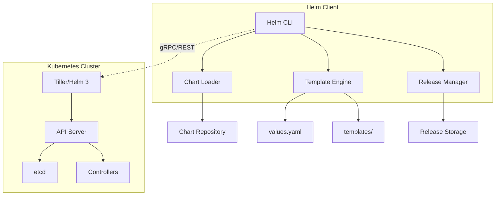
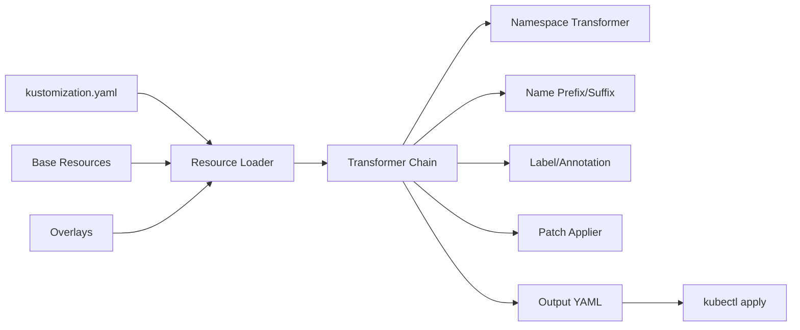

# Helm与Kustomize 专题文档

**文档版本**：v1.0
**创建时间**：2026年
**最后更新**：2026年
**状态**：✅ 已完成

---

## 📋 执行摘要

Helm和Kustomize是Kubernetes生态系统中两大主流配置管理工具：Helm作为包管理器提供版本化、可复用的Chart机制；Kustomize作为原生配置覆盖工具，通过声明式方式管理环境差异。两者结合GitOps实践，构成了现代云原生应用部署的完整解决方案。

---

## 一、核心概念

### 1.1 定义与原理

#### Helm - Kubernetes包管理器

Helm是Kubernetes的包管理工具，将应用打包为Chart（图表），实现应用的版本管理、依赖管理和可复用部署。

**核心组件**：

- **Chart**：Helm包，包含一组Kubernetes资源的模板和配置
- **Release**：Chart在Kubernetes集群中的运行实例
- **Repository**：Chart的存储和分发仓库
- **Template**：Go模板引擎驱动的YAML生成机制

**工作原理**：

1. 用户定义`values.yaml`提供配置值
2. Helm使用Go模板引擎渲染`templates/`下的YAML文件
3. 生成完整的Kubernetes Manifest并应用到集群
4. 维护Release历史，支持升级、回滚操作

#### Kustomize - 原生配置管理

Kustomize是Kubernetes原生的配置定制工具，通过overlay机制管理不同环境的配置差异，无需模板语法。

**核心概念**：

- **Base**：基础配置，包含通用的Kubernetes资源定义
- **Overlay**：环境特定配置，通过patch方式修改Base
- **Resource**：引用的Kubernetes YAML文件
- **Patch**：对资源的局部修改（JSON Patch或Strategic Merge）

**工作原理**：

1. 定义Base层的基础资源配置
2. 在Overlay层指定要修改的字段
3. Kustomize执行配置合并和覆盖
4. 输出最终可用的Kubernetes Manifest

### 1.2 关键特性

**Helm特性**：

- **包管理**：版本化、签名验证、依赖管理
- **模板引擎**：Go模板支持条件、循环、函数
- **Hooks机制**：预安装/后安装钩子支持复杂部署流程
- **Release管理**：版本历史、原子性升级、一键回滚
- **生态丰富**：Artifact Hub上数万+可用Chart

**Kustomize特性**：

- **原生集成**：kubectl内置，无需额外工具
- **无模板**：纯YAML，易于理解和调试
- **层叠覆盖**：Base+Overlay模式清晰管理多环境
- **配置转换**：支持namePrefix、namespace、labels统一转换
- **Secret/ConfigMap生成**：内置生成器保障配置一致性

### 1.3 适用场景

| 场景 | Helm适用性 | Kustomize适用性 | 说明 |
|------|-----------|----------------|------|
| 第三方应用部署 | ⭐⭐⭐⭐⭐ | ⭐⭐ | Helm Chart生态丰富，一键部署复杂应用 |
| 多环境配置管理 | ⭐⭐⭐⭐ | ⭐⭐⭐⭐⭐ | Kustomize overlay模式更适合环境差异化 |
| 微服务自研应用 | ⭐⭐⭐ | ⭐⭐⭐⭐⭐ | 自研应用配置变更频繁，Kustomize更易维护 |
| 复杂模板逻辑 | ⭐⭐⭐⭐⭐ | ⭐ | Helm模板引擎支持复杂逻辑和计算 |
| GitOps工作流 | ⭐⭐⭐⭐ | ⭐⭐⭐⭐⭐ | Kustomize与Flux/ArgoCD原生集成更佳 |
| 版本回滚需求 | ⭐⭐⭐⭐⭐ | ⭐⭐⭐ | Helm内置Release历史管理 |

---

## 二、技术细节

### 2.1 架构设计

#### Helm架构



**Helm 3重大变更**：移除Tiller服务端组件，直接通过KubeConfig访问API Server，安全性大幅提升。

#### Kustomize架构



### 2.2 Chart开发详解

#### Chart目录结构

```
mychart/
├── Chart.yaml          # Chart元数据
├── values.yaml         # 默认值
├── values.schema.json  # 值校验Schema
├── charts/             # 依赖Chart
├── templates/          # 模板文件
│   ├── _helpers.tpl    # 辅助模板
│   ├── deployment.yaml
│   ├── service.yaml
│   ├── ingress.yaml
│   └── NOTES.txt       # 安装后说明
├── templates/tests/    # 测试Pod模板
└── README.md
```

#### Chart.yaml核心字段

```yaml
apiVersion: v2           # v2对应Helm 3
name: myapp
description: A Helm chart for Kubernetes
type: application        # application/library
version: 1.2.3           # Chart版本
appVersion: "2.0.0"      # 应用版本
kubeVersion: ">=1.19.0"  # K8s版本要求
dependencies:
  - name: postgresql
    version: "12.x.x"
    repository: "https://charts.bitnami.com/bitnami"
    condition: postgresql.enabled
    alias: db
```

#### 模板开发最佳实践

```yaml
# templates/_helpers.tpl
{{/* 生成完整名称 */}}
{{- define "myapp.fullname" -}}
{{- .Release.Name | trunc 63 | trimSuffix "-" -}}
{{- end -}}

{{/* 通用标签 */}}
{{- define "myapp.labels" -}}
app.kubernetes.io/name: {{ include "myapp.name" . }}
app.kubernetes.io/instance: {{ .Release.Name }}
app.kubernetes.io/version: {{ .Chart.AppVersion | quote }}
app.kubernetes.io/managed-by: {{ .Release.Service }}
{{- end -}}

# templates/deployment.yaml
apiVersion: apps/v1
kind: Deployment
metadata:
  name: {{ include "myapp.fullname" . }}
  labels:
    {{- include "myapp.labels" . | nindent 4 }}
spec:
  replicas: {{ .Values.replicaCount }}
  selector:
    matchLabels:
      {{- include "myapp.selectorLabels" . | nindent 6 }}
  template:
    metadata:
      annotations:
        checksum/config: {{ include (print $.Template.BasePath "/configmap.yaml") . | sha256sum }}
    spec:
      containers:
        - name: {{ .Chart.Name }}
          image: "{{ .Values.image.repository }}:{{ .Values.image.tag | default .Chart.AppVersion }}"
          resources:
            {{- toYaml .Values.resources | nindent 12 }}
          {{- with .Values.env }}
          env:
            {{- toYaml . | nindent 12 }}
          {{- end }}
```

### 2.3 Kustomize配置管理

#### 目录结构规范

```
kustomize/
├── base/
│   ├── kustomization.yaml
│   ├── deployment.yaml
│   ├── service.yaml
│   └── configmap.yaml
└── overlays/
    ├── development/
    │   ├── kustomization.yaml
    │   ├── replica-patch.yaml
    │   └── env-patch.yaml
    ├── staging/
    │   └── kustomization.yaml
    └── production/
        ├── kustomization.yaml
        ├── replica-patch.yaml
        ├── resource-patch.yaml
        └── hpa.yaml
```

#### Base层配置

```yaml
# base/kustomization.yaml
apiVersion: kustomize.config.k8s.io/v1beta1
kind: Kustomization

resources:
  - deployment.yaml
  - service.yaml
  - configmap.yaml

commonLabels:
  app.kubernetes.io/name: myapp
  app.kubernetes.io/managed-by: kustomize

commonAnnotations:
  team: platform
  owner: devops

images:
  - name: myapp
    newTag: latest
```

#### Overlay层配置

```yaml
# overlays/production/kustomization.yaml
apiVersion: kustomize.config.k8s.io/v1beta1
kind: Kustomization

namespace: production
namePrefix: prod-
nameSuffix: -v2

resources:
  - ../../base
  - hpa.yaml
  - pdb.yaml

patchesStrategicMerge:
  - replica-patch.yaml
  - resource-patch.yaml

patchesJson6902:
  - target:
      group: apps
      version: v1
      kind: Deployment
      name: myapp
    patch: |
      - op: replace
        path: /spec/template/spec/containers/0/imagePullPolicy
        value: Always

configMapGenerator:
  - name: myapp-config
    behavior: merge
    literals:
      - LOG_LEVEL=warn
      - CACHE_SIZE=1GB

secretGenerator:
  - name: myapp-secrets
    type: Opaque
    envs:
      - secrets.env

replicas:
  - name: myapp
    count: 10
```

---

## 三、系统对比

### 3.1 Helm vs Kustomize对比矩阵

| 维度 | Helm | Kustomize |
|------|------|-----------|
| **设计哲学** | 包管理器思维 | 配置覆盖思维 |
| **模板语言** | Go Template | 无（纯YAML） |
| **学习曲线** | 中等 | 低 |
| **原生支持** | 需安装Helm CLI | kubectl内置 (-k) |
| **版本管理** | 内置Release历史 | 依赖Git版本控制 |
| **依赖管理** | Chart dependencies | 无（外部工具补充） |
| **动态生成** | 支持（模板函数） | 有限（generators） |
| **可调试性** | 需`helm template`预览 | 直接可读 |
| **回滚能力** | `helm rollback` | Git revert |
| **生态集成** | Chart Hub丰富 | GitOps工具原生支持 |
| **多环境管理** | values文件切换 | Overlay层叠覆盖 |
| **Secret管理** | 模板加密/Sealed Secrets | 原生SecretGenerator |
| **适用场景** | 第三方应用、复杂模板 | 自研应用、多环境管理 |

### 3.2 选型决策树

```
需求分析
├── 部署第三方开源软件？
│   ├── 是 → 优先Helm（Chart生态）
│   └── 否 → 继续判断
├── 需要复杂模板逻辑（条件/循环）？
│   ├── 是 → Helm
│   └── 否 → 继续判断
├── 多环境配置差异大（>5个环境）？
│   ├── 是 → Kustomize（Overlay更清晰）
│   └── 否 → 继续判断
├── 团队Go模板经验少？
│   ├── 是 → Kustomize（纯YAML）
│   └── 否 → 两者皆可
├── 需要版本回滚能力？
│   ├── 是 → Helm
│   └── 否 → Kustomize + Git
└── GitOps优先？
    ├── 是 → Kustomize（ArgoCD/Flux原生）
    └── 否 → 根据其他因素决定
```

### 3.3 混合使用模式

实际生产环境中，Helm和Kustomize常混合使用：

```
第三方应用 → Helm Chart部署
    ↓
环境定制 → Kustomize Overlay修改
    ↓
GitOps同步 → ArgoCD/Flux应用
```

**Helm + Kustomize集成方案**：

```yaml
# kustomization.yaml 引用Helm Chart
apiVersion: kustomize.config.k8s.io/v1beta1
kind: Kustomization

helmCharts:
  - name: postgresql
    repo: https://charts.bitnami.com/bitnami
    version: 12.x.x
    releaseName: mydb
    namespace: database
    valuesFile: values-postgres.yaml

patchesStrategicMerge:
  - custom-patch.yaml
```

---

## 四、实践指南

### 4.1 GitOps完整实践

#### ArgoCD + Kustomize工作流

```yaml
# argocd-application.yaml
apiVersion: argoproj.io/v1alpha1
kind: Application
metadata:
  name: myapp-production
  namespace: argocd
spec:
  project: default
  source:
    repoURL: https://github.com/org/gitops-repo.git
    targetRevision: main
    path: overlays/production
    kustomize:
      namePrefix: prod-
      commonLabels:
        env: production
  destination:
    server: https://kubernetes.default.svc
    namespace: production
  syncPolicy:
    automated:
      prune: true
      selfHeal: true
    syncOptions:
      - CreateNamespace=true
```

#### Flux + HelmRelease

```yaml
# helmrelease.yaml
apiVersion: helm.toolkit.fluxcd.io/v2beta1
kind: HelmRelease
metadata:
  name: myapp
  namespace: flux-system
spec:
  interval: 5m
  chart:
    spec:
      chart: myapp
      version: "1.x"
      sourceRef:
        kind: HelmRepository
        name: myrepo
      interval: 1m
  values:
    replicaCount: 3
    resources:
      limits:
        memory: 512Mi
  postRenderers:
    - kustomize:
        patches:
          - target:
              kind: Deployment
              name: myapp
            patch: |
              - op: add
                path: /spec/template/spec/nodeSelector
                value:
                  node-type: worker
```

### 4.2 最佳实践

**Helm最佳实践**：

1. **Chart版本语义化**：遵循SemVer规范，区分Chart版本和应用版本
2. **值文件分层管理**：

   ```
   values.yaml          # 默认值
   values-prod.yaml     # 生产覆盖
   values-dev.yaml      # 开发覆盖
   ```

3. **资源命名规范**：使用`fullname`模板确保唯一性
4. **镜像拉取策略**：生产环境使用digest而非tag
5. **健康检查配置**：务必配置liveness/readiness探针
6. **资源限制**：所有容器必须设置requests/limits
7. **安全上下文**：配置securityContext和podSecurityContext

**Kustomize最佳实践**：

1. **Base保持通用**：不要在Base中硬编码环境特定值
2. **Overlay最小化**：只patch需要修改的字段
3. **命名空间隔离**：每个Overlay明确指定namespace
4. **版本化Base引用**：使用Git tag或commit引用Base
5. **验证配置**：CI中执行`kustomize build`验证
6. **组件复用**：使用Kustomize Components复用常见配置

```yaml
# components/monitoring/kustomization.yaml
apiVersion: kustomize.config.k8s.io/v1alpha1
kind: Component

resources:
  - servicemonitor.yaml

patchesStrategicMerge:
  - metrics-port-patch.yaml
```

### 4.3 常见问题

**Q1: Helm模板渲染失败如何调试？**

A: 使用以下命令调试：

```bash
# 渲染并查看输出
helm template mychart --debug

# 验证Chart
helm lint mychart

# 安装时详细输出
helm install myapp mychart --dry-run --debug
```

**Q2: Kustomize patch应用失败怎么办？**

A:

1. 确认target的GVK（Group/Version/Kind）和name匹配
2. 检查patch语法（Strategic Merge vs JSON Patch）
3. 使用`kustomize build --load-restrictor LoadRestrictionsNone`查看完整输出
4. 启用详细日志：`kustomize build -v 6`

**Q3: 如何在Helm中管理敏感信息？**

A: 推荐方案：

- **Sealed Secrets**：将Secret加密存储在Git
- **External Secrets Operator**：从外部密钥管理器同步
- **Helm Secrets**：基于SOPS的Secret管理插件
- **Vault集成**：通过CSI Driver或Init Container注入

**Q4: Kustomize如何处理不同环境的镜像tag？**

A: 三种方式：

```yaml
# 方式1：images字段
images:
  - name: myapp
    newTag: v1.2.3

# 方式2：patches修改
patches:
  - patch: |
      - op: replace
        path: /spec/template/spec/containers/0/image
        value: myapp:v1.2.3

# 方式3：CI/CD注入
kustomize edit set image myapp=myapp:v1.2.3
```

---

## 五、形式化分析

### 5.1 配置管理的形式化模型

设配置空间为C，环境集合为E，则：

**Helm模型**：函数式变换

```
Render: Chart × Values → Manifest
Release(t) = Deploy(Manifest, t)
History = [Release(t₀), Release(t₁), ..., Release(tₙ)]
```

**Kustomize模型**：层叠组合

```
Overlay(Base, Patches) = Base ⊕ Patch₁ ⊕ Patch₂ ⊕ ... ⊕ Patchₙ
where ⊕ 表示配置合并操作
```

### 5.2 正确性保障

**Helm**：

- Chart Schema验证（values.schema.json）
- Kubernetes API Server验证
- Helm Test钩子验证部署正确性

**Kustomize**：

- 输出YAML语法验证
- Kubernetes资源Schema验证
- Dry-run应用验证

---

## 六、与其他主题的关联

### 6.1 上游依赖

- [Kubernetes核心概念](Kubernetes核心概念.md)
- [容器化最佳实践](../container/容器化最佳实践.md)
- [CI/CD流水线](../devops/CICD流水线.md)

### 6.2 下游应用

- [Observability可观测性栈](Observability可观测性栈.md)
- [GitOps实践](../devops/GitOps实践.md)
- [多集群管理](多集群管理.md)

### 6.3 相关概念

| 概念 | 关系 | 说明 |
|------|------|------|
| Operator | 扩展 | Operator使用Helm或原生方式部署复杂有状态应用 |
| OLM | 集成 | Operator Lifecycle Manager管理Helm-based Operator |
| Jsonnet | 对比 | 另一种配置语言，功能更强大但学习曲线陡峭 |
| CUE | 对比 | 类型安全的配置语言，Google推动的新标准 |
| Terraform | 互补 | 管理基础设施，Helm/Kustomize管理应用配置 |

---

## 七、参考资源

### 7.1 官方文档

1. [Helm官方文档](https://helm.sh/docs/) - Chart开发、最佳实践
2. [Kustomize官方文档](https://kubectl.docs.kubernetes.io/references/kustomize/) - 配置参考
3. [Artifact Hub](https://artifacthub.io/) - Helm Chart仓库

### 7.2 开源项目

1. [chartmuseum](https://github.com/helm/chartmuseum) - Helm Chart仓库服务器
2. [helmfile](https://github.com/helmfile/helmfile) - Helm声明式部署工具
3. [ksops](https://github.com/viaduct-ai/kustomize-sops) - Kustomize SOPS集成

### 7.3 学习资料

1. [Helm入门到实践](https://www.helm.sh/blog/) - 官方博客
2. [Kustomize替代Helm](https://blog.argoproj.io/argo-cd-kustomize-helm-7400e3eb9dd3) - ArgoCD集成实践
3. [GitOps与Helm/Kustomize](https://www.weave.works/technologies/gitops/) - Weaveworks最佳实践

### 7.4 相关文档

- [ArgoCD使用指南](../devops/ArgoCD使用指南.md)
- [FluxCD部署实践](../devops/FluxCD部署实践.md)
- [Secret管理方案](Secret管理方案.md)

---

**维护者**：项目团队
**最后更新**：2026年
