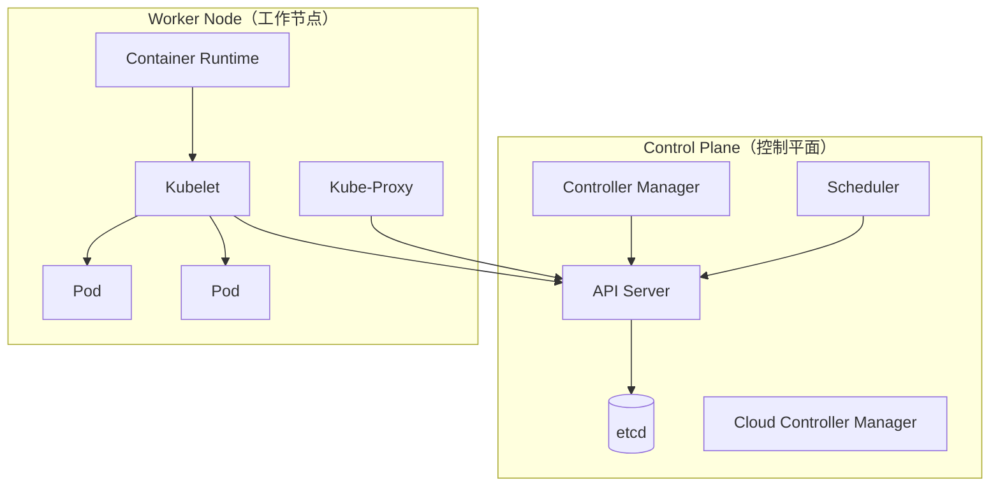

# Kubernetes 架构深度分析

**文档版本**：v1.0
**创建时间**：2026年4月
**状态**：✅ 初稿完成

---

## 📋 执行摘要

Kubernetes（K8s）是Google开源的容器编排平台，已成为云原生应用的事实标准。它提供自动化部署、扩展和管理容器化应用的能力，支持声明式配置、自动容错、服务发现和负载均衡。

**核心设计哲学**：

- 声明式API：描述期望状态，系统自动达成
- 控制回路：持续监控并调和实际状态与期望状态
- 可扩展性：插件化架构，支持自定义资源
- 可移植性：一次编写，到处运行（多云、混合云）

---

## 一、核心概念

### 1.1 架构组件



### 1.2 核心资源对象

| 资源 | 用途 | 控制器 |
|------|------|--------|
| **Pod** | 最小部署单元，包含一个或多个容器 | 无（直接创建） |
| **Deployment** | 无状态应用管理 | Deployment Controller |
| **StatefulSet** | 有状态应用管理 | StatefulSet Controller |
| **DaemonSet** | 每个节点运行一个Pod | DaemonSet Controller |
| **Job/CronJob** | 批处理任务 | Job Controller |
| **Service** | 服务发现和负载均衡 | Endpoint Controller |
| **Ingress** | HTTP/HTTPS路由 | Ingress Controller |
| **ConfigMap/Secret** | 配置管理 | 无 |
| **PersistentVolume** | 持久存储 | PV Controller |
| **Namespace** | 资源隔离 | 无 |

### 1.3 适用场景

| 场景 | 适用性 | 说明 |
|------|--------|------|
| 微服务部署 | ⭐⭐⭐⭐⭐ | 标准场景，服务发现内置 |
| 弹性伸缩 | ⭐⭐⭐⭐⭐ | HPA/VPA自动扩缩容 |
| CI/CD | ⭐⭐⭐⭐⭐ | GitOps，声明式部署 |
| 批处理 | ⭐⭐⭐⭐ | Job/CronJob支持 |
| 有状态应用 | ⭐⭐⭐⭐ | StatefulSet+持久化存储 |
| 边缘计算 | ⭐⭐⭐ | K3s/KubeEdge轻量版 |
| 单机开发 | ⭐⭐⭐ | minikube/kind |

---

## 二、技术细节

### 2.1 控制平面详解

#### API Server

**功能**：

- 所有操作的入口
- RESTful API提供
- 认证、授权、准入控制
- 请求限流

**高可用部署**：

```
多个API Server实例 + 负载均衡器
              │
    ┌─────────┼─────────┐
    ▼         ▼         ▼
  API-1     API-2     API-3
    │         │         │
    └─────────┴─────────┘
              │
           etcd集群
```

#### etcd

**功能**：

- 分布式键值存储
- 存储所有集群状态
- 基于Raft协议实现一致性

**关键数据**：

```
/registry/pods/default/my-pod
/registry/deployments/default/my-deployment
/registry/nodes/node-1
/registry/services/endpoints/my-service
```

**性能优化**：

- 使用SSD存储
- 定期压缩（compaction）
- 限制对象大小（1.5MB默认）

#### Scheduler

**调度流程**：

```
1. 监听未绑定的Pod（nodeName为空）
2. 过滤阶段（Predicates）：排除不满足条件的节点
   - 资源充足（CPU/内存/GPU）
   - 端口不冲突
   - 节点标签匹配
   - 亲和性/反亲和性

3. 评分阶段（Priorities）：为可行节点打分
   - 资源利用率均衡
   - 镜像本地性
   - Pod亲和性
   - 污点容忍

4. 选择最高分节点，绑定Pod
```

**调度算法插件**：

- NodeResourcesFit：资源匹配
- NodeAffinity：节点亲和性
- PodAffinity：Pod亲和性
- VolumeBinding：存储绑定

#### Controller Manager

**控制回路模式**：

```
        ┌─────────────┐
        │   期望状态   │
        │ (etcd中的Spec)
        └──────┬──────┘
               │
         控制器观察
               ▼
        ┌─────────────┐
        │   实际状态   │
        │ (当前系统状态)
        └──────┬──────┘
               │
         比较差异
               ▼
        ┌─────────────┐
        │   调和动作   │
        │ (创建/删除/更新)
        └─────────────┘
```

**内置控制器**：

| 控制器 | 功能 |
|--------|------|
| Deployment Controller | 管理ReplicaSet，实现滚动更新 |
| ReplicaSet Controller | 确保指定数量的Pod副本 |
| StatefulSet Controller | 管理有状态应用，维护网络标识 |
| DaemonSet Controller | 确保每个节点运行一个Pod |
| Job Controller | 管理批处理任务完成 |
| Endpoint Controller | 维护Service和Pod的映射 |
| PV/PVC Controller | 管理持久化存储生命周期 |
| Node Controller | 监控节点健康，处理故障 |

### 2.2 工作节点详解

#### Kubelet

**职责**：

- 与控制平面通信（监听分配到本节点的Pod）
- 通过CRI调用容器运行时
- 挂载卷（Volume）
- 执行健康检查（liveness/readiness probe）
- 报告节点和Pod状态

**Pod生命周期管理**：

```
1. 从API Server获取PodSpec
2. 调用CRI创建pause容器（网络命名空间）
3. 调用CRI创建应用容器
4. 设置cgroups资源限制
5. 挂载卷
6. 执行postStart钩子
7. 运行健康检查
```

#### Container Runtime

**CRI（Container Runtime Interface）**：

```protobuf
service RuntimeService {
  rpc RunPodSandbox(...) returns (...);
  rpc CreateContainer(...) returns (...);
  rpc StartContainer(...) returns (...);
  rpc StopContainer(...) returns (...);
  rpc RemoveContainer(...) returns (...);
}
```

**支持的运行时**：

| 运行时 | 特点 | 适用 |
|--------|------|------|
| containerd | Docker剥离，轻量 | 生产环境首选 |
| CRI-O | 专为K8s设计 | 生产环境 |
| Docker | 完整生态 | 开发测试 |
| gVisor | 沙箱安全 | 多租户安全 |
| Kata | 轻量VM | 强隔离需求 |

#### Kube-Proxy

**模式**：

**iptables模式（默认）**：

```bash
# 创建Service时，kube-proxy添加iptables规则
-A KUBE-SVC-XXX -m statistic --mode random --probability 0.33 -j KUBE-SEP-AAA
-A KUBE-SVC-XXX -m statistic --mode random --probability 0.50 -j KUBE-SEP-BBB
-A KUBE-SVC-XXX -j KUBE-SEP-CCC

# 性能问题：O(n)规则遍历，n=后端Pod数
```

**IPVS模式（推荐大规模）**：

```bash
# 使用内核IPVS负载均衡
ipvsadm -Ln
Prot LocalAddress:Port Scheduler Flags
  -> RemoteAddress:Port Forward Weight ActiveConn InActConn
TCP  10.0.0.1:80 rr
  -> 10.244.1.2:80 Masq 1 0 0
  -> 10.244.1.3:80 Masq 1 0 0

# O(1)查找，支持10+种调度算法
```

**eBPF模式（Cilium等）**：

- 绕过iptables/IPVS，直接内核处理
- 更高性能，更低延迟

### 2.3 网络模型

#### CNI（Container Network Interface）

```
Pod网络要求：
1. 每个Pod有唯一IP（IP-per-Pod）
2. Pod内容器共享网络命名空间（localhost通信）
3. 所有Pod可在任意节点互通（无需NAT）
4. Service提供虚拟IP和负载均衡
```

**常见CNI插件**：

| CNI | 模式 | 特点 |
|-----|------|------|
| **Flannel** | VXLAN/Host-GW | 简单，适合中小规模 |
| **Calico** | BGP | 性能好，支持网络策略 |
| **Cilium** | eBPF | 高性能，可观测性强 |
| **Weave** | VXLAN | 易用，自动发现 |
| **OVN** | OVS | 功能丰富，企业级 |

**Calico BGP模式**：

```
┌─────────────┐         ┌─────────────┐
│  Node A     │◄───────►│  Node B     │
│  Pod CIDR   │   BGP   │  Pod CIDR   │
│  10.244.1.0/24  │   路由  │  10.244.2.0/24  │
└─────────────┘         └─────────────┘

Pod通信直接路由，无需封装
```

#### Service网络

**ClusterIP（默认）**：

```
Service IP（虚拟IP，仅集群内可达）
    │
    ▼
kube-proxy（iptables/IPVS规则）
    │
    ├─► Pod A (10.244.1.2)
    ├─► Pod B (10.244.1.3)
    └─► Pod C (10.244.2.2)
```

**NodePort**：

```
Node IP : Port
    │
    ▼
Service ClusterIP
    │
    ▼
Pod Endpoints
```

**LoadBalancer**：

```
Cloud LB IP
    │
    ▼
NodePort（所有节点）
    │
    ▼
Pod
```

**ExternalName**：

```yaml
# 将Service映射到外部DNS
apiVersion: v1
kind: Service
metadata:
  name: my-db
spec:
  type: ExternalName
  externalName: db.example.com
```

#### DNS与服务发现

**CoreDNS**：

```
Pod访问Service：
- service-name.namespace.svc.cluster.local
- 短名称：service-name（同namespace）

Headless Service：
- 直接返回Pod IP列表
- 用于有状态服务发现
```

### 2.4 存储系统

#### 卷类型

| 类型 | 生命周期 | 用例 |
|------|---------|------|
| emptyDir | Pod | 临时缓存、共享空间 |
| hostPath | Node | 访问节点文件（谨慎使用） |
| ConfigMap/Secret | 持久 | 配置注入 |
| PersistentVolumeClaim | 持久 | 数据库存储 |
| CSI | 持久 | 云存储、SAN等 |

**PV/PVC绑定流程**：

```
1. 管理员创建PV（指定容量、访问模式、存储类）
2. 用户创建PVC（请求容量、访问模式）
3. 控制平面匹配PV和PVC
4. PVC绑定到PV
5. Pod使用PVC挂载存储
```

#### CSI（Container Storage Interface）

```protobuf
service Controller {
  rpc CreateVolume(...) returns (...);
  rpc DeleteVolume(...) returns (...);
  rpc ControllerPublishVolume(...) returns (...);
  rpc ControllerUnpublishVolume(...) returns (...);
}

service Node {
  rpc NodeStageVolume(...) returns (...);
  rpc NodePublishVolume(...) returns (...);
}
```

**云厂商CSI驱动**：

- AWS EBS CSI Driver
- GCP Persistent Disk CSI Driver
- Azure Disk CSI Driver
- Alibaba Cloud CSI Driver

---

## 三、系统对比

### 3.1 容器编排对比

| 特性 | Kubernetes | Docker Swarm | Nomad | OpenShift |
|------|------------|--------------|-------|-----------|
| **复杂度** | 高 | 低 | 中 | 高（K8s发行版）|
| **规模** | 5000节点 | 1000节点 | 10000节点 | 5000节点 |
| **功能丰富** | ⭐⭐⭐⭐⭐ | ⭐⭐⭐ | ⭐⭐⭐⭐ | ⭐⭐⭐⭐⭐ |
| **生态** | 最大 | 小 | 中 | 红帽生态 |
| **学习曲线** | 陡峭 | 平缓 | 中等 | 陡峭 |
| **企业支持** | 多家 | Docker | HashiCorp | Red Hat |

### 3.2 CNI插件对比

| CNI | 性能 | 策略 | 加密 | 适用 |
|-----|------|------|------|------|
| Flannel | ⭐⭐⭐ | 无 | 无 | 小型集群 |
| Calico | ⭐⭐⭐⭐⭐ | 强 | WireGuard | 生产环境 |
| Cilium | ⭐⭐⭐⭐⭐ | 强 | WireGuard | 云原生 |
| Weave | ⭐⭐⭐ | 中 | 有 | 快速部署 |

---

## 四、实践指南

### 4.1 高可用部署

**控制平面HA**：

```
┌─────────────────────────────────────┐
│           Load Balancer             │
│     (Keepalived + HAProxy/Nginx)    │
└─────────────────────────────────────┘
                   │
    ┌──────────────┼──────────────┐
    ▼              ▼              ▼
┌───────┐     ┌───────┐     ┌───────┐
│API-1  │     │API-2  │     │API-3  │
│etcd-1 │◄───►│etcd-2 │◄───►│etcd-3 │
│Sched-1│     │Sched-2│     │Sched-3│
└───────┘     └───────┘     └───────┘
```

**etcd备份**：

```bash
# 定期快照
etcdctl snapshot save /backup/etcd-$(date +%Y%m%d).db

# 恢复
etcdctl snapshot restore snapshot.db \
  --data-dir=/var/lib/etcd-new
```

### 4.2 生产最佳实践

**1. 资源限制**

```yaml
resources:
  requests:
    memory: "64Mi"
    cpu: "250m"
  limits:
    memory: "128Mi"
    cpu: "500m"
```

**2. 健康检查**

```yaml
livenessProbe:
  httpGet:
    path: /health
    port: 8080
  initialDelaySeconds: 30
  periodSeconds: 10

readinessProbe:
  httpGet:
    path: /ready
    port: 8080
  initialDelaySeconds: 5
  periodSeconds: 5
```

**3. 安全加固**

```yaml
securityContext:
  runAsNonRoot: true
  runAsUser: 1000
  readOnlyRootFilesystem: true
  capabilities:
    drop:
      - ALL
```

**4. 调度策略**

```yaml
affinity:
  podAntiAffinity:
    requiredDuringSchedulingIgnoredDuringExecution:
      - labelSelector:
          matchLabels:
            app: myapp
        topologyKey: kubernetes.io/hostname
```

### 4.3 故障排查

**常用命令**：

```bash
# 查看Pod事件
kubectl describe pod <pod-name>

# 查看日志
kubectl logs <pod-name> --previous

# 进入容器调试
kubectl exec -it <pod-name> -- /bin/sh

# 网络调试
kubectl run debug --rm -it --image=nicolaka/netshoot -- /bin/bash
```

---

## 五、与其他主题的关联

### 5.1 上游依赖

- [容器技术](../container/容器基础.md)
- [etcd与Raft](../../04-consensus/raft-family/etcd与Raft.md)
- [CNI网络](../../03-communication/network/CNI网络.md)

### 5.2 下游应用

- [微服务架构](../microservices/微服务架构.md)
- [服务网格](../microservices/服务网格Istio.md)
- [GitOps](../../devops/GitOps.md)

---

## 七、参考资源

### 7.1 官方文档

1. [Kubernetes官方文档](https://kubernetes.io/docs/)
2. [Kubernetes源码](https://github.com/kubernetes/kubernetes)
3. [etcd文档](https://etcd.io/docs/)

### 7.2 学习资料

1. [Kubernetes in Action](https://www.manning.com/books/kubernetes-in-action) - Marko Lukša
2. [Kubernetes Patterns](https://k8spatterns.io/)

---

**维护者**：项目团队
**最后更新**：2026年4月
