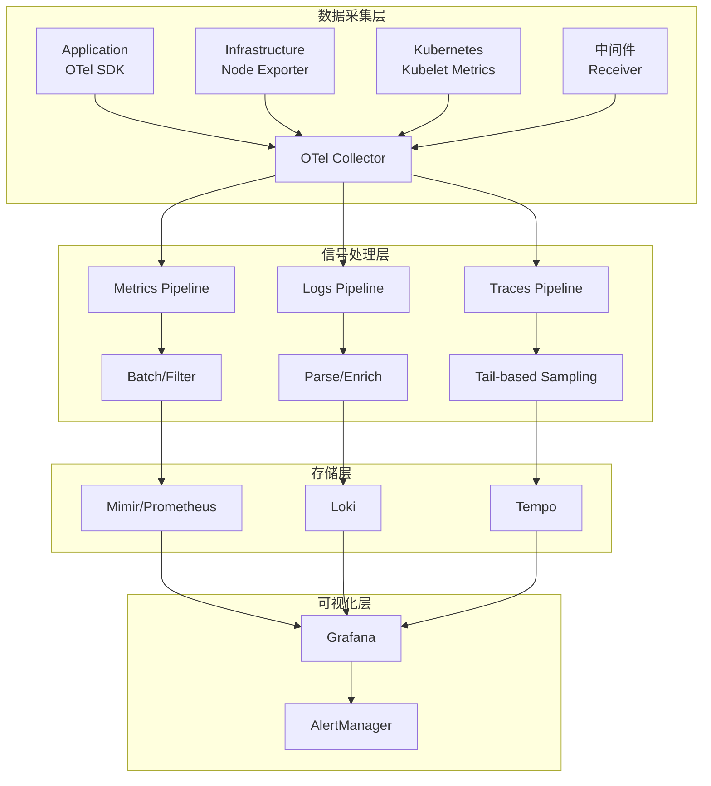
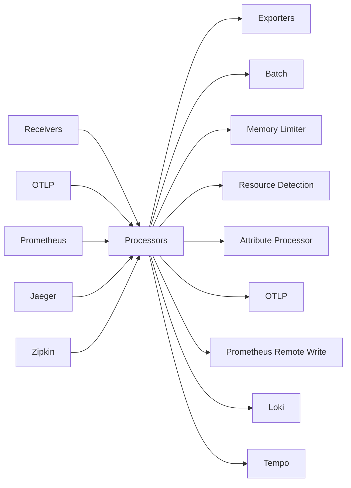
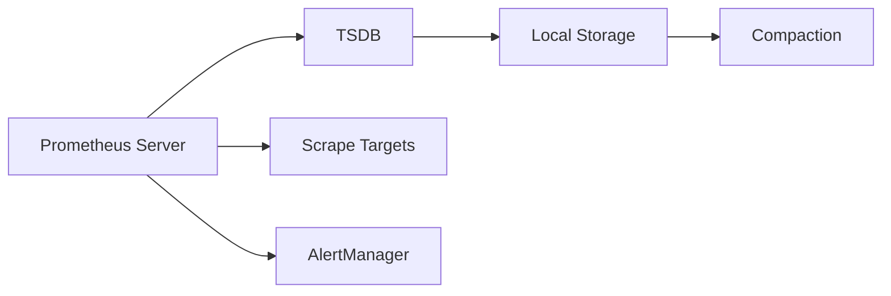

# Observability可观测性栈 专题文档

**文档版本**：v1.0
**创建时间**：2026年
**最后更新**：2026年
**状态**：✅ 已完成

---

## 📋 执行摘要

云原生可观测性栈以OpenTelemetry为标准，实现了Metrics、Logs、Traces三大信号的统一采集。Grafana Labs的LGTM（Loki、Grafana、Tempo、Mimir）+ OpenTelemetry构成了现代云原生监控的完整解决方案，解决了传统监控中数据孤岛、上下文缺失和工具碎片化问题。

---

## 一、核心概念

### 1.1 可观测性三大支柱

#### Metrics（指标）

**定义**：系统在特定时间点的数值状态聚合，回答"发生了什么"的问题。

**类型**：
- **Counter**：单调递增计数器（如请求总数、错误数）
- **Gauge**：可增可减的瞬时值（如内存使用、队列长度）
- **Histogram**：采样分布（如请求延迟分布）
- **Summary**：滑动时间窗口的分位数统计

**关键特性**：
- 时间序列数据，支持长期趋势分析
- 高压缩比，适合长期存储
- 低基数告警，适合SLI/SLO定义

#### Logs（日志）

**定义**：离散事件的结构化或非结构化文本记录，回答"为什么会发生"的问题。

**演进**：
- **Logging 1.0**：本地文件，grep分析
- **Logging 2.0**：集中化收集（ELK/EFK）
- **Logging 3.0**：与Metrics/Traces关联的结构化日志

**关键特性**：
- 高维度的上下文信息
- 支持全文检索
- 与Trace ID关联实现请求链路追踪

#### Traces（链路追踪）

**定义**：请求在分布式系统中的完整传播路径，回答"请求经过哪里"的问题。

**核心概念**：
- **Trace**：一个完整请求的链路树
- **Span**：链路中的单个操作单元
- **Context**：跨进程传播的上下文（Trace ID、Span ID）

**关键特性**：
- 端到端延迟分析
- 服务依赖拓扑发现
- 异常定位与性能瓶颈识别

### 1.2 OpenTelemetry标准

OpenTelemetry（OTel）是CNCF孵化的可观测性框架，提供：
- **统一的API和SDK**：支持11+编程语言
- **标准化的数据模型**：OTLP协议
- **自动Instrumentation**：无代码或低代码接入
- **Collector**：可扩展的采集、处理、导出组件

**架构优势**：
- 打破供应商锁定，数据格式标准化
- 单Agent采集三大信号
- 与Prometheus、Jaeger等生态无缝集成

### 1.3 适用场景

| 场景 | Metrics | Logs | Traces | 说明 |
|------|---------|------|--------|------|
| 基础设施监控 | ⭐⭐⭐⭐⭐ | ⭐⭐⭐ | ⭐ | CPU/内存/磁盘等基础设施指标 |
| 应用性能监控 | ⭐⭐⭐⭐ | ⭐⭐⭐⭐ | ⭐⭐⭐⭐⭐ | APM，请求链路追踪 |
| 业务指标分析 | ⭐⭐⭐⭐⭐ | ⭐⭐ | ⭐ | DAU/转化率等业务KPI |
| 安全审计 | ⭐⭐ | ⭐⭐⭐⭐⭐ | ⭐⭐⭐ | 访问日志、操作审计 |
| 故障排查 | ⭐⭐⭐ | ⭐⭐⭐⭐⭐ | ⭐⭐⭐⭐⭐ | 异常定位、根因分析 |
| 容量规划 | ⭐⭐⭐⭐⭐ | ⭐⭐⭐ | ⭐ | 趋势预测、扩容决策 |

---

## 二、技术细节

### 2.1 架构设计

#### 完整可观测性架构



#### OpenTelemetry Collector架构



### 2.2 各组件详解

#### Prometheus/Mimir - 指标存储

**Prometheus架构**：


**Mimir增强**：
- 水平扩展的TSDB
- 多租户隔离
- 长期存储（对象存储后端）
- 查询分片并行化

**关键配置**：
```yaml
# prometheus.yml
global:
  scrape_interval: 15s
  evaluation_interval: 15s

scrape_configs:
  - job_name: 'kubernetes-pods'
    kubernetes_sd_configs:
      - role: pod
    relabel_configs:
      - source_labels: [__meta_kubernetes_pod_annotation_prometheus_io_scrape]
        action: keep
        regex: true
      - source_labels: [__meta_kubernetes_pod_annotation_prometheus_io_port]
        action: replace
        target_label: __address__
        regex: ([^:]+)(?::\d+)?;(\d+)
        replacement: $1:$2
```

#### Loki - 日志系统

**设计理念**：
- 只索引标签，不索引日志内容
- 与Prometheus标签模型一致
- 基于对象存储，成本低廉

**架构组件**：
```
┌─────────────┐     ┌─────────────┐     ┌─────────────┐
│   Promtail  │────▶│   Distributor│────▶│   Ingester  │
│  (Agent)    │     │             │     │             │
└─────────────┘     └─────────────┘     └──────┬──────┘
                                                │
                       ┌─────────────┐          ▼
                       │   Querier   │◀────┌─────────┐
                       │             │────▶│  Index  │
                       └──────┬──────┘     │ Storage │
                              │            └─────────┘
                              ▼
                       ┌─────────────┐
                       │  Chunk      │
                       │  Storage    │
                       └─────────────┘
```

**LogQL查询语言**：
```logql
# 基础查询
{app="frontend", env="production"}

# 过滤日志内容
{app="api"} |= "error" != "debug" |~ "timeout|retry"

# 解析JSON并提取字段
{app="gateway"} 
  | json 
  | status_code = "500" 
  | line_format "{{.message}} - {{.duration}}ms"

# 统计聚合
sum(rate({app="nginx"} |= "404" [5m])) by (path)
```

#### Tempo - 分布式追踪

**架构特点**：
- 与对象存储集成（S3/GCS/Azure Blob）
- 支持多种后端格式（Jaeger/Zipkin/OTLP）
- TraceQL查询语言

**存储模型**：
```
Trace Data
├── Trace ID Index (Bloom Filter)
├── Block (Parquet格式)
│   ├── Trace ID → Span映射
│   ├── 服务名称索引
│   └── 持续时间索引
└── Compactor (合并小Block)
```

**TraceQL查询**：
```traceql
# 基础查询
{resource.service.name="frontend"}

# 跨度属性过滤
{span.http.method="GET" && span.http.status_code=500}

# 持续时间过滤
{duration > 100ms}

# 结构化查询
{resource.service.name="api"} 
  | select(status, span.http.route, span.duration)
```

### 2.3 OpenTelemetry实现机制

#### SDK自动埋点

```python
# Python示例
from opentelemetry import trace
from opentelemetry.sdk.trace import TracerProvider
from opentelemetry.sdk.trace.export import BatchSpanProcessor
from opentelemetry.exporter.otlp.proto.grpc.trace_exporter import OTLPSpanExporter
from opentelemetry.instrumentation.flask import FlaskInstrumentor

# 配置Provider
trace.set_tracer_provider(TracerProvider())
tracer = trace.get_tracer(__name__)

# 配置Exporter
otlp_exporter = OTLPSpanExporter(endpoint="otel-collector:4317")
span_processor = BatchSpanProcessor(otlp_exporter)
trace.get_tracer_provider().add_span_processor(span_processor)

# 自动埋点
FlaskInstrumentor().instrument()

# 手动埋点
with tracer.start_as_current_span("process_order") as span:
    span.set_attribute("order.id", order_id)
    span.set_attribute("order.amount", amount)
    
    with tracer.start_as_current_span("validate_payment"):
        validate_payment(payment_info)
    
    with tracer.start_as_current_span("update_inventory"):
        update_inventory(items)
```

#### Collector配置

```yaml
# otel-collector-config.yaml
receivers:
  otlp:
    protocols:
      grpc:
        endpoint: 0.0.0.0:4317
      http:
        endpoint: 0.0.0.0:4318
  
  prometheus:
    config:
      scrape_configs:
        - job_name: 'otel-collector'
          static_configs:
            - targets: ['localhost:8888']

processors:
  batch:
    timeout: 1s
    send_batch_size: 1024
  
  memory_limiter:
    limit_mib: 512
    spike_limit_mib: 128
  
  resource:
    attributes:
      - key: environment
        value: production
        action: upsert
  
  tail_sampling:
    decision_wait: 10s
    num_traces: 100
    expected_new_traces_per_sec: 10
    policies:
      - name: errors
        type: status_code
        status_code: {status_codes: [ERROR]}
      - name: slow_requests
        type: latency
        latency: {threshold_ms: 1000}

exporters:
  prometheusremotewrite:
    endpoint: http://mimir:9090/api/v1/push
  
  loki:
    endpoint: http://loki:3100/loki/api/v1/push
    labels:
      resource:
        service.name: "service_name"
        service.namespace: "service_namespace"
  
  otlp/tempo:
    endpoint: tempo:4317
    tls:
      insecure: true

service:
  pipelines:
    metrics:
      receivers: [otlp, prometheus]
      processors: [memory_limiter, batch, resource]
      exporters: [prometheusremotewrite]
    
    logs:
      receivers: [otlp]
      processors: [memory_limiter, batch, resource]
      exporters: [loki]
    
    traces:
      receivers: [otlp]
      processors: [memory_limiter, tail_sampling, batch, resource]
      exporters: [otlp/tempo]
```

---

## 三、系统对比

### 3.1 可观测性方案对比矩阵

| 维度 | Prometheus+Grafana | ELK Stack | LGTM Stack | Datadog/NewRelic |
|------|-------------------|-----------|------------|------------------|
| **部署模式** | 自托管/托管 | 自托管 | 自托管 | SaaS |
| **Metrics** | ⭐⭐⭐⭐⭐ | ⭐⭐⭐ | ⭐⭐⭐⭐⭐ | ⭐⭐⭐⭐⭐ |
| **Logs** | ⭐⭐ | ⭐⭐⭐⭐⭐ | ⭐⭐⭐⭐ | ⭐⭐⭐⭐⭐ |
| **Traces** | ⭐⭐ | ⭐⭐ | ⭐⭐⭐⭐⭐ | ⭐⭐⭐⭐⭐ |
| **成本** | 低 | 中 | 中 | 高 |
| **数据关联** | ⭐⭐⭐ | ⭐⭐ | ⭐⭐⭐⭐⭐ | ⭐⭐⭐⭐⭐ |
| **学习曲线** | 低 | 中 | 中 | 低 |
| **扩展性** | ⭐⭐⭐⭐ | ⭐⭐⭐ | ⭐⭐⭐⭐⭐ | ⭐⭐⭐⭐ |
| **社区生态** | ⭐⭐⭐⭐⭐ | ⭐⭐⭐⭐ | ⭐⭐⭐⭐⭐ | ⭐⭐⭐ |

### 3.2 日志方案深度对比

| 特性 | Loki | ELK(Elasticsearch) | ClickHouse | Fluentd+S3 |
|------|------|-------------------|------------|-----------|
| **索引策略** | 标签索引 | 全文索引 | 稀疏索引 | 无索引 |
| **存储成本** | 极低 | 高 | 中 | 极低 |
| **查询延迟** | 标签过滤快<br/>内容扫描慢 | 全文检索快 | 分析查询快 | 下载后查询 |
| **扩展性** | 水平扩展 | 需要分片管理 | 水平扩展 | 无状态 |
| **与Metrics关联** | 原生支持 | 需额外配置 | 需额外配置 | 不支持 |
| **适用规模** | PB级 | TB-PB级 | PB级 | EB级归档 |

### 3.3 追踪方案对比

| 特性 | Tempo | Jaeger | SkyWalking | Zipkin |
|------|-------|--------|------------|--------|
| **存储后端** | S3/GCS/本地 | ES/Cassandra/内存 | ES/H2/MySQL/TiDB | ES/Cassandra/内存 |
| **查询语言** | TraceQL | JaegerQL | OAL | 有限 |
| **采样策略** | 头部/尾部 | 头部 | 头部/尾部 | 头部 |
| **依赖分析** | 支持 | 支持 | 支持 | 支持 |
| **服务拓扑** | Grafana展示 | Jaeger UI | 自研UI | Zipkin UI |
| **存储成本** | 低（对象存储）| 高 | 中 | 中 |

---

## 四、实践指南

### 4.1 完整部署配置

#### Kubernetes Helm部署

```yaml
# values-observability.yaml
prometheus:
  enabled: true
  prometheusSpec:
    retention: 30d
    storageSpec:
      volumeClaimTemplate:
        spec:
          resources:
            requests:
              storage: 50Gi

mimir:
  enabled: true
  structuredConfig:
    limits:
      ingestion_rate: 50000
      max_global_series_per_user: 1000000

loki:
  enabled: true
  storage:
    type: s3
    s3:
      endpoint: s3.amazonaws.com
      region: us-east-1
      bucketnames: my-loki-bucket

tempo:
  enabled: true
  storage:
    trace:
      backend: s3
      s3:
        bucket: my-tempo-bucket
        endpoint: s3.amazonaws.com
        region: us-east-1

grafana:
  enabled: true
  adminPassword: admin123
  datasources:
    datasources.yaml:
      apiVersion: 1
      datasources:
        - name: Prometheus
          type: prometheus
          url: http://mimir-nginx:80/prometheus
        - name: Loki
          type: loki
          url: http://loki:3100
        - name: Tempo
          type: tempo
          url: http://tempo:3100
```

#### 应用接入配置

```yaml
# 应用Deployment注解
apiVersion: apps/v1
kind: Deployment
metadata:
  name: myapp
spec:
  template:
    metadata:
      annotations:
        # Prometheus自动发现
        prometheus.io/scrape: "true"
        prometheus.io/port: "8080"
        prometheus.io/path: "/metrics"
        
        # 日志收集
        loki.io/enable: "true"
        loki.io/job: "myapp"
      labels:
        # Tempo链路追踪
        app.kubernetes.io/name: myapp
        app.kubernetes.io/version: "1.0.0"
    spec:
      containers:
        - name: myapp
          env:
            - name: OTEL_EXPORTER_OTLP_ENDPOINT
              value: "http://otel-collector:4317"
            - name: OTEL_SERVICE_NAME
              value: "myapp"
            - name: OTEL_RESOURCE_ATTRIBUTES
              value: "deployment.environment=production"
```

### 4.2 最佳实践

**指标最佳实践**：

1. **命名规范**：使用`service_component_unit`格式
   ```
   http_requests_total{method="GET",status="200"}
   database_query_duration_seconds_bucket{le="0.1"}
   ```

2. **标签控制**：避免高基数标签（如user_id、request_id）
   
3. **RED方法**：监控请求率、错误率、持续时间
   ```promql
   # 请求率
   rate(http_requests_total[5m])
   
   # 错误率
   rate(http_requests_total{status=~"5.."}[5m])
   
   # 延迟
   histogram_quantile(0.99, 
     rate(http_request_duration_seconds_bucket[5m]))
   ```

4. **USE方法**：监控使用率、饱和度、错误
   ```promql
   # CPU使用率
   100 - (avg by (instance) (rate(node_cpu_seconds_total{mode="idle"}[5m])) * 100)
   
   # 内存饱和度
   rate(node_vmstat_pgpgin[5m]) + rate(node_vmstat_pgpgout[5m])
   ```

**日志最佳实践**：

1. **结构化日志**：统一JSON格式
   ```json
   {
     "timestamp": "2026-01-15T10:30:00Z",
     "level": "error",
     "service": "payment-service",
     "trace_id": "abc123",
     "span_id": "def456",
     "message": "Payment failed",
     "attributes": {
       "order_id": "ORD-123",
       "amount": 99.99,
       "currency": "USD"
     }
   }
   ```

2. **日志分级**：ERROR、WARN、INFO、DEBUG合理分级

3. **采样策略**：生产环境日志采样，保留100% ERROR日志

**链路追踪最佳实践**：

1. **传播协议**：使用W3C Trace Context标准
   ```
   traceparent: 00-0af7651916cd43dd8448eb211c80319c-b7ad6b7169203331-01
   tracestate: rojo=00f067aa0ba902b7
   ```

2. **采样策略**：
   - 头部采样：根据Trace ID哈希采样（如10%）
   - 尾部采样：基于延迟/错误率延迟采样

3. **Span属性规范**：遵循OpenTelemetry语义约定
   ```python
   span.set_attribute("http.method", "GET")
   span.set_attribute("http.url", "/api/users")
   span.set_attribute("http.status_code", 200)
   span.set_attribute("net.peer.ip", client_ip)
   ```

### 4.3 常见问题

**Q1: 如何处理高基数Metrics问题？**

A:
1. 避免在标签中使用user_id、request_id等高基数字段
2. 使用histogram代替summary
3. 启用Mimir的cardinality control限制
4. 定期分析和清理无用指标

**Q2: Loki查询慢如何优化？**

A:
1. 缩小时间范围
2. 优化标签选择器，先过滤再管道
3. 增加Ingester副本数
4. 使用Query Frontend缓存
5. 对于常用查询，使用Recording Rules预聚合

**Q3: Tempo存储成本优化方案？**

A:
1. 调整Block大小和保留策略
2. 启用Compactor合并小Block
3. 配置合理的采样率（尾部采样保留异常Trace）
4. 使用对象存储冷存储层

**Q4: 如何实现Metrics-Logs-Traces关联？**

A:
```yaml
# 统一exemplar和trace_id
# Prometheus Exemplar关联Trace
http_request_duration_seconds_bucket{
  le="0.1"
} # {trace_id="abc123"} 1

# Loki日志中包含trace_id
{app="api"} |= `trace_id="abc123"`

# Grafana统一查询
# 1. 在Metrics面板设置Exemplar
# 2. 点击Exemplar跳转到Trace视图
# 3. Trace详情中关联日志
```

---

## 五、形式化分析

### 5.1 可观测性数据流模型

设系统状态为S(t)，可观测性信号为：

```
Metrics(t) = f(S(t))          # 状态聚合函数
Logs(t) = {e₁, e₂, ..., eₙ}   # 离散事件集合
Traces(t) = {(s₁, s₂, ..., sₘ)}  # Span序列集合

其中：
- Span = (trace_id, span_id, parent_id, operation, start, end, attrs)
- 关联条件：∃ trace_id ∈ Logs ∩ Traces.metrics_exemplar
```

### 5.2 采样算法的正确性

**头部采样（Head-based）**：
- 在请求入口处决定采样
- 优点：简单，无存储压力
- 缺点：可能丢失异常Trace

**尾部采样（Tail-based）**：
- 等待Trace完成后再决策
- 采样条件：error=true OR duration > threshold
- 保证异常Trace100%保留

---

## 六、与其他主题的关联

### 6.1 上游依赖

- [Kubernetes监控](Kubernetes监控.md)
- [Helm与Kustomize](Helm与Kustomize.md)
- [微服务架构](../microservices/微服务架构设计.md)

### 6.2 下游应用

- [告警与SLO管理](告警与SLO管理.md)
- [混沌工程](混沌工程.md)
- [容量规划](../performance/容量规划.md)

### 6.3 相关概念

| 概念 | 关系 | 说明 |
|------|------|------|
| AIOps | 演进 | 基于可观测性数据的智能分析 |
| eBPF | 采集方式 | 无侵入式数据采集技术 |
| Service Mesh | 集成 | Istio/Linkerd自动产生Metrics和Traces |
| FinOps | 应用 | 基于资源观测的成本优化 |

---

## 七、参考资源

### 7.1 官方文档

1. [OpenTelemetry官方文档](https://opentelemetry.io/docs/) - 标准规范和SDK
2. [Grafana文档](https://grafana.com/docs/) - LGTM Stack
3. [Prometheus文档](https://prometheus.io/docs/) - 指标采集和查询

### 7.2 开源项目

1. [Grafana](https://github.com/grafana/grafana) - 可视化平台
2. [Mimir](https://github.com/grafana/mimir) - 水平扩展Prometheus
3. [Loki](https://github.com/grafana/loki) - 日志聚合系统
4. [Tempo](https://github.com/grafana/tempo) - 分布式追踪

### 7.3 学习资料

1. [Cloud Native Observability](https://www.oreilly.com/library/view/cloud-native-observability/9781492076447/) - O'Reilly书籍
2. [OpenTelemetry in Practice](https://opentelemetry.io/docs/concepts/) - 实践指南
3. [Grafana Labs博客](https://grafana.com/blog/) - 最佳实践

### 7.4 相关文档

- [Prometheus告警规则设计](Prometheus告警规则设计.md)
- [分布式追踪实战](分布式追踪实战.md)
- [SRE可观测性手册](SRE可观测性手册.md)

---

**维护者**：项目团队
**最后更新**：2026年
