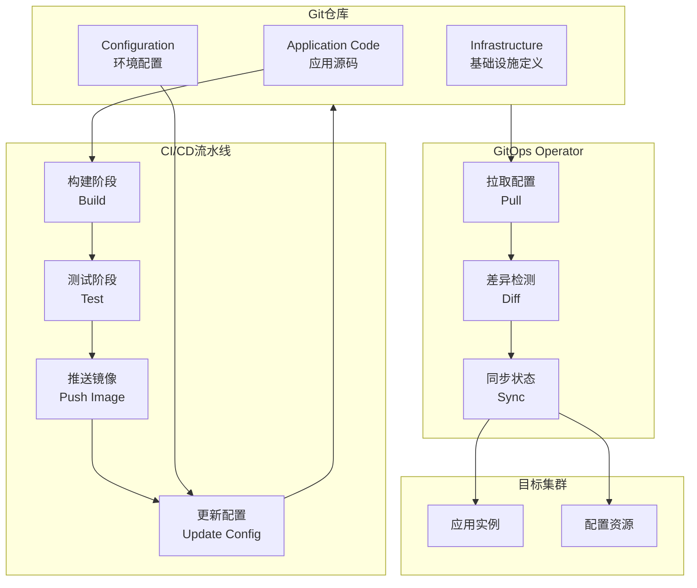
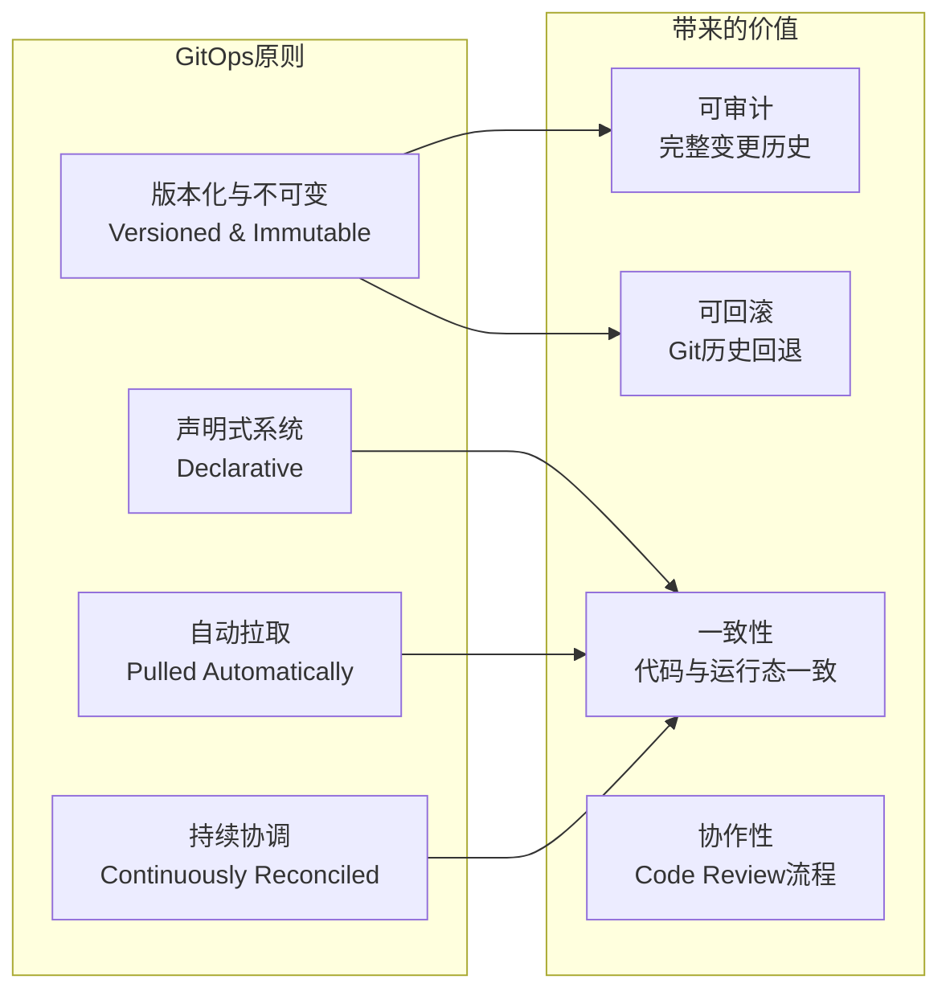
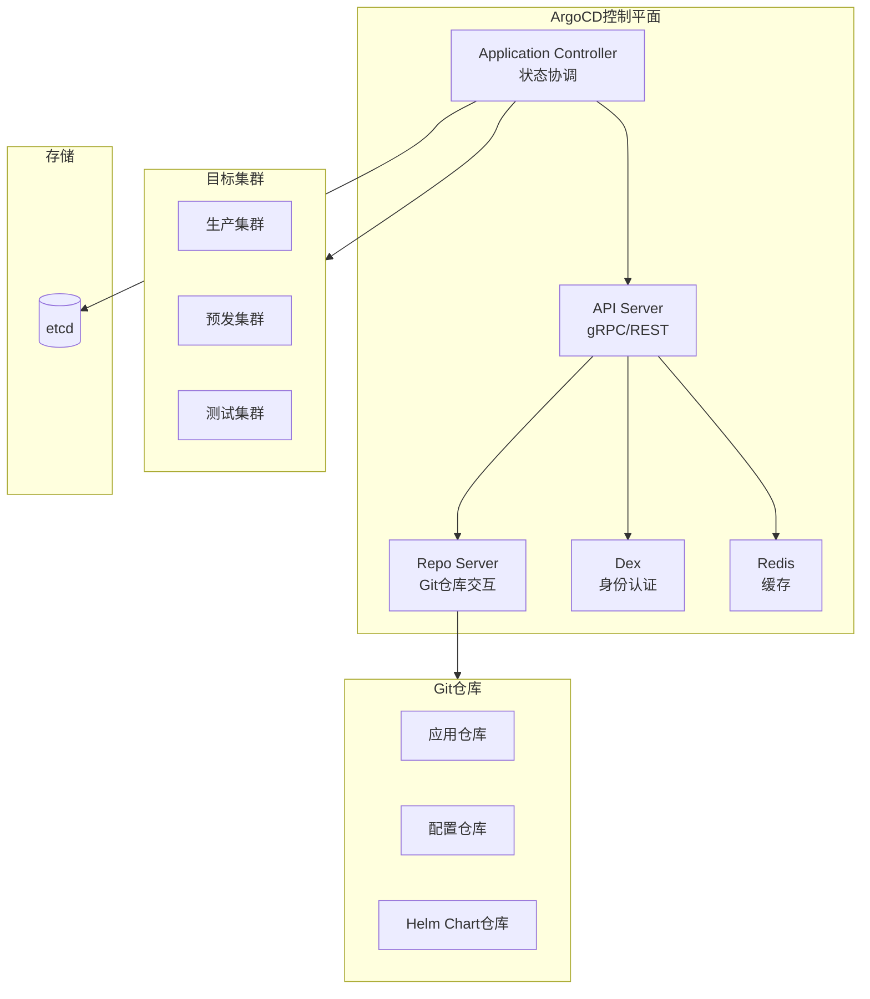
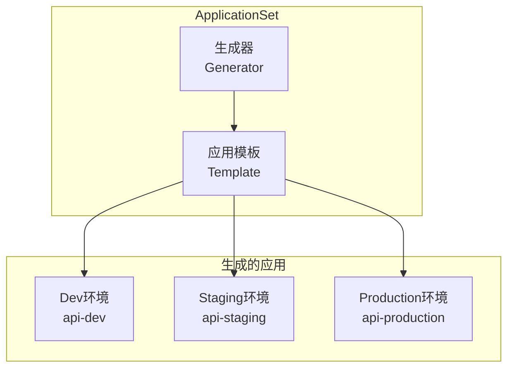
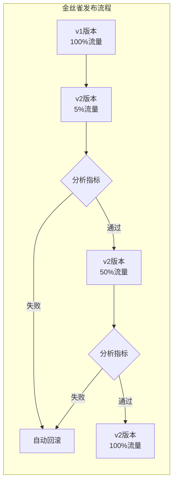
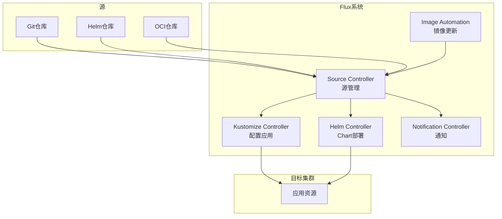

# GitOps交付

## 概述

GitOps是一种以Git仓库为单一事实来源（Single Source of Truth）的运维模式，通过声明式配置和自动化同步，实现基础设施和应用的持续交付。GitOps将Git版本控制、CI/CD流水线和声明式基础设施管理相结合，提供了完整的审计追踪、回滚能力和协作工作流，是现代云原生应用交付的核心实践。

## 核心原则

### GitOps工作流



### GitOps核心原则



## ArgoCD架构

### 整体架构



### 安装配置

```yaml
# ArgoCD命名空间
apiVersion: v1
kind: Namespace
metadata:
  name: argocd
---
# ArgoCD核心组件
apiVersion: apps/v1
kind: Deployment
metadata:
  name: argocd-server
  namespace: argocd
spec:
  replicas: 2
  selector:
    matchLabels:
      app.kubernetes.io/name: argocd-server
  template:
    metadata:
      labels:
        app.kubernetes.io/name: argocd-server
    spec:
      serviceAccountName: argocd-server
      containers:
      - name: argocd-server
        image: quay.io/argoproj/argocd:v2.9.0
        command:
        - argocd-server
        - --insecure
        - --basehref
        - /argocd
        - --rootpath
        - /argocd
        ports:
        - containerPort: 8080
          name: http
        - containerPort: 8083
          name: grpc
        resources:
          requests:
            cpu: 100m
            memory: 256Mi
          limits:
            cpu: 500m
            memory: 512Mi
---
# ArgoCD应用控制器
apiVersion: apps/v1
kind: StatefulSet
metadata:
  name: argocd-application-controller
  namespace: argocd
spec:
  serviceName: argocd-application-controller
  replicas: 1
  selector:
    matchLabels:
      app.kubernetes.io/name: argocd-application-controller
  template:
    metadata:
      labels:
        app.kubernetes.io/name: argocd-application-controller
    spec:
      serviceAccountName: argocd-application-controller
      containers:
      - name: argocd-application-controller
        image: quay.io/argoproj/argocd:v2.9.0
        command:
        - argocd-application-controller
        - --status-processors
        - "20"
        - --operation-processors
        - "10"
        - --repo-server-timeout-seconds
        - "60"
        - --self-heal-timeout-seconds
        - "5"
        resources:
          requests:
            cpu: 250m
            memory: 512Mi
          limits:
            cpu: 2000m
            memory: 2Gi
```

## Application定义

### 基础应用配置

```yaml
# ArgoCD Application定义
apiVersion: argoproj.io/v1alpha1
kind: Application
metadata:
  name: production-api
  namespace: argocd
  finalizers:
  - resources-finalizer.argocd.argoproj.io
  labels:
    environment: production
    team: backend
spec:
  project: production
  source:
    repoURL: https://github.com/company/gitops-repo.git
    targetRevision: main
    path: apps/production/api
    helm:
      valueFiles:
      - values-production.yaml
      parameters:
      - name: replicaCount
        value: "5"
      - name: image.tag
        value: "v2.1.0"
  destination:
    server: https://kubernetes.default.svc
    namespace: production
  syncPolicy:
    automated:
      prune: true
      selfHeal: true
      allowEmpty: false
    syncOptions:
    - CreateNamespace=true
    - PrunePropagationPolicy=foreground
    - PruneLast=true
    retry:
      limit: 5
      backoff:
        duration: 5s
        factor: 2
        maxDuration: 3m
  revisionHistoryLimit: 10
```

### 多源应用

```yaml
# 多源应用配置
apiVersion: argoproj.io/v1alpha1
kind: Application
metadata:
  name: complex-app
  namespace: argocd
spec:
  project: default
  sources:
  # 源1: Helm Chart
  - repoURL: https://charts.bitnami.com/bitnami
    chart: postgresql
    targetRevision: 12.12.10
    helm:
      valueFiles:
      - $values/values/postgresql.yaml
  # 源2: Kustomize配置
  - repoURL: https://github.com/company/gitops-repo.git
    targetRevision: main
    path: overlays/production/api
    kustomize:
      namePrefix: prod-
      commonLabels:
        environment: production
  # 源3: 共享Values
  - repoURL: https://github.com/company/gitops-repo.git
    targetRevision: main
    ref: values
  destination:
    server: https://kubernetes.default.svc
    namespace: production
  syncPolicy:
    automated:
      prune: true
      selfHeal: true
```

## ApplicationSet

### 多环境部署



### 矩阵生成器

```yaml
# ApplicationSet - 矩阵生成器
apiVersion: argoproj.io/v1alpha1
kind: ApplicationSet
metadata:
  name: microservices
  namespace: argocd
spec:
  generators:
  - matrix:
      generators:
      # 生成器1: 环境列表
      - list:
          elements:
          - env: dev
            cluster: https://kubernetes.default.svc
            namespace: development
            replicas: "1"
            resources_cpu: 100m
            resources_memory: 128Mi
          - env: staging
            cluster: https://staging-k8s.example.com
            namespace: staging
            replicas: "2"
            resources_cpu: 500m
            resources_memory: 512Mi
          - env: production
            cluster: https://prod-k8s.example.com
            namespace: production
            replicas: "5"
            resources_cpu: 1000m
            resources_memory: 1Gi
      # 生成器2: 应用列表
      - git:
          repoURL: https://github.com/company/gitops-repo.git
          revision: HEAD
          directories:
          - path: apps/*
  template:
    metadata:
      name: '{{path.basename}}-{{env}}'
      labels:
        app: '{{path.basename}}'
        environment: '{{env}}'
    spec:
      project: default
      source:
        repoURL: https://github.com/company/gitops-repo.git
        targetRevision: HEAD
        path: '{{path}}'
        helm:
          parameters:
          - name: environment
            value: '{{env}}'
          - name: replicaCount
            value: '{{replicas}}'
          - name: resources.requests.cpu
            value: '{{resources_cpu}}'
          - name: resources.requests.memory
            value: '{{resources_memory}}'
      destination:
        server: '{{cluster}}'
        namespace: '{{namespace}}'
      syncPolicy:
        automated:
          prune: true
          selfHeal: true
        syncOptions:
        - CreateNamespace=true
```

### Git生成器

```yaml
# Git文件生成器
apiVersion: argoproj.io/v1alpha1
kind: ApplicationSet
metadata:
  name: cluster-apps
  namespace: argocd
spec:
  generators:
  - git:
      repoURL: https://github.com/company/gitops-repo.git
      revision: HEAD
      files:
      - path: "clusters/*.json"
  template:
    metadata:
      name: '{{cluster.name}}-apps'
      annotations:
        cluster.region: '{{cluster.region}}'
    spec:
      project: '{{cluster.project}}'
      source:
        repoURL: '{{cluster.repoURL}}'
        targetRevision: '{{cluster.revision}}'
        path: '{{cluster.path}}'
      destination:
        server: '{{cluster.server}}'
        namespace: '{{cluster.namespace}}'
      ignoreDifferences:
      - group: apps
        kind: Deployment
        jsonPointers:
        - /spec/replicas
      syncPolicy:
        automated:
          prune: true
          selfHeal: true
          allowEmpty: false
```

## 渐进式交付

### Argo Rollouts集成



### Rollout配置

```yaml
# Argo Rollout定义
apiVersion: argoproj.io/v1alpha1
kind: Rollout
metadata:
  name: api-service
  namespace: production
spec:
  replicas: 10
  strategy:
    canary:
      canaryService: api-service-canary
      stableService: api-service-stable
      trafficRouting:
        istio:
          virtualService:
            name: api-service-vs
            routes:
            - primary
      steps:
      # 步骤1: 发布5%流量
      - setWeight: 5
      - pause: {duration: 10m}
      - analysis:
          templates:
          - templateName: success-rate

      # 步骤2: 增加到25%
      - setWeight: 25
      - pause: {duration: 10m}
      - analysis:
          templates:
          - templateName: success-rate
          - templateName: latency

      # 步骤3: 增加到50%
      - setWeight: 50
      - pause: {duration: 10m}
      - analysis:
          templates:
          - templateName: success-rate
          - templateName: latency

      # 步骤4: 全量发布
      - setWeight: 100

      analysis:
        startingStep: 1
        args:
        - name: service-name
          value: api-service-canary
  selector:
    matchLabels:
      app: api-service
  template:
    metadata:
      labels:
        app: api-service
    spec:
      containers:
      - name: api
        image: registry.example.com/api:v2.0.0
        ports:
        - containerPort: 8080
        resources:
          requests:
            cpu: 100m
            memory: 256Mi
---
# 分析模板
apiVersion: argoproj.io/v1alpha1
kind: AnalysisTemplate
metadata:
  name: success-rate
spec:
  args:
  - name: service-name
  metrics:
  - name: success-rate
    interval: 5m
    count: 3
    successCondition: result[0] >= 0.95
    provider:
      prometheus:
        address: http://prometheus.monitoring.svc:9090
        query: |
          sum(rate(http_requests_total{service="{{args.service-name}}",status=~"2.."}[5m]))
          /
          sum(rate(http_requests_total{service="{{args.service-name}}"}[5m]))
---
apiVersion: argoproj.io/v1alpha1
kind: AnalysisTemplate
metadata:
  name: latency
spec:
  args:
  - name: service-name
  metrics:
  - name: p99-latency
    interval: 5m
    count: 3
    successCondition: result[0] <= 200
    provider:
      prometheus:
        address: http://prometheus.monitoring.svc:9090
        query: |
          histogram_quantile(0.99,
            sum(rate(http_request_duration_seconds_bucket{service="{{args.service-name}}"}[5m])) by (le)
          ) * 1000
```

## Flux架构

### Flux组件



### Flux GitRepository

```yaml
# Git仓库源
apiVersion: source.toolkit.fluxcd.io/v1
kind: GitRepository
metadata:
  name: production-repo
  namespace: flux-system
spec:
  interval: 1m
  url: https://github.com/company/gitops-repo.git
  ref:
    branch: main
  secretRef:
    name: github-token
  ignore: |
    # exclude all
    /*
    # include deploy dir
    !/clusters/production/
---
# Kustomization应用
apiVersion: kustomize.toolkit.fluxcd.io/v1
kind: Kustomization
metadata:
  name: production-apps
  namespace: flux-system
spec:
  interval: 10m
  path: ./clusters/production/apps
  prune: true
  sourceRef:
    kind: GitRepository
    name: production-repo
  healthChecks:
  - apiVersion: apps/v1
    kind: Deployment
    name: api-gateway
    namespace: production
  - apiVersion: apps/v1
    kind: Deployment
    name: user-service
    namespace: production
  timeout: 5m
  retryInterval: 2m
  wait: true
```

### Flux镜像自动化

```yaml
# 镜像仓库扫描
apiVersion: image.toolkit.fluxcd.io/v1beta2
kind: ImageRepository
metadata:
  name: api-service
  namespace: flux-system
spec:
  image: registry.example.com/api-service
  interval: 1m
  secretRef:
    name: registry-credentials
---
# 镜像策略
apiVersion: image.toolkit.fluxcd.io/v1beta2
kind: ImagePolicy
metadata:
  name: api-service
  namespace: flux-system
spec:
  imageRepositoryRef:
    name: api-service
  policy:
    semver:
      range: '>=2.0.0 <3.0.0'
  filterTags:
    pattern: '^v(?P<version>.*)$'
    extract: '$version'
---
# 镜像更新自动化
apiVersion: image.toolkit.fluxcd.io/v1beta1
kind: ImageUpdateAutomation
metadata:
  name: production-updates
  namespace: flux-system
spec:
  interval: 1m
  sourceRef:
    kind: GitRepository
    name: production-repo
  git:
    checkout:
      ref:
        branch: main
    commit:
      author:
        name: Flux Bot
        email: flux@example.com
      messageTemplate: |
        Automated image update

        Images:
        {{ range .Updated.Images -}}
        - {{.}}
        {{ end }}
      signingKey:
        secretRef:
          name: flux-gpg-signing-key
    push:
      branch: main
  policy:
    alphabetical:
      order: asc
```

## 生产实践建议

### 1. 仓库结构

```
gitops-repo/
├── apps/
│   ├── base/                    # 基础配置
│   │   ├── api/
│   │   │   ├── deployment.yaml
│   │   │   ├── service.yaml
│   │   │   └── kustomization.yaml
│   │   └── web/
│   └── overlays/                # 环境覆盖
│       ├── development/
│       ├── staging/
│       └── production/
├── infrastructure/              # 基础设施
│   ├── monitoring/
│   ├── ingress/
│   └── storage/
├── clusters/                    # 集群配置
│   ├── dev/
│   ├── staging/
│   └── production/
└── docs/
```

### 2. 安全最佳实践

```yaml
# 禁用管理员访问
apiVersion: v1
kind: ConfigMap
metadata:
  name: argocd-cm
  namespace: argocd
data:
  admin.enabled: "false"
  users.anonymous.enabled: "false"
  resource.customizations: |
    extensions/Ingress:
      health.lua: |
        hs = {}
        hs.status = "Healthy"
        return hs
---
# RBAC配置
apiVersion: rbac.authorization.k8s.io/v1
kind: Role
metadata:
  name: argocd-application-controller
  namespace: production
rules:
- apiGroups: ['*']
  resources: ['*']
  verbs: ['*']
---
# 项目隔离
apiVersion: argoproj.io/v1alpha1
kind: AppProject
metadata:
  name: production
  namespace: argocd
spec:
  description: Production environment
  sourceRepos:
  - https://github.com/company/gitops-repo.git
  destinations:
  - namespace: production
    server: https://prod-k8s.example.com
  - namespace: monitoring
    server: https://prod-k8s.example.com
  clusterResourceWhitelist:
  - group: ''
    kind: Namespace
  namespaceResourceBlacklist:
  - group: ''
    kind: ResourceQuota
  roles:
  - name: developer
    description: Developer access
    policies:
    - p, proj:production:developer, applications, sync, production/*, allow
    groups:
    - developers
```

### 3. 监控告警

```yaml
# Prometheus规则
apiVersion: monitoring.coreos.com/v1
kind: PrometheusRule
metadata:
  name: argocd-alerts
  namespace: monitoring
spec:
  groups:
  - name: argocd
    rules:
    - alert: ArgoCDAppOutOfSync
      expr: argocd_app_info{sync_status!="Synced"} == 1
      for: 15m
      labels:
        severity: warning
      annotations:
        summary: "ArgoCD应用未同步"
        description: "应用 {{ $labels.name }} 已处于非同步状态超过15分钟"

    - alert: ArgoCDAppDegraded
      expr: argocd_app_info{health_status="Degraded"} == 1
      for: 5m
      labels:
        severity: critical
      annotations:
        summary: "ArgoCD应用降级"
        description: "应用 {{ $labels.name }} 健康状态为Degraded"

    - alert: ArgoCDSyncFailed
      expr: increase(argocd_app_sync_total{phase!="Succeeded"}[1h]) > 3
      for: 0m
      labels:
        severity: warning
      annotations:
        summary: "ArgoCD同步失败"
        description: "应用 {{ $labels.name }} 同步多次失败"

    - alert: ArgoCDRepoError
      expr: argocd_repo_pending_request_count > 50
      for: 10m
      labels:
        severity: warning
      annotations:
        summary: "ArgoCD仓库请求积压"
        description: "仓库请求队列积压严重"
```

### 4. 灾难恢复

```bash
# 备份ArgoCD配置
kubectl get applications -n argocd -o yaml > argocd-apps-backup.yaml
kubectl get appprojects -n argocd -o yaml > argocd-projects-backup.yaml

# 导出加密密钥
kubectl get secret argocd-secret -n argocd -o yaml > argocd-secret-backup.yaml

# 恢复步骤
kubectl apply -f argocd-projects-backup.yaml
kubectl apply -f argocd-apps-backup.yaml

# 验证应用状态
argocd app list
argocd app sync --all
```

### 5. 故障排查

```bash
# 查看应用状态
argocd app get production-api

# 检查同步差异
argocd app diff production-api

# 强制同步
argocd app sync production-api --force

# 查看控制器日志
kubectl logs -n argocd deployment/argocd-application-controller

# 检查仓库连接
argocd repo list

# 验证Kustomize构建
kustomize build apps/production/api | kubectl apply --dry-run=client -f -
```

## 总结

GitOps通过Git仓库作为单一事实来源，结合声明式配置和自动化协调，实现了云原生应用的安全、可审计和可回滚的持续交付。ArgoCD和Flux作为主流的GitOps工具，提供了丰富的功能支持渐进式发布、多集群管理和镜像自动化。企业采用GitOps应关注仓库结构设计、安全隔离、监控告警和灾难恢复，构建完整的GitOps交付体系。
