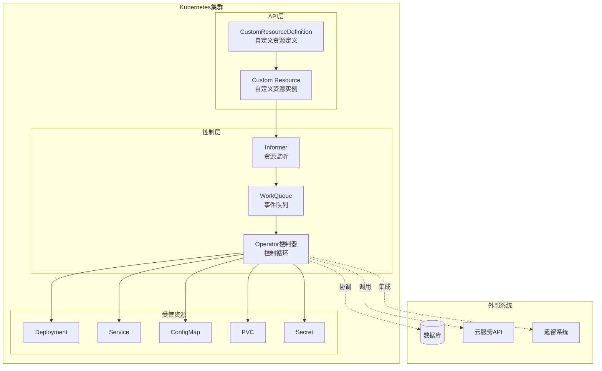
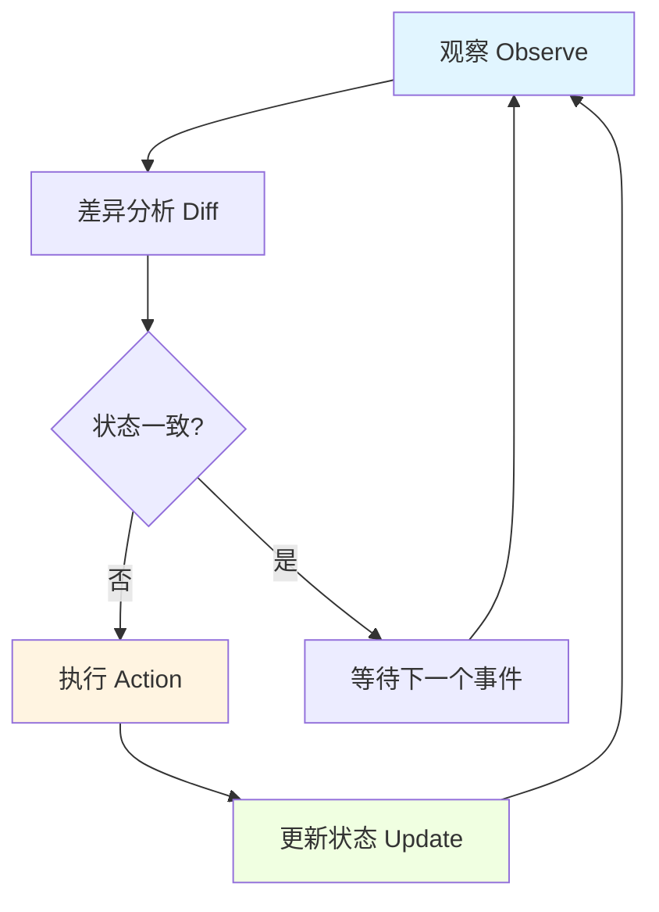
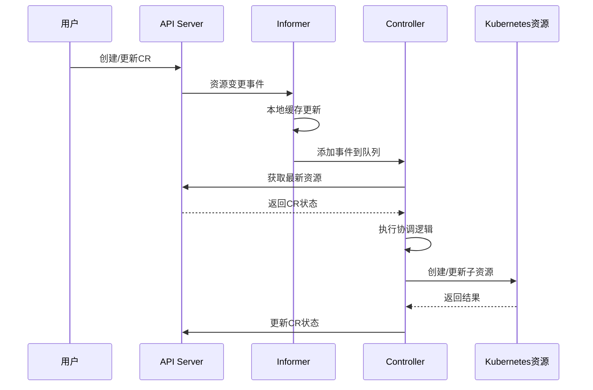
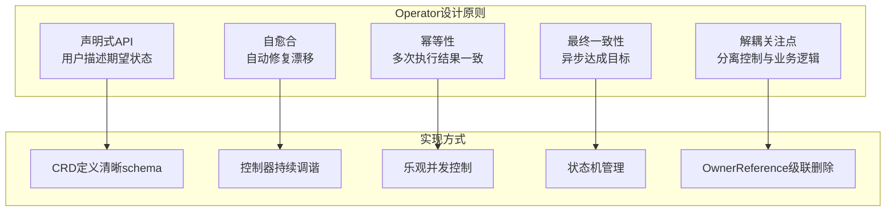

# Kubernetes Operator模式

## 概述

Operator模式是Kubernetes中用于自动化复杂有状态应用管理的扩展机制。它利用CRD（Custom Resource Definition）扩展Kubernetes API，并通过自定义控制器实现声明式管理，将运维知识编码为软件，实现应用的自动化部署、升级、备份和故障恢复。

## 架构设计

### Operator核心组件



### 控制循环原理



## CRD设计

### CRD定义结构

```yaml
# MySQL Cluster CRD定义
apiVersion: apiextensions.k8s.io/v1
kind: CustomResourceDefinition
metadata:
  name: mysqlclusters.database.example.com
spec:
  group: database.example.com
  names:
    kind: MySQLCluster
    listKind: MySQLClusterList
    plural: mysqlclusters
    singular: mysqlcluster
    shortNames:
    - mc
  scope: Namespaced
  versions:
  - name: v1
    served: true
    storage: true
    schema:
      openAPIV3Schema:
        type: object
        properties:
          spec:
            type: object
            required:
            - replicas
            - version
            properties:
              replicas:
                type: integer
                minimum: 1
                maximum: 9
                description: MySQL实例数量
              version:
                type: string
                pattern: '^\d+\.\d+$'
                description: MySQL版本号
              storage:
                type: object
                properties:
                  size:
                    type: string
                    pattern: '^\d+[GM]i$'
                  storageClass:
                    type: string
              resources:
                type: object
                properties:
                  requests:
                    type: object
                    properties:
                      cpu:
                        type: string
                      memory:
                        type: string
                  limits:
                    type: object
                    properties:
                      cpu:
                        type: string
                      memory:
                        type: string
              backup:
                type: object
                properties:
                  enabled:
                    type: boolean
                  schedule:
                    type: string
                    pattern: '^\d+ \d+ \* \* \*$'
                  retention:
                    type: integer
          status:
            type: object
            properties:
              phase:
                type: string
                enum: [Pending, Creating, Running, Failed, Deleting]
              conditions:
                type: array
                items:
                  type: object
                  properties:
                    type:
                      type: string
                    status:
                      type: string
                    lastTransitionTime:
                      type: string
                      format: date-time
              replicas:
                type: integer
              readyReplicas:
                type: integer
              currentVersion:
                type: string
    subresources:
      status: {}
      scale:
        specReplicasPath: .spec.replicas
        statusReplicasPath: .status.replicas
    additionalPrinterColumns:
    - name: Replicas
      type: integer
      jsonPath: .spec.replicas
    - name: Ready
      type: integer
      jsonPath: .status.readyReplicas
    - name: Phase
      type: string
      jsonPath: .status.phase
    - name: Age
      type: date
      jsonPath: .metadata.creationTimestamp
```

### 自定义资源示例

```yaml
# MySQL Cluster实例
apiVersion: database.example.com/v1
kind: MySQLCluster
metadata:
  name: production-db
  namespace: production
  labels:
    app: ecommerce
    tier: database
spec:
  replicas: 3
  version: "8.0"
  storage:
    size: 100Gi
    storageClass: fast-ssd
  resources:
    requests:
      cpu: 1000m
      memory: 2Gi
    limits:
      cpu: 2000m
      memory: 4Gi
  backup:
    enabled: true
    schedule: "0 2 * * *"
    retention: 7
```

## 控制器实现

### 控制器架构



### Go语言控制器示例

```go
// 控制器核心结构
package controller

import (
    "context"
    "time"

    metav1 "k8s.io/apimachinery/pkg/apis/meta/v1"
    "k8s.io/apimachinery/pkg/runtime"
    "k8s.io/client-go/tools/cache"
    "k8s.io/client-go/util/workqueue"
    "sigs.k8s.io/controller-runtime/pkg/client"
    "sigs.k8s.io/controller-runtime/pkg/reconcile"
)

// MySQLClusterReconciler 协调器
type MySQLClusterReconciler struct {
    client.Client
    Scheme *runtime.Scheme
    Recorder record.EventRecorder
}

// +kubebuilder:rbac:groups=database.example.com,resources=mysqlclusters,verbs=get;list;watch;create;update;patch;delete
// +kubebuilder:rbac:groups=database.example.com,resources=mysqlclusters/status,verbs=get;update;patch
// +kubebuilder:rbac:groups=apps,resources=statefulsets,verbs=get;list;watch;create;update;patch;delete
// +kubebuilder:rbac:groups="",resources=services;configmaps;secrets;persistentvolumeclaims,verbs=get;list;watch;create;update;patch;delete

// Reconcile 核心协调逻辑
func (r *MySQLClusterReconciler) Reconcile(ctx context.Context, req reconcile.Request) (reconcile.Result, error) {
    log := log.FromContext(ctx)

    // 1. 获取MySQLCluster实例
    cluster := &databasev1.MySQLCluster{}
    if err := r.Get(ctx, req.NamespacedName, cluster); err != nil {
        return reconcile.Result{}, client.IgnoreNotFound(err)
    }

    // 2. 处理删除逻辑
    if !cluster.DeletionTimestamp.IsZero() {
        return r.reconcileDelete(ctx, cluster)
    }

    // 3. 添加finalizer
    if !containsString(cluster.Finalizers, mysqlFinalizer) {
        cluster.Finalizers = append(cluster.Finalizers, mysqlFinalizer)
        if err := r.Update(ctx, cluster); err != nil {
            return reconcile.Result{}, err
        }
    }

    // 4. 协调各个组件
    if err := r.reconcileConfigMap(ctx, cluster); err != nil {
        return r.updateStatus(ctx, cluster, databasev1.PhaseFailed, err)
    }

    if err := r.reconcileSecret(ctx, cluster); err != nil {
        return r.updateStatus(ctx, cluster, databasev1.PhaseFailed, err)
    }

    if err := r.reconcileService(ctx, cluster); err != nil {
        return r.updateStatus(ctx, cluster, databasev1.PhaseFailed, err)
    }

    if err := r.reconcileStatefulSet(ctx, cluster); err != nil {
        return r.updateStatus(ctx, cluster, databasev1.PhaseFailed, err)
    }

    if err := r.reconcileBackupCronJob(ctx, cluster); err != nil {
        return r.updateStatus(ctx, cluster, databasev1.PhaseFailed, err)
    }

    // 5. 更新状态
    return r.updateStatus(ctx, cluster, databasev1.PhaseRunning, nil)
}

// reconcileStatefulSet 协调StatefulSet
func (r *MySQLClusterReconciler) reconcileStatefulSet(ctx context.Context, cluster *databasev1.MySQLCluster) error {
    desired := r.buildStatefulSet(cluster)

    existing := &appsv1.StatefulSet{}
    err := r.Get(ctx, types.NamespacedName{
        Name:      cluster.Name,
        Namespace: cluster.Namespace,
    }, existing)

    if err != nil {
        if errors.IsNotFound(err) {
            // 创建新资源
            return r.Create(ctx, desired)
        }
        return err
    }

    // 比较并更新
    if needsUpdate(existing, desired) {
        existing.Spec = desired.Spec
        return r.Update(ctx, existing)
    }

    return nil
}

// buildStatefulSet 构建期望的StatefulSet
func (r *MySQLClusterReconciler) buildStatefulSet(cluster *databasev1.MySQLCluster) *appsv1.StatefulSet {
    labels := map[string]string{
        "app":       "mysql",
        "cluster":   cluster.Name,
        "managed-by": "mysql-operator",
    }

    return &appsv1.StatefulSet{
        ObjectMeta: metav1.ObjectMeta{
            Name:      cluster.Name,
            Namespace: cluster.Namespace,
            Labels:    labels,
            OwnerReferences: []metav1.OwnerReference{
                *metav1.NewControllerRef(cluster, databasev1.SchemeBuilder.GroupVersion.WithKind("MySQLCluster")),
            },
        },
        Spec: appsv1.StatefulSetSpec{
            ServiceName: cluster.Name,
            Replicas:    &cluster.Spec.Replicas,
            Selector: &metav1.LabelSelector{
                MatchLabels: labels,
            },
            Template: corev1.PodTemplateSpec{
                ObjectMeta: metav1.ObjectMeta{
                    Labels: labels,
                },
                Spec: corev1.PodSpec{
                    Containers: []corev1.Container{
                        {
                            Name:  "mysql",
                            Image: fmt.Sprintf("mysql:%s", cluster.Spec.Version),
                            Ports: []corev1.ContainerPort{
                                {ContainerPort: 3306, Name: "mysql"},
                            },
                            Resources: cluster.Spec.Resources,
                            VolumeMounts: []corev1.VolumeMount{
                                {Name: "data", MountPath: "/var/lib/mysql"},
                                {Name: "config", MountPath: "/etc/mysql/conf.d"},
                            },
                            Env: []corev1.EnvVar{
                                {
                                    Name: "MYSQL_ROOT_PASSWORD",
                                    ValueFrom: &corev1.EnvVarSource{
                                        SecretKeyRef: &corev1.SecretKeySelector{
                                            LocalObjectReference: corev1.LocalObjectReference{
                                                Name: cluster.Name,
                                            },
                                            Key: "root-password",
                                        },
                                    },
                                },
                            },
                            LivenessProbe: &corev1.Probe{
                                ProbeHandler: corev1.ProbeHandler{
                                    Exec: &corev1.ExecAction{
                                        Command: []string{"mysqladmin", "ping"},
                                    },
                                },
                                InitialDelaySeconds: 30,
                                PeriodSeconds:       10,
                            },
                            ReadinessProbe: &corev1.Probe{
                                ProbeHandler: corev1.ProbeHandler{
                                    Exec: &corev1.ExecAction{
                                        Command: []string{"mysql", "-e", "SELECT 1"},
                                    },
                                },
                                InitialDelaySeconds: 5,
                                PeriodSeconds:       2,
                            },
                        },
                    },
                    Volumes: []corev1.Volume{
                        {
                            Name: "config",
                            VolumeSource: corev1.VolumeSource{
                                ConfigMap: &corev1.ConfigMapVolumeSource{
                                    LocalObjectReference: corev1.LocalObjectReference{
                                        Name: cluster.Name,
                                    },
                                },
                            },
                        },
                    },
                },
            },
            VolumeClaimTemplates: []corev1.PersistentVolumeClaim{
                {
                    ObjectMeta: metav1.ObjectMeta{
                        Name: "data",
                    },
                    Spec: corev1.PersistentVolumeClaimSpec{
                        AccessModes: []corev1.PersistentVolumeAccessMode{
                            corev1.ReadWriteOnce,
                        },
                        Resources: corev1.VolumeResourceRequirements{
                            Requests: corev1.ResourceList{
                                corev1.ResourceStorage: resource.MustParse(cluster.Spec.Storage.Size),
                            },
                        },
                        StorageClassName: &cluster.Spec.Storage.StorageClass,
                    },
                },
            },
        },
    }
}

// SetupWithManager 设置控制器
func (r *MySQLClusterReconciler) SetupWithManager(mgr ctrl.Manager) error {
    return ctrl.NewControllerManagedBy(mgr).
        For(&databasev1.MySQLCluster{}).
        Owns(&appsv1.StatefulSet{}).
        Owns(&corev1.Service{}).
        Owns(&corev1.ConfigMap{}).
        Owns(&corev1.Secret{}).
        WithEventFilter(predicate.GenerationChangedPredicate{}).
        Complete(r)
}
```

## 高级模式

### 升级策略

```yaml
# 滚动升级策略
apiVersion: database.example.com/v1
kind: MySQLCluster
metadata:
  name: production-db
spec:
  replicas: 3
  version: "8.0.32"
  upgradeStrategy:
    type: RollingUpdate
    rollingUpdate:
      maxUnavailable: 1
      partition: 0
---
# 金丝雀升级策略
apiVersion: database.example.com/v1
kind: MySQLCluster
metadata:
  name: production-db
spec:
  replicas: 5
  version: "8.0.32"
  upgradeStrategy:
    type: Canary
    canary:
      steps:
      - weight: 20
        replicas: 1
      - weight: 50
        replicas: 2
      - weight: 100
        replicas: 5
      analysis:
        threshold: 5
        interval: 1m
        successfulRunHistoryLimit: 3
        metrics:
        - name: error-rate
          thresholdRange:
            max: 5
          interval: 1m
```

### 备份与恢复

```yaml
# 自动化备份配置
apiVersion: database.example.com/v1
kind: MySQLBackup
metadata:
  name: daily-backup
  namespace: production
spec:
  clusterRef:
    name: production-db
  schedule: "0 2 * * *"
  retentionPolicy:
    count: 7
    ttl: 168h
  storage:
    type: S3
    s3:
      bucket: mysql-backups
      region: us-east-1
      prefix: production/
      credentials:
        secretName: s3-credentials
---
# 恢复操作
apiVersion: database.example.com/v1
kind: MySQLRestore
metadata:
  name: restore-from-backup
  namespace: production
spec:
  clusterRef:
    name: production-db
  backupRef:
    name: daily-backup-20240115
  pointInTime: "2024-01-15T10:30:00Z"
```

## 最佳实践

### 1. 设计原则



### 2. 代码结构

```
my-operator/
├── api/
│   └── v1/
│       ├── mysqlcluster_types.go    # CRD结构定义
│       ├── groupversion_info.go     # GV注册
│       └── zz_generated.deepcopy.go # 代码生成
├── controllers/
│   ├── mysqlcluster_controller.go   # 主控制器
│   ├── backup_controller.go         # 备份控制器
│   └── suite_test.go               # 集成测试
├── pkg/
│   ├── mysql/
│   │   ├── admin.go                # MySQL管理
│   │   └── replication.go          # 主从复制
│   └── utils/
│       └── k8s.go                  # 工具函数
├── config/
│   ├── crd/                        # CRD YAML
│   ├── manager/                    # 部署配置
│   └── rbac/                       # RBAC配置
├── Makefile
├── PROJECT
└── main.go
```

### 3. 测试策略

```go
// 控制器集成测试
package controllers

import (
    "context"
    "testing"
    "time"

    . "github.com/onsi/ginkgo/v2"
    . "github.com/onsi/gomega"
    "k8s.io/client-go/kubernetes/scheme"
    ctrl "sigs.k8s.io/controller-runtime"
    "sigs.k8s.io/controller-runtime/pkg/client"
    "sigs.k8s.io/controller-runtime/pkg/envtest"

    databasev1 "my-operator/api/v1"
)

var _ = Describe("MySQLCluster Controller", func() {
    Context("When creating a MySQLCluster", func() {
        It("Should create the required resources", func() {
            ctx := context.Background()

            cluster := &databasev1.MySQLCluster{
                ObjectMeta: metav1.ObjectMeta{
                    Name:      "test-cluster",
                    Namespace: "default",
                },
                Spec: databasev1.MySQLClusterSpec{
                    Replicas: 3,
                    Version:  "8.0",
                    Storage: databasev1.StorageSpec{
                        Size: "10Gi",
                    },
                },
            }

            // 创建CR
            Expect(k8sClient.Create(ctx, cluster)).Should(Succeed())

            // 验证StatefulSet创建
            sts := &appsv1.StatefulSet{}
            Eventually(func() error {
                return k8sClient.Get(ctx, types.NamespacedName{
                    Name:      "test-cluster",
                    Namespace: "default",
                }, sts)
            }, timeout, interval).Should(Succeed())

            Expect(*sts.Spec.Replicas).Should(Equal(int32(3)))

            // 验证Service创建
            svc := &corev1.Service{}
            Eventually(func() error {
                return k8sClient.Get(ctx, types.NamespacedName{
                    Name:      "test-cluster",
                    Namespace: "default",
                }, svc)
            }, timeout, interval).Should(Succeed())
        })

        It("Should handle scale operations", func() {
            // 扩缩容测试逻辑
        })

        It("Should handle upgrades safely", func() {
            // 升级测试逻辑
        })
    })
})
```

### 4. 安全实践

```yaml
# Operator RBAC配置
apiVersion: rbac.authorization.k8s.io/v1
kind: ClusterRole
metadata:
  name: mysql-operator
rules:
# 核心API权限
- apiGroups: [""]
  resources: ["pods", "services", "configmaps", "secrets", "persistentvolumeclaims", "events"]
  verbs: ["get", "list", "watch", "create", "update", "patch", "delete"]
# 应用API权限
- apiGroups: ["apps"]
  resources: ["statefulsets", "deployments", "replicasets"]
  verbs: ["get", "list", "watch", "create", "update", "patch", "delete"]
# 批处理API权限
- apiGroups: ["batch"]
  resources: ["cronjobs", "jobs"]
  verbs: ["get", "list", "watch", "create", "update", "patch", "delete"]
# 自定义资源权限
- apiGroups: ["database.example.com"]
  resources: ["mysqlclusters", "mysqlbackups", "mysqlrestores"]
  verbs: ["get", "list", "watch", "create", "update", "patch", "delete"]
- apiGroups: ["database.example.com"]
  resources: ["mysqlclusters/status", "mysqlbackups/status", "mysqlrestores/status"]
  verbs: ["get", "update", "patch"]
- apiGroups: ["database.example.com"]
  resources: ["mysqlclusters/finalizers"]
  verbs: ["update"]
---
# 最小权限ServiceAccount
apiVersion: v1
kind: ServiceAccount
metadata:
  name: mysql-operator
  namespace: operators
automountServiceAccountToken: false
---
# 安全配置
apiVersion: apps/v1
kind: Deployment
metadata:
  name: mysql-operator
spec:
  template:
    spec:
      serviceAccountName: mysql-operator
      automountServiceAccountToken: true
      securityContext:
        runAsNonRoot: true
        runAsUser: 65534
        seccompProfile:
          type: RuntimeDefault
      containers:
      - name: operator
        image: my-operator:latest
        securityContext:
          allowPrivilegeEscalation: false
          readOnlyRootFilesystem: true
          capabilities:
            drop:
            - ALL
        resources:
          requests:
            cpu: 100m
            memory: 128Mi
          limits:
            cpu: 500m
            memory: 256Mi
```

## 生产实践建议

### 1. 高可用部署

```yaml
# Operator HA配置
apiVersion: apps/v1
kind: Deployment
metadata:
  name: mysql-operator
spec:
  replicas: 2  # 多副本
  strategy:
    type: RollingUpdate
    rollingUpdate:
      maxSurge: 1
      maxUnavailable: 0
  template:
    spec:
      affinity:
        podAntiAffinity:
          requiredDuringSchedulingIgnoredDuringExecution:
          - labelSelector:
              matchLabels:
                app: mysql-operator
            topologyKey: kubernetes.io/hostname
      containers:
      - name: operator
        livenessProbe:
          httpGet:
            path: /healthz
            port: 8081
          initialDelaySeconds: 15
          periodSeconds: 20
        readinessProbe:
          httpGet:
            path: /readyz
            port: 8081
          initialDelaySeconds: 5
          periodSeconds: 10
        env:
        - name: ENABLE_LEADER_ELECTION
          value: "true"
        - name: LEADER_ELECTION_LEASE_DURATION
          value: "15s"
        - name: LEADER_ELECTION_RENEW_DEADLINE
          value: "10s"
```

### 2. 监控与告警

```yaml
# Prometheus ServiceMonitor
apiVersion: monitoring.coreos.com/v1
kind: ServiceMonitor
metadata:
  name: mysql-operator-metrics
spec:
  selector:
    matchLabels:
      app: mysql-operator
  endpoints:
  - port: metrics
    path: /metrics
    interval: 30s
    metricRelabelings:
    - sourceLabels: [__name__]
      regex: 'controller_runtime_.*'
      action: keep
---
# 告警规则
apiVersion: monitoring.coreos.com/v1
kind: PrometheusRule
metadata:
  name: mysql-operator-alerts
spec:
  groups:
  - name: mysql-operator
    rules:
    - alert: MySQLClusterFailed
      expr: mysqlcluster_status_phase{phase="Failed"} == 1
      for: 5m
      labels:
        severity: critical
      annotations:
        summary: "MySQL集群处于失败状态"
        description: "集群 {{ $labels.name }} 处于失败状态"
    - alert: MySQLClusterNotReady
      expr: mysqlcluster_status_ready_replicas < mysqlcluster_spec_replicas
      for: 10m
      labels:
        severity: warning
      annotations:
        summary: "MySQL集群未完全就绪"
```

### 3. 故障排查清单

| 问题 | 排查命令 | 解决方案 |
|------|----------|----------|
| CR未创建 | `kubectl get crd` | 检查CRD是否已安装 |
| 控制器无响应 | `kubectl logs -n operators deployment/mysql-operator` | 检查日志和RBAC权限 |
| 子资源未创建 | `kubectl describe mysqlcluster` | 查看事件和状态条件 |
| 状态未更新 | `kubectl get mysqlcluster -o yaml` | 检查控制器权限和finalizer |
| 升级失败 | `kubectl rollout status sts/<name>` | 检查Pod日志和 readinessProbe |

## 总结

Operator模式是Kubernetes生态中自动化复杂应用管理的最佳实践。通过CRD扩展API、控制器实现业务逻辑，Operator将运维专家知识编码为软件，实现应用的自动化生命周期管理。遵循声明式、幂等、最终一致性原则，Operator能够可靠地管理有状态应用，是云原生时代运维自动化的核心技术。
