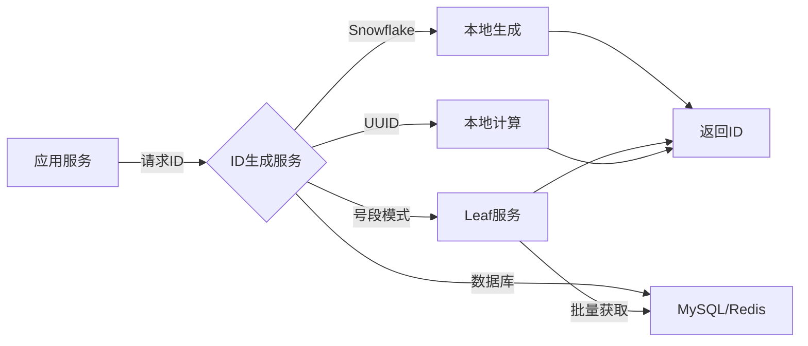

# 分布式ID生成 专题文档

**文档版本**：v1.0
**创建时间**：2026年
**最后更新**：2026年
**状态**：✅ 已完成

---

## 📋 执行摘要

分布式ID生成是分布式系统中的基础设施组件，用于在分布式环境下生成全局唯一、趋势递增、高可用的标识符。核心方案包括雪花算法、UUID、数据库自增、号段模式等，各有优劣，需根据业务场景选型。

---

## 一、核心概念

### 1.1 定义与原理

**分布式ID**是在分布式系统中生成的全局唯一标识符，需满足以下核心特性：

- **全局唯一性**：不同节点、不同时间生成的ID不重复
- **趋势递增**：整体呈递增趋势，有利于B+树索引
- **高可用**：ID生成服务不能成为单点故障
- **高性能**：低延迟、高吞吐的ID生成能力
- **信息安全**：ID不可被轻易猜测（非连续）

### 1.2 关键特性

- **时间有序性**：ID包含时间戳信息，可排序
- **去中心化**：多节点独立生成，无单点
- **短ID长度**：节省存储空间，提高传输效率
- **业务可扩展**：可嵌入业务标识（如数据中心、业务类型）

### 1.3 适用场景

| 场景 | 适用性 | 说明 |
|------|--------|------|
| 分布式数据库主键 | ⭐⭐⭐⭐⭐ | 分库分表后的全局主键 |
| 订单/流水号生成 | ⭐⭐⭐⭐⭐ | 业务单号需要唯一且有序 |
| 消息队列消息ID | ⭐⭐⭐⭐ | 消息去重和排序 |
| 分布式锁标识 | ⭐⭐⭐⭐ | 锁的唯一标识 |
| 短链接生成 | ⭐⭐⭐ | 需要短且唯一的ID |

---

## 二、技术细节

### 2.1 架构设计



### 2.2 算法原理

#### 2.2.1 雪花算法（Snowflake）

**原理**：Twitter开源的分布式ID生成算法，生成64位Long型ID。

```
ID结构（64位）：
| 1位符号位 | 41位时间戳 | 10位工作节点 | 12位序列号 |
|----------|-----------|-------------|-----------|
|    0     |  毫秒时间  |  datacenter + worker  |  同一毫秒内的序列  |

范围：
- 时间戳：69年（从自定义起始时间开始）
- 工作节点：1024个（5位数据中心 + 5位机器）
- 序列号：每毫秒4096个ID
- 理论QPS：409.6万/秒
```

**算法步骤**：

```
输入：数据中心ID dcId，机器ID workerId，起始时间戳 twepoch
输出：64位唯一ID

步骤：
1. 获取当前时间戳 timestamp = currentTimeMillis()
2. IF timestamp < lastTimestamp THEN
3.     抛出时钟回拨异常
4. END IF
5.
6. IF timestamp == lastTimestamp THEN
7.     sequence = (sequence + 1) & 4095  // 序列号自增，掩码保12位
8.     IF sequence == 0 THEN
9.         timestamp = tilNextMillis(lastTimestamp)  // 等待下一毫秒
10.    END IF
11. ELSE
12.    sequence = 0  // 新毫秒，序列号归零
13. END IF
14.
15. lastTimestamp = timestamp
16.
17. ID = ((timestamp - twepoch) << 22)
18.      | (dcId << 17)
19.      | (workerId << 12)
20.      | sequence
21. RETURN ID
```

**复杂度分析**：

- 时间复杂度：O(1)
- 空间复杂度：O(1)
- 性能：单机QPS可达400万+

**Java实现**：

```java
public class SnowflakeIdWorker {
    // 起始时间戳（2024-01-01）
    private final long twepoch = 1704067200000L;

    // 位数分配
    private final long workerIdBits = 5L;
    private final long datacenterIdBits = 5L;
    private final long sequenceBits = 12L;

    // 最大值
    private final long maxWorkerId = -1L ^ (-1L << workerIdBits);
    private final long maxDatacenterId = -1L ^ (-1L << datacenterIdBits);
    private final long sequenceMask = -1L ^ (-1L << sequenceBits);

    // 位移
    private final long workerIdShift = sequenceBits;
    private final long datacenterIdShift = sequenceBits + workerIdBits;
    private final long timestampLeftShift = sequenceBits + workerIdBits + datacenterIdBits;

    private long workerId;
    private long datacenterId;
    private long sequence = 0L;
    private long lastTimestamp = -1L;

    public synchronized long nextId() {
        long timestamp = timeGen();

        if (timestamp < lastTimestamp) {
            throw new RuntimeException("Clock moved backwards");
        }

        if (lastTimestamp == timestamp) {
            sequence = (sequence + 1) & sequenceMask;
            if (sequence == 0) {
                timestamp = tilNextMillis(lastTimestamp);
            }
        } else {
            sequence = 0L;
        }

        lastTimestamp = timestamp;

        return ((timestamp - twepoch) << timestampLeftShift)
                | (datacenterId << datacenterIdShift)
                | (workerId << workerIdShift)
                | sequence;
    }

    private long tilNextMillis(long lastTimestamp) {
        long timestamp = timeGen();
        while (timestamp <= lastTimestamp) {
            timestamp = timeGen();
        }
        return timestamp;
    }

    private long timeGen() {
        return System.currentTimeMillis();
    }
}
```

#### 2.2.2 UUID（Universally Unique Identifier）

**原理**：128位标识符，由时间戳、时钟序列、节点标识（MAC地址）组成。

```
UUID结构（128位）：
| 32位 | 16位 | 16位 | 16位 | 48位 |
| time_low | time_mid | time_hi | clock_seq | node |

版本：
- V1：基于时间戳和MAC地址
- V3/V5：基于命名空间和MD5/SHA1
- V4：完全随机
- V7：基于Unix时间戳（推荐）
```

**优缺点**：

- 优点：本地生成，无依赖，全球唯一
- 缺点：128位太长，无序，存储效率低，含"-"字符

#### 2.2.3 数据库自增

**原理**：利用数据库的自增主键特性生成唯一ID。

**方案**：

1. **单点数据库**：

```sql
-- 创建ID表
CREATE TABLE id_generator (
    id BIGINT AUTO_INCREMENT PRIMARY KEY,
    stub CHAR(1) NOT NULL DEFAULT ''
);

-- 获取ID
REPLACE INTO id_generator (stub) VALUES ('a');
SELECT LAST_INSERT_ID();
```

1. **数据库号段模式**：

```sql
-- 号段表
CREATE TABLE leaf_alloc (
    biz_tag VARCHAR(128) NOT NULL PRIMARY KEY,
    max_id BIGINT NOT NULL,
    step INT NOT NULL,
    description VARCHAR(256)
);

-- 获取号段
UPDATE leaf_alloc SET max_id = max_id + step WHERE biz_tag = 'order';
SELECT max_id FROM leaf_alloc WHERE biz_tag = 'order';
```

**复杂度分析**：

- 单点：高延迟（网络+数据库），存在单点故障
- 号段：批量获取减少DB访问，双Buffer优化

#### 2.2.4 号段模式（Leaf）

**原理**：美团Leaf方案，批量从数据库获取ID号段，本地分配。

```
架构：
1. 服务启动时从DB加载号段 [max_id, max_id + step]
2. 本地原子自增分配ID
3. 号段使用10%时异步加载下一号段
4. 双Buffer保证无间断
```

**优缺点**：

- 优点：号段内ID连续递增，DB压力小
- 缺点：ID非严格递增（号段切换时跳变），依赖DB

### 2.3 Redis生成方案

**原理**：利用Redis的原子操作INCR生成序列。

```java
public long nextId(String key) {
    // 每日重置
    String today = LocalDate.now().format(DateTimeFormatter.BASIC_ISO_DATE);
    String redisKey = "id:" + key + ":" + today;

    // 原子自增
    Long id = redisTemplate.opsForValue().increment(redisKey);

    // 设置过期时间
    redisTemplate.expire(redisKey, 2, TimeUnit.DAYS);

    // 组合日期和序列
    return Long.parseLong(today) * 1000000 + id;
}
```

---

## 三、系统对比

### 3.1 方案对比矩阵

| 维度 | Snowflake | UUID | 数据库自增 | 号段模式 | Redis |
|------|-----------|------|-----------|----------|-------|
| 全局唯一 | ✅ | ✅ | ✅ | ✅ | ✅ |
| 趋势递增 | ✅ | ❌ | ✅ | ✅ | ✅ |
| ID长度 | 64位 | 128位 | 64位 | 64位 | 64位 |
| 性能 | 极高(400万/s) | 高 | 低 | 高 | 高 |
| 可用性 | 高 | 极高 | 低 | 中 | 中 |
| 时钟依赖 | 是 | 否 | 否 | 否 | 否 |
| 网络依赖 | 无 | 无 | 有 | 有 | 有 |
| 可读性 | 好 | 差 | 好 | 好 | 好 |
| 信息泄露 | 可能（时间） | 无 | 无 | 无 | 无 |

### 3.2 性能基准

| 方案 | 单机QPS | 延迟 | 可扩展性 |
|------|---------|------|----------|
| Snowflake | 400万+ | <1ms | 横向扩展1024节点 |
| UUID | 100万+ | <1ms | 无限制 |
| 数据库单点 | 几百 | 5-10ms | 垂直扩展 |
| Leaf号段 | 几十万 | <1ms（本地） | 横向扩展 |
| Redis | 10万+ | 1-2ms | 集群扩展 |

### 3.3 选型决策树

```
是否需要趋势递增？
├── 是
│   ├── 能否容忍时钟回拨问题？
│   │   ├── 是 → Snowflake（性能最优）
│   │   └── 否 → Leaf号段模式（推荐）
│   └── 是否已使用Redis？
│       ├── 是 → Redis方案
│       └── 否 → Leaf号段
└── 否
    ├── 是否需要完全无依赖？
    │   ├── 是 → UUID V7
    │   └── 否 → Snowflake
```

---

## 四、实践指南

### 4.1 Snowflake配置

```yaml
# snowflake配置
id-generator:
  snowflake:
    # 数据中心ID（0-31）
    datacenter-id: 1
    # 工作节点ID（0-31）
    worker-id: ${random.int(0,31)}
    # 起始时间戳
    epoch: 1704067200000
    # 时钟回拨容忍（毫秒）
    max-backward-ms: 5
```

**时钟回拨解决方案**：

```java
public class SafeSnowflakeIdWorker {
    private long lastTimestamp = -1L;
    private final long maxBackwardMs = 5;

    public synchronized long nextId() {
        long timestamp = timeGen();

        // 时钟回拨检测
        if (timestamp < lastTimestamp) {
            long offset = lastTimestamp - timestamp;
            if (offset <= maxBackwardMs) {
                // 小范围回拨，等待
                try {
                    Thread.sleep(offset + 1);
                    timestamp = timeGen();
                } catch (InterruptedException e) {
                    Thread.currentThread().interrupt();
                }
            } else {
                throw new RuntimeException("Clock moved backwards by " + offset + "ms");
            }
        }
        // ... 正常生成逻辑
    }
}
```

### 4.2 Leaf部署配置

```properties
# Leaf配置
leaf.name=leaf-server
leaf.segment.enable=true
leaf.segment.url=jdbc:mysql://localhost:3306/leaf
leaf.segment.username=leaf
leaf.segment.password=leaf

# 雪花模式配置（可选）
leaf.snowflake.enable=true
leaf.snowflake.address=zk.host:2181
leaf.snowflake.port=2181
```

### 4.3 最佳实践

1. **Snowflake WorkerID分配**
   - 使用ZooKeeper/etcd动态分配WorkerID
   - 或基于IP+端口哈希计算
   - 避免手动配置导致ID冲突

2. **数据库号段步长设置**
   - 步长 = 预估QPS × 2（留一倍缓冲）
   - 号段不宜过大（浪费）或过小（频繁DB访问）

3. **时钟同步**
   - 部署NTP服务保持时钟同步
   - 设置时钟回拨检测和告警
   - 容器环境注意时间隔离

4. **ID使用规范**
   - 数据库主键使用BIGINT存储
   - 避免将ID暴露给用户（可转62进制缩短）
   - 业务ID与数据库ID分离设计

### 4.4 常见问题

**Q1: Snowflake时钟回拨如何处理？**
A: 小范围回拨可等待追赶；大范围回拨需报警并拒绝服务；或使用NTP同步避免。

**Q2: 如何生成更短的ID？**
A: 将Snowflake ID转62进制（a-zA-Z0-9），19位数字可缩至11位字符。

**Q3: 号段模式ID不连续怎么办？**
A: 这是设计特性，保证高可用必然牺牲严格连续。如需连续需用数据库自增但牺牲性能。

**Q4: 多数据中心如何部署？**
A: Snowflake用datacenterId区分；Leaf号段用不同biz_tag区分。

---

## 五、形式化分析

### 5.1 雪花算法唯一性证明

**定理**：在正常工作条件下，Snowflake算法生成的ID全局唯一。

**证明**：
设ID = (timestamp - twepoch) × 2^22 + datacenterId × 2^17 + workerId × 2^12 + sequence

对于不同机器：workerId或datacenterId不同，ID必然不同。

对于同一机器：

- 不同毫秒：timestamp不同，ID不同
- 同一毫秒：sequence自增，范围0-4095，超过则等待下一毫秒

因此任何情况下ID唯一。

### 5.2 号段模式可用性分析

**定理**：双Buffer号段模式下，服务可用性 = 1 - (DB故障概率)^2

**证明**：

- 单Buffer：DB故障时无号段可用，不可用
- 双Buffer：需两个Buffer同时耗尽且DB故障才不可用
- 假设DB可用性99.9%，则服务可用性 ≈ 99.9999%

---

## 六、与其他主题的关联

### 6.1 上游依赖

- [配置中心](./配置中心.md) - WorkerID动态分配配置
- [服务注册发现](../service-discovery.md) - 节点标识管理

### 6.2 下游应用

- [分布式Session](./分布式Session.md) - Session ID生成
- [分库分表](../sharding.md) - 分片键生成

### 6.3 相关概念

| 概念 | 关系 | 说明 |
|------|------|------|
| 数据库主键 | 应用 | ID主要用于主键 |
| 业务单号 | 扩展 | 基于ID添加业务前缀 |
| 短链接 | 转换 | ID转62进制生成短码 |

---

## 七、参考资源

### 7.1 学术论文

1. [Snowflake: Analytic Data Warehouse](https://docs.snowflake.com/) - Snowflake架构
2. [UUID RFC 4122](https://tools.ietf.org/html/rfc4122) - UUID标准规范

### 7.2 开源项目

1. [Twitter Snowflake](https://github.com/twitter-archive/snowflake) - 原始雪花算法
2. [美团Leaf](https://github.com/Meituan-Dianping/Leaf) - 分布式ID生成服务
3. [百度UidGenerator](https://github.com/baidu/uid-generator) - 改进版雪花算法
4. [TinyID](https://github.com/didi/tinyid) - 滴滴分布式ID

### 7.3 学习资料

1. [Leaf——美团点评分布式ID生成系统](https://tech.meituan.com/2017/04/21/mt-leaf.html)
2. [浅谈CAS在分布式ID中的应用](https://mp.weixin.qq.com/s/)

### 7.4 相关文档

- [熔断与限流](./熔断与限流.md)
- [配置中心](./配置中心.md)

---

**维护者**：项目团队
**最后更新**：2026年
