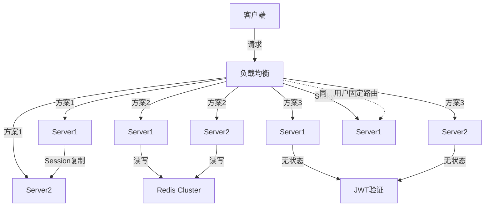

# 分布式Session 专题文档

**文档版本**：v1.0
**创建时间**：2026年
**最后更新**：2026年
**状态**：✅ 已完成

---

## 📋 执行摘要

分布式Session解决多节点部署场景下的用户会话状态共享问题。核心方案包括Session复制、集中存储、JWT无状态、Sticky Session四种模式，各有适用场景，现代架构倾向于使用JWT或Redis集中存储方案。

---

## 一、核心概念

### 1.1 定义与原理

**Session（会话）**是服务器端保存用户状态的机制，用于跟踪用户登录状态、购物车、浏览历史等。

**分布式Session问题**：
- 传统Session存储在单机内存中
- 负载均衡后，同一用户请求可能路由到不同节点
- 导致Session丢失，用户频繁重新登录

**解决方案核心**：实现Session在多台服务器间的共享或同步。

### 1.2 关键特性

- **透明性**：对应用代码无侵入或低侵入
- **一致性**：多节点Session数据保持一致
- **高可用**：Session服务不成为单点故障
- **安全性**：Session数据防篡改、防劫持
- **时效性**：支持Session过期和自动清理

### 1.3 适用场景

| 场景 | 适用性 | 说明 |
|------|--------|------|
| 多节点Web应用 | ⭐⭐⭐⭐⭐ | 必须解决Session共享 |
| 有状态微服务 | ⭐⭐⭐⭐ | 服务间Session传递 |
| 单页应用(SPA) | ⭐⭐⭐⭐ | Token方案更优 |
| 移动端API | ⭐⭐⭐⭐⭐ | JWT无状态方案 |
| 实时通信场景 | ⭐⭐⭐ | WebSocket与Session整合 |

---

## 二、技术细节

### 2.1 架构设计



### 2.2 方案原理

#### 2.2.1 Session复制（Session Replication）

**原理**：各节点间实时同步Session数据，每个节点都保存完整Session副本。

```
工作流程：
1. 用户登录，Server1创建Session
2. Server1通过组播将Session同步到Server2、Server3
3. 用户后续请求被路由到Server2
4. Server2本地有Session副本，无需跨节点获取
```

**Tomcat实现**：

```xml
<!-- server.xml -->
<Cluster className="org.apache.catalina.ha.tcp.SimpleTcpCluster">
    <Manager className="org.apache.catalina.ha.session.DeltaManager"
             expireSessionsOnShutdown="false"
             notifyListenersOnReplication="true"/>
    <Channel className="org.apache.catalina.tribes.group.GroupChannel">
        <Membership className="org.apache.catalina.tribes.membership.McastService"
                    address="228.0.0.4"
                    port="45564"
                    frequency="500"
                    dropTime="3000"/>
        <Receiver className="org.apache.catalina.tribes.transport.nio.NioReceiver"
                  address="auto"
                  port="4000"
                  autoBind="100"
                  selectorTimeout="5000"
                  maxThreads="6"/>
        <Sender className="org.apache.catalina.tribes.transport.ReplicationTransmitter">
            <Transport className="org.apache.catalina.tribes.transport.nio.PooledParallelSender"/>
        </Sender>
    </Channel>
</Cluster>
```

**优缺点**：
- 优点：实现简单，读取速度快（本地内存）
- 缺点：节点多时网络开销大，内存冗余，数据一致性问题

#### 2.2.2 Redis集中存储

**原理**：Session统一存储在Redis，各节点按需读写。

```
工作流程：
1. 用户登录，Server1创建Session
2. Session序列化后写入Redis，Key: session:xxx
3. 用户请求到Server2
4. Server2从Redis读取Session，反序列化使用
5. 设置TTL自动过期
```

**Spring Session实现**：

```java
// 1. 添加依赖
// spring-session-data-redis, spring-boot-starter-data-redis

// 2. 配置类
@Configuration
@EnableRedisHttpSession(
    maxInactiveIntervalInSeconds = 1800,  // 30分钟过期
    redisNamespace = "myapp:session"
)
public class SessionConfig {
    
    @Bean
    public LettuceConnectionFactory connectionFactory() {
        return new LettuceConnectionFactory();
    }
    
    // 自定义序列化
    @Bean
    public RedisSerializer<Object> springSessionDefaultRedisSerializer() {
        return new GenericJackson2JsonRedisSerializer();
    }
}

// 3. 使用（与HttpSession完全一致）
@RestController
public class LoginController {
    @PostMapping("/login")
    public String login(@RequestBody LoginDTO dto, HttpSession session) {
        User user = authService.authenticate(dto);
        session.setAttribute("user", user);
        return "login success";
    }
    
    @GetMapping("/profile")
    public User profile(HttpSession session) {
        return (User) session.getAttribute("user");
    }
}
```

**Redis数据结构**：

```
Key: spring:session:myapp:session:abc123
Hash Fields:
  - sessionAttr:user -> 用户对象JSON
  - sessionAttr:cart -> 购物车JSON
  - creationTime -> 创建时间
  - lastAccessedTime -> 最后访问时间
  - maxInactiveInterval -> 过期时间

TTL: 1800秒（自动续期）
```

#### 2.2.3 JWT无状态方案

**原理**：服务端不存储Session，用户信息加密在Token中，客户端每次请求携带。

```
JWT结构：
| Header | Payload | Signature |
| Base64 | Base64  | HMAC/RS256 |

Header: { alg: "HS256", typ: "JWT" }
Payload: { sub: "user123", iat: 1234567890, exp: 1234571490, role: "admin" }
Signature: HMACSHA256(base64(header) + "." + base64(payload), secret)
```

**实现代码**：

```java
// JWT工具类
@Component
public class JwtUtil {
    @Value("${jwt.secret}")
    private String secret;
    
    @Value("${jwt.expiration:86400}")
    private Long expiration;
    
    private SecretKey key;
    
    @PostConstruct
    public void init() {
        this.key = Keys.hmacShaKeyFor(secret.getBytes());
    }
    
    public String generateToken(User user) {
        Date now = new Date();
        Date expiry = new Date(now.getTime() + expiration * 1000);
        
        return Jwts.builder()
            .setSubject(user.getId())
            .claim("username", user.getUsername())
            .claim("role", user.getRole())
            .setIssuedAt(now)
            .setExpiration(expiry)
            .signWith(key)
            .compact();
    }
    
    public Claims parseToken(String token) {
        return Jwts.parserBuilder()
            .setSigningKey(key)
            .build()
            .parseClaimsJws(token)
            .getBody();
    }
    
    public boolean validateToken(String token) {
        try {
            parseToken(token);
            return true;
        } catch (ExpiredJwtException | UnsupportedJwtException | 
                 MalformedJwtException | SignatureException e) {
            return false;
        }
    }
}

// 过滤器
@Component
public class JwtFilter extends OncePerRequestFilter {
    @Autowired
    private JwtUtil jwtUtil;
    
    @Override
    protected void doFilterInternal(HttpServletRequest request,
                                    HttpServletResponse response,
                                    FilterChain chain) throws ServletException, IOException {
        String header = request.getHeader("Authorization");
        
        if (header != null && header.startsWith("Bearer ")) {
            String token = header.substring(7);
            if (jwtUtil.validateToken(token)) {
                Claims claims = jwtUtil.parseToken(token);
                UsernamePasswordAuthenticationToken auth = 
                    new UsernamePasswordAuthenticationToken(
                        claims.getSubject(), null,
                        Collections.singletonList(
                            new SimpleGrantedAuthority("ROLE_" + claims.get("role"))
                        )
                    );
                SecurityContextHolder.getContext().setAuthentication(auth);
            }
        }
        
        chain.doFilter(request, response);
    }
}
```

#### 2.2.4 Sticky Session（会话粘连）

**原理**：负载均衡器将同一用户请求固定路由到同一节点。

```
实现方式：
1. IP Hash：根据源IP计算Hash选择节点
2. Cookie插入：首次响应插入Cookie，后续根据Cookie路由
3. 应用SessionID：根据JSESSIONID路由
```

**Nginx配置**：

```nginx
upstream backend {
    ip_hash;  # IP Hash方式
    server 192.168.1.10:8080;
    server 192.168.1.11:8080;
    server 192.168.1.12:8080;
}

# 或使用Cookie
upstream backend {
    server 192.168.1.10:8080;
    server 192.168.1.11:8080;
}

server {
    location / {
        proxy_pass http://backend;
        # Cookie方式
        sticky cookie srv_id expires=1h domain=.example.com path=/;
    }
}
```

**优缺点**：
- 优点：无需修改应用，实现简单
- 缺点：节点故障时Session丢失，负载可能不均

---

## 三、系统对比

### 3.1 方案对比矩阵

| 维度 | Session复制 | Redis集中 | JWT无状态 | Sticky Session |
|------|-------------|-----------|-----------|----------------|
| 实现复杂度 | 低 | 中 | 中 | 低 |
| 网络开销 | 高（节点间同步） | 中（Redis访问） | 低 | 低 |
| 内存使用 | 冗余（多副本） | 高效 | 无 | 正常 |
| 可扩展性 | 差 | 好 | 极好 | 中 |
| 节点故障影响 | 小（有副本） | 小（Redis高可用） | 无 | 大（Session丢失） |
| 数据一致性 | 最终一致 | 强一致 | 无需一致 | - |
| 安全性 | 中 | 高 | 中（依赖签名） | 中 |
| 适用规模 | 小集群（<10） | 大规模 | 超大规模 | 中小规模 |

### 3.2 性能基准

| 方案 | 读取延迟 | 写入延迟 | 水平扩展 | 故障恢复 |
|------|----------|----------|----------|----------|
| Session复制 | <1ms | 同步开销大 | 差 | 自动 |
| Redis集中 | 1-5ms | 1-5ms | 好 | Redis主从 |
| JWT无状态 | 0ms（本地解析） | 0ms | 极好 | 无状态 |
| Sticky Session | <1ms | <1ms | 中 | 需重登录 |

### 3.3 选型决策树

```
是否需要服务端控制会话？
├── 是（如需要强制下线）
│   ├── 是否使用Spring Boot？
│   │   ├── 是 → Spring Session + Redis（推荐）
│   │   └── 否 → 自定义Redis Session
│   └── 已有Redis基础设施？
│       ├── 是 → Redis方案
│       └── 否 → 小型集群用Session复制
└── 否
    ├── 是否移动端/SPA应用？
    │   ├── 是 → JWT无状态（推荐）
    │   └── 否 → 继续判断
    └── 是否需要极简架构？
        ├── 是 → JWT
        └── 否 → Redis方案
```

---

## 四、实践指南

### 4.1 Spring Session Redis配置

```yaml
# application.yml
spring:
  session:
    store-type: redis
    timeout: 30m
    redis:
      namespace: myapp:session
      flush-mode: on_save  # immediate或on_save
      save-mode: on_set_attribute  # always或on_set_attribute
  
  redis:
    host: localhost
    port: 6379
    password: 
    lettuce:
      pool:
        max-active: 8
        max-idle: 8
        min-idle: 0
    
    # 集群配置
    cluster:
      nodes: 
        - 192.168.1.10:6379
        - 192.168.1.11:6379
        - 192.168.1.12:6379
```

### 4.2 JWT安全配置

```yaml
jwt:
  secret: your-256-bit-secret-key-here-must-be-at-least-32-characters-long
  expiration: 86400  # 1天
  refresh-expiration: 604800  # 7天
  issuer: myapp
  header: Authorization
  prefix: "Bearer "
```

**安全建议**：
1. 使用HTTPS传输Token
2. 设置合理过期时间（建议15分钟-2小时）
3. 实现Refresh Token机制
4. Token黑名单处理（注销场景）
5. 敏感操作二次验证

### 4.3 最佳实践

1. **Session数据设计**
   - 只存储必要信息（用户ID、角色）
   - 避免存储大对象
   - 敏感信息加密存储

2. **过期策略**
   - 设置合理过期时间
   - 实现自动续期机制
   - 定期清理过期Session

3. **安全加固**
   - Session ID随机性
   - 防止Session Fixation攻击
   - 跨域场景处理SameSite属性

4. **监控告警**
   - Redis连接池监控
   - Session命中率统计
   - 异常登录检测

### 4.4 常见问题

**Q1: JWT和Session如何选择？**
A: 需要服务端控制会话（强制下线）选Session；移动端/微服务间调用选JWT；单页面应用两者皆可。

**Q2: Session复制适合什么场景？**
A: 仅适合小规模集群（<5节点），节点数增加时网络开销呈指数增长。

**Q3: Redis单点故障怎么办？**
A: 部署Redis Cluster或主从+哨兵，配置Spring Session连接到集群。

**Q4: 如何实现多端登录控制？**
A: Redis方案：存储user:device映射，限制设备数；JWT方案：结合黑名单+短过期时间。

---

## 五、形式化分析

### 5.1 Session一致性模型

**Session复制**：
- 一致性模型：最终一致性
- 复制延迟：网络传输时间（通常<100ms）
- 冲突处理：时间戳优先或版本向量

**Redis集中存储**：
- 一致性模型：线性一致性（单节点）或最终一致性（集群）
- 复制延迟：主从同步延迟（通常<10ms）

### 5.2 JWT安全性分析

**安全依赖**：
- 密钥保密性：密钥泄露则全部Token可被伪造
- 算法安全性：使用HS256/RS256，避免none算法
- 传输安全性：必须使用HTTPS

---

## 六、与其他主题的关联

### 6.1 上游依赖

- [配置中心](./配置中心.md) - Session配置管理
- [负载均衡](../load-balancing.md) - Sticky Session配合

### 6.2 下游应用

- [权限认证](../authentication.md) - 登录态验证
- [熔断与限流](./熔断与限流.md) - 用户级限流

### 6.3 相关概念

| 概念 | 关系 | 说明 |
|------|------|------|
| SSO单点登录 | 扩展 | 多系统间Session共享 |
| OAuth2 | 配合 | 第三方登录与Token颁发 |
| Cookie | 载体 | SessionID/JWT的存储载体 |

---

## 七、参考资源

### 7.1 学术论文

1. [HTTP State Management Mechanism RFC 6265](https://tools.ietf.org/html/rfc6265) - Cookie规范
2. [JSON Web Token RFC 7519](https://tools.ietf.org/html/rfc7519) - JWT标准

### 7.2 开源项目

1. [Spring Session](https://spring.io/projects/spring-session) - Spring官方Session管理
2. [JJWT](https://github.com/jwtk/jjwt) - Java JWT库
3. [Redisson](https://github.com/redisson/redisson) - Redis分布式对象

### 7.3 学习资料

1. [Spring Session官方文档](https://docs.spring.io/spring-session/docs/current/reference/html5/)
2. [JWT.io](https://jwt.io/) - JWT在线解析与验证
3. [分布式Session实现方案总结](https://www.cnblogs.com/)

### 7.4 相关文档

- [熔断与限流](./熔断与限流.md)
- [分布式ID生成](./分布式ID生成.md)

---

**维护者**：项目团队
**最后更新**：2026年
