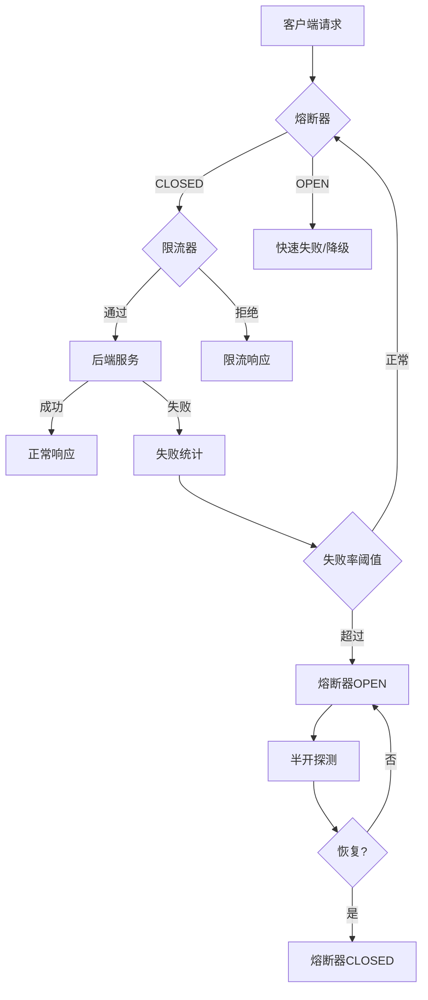

# 熔断与限流 专题文档

**文档版本**：v1.0
**创建时间**：2026年
**最后更新**：2026年
**状态**：✅ 已完成

---

## 📋 执行摘要

熔断与限流是微服务架构中保障系统高可用性的核心防护机制，通过熔断器模式防止故障扩散，通过限流算法控制系统负载，确保服务在异常场景下的稳定性。

---

## 一、核心概念

### 1.1 定义与原理

**熔断器模式（Circuit Breaker）**

熔断器模式是一种防御性设计模式，用于防止分布式系统中的级联故障。其核心思想是监控服务调用状态，当失败率达到阈值时自动"熔断"，停止向故障服务发送请求，避免资源耗尽。

**限流（Rate Limiting）**

限流是控制系统处理请求速率的机制，防止突发流量压垮服务。通过限制单位时间内的请求数量，保护系统资源，确保服务质量。

**降级（Degradation）**

降级是在系统压力过高或依赖服务故障时，主动关闭非核心功能，保证核心业务流程可用的策略。

### 1.2 关键特性

- **熔断器状态机**：CLOSED（正常）、OPEN（熔断）、HALF-OPEN（半开）三种状态的自动转换
- **自适应限流**：根据系统负载动态调整限流阈值
- **快速失败**：熔断后快速返回预设响应，减少资源占用
- **自动恢复**：熔断器半开状态下自动探测服务恢复情况
- **多维限流**：支持QPS、并发数、热点参数等多维度限流

### 1.3 适用场景

| 场景 | 适用性 | 说明 |
|------|--------|------|
| 微服务间调用保护 | ⭐⭐⭐⭐⭐ | 防止故障服务拖垮调用方 |
| 第三方API调用 | ⭐⭐⭐⭐⭐ | 控制调用频率，避免触发限流 |
| 高并发流量入口 | ⭐⭐⭐⭐⭐ | 保护系统不被突发流量压垮 |
| 资源密集型操作 | ⭐⭐⭐⭐ | 限制并发数，保护数据库/缓存 |
| 慢SQL防护 | ⭐⭐⭐⭐ | 自动熔断慢查询，保护数据库 |

---

## 二、技术细节

### 2.1 架构设计



### 2.2 限流算法原理

#### 2.2.1 令牌桶算法（Token Bucket）

**原理**：

- 系统以固定速率向桶中放入令牌
- 请求到达时从桶中取令牌，取到则处理，否则拒绝
- 桶有容量限制，可应对突发流量

```
输入：请求速率 r，桶容量 C，当前令牌数 tokens
输出：是否允许请求通过

步骤：
1. 计算当前时间与上次放令牌的时间差 Δt
2. tokens = min(C, tokens + r × Δt)
3. IF tokens >= 1 THEN
4.     tokens = tokens - 1
5.     RETURN true（允许通过）
6. ELSE
7.     RETURN false（拒绝请求）
8. END IF
```

**复杂度分析**：

- 时间复杂度：O(1)
- 空间复杂度：O(1)
- 特点：允许突发流量，平滑限流

#### 2.2.2 漏桶算法（Leaky Bucket）

**原理**：

- 请求先进入漏桶队列
- 以固定速率从桶中漏出处理
- 桶满时新请求被拒绝

```
输入：处理速率 r，桶容量 C，当前队列长度 q
输出：是否允许请求通过

步骤：
1. 计算当前时间与上次处理的时间差 Δt
2. q = max(0, q - r × Δt)
3. IF q < C THEN
4.     q = q + 1
5.     RETURN true（入桶等待处理）
6. ELSE
7.     RETURN false（桶满拒绝）
8. END IF
```

**复杂度分析**：

- 时间复杂度：O(1)
- 空间复杂度：O(C)（队列存储）
- 特点：强制平滑流量，无突发

#### 2.2.3 滑动窗口算法（Sliding Window）

**原理**：

- 将时间划分为多个小窗口
- 统计当前窗口内的请求数
- 超过阈值则拒绝

```
输入：时间窗口 T，小窗口数 n，阈值 limit
输出：是否允许请求通过

步骤：
1. 当前时间 t，计算所在小窗口索引 idx = (t / (T/n)) % n
2. IF idx != lastIdx THEN
3.     清除过期小窗口计数
4.     lastIdx = idx
5. END IF
6. total = sum(所有小窗口计数)
7. IF total < limit THEN
8.     windows[idx]++
9.     RETURN true
10. ELSE
11.    RETURN false
12. END IF
```

**复杂度分析**：

- 时间复杂度：O(n)，n为小窗口数
- 空间复杂度：O(n)
- 特点：精确统计，边界平滑

### 2.3 熔断器实现机制

**Hystrix实现**：

```java
// 熔断器核心配置
@HystrixCommand(
    fallbackMethod = "fallbackMethod",
    commandProperties = {
        // 熔断触发：10秒内20个请求，失败率50%
        @HystrixProperty(name = "circuitBreaker.requestVolumeThreshold", value = "20"),
        @HystrixProperty(name = "circuitBreaker.errorThresholdPercentage", value = "50"),
        @HystrixProperty(name = "circuitBreaker.sleepWindowInMilliseconds", value = "5000"),
        // 超时设置
        @HystrixProperty(name = "execution.isolation.thread.timeoutInMilliseconds", value = "2000")
    },
    threadPoolProperties = {
        @HystrixProperty(name = "coreSize", value = "10"),
        @HystrixProperty(name = "maxQueueSize", value = "20")
    }
)
public String callService() {
    return restTemplate.getForObject("http://service/api", String.class);
}
```

**Sentinel实现**：

```java
// 1. 定义资源
@SentinelResource(
    value = "helloResource",
    blockHandler = "handleException",
    fallback = "fallbackMethod"
)
public String hello(String name) {
    return "Hello " + name;
}

// 2. 配置规则（可通过控制台动态配置）
public void initFlowRules() {
    List<FlowRule> rules = new ArrayList<>();

    // 限流规则：QPS限制为10
    FlowRule flowRule = new FlowRule();
    flowRule.setResource("helloResource");
    flowRule.setGrade(RuleConstant.FLOW_GRADE_QPS);
    flowRule.setCount(10);
    rules.add(flowRule);

    // 熔断规则：慢调用比例熔断
    DegradeRule degradeRule = new DegradeRule();
    degradeRule.setResource("helloResource");
    degradeRule.setGrade(RuleConstant.DEGRADE_GRADE_RT);
    degradeRule.setCount(100); // RT阈值100ms
    degradeRule.setTimeWindow(10); // 熔断时长10s
    degradeRule.setMinRequestAmount(5);
    degradeRule.setSlowRatioThreshold(0.5); // 慢调用比例50%
    rules.add(degradeRule);

    FlowRuleManager.loadRules(rules);
}
```

**降级策略实现**：

```java
@Component
public class ServiceDegradation {

    // 读取降级 - 返回缓存数据
    public User getUserFallback(Long userId) {
        return cacheManager.get("user:" + userId);
    }

    // 写入降级 - 异步补偿
    public void saveUserFallback(User user) {
        // 写入消息队列，后续补偿处理
        mqProducer.send("user-save-delay", user);
    }

    // 计算降级 - 返回默认值
    public BigDecimal calculatePriceFallback(Order order) {
        // 返回基础价格，放弃优惠活动
        return order.getBasePrice();
    }

    // 功能降级 - 关闭非核心功能
    public void degradeNonCoreFeatures() {
        featureFlags.disable("recommendation");
        featureFlags.disable("realtime-stats");
        featureFlags.disable("push-notification");
    }
}
```

---

## 三、系统对比

### 3.1 Hystrix vs Sentinel 对比矩阵

| 维度 | Hystrix | Sentinel |
|------|---------|----------|
| 维护状态 | 已停止维护（进入维护模式） | 阿里云开源，持续活跃 |
| 限流能力 | 基于线程池/信号量 | 丰富的限流策略（QPS/并发/热点） |
| 熔断策略 | 基于异常比例 | 慢调用比例、异常比例、异常数 |
| 控制台 | 无原生控制台 | 完善的可视化控制台 |
| 规则配置 | 代码/配置文件 | 动态配置，支持推/拉模式 |
| 自适应限流 | 不支持 | 支持系统自适应保护 |
| 扩展性 | 一般 | 高度可扩展（Slot Chain） |
| 性能 | 较好 | 优秀（单机QPS可达数万） |
| 社区生态 | Netflix生态 | 阿里巴巴生态，Spring Cloud Alibaba |

### 3.2 限流算法对比

| 算法 | 突发流量 | 平滑性 | 精度 | 实现复杂度 | 适用场景 |
|------|----------|--------|------|------------|----------|
| 令牌桶 | 允许 | 好 | 高 | 低 | 需要应对突发的场景 |
| 漏桶 | 不允许 | 强制 | 高 | 中 | 严格平滑输出场景 |
| 滑动窗口 | 可控 | 较好 | 极高 | 中 | 精确统计场景 |
| 固定窗口 | 可能超发 | 差 | 低 | 低 | 简单统计场景 |

### 3.3 选型决策树

```
是否需要熔断保护?
├── 是
│   ├── 是否已使用Spring Cloud Netflix?
│   │   ├── 是 → 短期内可用Hystrix，长期迁移至Sentinel
│   │   └── 否 → Sentinel（推荐）
│   └── 需要多语言支持?
│       ├── 是 → Sentinel（支持Java/Go/C++）
│       └── 否 → Sentinel或Resilience4j
└── 否 → 仅需限流
    ├── 需要热点参数限流?
    │   ├── 是 → Sentinel
    │   └── 否 → Guava RateLimiter或自定义实现
```

---

## 四、实践指南

### 4.1 Sentinel 部署配置

```yaml
# application.yml
spring:
  cloud:
    sentinel:
      transport:
        dashboard: localhost:8858  # 控制台地址
        port: 8719  # 应用与控制台通信端口
      datasource:
        # Nacos配置中心动态规则
        flow:
          nacos:
            server-addr: ${spring.cloud.nacos.discovery.server-addr}
            data-id: ${spring.application.name}-flow-rules
            group-id: SENTINEL_GROUP
            rule-type: flow
        degrade:
          nacos:
            server-addr: ${spring.cloud.nacos.discovery.server-addr}
            data-id: ${spring.application.name}-degrade-rules
            group-id: SENTINEL_GROUP
            rule-type: degrade
      # 开启上下文整合
      web-context-unify: true
      # 过滤静态资源
      filter:
        enabled: true
        url-patterns: /**
```

### 4.2 最佳实践

1. **合理设置熔断阈值**
   - 失败率阈值建议50%-70%，避免过于敏感
   - 熔断窗口5-30秒，给服务恢复时间
   - 最小请求数设置，防止低流量误熔断

2. **分级限流策略**
   - 接口级：核心接口放宽，非核心收紧
   - 用户级：防止单个用户刷接口
   - 系统级：保护整体稳定性

3. **降级预案设计**
   - 提前定义降级场景和触发条件
   - 核心业务必须有降级方案
   - 定期演练降级切换

4. **监控与告警**
   - 监控熔断器状态变化
   - 限流触发实时告警
   - 统计降级执行次数

### 4.3 常见问题

**Q1: 熔断器和限流应该先用哪个？**
A: 请求先经过限流器，再经过熔断器。限流保护系统不被压垮，熔断防止故障扩散。

**Q2: 熔断后如何快速恢复？**
A: Sentinel/Hystrix会在熔断窗口后进入半开状态，放少量请求试探，成功后关闭熔断。

**Q3: 如何避免降级雪崩？**
A: 设置合理的降级优先级，核心业务优先保障；使用多级降级策略；配置降级超时。

**Q4: 热点参数限流如何实现？**
A: Sentinel支持基于参数的热点限流，可针对特定参数值（如用户ID、商品ID）进行限流。

---

## 五、形式化分析

### 5.1 熔断器状态机模型

```
状态集合 S = {CLOSED, OPEN, HALF_OPEN}
输入事件 E = {Success, Failure, Timeout}

状态转移函数 δ:
- δ(CLOSED, FailureCount > Threshold) → OPEN
- δ(OPEN, TimerExpired) → HALF_OPEN
- δ(HALF_OPEN, Success) → CLOSED
- δ(HALF_OPEN, Failure) → OPEN
- δ(CLOSED, Success) → CLOSED
```

### 5.2 令牌桶正确性证明

**定理**：令牌桶算法保证长期平均速率不超过令牌产生速率 r。

**证明**：
设令牌产生速率为 r，在任意时间区间 [0,T] 内，产生的令牌数为 rT + C（C为初始令牌数）。
每通过一次请求消耗1个令牌，因此通过请求数 ≤ rT + C。
长期平均速率 = lim(T→∞) (rT + C) / T = r。

---

## 六、与其他主题的关联

### 6.1 上游依赖

- [负载均衡](../load-balancing.md) - 熔断器与负载均衡协同工作
- [服务注册发现](../service-discovery.md) - 故障服务自动剔除

### 6.2 下游应用

- [监控告警](../monitoring.md) - 熔断/限流事件监控
- [日志追踪](../tracing.md) - 降级请求标记追踪

### 6.3 相关概念

| 概念 | 关系 | 说明 |
|------|------|------|
| 负载均衡 | 配合 | 熔断后从负载均衡池剔除 |
| 服务网格 | 替代 | Istio可替代应用层熔断 |
| 网关限流 | 互补 | 网关层+应用层双层防护 |

---

## 七、参考资源

### 7.1 学术论文

1. [Circuit Breaker Pattern](https://martinfowler.com/bliki/CircuitBreaker.html) - Martin Fowler
2. [Release It!](https://pragprog.com/titles/mnee2/) - Michael T. Nygard

### 7.2 开源项目

1. [Sentinel](https://github.com/alibaba/Sentinel) - 阿里巴巴流量控制组件
2. [Hystrix](https://github.com/Netflix/Hystrix) - Netflix熔断器（维护模式）
3. [Resilience4j](https://github.com/resilience4j/resilience4j) - 轻量级容错库
4. [Limiter](https://github.com/golang/go/wiki/RateLimiting) - Go限流实现

### 7.3 学习资料

1. [Sentinel官方文档](https://sentinelguard.io/zh-cn/)
2. [阿里巴巴微服务实践](https://developer.aliyun.com/article/)
3. [Google SRE Book - Handling Overload](https://sre.google/sre-book/handling-overload/)

### 7.4 相关文档

- [配置中心](./配置中心.md)
- [分布式ID生成](./分布式ID生成.md)

---

**维护者**：项目团队
**最后更新**：2026年
