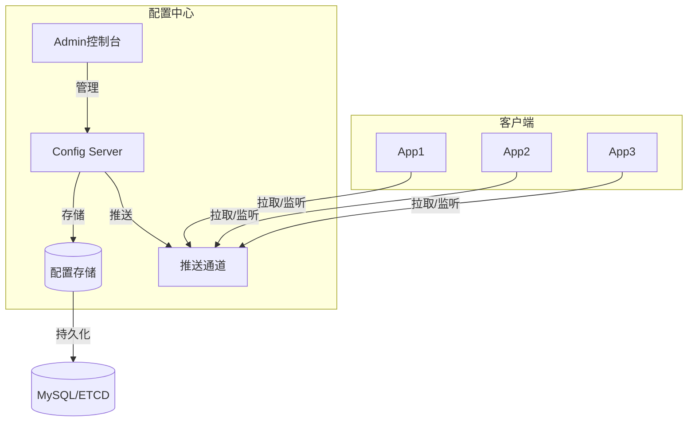

# 配置中心 专题文档

**文档版本**：v1.0
**创建时间**：2026年
**最后更新**：2026年
**状态**：✅ 已完成

---

## 📋 执行摘要

配置中心是微服务架构中的基础设施组件，集中管理应用配置，支持动态刷新、多环境隔离、版本控制等能力。主流方案包括Apollo、Nacos、Consul、Spring Cloud Config，选型需综合考虑功能、性能、生态和运维成本。

---

## 一、核心概念

### 1.1 定义与原理

**配置中心**是集中管理应用程序配置的中间件，解决传统配置文件分散、难以统一管理的问题。

**核心能力**：

- **集中管理**：统一界面管理所有服务配置
- **动态推送**：配置变更实时推送到客户端
- **多环境支持**：开发、测试、生产环境隔离
- **版本控制**：配置历史版本追溯和回滚
- **灰度发布**：配置变更按实例或集群分批发布

### 1.2 关键特性

- **实时性**：配置变更秒级生效
- **一致性**：集群内配置保持一致
- **高可用**：配置服务多副本部署
- **安全性**：配置加密、权限控制
- **易用性**：可视化界面，操作简单

### 1.3 适用场景

| 场景 | 适用性 | 说明 |
|------|--------|------|
| 微服务配置管理 | ⭐⭐⭐⭐⭐ | 统一管理数十个服务配置 |
| 动态参数调整 | ⭐⭐⭐⭐⭐ | 线程池大小、限流阈值实时调整 |
| 多环境部署 | ⭐⭐⭐⭐⭐ | 环境配置隔离，一键切换 |
| 灰度发布 | ⭐⭐⭐⭐ | 按实例灰度推送配置 |
| 敏感信息加密 | ⭐⭐⭐⭐ | 数据库密码等加密存储 |

---

## 二、技术细节

### 2.1 架构设计



### 2.2 系统架构详解

#### 2.2.1 Apollo架构

**组件组成**：

```
┌─────────────────────────────────────────────────────────────┐
│                        Apollo架构                           │
├─────────────┬─────────────┬─────────────┬───────────────────┤
│  Portal     │  Admin      │  Config     │  Client           │
│  (管理界面)  │  (管理服务)  │  (配置服务)  │  (客户端)          │
├─────────────┼─────────────┼─────────────┼───────────────────┤
│ • 配置管理   │ • 配置修改   │ • 配置读取   │ • 配置拉取         │
│ • 发布审批   │ • 权限控制   │ • 推送通知   │ • 本地缓存         │
│ • 灰度发布   │ • 审计日志   │ • 服务发现   │ • 实时更新         │
└─────────────┴─────────────┴─────────────┴───────────────────┘
        │            │            │              │
        └────────────┴────────────┴──────────────┘
                         │
                   ┌─────┴─────┐
                   │  MySQL    │
                   │  (元数据)  │
                   └───────────┘
```

**部署架构**：

```yaml
# docker-compose.yml
version: '3'
services:
  apollo-configservice:
    image: apolloconfig/apollo-configservice:2.1.0
    environment:
      - SPRING_DATASOURCE_URL=jdbc:mysql://mysql:3306/ApolloConfigDB
      - SPRING_DATASOURCE_USERNAME=apollo
      - SPRING_DATASOURCE_PASSWORD=apollo
    ports:
      - "8080:8080"

  apollo-adminservice:
    image: apolloconfig/apollo-adminservice:2.1.0
    environment:
      - SPRING_DATASOURCE_URL=jdbc:mysql://mysql:3306/ApolloConfigDB
    ports:
      - "8090:8090"

  apollo-portal:
    image: apolloconfig/apollo-portal:2.1.0
    environment:
      - SPRING_DATASOURCE_URL=jdbc:mysql://mysql:3306/ApolloPortalDB
      - APOLLO_PORTAL_ENVS=dev,pro
    ports:
      - "8070:8070"
```

**Java客户端使用**：

```java
// 1. 配置
@Configuration
public class ApolloConfig {

    @Bean
    public ApolloConfigBean apolloConfigBean() {
        return new ApolloConfigBean();
    }

    // 2. 注解方式获取配置
    @Value("${timeout:3000}")
    private int timeout;

    // 3. 监听配置变更
    @ApolloConfigChangeListener
    public void onChange(ConfigChangeEvent event) {
        for (String key : event.changedKeys()) {
            ConfigChange change = event.getChange(key);
            System.out.println("配置变更: " + key + " = " + change.getNewValue());
        }
    }
}

// 4. API方式获取
@Component
public class ConfigService {
    @Autowired
    private ApolloConfigBean config;

    public String getConfig(String key) {
        return ConfigService.getAppConfig().getProperty(key, "default");
    }
}
```

#### 2.2.2 Nacos配置

**架构特点**：

- 配置管理 + 服务发现一体化
- 支持多种配置格式（YAML、Properties、JSON）
- 长轮询实现配置推送

**部署配置**：

```yaml
# application.yml
spring:
  application:
    name: order-service
  cloud:
    nacos:
      config:
        server-addr: 127.0.0.1:8848
        namespace: dev  # 命名空间隔离
        group: DEFAULT_GROUP
        file-extension: yaml
        # 共享配置
        shared-configs:
          - data-id: common.yaml
            group: DEFAULT_GROUP
            refresh: true
        # 扩展配置
        extension-configs:
          - data-id: redis.yaml
            group: DEFAULT_GROUP
            refresh: true
      discovery:
        server-addr: 127.0.0.1:8848
```

**动态配置刷新**：

```java
@RestController
@RefreshScope  // 关键注解，配置变更时自动刷新
public class OrderController {

    @Value("${order.timeout:5000}")
    private int timeout;

    @Value("${order.max-retry:3}")
    private int maxRetry;

    @GetMapping("/config")
    public Map<String, Object> getConfig() {
        Map<String, Object> config = new HashMap<>();
        config.put("timeout", timeout);
        config.put("maxRetry", maxRetry);
        return config;
    }
}
```

#### 2.2.3 Consul配置

**架构特点**：

- 服务网格一体化
- KV存储 + 健康检查
- Watch机制推送变更

**配置使用**：

```yaml
# bootstrap.yml
spring:
  application:
    name: my-service
  cloud:
    consul:
      host: localhost
      port: 8500
      config:
        enabled: true
        format: yaml  # 或 properties/json
        prefix: config
        default-context: application
        profile-separator: '::'
        # 配置文件: config/my-service::dev/data
```

**配置结构**：

```
consul kv 结构：
config/
├── application/           # 公共配置
│   └── data
├── my-service/          # 服务默认配置
│   └── data
├── my-service::dev/     # dev环境配置
│   └── data
└── my-service::prod/    # prod环境配置
    └── data
```

#### 2.2.4 Spring Cloud Config

**架构特点**：

- 基于Git的配置存储
- 天然支持版本控制
- 与Spring生态深度集成

**服务端配置**：

```yaml
# config-server.yml
server:
  port: 8888

spring:
  application:
    name: config-server
  cloud:
    config:
      server:
        git:
          uri: https://github.com/mycompany/config-repo
          username: ${GIT_USERNAME}
          password: ${GIT_PASSWORD}
          default-label: main
          search-paths: '{application}'
          # 本地缓存
          basedir: /tmp/config-repo
```

**客户端配置**：

```yaml
# bootstrap.yml（优先加载）
spring:
  application:
    name: order-service
  profiles:
    active: dev
  cloud:
    config:
      uri: http://localhost:8888
      fail-fast: true
      retry:
        initial-interval: 1000
        max-attempts: 6
```

**配置仓库结构**：

```
config-repo/
├── application.yml          # 公共配置
├── order-service.yml        # order服务默认配置
├── order-service-dev.yml    # dev环境
├── order-service-prod.yml   # prod环境
├── user-service.yml
└── user-service-dev.yml
```

**动态刷新**：

```java
@RestController
@RefreshScope
public class ConfigController {
    @Value("${message:Hello}")
    private String message;

    @PostMapping("/refresh")
    public String refresh() {
        // 触发刷新（或使用Spring Cloud Bus自动刷新）
        return message;
    }
}
```

---

## 三、系统对比

### 3.1 功能对比矩阵

| 维度 | Apollo | Nacos | Consul | Spring Cloud Config |
|------|--------|-------|--------|---------------------|
| 配置管理 | ⭐⭐⭐⭐⭐ | ⭐⭐⭐⭐ | ⭐⭐⭐⭐ | ⭐⭐⭐⭐ |
| 动态推送 | 推/拉 | 长轮询 | Watch | 依赖Bus |
| 版本管理 | ⭐⭐⭐⭐⭐ | ⭐⭐⭐ | ⭐⭐ | ⭐⭐⭐⭐⭐(Git) |
| 灰度发布 | ⭐⭐⭐⭐⭐ | ⭐⭐⭐ | ⭐⭐ | ⭐⭐ |
| 权限控制 | ⭐⭐⭐⭐⭐ | ⭐⭐⭐ | ⭐⭐⭐ | ⭐⭐ |
| 配置加密 | ⭐⭐⭐⭐ | ⭐⭐⭐ | ⭐⭐ | ⭐⭐⭐ |
| 服务发现 | ❌ | ⭐⭐⭐⭐⭐ | ⭐⭐⭐⭐⭐ | ❌ |
| 多语言支持 | ⭐⭐⭐⭐ | ⭐⭐⭐⭐ | ⭐⭐⭐⭐⭐ | ⭐⭐⭐ |
| 控制台体验 | ⭐⭐⭐⭐⭐ | ⭐⭐⭐⭐ | ⭐⭐⭐ | ⭐⭐ |

### 3.2 性能基准

| 指标 | Apollo | Nacos | Consul | SCC |
|------|--------|-------|--------|-----|
| 配置推送延迟 | <1s | <1s | <100ms | 依赖Bus |
| 单机QPS | 10000+ | 10000+ | 5000+ | 3000+ |
| 支持集群规模 | 10000+ | 10000+ | 5000 | 5000 |
| 存储方式 | MySQL | 内存+MySQL | 内存+Raft | Git |

### 3.3 选型决策树

```
是否使用Spring Cloud Alibaba？
├── 是 → Nacos（一体化方案）
└── 否
    ├── 是否需要强版本管理？
    │   ├── 是
    │   │   ├── 是否需要灰度发布？
    │   │   │   ├── 是 → Apollo
    │   │   │   └── 否 → Spring Cloud Config
    │   └── 否
    │       └── 是否已有Consul？
    │           ├── 是 → Consul
    │           └── 否 → Apollo
    └── 是否需要服务网格？
        ├── 是 → Consul或Nacos
        └── 否 → 继续其他判断
```

---

## 四、实践指南

### 4.1 高可用部署

**Apollo高可用**：

```yaml
# 生产环境建议部署
# 1. ConfigService × 2+（负载均衡）
# 2. AdminService × 2+
# 3. Portal × 2+
# 4. MySQL 主从 + 定时备份

# K8s部署示例
apiVersion: apps/v1
kind: Deployment
metadata:
  name: apollo-configservice
spec:
  replicas: 2
  selector:
    matchLabels:
      app: apollo-configservice
  template:
    spec:
      containers:
        - name: configservice
          image: apolloconfig/apollo-configservice:2.1.0
          env:
            - name: SPRING_DATASOURCE_URL
              value: "jdbc:mysql://mysql-cluster:3306/ApolloConfigDB"
---
apiVersion: v1
kind: Service
metadata:
  name: apollo-configservice
spec:
  selector:
    app: apollo-configservice
  ports:
    - port: 8080
  type: ClusterIP
```

**Nacos高可用**：

```yaml
# nacos集群部署（3节点）
nacos:
  image: nacos/nacos-server:v2.2.3
  env:
    - MODE=cluster
    - NACOS_SERVERS=nacos1:8848 nacos2:8848 nacos3:8848
    - SPRING_DATASOURCE_PLATFORM=mysql
    - MYSQL_SERVICE_HOST=mysql
    - MYSQL_SERVICE_DB_NAME=nacos
  volumes:
    - ./cluster.conf:/home/nacos/conf/cluster.conf
```

### 4.2 配置安全实践

**敏感信息加密（Apollo）**：

```java
// 1. 添加加密依赖
// apollo-client-extension

// 2. 配置加密密钥
@Configuration
public class EncryptionConfig {
    @Bean
    public ApolloConfigEncryption apolloConfigEncryption() {
        return new ApolloConfigEncryption("your-secret-key");
    }
}

// 3. 配置文件中存储密文
// db.password = ENC(加密后的密文)
```

**Spring Cloud Config + Vault**：

```yaml
spring:
  cloud:
    config:
      server:
        vault:
          host: vault.example.com
          port: 8200
          scheme: https
          backend: secret
          default-key: application
```

### 4.3 最佳实践

1. **命名规范**

   ```
   应用名：service-name（小写，连字符）
   命名空间：env（dev/test/prod）
   配置Key：category.subKey（点分隔，小驼峰）
   示例：database.connection.timeout
   ```

2. **配置分层**
   - 公共配置：所有服务共享（如日志级别）
   - 服务配置：单个服务通用配置
   - 环境配置：特定环境覆盖

3. **变更管理**
   - 配置变更走审批流程
   - 生产变更灰度发布
   - 配置版本定期备份

4. **监控告警**
   - 配置推送成功率监控
   - 配置中心服务健康检查
   - 配置变更审计日志

### 4.4 常见问题

**Q1: 配置不生效怎么办？**
A: 检查：1)命名空间/Group是否正确；2)配置文件格式；3)客户端缓存；4)服务端配置是否发布。

**Q2: 如何实现多环境配置隔离？**
A: Apollo使用Cluster+Namespace；Nacos使用Namespace；Consul使用KV路径；SCC使用Git分支。

**Q3: 配置中心挂了怎么办？**
A: 客户端都有本地缓存，可降级使用本地配置；Apollo支持容灾目录；Nacos使用本地快照。

**Q4: 如何监听配置变更？**
A: Apollo使用@ApolloConfigChangeListener；Nacos使用@NacosConfigListener；Consul使用Watch；SCC使用@RefreshScope。

---

## 五、形式化分析

### 5.1 配置一致性模型

**Apollo**：

- 发布-订阅模型
- 最终一致性（客户端缓存）
- 发布时生成ReleaseKey，客户端比对拉取

**Nacos**：

- 长轮询 + 本地文件快照
- 配置MD5校验
- 服务端推送变更通知

**一致性级别**：

- 强一致性：配置发布后所有客户端立即生效
- 最终一致性：允许短暂不一致，最终达到一致

---

## 六、与其他主题的关联

### 6.1 上游依赖

- [服务注册发现](../service-discovery.md) - Nacos/Consul一体化
- [监控告警](../monitoring.md) - 配置中心监控

### 6.2 下游应用

- [熔断与限流](./熔断与限流.md) - 限流规则动态配置
- [分布式ID生成](./分布式ID生成.md) - WorkerID配置

### 6.3 相关概念

| 概念 | 关系 | 说明 |
|------|------|------|
| 服务网格 | 扩展 | Consul可集成Istio |
| GitOps | 配合 | Config + Git实现GitOps |
| 配置加密 | 安全 | Vault集成敏感配置 |

---

## 七、参考资源

### 7.1 学术论文

1. [Dynamic Configuration Management](https://www.usenix.org/) - USENIX
2. [Configuration Management at Scale](https://research.google/) - Google Research

### 7.2 开源项目

1. [Apollo](https://github.com/apolloconfig/apollo) - 携程配置中心
2. [Nacos](https://github.com/alibaba/nacos) - 阿里巴巴配置中心
3. [Consul](https://github.com/hashicorp/consul) - HashiCorp
4. [Spring Cloud Config](https://github.com/spring-cloud/spring-cloud-config) - Spring官方

### 7.3 学习资料

1. [Apollo官方文档](https://www.apolloconfig.com/)
2. [Nacos官方文档](https://nacos.io/zh-cn/docs/what-is-nacos.html)
3. [Consul官方文档](https://www.consul.io/docs)

### 7.4 相关文档

- [熔断与限流](./熔断与限流.md)
- [分布式Session](./分布式Session.md)

---

**维护者**：项目团队
**最后更新**：2026年
