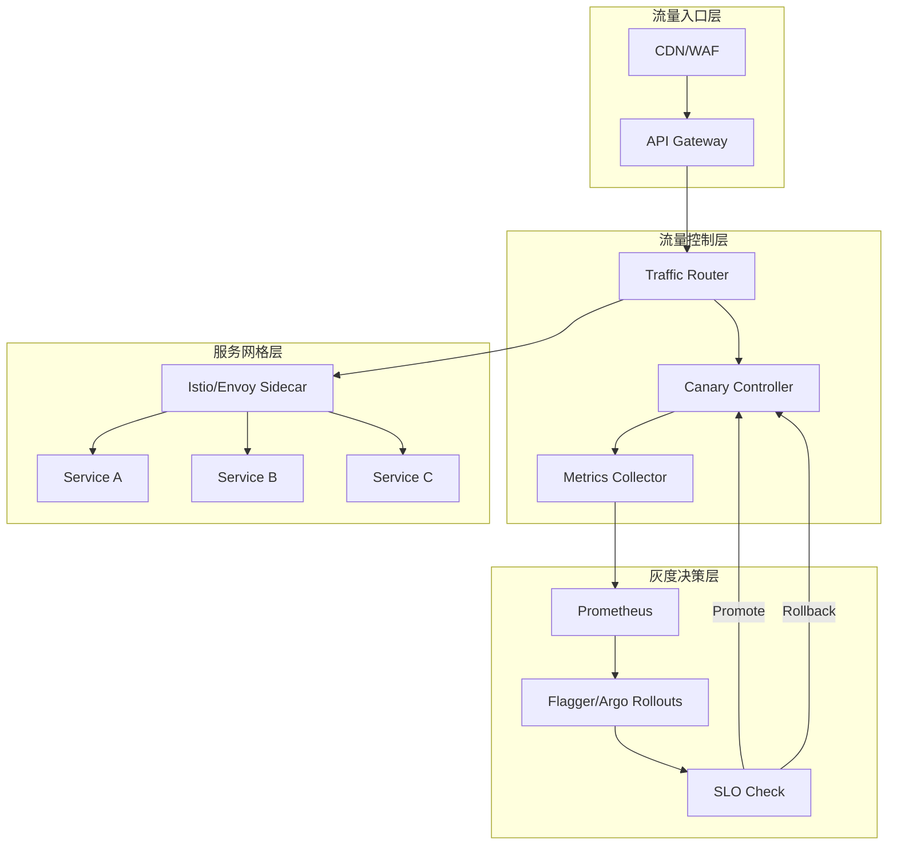
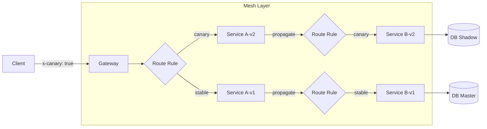

# 链路治理与灰度发布 专题文档

**文档版本**：v1.0
**创建时间**：2026年
**最后更新**：2026年
**状态**：✅ 已完成

---

## 📋 执行摘要

链路治理与灰度发布是微服务架构中保障变更安全、降低发布风险的核心能力。通过金丝雀发布、蓝绿部署、全链路灰度、A/B测试和Feature Toggle等技术组合，实现渐进式交付、流量精确控制和功能快速迭代，将发布风险降至最低。

---

## 一、核心概念

### 1.1 定义与原理

#### 灰度发布（Canary Release）

**定义**：将新版本服务逐步引入生产环境，先小流量验证，再全量发布。

**核心原理**：

```
流量分配模型:
Phase 1: 100% → v1.0.0 (当前版本)
Phase 2: 95%  → v1.0.0 + 5% → v1.1.0 (金丝雀)
Phase 3: 90%  → v1.0.0 + 10% → v1.1.0
Phase 4: 0%   → v1.0.0 + 100% → v1.1.0 (全量)
```

**决策指标**：

- 错误率 < 阈值（如1%）
- P99延迟 < 阈值（如500ms）
- 业务成功率 > 阈值（如99.5%）

#### 蓝绿部署（Blue-Green Deployment）

**定义**：同时维护两个相同的生产环境（蓝/绿），通过切换流量实现零停机发布。

**核心原理**：

```
时间线:
T0: Blue(100%流量)  ← 生产环境
    Green(0%流量)   ← 新版本待验证

T1: Blue(100%)
    Green(部署v2.0, 验证中)

T2: Blue(0%)        ← 切换流量
    Green(100%)     ← 新版本上线

T3: Blue(保留备份)  ← 快速回滚能力
    Green(100%)
```

#### 全链路灰度（End-to-End Canary）

**定义**：确保灰度流量在微服务全链路中始终路由到灰度版本。

**核心挑战**：

- 流量染色：标识灰度流量
- 标签透传：跨服务传递灰度标识
- 路由策略：根据标签精确路由

```
请求路径:
[User]
  → [Gateway] (识别Header: x-canary=true)
    → [Service A-v2] (处理灰度请求)
      → [Service B-v2] (必须路由到v2)
        → [Service C-v2]
      → [Service D-v2]
    → [Database] (可能需数据隔离)
```

#### A/B测试

**定义**：同时运行多个版本，根据用户特征分流，对比业务指标。

**与灰度发布的区别**：

| 维度 | 灰度发布 | A/B测试 |
|------|----------|---------|
| **目的** | 降低发布风险 | 验证业务假设 |
| **分组** | 随机/比例 | 按用户特征 |
| **观察** | 技术指标 | 业务指标（转化率等） |
| **时长** | 短（分钟/小时） | 长（天/周） |
| **结论** | 回滚或继续 | 选择更优方案 |

#### Feature Toggle（功能开关）

**定义**：通过配置动态控制功能开启/关闭，实现代码发布与功能上线的解耦。

**分类**：

- **Release Toggle**：灰度发布控制
- **Experiment Toggle**：A/B测试控制
- **Ops Toggle**：运维应急开关
- **Permission Toggle**：权限控制

### 1.2 关键特性

**金丝雀发布**：

- **渐进式放量**：精确控制流量比例
- **自动回滚**：指标异常自动回退
- **多维度分流**：支持Header、Cookie、权重等
- **观测集成**：与监控告警联动

**蓝绿部署**：

- **零停机切换**：瞬间完成流量切换
- **快速回滚**：秒级回退到旧版本
- **预验证**：生产环境预发布验证
- **双倍资源**：需要2倍基础设施

**全链路灰度**：

- **流量染色**：请求级别灰度标识
- **标签透传**：跨进程、跨协议传递
- **一致性保证**：数据隔离或兼容性处理
- **动态路由**：无需修改代码更新路由规则

### 1.3 适用场景

| 场景 | 金丝雀 | 蓝绿 | 全链路灰度 | A/B测试 | Feature Toggle | 说明 |
|------|--------|------|-----------|---------|----------------|------|
| 日常迭代 | ⭐⭐⭐⭐⭐ | ⭐⭐ | ⭐⭐⭐⭐ | ⭐ | ⭐⭐⭐ | 常规功能发布 |
| 重大变更 | ⭐⭐⭐⭐ | ⭐⭐⭐⭐⭐ | ⭐⭐⭐⭐⭐ | ⭐ | ⭐⭐⭐⭐ | 架构升级、重构 |
| 数据库变更 | ⭐⭐ | ⭐ | ⭐⭐⭐⭐⭐ | ⭐ | ⭐⭐⭐ | 需要考虑数据兼容 |
| UI优化 | ⭐⭐⭐ | ⭐ | ⭐ | ⭐⭐⭐⭐⭐ | ⭐⭐⭐⭐ | 用户体验验证 |
| 算法实验 | ⭐ | ⭐ | ⭐ | ⭐⭐⭐⭐⭐ | ⭐⭐⭐ | 推荐/搜索算法 |
| 紧急修复 | ⭐⭐ | ⭐⭐⭐⭐⭐ | ⭐⭐ | ⭐ | ⭐⭐⭐⭐⭐ | 快速回滚能力 |

---

## 二、技术细节

### 2.1 架构设计

#### 灰度发布系统架构



#### 全链路灰度架构



### 2.2 算法原理

#### 流量分配算法

**基于权重的随机分配**：

```
输入: 灰度比例 p ∈ [0, 1]
输出: 目标版本

function route(request):
    if request.has_header("x-canary"):
        return canary_version

    random = hash(request.user_id) % 100
    if random < p * 100:
        return canary_version
    else:
        return stable_version
```

**基于哈希的一致性路由**：

```
确保同一用户始终路由到同一版本

bucket = hash(user_id) % 100
if bucket < canary_percentage:
    return canary_version
```

#### 自动推进算法

```
输入: 当前流量比例 p, 目标比例 target, 步长 step
      错误率阈值 error_threshold, 延迟阈值 latency_threshold

function promote():
    metrics = collect_metrics(last_interval)

    if metrics.error_rate > error_threshold:
        rollback()
        return

    if metrics.p99_latency > latency_threshold:
        rollback()
        return

    if p < target:
        p = min(p + step, target)
        update_traffic_split(p)
        schedule_next_promote()
    else:
        finalize_canary()
```

#### 全链路标签透传

**传播机制**：

```
┌─────────────┐
│ HTTP Header │ x-canary: true
│             │ x-request-id: uuid
└──────┬──────┘
       │
       ▼
┌─────────────┐
│ gRPC Meta   │ context.WithValue(ctx, "canary", true)
│             │ metadata.AppendOutgoingContext
└──────┬──────┘
       │
       ▼
┌─────────────┐
│ MQ Message  │ Message Properties
│             │ { "x-canary": "true" }
└──────┬──────┘
       │
       ▼
┌─────────────┐
│ DB Query    │ SQL Comment
│             │ /* canary=true */
└─────────────┘
```

### 2.3 实现机制

#### Istio实现金丝雀发布

```yaml
# VirtualService - 流量分割
apiVersion: networking.istio.io/v1beta1
kind: VirtualService
metadata:
  name: reviews
spec:
  hosts:
    - reviews
  http:
    - match:
        - headers:
            end-user:
              exact: jason
      route:
        - destination:
            host: reviews
            subset: v2
    - route:
        - destination:
            host: reviews
            subset: v1
          weight: 90
        - destination:
            host: reviews
            subset: v2
          weight: 10

---
# DestinationRule - 版本定义
apiVersion: networking.istio.io/v1beta1
kind: DestinationRule
metadata:
  name: reviews
spec:
  host: reviews
  subsets:
    - name: v1
      labels:
        version: v1
    - name: v2
      labels:
        version: v2
```

#### Flagger自动化金丝雀

```yaml
apiVersion: flagger.app/v1beta1
kind: Canary
metadata:
  name: podinfo
  namespace: test
spec:
  targetRef:
    apiVersion: apps/v1
    kind: Deployment
    name: podinfo
  service:
    port: 9898
    gateways:
      - istio-gateway
    hosts:
      - app.example.com
  analysis:
    interval: 1m           # 分析间隔
    threshold: 5           # 失败阈值
    maxWeight: 50          # 最大灰度流量比例
    stepWeight: 10         # 每次增加比例
    metrics:
      - name: request-success-rate
        thresholdRange:
          min: 99
        interval: 1m
      - name: request-duration
        thresholdRange:
          max: 500
        interval: 1m
    webhooks:
      - name: load-test
        url: http://flagger-loadtester.test/
        timeout: 5s
        metadata:
          cmd: "hey -z 1m -q 10 -c 2 http://app.example.com/"
      - name: conformance-test
        type: pre-rollout
        url: http://flagger-loadtester.test/
        timeout: 30s
        metadata:
          type: bash
          cmd: "curl -sf http://podinfo-canary.test:9898/health"
```

#### Argo Rollouts蓝绿部署

```yaml
apiVersion: argoproj.io/v1alpha1
kind: Rollout
metadata:
  name: rollout-bluegreen
spec:
  replicas: 3
  strategy:
    blueGreen:
      activeService: rollout-bluegreen-active    # 生产Service
      previewService: rollout-bluegreen-preview  # 预览Service
      autoPromotionEnabled: false                 # 手动推进
      autoPromotionSeconds: 30                   # 或自动等待30秒
      maxUnavailable: 0                          # 零停机
      scaleDownDelaySeconds: 30                  # 旧版本保留时间
      scaleDownDelayRevisionLimit: 2             # 保留版本数
      prePromotionAnalysis:
        templates:
          - templateName: smoke-tests
        args:
          - name: service-name
            value: rollout-bluegreen-preview
      postPromotionAnalysis:
        templates:
          - templateName: integration-tests
  selector:
    matchLabels:
      app: rollout-bluegreen
  template:
    metadata:
      labels:
        app: rollout-bluegreen
    spec:
      containers:
        - name: rollouts-demo
          image: argoproj/rollouts-demo:blue
          ports:
            - containerPort: 8080
```

#### 全链路灰度实现

```yaml
# Istio EnvoyFilter实现标签透传
apiVersion: networking.istio.io/v1alpha3
kind: EnvoyFilter
metadata:
  name: propagation-filter
  namespace: istio-system
spec:
  configPatches:
    - applyTo: HTTP_FILTER
      match:
        context: SIDECAR_INBOUND
        listener:
          filterChain:
            filter:
              name: envoy.filters.network.http_connection_manager
      patch:
        operation: INSERT_BEFORE
        value:
          name: envoy.lua
          typed_config:
            "@type": type.googleapis.com/envoy.extensions.filters.http.lua.v3.Lua
            source_code:
              inline_string: |
                function envoy_on_request(request_handle)
                  -- 从Header提取并设置到metadata
                  local canary = request_handle:headers():get("x-canary")
                  if canary then
                    request_handle:streamInfo():dynamicMetadata():set("envoy.filters.http.ext_authz", "canary", canary)
                  end
                end
```

**应用层标签透传示例（Java）**：

```java
@Component
public class CanaryPropagationInterceptor implements ClientHttpRequestInterceptor {

    @Override
    public ClientHttpResponse intercept(HttpRequest request, byte[] body,
                                        ClientHttpRequestExecution execution) throws IOException {
        // 从当前上下文获取canary标识
        String canary = CanaryContext.getCurrentCanary();
        if (canary != null) {
            request.getHeaders().add("x-canary", canary);
        }
        return execution.execute(request, body);
    }
}

// Feign客户端拦截器
public class FeignCanaryInterceptor implements RequestInterceptor {
    @Override
    public void apply(RequestTemplate template) {
        String canary = CanaryContext.getCurrentCanary();
        if (canary != null) {
            template.header("x-canary", canary);
        }
    }
}
```

---

## 三、系统对比

### 3.1 发布策略对比矩阵

| 维度 | 金丝雀发布 | 蓝绿部署 | 滚动更新 | 红黑部署 |
|------|-----------|----------|----------|----------|
| **资源占用** | 110-150% | 200% | 100% | 200% |
| **发布速度** | 慢（渐进） | 快（瞬间） | 中 | 快 |
| **回滚速度** | 快 | 极快 | 中 | 极快 |
| **风险程度** | 低 | 低 | 中 | 低 |
| **用户体验** | 部分用户受影响 | 无感知 | 可能有中断 | 无感知 |
| **技术复杂度** | 中 | 中 | 低 | 高 |
| **适用场景** | 常规发布 | 关键发布 | 简单场景 | 云原生（K8s） |

### 3.2 灰度发布工具对比

| 特性 | Flagger | Argo Rollouts | Spinnaker | 自研 |
|------|---------|---------------|-----------|------|
| **集成Istio** | ⭐⭐⭐⭐⭐ | ⭐⭐⭐⭐⭐ | ⭐⭐⭐ | 需开发 |
| **集成Linkerd** | ⭐⭐⭐⭐⭐ | ⭐⭐⭐ | ⭐⭐ | 需开发 |
| **NGINX Ingress** | ⭐⭐⭐⭐ | ⭐⭐ | ⭐⭐⭐ | 需开发 |
| **SMI支持** | ⭐⭐⭐⭐⭐ | ⭐⭐ | ⭐ | 需开发 |
| **A/B测试** | ⭐⭐⭐⭐ | ⭐⭐⭐ | ⭐⭐⭐⭐ | 可定制 |
| **自动回滚** | ⭐⭐⭐⭐⭐ | ⭐⭐⭐⭐ | ⭐⭐⭐ | 需开发 |
| **UI界面** | 无 | ⭐⭐⭐ | ⭐⭐⭐⭐⭐ | 可定制 |
| **Pipeline集成** | ⭐⭐ | ⭐⭐⭐⭐ | ⭐⭐⭐⭐⭐ | 可定制 |

### 3.3 Feature Toggle方案对比

| 方案 | 适用规模 | 实时性 | 成本 | 推荐场景 |
|------|----------|--------|------|----------|
| **配置文件** | 小 | 低 | 极低 | 单应用、低频变更 |
| **配置中心** | 中 | 中 | 低 | 多应用、中等规模 |
| **LaunchDarkly** | 大 | 高 | 高 | 企业级、多团队 |
| **Unleash** | 中 | 高 | 中 | 开源优先 |
| **FeatureProbe** | 中 | 高 | 低 | 国内开源 |

---

## 四、实践指南

### 4.1 完整发布流程

#### 金丝雀发布SOP

```yaml
# 阶段1: 准备 (5%流量, 5分钟)
- 部署v2版本, 副本数: replicas * 5%
- 配置流量分割: stable 95% / canary 5%
- 启动监控: 错误率、延迟、QPS
- 执行冒烟测试

# 阶段2: 验证 (10%流量, 10分钟)
- 增加流量到10%
- 观察业务指标: 转化率、用户反馈
- 执行自动化测试套件

# 阶段3: 扩展 (25%流量, 15分钟)
- 流量提升到25%
- 增加灰度实例数
- 压力测试验证容量

# 阶段4:  majority (50%流量, 20分钟)
- 流量提升到50%
- 持续监控关键指标
- 准备回滚预案

# 阶段5: 全量 (100%流量)
- 流量切换到100%
- 旧版本保留观察期(如30分钟)
- 确认稳定后下线旧版本

# 回滚触发条件:
- 错误率 > 1%
- P99延迟 > 基线 150%
- 业务成功率 < 99%
- 人工判定异常
```

#### Feature Toggle管理

```yaml
# Feature配置示例
features:
  new-checkout-flow:
    description: 新结算流程
    enabled: true
    rules:
      - type: percentage
        value: 10
      - type: user-attribute
        attribute: region
        operator: in
        value: ["US", "CA"]
      - type: user-list
        list: beta-users

  dark-mode:
    description: 暗黑模式
    enabled: true
    rules:
      - type: percentage
        value: 100
    metadata:
      owner: frontend-team
      created_at: "2026-01-01"
      jira: PROJ-123
```

### 4.2 最佳实践

**金丝雀发布最佳实践**：

1. **渐进式放量**：10% → 25% → 50% → 100%
2. **自动回滚**：设置明确的SLO阈值
3. **灰度用户选择**：优先内部用户、友好客户
4. **监控全覆盖**：技术指标 + 业务指标
5. **回滚演练**：定期演练确保回滚可用
6. **时间窗口**：避免高峰时段发布
7. **变更窗口**：控制同时进行的灰度数量

**全链路灰度最佳实践**：

1. **标签规范**：统一标签命名和传递方式
2. **数据隔离**：灰度流量使用独立数据库或Schema
3. **兼容性保证**：接口向前/向后兼容
4. **超时设置**：灰度链路超时适当增加
5. **降级策略**：灰度服务异常时降级到稳定版本
6. **流量识别**：多种方式识别灰度流量（Header/Cookie/UserID）

**Feature Toggle最佳实践**：

1. **开关命名**：功能描述性命名
2. **生命周期**：定期清理过期开关
3. **权限控制**：开关变更权限分离
4. **审计日志**：记录开关变更历史
5. **默认关闭**：新功能默认关闭
6. **监控覆盖**：开关使用情况和性能影响
7. **技术债务**：功能稳定后移除开关代码

### 4.3 常见问题

**Q1: 数据库变更如何进行灰度？**

A: 数据库变更是最复杂的灰度场景，推荐策略：

1. **扩展/收缩模式**：

   ```
   Phase 1: 扩展（添加新字段/表，兼容旧代码）
   Phase 2: 双写（新旧字段同时写入）
   Phase 3: 灰度验证（部分流量使用新字段）
   Phase 4: 全量切换
   Phase 5: 收缩（移除旧字段）
   ```

2. **影子库模式**：
   - 灰度流量写入影子数据库
   - 对比影子库和主库结果
   - 验证通过后切换

3. **事件溯源**：
   - 通过事件回放重建数据
   - 灰度环境独立数据

**Q2: 如何处理灰度流量的状态一致性？**

A:

1. **会话粘滞**：同一用户会话路由到同一版本
2. **数据版本化**：支持多版本数据共存
3. **缓存隔离**：灰度流量使用独立缓存
4. **消息队列**：灰度消息路由到独立Consumer Group

**Q3: 跨服务调用如何确保灰度一致性？**

A:

1. **统一入口**：所有流量经过Gateway染色
2. **标签透传**：HTTP Header/gRPC Metadata传递
3. **Mesh路由**：Service Mesh统一控制路由
4. **上下文传递**：OpenTelemetry Baggage传递标签

```java
// OpenTelemetry Baggage传递
Baggage.current()
    .toBuilder()
    .put("canary", "true")
    .build()
    .storeInContext(Context.current());
```

**Q4: Feature Toggle导致的代码复杂度如何管理？**

A:

1. **抽象开关逻辑**：

   ```java
   if (featureFlags.isEnabled("new-algorithm", user)) {
       return newAlgorithm.process(data);
   }
   return oldAlgorithm.process(data);
   ```

2. **定期清理**：功能全量后删除开关代码

3. **开关即代码**：开关配置纳入版本控制

4. **监控开关覆盖率**：确保测试覆盖开关两种状态

---

## 五、形式化分析

### 5.1 灰度发布的正确性

**安全性保证**：

```
定义: 灰度发布是安全的 ⟺
∀t ∈ 灰度时间段,
  error_rate(t) ≤ threshold_error ∧
  latency_p99(t) ≤ threshold_latency
```

**活性保证**：

```
定义: 灰度发布是活性的 ⟺
∃T, ∀t > T,
  traffic_canary(t) = 100% ∨
  (rollback_triggered ∧ traffic_stable(t) = 100%)
```

### 5.2 全链路灰度一致性模型

```
设系统有n个服务 S = {s₁, s₂, ..., sₙ}
请求r经过服务序列: path(r) = [s₁, s₂, ..., sₖ]

全链路灰度一致性:
∀r, if r.is_canary = true then
  ∀sᵢ ∈ path(r), sᵢ.version = canary_version

即: 灰度流量经过的所有服务都必须是灰度版本
```

---

## 六、与其他主题的关联

### 6.1 上游依赖

- [Service Mesh实践](../cloud-computing/ServiceMesh实践.md)
- [微服务架构设计](微服务架构设计.md)
- [Kubernetes部署策略](Kubernetes部署策略.md)

### 6.2 下游应用

- [可观测性体系](可观测性体系.md)
- [混沌工程](../cloud-computing/混沌工程.md)
- [SRE实践](SRE实践.md)

### 6.3 相关概念

| 概念 | 关系 | 说明 |
|------|------|------|
| GitOps | 集成 | 灰度配置纳入Git版本控制 |
| SLO/SLI | 度量 | 灰度推进的决策指标 |
| 混沌工程 | 验证 | 灰度期间注入故障验证弹性 |
| 多租户 | 隔离 | 灰度可视为特殊的租户隔离 |

---

## 七、参考资源

### 7.1 学术论文

1. [Canary Release: A Practitioner Guide](https://landing.google.com/sre/books/) - Google SRE Book
2. [Continuous Delivery](https://martinfowler.com/books/continuousDelivery.html) - Jez Humble
3. [Feature Toggles](https://martinfowler.com/articles/feature-toggles.html) - Martin Fowler

### 7.2 开源项目

1. [Flagger](https://github.com/fluxcd/flagger) - 渐进式交付Operator
2. [Argo Rollouts](https://github.com/argoproj/argo-rollouts) - K8s高级部署
3. [Unleash](https://github.com/Unleash/unleash) - 开源Feature Toggle平台
4. [FeatureProbe](https://github.com/FeatureProbe/FeatureProbe) - 国产Feature管理

### 7.3 学习资料

1. [Istio Canary Deployments](https://istio.io/latest/docs/concepts/traffic-management/#canary-deployments)
2. [Flagger Documentation](https://docs.flagger.app/)
3. [Argo Rollouts Guide](https://argoproj.github.io/argo-rollouts/)

### 7.4 相关文档

- [ArgoCD使用指南](../devops/ArgoCD使用指南.md)
- [Istio流量管理](Istio流量管理.md)
- [SLO与错误预算](SLO与错误预算.md)

---

**维护者**：项目团队
**最后更新**：2026年
