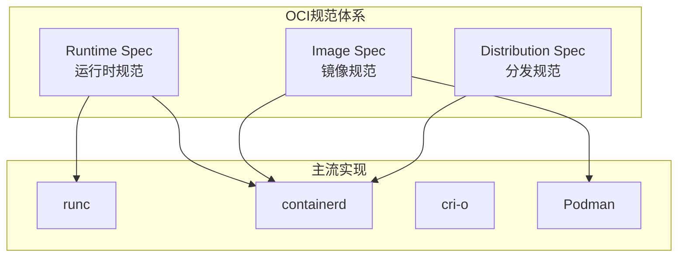
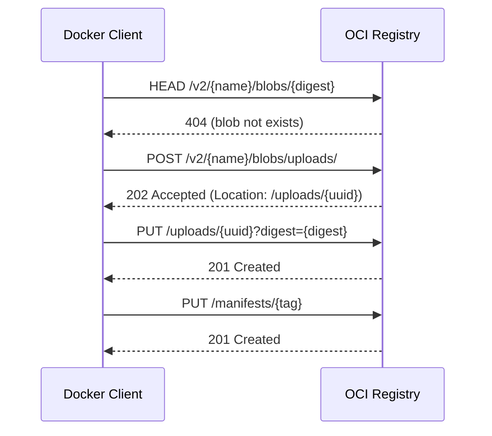
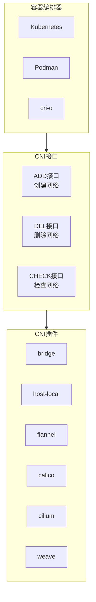
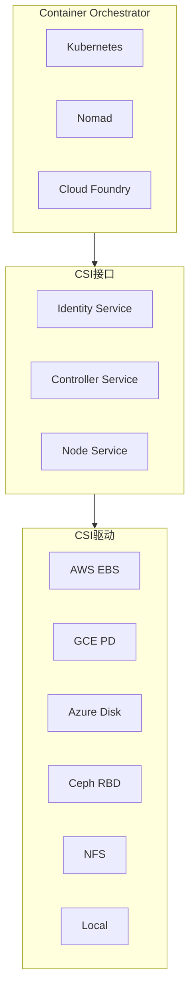
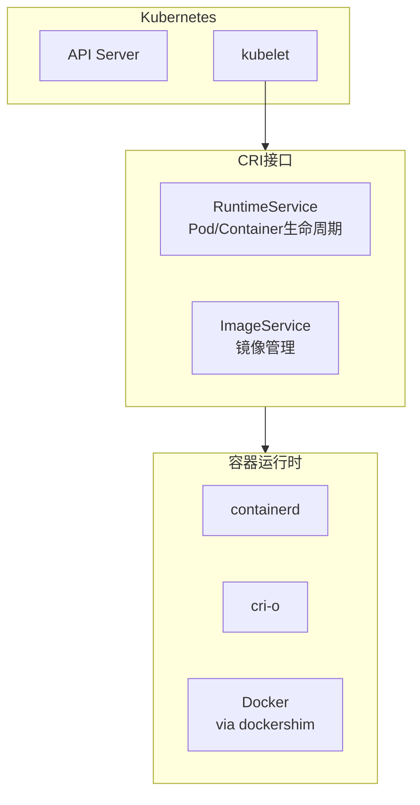
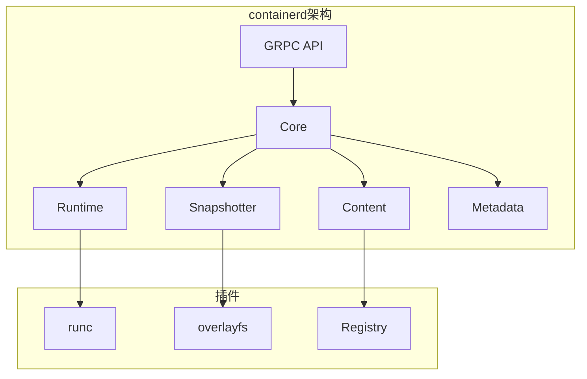
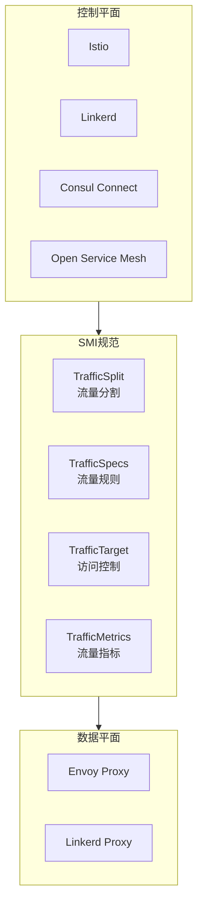

# 云原生标准 专题文档

**文档版本**：v1.0
**创建时间**：2026年4月
**最后更新**：2026年4月
**状态**：🔄 编写中

---

## 📋 执行摘要

云原生标准定义了容器化应用的标准化接口和规范，确保不同厂商的实现能够互操作。本文档详细阐述OCI（Open Container Initiative）、CNI（容器网络接口）、CSI（容器存储接口）、CRI（容器运行时接口）和SMI（Service Mesh Interface）等核心云原生标准，帮助理解容器生态系统的基础架构。

---

## 一、核心概念

### 1.1 定义与原理

**云原生（Cloud Native）**是一种构建和运行应用程序的方法，充分利用云计算模型的优势。云原生标准定义了容器、编排、网络、存储和服务网格等领域的标准化接口。

**标准化目标**：

- **互操作性**：不同实现可以无缝替换
- **可移植性**：应用可在不同云环境迁移
- **生态繁荣**：降低创新门槛，促进工具发展

### 1.2 关键特性

| 特性 | 说明 |
|------|------|
| **开放标准** | 由社区维护，非厂商锁定 |
| **接口规范** | 定义清晰的操作接口和数据格式 |
| **参考实现** | 提供验证标准可行性的实现 |
| **版本管理** | 规范的演进和向后兼容策略 |

### 1.3 适用场景

| 场景 | OCI | CNI | CSI | CRI | SMI |
|------|-----|-----|-----|-----|-----|
| 容器镜像分发 | ⭐⭐⭐⭐⭐ | ⭐ | ⭐ | ⭐⭐ | ⭐ |
| 容器网络编排 | ⭐ | ⭐⭐⭐⭐⭐ | ⭐ | ⭐⭐ | ⭐⭐ |
| 存储动态供给 | ⭐ | ⭐ | ⭐⭐⭐⭐⭐ | ⭐ | ⭐ |
| 运行时切换 | ⭐⭐ | ⭐ | ⭐ | ⭐⭐⭐⭐⭐ | ⭐ |
| 服务网格控制 | ⭐ | ⭐⭐ | ⭐ | ⭐ | ⭐⭐⭐⭐⭐ |

---

## 二、OCI（Open Container Initiative）

### 2.1 OCI架构设计



### 2.2 Runtime Spec（运行时规范）

**核心功能**：定义容器运行时的标准化接口，包括：

- 容器生命周期管理（create/start/kill/delete）
- 命名空间隔离
- 资源限制（cgroups）
- 安全配置文件

**配置文件结构**：

```json
{
  "ociVersion": "1.0.2",
  "process": {
    "terminal": false,
    "user": {"uid": 1000, "gid": 1000},
    "args": ["sh", "-c", "echo hello"],
    "env": ["PATH=/usr/local/bin:/usr/bin"],
    "cwd": "/"
  },
  "root": {
    "path": "rootfs",
    "readonly": true
  },
  "hostname": "container01",
  "mounts": [
    {
      "destination": "/proc",
      "type": "proc",
      "source": "proc"
    }
  ],
  "linux": {
    "namespaces": [
      {"type": "pid"},
      {"type": "network"},
      {"type": "ipc"},
      {"type": "uts"},
      {"type": "mount"}
    ],
    "resources": {
      "memory": {
        "limit": 536870912,
        "reservation": 268435456
      },
      "cpu": {
        "shares": 1024,
        "quota": 100000,
        "period": 100000
      }
    }
  }
}
```

**runc命令示例**：

```bash
# 创建容器
runc create --bundle /mycontainer mycontainer-id

# 启动容器
runc start mycontainer-id

# 查看容器状态
runc list

# 停止容器
runc kill mycontainer-id SIGTERM

# 删除容器
runc delete mycontainer-id
```

### 2.3 Image Spec（镜像规范）

**镜像结构**：

```
镜像目录/
├── index.json          # 镜像索引（多架构支持）
├── oci-layout          # 布局版本声明
├── blobs/
│   └── sha256/
│       ├── abc123...   # 配置文件
│       ├── def456...   # 层tar.gz
│       └── ghi789...   # 清单文件
```

**镜像清单（Manifest）**：

```json
{
  "schemaVersion": 2,
  "mediaType": "application/vnd.oci.image.manifest.v1+json",
  "config": {
    "mediaType": "application/vnd.oci.image.config.v1+json",
    "size": 7023,
    "digest": "sha256:e3b0c44298fc1c149afbf4c8996fb92427ae41e4649b934ca495991b7852b855"
  },
  "layers": [
    {
      "mediaType": "application/vnd.oci.image.layer.v1.tar+gzip",
      "size": 32654,
      "digest": "sha256:9834876dcfb05cb167a5c24953eba58c4ac89b1adf57f28f2f9d09af107ee8f0"
    }
  ],
  "annotations": {
    "org.opencontainers.image.title": "My Application",
    "org.opencontainers.image.version": "1.0.0"
  }
}
```

### 2.4 Distribution Spec（分发规范）

**核心API**：

| 端点 | 方法 | 描述 |
|------|------|------|
| `/v2/` | GET | 检查Registry支持 |
| `/v2/{name}/manifests/{reference}` | GET/PUT/DELETE | 镜像清单操作 |
| `/v2/{name}/blobs/{digest}` | GET/DELETE | 层blob操作 |
| `/v2/{name}/blobs/uploads/` | POST | 启动上传 |
| `/v2/{name}/blobs/uploads/{uuid}` | PUT/PATCH | 上传数据 |

**推送流程**：



### 2.5 OCI实现对比

| 实现 | 类型 | 特点 | 适用场景 |
|------|------|------|----------|
| **runc** | 运行时 | 参考实现，轻量级 | 直接容器管理 |
| **containerd** | 守护进程 | 完整生命周期管理 | Kubernetes、Docker |
| **cri-o** | 守护进程 | 专为K8s CRI设计 | Kubernetes |
| **Podman** | CLI工具 | 无守护进程，Rootless | 开发、单机部署 |
| **Kata Containers** | 安全运行时 | 轻量级VM | 多租户、安全隔离 |

---

## 三、CNI（Container Network Interface）

### 3.1 CNI架构设计



### 3.2 CNI规范详解

**核心接口**：

```go
// CNI插件必须实现的操作
type CNI interface {
    // 添加容器到网络
    Add(ctx context.Context, netns, name, id string) error

    // 从网络删除容器
    Del(ctx context.Context, netns, name, id string) error

    // 检查容器网络状态
    Check(ctx context.Context, netns, name, id string) error

    // 返回插件版本
    Version() string
}
```

**网络配置格式**：

```json
{
  "cniVersion": "1.0.0",
  "name": "mynet",
  "type": "bridge",
  "bridge": "cni0",
  "isGateway": true,
  "ipMasq": true,
  "ipam": {
    "type": "host-local",
    "subnet": "10.22.0.0/16",
    "routes": [
      {"dst": "0.0.0.0/0"}
    ],
    "dataDir": "/var/lib/cni/networks"
  },
  "dns": {
    "nameservers": ["10.22.0.1"]
  }
}
```

**IPAM（IP地址管理）**：

```json
{
  "cniVersion": "1.0.0",
  "name": "mynet",
  "type": "bridge",
  "ipam": {
    "type": "host-local",
    "ranges": [
      [{ "subnet": "10.10.0.0/16" }],
      [{ "subnet": "2001:db8::/96" }]
    ],
    "routes": [
      { "dst": "0.0.0.0/0" },
      { "dst": "::/0" }
    ]
  }
}
```

### 3.3 CNI插件类型

#### Main插件（创建网络接口）

| 插件 | 功能 | 使用场景 |
|------|------|----------|
| **bridge** | 创建Linux网桥 | 单机容器互联 |
| **ipvlan** | 创建IPvlan接口 | 需要MAC地址控制的场景 |
| **macvlan** | 创建MACvlan接口 | 需要独立MAC的场景 |
| **ptp** | 创建veth对 | 点对点连接 |
| **host-device** | 移动物理设备 | 直接访问硬件 |

#### IPAM插件（IP地址分配）

| 插件 | 功能 |
|------|------|
| **host-local** | 本地文件存储分配记录 |
| **dhcp** | 通过DHCP服务器获取IP |
| **static** | 静态指定IP |

#### Meta插件（链式调用）

| 插件 | 功能 |
|------|------|
| **flannel** | 集成Flannel网络 |
| **tuning** | 调整网络参数 |
| **portmap** | 端口映射 |
| **firewall** | 防火墙规则 |
| **bandwidth** | 带宽限制 |

### 3.4 Kubernetes CNI实现对比

| 实现 | 网络模型 | 网络策略 | 性能 | 特点 |
|------|----------|----------|------|------|
| **Flannel** | Overlay | ❌ | 中 | 简单，仅提供连通性 |
| **Calico** | BGP/Overlay | ✅ | 高 | 企业级，支持eBPF |
| **Cilium** | eBPF | ✅ | 很高 | 基于eBPF，可观测性强 |
| **Weave Net** | Overlay | ✅ | 中 | 自动发现，易用 |
| **Antrea** | Overlay | ✅ | 高 | VMware出品，云原生 |
| **Kube-OVN** | OVN | ✅ | 高 | 基于OVN，功能丰富 |

### 3.5 CNI链式调用

```json
{
  "cniVersion": "1.0.0",
  "name": "mynet",
  "plugins": [
    {
      "type": "bridge",
      "bridge": "cni0",
      "isGateway": true,
      "ipam": {
        "type": "host-local",
        "subnet": "10.22.0.0/16"
      }
    },
    {
      "type": "portmap",
      "capabilities": {"portMappings": true}
    },
    {
      "type": "firewall"
    },
    {
      "type": "tuning",
      "sysctl": {
        "net.core.somaxconn": "1024"
      }
    }
  ]
}
```

---

## 四、CSI（Container Storage Interface）

### 4.1 CSI架构设计



### 4.2 CSI规范详解

**服务接口**：

| 服务 | 功能 | 必需 |
|------|------|------|
| **Identity** | 插件身份信息 | ✅ |
| **Controller** | 卷的生命周期管理 | 非必需（仅Node模式） |
| **Node** | 节点上的卷操作 | ✅ |

**核心RPC方法**：

```protobuf
// Identity Service
rpc GetPluginInfo(GetPluginInfoRequest)
    returns (GetPluginInfoResponse);

rpc GetPluginCapabilities(GetPluginCapabilitiesRequest)
    returns (GetPluginCapabilitiesResponse);

rpc Probe(ProbeRequest)
    returns (ProbeResponse);

// Controller Service
rpc CreateVolume(CreateVolumeRequest)
    returns (CreateVolumeResponse);

rpc DeleteVolume(DeleteVolumeRequest)
    returns (DeleteVolumeResponse);

rpc ControllerPublishVolume(ControllerPublishVolumeRequest)
    returns (ControllerPublishVolumeResponse);

rpc ControllerUnpublishVolume(ControllerUnpublishVolumeRequest)
    returns (ControllerUnpublishVolumeResponse);

// Node Service
rpc NodeStageVolume(NodeStageVolumeRequest)
    returns (NodeStageVolumeResponse);

rpc NodePublishVolume(NodePublishVolumeRequest)
    returns (NodePublishVolumeResponse);

rpc NodeUnpublishVolume(NodeUnpublishVolumeRequest)
    returns (NodeUnpublishVolumeResponse);
```

### 4.3 Kubernetes CSI实现

**存储类示例**：

```yaml
apiVersion: storage.k8s.io/v1
kind: StorageClass
metadata:
  name: fast-ssd
provisioner: ebs.csi.aws.com
parameters:
  type: gp3
  encrypted: "true"
  kmsKeyId: alias/aws/ebs
reclaimPolicy: Retain
allowVolumeExpansion: true
mountOptions:
  - debug
volumeBindingMode: WaitForFirstConsumer
```

**PVC示例**：

```yaml
apiVersion: v1
kind: PersistentVolumeClaim
metadata:
  name: data-pvc
spec:
  accessModes:
    - ReadWriteOnce
  storageClassName: fast-ssd
  resources:
    requests:
      storage: 10Gi
```

### 4.4 CSI驱动对比

| 驱动 | 后端 | 特性 | 适用场景 |
|------|------|------|----------|
| **AWS EBS CSI** | AWS EBS | 快照、加密、扩展 | AWS云原生 |
| **GCE PD CSI** | GCE PD | 区域磁盘、快照 | GCP云原生 |
| **Azure Disk CSI** | Azure Disk | Ultra Disk、加密 | Azure云原生 |
| **Ceph CSI** | Ceph | RBD、CephFS、快照 | 私有云统一存储 |
| **NFS CSI** | NFS | 多主机读写 | 共享存储 |
| **Local CSI** | 本地磁盘 | 高性能、无网络开销 | 数据库、缓存 |
| **Longhorn** | 分布式块存储 | 轻量级、易管理 | 边缘、小型集群 |

### 4.5 CSI高级特性

#### 卷快照

```yaml
apiVersion: snapshot.storage.k8s.io/v1
kind: VolumeSnapshot
metadata:
  name: data-snapshot
spec:
  volumeSnapshotClassName: csi-snapclass
  source:
    persistentVolumeClaimName: data-pvc
```

#### 卷克隆

```yaml
apiVersion: v1
kind: PersistentVolumeClaim
metadata:
  name: data-clone
spec:
  dataSource:
    name: data-pvc
    kind: PersistentVolumeClaim
  accessModes:
    - ReadWriteOnce
  resources:
    requests:
      storage: 10Gi
```

#### 卷扩展

```bash
# 扩容PVC
kubectl patch pvc data-pvc -p '{"spec":{"resources":{"requests":{"storage":"20Gi"}}}}'
```

---

## 五、CRI（Container Runtime Interface）

### 5.1 CRI架构设计



### 5.2 CRI规范详解

**gRPC服务定义**：

```protobuf
service RuntimeService {
    // Pod Sandbox操作
    rpc RunPodSandbox(RunPodSandboxRequest)
        returns (RunPodSandboxResponse);
    rpc StopPodSandbox(StopPodSandboxRequest)
        returns (StopPodSandboxResponse);
    rpc RemovePodSandbox(RemovePodSandboxRequest)
        returns (RemovePodSandboxResponse);
    rpc PodSandboxStatus(PodSandboxStatusRequest)
        returns (PodSandboxStatusResponse);
    rpc ListPodSandbox(ListPodSandboxRequest)
        returns (ListPodSandboxResponse);

    // Container操作
    rpc CreateContainer(CreateContainerRequest)
        returns (CreateContainerResponse);
    rpc StartContainer(StartContainerRequest)
        returns (StartContainerResponse);
    rpc StopContainer(StopContainerRequest)
        returns (StopContainerResponse);
    rpc RemoveContainer(RemoveContainerRequest)
        returns (RemoveContainerResponse);
    rpc ListContainers(ListContainersRequest)
        returns (ListContainersResponse);
    rpc ContainerStatus(ContainerStatusRequest)
        returns (ContainerStatusResponse);

    // 流式服务
    rpc Exec(ExecRequest) returns (ExecResponse);
    rpc Attach(AttachRequest) returns (AttachResponse);
    rpc PortForward(PortForwardRequest) returns (PortForwardResponse);
}

service ImageService {
    rpc ListImages(ListImagesRequest) returns (ListImagesResponse);
    rpc ImageStatus(ImageStatusRequest) returns (ImageStatusResponse);
    rpc PullImage(PullImageRequest) returns (PullImageResponse);
    rpc RemoveImage(RemoveImageRequest) returns (RemoveImageResponse);
    rpc ImageFsInfo(ImageFsInfoRequest) returns (ImageFsInfoResponse);
}
```

### 5.3 CRI运行时对比

| 运行时 | 架构 | 特点 | 推荐度 |
|--------|------|------|--------|
| **containerd** | 守护进程 | 简洁、稳定、广泛支持 | ⭐⭐⭐⭐⭐ |
| **cri-o** | 守护进程 | 专为K8s设计，轻量 | ⭐⭐⭐⭐ |
| **Docker** | 守护进程 | 功能丰富，但冗余 | ⭐⭐⭐ |

### 5.4 Containerd架构



**Containerd配置示例**：

```toml
# /etc/containerd/config.toml
version = 2

[plugins."io.containerd.grpc.v1.cri"]
  sandbox_image = "registry.k8s.io/pause:3.9"

  [plugins."io.containerd.grpc.v1.cri".containerd]
    default_runtime_name = "runc"

    [plugins."io.containerd.grpc.v1.cri".containerd.runtimes.runc]
      runtime_type = "io.containerd.runc.v2"

      [plugins."io.containerd.grpc.v1.cri".containerd.runtimes.runc.options]
        SystemdCgroup = true

  [plugins."io.containerd.grpc.v1.cri".registry]
    [plugins."io.containerd.grpc.v1.cri".registry.mirrors]
      [plugins."io.containerd.grpc.v1.cri".registry.mirrors."docker.io"]
        endpoint = ["https://mirror.example.com"]
```

---

## 六、SMI（Service Mesh Interface）

### 6.1 SMI架构设计



### 6.2 SMI规范详解

**核心API资源**：

| 资源 | API组 | 功能 |
|------|-------|------|
| **TrafficSplit** | split.smi-spec.io | 金丝雀发布、A/B测试 |
| **HTTPRouteGroup** | specs.smi-spec.io | HTTP路由规则 |
| **TCPRoute** | specs.smi-spec.io | TCP路由规则 |
| **TrafficTarget** | access.smi-spec.io | 服务间访问控制 |
| **TrafficMetrics** | metrics.smi-spec.io | 流量指标采集 |

### 6.3 TrafficSplit示例

```yaml
apiVersion: split.smi-spec.io/v1alpha4
kind: TrafficSplit
metadata:
  name: canary-split
  namespace: default
spec:
  service: web-app
  backends:
    - service: web-app-v1
      weight: 90
    - service: web-app-v2
      weight: 10
```

### 6.4 TrafficTarget示例

```yaml
apiVersion: access.smi-spec.io/v1alpha3
kind: TrafficTarget
metadata:
  name: web-to-api
  namespace: default
spec:
  destination:
    kind: ServiceAccount
    name: api-sa
    namespace: default
  rules:
    - kind: HTTPRouteGroup
      name: api-routes
      matches:
        - /api/v1/*
  sources:
    - kind: ServiceAccount
      name: web-sa
      namespace: default
---
apiVersion: specs.smi-spec.io/v1alpha4
kind: HTTPRouteGroup
metadata:
  name: api-routes
  namespace: default
spec:
  matches:
    - name: api
      pathRegex: /api/v1/.*
      methods: ["GET", "POST"]
```

### 6.5 SMI实现对比

| 实现 | 服务网格 | SMI支持程度 | 特点 |
|------|----------|-------------|------|
| **Flagger** | 多网格 | 完整 | 自动化金丝雀发布 |
| **OSM** | 自研 | 原生 | 专为SMI设计 |
| **Istio** | 自研 | 通过适配器 | 功能最丰富 |
| **Linkerd** | 自研 | 部分 | 轻量易用 |

---

## 七、完整对比矩阵

### 7.1 云原生接口对比

| 维度 | OCI | CNI | CSI | CRI | SMI |
|------|-----|-----|-----|-----|-----|
| **管理对象** | 容器/镜像 | 网络 | 存储 | 容器运行时 | 服务网格 |
| **接口类型** | CLI/文件/gRPC | 可执行文件 | gRPC | gRPC | Kubernetes CRD |
| **规范组织** | OCI | CNCF | CNCF | Kubernetes | CNCF |
| **主要实现** | runc/containerd | Calico/Cilium | EBS/CEPH CSI | containerd/cri-o | Istio/Linkerd |
| **Kubernetes集成** | 通过CRI | 原生 | 原生 | 原生 | 可选 |
| **版本** | v1.0+ | v1.0+ | v1.5+ | v1alpha2+ | v0.10+ |

### 7.2 选型决策树

```
需求分析
├── 需要容器运行时？
│   ├── 是 → Kubernetes环境？
│   │   ├── 是 → containerd（推荐）或 cri-o
│   │   └── 否 → Podman 或 Docker
│   └── 否 →
│       ├── 需要网络方案？
│       │   ├── 是 → 性能要求高？
│       │   │   ├── 是 → Cilium 或 Calico eBPF
│       │   │   └── 否 → Calico 或 Flannel
│       │   └── 否 →
│       │       ├── 需要存储方案？
│       │       │   ├── 是 → 云环境？
│       │       │   │   ├── 是 → 云厂商CSI驱动
│       │       │   │   └── 否 → Ceph CSI 或 Longhorn
│       │       │   └── 否 →
│       │       │       ├── 需要服务网格？
│       │       │       │   ├── 是 → Istio（功能全）或 Linkerd（轻量）
│       │       │       │   └── 否 → 不需要云原生接口
```

---

## 八、实践指南

### 8.1 Kubernetes环境配置

#### 配置containerd

```bash
# 安装containerd
apt-get install -y containerd

# 生成默认配置
mkdir -p /etc/containerd
containerd config default > /etc/containerd/config.toml

# 修改SystemdCgroup
sed -i 's/SystemdCgroup = false/SystemdCgroup = true/' /etc/containerd/config.toml

# 重启服务
systemctl restart containerd
```

#### 配置CNI（Calico）

```bash
# 安装Calico
kubectl apply -f https://docs.projectcalico.org/manifests/calico.yaml

# 验证
kubectl get pods -n kube-system -l k8s-app=calico-node
```

### 8.2 存储类配置模板

```yaml
# 本地存储
apiVersion: storage.k8s.io/v1
kind: StorageClass
metadata:
  name: local-ssd
provisioner: kubernetes.io/no-provisioner
volumeBindingMode: WaitForFirstConsumer
---
# NFS存储
apiVersion: storage.k8s.io/v1
kind: StorageClass
metadata:
  name: nfs-client
provisioner: k8s-sigs.io/nfs-subdir-external-provisioner
parameters:
  archiveOnDelete: "false"
---
# Ceph RBD
apiVersion: storage.k8s.io/v1
kind: StorageClass
metadata:
  name: ceph-rbd
provisioner: rbd.csi.ceph.com
parameters:
  clusterID: rook-ceph
  pool: replicapool
  imageFormat: "2"
  imageFeatures: layering
  csi.storage.k8s.io/provisioner-secret-name: rook-csi-rbd-provisioner
  csi.storage.k8s.io/provisioner-secret-namespace: rook-ceph
```

### 8.3 最佳实践

1. **运行时选择**
   - 生产环境优先使用containerd
   - 避免使用已弃用的dockershim

2. **网络规划**
   - 预先规划Pod CIDR和Service CIDR
   - 企业环境考虑Calico或Cilium的eBPF模式

3. **存储策略**
   - 有状态应用使用CSI驱动
   - 数据库类应用考虑本地存储
   - 定期验证备份和恢复流程

4. **服务网格**
   - 渐进式采用，从观察模式开始
   - 仔细评估Sidecar资源开销

### 8.4 常见问题

**Q1: Docker和containerd的关系？**
A: containerd是Docker的核心运行时，Docker在containerd之上提供更丰富的CLI和功能。Kubernetes 1.24+已移除Docker支持，直接使用containerd。

**Q2: CNI插件如何选择？**
A: 简单场景用Flannel，企业级用Calico或Cilium，需要高级可观测性选Cilium。

**Q3: CSI和FlexVolume的区别？**
A: FlexVolume是旧版存储接口，已弃用。CSI是标准化接口，功能更丰富，支持卷快照、扩容等。

**Q4: SMI和Istio API的关系？**
A: SMI是标准抽象层，Istio提供具体实现。Flagger等工具通过SMI实现跨网格兼容。

---

## 九、与其他主题的关联

### 9.1 上游依赖

- [OSS开放存储服务规范](./OSS开放存储服务规范.md)

### 9.2 下游应用

- Kubernetes部署和运维
- 微服务架构实现
- 云原生应用开发

### 9.3 相关概念

| 概念 | 关系 | 说明 |
|------|------|------|
| Kubernetes | 编排平台 | CRI/CNI/CSI的主要消费者 |
| Helm | 包管理 | 简化云原生组件部署 |
| Prometheus | 监控 | 与SMI TrafficMetrics配合 |

---

## 十、参考资源

### 10.1 官方规范

1. [OCI Runtime Spec](https://github.com/opencontainers/runtime-spec) - 容器运行时规范
2. [OCI Image Spec](https://github.com/opencontainers/image-spec) - 容器镜像规范
3. [CNI Specification](https://www.cni.dev/docs/spec/) - CNI接口规范
4. [CSI Specification](https://github.com/container-storage-interface/spec) - CSI规范
5. [CRI Specification](https://github.com/kubernetes/cri-api) - CRI API
6. [SMI Specification](https://smi-spec.io/) - 服务网格接口规范

### 10.2 开源项目

1. [runc](https://github.com/opencontainers/runc) - OCI运行时参考实现
2. [containerd](https://github.com/containerd/containerd) - 工业级容器运行时
3. [Cilium](https://github.com/cilium/cilium) - 基于eBPF的CNI
4. [Calico](https://github.com/projectcalico/calico) - 云原生网络方案
5. [external-snapshotter](https://github.com/kubernetes-csi/external-snapshotter) - CSI快照组件

### 10.3 学习资料

1. [Kubernetes官方文档](https://kubernetes.io/docs/)
2. [CNCF云原生技术栈](https://landscape.cncf.io/)
3. [容器技术深入解析](https://containerd.io/docs/)

---

**维护者**：项目团队
**最后更新**：2026年4月
