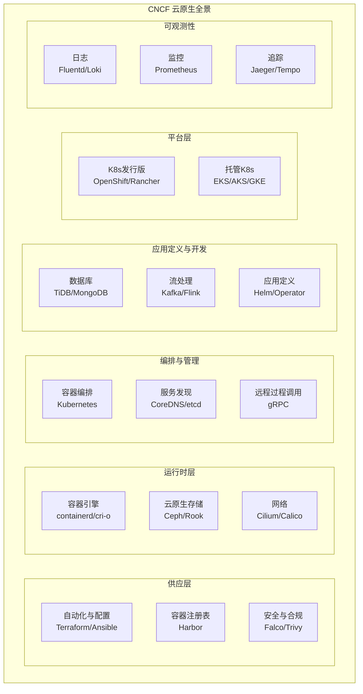
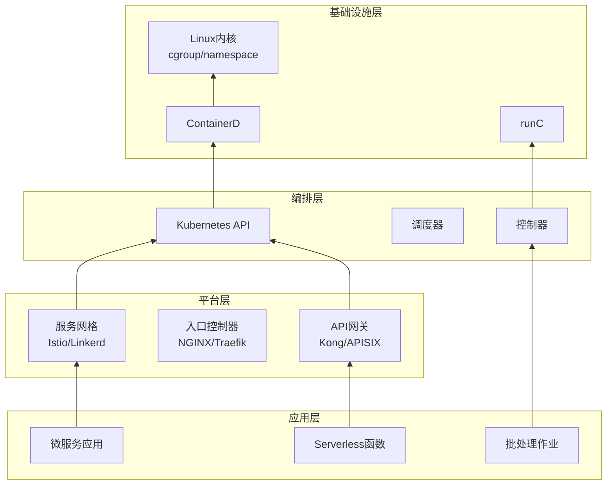
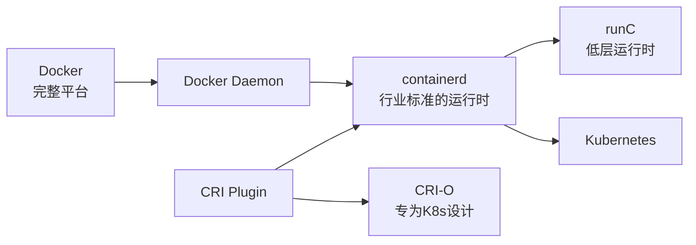
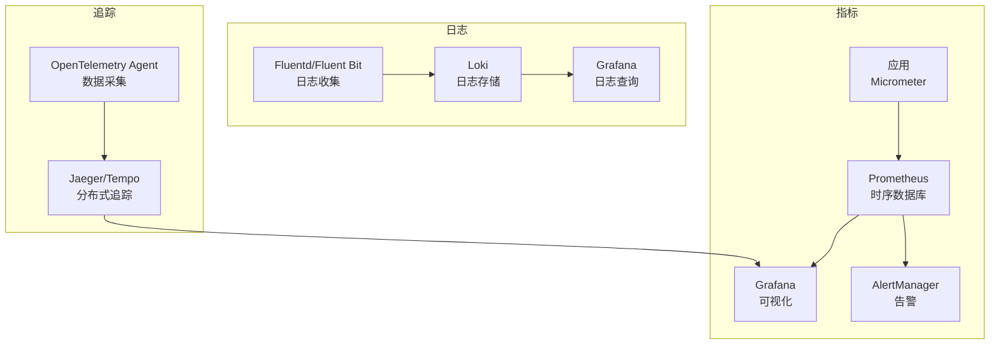
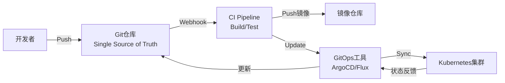

# 云原生技术栈

## 概述

云原生（Cloud Native）技术栈是一组用于构建和运行可弹性扩展、容错性强的分布式系统的技术体系。CNCF（云原生计算基金会）维护的生态系统涵盖了容器、服务网格、微服务、不可变基础设施和声明式API等技术。

## CNCF全景图



## 核心技术分层



## 容器运行时演进



## 关键技术组件

### 1. 容器编排 - Kubernetes

```yaml
# Kubernetes 核心资源
apiVersion: v1
kind: Namespace
metadata:
  name: cloud-native-app
---
apiVersion: apps/v1
kind: Deployment
metadata:
  name: web-app
  namespace: cloud-native-app
spec:
  replicas: 3
  selector:
    matchLabels:
      app: web
  template:
    metadata:
      labels:
        app: web
    spec:
      containers:
      - name: app
        image: myapp:v1.0
        ports:
        - containerPort: 8080
        resources:
          requests:
            memory: "128Mi"
            cpu: "100m"
          limits:
            memory: "512Mi"
            cpu: "500m"
        livenessProbe:
          httpGet:
            path: /health
            port: 8080
          initialDelaySeconds: 30
          periodSeconds: 10
        readinessProbe:
          httpGet:
            path: /ready
            port: 8080
          initialDelaySeconds: 5
          periodSeconds: 5
---
apiVersion: v1
kind: Service
metadata:
  name: web-service
  namespace: cloud-native-app
spec:
  selector:
    app: web
  ports:
  - port: 80
    targetPort: 8080
  type: ClusterIP
---
apiVersion: networking.k8s.io/v1
kind: Ingress
metadata:
  name: web-ingress
  namespace: cloud-native-app
  annotations:
    nginx.ingress.kubernetes.io/ssl-redirect: "true"
spec:
  rules:
  - host: app.example.com
    http:
      paths:
      - path: /
        pathType: Prefix
        backend:
          service:
            name: web-service
            port:
              number: 80
```

### 2. 包管理 - Helm

```yaml
# Chart.yaml
apiVersion: v2
name: cloud-native-app
version: 1.0.0
description: A cloud-native application chart
type: application
keywords:
  - cloud-native
  - microservices
home: https://example.com
sources:
  - https://github.com/example/app
maintainers:
  - name: Team
    email: team@example.com
dependencies:
  - name: postgresql
    version: 12.x.x
    repository: https://charts.bitnami.com/bitnami
    condition: postgresql.enabled
  - name: redis
    version: 17.x.x
    repository: https://charts.bitnami.com/bitnami
    condition: redis.enabled
```

### 3. 可观测性栈



## GitOps 工作流



```yaml
# ArgoCD Application 配置
apiVersion: argoproj.io/v1alpha1
kind: Application
metadata:
  name: cloud-native-app
  namespace: argocd
spec:
  project: default
  source:
    repoURL: https://github.com/example/gitops-repo.git
    targetRevision: HEAD
    path: overlays/production
    helm:
      valueFiles:
      - values-production.yaml
  destination:
    server: https://kubernetes.default.svc
    namespace: production
  syncPolicy:
    automated:
      prune: true
      selfHeal: true
      allowEmpty: false
    syncOptions:
    - CreateNamespace=true
    - PrunePropagationPolicy=foreground
    - PruneLast=true
    retry:
      limit: 5
      backoff:
        duration: 5s
        factor: 2
        maxDuration: 3m
```

## 安全工具链

| 工具类型 | 代表项目 | 用途 |
|---------|---------|------|
| 镜像扫描 | Trivy, Clair | 检测镜像漏洞 |
| 运行时安全 | Falco | 异常行为检测 |
| 策略管理 | OPA, Kyverno | K8s策略执行 |
| 密钥管理 | Vault, Sealed Secrets | 敏感信息管理 |
| 零信任 | SPIFFE/SPIRE | 身份认证 |

## 总结

云原生技术栈通过标准化接口和模块化设计，构建了现代应用开发和运维的完整生态系统。从底层的容器运行时到上层的应用交付，每个层面都有成熟的工具和最佳实践，使企业能够快速构建可扩展、高可用的分布式系统。
