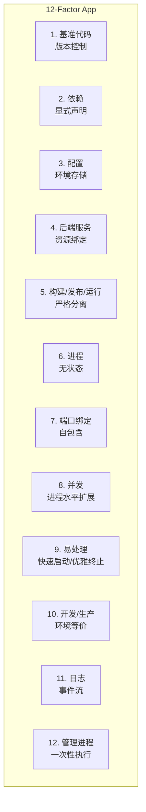
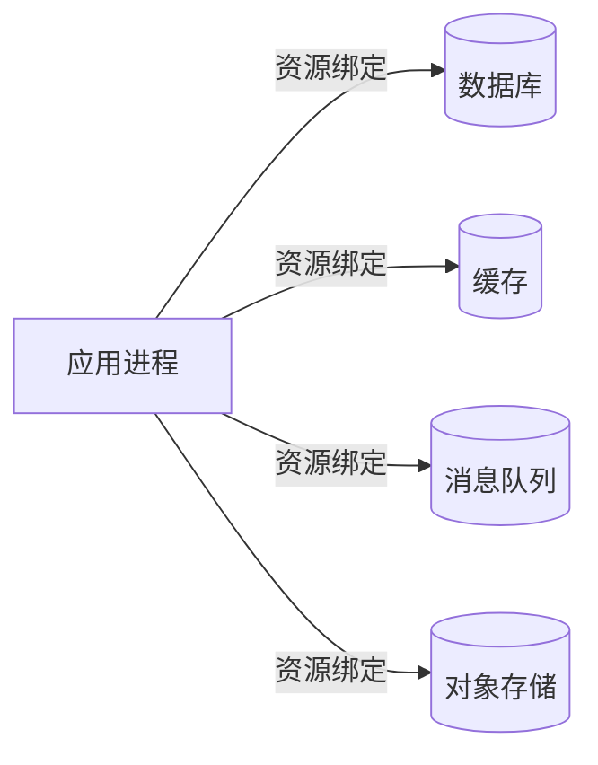
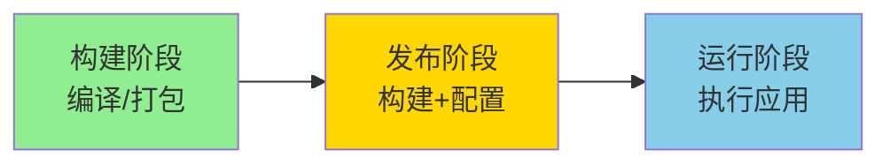
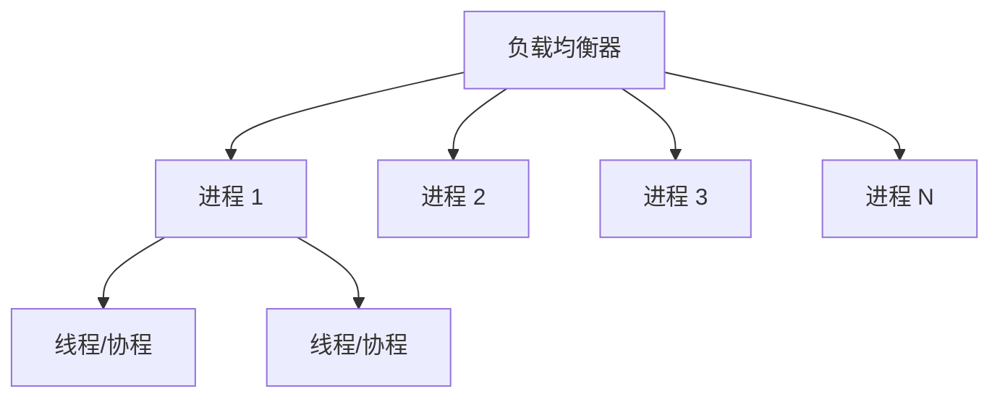
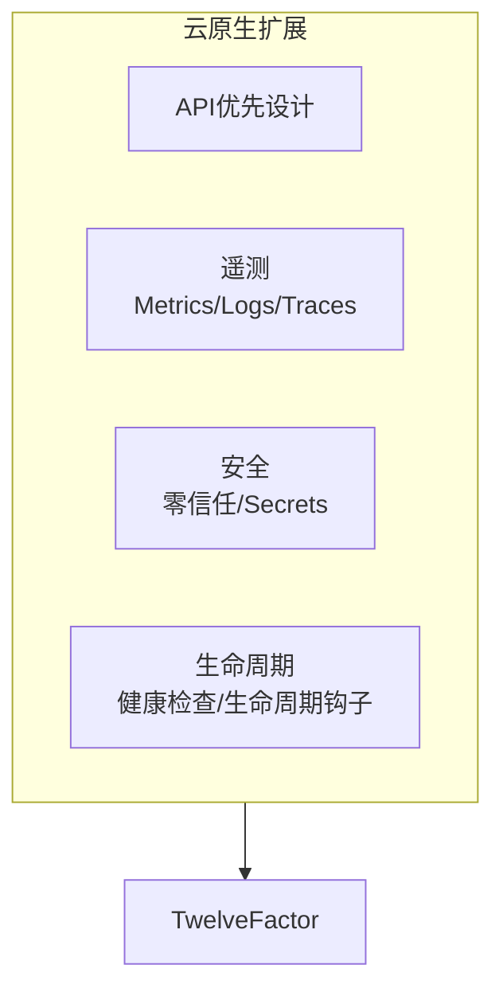

# 云原生架构模式

## 概述

云原生架构模式是一套经过验证的设计原则和实践方法，帮助开发者在云环境中构建可扩展、弹性、可观测的应用程序。12-Factor应用方法论是云原生架构的基石，指导开发者构建适合云部署的应用。

## 12-Factor应用方法论



## 12-Factor详解

### 1. 基准代码（Codebase）

```yaml
# Git工作流
main: 生产分支
develop: 开发分支
feature/*: 功能分支
release/*: 发布分支
hotfix/*: 热修复分支
```

### 2. 依赖（Dependencies）

```yaml
# Python requirements.txt
flask==2.3.2
gunicorn==21.2.0
redis==4.6.0
psycopg2-binary==2.9.7

# 显式声明所有依赖，无隐式依赖
```

### 3. 配置（Config）

```yaml
# 环境变量配置（非代码中硬编码）
apiVersion: v1
kind: ConfigMap
metadata:
  name: app-config
data:
  DATABASE_URL: "postgres://localhost:5432/mydb"
  CACHE_SIZE: "1000"
  LOG_LEVEL: "info"
---
apiVersion: v1
kind: Secret
metadata:
  name: app-secrets
type: Opaque
data:
  DB_PASSWORD: c2VjcmV0MTIz  # base64编码
  API_KEY: bXlzZWNyZXRrZXk=
```

```python
# 应用代码中读取环境变量
import os

DATABASE_URL = os.environ.get('DATABASE_URL')
DB_PASSWORD = os.environ.get('DB_PASSWORD')
LOG_LEVEL = os.environ.get('LOG_LEVEL', 'info')
```

### 4. 后端服务（Backing Services）



```yaml
# 将后端服务作为资源绑定
apiVersion: v1
kind: Service
metadata:
  name: database
spec:
  ports:
  - port: 5432
  selector:
    app: postgres
---
# 应用通过环境变量连接
env:
- name: DATABASE_HOST
  value: "database"
- name: DATABASE_PORT
  value: "5432"
```

### 5. 构建/发布/运行（Build/Release/Run）



```dockerfile
# Dockerfile 示例 - 严格分离
# === 构建阶段 ===
FROM node:18-alpine AS builder
WORKDIR /app
COPY package*.json ./
RUN npm ci --only=production
COPY . .
RUN npm run build

# === 运行阶段 ===
FROM node:18-alpine
WORKDIR /app
# 只复制构建产物，不包含dev依赖
COPY --from=builder /app/dist ./dist
COPY --from=builder /app/node_modules ./node_modules
COPY package.json ./
ENV NODE_ENV=production
EXPOSE 3000
CMD ["node", "dist/main.js"]
```

### 6. 进程（Processes）

```yaml
# 无状态进程配置
apiVersion: apps/v1
kind: Deployment
metadata:
  name: stateless-app
spec:
  replicas: 3
  template:
    spec:
      containers:
      - name: app
        image: myapp:v1.0
        env:
        - name: STATE_STORAGE
          value: "redis:6379"  # 状态外置
        volumeMounts: []  # 无本地存储
      volumes: []
```

### 7. 端口绑定（Port Binding）

```python
# 自包含服务，通过端口暴露
from flask import Flask
import os

app = Flask(__name__)

@app.route('/')
def hello():
    return 'Hello, 12-Factor!'

if __name__ == '__main__':
    # 从环境变量读取端口，默认5000
    port = int(os.environ.get('PORT', 5000))
    app.run(host='0.0.0.0', port=port)
```

### 8. 并发（Concurrency）



```yaml
# 水平扩展配置
apiVersion: apps/v1
kind: Deployment
metadata:
  name: concurrent-app
spec:
  replicas: 5  # 多个无状态进程
  template:
    spec:
      containers:
      - name: app
        image: myapp:v1.0
        resources:
          limits:
            cpu: "500m"  # 限制CPU
          requests:
            cpu: "100m"
```

### 9. 易处理（Disposability）

```python
import signal
import sys
from flask import Flask

app = Flask(__name__)

def graceful_shutdown(signum, frame):
    print("接收到终止信号，开始优雅关闭...")
    # 1. 停止接收新请求
    # 2. 完成处理中的请求
    # 3. 关闭数据库连接
    # 4. 释放资源
    sys.exit(0)

# 注册信号处理器
signal.signal(signal.SIGTERM, graceful_shutdown)
signal.signal(signal.SIGINT, graceful_shutdown)

# 应用快速启动（< 1秒）
# 小型镜像，快速拉取
```

```yaml
# Kubernetes优雅终止配置
spec:
  template:
    spec:
      terminationGracePeriodSeconds: 30
      containers:
      - name: app
        image: myapp:v1.0
        lifecycle:
          preStop:
            exec:
              command: ["/bin/sh", "-c", "sleep 10"]  # 预停止钩子
```

### 10. 开发/生产等价

```yaml
# Docker Compose - 开发环境
version: '3.8'
services:
  app:
    build: .
    ports:
      - "3000:3000"
    environment:
      - NODE_ENV=development
      - DATABASE_URL=postgres://db:5432/devdb

  db:
    image: postgres:15
    environment:
      POSTGRES_DB: devdb

# Kubernetes - 生产环境（相同镜像，不同配置）
# 使用相同的Docker镜像，通过ConfigMap注入不同配置
```

### 11. 日志（Logs）

```python
import logging
import sys

# 结构化日志输出到stdout
logging.basicConfig(
    level=logging.INFO,
    format='{"time": "%(asctime)s", "level": "%(levelname)s", "message": "%(message)s"}',
    stream=sys.stdout  # 输出到stdout，而非文件
)

logger = logging.getLogger(__name__)

@app.route('/api/data')
def get_data():
    logger.info({"event": "request_start", "path": "/api/data"})
    # ... 业务逻辑
    logger.info({"event": "request_end", "duration_ms": 150})
    return data
```

```yaml
# 日志收集配置
apiVersion: v1
kind: DaemonSet
metadata:
  name: fluent-bit
spec:
  template:
    spec:
      containers:
      - name: fluent-bit
        image: fluent/fluent-bit:latest
        volumeMounts:
        - name: varlog
          mountPath: /var/log
        - name: varlibdocker
          mountPath: /var/lib/docker/containers
      volumes:
      - name: varlog
        hostPath:
          path: /var/log
      - name: varlibdocker
        hostPath:
          path: /var/lib/docker/containers
```

### 12. 管理进程（Admin Processes）

```yaml
# 数据库迁移作为一次性任务
apiVersion: batch/v1
kind: Job
metadata:
  name: db-migrate
spec:
  template:
    spec:
      restartPolicy: Never
      containers:
      - name: migrate
        image: myapp:v1.0
        command: ["npm", "run", "migrate"]
        envFrom:
        - configMapRef:
            name: app-config
        - secretRef:
            name: app-secrets
---
# 或者使用 initContainers
apiVersion: apps/v1
kind: Deployment
metadata:
  name: app-with-init
spec:
  template:
    spec:
      initContainers:
      - name: db-migrate
        image: myapp:v1.0
        command: ["npm", "run", "migrate"]
      containers:
      - name: app
        image: myapp:v1.0
        command: ["npm", "start"]
```

## 扩展要素



## 总结

12-Factor方法论为构建云原生应用提供了坚实的理论基础。遵循这些原则，开发者可以构建出具有高度可移植性、可扩展性和可维护性的应用，充分利用云平台的弹性能力，实现持续交付和DevOps实践。
