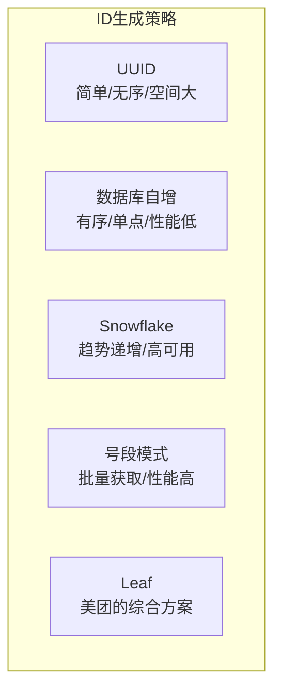
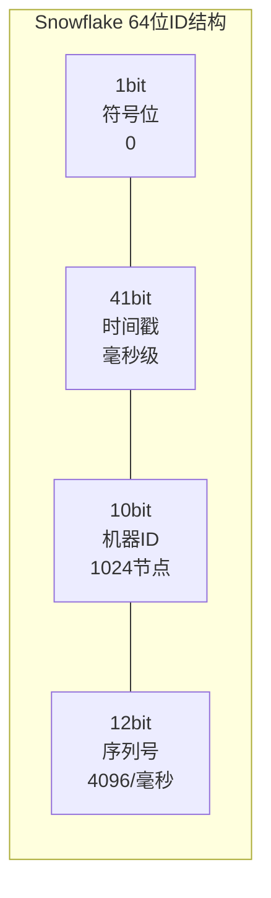
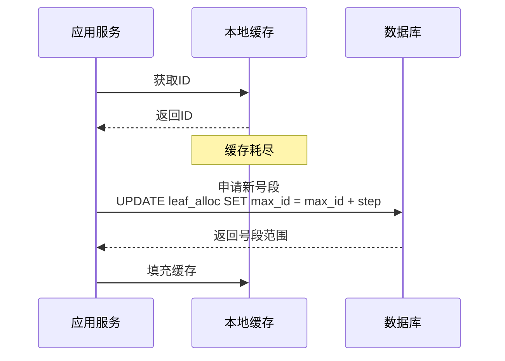
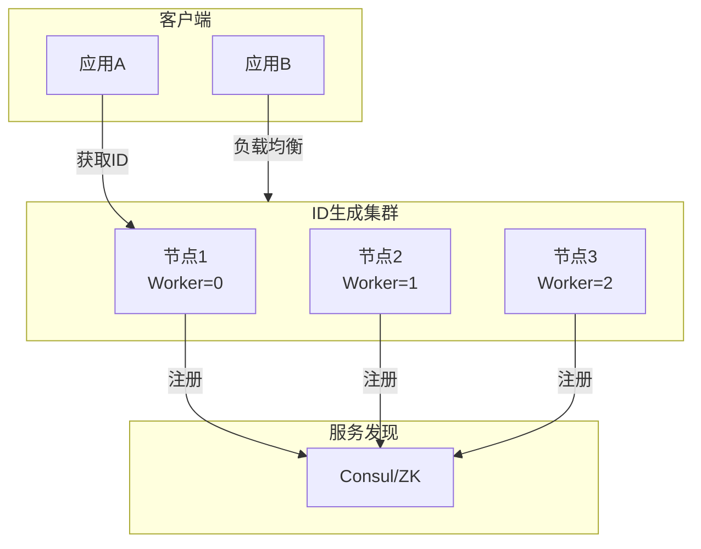

# 分布式ID生成

## 概述

在分布式系统中，生成全局唯一ID是基础且关键的需求。与单机环境不同，分布式ID生成需要解决高并发、低延迟、数据一致性等挑战，同时满足唯一性、趋势递增、信息安全等要求。

## ID生成方案对比



| 方案 | 优点 | 缺点 | 适用场景 |
|-----|------|------|---------|
| UUID | 简单、去中心化 | 无序、存储空间大 | 日志追踪 |
| 数据库自增 | 有序、简单 | 单点瓶颈、性能差 | 小规模系统 |
| Snowflake | 趋势递增、高性能 | 依赖时钟 | 高并发系统 |
| 号段模式 | 高性能、可扩展 | 号段耗尽风险 | 中等并发 |
| Leaf | 综合优势 | 实现复杂 | 大规模系统 |

## Snowflake算法

### 原理架构



| 字段 | 位数 | 说明 |
|-----|------|------|
| 符号位 | 1 | 固定为0，保证正数 |
| 时间戳 | 41 | 毫秒级时间戳，约69年 |
| 机器ID | 10 | 数据中心+工作节点 |
| 序列号 | 12 | 每毫秒内序列号 |

### 代码实现

```java
// Snowflake算法实现
public class SnowflakeIdWorker {
    // 起始时间戳 (2024-01-01)
    private final long twepoch = 1704067200000L;

    // 各部分位数
    private final long workerIdBits = 10L;
    private final long sequenceBits = 12L;

    // 最大值
    private final long maxWorkerId = -1L ^ (-1L << workerIdBits);
    private final long sequenceMask = -1L ^ (-1L << sequenceBits);

    // 位移
    private final long workerIdShift = sequenceBits;
    private final long timestampLeftShift = sequenceBits + workerIdBits;

    // 工作节点ID
    private long workerId;

    // 序列号
    private long sequence = 0L;

    // 上次生成ID的时间戳
    private long lastTimestamp = -1L;

    public SnowflakeIdWorker(long workerId) {
        if (workerId > maxWorkerId || workerId < 0) {
            throw new IllegalArgumentException("Worker ID out of range");
        }
        this.workerId = workerId;
    }

    public synchronized long nextId() {
        long timestamp = timeGen();

        // 时钟回拨检查
        if (timestamp < lastTimestamp) {
            throw new RuntimeException("Clock moved backwards");
        }

        if (lastTimestamp == timestamp) {
            // 同一毫秒内，序列号递增
            sequence = (sequence + 1) & sequenceMask;
            if (sequence == 0) {
                // 序列号溢出，等待下一毫秒
                timestamp = tilNextMillis(lastTimestamp);
            }
        } else {
            // 不同毫秒，序列号重置
            sequence = 0L;
        }

        lastTimestamp = timestamp;

        return ((timestamp - twepoch) << timestampLeftShift)
                | (workerId << workerIdShift)
                | sequence;
    }

    private long tilNextMillis(long lastTimestamp) {
        long timestamp = timeGen();
        while (timestamp <= lastTimestamp) {
            timestamp = timeGen();
        }
        return timestamp;
    }

    private long timeGen() {
        return System.currentTimeMillis();
    }
}
```

### 优化版本（支持时钟回拨）

```java
public class OptimizedSnowflake {
    private final long twepoch = 1704067200000L;
    private final long workerIdBits = 10L;
    private final long sequenceBits = 12L;
    private final long maxWorkerId = -1L ^ (-1L << workerIdBits);
    private final long sequenceMask = -1L ^ (-1L << sequenceBits);
    private final long workerIdShift = sequenceBits;
    private final long timestampLeftShift = sequenceBits + workerIdBits;

    private long workerId;
    private long sequence = 0L;
    private long lastTimestamp = -1L;

    // 时钟回拨容忍（5ms）
    private final long maxBackwardMs = 5;

    public synchronized long nextId() {
        long timestamp = timeGen();

        // 处理时钟回拨
        if (timestamp < lastTimestamp) {
            long offset = lastTimestamp - timestamp;
            if (offset <= maxBackwardMs) {
                try {
                    // 等待时间追平
                    Thread.sleep(offset);
                    timestamp = timeGen();
                    if (timestamp < lastTimestamp) {
                        throw new RuntimeException("Clock moved backwards");
                    }
                } catch (InterruptedException e) {
                    Thread.currentThread().interrupt();
                    throw new RuntimeException("Interrupted");
                }
            } else {
                throw new RuntimeException("Clock moved backwards too far");
            }
        }

        if (lastTimestamp == timestamp) {
            sequence = (sequence + 1) & sequenceMask;
            if (sequence == 0) {
                timestamp = tilNextMillis(lastTimestamp);
            }
        } else {
            // 随机起始序列号，防止低并发时都是偶数
            sequence = ThreadLocalRandom.current().nextLong(0, 2);
        }

        lastTimestamp = timestamp;

        return ((timestamp - twepoch) << timestampLeftShift)
                | (workerId << workerIdShift)
                | sequence;
    }

    // ... 其他方法
}
```

## 号段模式（Segment）



### 数据表设计

```sql
-- 号段分配表
CREATE TABLE leaf_alloc (
    biz_tag VARCHAR(128) NOT NULL COMMENT '业务标识',
    max_id BIGINT NOT NULL DEFAULT 1 COMMENT '当前最大ID',
    step INT NOT NULL DEFAULT 1000 COMMENT '号段步长',
    description VARCHAR(256) COMMENT '描述',
    update_time TIMESTAMP DEFAULT CURRENT_TIMESTAMP ON UPDATE CURRENT_TIMESTAMP,
    PRIMARY KEY (biz_tag)
);

-- 初始化数据
INSERT INTO leaf_alloc (biz_tag, max_id, step, description) VALUES
('order_id', 1, 10000, '订单ID'),
('user_id', 1, 5000, '用户ID'),
('payment_id', 1, 5000, '支付ID');
```

### 双Buffer优化

```java
@Service
public class SegmentIdService {

    private Map<String, SegmentBuffer> buffers = new ConcurrentHashMap<>();

    @Autowired
    private JdbcTemplate jdbcTemplate;

    public long getId(String bizTag) {
        SegmentBuffer buffer = buffers.computeIfAbsent(bizTag, k -> new SegmentBuffer());
        return buffer.nextId();
    }

    class SegmentBuffer {
        private volatile Segment current;
        private volatile Segment next;
        private volatile boolean isNextReady = false;
        private final Lock lock = new ReentrantLock();

        public long nextId() {
            // 当前号段耗尽，切换
            if (!current.hasNext()) {
                lock.lock();
                try {
                    if (!current.hasNext()) {
                        if (isNextReady) {
                            current = next;
                            next = null;
                            isNextReady = false;
                        } else {
                            // 异步获取还未完成，同步等待
                            updateNextSegment();
                            current = next;
                            next = null;
                            isNextReady = false;
                        }
                    }
                } finally {
                    lock.unlock();
                }
            }

            // 异步准备下一个号段
            if (!isNextReady && current.getRemaining() < 0.1 * current.getStep()) {
                CompletableFuture.runAsync(this::updateNextSegment);
            }

            return current.nextId();
        }

        private void updateNextSegment() {
            Segment segment = fetchFromDb();
            next = segment;
            isNextReady = true;
        }
    }
}
```

## 部署架构



## 性能对比

| 方案 | 单机QPS | 延迟 | 有序性 | 依赖 |
|-----|---------|------|--------|------|
| UUID | 10万+ | <1ms | 无序 | 无 |
| Snowflake | 400万+ | <1ms | 趋势递增 | NTP |
| 号段模式 | 100万+ | <5ms | 严格递增 | 数据库 |
| Leaf | 400万+ | <5ms | 趋势递增 | 多种 |

## 最佳实践

1. **时钟同步**：Snowflake方案必须配置NTP同步
2. **号段大小**：根据QPS合理设置step（通常1000-10000）
3. **双Buffer**：号段模式使用双缓冲避免阻塞
4. **监控告警**：监控ID生成速率和时钟偏移
5. **ID解析**：保留ID生成时间信息便于排查

## 总结

分布式ID生成是分布式系统的基础设施。Snowflake适合高并发场景，号段模式适合需要严格递增的场景。根据业务需求选择合适的方案，并做好时钟同步和监控，可以构建稳定可靠的ID生成服务。
