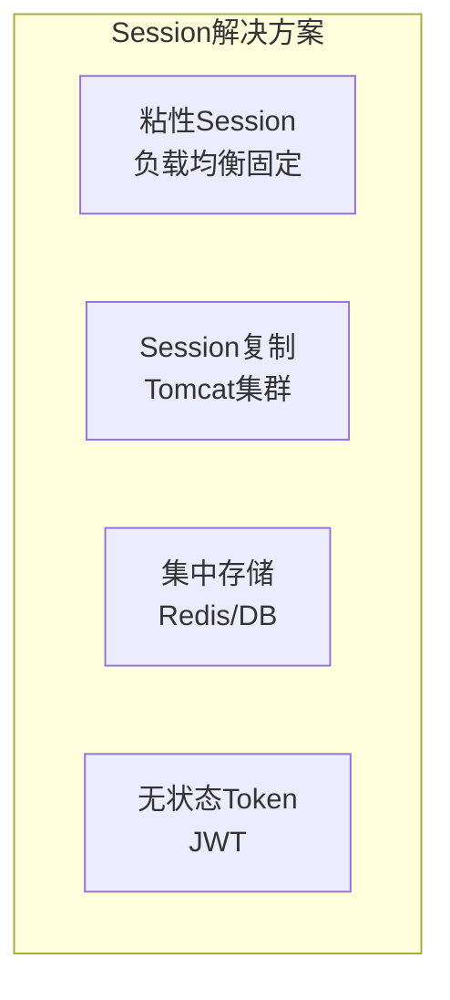
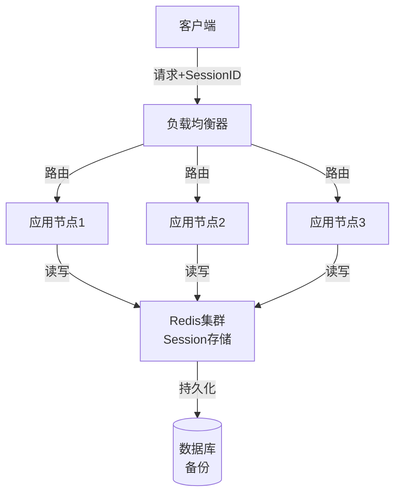
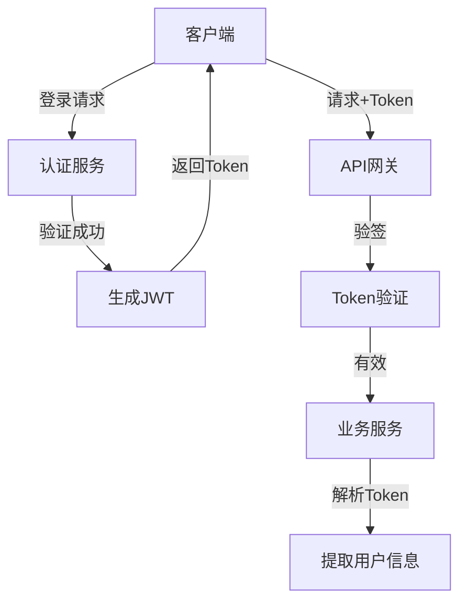
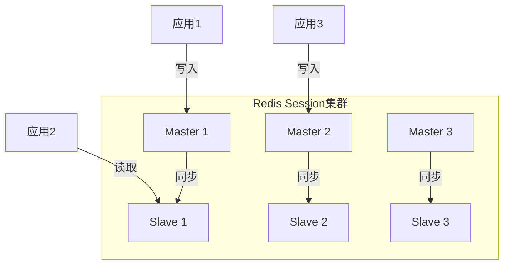

# 分布式Session

## 概述

在分布式系统中，用户请求可能被路由到不同的服务实例，传统的单机Session存储方式无法满足需求。分布式Session管理确保用户状态在集群中的所有节点间共享，提供一致的用户体验。

## Session管理方案对比



| 方案 | 优点 | 缺点 | 适用场景 |
|-----|------|------|---------|
| 粘性Session | 简单、无改造 | 单点故障、负载不均 | 小规模系统 |
| Session复制 | 去中心化 | 带宽消耗、延迟 | 小规模集群 |
| 集中存储 | 高可用、可扩展 | 依赖中间件 | 大规模系统 |
| JWT | 完全无状态 | Token过大、无法吊销 | 微服务架构 |

## 集中存储架构



## Spring Session + Redis

### 配置示例

```yaml
# application.yml
spring:
  session:
    store-type: redis
    redis:
      namespace: app:session
      cleanup-cron: 0 * * * * *
      flush-mode: on_save
      save-mode: on_set_attribute
  redis:
    host: redis-cluster
    port: 6379
    password: ${REDIS_PASSWORD}
    timeout: 2000ms
    lettuce:
      pool:
        max-active: 100
        max-idle: 50
        min-idle: 10
      cluster:
        refresh:
          adaptive: true
          period: 60s
      nodes:
      - redis-node1:6379
      - redis-node2:6379
      - redis-node3:6379

server:
  servlet:
    session:
      timeout: 30m  # Session过期时间
      cookie:
        name: SESSION_ID
        http-only: true
        secure: true
        same-site: strict
```

### 自定义Session配置

```java
@Configuration
@EnableRedisHttpSession(
    maxInactiveIntervalInSeconds = 1800,
    redisNamespace = "myapp:session"
)
public class SessionConfig {

    @Bean
    public LettuceConnectionFactory redisConnectionFactory() {
        RedisClusterConfiguration config = new RedisClusterConfiguration(
            Arrays.asList(
                "redis-node1:6379",
                "redis-node2:6379",
                "redis-node3:6379"
            )
        );
        config.setPassword(RedisPassword.of("password"));

        LettuceClientConfiguration clientConfig = LettuceClientConfiguration.builder()
            .readFrom(ReadFrom.REPLICA_PREFERRED)
            .build();

        return new LettuceConnectionFactory(config, clientConfig);
    }

    // 自定义Cookie序列化
    @Bean
    public HttpSessionIdResolver httpSessionIdResolver() {
        // 支持Cookie和Header两种方式
        return new CustomHttpSessionIdResolver();
    }
}

// 自定义Session ID解析器
public class CustomHttpSessionIdResolver implements HttpSessionIdResolver {

    private static final String HEADER_AUTHENTICATION_INFO = "Authentication-Info";

    @Override
    public List<String> resolveSessionIds(HttpServletRequest request) {
        // 优先从Header获取
        String sessionId = request.getHeader(HEADER_AUTHENTICATION_INFO);
        if (sessionId != null) {
            return Collections.singletonList(sessionId);
        }

        // 其次从Cookie获取
        Cookie[] cookies = request.getCookies();
        if (cookies != null) {
            for (Cookie cookie : cookies) {
                if ("SESSION_ID".equals(cookie.getName())) {
                    return Collections.singletonList(cookie.getValue());
                }
            }
        }

        return Collections.emptyList();
    }

    @Override
    public void setSessionId(HttpServletRequest request, HttpServletResponse response,
                             String sessionId) {
        // 设置Cookie
        Cookie cookie = new Cookie("SESSION_ID", sessionId);
        cookie.setPath("/");
        cookie.setHttpOnly(true);
        cookie.setSecure(true);
        cookie.setMaxAge(1800);
        response.addCookie(cookie);

        // 设置Header
        response.setHeader(HEADER_AUTHENTICATION_INFO, sessionId);
    }

    @Override
    public void expireSession(HttpServletRequest request, HttpServletResponse response) {
        Cookie cookie = new Cookie("SESSION_ID", null);
        cookie.setPath("/");
        cookie.setMaxAge(0);
        response.addCookie(cookie);
    }
}
```

### Session使用示例

```java
@RestController
@RequestMapping("/api/user")
public class UserController {

    @GetMapping("/session")
    public ResponseEntity<?> getSessionInfo(HttpSession session) {
        // Session会自动同步到Redis
        String userId = (String) session.getAttribute("userId");
        String username = (String) session.getAttribute("username");

        // 获取Session元数据
        Map<String, Object> sessionInfo = new HashMap<>();
        sessionInfo.put("sessionId", session.getId());
        sessionInfo.put("creationTime", session.getCreationTime());
        sessionInfo.put("lastAccessedTime", session.getLastAccessedTime());
        sessionInfo.put("maxInactiveInterval", session.getMaxInactiveInterval());
        sessionInfo.put("userId", userId);
        sessionInfo.put("username", username);

        return ResponseEntity.ok(sessionInfo);
    }

    @PostMapping("/login")
    public ResponseEntity<?> login(@RequestBody LoginRequest request,
                                    HttpSession session) {
        // 验证用户
        User user = userService.authenticate(request.getUsername(), request.getPassword());

        // 写入Session（自动同步到Redis）
        session.setAttribute("userId", user.getId());
        session.setAttribute("username", user.getUsername());
        session.setAttribute("roles", user.getRoles());
        session.setAttribute("loginTime", System.currentTimeMillis());

        return ResponseEntity.ok("Login successful");
    }

    @PostMapping("/logout")
    public ResponseEntity<?> logout(HttpSession session) {
        // 销毁Session（从Redis删除）
        session.invalidate();
        return ResponseEntity.ok("Logout successful");
    }
}
```

## JWT无状态方案



```java
// JWT工具类
@Component
public class JwtTokenProvider {

    @Value("${jwt.secret}")
    private String jwtSecret;

    @Value("${jwt.expiration}")
    private long jwtExpirationMs;

    private Key getSigningKey() {
        byte[] keyBytes = Decoders.BASE64.decode(jwtSecret);
        return Keys.hmacShaKeyFor(keyBytes);
    }

    public String generateToken(UserDetails userDetails) {
        Map<String, Object> claims = new HashMap<>();
        claims.put("roles", userDetails.getAuthorities());

        return Jwts.builder()
            .setClaims(claims)
            .setSubject(userDetails.getUsername())
            .setIssuedAt(new Date())
            .setExpiration(new Date(System.currentTimeMillis() + jwtExpirationMs))
            .signWith(getSigningKey(), SignatureAlgorithm.HS256)
            .compact();
    }

    public boolean validateToken(String token) {
        try {
            Jwts.parserBuilder()
                .setSigningKey(getSigningKey())
                .build()
                .parseClaimsJws(token);
            return true;
        } catch (JwtException | IllegalArgumentException e) {
            return false;
        }
    }

    public String getUsernameFromToken(String token) {
        Claims claims = Jwts.parserBuilder()
            .setSigningKey(getSigningKey())
            .build()
            .parseClaimsJws(token)
            .getBody();
        return claims.getSubject();
    }
}
```

## 混合方案：JWT + Redis

```java
@Service
public class HybridSessionService {

    @Autowired
    private StringRedisTemplate redisTemplate;

    @Autowired
    private JwtTokenProvider jwtProvider;

    private static final String TOKEN_PREFIX = "token:";
    private static final long TOKEN_EXPIRE = 30 * 60; // 30分钟

    public String createSession(User user) {
        // 生成JWT
        String token = jwtProvider.generateToken(user);

        // 存储到Redis，支持主动失效
        String key = TOKEN_PREFIX + token;
        Map<String, String> sessionData = new HashMap<>();
        sessionData.put("userId", user.getId());
        sessionData.put("username", user.getUsername());
        sessionData.put("loginTime", String.valueOf(System.currentTimeMillis()));

        redisTemplate.opsForHash().putAll(key, sessionData);
        redisTemplate.expire(key, TOKEN_EXPIRE, TimeUnit.SECONDS);

        return token;
    }

    public UserSession validateSession(String token) {
        // 1. 验证JWT签名
        if (!jwtProvider.validateToken(token)) {
            return null;
        }

        // 2. 检查Redis中是否存在（支持主动登出）
        String key = TOKEN_PREFIX + token;
        if (!redisTemplate.hasKey(key)) {
            return null; // 已登出或过期
        }

        // 3. 续期
        redisTemplate.expire(key, TOKEN_EXPIRE, TimeUnit.SECONDS);

        // 4. 返回会话信息
        Map<Object, Object> entries = redisTemplate.opsForHash().entries(key);
        return new UserSession(
            (String) entries.get("userId"),
            (String) entries.get("username")
        );
    }

    public void invalidateSession(String token) {
        String key = TOKEN_PREFIX + token;
        redisTemplate.delete(key);
    }
}
```

## Session高可用架构



## 最佳实践

1. **Session大小控制**：避免存储大量数据，只存必要信息
2. **过期策略**：合理设置过期时间，定期清理
3. **安全传输**：使用HTTPS，设置HttpOnly和Secure Cookie
4. **读写分离**：Redis主从模式分担读压力
5. **降级方案**：Redis故障时降级到数据库或JWT

## 总结

分布式Session管理是分布式系统的基础能力。集中存储方案（Redis）适合传统Web应用，JWT适合API和无状态服务，混合方案则兼顾了两者的优势。根据业务场景选择合适方案，并做好高可用和性能优化。
