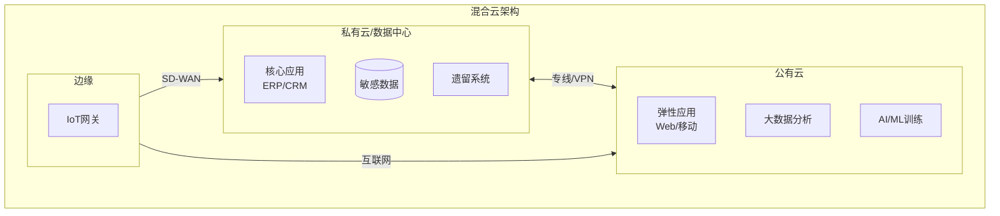
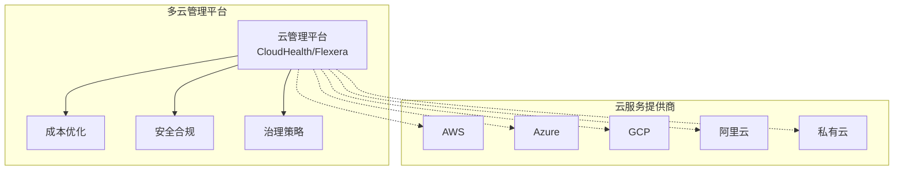
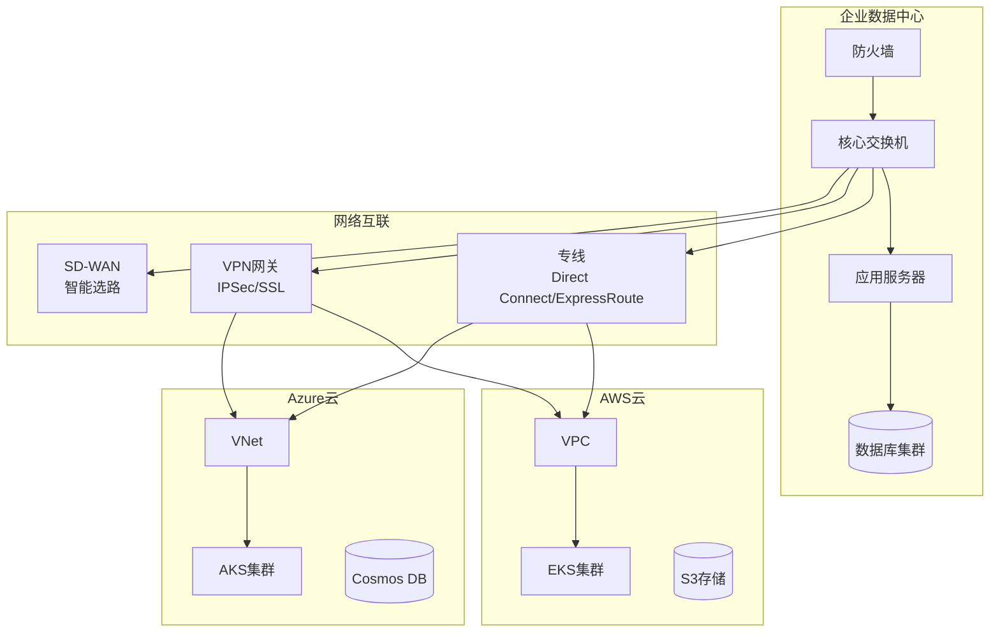
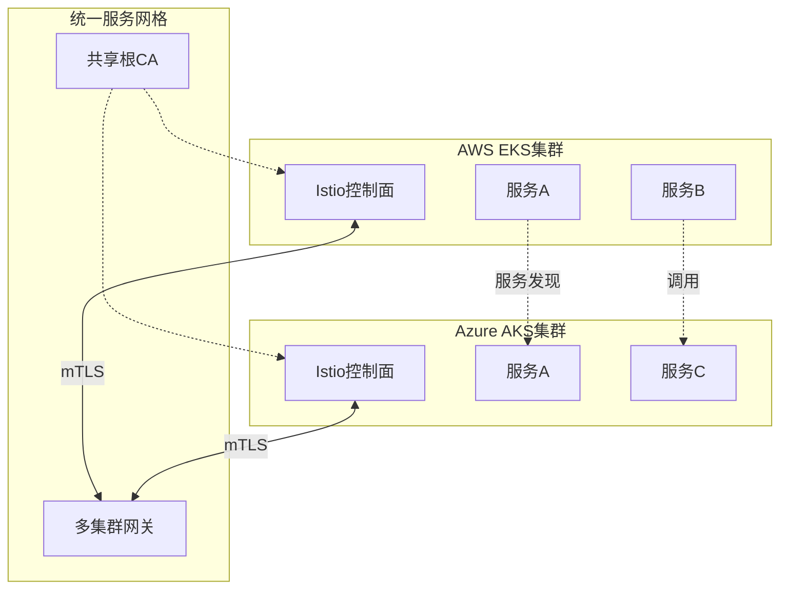
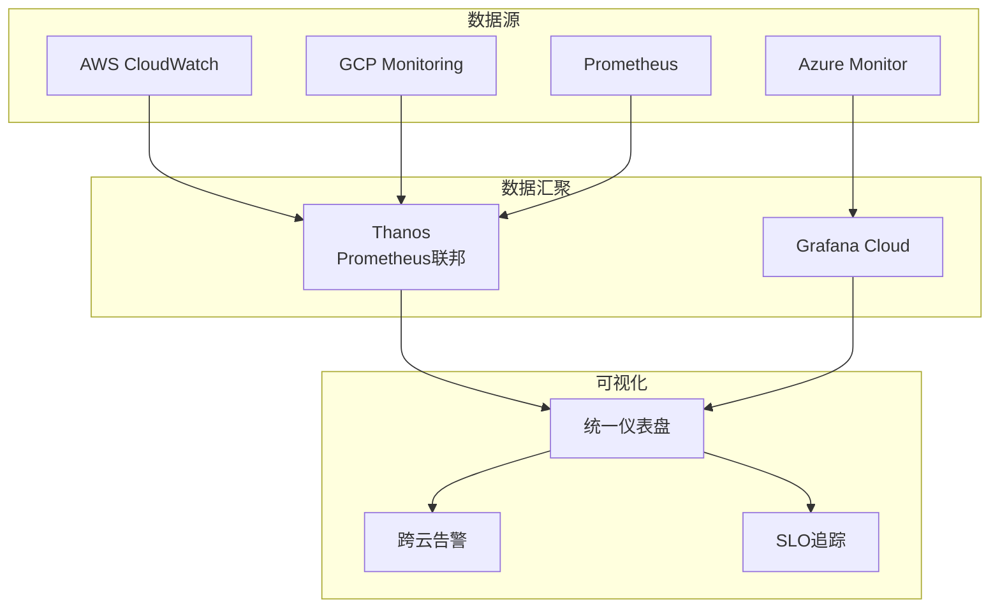

# 多云与混合云架构

## 概述

多云与混合云架构是企业IT战略的重要组成部分。混合云结合了私有云和公有云的优势，而多云策略则利用多个云服务提供商的能力，避免供应商锁定，实现最优资源配置。

## 架构模式



## 多云管理架构



## 跨云网络互联

### 网络架构



## 跨云Kubernetes

### 联邦集群架构

```yaml
# KubeFed (Kubernetes Federation) 配置
apiVersion: core.kubefed.io/v1beta1
kind: KubeFedCluster
metadata:
  name: aws-cluster
  namespace: kube-federation-system
spec:
  apiEndpoint: https://aws-cluster.example.com
  caBundle: <base64-encoded-ca-bundle>
  secretRef:
    name: aws-cluster-secret
---
apiVersion: core.kubefed.io/v1beta1
kind: KubeFedCluster
metadata:
  name: azure-cluster
  namespace: kube-federation-system
spec:
  apiEndpoint: https://azure-cluster.example.com
  caBundle: <base64-encoded-ca-bundle>
  secretRef:
    name: azure-cluster-secret
---
# 联邦部署配置
apiVersion: types.kubefed.io/v1beta1
kind: FederatedDeployment
metadata:
  name: web-app
  namespace: default
spec:
  template:
    metadata:
      labels:
        app: web
    spec:
      replicas: 3
      selector:
        matchLabels:
          app: web
      template:
        metadata:
          labels:
            app: web
        spec:
          containers:
          - name: nginx
            image: nginx:latest
  overrides:
  - clusterName: aws-cluster
    clusterOverrides:
    - path: "/spec/replicas"
      value: 5
  - clusterName: azure-cluster
    clusterOverrides:
    - path: "/spec/replicas"
      value: 3
  placement:
    clusters:
    - name: aws-cluster
    - name: azure-cluster
```

## 跨云服务网格



## 数据同步与灾备

### 跨云灾备架构

```yaml
# Velero跨云备份配置
apiVersion: velero.io/v1
kind: Backup
metadata:
  name: cross-cloud-backup
  namespace: velero
spec:
  includedNamespaces:
  - production
  - monitoring
  excludedResources:
  - events
  - pods
  labelSelector:
    matchLabels:
      backup: "true"
  storageLocation: aws-s3-primary
  volumeSnapshotLocations:
  - aws-ebs-snapshots
  ttl: 720h0m0s
  schedule: "0 2 * * *"
---
apiVersion: velero.io/v1
kind: Restore
metadata:
  name: disaster-recovery
  namespace: velero
spec:
  backupName: cross-cloud-backup
  includedNamespaces:
  - production
  namespaceMapping:
    production: production-dr
  restorePVs: true
```

## 成本优化策略

| 策略 | 说明 | 实施方式 |
|-----|------|---------|
| 工作负载分级 | 按重要性分配云资源 | 核心->私有云，弹性->公有云 |
| 按需扩缩容 | 自动调整资源规模 | 基于指标的自动伸缩 |
| 预留实例 | 长期稳定工作负载 | 1-3年预留获取折扣 |
| Spot实例 | 可中断批处理任务 | 利用闲置资源降低成本 |
| 存储分层 | 冷热数据分离 | 对象存储生命周期策略 |

## 统一监控体系



## 安全与合规

```yaml
# 跨云安全策略 - OPA/Gatekeeper
apiVersion: templates.gatekeeper.sh/v1beta1
kind: ConstraintTemplate
metadata:
  name: k8srequiredlabels
spec:
  crd:
    spec:
      names:
        kind: K8sRequiredLabels
      validation:
        type: object
        properties:
          labels:
            type: array
            items:
              type: string
  targets:
    - target: admission.k8s.gatekeeper.sh
      rego: |
        package k8srequiredlabels
        violation[{"msg": msg}] {
          required := input.parameters.labels[_]
          not input.review.object.metadata.labels[required]
          msg := sprintf("必须包含标签: %v", [required])
        }
---
apiVersion: constraints.gatekeeper.sh/v1beta1
kind: K8sRequiredLabels
metadata:
  name: require-cost-center
spec:
  match:
    kinds:
    - apiGroups: [""]
      kinds: ["Namespace"]
  parameters:
    labels:
    - cost-center
    - environment
    - owner
```

## 总结

多云与混合云架构为企业提供了灵活性和弹性，但也带来了管理复杂性。成功的实施需要统一的网络互联、一致的安全策略、自动化的运维工具和清晰的治理框架，才能实现云资源的优化配置和高效利用。
