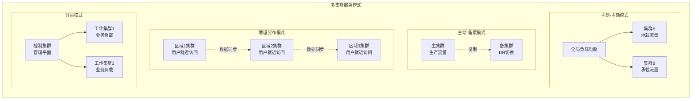
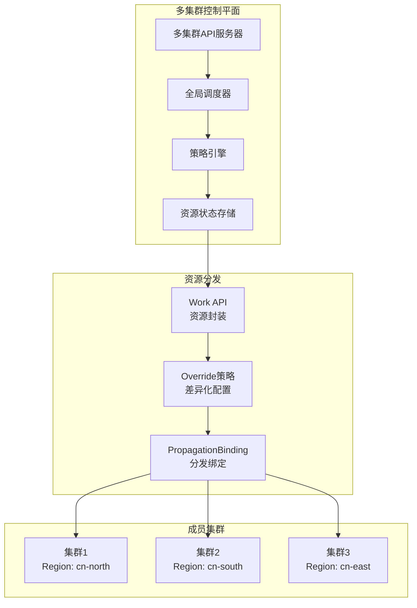
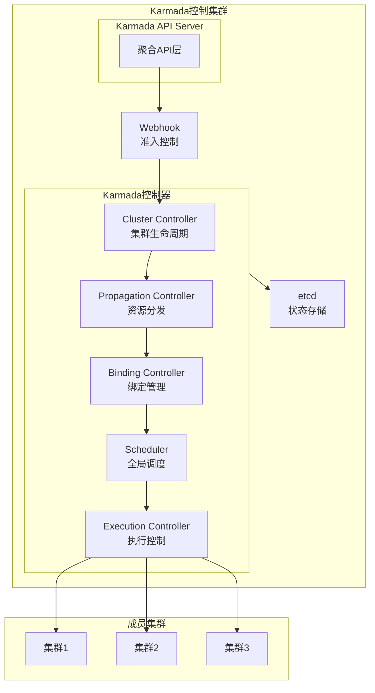
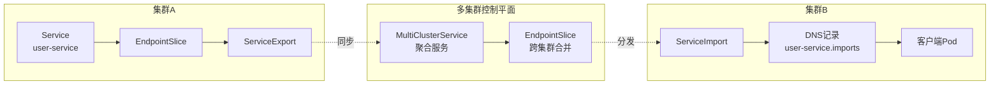
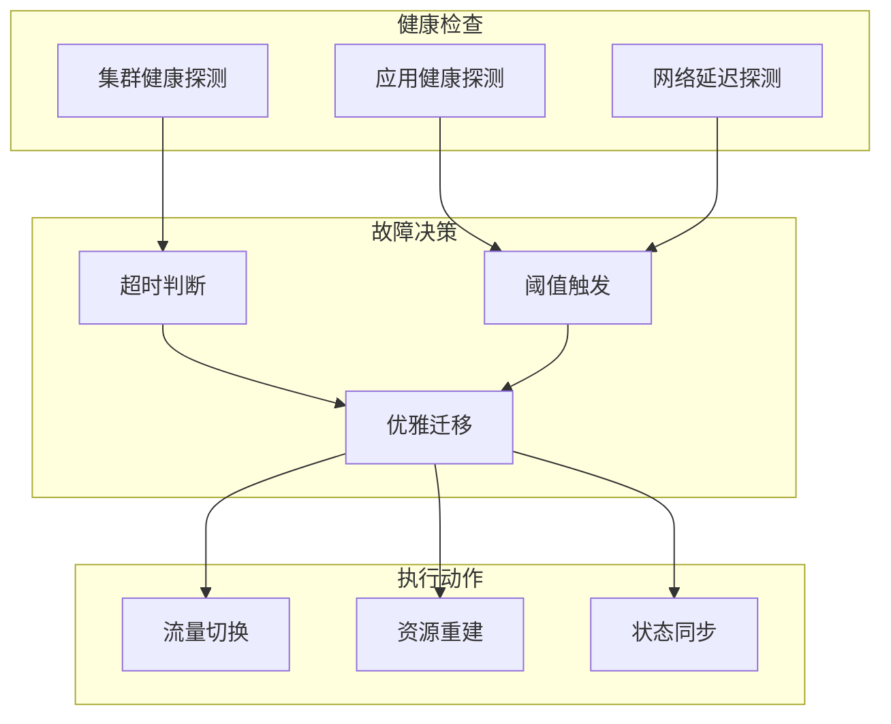
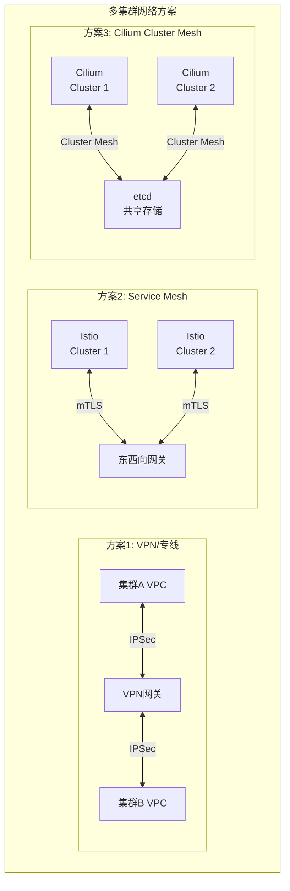

# 多集群管理

## 概述

多集群管理是Kubernetes在大规模生产环境中的重要能力，通过将工作负载分布在多个集群中，实现高可用性、故障隔离、合规性要求和资源优化。联邦集群技术（Federation）和Karmada等开源项目提供了统一的多集群管理能力，使运维团队能够像管理单一集群一样管理分布式集群基础设施。

## 架构模式

### 多集群部署模式



### 控制平面架构



## Karmada架构

### 核心组件



### 安装部署

```yaml
# Karmada控制平面安装
apiVersion: apps/v1
kind: Deployment
metadata:
  name: karmada-controller-manager
  namespace: karmada-system
spec:
  replicas: 2
  selector:
    matchLabels:
      app: karmada-controller-manager
  template:
    metadata:
      labels:
        app: karmada-controller-manager
    spec:
      containers:
      - name: controller-manager
        image: docker.io/karmada/karmada-controller-manager:v1.8.0
        command:
        - /bin/karmada-controller-manager
        - --kubeconfig=/etc/kubeconfig
        - --bind-address=0.0.0.0
        - --secure-port=10357
        - --v=4
        resources:
          requests:
            cpu: 100m
            memory: 256Mi
          limits:
            cpu: 500m
            memory: 512Mi
        volumeMounts:
        - name: kubeconfig
          mountPath: /etc/kubeconfig
          readOnly: true
      volumes:
      - name: kubeconfig
        secret:
          secretName: karmada-kubeconfig
---
# Karmada调度器
apiVersion: apps/v1
kind: Deployment
metadata:
  name: karmada-scheduler
  namespace: karmada-system
spec:
  replicas: 2
  selector:
    matchLabels:
      app: karmada-scheduler
  template:
    metadata:
      labels:
        app: karmada-scheduler
    spec:
      containers:
      - name: scheduler
        image: docker.io/karmada/karmada-scheduler:v1.8.0
        command:
        - /bin/karmada-scheduler
        - --kubeconfig=/etc/kubeconfig
        - --bind-address=0.0.0.0
        - --secure-port=10351
        - --scheduler-name=default-scheduler
        - --enable-scheduler-estimator=true
        - --scheduler-estimator-port=10352
        resources:
          requests:
            cpu: 100m
            memory: 256Mi
```

## 集群联邦

### Cluster资源定义

```yaml
# 注册成员集群
apiVersion: cluster.karmada.io/v1alpha1
kind: Cluster
metadata:
  name: production-beijing
  labels:
    region: cn-north
    environment: production
    zone: beijing
spec:
  apiEndpoint: https://beijing-k8s.example.com:6443
  secretRef:
    name: beijing-kubeconfig
    namespace: karmada-system
  syncMode: Push
  taints:
  - key: dedicated
    value: gpu-workload
    effect: NoSchedule
  resourceModels:
  - grade: 0
    ranges:
    - name: cpu
      min: 0
      max: 1
    - name: memory
      min: 0
      max: 4Gi
  - grade: 1
    ranges:
    - name: cpu
      min: 1
      max: 2
    - name: memory
      min: 4Gi
      max: 8Gi
  - grade: 2
    ranges:
    - name: cpu
      min: 2
      max: 4
    - name: memory
      min: 8Gi
      max: 16Gi
---
# 生产环境集群
apiVersion: cluster.karmada.io/v1alpha1
kind: Cluster
metadata:
  name: production-shanghai
  labels:
    region: cn-east
    environment: production
    zone: shanghai
spec:
  apiEndpoint: https://shanghai-k8s.example.com:6443
  secretRef:
    name: shanghai-kubeconfig
  syncMode: Push
  impersonatorSecretRef:
    name: shanghai-impersonator
```

### 资源分发策略

```yaml
# PropagationPolicy - 资源分发策略
apiVersion: policy.karmada.io/v1alpha1
kind: PropagationPolicy
metadata:
  name: frontend-propagation
  namespace: production
spec:
  resourceSelectors:
  - apiVersion: apps/v1
    kind: Deployment
    name: frontend-app
    namespace: production
  - apiVersion: v1
    kind: Service
    name: frontend-service
    namespace: production
  - apiVersion: v1
    kind: ConfigMap
    name: frontend-config
    namespace: production

  placement:
    clusterAffinity:
      clusterNames:
      - production-beijing
      - production-shanghai
      - production-guangzhou
    clusterTolerations:
    - key: dedicated
      operator: Equal
      value: gpu-workload
      effect: NoSchedule

    replicaScheduling:
      replicaSchedulingType: Divided
      replicaDivisionPreference: Weighted
      weightPreference:
        staticWeightList:
        - targetCluster:
            clusterNames:
            - production-beijing
          weight: 40
        - targetCluster:
            clusterNames:
            - production-shanghai
          weight: 35
        - targetCluster:
            clusterNames:
            - production-guangzhou
          weight: 25

    spreadConstraints:
    - maxGroups: 3
      minGroups: 2
      spreadByField: region
      spreadByLabel: topology.kubernetes.io/region

  failover:
    application:
      decisionConditions:
        tolerationSeconds: 60
      purgeMode: Immediately
      gracePeriodSeconds: 30

  schedulerName: default-scheduler
  dependentOverrides:
  - frontend-override
---
# ClusterPropagationPolicy - 集群级资源分发
apiVersion: policy.karmada.io/v1alpha1
kind: ClusterPropagationPolicy
metadata:
  name: storage-class-propagation
spec:
  resourceSelectors:
  - apiVersion: storage.k8s.io/v1
    kind: StorageClass
    name: fast-ssd
  placement:
    clusterAffinity:
      labelSelector:
        matchLabels:
          environment: production
    spreadConstraints:
    - spreadByField: cluster
      minGroups: 2
```

## 跨集群服务发现

### 服务导出与导入



### 配置示例

```yaml
# ServiceExport - 导出服务
apiVersion: multicluster.x-k8s.io/v1alpha1
kind: ServiceExport
metadata:
  name: user-service
  namespace: production
  labels:
    app: user-service
    version: v1
---
# ServiceImport - 导入服务
apiVersion: multicluster.x-k8s.io/v1alpha1
kind: ServiceImport
metadata:
  name: user-service
  namespace: production
spec:
  type: ClusterSetIP
  ports:
  - name: http
    protocol: TCP
    port: 8080
  - name: grpc
    protocol: TCP
    port: 50051
  sessionAffinity: None
---
# 多集群Service配置
apiVersion: policy.karmada.io/v1alpha1
kind: MultiClusterService
metadata:
  name: user-service-mcs
  namespace: production
spec:
  types:
  - CrossCluster
  ports:
  - port: 8080
    name: http
    protocol: TCP
    targetPort: 8080
  - port: 50051
    name: grpc
    protocol: TCP
    targetPort: 50051
  range:
    exposureMode: LoadBalancer
  discovery:
    type: LoadBalancer
```

## 故障域隔离

### 故障转移策略



### 配置实现

```yaml
# 故障转移策略
apiVersion: policy.karmada.io/v1alpha1
kind: PropagationPolicy
metadata:
  name: critical-service-failover
spec:
  resourceSelectors:
  - apiVersion: apps/v1
    kind: Deployment
    name: payment-service
  placement:
    clusterAffinity:
      clusterNames:
      - cluster-beijing
      - cluster-shanghai
      - cluster-guangzhou
    replicaScheduling:
      replicaSchedulingType: Divided
      replicaDivisionPreference: Weighted
      weightPreference:
        dynamicWeight:
          byAvailableReplicas: true
  failover:
    application:
      decisionConditions:
        tolerationSeconds: 30
      purgeMode: Immediately
      gracePeriodSeconds: 10
  # 污点容忍配置
  clusterTolerations:
  - key: cluster.karmada.io/not-ready
    operator: Exists
    effect: NoExecute
    tolerationSeconds: 30
  - key: cluster.karmada.io/unreachable
    operator: Exists
    effect: NoExecute
    tolerationSeconds: 30
---
# 集群状态检查配置
apiVersion: cluster.karmada.io/v1alpha1
kind: Cluster
metadata:
  name: cluster-beijing
spec:
  apiEndpoint: https://beijing-k8s.example.com:6443
  secretRef:
    name: beijing-kubeconfig
  syncMode: Push
  probe:
    periodSeconds: 10
    timeoutSeconds: 5
    failureThreshold: 3
    successThreshold: 1
```

## 差异化配置

### OverridePolicy

```yaml
# OverridePolicy - 差异化覆盖策略
apiVersion: policy.karmada.io/v1alpha1
kind: OverridePolicy
metadata:
  name: frontend-override
  namespace: production
spec:
  resourceSelectors:
  - apiVersion: apps/v1
    kind: Deployment
    name: frontend-app

  overrideRules:
  # 北京地区：增加副本数，使用本地镜像仓库
  - targetCluster:
      clusterNames:
      - production-beijing
    overriders:
      plaintext:
      - path: "/spec/replicas"
        operator: replace
        value: 10
      - path: "/spec/template/spec/containers/0/image"
        operator: replace
        value: "registry-beijing.example.com/frontend:v1.2.0"
      - path: "/spec/template/spec/nodeSelector"
        operator: add
        value:
          topology.kubernetes.io/zone: beijing-az1

  # 上海地区：启用GPU节点
  - targetCluster:
      clusterNames:
      - production-shanghai
    overriders:
      plaintext:
      - path: "/spec/template/spec/containers/0/resources/limits"
        operator: replace
        value:
          cpu: "4"
          memory: 8Gi
          nvidia.com/gpu: "1"
      - path: "/spec/template/spec/tolerations"
        operator: add
        value:
        - key: nvidia.com/gpu
          operator: Exists
          effect: NoSchedule

  # 广州地区：缩减配置（边缘场景）
  - targetCluster:
      clusterNames:
      - production-guangzhou
    overriders:
      plaintext:
      - path: "/spec/replicas"
        operator: replace
        value: 3
      - path: "/spec/template/spec/containers/0/resources"
        operator: replace
        value:
          requests:
            cpu: 100m
            memory: 128Mi
          limits:
            cpu: 500m
            memory: 512Mi
      imageOverrider:
      - component: Registry
        operator: replace
        value: "registry-guangzhou.example.com"
```

### 镜像覆盖策略

```yaml
apiVersion: policy.karmada.io/v1alpha1
kind: OverridePolicy
metadata:
  name: image-override-policy
spec:
  resourceSelectors:
  - apiVersion: apps/v1
    kind: Deployment
    labelSelector:
      matchLabels:
        app: backend
  overrideRules:
  - targetCluster:
      labelSelector:
        matchLabels:
          region: cn-north
    imageOverrider:
    - predicate:
        path: /spec/template/spec/containers
      component: Registry
      operator: replace
      value: registry.cn-beijing.aliyuncs.com
  - targetCluster:
      labelSelector:
        matchLabels:
          region: cn-south
    imageOverrider:
    - predicate:
        path: /spec/template/spec/containers
      component: Registry
      operator: replace
      value: registry.cn-shenzhen.aliyuncs.com
  - targetCluster:
      labelSelector:
        matchLabels:
          environment: development
    imageOverrider:
    - predicate:
        path: /spec/template/spec/containers
      component: Tag
      operator: replace
      value: latest
```

## 生产实践建议

### 1. 网络互联



### 2. 安全隔离

```yaml
# 集群隔离策略
apiVersion: policy.karmada.io/v1alpha1
kind: PropagationPolicy
metadata:
  name: namespace-isolation
spec:
  resourceSelectors:
  - apiVersion: v1
    kind: Namespace
    name: sensitive-data
  placement:
    clusterAffinity:
      labelSelector:
        matchLabels:
          security-level: high
          compliance: pci-dss
    spreadConstraints:
    - spreadByField: region
      minGroups: 2
      maxGroups: 2
---
# 网络策略同步
apiVersion: networking.k8s.io/v1
kind: NetworkPolicy
metadata:
  name: cross-cluster-restrict
  namespace: sensitive-data
spec:
  podSelector: {}
  policyTypes:
  - Ingress
  - Egress
  ingress:
  - from:
    - namespaceSelector:
        matchLabels:
          kubernetes.io/metadata.name: kube-system
    - podSelector:
        matchLabels:
          app: authorized-client
  egress:
  - to:
    - namespaceSelector:
        matchLabels:
          kubernetes.io/metadata.name: kube-system
    ports:
    - protocol: UDP
      port: 53
  - to:
    - podSelector:
        matchLabels:
          app: allowed-external
```

### 3. 监控体系

```yaml
# 多集群监控配置
apiVersion: policy.karmada.io/v1alpha1
kind: PropagationPolicy
metadata:
  name: monitoring-stack
spec:
  resourceSelectors:
  - apiVersion: apps/v1
    kind: Deployment
    name: prometheus-agent
    namespace: monitoring
  - apiVersion: v1
    kind: ConfigMap
    name: prometheus-config
    namespace: monitoring
  placement:
    clusterAffinity:
      labelSelector:
        matchLabels:
          monitoring: enabled
---
# 集中式告警
apiVersion: monitoring.coreos.com/v1
kind: PrometheusRule
metadata:
  name: multicluster-alerts
  namespace: monitoring
spec:
  groups:
  - name: multicluster
    rules:
    - alert: ClusterUnreachable
      expr: karmada_cluster_ready{ready="false"} == 1
      for: 5m
      labels:
        severity: critical
      annotations:
        summary: "集群 {{ $labels.cluster }} 不可达"
        description: "集群已失联超过5分钟"

    - alert: ResourcePropagationFailed
      expr: karmada_resource_binding_status{status="Failed"} == 1
      for: 1m
      labels:
        severity: warning
      annotations:
        summary: "资源分发失败"
        description: "资源 {{ $labels.name }} 分发到集群 {{ $labels.cluster }} 失败"
```

### 4. 灾难恢复

```bash
# 备份Karmada控制平面
kubectl karmada backup create --name=karmada-backup-$(date +%Y%m%d)

# 集群故障切换
kubectl karmada failover trigger --cluster=failed-cluster --workloads=all

# 验证多集群状态
kubectl karmada status clusters

# 查看资源分发状态
kubectl get resourcebindings -A
```

### 5. 升级策略

```yaml
# 滚动升级策略
apiVersion: policy.karmada.io/v1alpha1
kind: PropagationPolicy
metadata:
  name: canary-upgrade
spec:
  resourceSelectors:
  - apiVersion: apps/v1
    kind: Deployment
    name: api-gateway
  placement:
    clusterAffinity:
      clusterNames:
      - cluster-canary
      - cluster-production-1
      - cluster-production-2
  upgradeStrategy:
    type: RollingUpdate
    rollingUpdate:
      maxSurge: 25%
      maxUnavailable: 0
```

## 总结

多集群管理是Kubernetes在大规模生产环境中实现高可用、故障隔离和地理分布的关键能力。通过Karmada等联邦技术，可以实现统一的多集群资源管理、跨集群服务发现和自动故障转移。合理的网络互联、安全隔离和监控体系是保障多集群稳定运行的基础，企业应根据自身需求选择合适的部署模式和管理策略。
