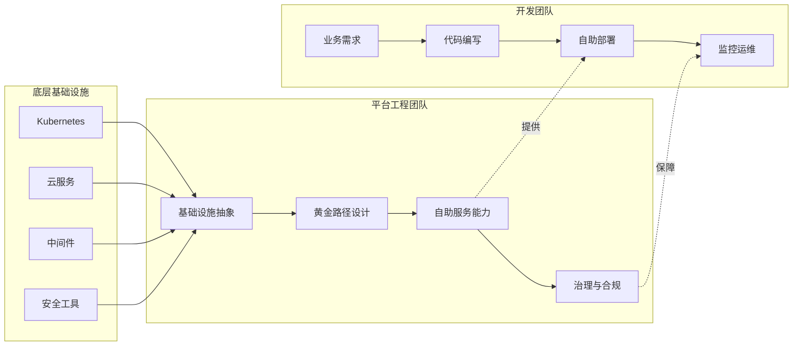
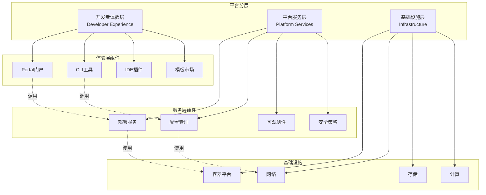
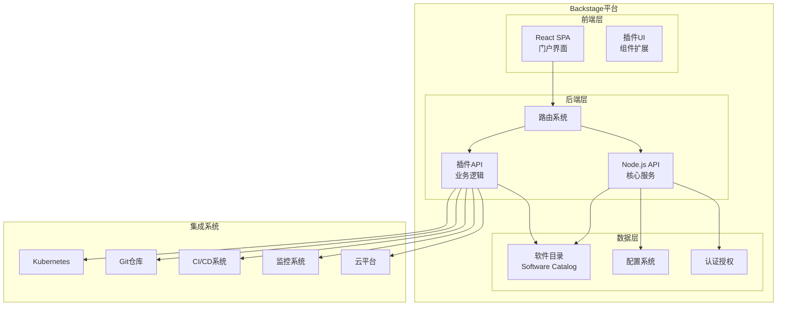
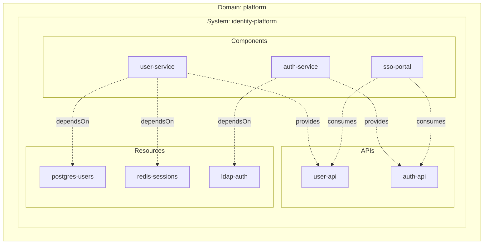
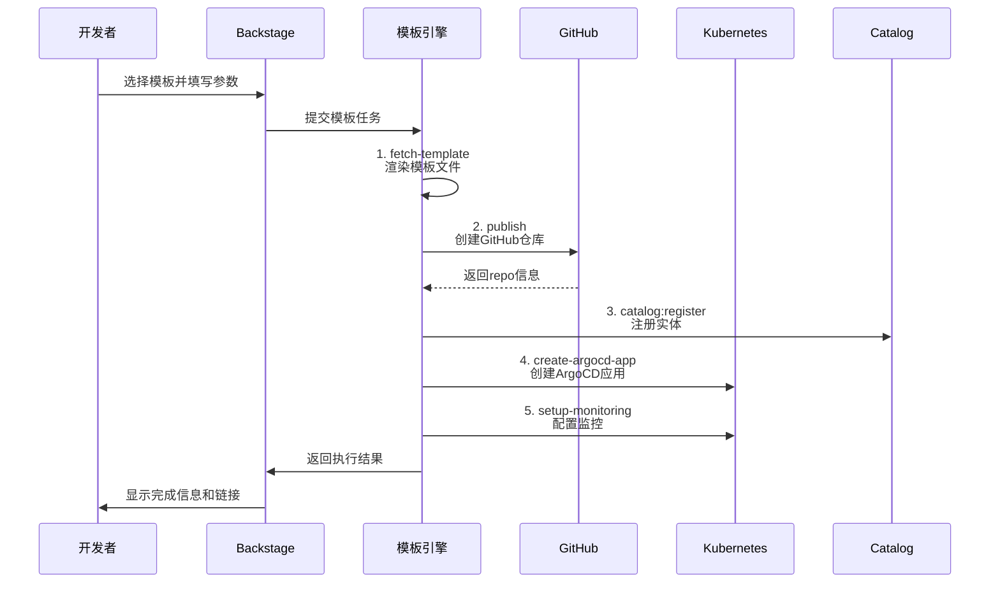
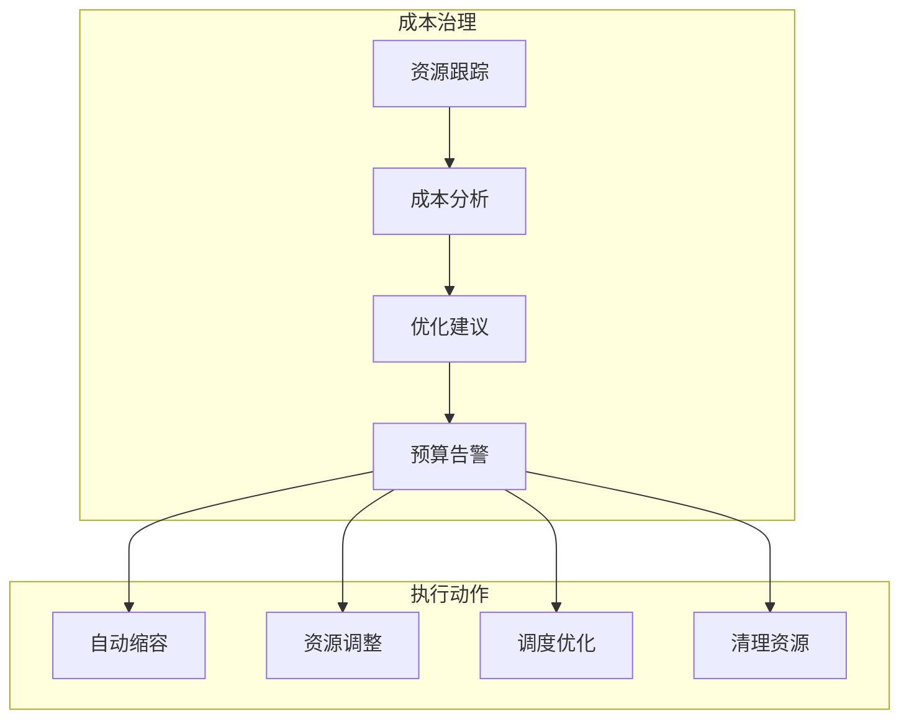
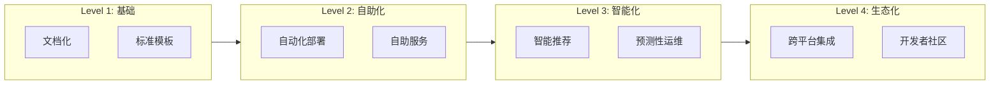
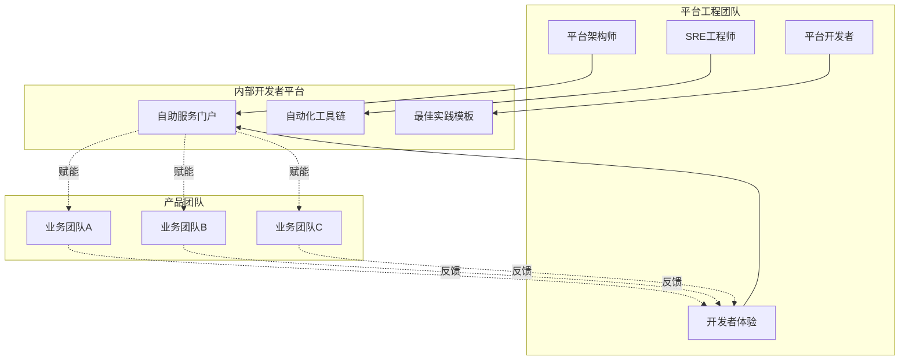

# 平台工程

## 概述

平台工程（Platform Engineering）是一种通过构建内部开发者平台（Internal Developer Platform, IDP）来提升开发团队生产力和体验的学科。它将基础设施、工具链和最佳实践产品化，通过自助服务能力让开发者能够专注于业务价值交付，而非底层基础设施管理。平台工程代表了DevOps文化的演进，从"谁构建谁运行"到"平台团队赋能应用团队"的转变。

## 核心理念

### 平台工程价值流



### 平台分层架构



## Backstage架构

### 整体架构



### 安装配置

```yaml
# Backstage部署配置
apiVersion: apps/v1
kind: Deployment
metadata:
  name: backstage
  namespace: platform
spec:
  replicas: 2
  selector:
    matchLabels:
      app: backstage
  template:
    metadata:
      labels:
        app: backstage
    spec:
      containers:
      - name: backstage
        image: company/backstage:latest
        ports:
        - containerPort: 7007
          name: http
        env:
        - name: POSTGRES_HOST
          value: backstage-db.platform.svc.cluster.local
        - name: POSTGRES_PORT
          value: "5432"
        - name: POSTGRES_USER
          valueFrom:
            secretKeyRef:
              name: backstage-db-secret
              key: username
        - name: POSTGRES_PASSWORD
          valueFrom:
            secretKeyRef:
              name: backstage-db-secret
              key: password
        - name: GITHUB_TOKEN
          valueFrom:
            secretKeyRef:
              name: github-credentials
              key: token
        - name: K8S_CONFIG
          valueFrom:
            configMapKeyRef:
              name: k8s-config
              key: config
        resources:
          requests:
            cpu: 500m
            memory: 512Mi
          limits:
            cpu: 2000m
            memory: 2Gi
        livenessProbe:
          httpGet:
            path: /healthcheck
            port: 7007
          initialDelaySeconds: 60
          periodSeconds: 10
        readinessProbe:
          httpGet:
            path: /healthcheck
            port: 7007
          initialDelaySeconds: 10
          periodSeconds: 5
---
# Backstage配置文件
apiVersion: v1
kind: ConfigMap
metadata:
  name: backstage-config
data:
  app-config.yaml: |
    app:
      title: Internal Developer Platform
      baseUrl: https://platform.company.com
    organization:
      name: Company Platform
    backend:
      baseUrl: https://platform.company.com
      listen:
        port: 7007
      database:
        client: pg
        connection:
          host: backstage-db.platform.svc.cluster.local
          port: 5432
          user: ${POSTGRES_USER}
          password: ${POSTGRES_PASSWORD}
      cache:
        store: memory
    auth:
      environment: production
      providers:
        github:
          production:
            clientId: ${GITHUB_CLIENT_ID}
            clientSecret: ${GITHUB_CLIENT_SECRET}
        oauth2:
          production:
            clientId: ${OAUTH_CLIENT_ID}
            clientSecret: ${OAUTH_CLIENT_SECRET}
    catalog:
      import:
        entityFilename: catalog-info.yaml
        pullRequestBranchName: backstage-integration
      rules:
        - allow: [Component, System, API, Resource, Location]
      locations:
        - type: url
          target: https://github.com/company/catalog/blob/main/all.yaml
          rules:
            - allow: [Component, System, API, Resource]
    kubernetes:
      serviceLocatorMethod:
        type: multiTenant
      clusterLocatorMethods:
        - type: config
          clusters:
            - url: https://prod-k8s.example.com
              name: production
              authProvider: oidc
              oidcTokenProvider: oidc
    scaffolder:
      defaultAuthor:
        name: Platform Bot
        email: platform@company.com
      defaultCommitMessage: "Create new component"
      allowedHosts:
        - github.com
        - gitlab.company.com
    permission:
      enabled: true
      rbac:
        admin:
          users:
            - name: platform-team
        roles:
          - name: developer
            description: Standard developer access
            permissions:
              - permission: catalog.entity.read
              - permission: scaffolder.template.read
              - permission: scaffolder.task.create
```

## 软件目录

### Catalog实体定义

```yaml
# catalog-info.yaml - 组件定义
apiVersion: backstage.io/v1alpha1
kind: Component
metadata:
  name: user-service
  description: 用户管理服务
  labels:
    tier: backend
    language: go
    team: platform
  annotations:
    github.com/project-slug: company/user-service
    backstage.io/techdocs-ref: dir:.
    backstage.io/kubernetes-id: user-service
    backstage.io/source-location: url:https://github.com/company/user-service
    grafana/dashboard-selector: '"tags" @> ["user-service"]'
    pagerduty.com/integration-key: <KEY>
    jira/project-key: US
  tags:
    - go
    - grpc
    - microservice
  links:
    - url: https://api.company.com/users
      title: API文档
      icon: docs
    - url: https://grafana.company.com/d/user-service
      title: 监控面板
      icon: dashboard
    - url: https://runbooks.company.com/user-service
      title: 运维手册
      icon: book
spec:
  type: service
  lifecycle: production
  owner: platform-team
  system: identity-platform
  dependsOn:
    - resource:postgres-users
    - resource:redis-sessions
    - component:auth-service
  providesApis:
    - user-api
  consumesApis:
    - notification-api
---
# API定义
apiVersion: backstage.io/v1alpha1
kind: API
metadata:
  name: user-api
  description: 用户管理API
  tags:
    - rest
    - v1
spec:
  type: openapi
  lifecycle: production
  owner: platform-team
  system: identity-platform
  definition:
    $text: https://github.com/company/user-service/blob/main/api/openapi.yaml
---
# 资源定义
apiVersion: backstage.io/v1alpha1
kind: Resource
metadata:
  name: postgres-users
  description: 用户数据库
  annotations:
    backstage.io/kubernetes-id: postgres-users
spec:
  type: database
  owner: dba-team
  system: identity-platform
  dependsOn:
    - resource:postgres-cluster-prod
---
# 系统定义
apiVersion: backstage.io/v1alpha1
kind: System
metadata:
  name: identity-platform
  description: 统一身份认证与授权平台
  tags:
    - security
    - core
spec:
  owner: platform-team
  domain: platform
---
# 领域定义
apiVersion: backstage.io/v1alpha1
kind: Domain
metadata:
  name: platform
  description: 平台基础设施领域
spec:
  owner: platform-team
```

### 目录关系图



## Scaffolder模板

### 服务模板

```yaml
# template.yaml - 微服务脚手架模板
apiVersion: scaffolder.backstage.io/v1beta3
kind: Template
metadata:
  name: go-microservice
  title: Go微服务模板
  description: 创建标准Go微服务项目
  tags:
    - go
    - microservice
    - grpc
spec:
  owner: platform-team
  type: service
  
  parameters:
    - title: 基本信息
      required:
        - name
        - owner
        - description
      properties:
        name:
          title: 服务名称
          type: string
          description: 唯一服务标识
          ui:field: EntityNamePicker
        owner:
          title: 所有者
          type: string
          description: 团队或用户
          ui:field: OwnerPicker
          ui:options:
            allowedKinds:
              - Group
        description:
          title: 描述
          type: string
          description: 服务功能描述
    
    - title: 技术选项
      properties:
        protocol:
          title: 通信协议
          type: string
          enum:
            - http
            - grpc
            - both
          default: grpc
        database:
          title: 数据库
          type: string
          enum:
            - none
            - postgres
            - mysql
            - mongodb
          default: postgres
        cache:
          title: 缓存
          type: string
          enum:
            - none
            - redis
            - memcached
          default: redis
        observability:
          title: 可观测性
          type: array
          items:
            type: string
            enum:
              - metrics
              - tracing
              - logging
          default:
            - metrics
            - logging
    
    - title: 部署配置
      properties:
        replicas:
          title: 副本数
          type: number
          default: 3
        resources:
          title: 资源规格
          type: object
          properties:
            cpu:
              type: string
              default: 500m
            memory:
              type: string
              default: 512Mi
  
  steps:
    - id: fetch-template
      name: 获取模板
      action: fetch:template
      input:
        url: ./skeleton
        values:
          name: ${{ parameters.name }}
          owner: ${{ parameters.owner }}
          description: ${{ parameters.description }}
          protocol: ${{ parameters.protocol }}
          database: ${{ parameters.database }}
          cache: ${{ parameters.cache }}
          observability: ${{ parameters.observability }}
          replicas: ${{ parameters.replicas }}
          resources: ${{ parameters.resources }}
    
    - id: publish
      name: 发布到GitHub
      action: publish:github
      input:
        allowedHosts: ['github.com']
        description: ${{ parameters.description }}
        repoUrl: github.com?owner=company&repo=${{ parameters.name }}
        defaultBranch: main
        protectDefaultBranch: true
        protectEnforceAdmins: true
    
    - id: register
      name: 注册到Catalog
      action: catalog:register
      input:
        repoContentsUrl: ${{ steps.publish.output.repoContentsUrl }}
        catalogInfoPath: '/catalog-info.yaml'
    
    - id: create-argocd-app
      name: 创建ArgoCD应用
      action: trigger:argocd:app-create
      input:
        appName: ${{ parameters.name }}
        repoUrl: ${{ steps.publish.output.remoteUrl }}
        namespace: ${{ parameters.name }}
        environment: development
    
    - id: setup-monitoring
      name: 配置监控
      action: trigger:prometheus:setup
      input:
        serviceName: ${{ parameters.name }}
        metrics: ${{ parameters.observability }}
    
    - id: create-slack-channel
      name: 创建Slack频道
      action: slack:channel:create
      input:
        channel: '#service-${{ parameters.name }}'
        topic: 'Service: ${{ parameters.name }} | Owner: ${{ parameters.owner }}'
  
  output:
    links:
      - title: 代码仓库
        url: ${{ steps.publish.output.remoteUrl }}
      - title: 服务目录
        icon: catalog
        entityRef: ${{ steps.register.output.entityRef }}
      - title: 开发环境
        url: https://${{ parameters.name }}-dev.company.com
    text:
      - title: 下一步
        content: |
          服务 ${{ parameters.name }} 已创建完成！
          
          1. 克隆代码: `git clone ${{ steps.publish.output.remoteUrl }}`
          2. 本地开发: `make dev`
          3. 查看文档: ${{ steps.publish.output.remoteUrl }}/blob/main/README.md
          4. 加入频道: #service-${{ parameters.name }}
```

### 模板执行流程



## 自助服务能力

### 环境管理

```yaml
# 环境即服务模板
apiVersion: scaffolder.backstage.io/v1beta3
kind: Template
metadata:
  name: ephemeral-environment
  title: 临时环境
  description: 创建临时开发/测试环境
spec:
  type: environment
  parameters:
    - title: 环境配置
      properties:
        purpose:
          title: 用途
          type: string
          enum:
            - feature-test
            - bug-fix
            - demo
        ttl:
          title: 存活时间
          type: string
          enum:
            - 1h
            - 4h
            - 1d
            - 7d
          default: 4h
        services:
          title: 包含服务
          type: array
          items:
            type: string
            enum:
              - api-gateway
              - user-service
              - order-service
              - payment-service
          default:
            - api-gateway
            - user-service
  
  steps:
    - id: create-namespace
      name: 创建命名空间
      action: kubernetes:namespace:create
      input:
        namespace: ephemeral-${{ parameters.purpose }}-${{ randomString 5 }}
        labels:
          type: ephemeral
          ttl: ${{ parameters.ttl }}
          creator: ${{ user.entity.metadata.name }}
    
    - id: deploy-services
      name: 部署服务
      action: kubernetes:helm:deploy
      input:
        namespace: ${{ steps.create-namespace.output.namespace }}
        chart: company-platform/ephemeral-stack
        values:
          services: ${{ parameters.services }}
          databases:
            enabled: true
            ephemeral: true
    
    - id: register-environment
      name: 注册环境
      action: catalog:register
      input:
        catalogInfo:
          apiVersion: backstage.io/v1alpha1
          kind: Resource
          metadata:
            name: ${{ steps.create-namespace.output.namespace }}
            annotations:
              ephemeral.environment/expires: ${{ steps.create-namespace.output.expiresAt }}
              ephemeral.environment/url: https://${{ steps.create-namespace.output.namespace }}.dev.company.com
          spec:
            type: ephemeral-environment
            owner: ${{ user.entity.metadata.name }}
  
  output:
    links:
      - title: 环境访问
        url: https://${{ steps.create-namespace.output.namespace }}.dev.company.com
      - title: ArgoCD
        url: https://argocd.company.com/applications/${{ steps.create-namespace.output.namespace }}
```

### 数据库即服务

```yaml
apiVersion: scaffolder.backstage.io/v1beta3
kind: Template
metadata:
  name: database-instance
  title: 数据库实例
  description: 申请新的数据库实例
spec:
  type: resource
  parameters:
    - title: 数据库配置
      properties:
        engine:
          title: 数据库类型
          type: string
          enum:
            - postgres
            - mysql
            - mongodb
        version:
          title: 版本
          type: string
        instanceClass:
          title: 实例规格
          type: string
          enum:
            - small
            - medium
            - large
        storage:
          title: 存储大小
          type: string
          pattern: '^\d+Gi$'
          default: 10Gi
        backup:
          title: 启用备份
          type: boolean
          default: true
  
  steps:
    - id: validate-quota
      name: 验证配额
      action: platform:quota:check
      input:
        resource: database
        team: ${{ user.entity.spec.profile.department }}
    
    - id: create-database
      name: 创建数据库
      action: kubernetes:apply
      input:
        manifest:
          apiVersion: database.company.io/v1
          kind: DatabaseInstance
          metadata:
            name: db-${{ parameters.engine }}-${{ randomString 8 }}
            namespace: databases
          spec:
            engine: ${{ parameters.engine }}
            version: ${{ parameters.version }}
            instanceClass: ${{ parameters.instanceClass }}
            storage:
              size: ${{ parameters.storage }}
            backup:
              enabled: ${{ parameters.backup }}
              retention: 7d
            network:
              publicAccess: false
              allowedCIDRs:
                - 10.0.0.0/8
    
    - id: wait-for-ready
      name: 等待就绪
      action: kubernetes:wait
      input:
        resource:
          group: database.company.io
          version: v1
          kind: DatabaseInstance
          name: ${{ steps.create-database.output.name }}
        condition: Ready
        timeout: 600
    
    - id: register-resource
      name: 注册资源
      action: catalog:register
      input:
        catalogInfo:
          apiVersion: backstage.io/v1alpha1
          kind: Resource
          metadata:
            name: ${{ steps.create-database.output.name }}
            annotations:
              database.engine: ${{ parameters.engine }}
              database.endpoint: ${{ steps.wait-for-ready.output.endpoint }}
          spec:
            type: database
            owner: ${{ user.entity.metadata.name }}
  
  output:
    text:
      - title: 连接信息
        content: |
          主机: ${{ steps.wait-for-ready.output.endpoint }}
          端口: ${{ steps.wait-for-ready.output.port }}
          用户名: 见Secret: ${{ steps.create-database.output.name }}-credentials
          
          使用说明:
          1. 获取凭证: `kubectl get secret ${{ steps.create-database.output.name }}-credentials -n databases -o jsonpath='{.data.password}' | base64 -d`
          2. 连接测试: `psql -h ${{ steps.wait-for-ready.output.endpoint }} -U admin`
```

## 治理与合规

### 策略即代码

```yaml
# 平台策略定义
apiVersion: opa.company.io/v1
kind: Policy
metadata:
  name: resource-limits-required
  namespace: platform-policies
spec:
  description: 所有容器必须设置资源限制
  severity: error
  rego: |
    package kubernetes.admission
    
    deny[msg] {
      input.request.kind.kind == "Pod"
      container := input.request.object.spec.containers[_]
      not container.resources.limits
      msg := sprintf("Container %s must have resource limits", [container.name])
    }
    
    deny[msg] {
      input.request.kind.kind == "Pod"
      container := input.request.object.spec.containers[_]
      not container.resources.limits.memory
      msg := sprintf("Container %s must have memory limit", [container.name])
    }
---
# 安全策略
apiVersion: opa.company.io/v1
kind: Policy
metadata:
  name: no-privileged-containers
spec:
  description: 禁止特权容器
  severity: error
  rego: |
    package kubernetes.admission
    
    deny[msg] {
      input.request.kind.kind == "Pod"
      container := input.request.object.spec.containers[_]
      container.securityContext.privileged == true
      msg := sprintf("Privileged container %s is not allowed", [container.name])
    }
---
# 成本优化策略
apiVersion: opa.company.io/v1
kind: Policy
metadata:
  name: hpa-required-for-production
spec:
  description: 生产环境必须配置HPA
  severity: warning
  rego: |
    package kubernetes.validation
    
    warn[msg] {
      input.spec.replicas > 2
      not input.metadata.annotations["autoscaling.k8s.io/hpa"]
      input.metadata.labels.environment == "production"
      msg := "Production deployments with >2 replicas should have HPA configured"
    }
```

### 成本治理



```yaml
# 成本标签策略
apiVersion: scaffolder.backstage.io/v1beta3
kind: Template
metadata:
  name: cost-allocation-tags
  title: 成本标签配置
spec:
  type: policy
  steps:
    - id: validate-tags
      name: 验证标签
      action: platform:cost:validate-tags
      input:
        requiredTags:
          - cost-center
          - project
          - environment
          - owner
        resource: ${{ parameters.resource }}
    
    - id: generate-report
      name: 生成成本报告
      action: platform:cost:report
      input:
        team: ${{ user.entity.spec.profile.department }}
        timeframe: last-30d
```

## 生产实践建议

### 1. 平台成熟度模型



### 2. 度量指标

| 指标类别 | 具体指标 | 目标值 |
|---------|---------|-------|
| 开发者体验 | 服务创建时间 | < 10分钟 |
| 开发者体验 | 环境就绪时间 | < 5分钟 |
| 平台稳定性 | 平台可用性 | > 99.9% |
| 平台稳定性 | 模板成功率 | > 95% |
| 资源效率 | 资源利用率 | > 60% |
| 安全合规 | 策略违规率 | < 5% |
| 成本优化 | 闲置资源比例 | < 10% |

### 3. 组织架构



### 4. 实施路线图

| 阶段 | 时间 | 重点任务 |
|-----|------|---------|
| 基础搭建 | 1-2月 | 部署Backstage、集成身份认证、导入现有服务 |
| 核心能力 | 3-4月 | 部署自动化、环境管理、基础监控 |
| 高级功能 | 5-6月 | 成本管理、安全合规、高级模板 |
| 生态扩展 | 7-12月 | 多平台集成、AI辅助、社区建设 |

### 5. 故障排查

```bash
# Backstage诊断
kubectl logs -n platform deployment/backstage -f

# 检查Catalog同步
kubectl exec -n platform deployment/backstage -- yarn backstage-cli info

# 验证插件状态
curl https://platform.company.com/api/catalog/entities

# 检查数据库连接
kubectl exec -n platform deployment/backstage -- yarn backstage-cli db:migrate

# 模板调试
yarn backstage-cli template:validate template.yaml
```

## 总结

平台工程通过构建内部开发者平台，将复杂的云原生技术栈转化为开发者友好的自助服务。Backstage作为开源的IDP构建框架，提供了软件目录、脚手架模板和插件生态等核心能力。成功的平台工程需要关注开发者体验、建立明确的治理策略，并持续度量优化。随着平台成熟度提升，最终实现"让开发者专注于业务创新"的愿景。
