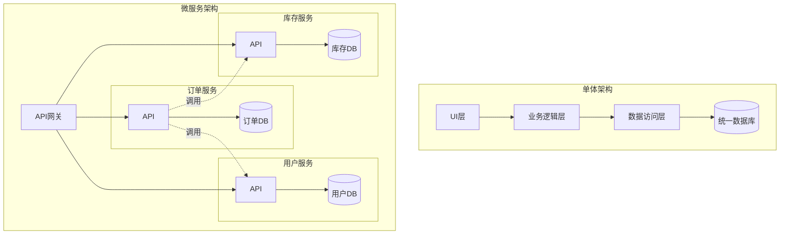
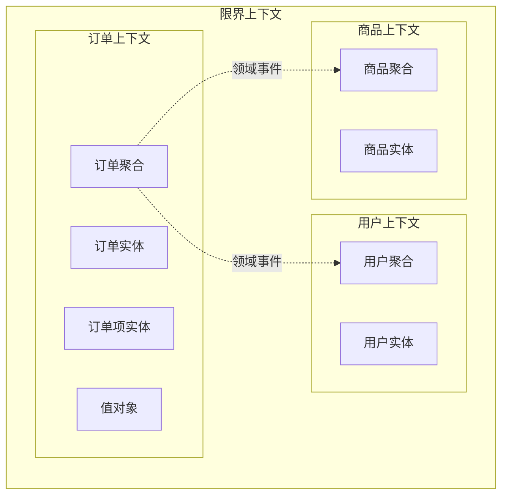
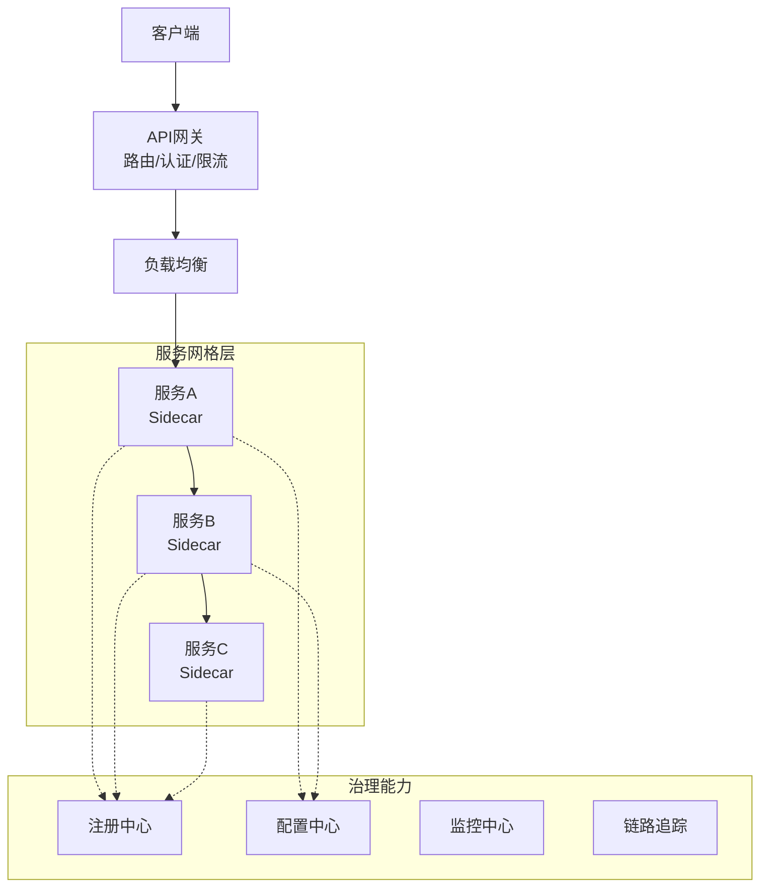
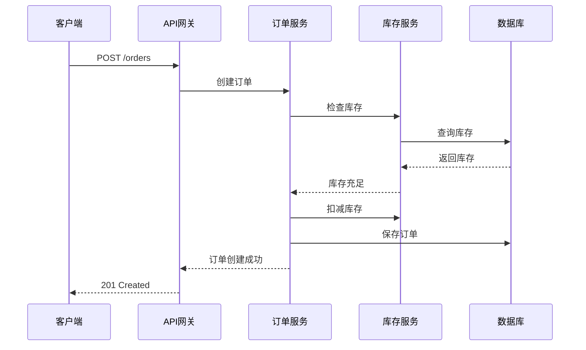
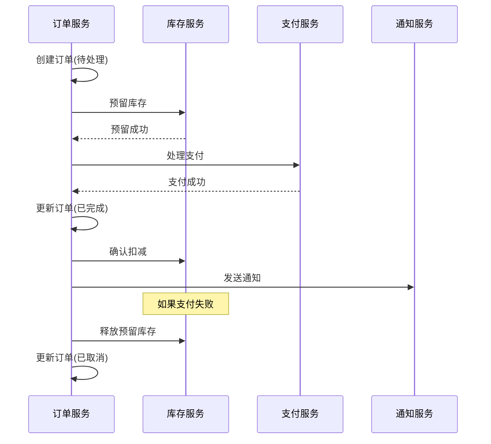
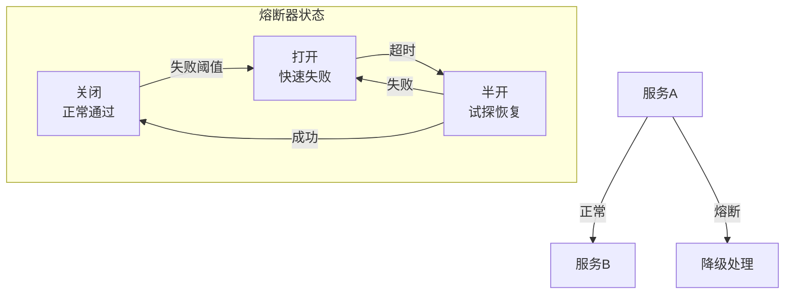

# 微服务架构

## 概述

微服务架构是一种将应用程序构建为一组小型服务的架构风格，每个服务运行在自己的进程中，通过轻量级机制（通常是HTTP API）进行通信。每个服务围绕业务能力构建，可独立部署和扩展。

## 架构对比



## 服务拆分策略

### 领域驱动设计（DDD）



### 拆分原则

| 策略 | 描述 | 适用场景 |
|-----|------|---------|
| 按业务领域 | 基于DDD限界上下文 | 业务复杂系统 |
| 按功能职责 | 按功能模块划分 | 功能清晰的系统 |
| 按数据归属 | 按数据所有权 | 数据密集型系统 |
| 按团队组织 | 康威定律对齐 | 大型团队 |

## 服务治理

### 治理架构



### 服务注册与发现

```yaml
# Nacos服务注册配置
spring:
  application:
    name: order-service
  cloud:
    nacos:
      discovery:
        server-addr: nacos:8848
        namespace: prod
        group: DEFAULT_GROUP
        metadata:
          version: v1.0
          region: ap-southeast
      config:
        server-addr: nacos:8848
        file-extension: yaml
        namespace: prod
        group: DEFAULT_GROUP
```

## 通信模式

### 同步通信



### 异步通信

```yaml
# 消息队列配置 - RabbitMQ
spring:
  rabbitmq:
    host: rabbitmq
    port: 5672
    username: user
    password: pass
    virtual-host: /
    listener:
      simple:
        concurrency: 5
        max-concurrency: 20
        acknowledge-mode: auto
        retry:
          enabled: true
          max-attempts: 3
          initial-interval: 1000ms
```

```java
// 生产者
@Service
public class OrderEventPublisher {
    @Autowired
    private RabbitTemplate rabbitTemplate;
    
    public void publishOrderCreated(Order order) {
        OrderCreatedEvent event = new OrderCreatedEvent(order);
        rabbitTemplate.convertAndSend(
            "order.exchange", 
            "order.created", 
            event
        );
    }
}

// 消费者
@Component
@RabbitListener(queues = "inventory.order.queue")
public class InventoryConsumer {
    @RabbitHandler
    public void handleOrderCreated(OrderCreatedEvent event) {
        // 处理库存扣减
        inventoryService.deduct(event.getOrderId(), event.getItems());
    }
}
```

## 数据一致性

### Saga模式



## 容错设计

### 熔断降级架构



```yaml
# Resilience4j配置
resilience4j:
  circuitbreaker:
    instances:
      inventoryService:
        registerHealthIndicator: true
        slidingWindowSize: 10
        minimumNumberOfCalls: 5
        permittedNumberOfCallsInHalfOpenState: 3
        automaticTransitionFromOpenToHalfOpenEnabled: true
        waitDurationInOpenState: 5s
        failureRateThreshold: 50
        eventConsumerBufferSize: 10
  retry:
    instances:
      inventoryService:
        maxRetryAttempts: 3
        waitDuration: 100ms
```

## 总结

微服务架构通过服务拆分实现了系统的可扩展性和独立部署能力，但也带来了分布式复杂性。成功的微服务实施需要配套的治理能力，包括服务发现、配置管理、监控追踪、熔断降级等，同时DDD方法论在服务边界划分中发挥着关键作用。
