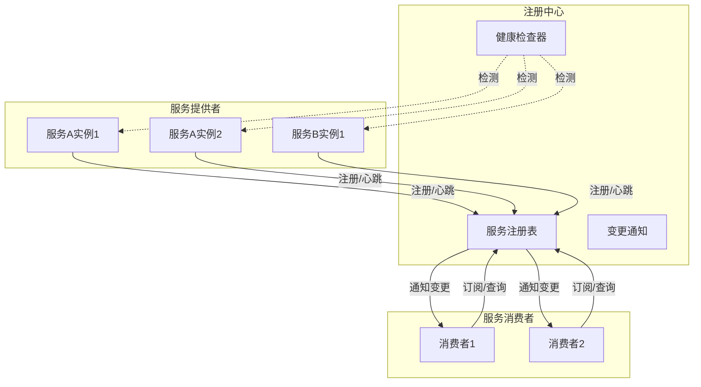
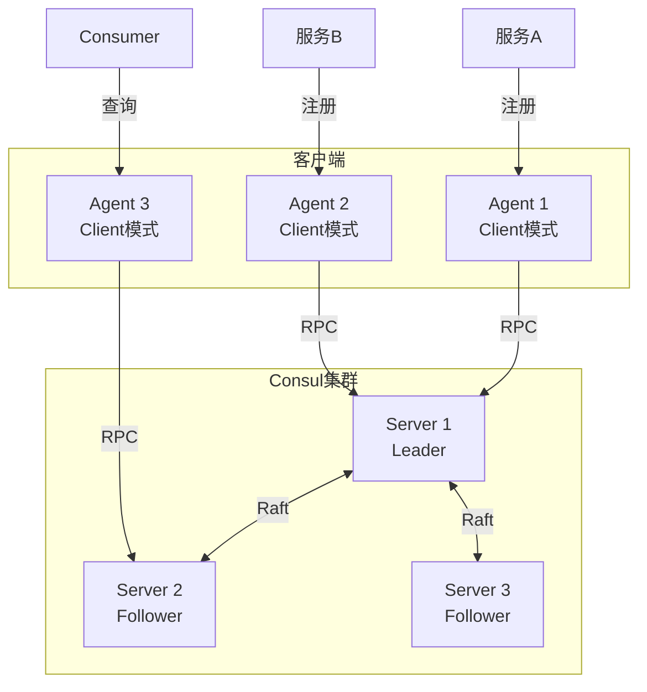
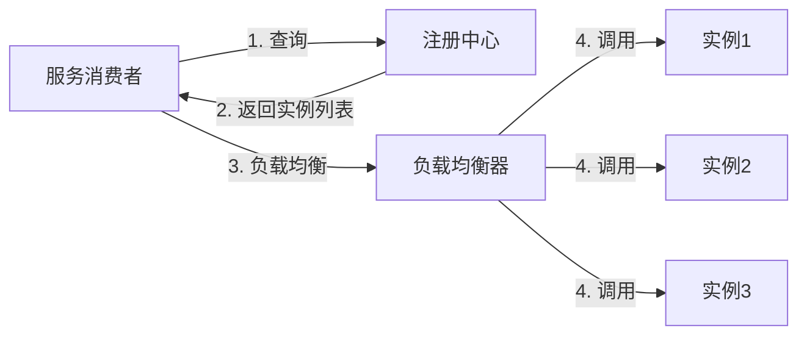
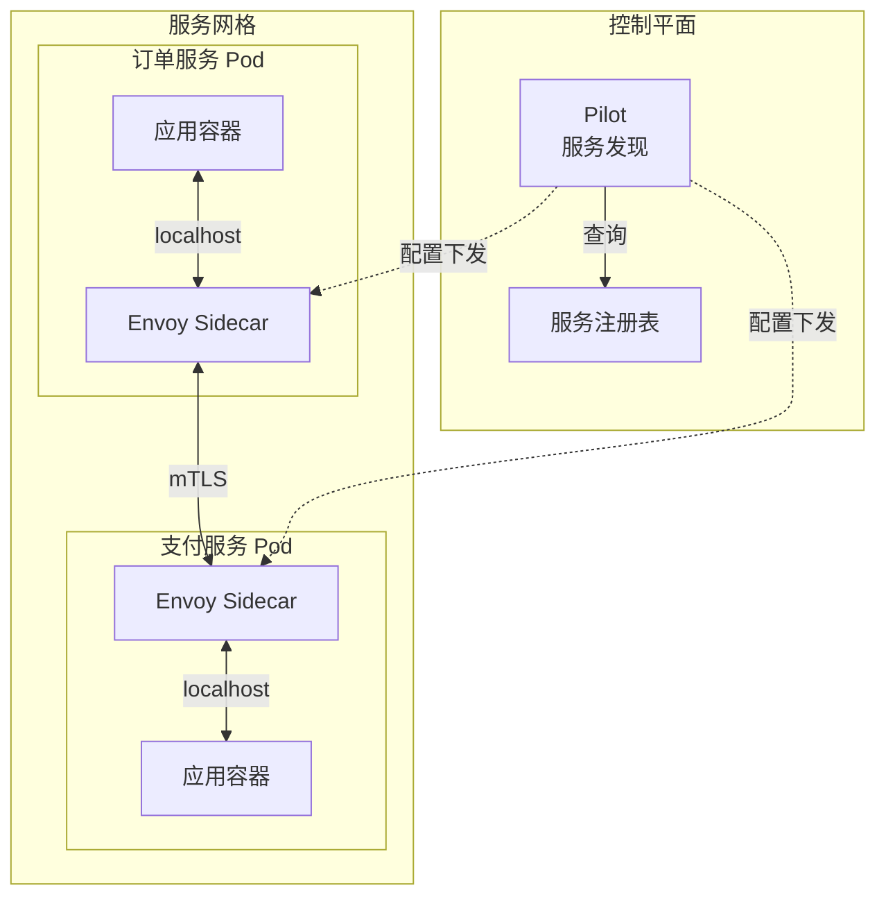

# 服务注册发现

## 概述

服务注册发现是微服务架构的核心基础设施，负责管理服务实例的网络位置信息，实现服务的自动注册、健康检查和动态发现，使服务间能够透明地相互调用。

## 架构原理



## 主流注册中心对比

| 特性 | Eureka | Consul | ZooKeeper | Nacos | etcd |
|-----|--------|--------|-----------|-------|------|
| 一致性协议 | AP | CP | CP | AP+CP | CP |
| 健康检查 | 客户端心跳 | TCP/HTTP | 心跳 | TCP/HTTP | 租约 |
| 多数据中心 | 支持 | 支持 | 不支持 | 支持 | 不支持 |
| SpringCloud | 原生支持 | 支持 | 支持 | 支持 | 需适配 |
| K8s集成 | 一般 | 良好 | 一般 | 良好 | 原生 |
| 性能 | 中 | 高 | 中 | 高 | 高 |

## Consul架构



## Consul部署配置

```yaml
# docker-compose.yml - Consul集群
version: '3.8'
services:
  consul-server1:
    image: hashicorp/consul:1.16.2
    container_name: consul-server1
    hostname: consul-server1
    ports:
      - "8500:8500"
      - "8300:8300"
      - "8301:8301"
      - "8301:8301/udp"
      - "8302:8302"
      - "8302:8302/udp"
    command: >
      consul agent -server -bootstrap-expect=3 -ui
      -bind='{{ GetInterfaceIP "eth0" }}'
      -client=0.0.0.0
      -retry-join='consul-server1'
      -retry-join='consul-server2'
      -retry-join='consul-server3'
      -datacenter=dc1
    volumes:
      - consul-server1-data:/consul/data

  consul-server2:
    image: hashicorp/consul:1.16.2
    container_name: consul-server2
    hostname: consul-server2
    command: >
      consul agent -server -bootstrap-expect=3
      -bind='{{ GetInterfaceIP "eth0" }}'
      -client=0.0.0.0
      -retry-join='consul-server1'
      -retry-join='consul-server2'
      -retry-join='consul-server3'
      -datacenter=dc1
    volumes:
      - consul-server2-data:/consul/data

  consul-server3:
    image: hashicorp/consul:1.16.2
    container_name: consul-server3
    hostname: consul-server3
    command: >
      consul agent -server -bootstrap-expect=3
      -bind='{{ GetInterfaceIP "eth0" }}'
      -client=0.0.0.0
      -retry-join='consul-server1'
      -retry-join='consul-server2'
      -retry-join='consul-server3'
      -datacenter=dc1
    volumes:
      - consul-server3-data:/consul/data

volumes:
  consul-server1-data:
  consul-server2-data:
  consul-server3-data:
```

## Spring Cloud Consul集成

```yaml
# application.yml - Spring Cloud Consul
spring:
  application:
    name: order-service
  cloud:
    consul:
      host: consul-server1
      port: 8500

      # 服务注册配置
      discovery:
        enabled: true
        register: true
        service-name: ${spring.application.name}
        instance-id: ${spring.application.name}:${random.value}
        health-check-path: /actuator/health
        health-check-interval: 10s
        tags:
          - version=1.0
          - profile=${spring.profiles.active}
        metadata:
          region: beijing
          zone: zone-1
          version: 1.0.0
          protocol: http

      # 配置中心
      config:
        enabled: true
        format: yaml
        prefix: config
        default-context: application
        profile-separator: '::'

      # 失败重试
      retry:
        initial-interval: 1000
        multiplier: 1.1
        max-interval: 2000
        max-attempts: 10
```

## Nacos服务注册

```yaml
# bootstrap.yml - Spring Cloud Nacos
spring:
  application:
    name: payment-service
  cloud:
    nacos:
      # 注册中心配置
      discovery:
        server-addr: nacos1:8848,nacos2:8848,nacos3:8848
        namespace: prod
        group: PAYMENT_GROUP
        cluster-name: DEFAULT

        # 元数据
        metadata:
          version: 2.0.0
          region: shanghai
          protocol: http

        # 心跳配置
        heart-beat-interval: 5000
        heart-beat-timeout: 15000
        ip-delete-timeout: 30000

        # 权重配置
        weight: 1.0

      # 配置中心
      config:
        server-addr: nacos1:8848,nacos2:8848,nacos3:8848
        namespace: prod
        group: PAYMENT_GROUP
        file-extension: yaml
```

### 服务注册代码

```java
// 服务注册示例 - Nacos API
@Service
public class NacosRegistrationService {

    @Autowired
    private NacosDiscoveryProperties discoveryProperties;

    @PostConstruct
    public void register() throws NacosException {
        NamingService namingService = NamingFactory.createNamingService(
            discoveryProperties.getServerAddr()
        );

        Instance instance = new Instance();
        instance.setIp(discoveryProperties.getIp());
        instance.setPort(discoveryProperties.getPort());
        instance.setServiceName(discoveryProperties.getService());
        instance.setWeight(discoveryProperties.getWeight());
        instance.setClusterName(discoveryProperties.getClusterName());
        instance.setMetadata(discoveryProperties.getMetadata());
        instance.setHealthy(true);
        instance.setEnabled(true);

        // 注册服务
        namingService.registerInstance(
            discoveryProperties.getService(),
            discoveryProperties.getGroup(),
            instance
        );

        // 注册健康检查回调
        namingService.subscribe(discoveryProperties.getService(), event -> {
            if (event instanceof NamingEvent) {
                List<Instance> instances = ((NamingEvent) event).getInstances();
                // 处理服务变更
                handleServiceChange(instances);
            }
        });
    }

    private void handleServiceChange(List<Instance> instances) {
        // 更新本地服务缓存
        ServiceCache.update(instances);
    }
}
```

## 服务发现与负载均衡



```java
// Ribbon负载均衡配置
@Configuration
public class RibbonConfig {

    @Bean
    public IRule ribbonRule() {
        // 加权轮询
        return new WeightedResponseTimeRule();
        // 可用性过滤
        // return new AvailabilityFilteringRule();
        // 区域感知
        // return new ZoneAvoidanceRule();
    }

    @Bean
    public IPing ribbonPing() {
        return new PingUrl(false, "/actuator/health");
    }

    @Bean
    public ILoadBalancer ribbonLoadBalancer(IClientConfig config,
                                            ServerList<Server> serverList,
                                            IRule rule,
                                            IPing ping) {
        return new ZoneAwareLoadBalancer<>(config, rule, ping, serverList,
            null, null);
    }
}
```

```java
// 服务调用示例
@Service
public class OrderService {

    @Autowired
    private LoadBalancerClient loadBalancer;

    @Autowired
    private RestTemplate restTemplate;

    public User getUser(String userId) {
        // 从注册中心获取服务实例
        ServiceInstance instance = loadBalancer.choose("user-service");

        if (instance == null) {
            throw new ServiceUnavailableException("User service not available");
        }

        // 构建请求URL
        String url = String.format("http://%s:%s/api/users/%s",
            instance.getHost(),
            instance.getPort(),
            userId
        );

        return restTemplate.getForObject(url, User.class);
    }

    // 使用Feign简化调用
    @FeignClient(name = "user-service", fallback = UserServiceFallback.class)
    public interface UserServiceClient {
        @GetMapping("/api/users/{id}")
        User getUser(@PathVariable("id") String id);
    }
}
```

## 健康检查机制

```yaml
# 健康检查配置
management:
  endpoints:
    web:
      exposure:
        include: health,info,metrics
  endpoint:
    health:
      show-details: always
      probes:
        enabled: true
      group:
        readiness:
          include: db,redis,diskSpace
        liveness:
          include: ping

# Consul健康检查配置
spring:
  cloud:
    consul:
      discovery:
        health-check-critical-timeout: 30s
        health-check-interval: 10s
        health-check-timeout: 5s
        query-tags-for-service: true
```

```java
// 自定义健康检查
@Component
public class CustomHealthIndicator implements HealthIndicator {

    @Autowired
    private DataSource dataSource;

    @Override
    public Health health() {
        try (Connection conn = dataSource.getConnection()) {
            if (conn.isValid(5)) {
                return Health.up()
                    .withDetail("database", "PostgreSQL")
                    .withDetail("status", "connected")
                    .build();
            }
        } catch (SQLException e) {
            return Health.down()
                .withDetail("error", e.getMessage())
                .build();
        }
        return Health.down().build();
    }
}
```

## 服务网格集成



## 最佳实践

1. **健康检查**：配置合理的健康检查间隔和超时
2. **实例标识**：使用唯一标识区分实例，便于追踪
3. **优雅下线**：服务停止前主动注销
4. **元数据**：携带版本、区域等元数据支持灰度
5. **缓存本地**：客户端缓存服务列表，提高性能
6. **熔断降级**：结合熔断器防止级联故障

## 总结

服务注册发现是微服务通信的基础设施。Consul提供完整的服务治理功能，Nacos集成配置中心，etcd是Kubernetes的原生选择。选择合适的注册中心，配合健康检查和负载均衡策略，可以构建高可用的服务网格。
