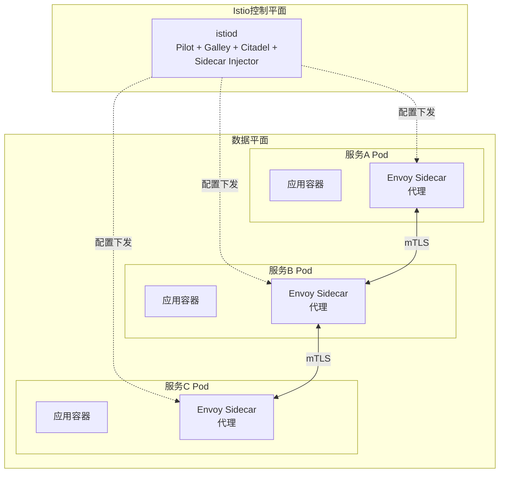
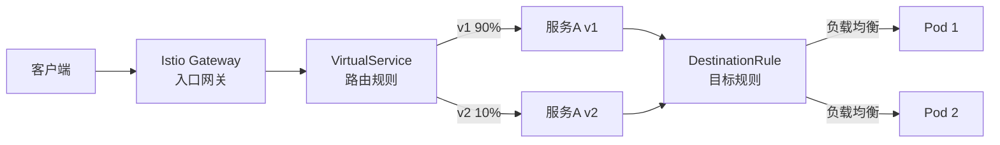
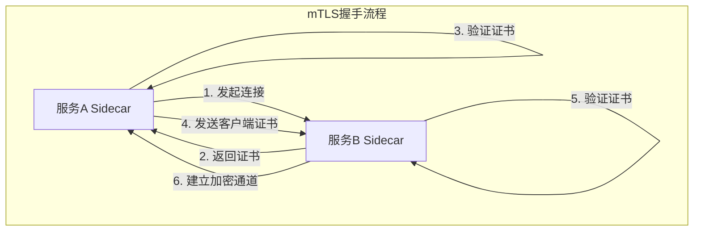
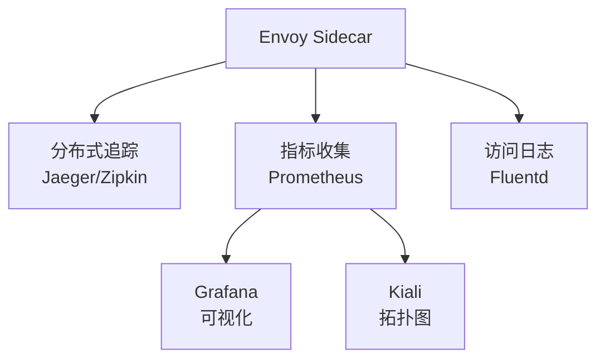
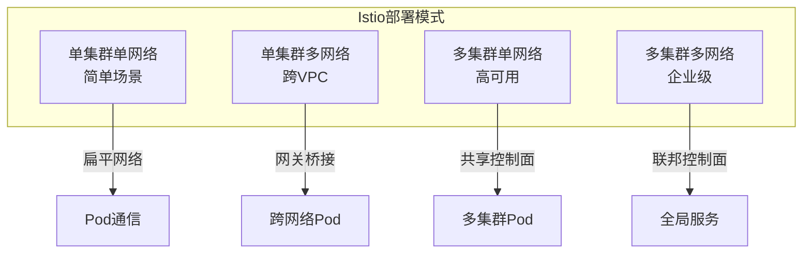

# 服务网格Istio

## 概述

Istio是一个开源的服务网格平台，它透明地注入到微服务架构中，提供流量管理、安全通信、策略控制和可观测性等能力，而无需修改应用代码。

## 架构设计



## 核心组件

### 控制平面 (istiod)

- **Pilot**：服务发现和流量管理配置下发
- **Citadel**：证书管理和密钥分发
- **Galley**：配置验证和分发
- **Sidecar Injector**：自动注入Sidecar代理

### 数据平面 (Envoy)

高性能C++代理，负责：
- 流量代理和路由
- 负载均衡
- 健康检查
- mTLS加密通信

## 流量管理

### 流量路由架构



### 配置示例

```yaml
# Gateway配置 - 入口流量
apiVersion: networking.istio.io/v1beta1
kind: Gateway
metadata:
  name: my-gateway
  namespace: default
spec:
  selector:
    istio: ingressgateway
  servers:
  - port:
      number: 80
      name: http
      protocol: HTTP
    hosts:
    - "api.example.com"
    tls:
      httpsRedirect: true
  - port:
      number: 443
      name: https
      protocol: HTTPS
    tls:
      mode: SIMPLE
      credentialName: api-tls-secret
    hosts:
    - "api.example.com"
---
# VirtualService配置 - 流量路由
apiVersion: networking.istio.io/v1beta1
kind: VirtualService
metadata:
  name: user-service
spec:
  hosts:
  - "api.example.com"
  gateways:
  - my-gateway
  http:
  - match:
    - uri:
        prefix: /api/users
    route:
    - destination:
        host: user-service
        subset: v1
        port:
          number: 8080
      weight: 90
    - destination:
        host: user-service
        subset: v2
        port:
          number: 8080
      weight: 10
    timeout: 10s
    retries:
      attempts: 3
      perTryTimeout: 2s
      retryOn: 5xx
---
# DestinationRule配置 - 目标规则
apiVersion: networking.istio.io/v1beta1
kind: DestinationRule
metadata:
  name: user-service
spec:
  host: user-service
  trafficPolicy:
    connectionPool:
      tcp:
        maxConnections: 100
      http:
        http1MaxPendingRequests: 50
        maxRequestsPerConnection: 10
    outlierDetection:
      consecutiveErrors: 5
      interval: 30s
      baseEjectionTime: 30s
  subsets:
  - name: v1
    labels:
      version: v1
  - name: v2
    labels:
      version: v2
```

## 安全架构

### mTLS通信



```yaml
# 全网格mTLS启用
apiVersion: security.istio.io/v1beta1
kind: PeerAuthentication
metadata:
  name: default
  namespace: istio-system
spec:
  mtls:
    mode: STRICT
---
# 授权策略
apiVersion: security.istio.io/v1beta1
kind: AuthorizationPolicy
metadata:
  name: user-service-policy
  namespace: default
spec:
  selector:
    matchLabels:
      app: user-service
  action: ALLOW
  rules:
  - from:
    - source:
        principals: ["cluster.local/ns/default/sa/frontend-sa"]
    to:
    - operation:
        methods: ["GET", "POST"]
        paths: ["/api/users/*"]
    when:
    - key: request.auth.claims[iss]
      values: ["https://accounts.google.com"]
```

## 可观测性

### 数据流架构



## 熔断与限流

```yaml
apiVersion: networking.istio.io/v1beta1
kind: DestinationRule
metadata:
  name: circuit-breaker
spec:
  host: ratings
  trafficPolicy:
    connectionPool:
      tcp:
        maxConnections: 100
      http:
        http1MaxPendingRequests: 50
        maxRequestsPerConnection: 2
    outlierDetection:
      consecutive5xxErrors: 5
      interval: 30s
      baseEjectionTime: 30s
      maxEjectionPercent: 50
---
apiVersion: networking.istio.io/v1alpha3
kind: EnvoyFilter
metadata:
  name: rate-limit
spec:
  configPatches:
  - applyTo: HTTP_FILTER
    match:
      context: SIDECAR_INBOUND
      listener:
        filterChain:
          filter:
            name: envoy.filters.network.http_connection_manager
    patch:
      operation: INSERT_BEFORE
      value:
        name: envoy.filters.http.local_ratelimit
        typed_config:
          '@type': type.googleapis.com/udpa.type.v1.TypedStruct
          type_url: type.googleapis.com/envoy.extensions.filters.http.local_ratelimit.v3.LocalRateLimit
          value:
            stat_prefix: http_local_rate_limiter
            token_bucket:
              max_tokens: 100
              tokens_per_fill: 10
              fill_interval: 1s
            filter_enabled:
              runtime_key: local_rate_limit_enabled
              default_value:
                numerator: 100
                denominator: HUNDRED
            filter_enforced:
              runtime_key: local_rate_limit_enforced
              default_value:
                numerator: 100
                denominator: HUNDRED
            response_headers_to_add:
            - append_action: OVERWRITE_IF_EXISTS_OR_ADD
              header:
                key: x-local-rate-limit
                value: 'true'
```

## 部署架构



## 总结

Istio作为服务网格的领导者，通过Sidecar模式为微服务提供了强大的治理能力。虽然引入了额外的复杂性和资源开销，但其在流量管理、安全通信和可观测性方面的价值，使其成为大规模微服务架构的重要基础设施。
