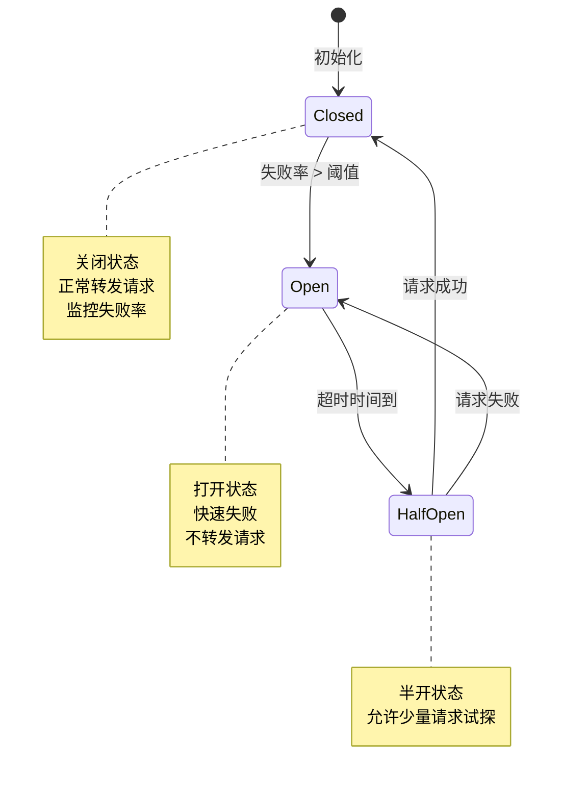
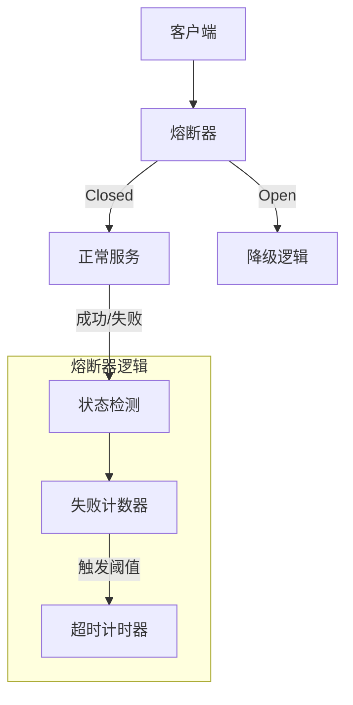
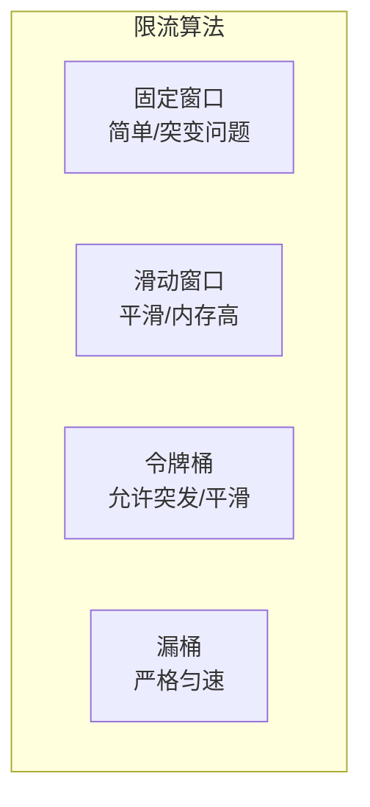
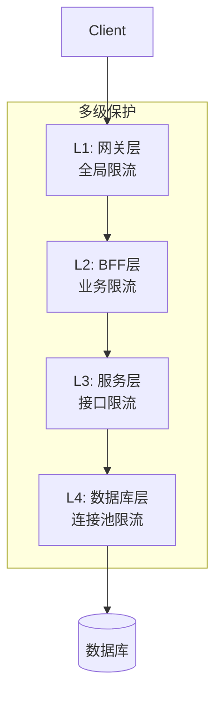

# 熔断与限流

## 概述

熔断（Circuit Breaker）和限流（Rate Limiting）是微服务架构中保障系统稳定性的关键机制。熔断防止故障扩散，限流保护系统免受过载冲击，两者共同构建服务保护的坚固防线。

## 熔断器原理

### 状态机模型



### 熔断架构



## 熔断实现

### Hystrix风格配置

```yaml
# 熔断配置 - Resilience4j
resilience4j:
  circuitbreaker:
    instances:
      orderService:
        registerHealthIndicator: true
        slidingWindowType: COUNT_BASED
        slidingWindowSize: 10
        minimumNumberOfCalls: 5
        permittedNumberOfCallsInHalfOpenState: 3
        automaticTransitionFromOpenToHalfOpenEnabled: true
        waitDurationInOpenState: 10s
        failureRateThreshold: 50
        slowCallRateThreshold: 80
        slowCallDurationThreshold: 2s
        eventConsumerBufferSize: 10

      paymentService:
        slidingWindowSize: 100
        minimumNumberOfCalls: 10
        failureRateThreshold: 60
        waitDurationInOpenState: 30s
```

### 代码示例

```java
// Resilience4j熔断器
@Service
public class OrderService {

    @Autowired
    private OrderClient orderClient;

    @Autowired
    private CacheManager cacheManager;

    // 配置熔断
    @CircuitBreaker(name = "orderService", fallbackMethod = "getOrderFallback")
    @Retry(name = "orderService")
    @TimeLimiter(name = "orderService")
    public CompletableFuture<Order> getOrder(String orderId) {
        return CompletableFuture.supplyAsync(() ->
            orderClient.getOrder(orderId)
        );
    }

    // 降级方法
    public CompletableFuture<Order> getOrderFallback(String orderId, Exception ex) {
        // 从缓存获取
        Order cachedOrder = cacheManager.get(orderId);
        if (cachedOrder != null) {
            return CompletableFuture.completedFuture(cachedOrder);
        }

        // 返回默认订单
        Order defaultOrder = new Order();
        defaultOrder.setId(orderId);
        defaultOrder.setStatus("UNKNOWN");
        defaultOrder.setItems(Collections.emptyList());

        return CompletableFuture.completedFuture(defaultOrder);
    }
}
```

## 限流机制

### 限流算法对比



| 算法 | 优点 | 缺点 | 适用场景 |
|-----|------|------|---------|
| 固定窗口 | 实现简单 | 窗口边界突发 | 简单限流 |
| 滑动窗口 | 平滑限流 | 内存消耗大 | 精确限流 |
| 令牌桶 | 允许突发 | 配置复杂 | API网关 |
| 漏桶 | 匀速输出 | 无突发能力 | 流量整形 |

### 令牌桶实现

```yaml
# Redis + Lua实现分布式限流
apiVersion: v1
kind: ConfigMap
metadata:
  name: rate-limiter-script
data:
  token_bucket.lua: |
    local key = KEYS[1]
    local rate = tonumber(ARGV[1])
    local capacity = tonumber(ARGV[2])
    local now = tonumber(ARGV[3])
    local requested = tonumber(ARGV[4])

    local fill_time = capacity / rate
    local ttl = math.floor(fill_time * 2)

    local last_tokens = redis.call('get', key)
    if last_tokens == false then
      last_tokens = capacity
    end

    local last_updated = redis.call('get', key .. ':last_updated')
    if last_updated == false then
      last_updated = 0
    end

    local delta = math.max(0, now - tonumber(last_updated))
    local filled_tokens = math.min(capacity, tonumber(last_tokens) + (delta * rate))
    local allowed = filled_tokens >= requested
    local new_tokens = filled_tokens

    if allowed then
      new_tokens = filled_tokens - requested
    end

    redis.call('setex', key, ttl, new_tokens)
    redis.call('setex', key .. ':last_updated', ttl, now)

    return allowed
```

### Spring Cloud Gateway限流

```yaml
# Spring Cloud Gateway限流配置
spring:
  cloud:
    gateway:
      routes:
      - id: order_service
        uri: lb://order-service
        predicates:
        - Path=/api/orders/**
        filters:
        - name: RequestRateLimiter
          args:
            redis-rate-limiter.replenishRate: 10
            redis-rate-limiter.burstCapacity: 20
            redis-rate-limiter.requestedTokens: 1
            key-resolver: "#{@userKeyResolver}"
        - name: CircuitBreaker
          args:
            name: orderService
            fallbackUri: forward:/fallback/order

      - id: payment_service
        uri: lb://payment-service
        predicates:
        - Path=/api/payments/**
        filters:
        - name: RequestRateLimiter
          args:
            redis-rate-limiter.replenishRate: 5
            redis-rate-limiter.burstCapacity: 10
```

```java
// 限流键解析器
@Bean
public KeyResolver userKeyResolver() {
    return exchange -> Mono.just(
        exchange.getRequest().getHeaders().getFirst("X-User-Id")
    );
}

@Bean
public KeyResolver ipKeyResolver() {
    return exchange -> Mono.just(
        exchange.getRequest().getRemoteAddress().getAddress().getHostAddress()
    );
}
```

## 服务网格限流

```yaml
# Istio限流配置
apiVersion: networking.istio.io/v1alpha3
kind: EnvoyFilter
metadata:
  name: rate-limit
  namespace: istio-system
spec:
  configPatches:
  - applyTo: HTTP_FILTER
    match:
      context: SIDECAR_INBOUND
      listener:
        filterChain:
          filter:
            name: envoy.filters.network.http_connection_manager
            subFilter:
              name: envoy.filters.http.router
    patch:
      operation: INSERT_BEFORE
      value:
        name: envoy.filters.http.local_ratelimit
        typed_config:
          '@type': type.googleapis.com/udpa.type.v1.TypedStruct
          type_url: type.googleapis.com/envoy.extensions.filters.http.local_ratelimit.v3.LocalRateLimit
          value:
            stat_prefix: http_local_rate_limiter
            token_bucket:
              max_tokens: 100
              tokens_per_fill: 10
              fill_interval: 1s
            filter_enabled:
              runtime_key: local_rate_limit_enabled
              default_value:
                numerator: 100
                denominator: HUNDRED
            filter_enforced:
              runtime_key: local_rate_limit_enforced
              default_value:
                numerator: 100
                denominator: HUNDRED
            response_headers_to_add:
            - append_action: OVERWRITE_IF_EXISTS_OR_ADD
              header:
                key: x-local-rate-limit
                value: 'true'
            status:
              code: 429
```

## 多级保护策略



```yaml
# 多级限流配置
apiVersion: v1
kind: ConfigMap
metadata:
  name: multi-tier-rate-limit
data:
  # 网关层 - 全局限流
  gateway.limits: |
    global:
      qps: 10000
      burst: 15000

  # BFF层 - 按客户端限流
  bff.limits: |
    per-client:
      qps: 100
      burst: 150

  # 服务层 - 按接口限流
  service.limits: |
    /api/orders:
      qps: 500
      burst: 750
    /api/payments:
      qps: 200
      burst: 300
```

## 监控与告警

```yaml
# Prometheus告警规则
groups:
- name: circuit_breaker_alerts
  rules:
  - alert: CircuitBreakerOpen
    expr: |
      resilience4j_circuitbreaker_state{state="open"} == 1
    for: 1m
    labels:
      severity: critical
    annotations:
      summary: "熔断器打开"
      description: "服务 {{ $labels.name }} 熔断器已打开"

  - alert: HighRateLimitRejection
    expr: |
      rate(rate_limiter_rejected_total[5m]) > 0.1
    for: 5m
    labels:
      severity: warning
    annotations:
      summary: "限流拒绝率高"
      description: "限流拒绝率达到 {{ $value }}"
```

## 最佳实践

1. **渐进式限流**：从松到严逐步调整阈值
2. **分级熔断**：区分关键路径和非关键路径
3. **优雅降级**：熔断后提供备用方案
4. **监控告警**：实时掌握熔断限流状态
5. **自动恢复**：熔断器自动尝试恢复

## 总结

熔断和限流是保障微服务稳定运行的核心机制。熔断防止故障级联，限流控制流量入口。结合多级保护策略和完善的监控体系，可以构建高可用、高弹性的分布式系统。
