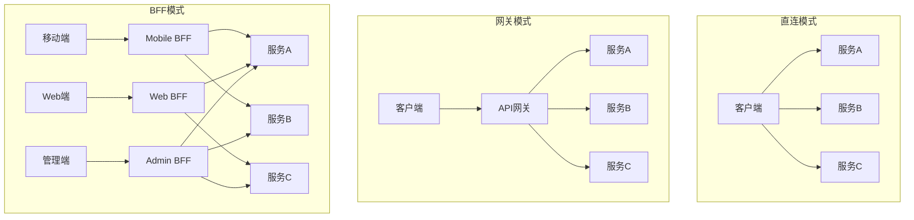
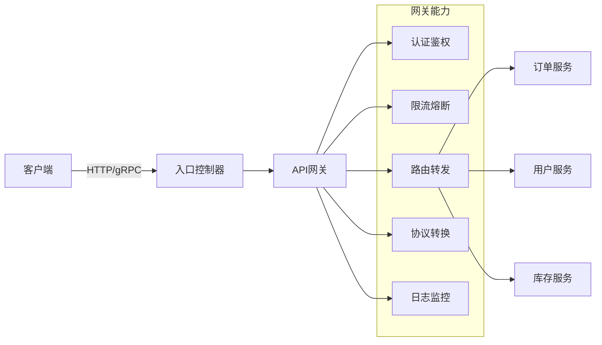
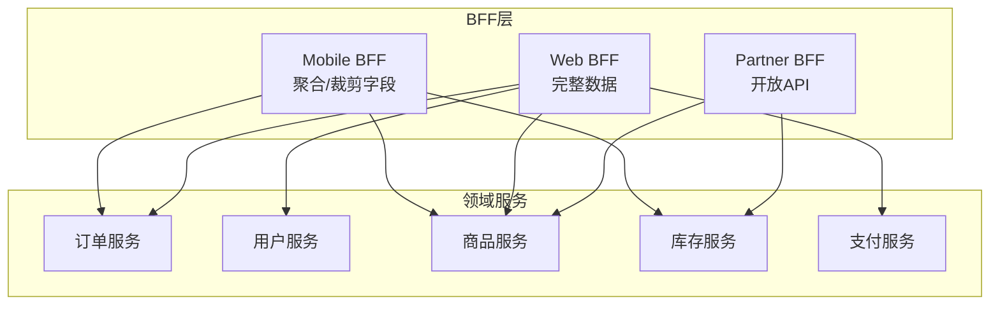

# 网关与BFF

## 概述

API网关和BFF（Backend for Frontend）是现代微服务架构中的关键组件。API网关作为系统入口，提供统一的服务暴露、协议转换和安全控制；BFF则为特定前端应用定制API，优化数据聚合和交互体验。

## 架构演进



## API网关架构



## Kong网关配置

```yaml
# Kong服务定义
apiVersion: configuration.konghq.com/v1
kind: KongIngress
metadata:
  name: api-routes
proxy:
  protocols:
  - http
  - https
  path: /
  connect_timeout: 60000
  read_timeout: 60000
  retries: 5
route:
  methods:
  - GET
  - POST
  - PUT
  - DELETE
  strip_path: false
  preserve_host: true
---
# 插件配置
apiVersion: configuration.konghq.com/v1
kind: KongPlugin
metadata:
  name: rate-limiting
config:
  minute: 100
  policy: redis
  redis_host: redis
  fault_tolerant: true
  hide_client_headers: false
  redis_timeout: 2000
plugin: rate-limiting
---
# 认证插件
apiVersion: configuration.konghq.com/v1
kind: KongPlugin
metadata:
  name: jwt-auth
config:
  uri_param_names: []
  cookie_names: []
  key_claim_name: iss
  secret_is_base64: false
  claims_to_verify:
  - exp
plugin: jwt
```

## BFF架构模式



## BFF实现示例

```yaml
# BFF服务配置 - Node.js + Express
apiVersion: apps/v1
kind: Deployment
metadata:
  name: mobile-bff
spec:
  replicas: 3
  selector:
    matchLabels:
      app: mobile-bff
  template:
    metadata:
      labels:
        app: mobile-bff
    spec:
      containers:
      - name: bff
        image: myapp/mobile-bff:v1.0
        ports:
        - containerPort: 3000
        env:
        - name: ORDER_SERVICE_URL
          value: http://order-service:8080
        - name: PRODUCT_SERVICE_URL
          value: http://product-service:8080
        - name: INVENTORY_SERVICE_URL
          value: http://inventory-service:8080
        resources:
          limits:
            memory: "512Mi"
            cpu: "500m"
          requests:
            memory: "256Mi"
            cpu: "100m"
```

```javascript
// BFF聚合逻辑示例 - Node.js
const express = require('express');
const axios = require('axios');

const app = express();

// Mobile BFF: 订单详情聚合
app.get('/api/mobile/orders/:id', async (req, res) => {
  try {
    const { id } = req.params;

    // 并行调用多个服务
    const [orderRes, productRes, inventoryRes] = await Promise.all([
      axios.get(`${process.env.ORDER_SERVICE_URL}/orders/${id}`),
      axios.get(`${process.env.PRODUCT_SERVICE_URL}/products/${id}`),
      axios.get(`${process.env.INVENTORY_SERVICE_URL}/inventory/${id}`)
    ]);

    // 聚合数据，为移动端优化
    const result = {
      orderId: orderRes.data.id,
      status: orderRes.data.status,
      // 移动端只需要商品核心信息
      product: {
        id: productRes.data.id,
        name: productRes.data.name,
        thumbnail: productRes.data.images[0] // 只返回首图
      },
      // 移动端简化库存信息
      availability: inventoryRes.data.quantity > 0 ? 'in_stock' : 'out_of_stock',
      // 移动端简化价格
      price: {
        amount: orderRes.data.totalAmount,
        currency: orderRes.data.currency
      },
      // 隐藏敏感字段
      createdAt: orderRes.data.createdAt
    };

    res.json(result);
  } catch (error) {
    res.status(500).json({ error: 'Failed to fetch order details' });
  }
});

// Web BFF: 更完整的订单详情
app.get('/api/web/orders/:id', async (req, res) => {
  // 返回更完整的数据结构
  // ...
});

app.listen(3000, () => {
  console.log('BFF service running on port 3000');
});
```

## GraphQL BFF

```yaml
# GraphQL BFF配置
apiVersion: apps/v1
kind: Deployment
metadata:
  name: graphql-bff
spec:
  replicas: 2
  template:
    spec:
      containers:
      - name: gateway
        image: apollo-gateway:latest
        env:
        - name: APOLLO_SCHEMA_CONFIG_EMBEDDED
          value: "true"
```

```javascript
// Apollo Federation Gateway
const { ApolloServer } = require('apollo-server');
const { ApolloGateway, IntrospectAndCompose } = require('@apollo/gateway');

const gateway = new ApolloGateway({
  supergraphSdl: new IntrospectAndCompose({
    subgraphs: [
      { name: 'orders', url: 'http://order-service:8080/graphql' },
      { name: 'products', url: 'http://product-service:8080/graphql' },
      { name: 'users', url: 'http://user-service:8080/graphql' },
    ],
  }),
});

const server = new ApolloServer({
  gateway,
  subscriptions: false,
  context: ({ req }) => {
    // 提取认证信息传递给下游服务
    const token = req.headers.authorization || '';
    return { token };
  }
});

server.listen().then(({ url }) => {
  console.log(`🚀 Gateway ready at ${url}`);
});
```

## 路由策略

```yaml
# 基于路径的路由
apiVersion: networking.k8s.io/v1
kind: Ingress
metadata:
  name: api-ingress
  annotations:
    nginx.ingress.kubernetes.io/rewrite-target: /
spec:
  rules:
  - host: api.example.com
    http:
      paths:
      - path: /mobile
        pathType: Prefix
        backend:
          service:
            name: mobile-bff
            port:
              number: 3000
      - path: /web
        pathType: Prefix
        backend:
          service:
            name: web-bff
            port:
              number: 3000
      - path: /admin
        pathType: Prefix
        backend:
          service:
            name: admin-bff
            port:
              number: 3000
      - path: /
        pathType: Prefix
        backend:
          service:
            name: api-gateway
            port:
              number: 8000
```

## 性能优化策略

| 策略 | 说明 | 实现方式 |
|-----|------|---------|
| 数据聚合 | 减少客户端请求数 | BFF层并行调用 |
| 字段裁剪 | 只返回需要的字段 | GraphQL/响应过滤 |
| 缓存 | 减少后端调用 | Redis/本地缓存 |
| 批量请求 | DataLoader合并查询 | N+1问题优化 |
| 压缩 | 减少传输大小 | Gzip/Brotli |

## 总结

API网关和BFF模式解决了微服务架构中的客户端访问复杂性。API网关提供横切关注点处理，而BFF针对特定前端优化数据交互。合理设计网关和BFF层级，可以显著提升系统性能和开发效率。
