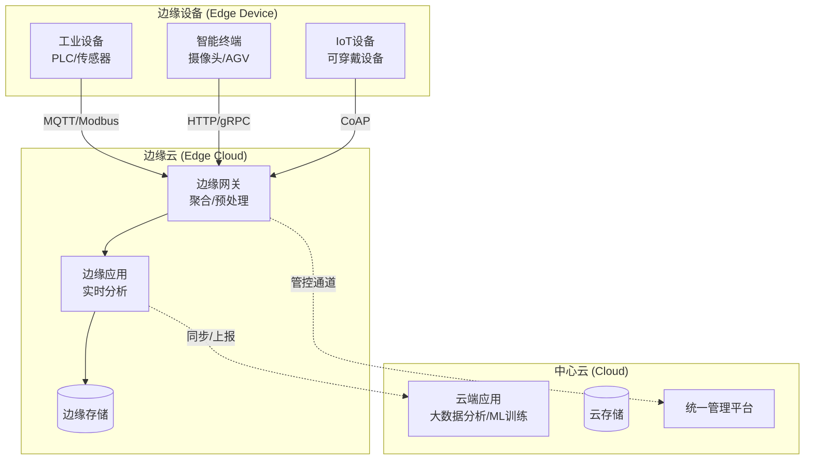
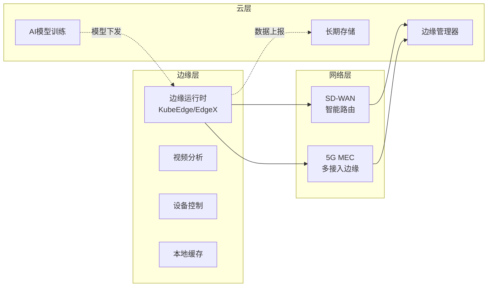
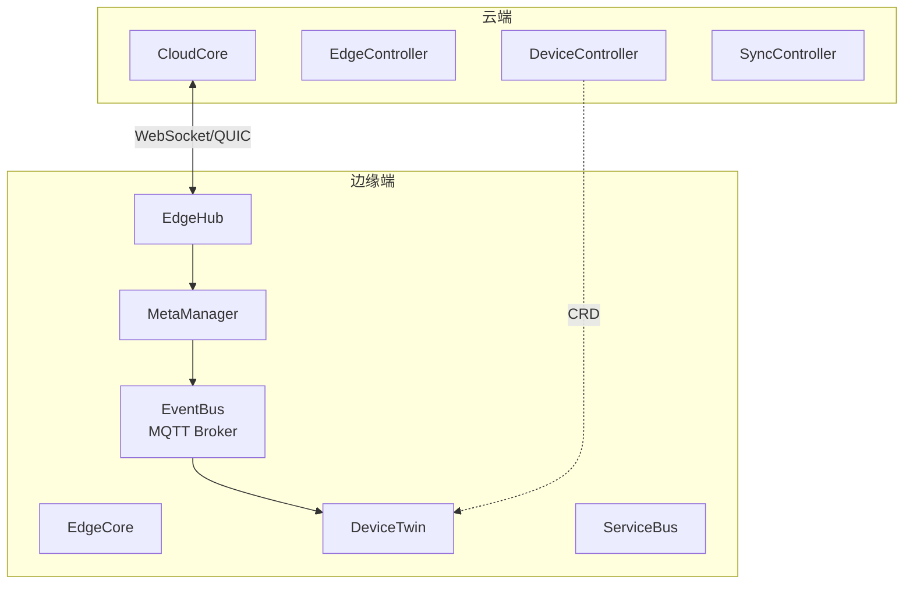
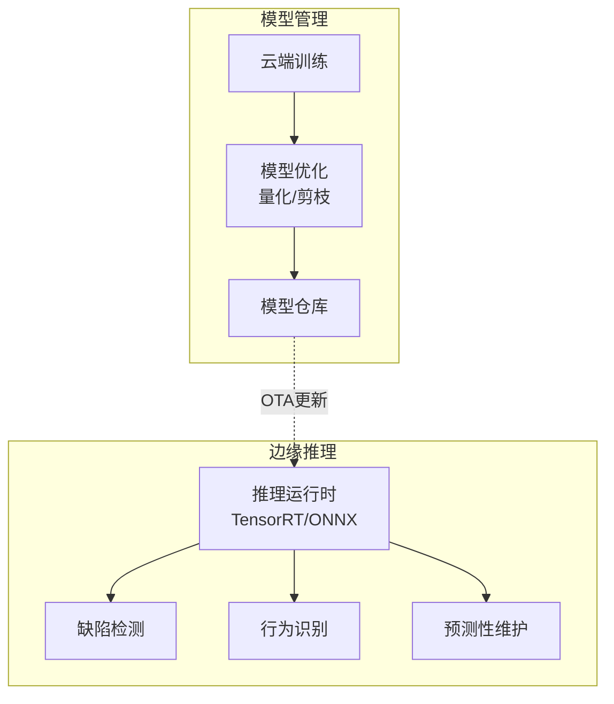
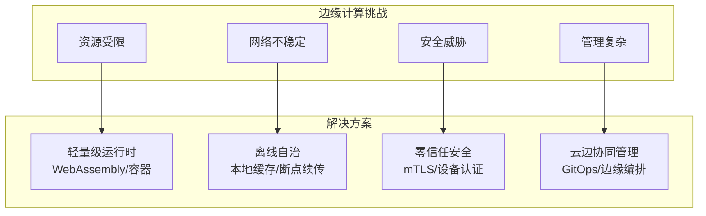

# 边缘计算架构

## 概述

边缘计算是一种分布式计算范式，将计算、存储和网络资源从中心云下沉到靠近数据源的网络边缘，以降低延迟、减少带宽消耗，并满足实时性和隐私保护需求。

## 架构层次



## 边缘云协同

### 协同架构



## 关键技术栈

### KubeEdge架构



### 部署配置示例

```yaml
# KubeEdge边缘节点配置
apiVersion: v1
kind: ConfigMap
metadata:
  name: edgecore-config
  namespace: kubeedge
data:
  edgecore.yaml: |
    modules:
      edged:
        nodeIP: 192.168.1.100
        podSandboxImage: kubeedge/pause:3.1
        runtimeType: docker
        remoteRuntimeEndpoint: unix:///var/run/dockershim.sock
      edgehub:
        websocket:
          server: cloudcore.kubeedge.svc.cluster.local:10000
        quic:
          server: cloudcore.kubeedge.svc.cluster.local:10001
        token: <edge-node-token>
        httpserver: https://cloudcore.kubeedge.svc.cluster.local:10002
      eventbus:
        mqttMode: 2  # 0: internal, 1: external, 2: both
        mqttServer:
          internal:
            server: tcp://127.0.0.1:1883
          external:
            server: tcp://mqtt-broker:1883
            username: edge
            password: password
```

## 边缘智能

### AI推理部署



```yaml
# 边缘AI推理应用部署
apiVersion: apps/v1
kind: Deployment
metadata:
  name: edge-inference-app
  namespace: edge
spec:
  replicas: 1
  selector:
    matchLabels:
      app: edge-inference
  template:
    metadata:
      labels:
        app: edge-inference
    spec:
      nodeSelector:
        node-type: edge
      tolerations:
      - key: "edge"
        operator: "Equal"
        value: "true"
        effect: "NoSchedule"
      containers:
      - name: inference
        image: edge-ai/inference:v1.0
        resources:
          limits:
            nvidia.com/gpu: 1  # GPU加速
            memory: "4Gi"
          requests:
            memory: "2Gi"
        volumeMounts:
        - name: model-volume
          mountPath: /models
        - name: video-input
          mountPath: /dev/video0
        env:
        - name: MODEL_PATH
          value: /models/yolov5s.onnx
        - name: INFERENCE_BATCH_SIZE
          value: "1"
        - name: TARGET_FPS
          value: "30"
      volumes:
      - name: model-volume
        hostPath:
          path: /opt/edge/models
      - name: video-input
        hostPath:
          path: /dev/video0
```

## 场景应用

| 场景 | 边缘能力 | 云端能力 | 协同方式 |
|-----|---------|---------|---------|
| 智能制造 | 实时质检、设备控制 | 生产优化、模型训练 | 模型下发、数据汇聚 |
| 智慧城市 | 交通监控、应急响应 | 城市规划、大数据分析 | 事件上报、策略下发 |
| 车联网 | 自动驾驶、车路协同 | 高精地图、模型更新 | V2X通信、OTA升级 |
| 智慧零售 | 客流分析、智能结算 | 供应链优化、用户画像 | 数据汇总、促销推送 |

## 挑战与解决方案



## 总结

边缘计算通过将算力下沉，解决了中心化云计算在延迟、带宽和隐私方面的局限。随着5G、AI和云原生技术的发展，边缘计算与中心云的协同将成为未来计算架构的主流形态，推动工业互联网、智能交通等领域的数字化转型。
