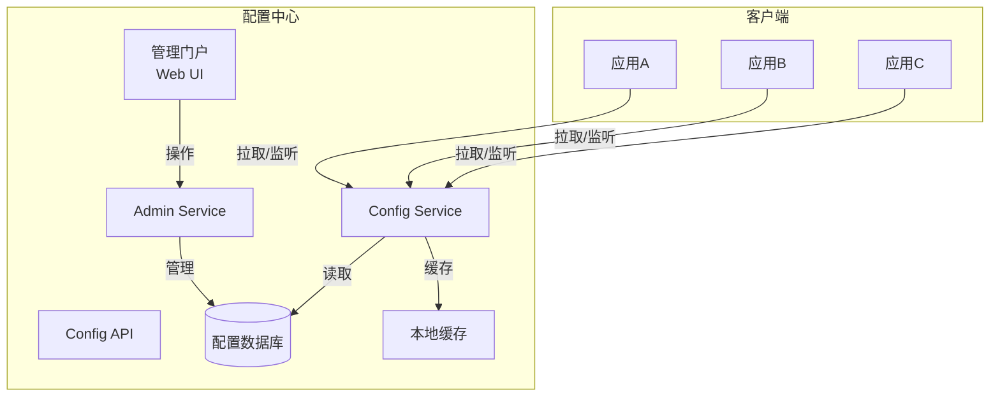
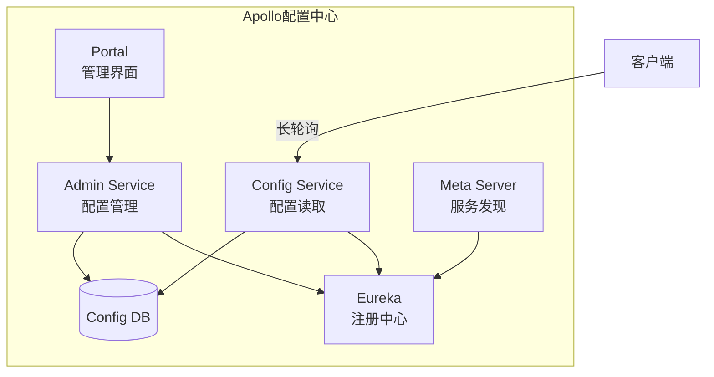
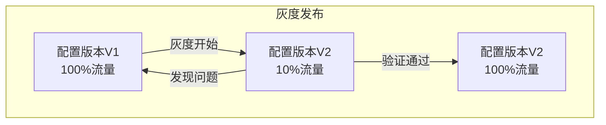

# 配置中心

## 概述

配置中心是微服务架构中的关键基础设施，负责集中管理应用的配置信息，支持动态配置更新、环境隔离、权限控制等功能，避免配置分散在代码或各个服务器中带来的维护难题。

## 配置中心架构



## 主流配置中心对比

| 特性 | Apollo | Nacos | Spring Cloud Config | Consul |
|-----|--------|-------|---------------------|--------|
| 配置管理 | 强大 | 强大 | 基础 | 基础 |
| 服务发现 | 不支持 | 支持 | 不支持 | 支持 |
| 实时推送 | 支持 | 支持 | 依赖Bus | 支持 |
| 版本管理 | 完善 | 基础 | Git版本 | 无 |
| 灰度发布 | 支持 | 支持 | 不支持 | 不支持 |
| 权限控制 | 完善 | 基础 | 依赖Git | ACL |

## Apollo架构



## Nacos配置管理

### 服务端部署

```yaml
# docker-compose.yml - Nacos集群
type: 'yaml'
version: '3.8'
services:
  nacos1:
    image: nacos/nacos-server:v2.2.3
    container_name: nacos1
    hostname: nacos1
    ports:
      - "8848:8848"
      - "9848:9848"
    environment:
      - MODE=cluster
      - PREFER_HOST_MODE=hostname
      - NACOS_SERVERS=nacos1:8848 nacos2:8848 nacos3:8848
      - SPRING_DATASOURCE_PLATFORM=mysql
      - MYSQL_SERVICE_HOST=mysql
      - MYSQL_SERVICE_DB_NAME=nacos
      - MYSQL_SERVICE_PORT=3306
      - MYSQL_SERVICE_USER=nacos
      - MYSQL_SERVICE_PASSWORD=nacos
    volumes:
      - ./cluster.conf:/home/nacos/conf/cluster.conf
      
  nacos2:
    image: nacos/nacos-server:v2.2.3
    container_name: nacos2
    hostname: nacos2
    ports:
      - "8849:8848"
      - "9849:9848"
    environment:
      - MODE=cluster
      - PREFER_HOST_MODE=hostname
      - NACOS_SERVERS=nacos1:8848 nacos2:8848 nacos3:8848
      - SPRING_DATASOURCE_PLATFORM=mysql
      - MYSQL_SERVICE_HOST=mysql
      - MYSQL_SERVICE_DB_NAME=nacos
      - MYSQL_SERVICE_PORT=3306
      - MYSQL_SERVICE_USER=nacos
      - MYSQL_SERVICE_PASSWORD=nacos
      
  nacos3:
    image: nacos/nacos-server:v2.2.3
    container_name: nacos3
    hostname: nacos3
    ports:
      - "8850:8848"
      - "9850:9848"
    environment:
      - MODE=cluster
      - PREFER_HOST_MODE=hostname
      - NACOS_SERVERS=nacos1:8848 nacos2:8848 nacos3:8848
      - SPRING_DATASOURCE_PLATFORM=mysql
      - MYSQL_SERVICE_HOST=mysql
      - MYSQL_SERVICE_DB_NAME=nacos
      - MYSQL_SERVICE_PORT=3306
      - MYSQL_SERVICE_USER=nacos
      - MYSQL_SERVICE_PASSWORD=nacos
```

### 客户端配置

```yaml
# bootstrap.yml - Spring Cloud Nacos
spring:
  application:
    name: order-service
  profiles:
    active: dev
  cloud:
    nacos:
      # 配置中心
      config:
        server-addr: nacos1:8848,nacos2:8848,nacos3:8848
        namespace: ${spring.profiles.active}
        group: DEFAULT_GROUP
        file-extension: yaml
        prefix: ${spring.application.name}
        # 共享配置
        shared-configs:
          - data-id: common.yaml
            group: DEFAULT_GROUP
            refresh: true
          - data-id: redis.yaml
            group: DEFAULT_GROUP
            refresh: true
        # 扩展配置
        extension-configs:
          - data-id: order-service-ext.yaml
            group: EXT_GROUP
            refresh: true
        # 自动刷新
        refresh-enabled: true
      # 注册中心
      discovery:
        server-addr: nacos1:8848,nacos2:8848,nacos3:8848
        namespace: ${spring.profiles.active}
        group: DEFAULT_GROUP
        metadata:
          version: 1.0
          region: beijing
```

### 配置数据模型

```yaml
# Nacos配置 - order-service-dev.yaml
dataId: order-service-dev.yaml
group: DEFAULT_GROUP
namespace: dev
content: |
  server:
    port: 8080
  
  spring:
    datasource:
      url: jdbc:mysql://mysql:3306/order_db?useSSL=false
      username: order_user
      password: ${MYSQL_PASSWORD:default}
      driver-class-name: com.mysql.cj.jdbc.Driver
      hikari:
        maximum-pool-size: 20
        minimum-idle: 5
        connection-timeout: 30000
  
  order:
    # 业务配置
    max-items-per-order: 100
    timeout-minutes: 30
    retry-times: 3
    
    # 开关配置
    features:
      new-checkout: true
      express-delivery: false
      
  # 动态配置示例
  dynamic:
    rate-limit:
      qps: 100
      burst: 150
```

### 动态配置监听

```java
@Component
@RefreshScope  // 支持配置自动刷新
public class OrderConfig {
    
    @Value("${order.max-items-per-order:50}")
    private Integer maxItemsPerOrder;
    
    @Value("${order.timeout-minutes:60}")
    private Integer timeoutMinutes;
    
    @Value("${order.features.new-checkout:false}")
    private Boolean newCheckoutEnabled;
    
    // 配置变更监听
    @NacosConfigListener(dataId = "order-service-dev.yaml", groupId = "DEFAULT_GROUP")
    public void onConfigChange(String config) {
        log.info("配置已更新: {}", config);
        // 重新加载配置或执行特定逻辑
        refreshConfig();
    }
    
    private void refreshConfig() {
        // 配置刷新后的处理逻辑
        if (newCheckoutEnabled) {
            enableNewCheckout();
        }
    }
}
```

## 配置灰度发布



```java
// 基于Label的灰度配置
@Component
public class GrayConfigManager {
    
    @Autowired
    private NacosConfigManager configManager;
    
    public String getConfig(String dataId, String group, String label) {
        // label可以是：灰度版本、地域、部门等
        try {
            // 先尝试获取带label的配置
            ConfigService configService = configManager.getConfigService();
            String config = configService.getConfig(dataId, group + "-" + label, 3000);
            
            if (config == null) {
                //  fallback到默认配置
                config = configService.getConfig(dataId, group, 3000);
            }
            
            return config;
        } catch (NacosException e) {
            throw new RuntimeException("Failed to get config", e);
        }
    }
    
    // 基于用户属性的灰度
    public boolean isGrayUser(String userId) {
        // 灰度规则：用户ID哈希取模
        int hash = Math.abs(userId.hashCode()) % 100;
        return hash < 10; // 10%灰度
    }
}
```

## 配置加密

```yaml
# 加密配置示例
spring:
  cloud:
    nacos:
      config:
        # 启用配置加密
        encrypt:
          enabled: true
          key: ${CONFIG_ENCRYPT_KEY}
        
# 加密后的配置内容
# ENC(加密后的密文)
database:
  password: ENC(Abc123Xyz789...)
```

```java
// 配置解密处理器
@Component
public class EncryptConfigProcessor {
    
    @Value("${config.encrypt.key}")
    private String encryptKey;
    
    private static final String ENC_PREFIX = "ENC(";
    private static final String ENC_SUFFIX = ")";
    
    @Bean
    public ConfigEncryptor configEncryptor() {
        return new AESConfigEncryptor(encryptKey);
    }
    
    // 配置后置处理
    @Bean
    public BeanPostProcessor configDecryptProcessor(ConfigEncryptor encryptor) {
        return new BeanPostProcessor() {
            @Override
            public Object postProcessAfterInitialization(Object bean, String beanName) {
                if (bean instanceof DataSource) {
                    // 解密数据源密码
                    decryptDataSourcePassword((DataSource) bean, encryptor);
                }
                return bean;
            }
        };
    }
    
    private void decryptDataSourcePassword(DataSource dataSource, ConfigEncryptor encryptor) {
        // 反射解密密码字段
    }
}
```

## 配置版本管理

```yaml
# 配置版本历史
config-versions:
  - version: 1.0.0
    timestamp: 2024-01-15T10:00:00Z
    author: admin
    changes: 初始配置
    
  - version: 1.0.1
    timestamp: 2024-01-20T14:30:00Z
    author: developer1
    changes: 调整连接池大小
    diff: |
      - hikari.maximum-pool-size: 10
      + hikari.maximum-pool-size: 20
      
  - version: 1.1.0
    timestamp: 2024-02-01T09:00:00Z
    author: developer2
    changes: 添加新功能开关
    diff: |
      + features.new-checkout: true
      + features.express-delivery: false
```

## 最佳实践

1. **环境隔离**：使用Namespace区分dev/test/prod环境
2. **敏感配置加密**：密码等敏感信息加密存储
3. **配置分组**：按业务或团队划分Group
4. **版本控制**：重要配置变更保留历史
5. **监听机制**：关键配置变更及时通知
6. **降级策略**：配置中心故障时使用本地缓存

## 总结

配置中心是微服务治理的核心组件，实现了配置的集中化、动态化和版本化管理。Apollo适合大型企业的复杂场景，Nacos则集成了服务发现，使用更加便捷。合理设计配置结构和管理流程，可以显著提升系统的可维护性。
