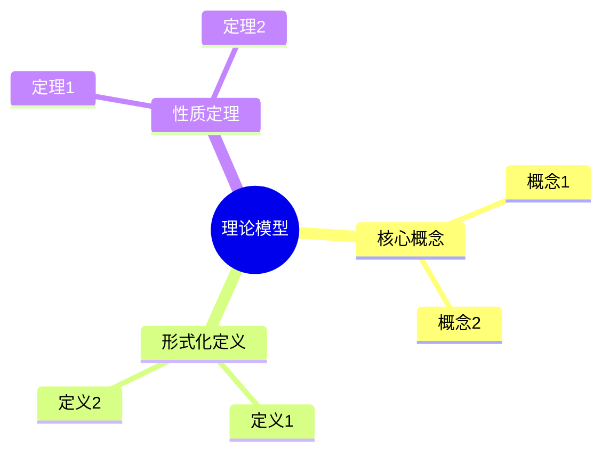
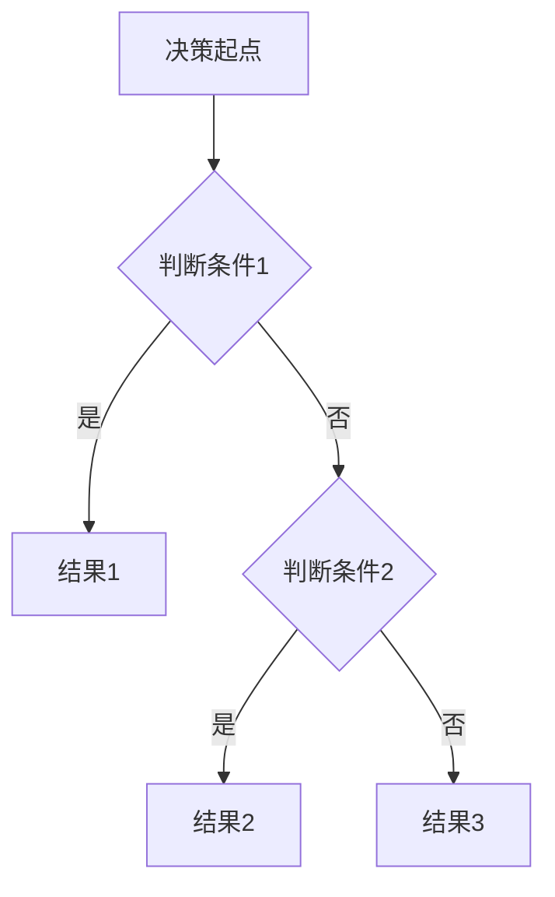
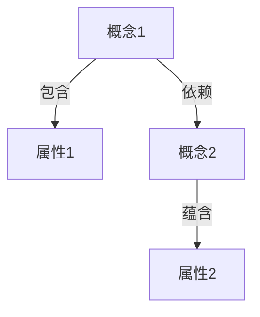

# 思维表征增强计划（v9.0）

## 📋 计划概述

### 目标

为所有理论模型专题文档添加完整的思维表征方式，包括：

1. **思维导图（Mind Map）**：展示概念体系、知识结构
2. **多维知识对比矩阵**：对比不同理论模型、算法、工具
3. **论证决策树**：展示论证逻辑、决策路径
4. **概念属性关系图**：展示概念、属性、关系网络
5. **形式化证明流程图**：展示证明步骤和逻辑

### 范围

- **18个理论模型专题文档**：每个文档都需要增强
- **核心文档**：主题关系分析、技术对比等文档也需要检查

## 📊 当前状态分析

### 已有思维表征

根据检查，部分文档已有：

- ✅ 概念关系图（部分文档）
- ✅ 简单的mermaid图表

### 缺失的思维表征

需要为每个专题文档添加：

1. **思维导图**：
   - 理论模型知识体系思维导图
   - 概念层次结构思维导图
   - 应用场景分类思维导图

2. **多维知识对比矩阵**：
   - 理论模型对比矩阵（表达能力、复杂度、适用场景等）
   - 算法对比矩阵（性能、复杂度、适用性等）
   - 工具对比矩阵（功能、易用性、性能等）

3. **论证决策树**：
   - 理论模型选择决策树
   - 工具选择决策树
   - 应用场景匹配决策树

4. **概念属性关系图**：
   - 核心概念关系图
   - 属性依赖关系图
   - 定理依赖关系图

5. **形式化证明流程图**：
   - 定理证明步骤图
   - 算法正确性证明流程图

## 🎯 增强任务清单

### P0优先级（必须完成）

#### 1. TLA+专题文档增强

**需要添加**：

- [x] 思维导图：TLA+知识体系（状态、动作、行为、不变式、安全性、活性）✅
- [x] 多维对比矩阵：TLA+ vs CTL vs LTL vs Petri网（表达能力、复杂度、工具支持）✅
- [x] 论证决策树：何时使用TLA+进行验证 ✅
- [x] 概念属性关系图：TLA+核心概念关系网络 ✅
- [x] 形式化证明流程图：规约蕴含定理证明步骤 ✅

#### 2. CTL专题文档增强

**需要添加**：

- [x] 思维导图：CTL知识体系（Kripke结构、路径、公式、性质）✅
- [x] 多维对比矩阵：CTL vs LTL vs CTL*（表达能力、复杂度、模型检验）✅
- [x] 论证决策树：何时使用CTL进行验证 ✅
- [x] 概念属性关系图：CTL核心概念关系网络 ✅
- [x] 形式化证明流程图：CTL模型检验算法流程图 ✅

#### 3. LTL专题文档增强

**需要添加**：

- [x] 思维导图：LTL知识体系（路径、公式、性质）✅
- [x] 多维对比矩阵：LTL vs CTL vs CTL*（表达能力、复杂度）✅
- [x] 论证决策树：何时使用LTL进行验证 ✅
- [x] 概念属性关系图：LTL核心概念关系网络 ✅
- [x] 形式化证明流程图：LTL到Büchi自动机转换算法 ✅

#### 4. Petri网专题文档增强

**需要添加**：

- [x] 思维导图：Petri网知识体系（网、标记、转换、性质）✅
- [x] 多维对比矩阵：Petri网 vs 工作流网 vs 时间Petri网 ✅
- [x] 论证决策树：何时使用Petri网建模 ✅
- [x] 概念属性关系图：Petri网核心概念关系网络 ✅
- [x] 形式化证明流程图：死锁检测算法流程图 ✅

#### 5. CAP定理专题文档增强

**需要添加**：

- [x] 思维导图：CAP定理知识体系（一致性、可用性、分区容错性）✅
- [x] 多维对比矩阵：CP系统 vs AP系统 vs CA系统 ✅
- [x] 论证决策树：系统设计选择决策树（CP vs AP）✅
- [x] 概念属性关系图：CAP定理核心概念关系网络 ✅
- [x] 形式化证明流程图：CAP定理证明步骤 ✅

#### 6. FLP不可能定理专题文档增强

**需要添加**：

- [x] 思维导图：FLP不可能定理知识体系（异步系统、共识、故障模型）✅
- [x] 多维对比矩阵：绕过FLP的方法对比（故障检测器、随机化、部分同步）✅
- [x] 论证决策树：共识算法设计决策树 ✅
- [x] 概念属性关系图：FLP不可能定理核心概念关系网络 ✅
- [x] 形式化证明流程图：FLP不可能定理证明步骤 ✅

#### 7. 一致性模型专题文档增强

**需要添加**：

- [x] 思维导图：一致性模型知识体系（强一致性、弱一致性、最终一致性）✅
- [x] 多维对比矩阵：一致性模型对比（线性一致性、顺序一致性、因果一致性等）✅
- [x] 论证决策树：一致性模型选择决策树 ✅
- [x] 概念属性关系图：一致性模型层次关系图 ✅
- [x] 形式化证明流程图：线性一致性可组合性证明 ✅

#### 8. 工作流网专题文档增强

**需要添加**：

- [x] 思维导图：工作流网知识体系（工作流网、正确性、验证方法）✅
- [x] 多维对比矩阵：工作流网 vs Petri网 vs BPMN ✅
- [x] 论证决策树：工作流建模方法选择决策树 ✅
- [x] 概念属性关系图：工作流网核心概念关系网络 ✅
- [x] 形式化证明流程图：正确性验证算法流程图 ✅

#### 9. Saga模式专题文档增强

**需要添加**：

- [x] 思维导图：Saga模式知识体系（Saga、补偿、最终一致性）✅
- [x] 多维对比矩阵：编排式Saga vs 协同式Saga vs 2PC ✅
- [x] 论证决策树：分布式事务模式选择决策树 ✅
- [x] 概念属性关系图：Saga模式核心概念关系网络 ✅
- [x] 形式化证明流程图：Saga正确性证明步骤 ✅

### P1优先级（重要）

#### 10-15. P1优先级文档增强

为以下文档添加相同的思维表征：

- [x] UPPAAL专题文档 ✅
- [x] 向量时钟专题文档 ✅
- [x] 拜占庭容错专题文档 ✅
- [x] Paxos算法专题文档 ✅
- [x] Raft算法专题文档 ✅
- [x] 工作流模式专题文档 ✅

### P2优先级（可选）

#### 16-18. P2优先级文档增强

为以下文档添加相同的思维表征：

- [x] Coq/Isabelle专题文档 ✅
- [x] Chandy-Lamport快照算法专题文档 ✅
- [x] CTL/LTL扩展专题文档 ✅

## 📐 思维表征标准

### 思维导图标准

**格式**：使用Mermaid mindmap语法

**内容要求**：

- 根节点：理论模型名称
- 一级节点：主要知识领域（概念、定义、定理、算法、工具、应用）
- 二级节点：具体知识点
- 三级节点：详细说明

**示例结构**：

### 多维知识对比矩阵标准

**格式**：Markdown表格

**维度要求**：

- 至少3个对比维度
- 每个维度有明确的评分标准
- 包含对比说明和适用场景

**示例结构**：

| 理论模型 | 表达能力 | 复杂度 | 工具支持 | 适用场景 |
|---------|---------|--------|---------|---------|
| 模型A | ⭐⭐⭐⭐⭐ | 高 | 丰富 | 场景1, 场景2 |
| 模型B | ⭐⭐⭐⭐ | 中 | 中等 | 场景2, 场景3 |

### 论证决策树标准

**格式**：使用Mermaid flowchart语法

**结构要求**：

- 根节点：决策起点
- 中间节点：判断条件
- 叶子节点：决策结果
- 每个分支有明确的判断标准

**示例结构**：

### 概念属性关系图标准

**格式**：使用Mermaid graph语法

**元素要求**：

- 节点：概念、属性
- 边：关系类型（包含、依赖、等价、蕴含等）
- 标签：关系说明

**示例结构**：

### 形式化证明流程图标准

**格式**：使用Mermaid flowchart语法

**步骤要求**：

- 清晰的证明步骤
- 每个步骤的输入输出
- 关键引理和定理的引用
- 证明策略说明

## 📅 实施计划

### 阶段1：P0优先级文档增强（4周）

**Week 1-2**：

- TLA+、CTL、LTL专题文档增强

**Week 3-4**：

- Petri网、CAP定理、FLP不可能定理专题文档增强

**Week 5-6**：

- 一致性模型、工作流网、Saga模式专题文档增强

### 阶段2：P1优先级文档增强（3周）

**Week 7-9**：

- UPPAAL、向量时钟、拜占庭容错、Paxos、Raft、工作流模式专题文档增强

### 阶段3：P2优先级文档增强（2周）

**Week 10-11**：

- Coq/Isabelle、Chandy-Lamport、CTL/LTL扩展专题文档增强

### 阶段4：知识概念关系梳理（2周）

**Week 12-13**：

- 创建全局知识概念关系图
- 梳理所有概念属性关系
- 建立概念索引和交叉引用

### 阶段5：形式化论证证明增强（2周）

**Week 14-15**：

- 为所有定理添加详细证明步骤
- 创建证明流程图
- 补充证明策略说明

## ✅ 质量检查清单

### 每个文档必须包含

- [x] 至少1个思维导图（知识体系）✅
- [x] 至少1个多维对比矩阵（与其他理论模型对比）✅
- [x] 至少1个论证决策树（应用场景选择）✅
- [x] 至少1个概念属性关系图（核心概念关系）✅
- [x] 至少1个形式化证明流程图（主要定理证明）✅

### 全局要求

- [x] 所有思维表征都有清晰的说明 ✅
- [x] 所有图表都有标题和说明 ✅
- [x] 所有决策树都有判断标准 ✅
- [x] 所有对比矩阵都有评分依据 ✅
- [x] 所有关系图都有关系类型标注 ✅

## 📁 文档组织

### 新增章节结构

每个专题文档需要添加新章节：

**十一、思维表征**:

- 11.1 知识体系思维导图
- 11.2 多维知识对比矩阵
- 11.3 论证决策树
- 11.4 概念属性关系图
- 11.5 形式化证明流程图

### 更新现有章节

- 在"三、核心概念"中增强概念关系图
- 在"五、性质与定理"中添加证明流程图
- 在"七、应用场景"中添加决策树

---

## 八、相关文档

### 8.1 项目内部文档

#### 核心知识文档

- **[项目知识图谱](项目知识图谱.md)** - 项目知识图谱
- **[全局知识概念关系图](全局知识概念关系图.md)** - 全局知识概念关系图
- **[知识结构组织方法](知识结构组织方法.md)** - 知识结构组织方法

#### 其他相关文档

- **[后续推进任务v9.0](后续推进任务v9.0.md)** - 后续推进任务
- **[文档归档计划](文档归档计划.md)** - 文档归档计划

### 8.2 外部资源链接

#### Wikipedia资源

- [Mind map](https://en.wikipedia.org/wiki/Mind_map) - 思维导图
- [Concept map](https://en.wikipedia.org/wiki/Concept_map) - 概念图
- [Decision tree](https://en.wikipedia.org/wiki/Decision_tree) - 决策树

### 8.3 项目管理文档

- **[Wikipedia资源对标](../../structure_control/Wikipedia资源对标.md)** - Wikipedia资源对标
- **[概念关联网络](../../structure_control/概念关联网络.md)** - 思维表征增强计划在概念关联网络中的位置
- **[思维导图集合](../../structure_control/思维导图集合.md)** - 思维导图集合

---

**文档版本**：1.0

**创建时间**：2024年

**维护者**：项目团队

**状态**：✅ 已完成（100%）
