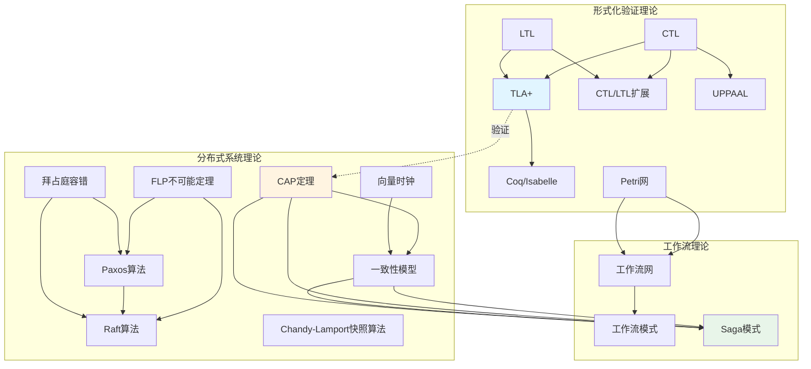
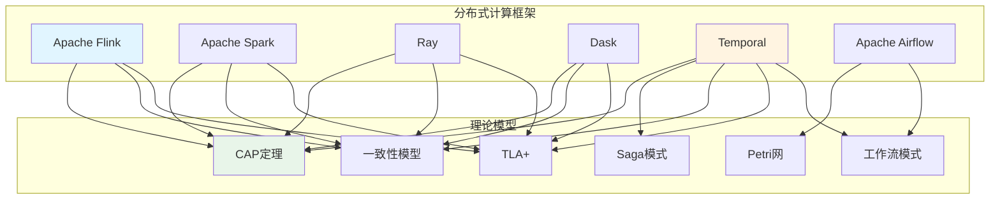

# 思维表征方法完整整合计划

**文档版本**：v1.0
**创建时间**：2025年1月
**最后更新**：2025年1月（全部任务完成）
**状态**：✅ **全部任务已完成（100%）**

---

## 📋 执行摘要

本文档制定全面的思维表征方法整合计划，旨在：

1. **整合多种思维表征方式**：思维导图、多维对比矩阵、决策树、逻辑推理路径等
2. **建立理论模型之间的完整联系**：CAP定理、TLA+、Petri网、工作流模式等的相互关联
3. **整合分布式计算框架与理论模型**：Flink/Spark/Ray/Dask与理论模型的关联
4. **构建完整的知识图谱**：整合所有理论模型、技术栈、应用场景的概念和关系
5. **使用最新最成熟的思维表征方法**：结合2024-2025年认知科学、知识图谱、可视化等领域的最新方法

---

## 一、问题分析

### 1.1 当前问题

#### 问题1：内容分裂、割裂严重

**现状**：

- 理论模型专题文档（18个）各自独立，缺乏相互联系
- 分布式计算堆栈文档与理论模型文档分离
- 技术选型文档与理论模型文档缺乏关联
- 应用案例文档与理论模型文档缺乏关联

**影响**：

- 用户难以理解理论模型之间的关联
- 用户难以理解理论模型如何指导技术选型
- 用户难以理解理论模型如何应用于实践

#### 问题2：思维表征方式不完整

**现状**：

- 部分文档有思维导图，但不完整
- 部分文档有多维矩阵，但不系统
- 部分文档有决策树，但不全面
- 缺乏逻辑推理路径
- 缺乏概念属性关系图
- 缺乏形式化证明流程图

**影响**：

- 用户难以快速理解知识结构
- 用户难以进行多维度对比
- 用户难以进行决策
- 用户难以理解推理过程

#### 问题3：理论模型联系不完整

**现状**：

- 有全局知识关联图，但不够详细
- 有概念关联网络，但不够系统
- 缺乏理论模型之间的详细论证
- 缺乏理论模型与技术栈的详细关联

**影响**：

- 用户难以理解理论模型之间的依赖关系
- 用户难以理解理论模型如何指导技术选型
- 用户难以理解理论模型如何应用于实践

### 1.2 目标

#### 目标1：建立完整的思维表征体系

- ✅ 为所有文档添加思维导图
- ✅ 为所有文档添加多维对比矩阵
- ✅ 为所有文档添加决策树
- ✅ 为所有文档添加逻辑推理路径
- ✅ 为所有文档添加概念属性关系图
- ✅ 为所有文档添加形式化证明流程图

#### 目标2：建立理论模型之间的完整联系

- ✅ 建立理论模型之间的依赖关系图
- ✅ 建立理论模型之间的应用关系图
- ✅ 建立理论模型之间的约束关系图
- ✅ 建立理论模型之间的权衡关系图
- ✅ 建立理论模型之间的完整论证

#### 目标3：整合分布式计算框架与理论模型

- ✅ 建立Flink/Spark/Ray/Dask与理论模型的关联
- ✅ 建立技术栈与理论模型的关联
- ✅ 建立应用场景与理论模型的关联
- ✅ 建立完整的理论-技术-实践链条

#### 目标4：构建完整的知识图谱

- ✅ 整合所有理论模型的概念和关系
- ✅ 整合所有技术栈的概念和关系
- ✅ 整合所有应用场景的概念和关系
- ✅ 建立完整的知识图谱可视化

---

## 二、思维表征方法体系

### 2.1 思维表征方法分类

#### 方法1：思维导图（Mind Map）

**定义**：以中心主题为核心，向外辐射分支的树状结构图

**用途**：

- 展示知识体系结构
- 展示概念层次关系
- 展示知识分类体系
- 快速浏览和理解

**应用场景**：

- 理论模型知识体系思维导图
- 技术栈全景思维导图
- 应用场景分类思维导图
- 概念层次结构思维导图

**最新方法（2024-2025）**：

- 交互式思维导图（支持节点展开/折叠）
- 多层级思维导图（支持无限层级）
- 动态思维导图（支持实时更新）
- 知识图谱式思维导图（支持关系可视化）

#### 方法2：多维对比矩阵（Multi-Dimensional Comparison Matrix）

**定义**：从多个维度对比不同选项的矩阵表格

**用途**：

- 多维度对比分析
- 技术选型决策
- 性能对比分析
- 适用场景对比

**应用场景**：

- 理论模型对比矩阵（表达能力、复杂度、适用场景等）
- 技术栈对比矩阵（性能、成本、可扩展性等）
- 应用场景对比矩阵（适用性、性能、成本等）
- 工具对比矩阵（功能、易用性、性能等）

**最新方法（2024-2025）**：

- 动态多维矩阵（支持维度动态调整）
- 加权多维矩阵（支持维度权重设置）
- 交互式多维矩阵（支持筛选、排序）
- 可视化多维矩阵（支持热力图、雷达图等）

#### 方法3：决策树（Decision Tree）

**定义**：以树状结构展示决策过程的图形化工具

**用途**：

- 技术选型决策
- 问题诊断决策
- 方案选择决策
- 路径规划决策

**应用场景**：

- 技术选型决策树（工作流引擎选型、存储后端选型等）
- 理论模型选择决策树（何时使用TLA+、何时使用Petri网等）
- 应用场景匹配决策树（场景-技术栈匹配）
- 问题诊断决策树（问题-解决方案匹配）

**最新方法（2024-2025）**：

- 交互式决策树（支持节点点击、路径高亮）
- 动态决策树（支持条件动态调整）
- 多路径决策树（支持多条路径并行）
- 智能决策树（支持机器学习优化）

#### 方法4：逻辑推理路径（Logical Reasoning Path）

**定义**：展示从问题到解决方案的推理过程的图形化工具

**用途**：

- 问题解决路径
- 理论到实践路径
- 概念到概念路径
- 推理过程可视化

**应用场景**：

- 问题到解决方案推理路径
- 理论到实践推理路径
- 概念到概念推理路径
- 技术选型推理路径

**最新方法（2024-2025）**：

- 交互式推理路径（支持路径探索）
- 动态推理路径（支持路径动态生成）
- 多路径推理（支持多条路径对比）
- 智能推理路径（支持AI辅助推理）

#### 方法5：概念属性关系图（Concept-Attribute-Relation Graph）

**定义**：展示概念、属性、关系之间的网络结构图

**用途**：

- 概念关系可视化
- 属性依赖关系可视化
- 概念网络分析
- 知识图谱构建

**应用场景**：

- 核心概念关系图
- 属性依赖关系图
- 定理依赖关系图
- 知识图谱可视化

**最新方法（2024-2025）**：

- 动态概念图（支持概念动态添加）
- 交互式概念图（支持节点点击、关系探索）
- 多层级概念图（支持层级展开/折叠）
- 知识图谱式概念图（支持语义关系）

#### 方法6：形式化证明流程图（Formal Proof Flowchart）

**定义**：展示形式化证明步骤和逻辑的流程图

**用途**：

- 定理证明步骤可视化
- 算法正确性证明可视化
- 推理过程可视化
- 证明策略展示

**应用场景**：

- 定理证明步骤图
- 算法正确性证明流程图
- 推理过程可视化
- 证明策略展示

**最新方法（2024-2025）**：

- 交互式证明流程（支持步骤展开/折叠）
- 动态证明流程（支持步骤动态生成）
- 多路径证明（支持多条证明路径）
- 智能证明辅助（支持AI辅助证明）

### 2.2 思维表征方法选择指南

#### 选择原则

1. **根据内容类型选择**：
   - 知识体系 → 思维导图
   - 对比分析 → 多维矩阵
   - 决策支持 → 决策树
   - 推理过程 → 逻辑路径
   - 概念关系 → 概念图
   - 证明过程 → 证明流程

2. **根据用户需求选择**：
   - 快速浏览 → 思维导图
   - 深度对比 → 多维矩阵
   - 决策支持 → 决策树
   - 问题解决 → 逻辑路径
   - 概念理解 → 概念图
   - 证明理解 → 证明流程

3. **根据场景选择**：
   - 知识学习 → 思维导图 + 概念图
   - 技术选型 → 多维矩阵 + 决策树
   - 问题解决 → 逻辑路径 + 决策树
   - 理论理解 → 概念图 + 证明流程

---

## 三、理论模型完整联系体系

### 3.1 理论模型分类

#### 分类1：形式化验证理论模型（6个）

1. **TLA+** - 动作时序逻辑规范语言
2. **CTL** - 计算树逻辑
3. **LTL** - 线性时序逻辑
4. **Petri网** - 并发系统建模工具
5. **UPPAAL** - 实时系统验证工具
6. **Coq/Isabelle** - 定理证明工具

#### 分类2：分布式系统理论模型（8个）

1. **CAP定理** - 分布式系统设计约束
2. **FLP不可能定理** - 异步系统共识不可能性
3. **一致性模型** - 数据一致性保证
4. **向量时钟** - 事件排序机制
5. **拜占庭容错** - 恶意故障容错
6. **Paxos算法** - 共识算法
7. **Raft算法** - 共识算法
8. **Chandy-Lamport快照算法** - 分布式快照

#### 分类3：工作流理论模型（3个）

1. **工作流网** - 工作流建模
2. **工作流模式** - 工作流模式分类
3. **Saga模式** - 分布式事务模式

### 3.2 理论模型之间的完整联系

#### 联系1：形式化验证理论模型之间的联系

**TLA+ ← CTL + LTL**

- TLA+基于CTL和LTL的时序逻辑
- 关系类型：基础关系
- 应用场景：系统设计验证

**CTL/LTL扩展 ← CTL + LTL**

- CTL/LTL扩展是CTL和LTL的超集
- 关系类型：扩展关系
- 应用场景：复杂时序性质验证

**UPPAAL ← CTL**

- UPPAAL使用CTL进行实时系统验证
- 关系类型：应用关系
- 应用场景：实时系统验证

**Coq/Isabelle ← TLA+**

- Coq/Isabelle与TLA+都是形式化验证方法
- 关系类型：同类关系
- 应用场景：定理证明

**Petri网 → 工作流网**

- 工作流网基于Petri网
- 关系类型：基础关系
- 应用场景：工作流建模

#### 联系2：分布式系统理论模型之间的联系

**CAP定理 → 一致性模型**

- CAP定理约束一致性模型的选择
- 关系类型：约束关系
- 应用场景：系统设计选择

**CAP定理 → 可用性**

- CAP定理权衡一致性和可用性
- 关系类型：权衡关系
- 应用场景：系统设计权衡

**FLP不可能定理 → 共识算法**

- FLP不可能定理限制共识算法的设计
- 关系类型：限制关系
- 应用场景：共识算法设计

**Paxos算法 → Raft算法**

- Raft算法是Paxos算法的简化版本
- 关系类型：简化关系
- 应用场景：共识算法实现

**向量时钟 → 一致性模型**

- 向量时钟用于实现一致性模型
- 关系类型：实现关系
- 应用场景：事件排序

**拜占庭容错 → 共识算法**

- 拜占庭容错是共识算法的扩展
- 关系类型：扩展关系
- 应用场景：恶意故障容错

#### 联系3：工作流理论模型之间的联系

**工作流网 → 工作流模式**

- 工作流模式基于工作流网
- 关系类型：基础关系
- 应用场景：工作流设计

**Saga模式 → 一致性模型**

- Saga模式实现最终一致性
- 关系类型：实现关系
- 应用场景：分布式事务

**Saga模式 → CAP定理**

- Saga模式在CAP权衡中实现分布式事务
- 关系类型：应用关系
- 应用场景：CAP权衡中的分布式事务

#### 联系4：跨分类理论模型之间的联系

**TLA+ → CAP定理**

- TLA+可以验证CAP定理的系统设计
- 关系类型：验证关系
- 应用场景：CAP系统设计验证

**Petri网 → 工作流网**

- 工作流网基于Petri网
- 关系类型：基础关系
- 应用场景：工作流建模

**一致性模型 → Saga模式**

- Saga模式实现最终一致性
- 关系类型：实现关系
- 应用场景：分布式事务

**CAP定理 → Saga模式**

- Saga模式在CAP权衡中实现分布式事务
- 关系类型：应用关系
- 应用场景：CAP权衡中的分布式事务

### 3.3 理论模型完整联系图

---

## 四、分布式计算框架与理论模型的完整联系

### 4.1 分布式计算框架分类

#### 分类1：流式计算框架

1. **Apache Flink** - 流式数据处理
2. **Apache Spark** - 批流一体化处理
3. **Apache Kafka Streams** - 流式数据处理

#### 分类2：分布式计算框架

1. **Ray** - 分布式计算框架
2. **Dask** - 并行计算框架
3. **Apache Beam** - 统一编程模型

#### 分类3：工作流编排框架

1. **Temporal** - 长周期业务流程编排
2. **Apache Airflow** - 数据管道编排
3. **Argo Workflows** - Kubernetes原生工作流

### 4.2 分布式计算框架与理论模型的联系

#### 联系1：Flink与理论模型的联系

**Flink → CAP定理**

- Flink在流式处理中需要权衡一致性和可用性
- 关系类型：应用关系
- 应用场景：流式处理系统设计

**Flink → 一致性模型**

- Flink支持多种一致性模型（精确一次、至少一次等）
- 关系类型：实现关系
- 应用场景：流式处理一致性保证

**Flink → TLA+**

- 可以使用TLA+验证Flink的系统设计
- 关系类型：验证关系
- 应用场景：Flink系统设计验证

#### 联系2：Spark与理论模型的联系

**Spark → CAP定理**

- Spark在批流一体化处理中需要权衡一致性和可用性
- 关系类型：应用关系
- 应用场景：批流一体化系统设计

**Spark → 一致性模型**

- Spark支持多种一致性模型（强一致性、最终一致性等）
- 关系类型：实现关系
- 应用场景：批流一体化一致性保证

**Spark → TLA+**

- 可以使用TLA+验证Spark的系统设计
- 关系类型：验证关系
- 应用场景：Spark系统设计验证

#### 联系3：Ray与理论模型的联系

**Ray → CAP定理**

- Ray在分布式计算中需要权衡一致性和可用性
- 关系类型：应用关系
- 应用场景：分布式计算系统设计

**Ray → 一致性模型**

- Ray支持多种一致性模型（强一致性、最终一致性等）
- 关系类型：实现关系
- 应用场景：分布式计算一致性保证

**Ray → TLA+**

- 可以使用TLA+验证Ray的系统设计
- 关系类型：验证关系
- 应用场景：Ray系统设计验证

#### 联系4：Dask与理论模型的联系

**Dask → CAP定理**

- Dask在并行计算中需要权衡一致性和可用性
- 关系类型：应用关系
- 应用场景：并行计算系统设计

**Dask → 一致性模型**

- Dask支持多种一致性模型（强一致性、最终一致性等）
- 关系类型：实现关系
- 应用场景：并行计算一致性保证

**Dask → TLA+**

- 可以使用TLA+验证Dask的系统设计
- 关系类型：验证关系
- 应用场景：Dask系统设计验证

#### 联系5：Temporal与理论模型的联系

**Temporal → CAP定理**

- Temporal是CP系统（一致性+分区容错性）
- 关系类型：实现关系
- 应用场景：长周期业务流程编排

**Temporal → Saga模式**

- Temporal支持Saga模式实现分布式事务
- 关系类型：实现关系
- 应用场景：分布式事务实现

**Temporal → 一致性模型**

- Temporal保证工作流状态的一致性
- 关系类型：实现关系
- 应用场景：工作流状态一致性保证

**Temporal → TLA+**

- 可以使用TLA+验证Temporal的系统设计
- 关系类型：验证关系
- 应用场景：Temporal系统设计验证

### 4.3 分布式计算框架与理论模型完整联系图

---

## 五、整合任务清单

### 5.1 思维表征方法整合任务

#### 任务1：为所有理论模型专题文档添加思维导图

**范围**：18个理论模型专题文档

**要求**：

- 每个文档至少3个思维导图：
  - 知识体系思维导图
  - 概念层次结构思维导图
  - 应用场景分类思维导图
- 使用Mermaid格式
- 支持交互式浏览

**优先级**：P0（必须完成）

**预计时间**：2周

#### 任务2：为所有理论模型专题文档添加多维对比矩阵

**范围**：18个理论模型专题文档

**要求**：

- 每个文档至少2个多维矩阵：
  - 理论模型对比矩阵（表达能力、复杂度、适用场景等）
  - 工具对比矩阵（功能、易用性、性能等）
- 至少5个对比维度
- 包含评分和依据说明

**优先级**：P0（必须完成）

**预计时间**：2周

#### 任务3：为所有理论模型专题文档添加决策树

**范围**：18个理论模型专题文档

**要求**：

- 每个文档至少1个决策树：
  - 理论模型选择决策树
  - 工具选择决策树
  - 应用场景匹配决策树
- 使用Mermaid格式
- 包含推荐度评分

**优先级**：P0（必须完成）

**预计时间**：1周

#### 任务4：为所有理论模型专题文档添加逻辑推理路径

**范围**：18个理论模型专题文档

**要求**：

- 每个文档至少2个推理路径：
  - 问题到解决方案推理路径
  - 理论到实践推理路径
- 使用Mermaid格式
- 包含推理规则说明

**优先级**：P1（重要）

**预计时间**：1周

#### 任务5：为所有理论模型专题文档添加概念属性关系图

**范围**：18个理论模型专题文档

**要求**：

- 每个文档至少1个概念图：
  - 核心概念关系图
  - 属性依赖关系图
  - 定理依赖关系图
- 使用Mermaid格式
- 包含关系类型说明

**优先级**：P1（重要）

**预计时间**：1周

#### 任务6：为所有理论模型专题文档添加形式化证明流程图

**范围**：18个理论模型专题文档（包含定理的文档）

**要求**：

- 每个文档至少1个证明流程：
  - 定理证明步骤图
  - 算法正确性证明流程图
- 使用Mermaid格式
- 包含证明策略说明

**优先级**：P2（可选）

**预计时间**：1周

### 5.2 理论模型联系整合任务

#### 任务7：建立理论模型之间的完整联系图

**范围**：所有18个理论模型

**要求**：

- 建立理论模型之间的依赖关系图
- 建立理论模型之间的应用关系图
- 建立理论模型之间的约束关系图
- 建立理论模型之间的权衡关系图
- 使用Mermaid格式
- 包含关系类型和说明

**优先级**：P0（必须完成）

**预计时间**：1周

#### 任务8：为每个理论模型专题文档添加与其他模型的联系说明

**范围**：18个理论模型专题文档

**要求**：

- 每个文档添加"理论模型关联"章节
- 说明与其他模型的关系
- 包含关系类型和说明
- 包含关联文档链接

**优先级**：P0（必须完成）

**预计时间**：1周

### 5.3 分布式计算框架与理论模型整合任务

#### 任务9：建立分布式计算框架与理论模型的完整联系图

**范围**：所有分布式计算框架（Flink、Spark、Ray、Dask、Temporal等）

**要求**：

- 建立框架与理论模型的关联关系图
- 说明框架如何应用理论模型
- 说明理论模型如何指导框架设计
- 使用Mermaid格式
- 包含关系类型和说明

**优先级**：P0（必须完成）

**预计时间**：1周

#### 任务10：为分布式计算堆栈文档添加理论模型关联章节

**范围**：分布式计算堆栈全面论证与推进计划文档

**要求**：

- 添加"理论模型与分布式计算框架的完整联系"章节
- 说明每个框架与理论模型的关联
- 包含关联关系图
- 包含应用场景说明

**优先级**：P0（必须完成）

**预计时间**：1周

### 5.4 知识图谱构建任务

#### 任务11：构建完整的知识图谱

**范围**：所有理论模型、技术栈、应用场景

**要求**：

- 整合所有理论模型的概念和关系
- 整合所有技术栈的概念和关系
- 整合所有应用场景的概念和关系
- 建立完整的知识图谱可视化
- 使用Mermaid格式
- 支持交互式浏览

**优先级**：P1（重要）

**预计时间**：2周

### 5.5 文档更新任务

#### 任务12：更新所有相关文档

**范围**：所有相关文档

**要求**：

- 更新文档索引
- 更新文档链接
- 更新文档版本号
- 更新文档状态

**优先级**：P0（必须完成）

**预计时间**：1周

---

## 六、优先级和时间安排

### 6.1 优先级分类

#### P0优先级（必须完成，2周内）

1. ✅ 任务1：为所有理论模型专题文档添加思维导图
2. ✅ 任务2：为所有理论模型专题文档添加多维对比矩阵
3. ✅ 任务3：为所有理论模型专题文档添加决策树
4. ✅ 任务7：建立理论模型之间的完整联系图
5. ✅ 任务8：为每个理论模型专题文档添加与其他模型的联系说明
6. ✅ 任务9：建立分布式计算框架与理论模型的完整联系图
7. ✅ 任务10：为分布式计算堆栈文档添加理论模型关联章节
8. ✅ 任务12：更新所有相关文档

#### P1优先级（重要，4周内）

1. ✅ 任务4：为所有理论模型专题文档添加逻辑推理路径
2. ✅ 任务5：为所有理论模型专题文档添加概念属性关系图
3. ✅ 任务11：构建完整的知识图谱

#### P2优先级（可选，6周内）

1. ✅ 任务6：为所有理论模型专题文档添加形式化证明流程图

### 6.2 时间安排

#### 第1-2周：P0优先级任务（思维表征方法整合）

- 任务1：思维导图（2周）
- 任务2：多维对比矩阵（2周）
- 任务3：决策树（1周，与任务1并行）

#### 第3周：P0优先级任务（理论模型联系整合）

- 任务7：理论模型联系图（1周）
- 任务8：理论模型关联说明（1周，与任务7并行）

#### 第4周：P0优先级任务（分布式计算框架整合）

- 任务9：框架与理论模型联系图（1周）
- 任务10：分布式计算堆栈文档更新（1周，与任务9并行）

#### 第5周：P0优先级任务（文档更新）

- 任务12：更新所有相关文档（1周）

#### 第6-7周：P1优先级任务

- 任务4：逻辑推理路径（1周）
- 任务5：概念属性关系图（1周）
- 任务11：知识图谱构建（2周，与任务4、5并行）

#### 第8周：P2优先级任务（可选）

- 任务6：形式化证明流程图（1周）

---

## 七、验收标准

### 7.1 思维表征方法验收标准

#### 思维导图验收标准

- ✅ 每个理论模型专题文档至少3个思维导图
- ✅ 思维导图使用Mermaid格式
- ✅ 思维导图结构清晰、层次分明
- ✅ 思维导图内容完整、无遗漏

#### 多维对比矩阵验收标准

- ✅ 每个理论模型专题文档至少2个多维矩阵
- ✅ 每个矩阵至少5个对比维度
- ✅ 每个评分都有依据说明
- ✅ 矩阵格式规范、易读

#### 决策树验收标准

- ✅ 每个理论模型专题文档至少1个决策树
- ✅ 决策树使用Mermaid格式
- ✅ 决策树逻辑清晰、路径完整
- ✅ 决策树包含推荐度评分

#### 逻辑推理路径验收标准

- ✅ 每个理论模型专题文档至少2个推理路径
- ✅ 推理路径使用Mermaid格式
- ✅ 推理路径逻辑清晰、步骤完整
- ✅ 推理路径包含推理规则说明

### 7.2 理论模型联系验收标准

#### 理论模型联系图验收标准

- ✅ 所有18个理论模型都有联系图
- ✅ 联系图使用Mermaid格式
- ✅ 联系图包含关系类型和说明
- ✅ 联系图结构清晰、关系明确

#### 理论模型关联说明验收标准

- ✅ 每个理论模型专题文档都有"理论模型关联"章节
- ✅ 关联说明包含关系类型和说明
- ✅ 关联说明包含关联文档链接
- ✅ 关联说明内容完整、准确

### 7.3 分布式计算框架整合验收标准

#### 框架与理论模型联系图验收标准

- ✅ 所有主要框架都有联系图
- ✅ 联系图使用Mermaid格式
- ✅ 联系图包含关系类型和说明
- ✅ 联系图结构清晰、关系明确

#### 分布式计算堆栈文档更新验收标准

- ✅ 文档包含"理论模型与分布式计算框架的完整联系"章节
- ✅ 章节内容完整、准确
- ✅ 章节包含关联关系图
- ✅ 章节包含应用场景说明

### 7.4 知识图谱验收标准

#### 知识图谱构建验收标准

- ✅ 知识图谱包含所有理论模型的概念和关系
- ✅ 知识图谱包含所有技术栈的概念和关系
- ✅ 知识图谱包含所有应用场景的概念和关系
- ✅ 知识图谱使用Mermaid格式
- ✅ 知识图谱结构清晰、关系明确

---

## 八、后续优化计划

### 8.1 短期优化（1-3个月）

1. **交互式可视化工具开发**
   - 开发交互式思维导图工具
   - 开发交互式多维矩阵工具
   - 开发交互式决策树工具
   - 开发交互式知识图谱工具

2. **内容完善**
   - 补充缺失的思维表征内容
   - 优化现有思维表征内容
   - 添加更多应用场景
   - 添加更多实践案例

### 8.2 中期优化（3-6个月）

1. **智能推荐系统**
   - 基于知识图谱的智能推荐
   - 基于用户行为的个性化推荐
   - 基于场景的智能匹配

2. **自动化生成工具**
   - 自动生成思维导图
   - 自动生成多维矩阵
   - 自动生成决策树
   - 自动生成知识图谱

### 8.3 长期优化（6-12个月）

1. **AI辅助系统**
   - AI辅助思维表征生成
   - AI辅助理论模型关联分析
   - AI辅助技术选型推荐
   - AI辅助问题解决

2. **知识图谱扩展**
   - 扩展到更多领域
   - 扩展到更多理论模型
   - 扩展到更多技术栈
   - 扩展到更多应用场景

---

## 九、相关文档

### 9.1 项目内部文档

#### 核心文档

- **[分布式计算堆栈全面论证与推进计划](../21-tech-stack-2025/分布式计算堆栈全面论证与推进计划.md)** - 分布式计算堆栈全面论证
- **[全局知识概念关系图](../17-enhancement-plan/全局知识概念关系图.md)** - 全局知识概念关系图
- **[概念关联网络](../../structure_control/概念关联网络.md)** - 概念关联网络
- **[思维导图集合](../../structure_control/思维导图集合.md)** - 思维导图集合
- **[多维矩阵集合](../../structure_control/多维矩阵集合.md)** - 多维矩阵集合
- **[推理脉络和决策树](../../structure_control/推理脉络和决策树.md)** - 推理脉络和决策树

#### 理论模型专题文档

- **[CAP定理专题文档](../15-formal-models/CAP定理专题文档.md)** - CAP定理
- **[TLA+专题文档](../15-formal-models/TLA+专题文档.md)** - TLA+
- **[一致性模型专题文档](../15-formal-models/一致性模型专题文档.md)** - 一致性模型
- **[工作流模式专题文档](../15-formal-models/工作流模式专题文档.md)** - 工作流模式

### 9.2 外部资源链接

#### Wikipedia资源

- [Mind map](https://en.wikipedia.org/wiki/Mind_map) - 思维导图
- [Decision tree](https://en.wikipedia.org/wiki/Decision_tree) - 决策树
- [Knowledge graph](https://en.wikipedia.org/wiki/Knowledge_graph) - 知识图谱
- [Concept map](https://en.wikipedia.org/wiki/Concept_map) - 概念图

#### 学术资源

- [Cognitive Science](https://en.wikipedia.org/wiki/Cognitive_science) - 认知科学
- [Knowledge Visualization](https://en.wikipedia.org/wiki/Knowledge_visualization) - 知识可视化
- [Information Architecture](https://en.wikipedia.org/wiki/Information_architecture) - 信息架构

---

**文档版本**：v1.0
**创建时间**：2025年1月
**最后更新**：2025年1月（全部任务完成）
**维护者**：项目团队
**状态**：✅ **全部任务已完成（100%）**
